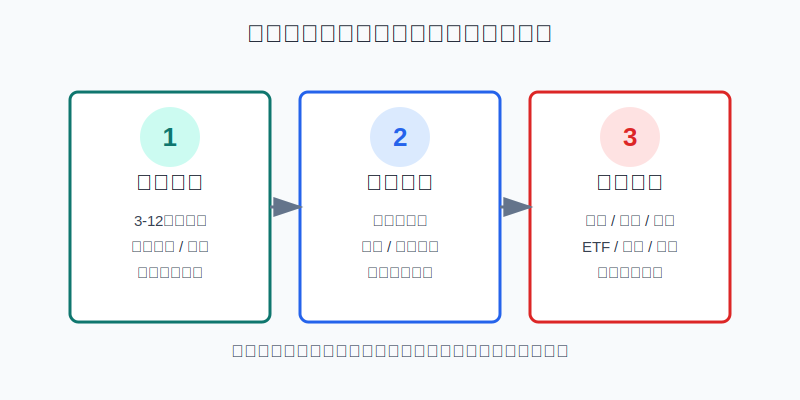
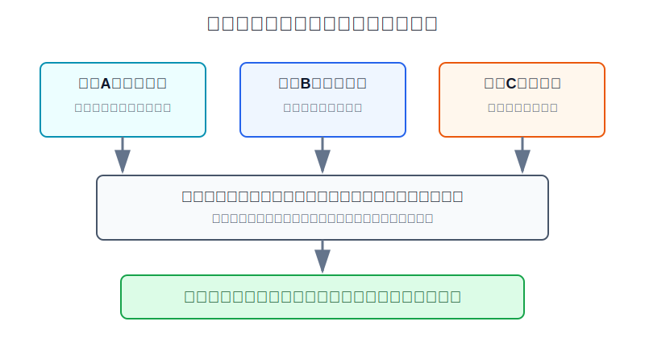
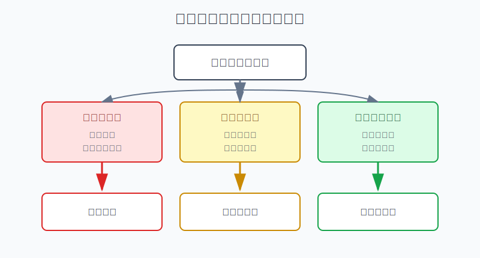

## 散户投资小白金融全品种操盘手册 - 15.2 三层账户法 - 生活资金、防守资金、进攻资金
  
### 作者  
digoal  
  
### 日期  
2026-06-07   
  
### 标签  
金融产品 , 金融工具 , 散户 , 投资小白 , 全品操盘手册  
  
----  
  
## 背景 
  

> 适用读者: 已经明白“仓位错比方向错更伤人”，但还不知道一笔钱到底该放现金、债券、ETF还是股票的小白投资者。  
> 本文定位: 投资教育框架，不构成个性化投资建议。

## 先问一个反直觉的问题

很多人亏大钱，不是因为买错了一只基金，而是因为**把下个月要用的钱、三年不用的钱、愿意试错的钱，放进了同一个账户**。账户一混，市场一跌，生活就会逼你在最不该卖的时候卖出。

## 核心概念: 三层账户不是三张银行卡，而是三种用途

三层账户法，说白了就是先问“这笔钱承担什么任务”，再问“它应该买什么”。生活资金负责不断粮，防守资金负责抗回撤，进攻资金才负责赚波动。

生活资金，是未来3到12个月确定要用的钱。比如房租、房贷、生活费、学费、医疗备用金。它的第一目标不是收益，而是随时能取、不会大幅亏损。适合放在活期、存款、货币基金、现金管理类工具里。

防守资金，是暂时不用、但不能承受大幅亏损的钱。它像组合里的减震器，收益可以低一点，但不能和股票一起剧烈下跌。它可以对应短债基金、同业存单指数基金、低波动现金管理、部分中短久期债券工具。久期可以简单理解为债券价格对利率变化的敏感度，久期越长，利率变化时价格波动通常越大。

进攻资金，是即使短期浮亏20%-30%，也不会影响生活的钱。它才适合放到宽基ETF、行业ETF、个股、可转债、黄金、REITs、美股ETF等波动资产里。进攻资金不是“全部拿去冒险”，而是用规则承担风险，赚取风险补偿。

本节行动结论先放在前面: **小白做仓位管理，第一步不是挑收益最高的产品，而是先把家庭金融资产切成三层。生活资金先补到最低线，防守资金再补到安全线，剩下的钱才进入进攻账户。任何时候，生活资金不能被拿去抄底，防守资金不能被拿去翻本，进攻资金亏损不能反向侵蚀前两层。**

## 逻辑推导链

【论证链标题】: 因为生活支出有刚性、风险资产会阶段性大跌、人在压力下会被迫卖出，所以散户必须先用三层账户隔离用途，再谈品种和收益。

── 第一步: 前提陈述

前提A: 生活支出是刚性的。这是常量。房租、房贷、饭钱、孩子学费、老人看病，不会因为你的基金跌了20%就自动暂停。它像每个月都要交的水电费，不管市场心情好不好，都要付。

前提B: 风险资产会出现阶段性大回撤。这是常量。股票、行业ETF、REITs、黄金、转债都不是直线上涨。它们像天气，长期有四季，短期有暴雨。

前提C: 收入、家庭支出和市场环境会变。这是变量。裁员、降薪、创业现金流断档、家人生病、房贷压力、市场熊市，都可能同时出现。最麻烦的不是“市场跌”，而是“市场跌的时候你刚好要用钱”。

前提D: 散户在现金紧张时会做反向操作。这是行为偏差。上涨时觉得现金浪费，下跌时又因为急用钱被迫卖出。它像开车没留刹车距离，平路没感觉，一遇到急弯就出事。

── 第二步: 逻辑推导

由A可得: 因为生活支出不会等市场恢复，所以生活资金不能进入高波动资产。否则你买的不是长期资产，而是在拿账单时间和市场波动赌博。

由A+B可得: 因为风险资产会阶段性下跌，而生活支出又必须支付，所以如果所有钱都放在进攻资产里，一旦回撤遇到用钱，就会被迫卖在低点。

再由A+B+C可得: 因为收入和支出也会变化，所以不能只按“现在不急用钱”来设计仓位。正确做法是先留生活账户，再留防守账户，最后才把剩余资金放入进攻账户。

最后由A+B+C+D可得: 因为人在现金紧张时很难保持理性，所以三层账户不是心理安慰，而是防止生活风险、市场风险和情绪风险互相传染的隔离墙。

── 第三步: 正常情景下的操作结论

✅ 正常情景: 你有稳定收入，没有短期大额支出，家庭负债可控，投资资金不影响生活。

对应操作: 先把3到6个月必要开支放入生活账户；如果收入不稳定、家庭责任重或有房贷，生活账户提高到6到12个月。再用防守账户承接低波动资产，覆盖未来1到3年中等确定性的支出和组合缓冲。最后，剩余资金才进入进攻账户，并按后续章节设置单品种上限、止损和再平衡。

── 第四步: 数据和案例证实

证据1: 美联储《Report on the Economic Well-Being of U.S. Households in 2025》（2026年5月发布）显示，2025年只有63%的美国成年人表示可以用现金、储蓄或下期账单能还清的信用卡来覆盖400美元应急支出；同一报告的储蓄与投资章节显示，55%的成年人有能覆盖三个月支出的应急储蓄。这个数据对应前提A和C: 即使是成熟金融市场，家庭现金缓冲也不是天然充足的，生活账户必须先建。

证据2: FRED 收录的 S&P 500 日度收盘数据来自 S&P Dow Jones Indices。2020年2月19日，S&P 500 收于3386.15点；2020年3月23日收于2237.40点，约23个交易日下跌33.9%。2022年1月3日，S&P 500 收于4796.56点；2022年10月12日收于3577.03点，跌幅约25.4%。这个数据对应前提B: 宽基指数已经比个股分散，但仍会出现足以击穿情绪和现金流的回撤。

证据3: 中国人民银行2025年第二季度城镇储户问卷调查在全国50个城市调查2万户城镇储户，结果显示，倾向于“更多储蓄”的居民占63.8%，倾向于“更多投资”的居民占12.9%。这个数据不是在说储蓄一定比投资好，而是说明居民面对不确定性时会自然提高防守需求。若没有事先分层，防守需求会在市场下跌时突然挤压进攻仓位。

失败案例: 2020年3月全球市场急跌时，许多长期资产的逻辑没有在一个月内全部消失，但有现金流压力的人无法等逻辑修复，只能卖出。这个失败不一定来自选错标的，而是来自账户用途错配: 未来几个月要用的钱，被放进了必须承受多年波动的资产里。

历史不代表未来。上面数据仍有参考价值，是因为它们验证的是结构规律: 家庭支出有刚性，市场回撤会反复出现，现金缓冲不足会把长期投资变成被迫交易。

── 第五步: 前提变化时的替代结论

若前提C变差，也就是收入不稳定、准备换工作、家里有大额支出、房贷压力上升，推导路径变为: 因为现金流风险提高，所以生活账户要从3到6个月提高到6到12个月，防守账户比例也要上调。新结论: 暂停新增进攻仓，先补现金和低波动资产。

若前提B变强，也就是市场进入高波动、估值过热、连续大跌或你持有的进攻仓超过计划，推导路径变为: 因为回撤会扩大，所以进攻账户不能继续膨胀。新结论: 按目标仓位再平衡，把超出的进攻资金转回防守账户。

若前提A被破坏，也就是你已经动用生活资金买股票、买行业ETF或补仓亏损品种，推导路径变为: 因为账单资金暴露在市场波动里，所以投资系统已经失控。新结论: 停止加仓，卖出一部分流动性好的资产，先恢复生活账户最低线。

若前提D出现，也就是你开始想“先借一点钱抄底”“先把生活费放进去搏一把”“跌这么多肯定会反弹”，推导路径变为: 因为情绪已经越过账户边界，所以继续交易会把小亏变成生活风险。新结论: 当天不新增交易，只做账户分层和复盘。

## 实操例子: 30万元家庭金融资产如何分三层

这个例子对应论证链的正常结论: **先把生活和防守账户补齐，再让进攻账户承担波动。**

假设小陈家庭有30万元金融资产，每月必要支出1.2万元，包括房租、吃饭、交通、保险和基本赡养支出。夫妻一方收入稳定，另一方收入有波动。未来一年没有确定买房计划，但可能有3万元左右的医疗或家庭支出。

第一步，先算生活账户。因为月必要支出是1.2万元，且家庭收入不是完全稳定，所以生活账户不能只留3个月。按6个月计算，小陈要留下7.2万元。这个钱不参与抄底，放在活期、存款、货币基金或流动性强的现金管理工具里。判断依据对应前提A: 生活支出是刚性的。

第二步，建立防守账户。未来一年可能有3万元家庭支出，再加上组合抗波动缓冲，小陈可以把8万元放入防守账户。工具选择以低波动、流动性和规则清晰为第一标准，例如短债基金、同业存单指数基金、期限匹配的存款或现金管理工具。判断依据对应前提C: 支出和收入会变，防守账户负责吸收这些变化。

第三步，确定进攻账户上限。30万元减去7.2万元生活账户，再减去8万元防守账户，剩余14.8万元才是进攻资金。这个钱可以按后续章节分配到宽基ETF、行业ETF、可转债、黄金或海外资产，但不能一次性满仓单一品种。判断依据对应前提B: 风险资产会回撤。

第四步，写明账户边界。生活账户低于7.2万元时，所有新增投资暂停，工资先补生活账户。防守账户低于6万元时，进攻账户不加仓。进攻账户盈利后，如果超过全账户55%，要转一部分回防守账户；进攻账户亏损后，不能从生活账户抽钱补仓。

第五步，前提切换时调整。如果小陈失业或收入下降，生活账户目标从6个月提高到12个月，也就是14.4万元，进攻账户要相应降低。如果市场下跌30%，但生活账户和防守账户都完整，小陈不需要被迫卖出，可以按原计划做再平衡。如果他当初把30万元全买成股票ETF，遇到急用3万元时，就只能在市场价格不受自己控制的时候卖出。

如果操作错误，后果很清楚。生活资金被拿去补仓，市场继续跌，账单照样来；防守资金被拿去追热门行业，行业回撤时组合没有减震器；进攻资金亏损后再去侵蚀生活账户，投资亏损就会升级成家庭现金流问题。

## 可复用框架

【三层隔离】

适用前提: 你有可投资资金，但还没有清楚区分短期要用、中期备用、长期进攻的钱。

核心逻辑: 因为生活支出刚性、风险资产会跌、现金流会变化，所以先按用途隔离，再选择产品。

操作步骤:

1. 生活层: 先留3到6个月必要支出；收入不稳定或家庭责任重，提高到6到12个月。
2. 防守层: 覆盖1到3年中等确定性支出和组合缓冲，选择低波动、流动性清楚的工具。
3. 进攻层: 只用剩余资金承担权益、转债、黄金、REITs、海外资产等波动。
4. 边界线: 前两层未达标，不新增进攻仓；进攻仓亏损，不向前两层要钱。

前提失效时: 收入变差、家庭支出增加、市场波动扩大时，先提高生活层和防守层，降低进攻层。

举一反三: 这个框架可以用于ETF组合、个股仓位、港美股配置、可转债组合，也可以用于家庭买房前后的资金安排。

【先用途后产品】

适用前提: 你看到一个产品收益不错，但不知道该不该买。

核心逻辑: 因为产品收益必须服从资金用途，所以先给钱贴标签，再匹配工具。

操作步骤:

1. 问期限: 这笔钱3个月、1年、3年内是否要用。
2. 问亏损: 这笔钱短期亏10%、20%、30%会不会影响生活。
3. 问流动性: 需要用钱时，能不能不亏大钱地取出来。
4. 问边界: 买入后是否会挤占生活账户或防守账户。

前提失效时: 只要这笔钱有确定用途，就不能放进高波动进攻资产；只要亏损会影响生活，就不能把它当进攻资金。

举一反三: 买黄金、REITs、行业ETF、美股ETF、个股之前，都先用这个框架判断“这笔钱属于哪一层”。

## 本节行动清单

| 动作 | 合格标准 |
|---|---|
| 统计必要支出 | 写出每月刚性支出金额，不把娱乐消费混进去 |
| 补生活账户 | 至少3到6个月必要支出，收入不稳则6到12个月 |
| 建防守账户 | 覆盖1到3年备用支出和组合减震需求 |
| 划进攻账户 | 只用前两层之外的钱买高波动资产 |
| 写边界规则 | 生活账户不足时暂停加仓，进攻亏损不动生活钱 |
| 每月检查一次 | 工资到账后先补缺口，再考虑新增投资 |
| 每次大跌复盘 | 先看三层是否完整，再谈要不要抄底 |

## 一句话总结

三层账户法的核心不是把钱分散到更多产品，而是把生活、防守、进攻三种任务隔离开；先保证生活不被市场绑架，再让进攻资金承担该承担的波动。

## 参考资料

- Federal Reserve Board: Report on the Economic Well-Being of U.S. Households in 2025 - Executive Summary, 2026年5月，https://www.federalreserve.gov/publications/2026-economic-well-being-of-us-households-in-2025-executive-summary.htm
- Federal Reserve Board: Report on the Economic Well-Being of U.S. Households in 2025 - Savings and Investments, 2026年5月，https://www.federalreserve.gov/publications/2026-economic-well-being-of-us-households-in-2025-savings-investments.htm
- FRED, Federal Reserve Bank of St. Louis: S&P 500 (SP500), 数据来源为 S&P Dow Jones Indices LLC，https://fred.stlouisfed.org/series/SP500
- 中国人民银行城镇储户问卷调查制度说明，国家统计局部门统计调查项目，2025年1月27日，https://www.stats.gov.cn/fw/bmdcxmsp/bmzd/202501/t20250127_1958486.html
- 新华财经: 央行二季度城镇储户问卷调查报告，2025年7月29日，https://www.cnfin.com/hb-lb/detail/20250729/4276705_1.html

> ⚠️ **声明**：本文内容为投资教育目的，所有历史数据、策略框架均为辅助学习工具，不构成证券投资建议。市场有风险，投资需谨慎。实际操作请结合自身风险承受能力，必要时咨询专业投顾。
  
#### [PostgreSQL 解决方案集合](../201706/20170601_02.md "40cff096e9ed7122c512b35d8561d9c8")
  
  
#### [德哥 / digoal's Github - 公益是一辈子的事.](https://github.com/digoal/blog/blob/master/README.md "22709685feb7cab07d30f30387f0a9ae")
  
  
#### [About 德哥](https://github.com/digoal/blog/blob/master/me/readme.md "a37735981e7704886ffd590565582dd0")
  
  

  
