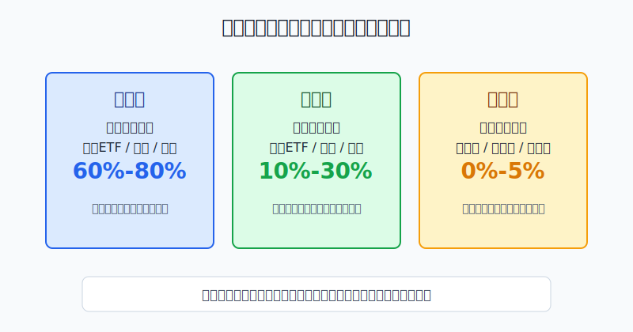
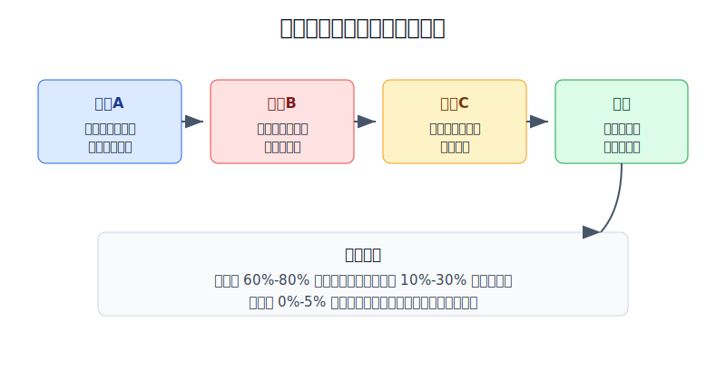
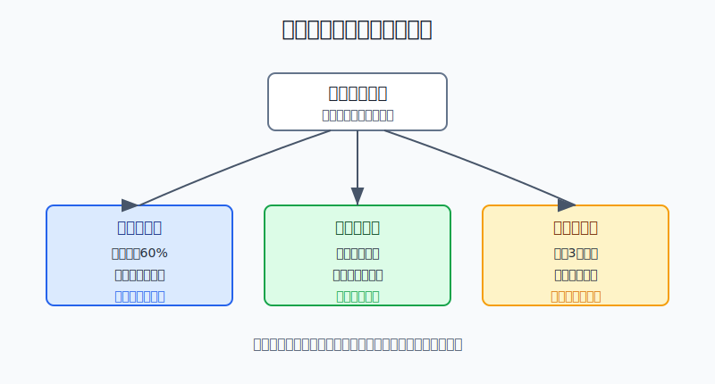

## 散户投资小白金融全品种操盘手册 - 15.3 核心仓、卫星仓、试错仓
  
### 作者  
digoal  
  
### 日期  
2026-06-07   
  
### 标签  
金融产品 , 金融工具 , 散户 , 投资小白 , 全品操盘手册  
  
----  
  
## 背景 
  

> 适用读者: 已经知道要做仓位管理，但账户里同时有宽基ETF、行业ETF、个股、转债、黄金和新策略，不知道每一笔钱该承担什么任务的小白投资者。  
> 本文定位: 投资教育框架，不构成个性化投资建议。

## 先问一个反直觉的问题

很多人亏钱不是因为买错了一个品种，而是因为**把所有品种都当成同一种仓位**。本来只是想试试，最后变成重仓；本来应该长期持有，跌了两天就割肉。仓位分层，就是先给每笔钱贴任务标签。

## 核心概念: 三层仓位不是三类产品，而是三种任务

核心仓，是组合的地基。它负责长期目标，比如养老、子女教育、家庭资产长期增值。它通常用宽基ETF、指数基金、债券基金、现金管理、黄金等流动性好、规则清楚、能长期解释的工具承载。

卫星仓，是在核心仓之外表达主动判断。比如你认为红利风格更适合当下，或者研究过某个行业ETF、某只个股、某类REITs。它可以提高弹性，但必须承认自己会看错。

试错仓，是专门买经验的钱。新策略、新品种、新市场、新交易规则，都先放在试错仓。它的目标不是赚钱，而是用小损失换真反馈。

本节行动结论先放在前面: **长期投资资金先把核心仓做到60%-80%；卫星仓控制在10%-30%；试错仓控制在0%-5%，单个试错不超过1%-2%。核心仓没打好、三年内要用钱、或者连续说不清复盘时，卫星仓和试错仓都要暂停。**

## 逻辑推导链

【论证链标题】: 因为长期结果主要来自资产配置，而主动判断和学习能力都不稳定，所以小白必须先按任务分层，再按上限买入。

── 第一步: 前提陈述

前提A: 长期组合结果主要受资产配置影响。这是常量。资产配置，就是把钱分到股票、债券、现金、黄金、海外资产等不同篮子里。SEC 在投资者教育材料中把资产配置解释为把投资组合分到股票、债券、现金等资产类别，并强调合适组合取决于投资期限和风险承受能力。对小白来说，核心仓就是这个资产配置的主战场。

前提B: 集中押注会放大不可控亏损。这是常量。FINRA 2022年关于集中风险的文章提醒，组合里很大一部分集中在某项投资、某类资产或某个市场板块时，亏损会被放大；它还建议投资者在主要资产类别之间和资产类别内部都做分散。

前提C: 小白的主动判断和交易纪律尚未验证。这是变量。你看懂一篇研报，不等于能长期选对资产；你这次抄底成功，不等于下次能忍住不追高。试错仓存在的意义，就是把“我想学”限制在可承受范围内。

前提D: 不同任务需要不同卖出规则。这是常量。核心仓卖出看长期目标和再平衡；卫星仓卖出看逻辑是否还成立；试错仓卖出看实验是否失败。如果三种仓位混在一起，最后会变成涨了想加、跌了想扛、亏了说长期。

── 第二步: 逻辑推导

由A可得: 因为长期结果主要受资产配置影响，所以最大的一笔钱必须放在能长期解释、能长期持有、能覆盖多种市场情景的核心仓，而不是放在某个热点主题里。

由A+B可得: 因为核心仓承担家庭长期目标，集中押注又会放大亏损，所以卫星仓只能是“表达判断”的小比例仓位，不能反过来挤占核心仓。

再由B+C可得: 因为小白的判断能力还没有用多年记录验证，所以任何新策略、新品种、新市场都只能先进入试错仓。试错仓的亏损上限必须提前写死，否则学习会变成重仓赌博。

最后由A+B+C+D可得: **先分核心仓、卫星仓、试错仓，再买具体产品。买入顺序是: 先核心仓达标，再开卫星仓，最后才允许小额试错。**

── 第三步: 正常情景下的操作结论

✅ 正常情景: 你已经留足生活备用金；这笔长期投资资金三年以上不用；核心仓已有宽基ETF、债券或现金管理等底座；卫星仓和试错仓都有清楚上限。

对应操作: 核心仓设为60%-80%，负责长期持有和再平衡；卫星仓设为10%-30%，每个主题、行业或个股都写买入理由和失效条件；试错仓设为0%-5%，单个实验不超过1%-2%，连续3次复盘说不清或亏损超预算就清零。

── 第四步: 数据和案例证实

证据1: Vanguard 2026年的 core-satellite 解释材料指出，核心仓通常承载大部分投资，目标是提供广泛市场暴露，常由低成本、高度分散的指数基金组成；卫星仓则服务特定投资需求，可以是风险更高、追求更高收益或针对行业、地区、主题的投资。这个证据对应前提A和D: 核心仓和卫星仓的任务本来就不同。

证据2: S&P Dow Jones Indices 的 SPIVA U.S. Scorecard Year-End 2025 显示，截至2025年12月31日，美国大型主动基金中，78.78%在1年期跑输S&P 500，85.59%在10年期跑输，89.93%在15年期跑输，92.89%在20年期跑输。这个证据对应前提C: 连专业主动基金长期跑赢指数都很难，小白不能把卫星仓当成默认核心。

证据3: Hendrik Bessembinder 2020年论文《Wealth Creation in the U.S. Public Stock Markets 1926 to 2019》统计了1926-2019年美国上市普通股，发现57.8%的股票相对短期国库券减少了股东财富，但美国股票市场整体仍创造了47.4万亿美元净财富。这个证据对应前提A和B: 宽基核心仓的价值，是让你不必提前猜出少数大赢家。

证据4: Morningstar《Mind the Gap 2024》显示，截至2023年12月31日的10年里，基金投资者年化收益为6.3%，而其基金持仓本身年化收益约7.3%，差距主要来自买卖时点；其中配置型基金的差距最窄，为-0.4个百分点，行业股票基金差距最宽，为-2.6个百分点。这个证据对应前提C和D: 越窄、越刺激、越像卫星或试错的东西，越容易被情绪买卖拖累。

失败案例: 把试错仓做成核心仓。比如一个小白本来只想拿1万元试试AI主题基金，看到连续上涨后追加到总资产40%。如果随后主题回撤30%，总资产直接损失12%；这时他很难冷静复盘，反而会在“长期看好”和“马上割肉”之间来回摇摆。失败点不在于AI主题一定不好，而在于前提C失效: 他的判断能力和持有纪律没有通过验证，却给了它核心仓待遇。

历史不代表未来。上面数据仍有参考价值，是因为它们验证的是结构规律: 资产配置决定底座，集中风险放大错误，主动判断难以稳定验证，频繁追热点会扩大实际收益和理论收益之间的差距。

── 第五步: 前提变化时的替代结论

若前提A改变，也就是核心仓低于60%，或者你还没有宽基、现金、债券等基础配置，推导路径变为: 因为长期目标没有地基，所以任何卫星仓和试错仓都会变成对家庭资产的额外冲击。新结论: 暂停主动判断，新增资金先补核心仓。

若前提B变差，也就是某个卫星主题上涨后占比超过30%，或者多个基金底层都重仓同一行业，推导路径变为: 因为集中风险已经超出原计划，所以上涨不是继续加仓的理由。新结论: 再平衡，把超出部分转回核心仓或现金。

若前提C变差，也就是试错仓连续3次亏损、连续3次复盘说不清、或者你开始用“再等等”替代规则，推导路径变为: 因为试错已经失去实验边界，所以它不再是学习，而是情绪交易。新结论: 试错仓清零，至少暂停一个月，只做纸面复盘。

若资金用途变化，例如两年内要买房、还债、留学或创业备用，推导路径变为: 因为资金期限从长期变成中短期，所以核心仓里的权益资产比例也要下降。新结论: 增加现金、货币基金、短债等低波动资产，停止新增卫星和试错。

## 实操例子: 20万元长期资金怎么分三层

这个例子对应论证链的正常结论: **先核心仓达标，再开卫星仓，最后才允许小额试错。**

假设小林有20万元长期投资资金，已经留足6个月生活费，未来三年不用这笔钱。他想同时配置A股宽基ETF、美股QDII、黄金、红利ETF、半导体ETF和一套网格策略。

第一步，先建核心仓。小林把14万元设为核心仓，占70%。其中8万元放宽基ETF或全球指数基金，3万元放债券基金或短债，2万元放黄金ETF，1万元留作现金管理。这个动作对应前提A: 长期组合先要有能跨周期解释的底座。

第二步，再开卫星仓。小林把4万元设为卫星仓，占20%。其中2万元给红利ETF，1万元给半导体ETF，1万元留给研究成熟的个股或REITs。每一笔都写清楚买入理由、观察指标和失效条件。这个动作对应前提B: 主动判断可以有，但不能挤占核心仓。

第三步，最后设试错仓。小林只拿1万元做试错仓，占5%。他想测试网格策略，就先用4000元；想学习可转债，就用3000元；剩余3000元不急着用。单个实验不超过总资产2%。这个动作对应前提C: 新东西先买经验，不买重仓收益幻想。

第四步，写再平衡规则。每季度看一次，如果核心仓跌到65%以下，新增资金先补核心仓；如果卫星仓涨到25%以上，停止追买；如果试错仓亏损超过2000元，暂停全部实验并复盘。

如果操作错误，后果很清楚。小林若把半导体ETF从1万元加到8万元，占总资产40%，它就不再是卫星仓，而是伪装成观点的核心仓。一旦行业回撤25%，组合直接损失10%。这不是“行业波动大”这么简单，而是仓位任务错位。

## 可复用框架

【三层先行】

适用前提: 你准备买入多个品种，但还没有统一仓位结构。

核心逻辑: 因为长期目标、主动判断和学习实验的稳定性不同，所以先分任务，再买产品。

操作步骤:

1. 核心仓: 60%-80%，只放能长期解释、流动性好、规则清楚的资产。
2. 卫星仓: 10%-30%，只表达少数主动判断，每笔有上限和失效条件。
3. 试错仓: 0%-5%，单个实验1%-2%，亏损或说不清就停。

前提失效时: 核心仓不足时，不开卫星和试错；卫星仓超限时，再平衡；试错仓连续失败时，清零并回到学习。

举一反三: 这个框架可以用于A股、港股、美股、ETF、转债、黄金、REITs和商品基金。

【任务卖出】

适用前提: 你已经持有某个品种，不知道该长期拿、减仓还是清仓。

核心逻辑: 因为不同仓位任务不同，所以卖出规则不能混用。

操作步骤:

1. 核心仓: 只因目标变化、风险承受能力变化或再平衡而调整。
2. 卫星仓: 买入逻辑失效、超出上限或底层重叠时减仓。
3. 试错仓: 实验失败、复盘说不清或亏损触线时清仓。

前提失效时: 如果你说不清一笔持仓属于哪一层，先把它归为卫星仓；如果连买入理由都说不清，归为试错仓并降到试错上限内。

举一反三: 同一只ETF在不同人手里可以是不同仓位。宽基ETF可以是核心仓，半导体ETF通常是卫星仓，第一次尝试网格的ETF仓位就是试错仓。

## 本节行动清单

| 动作 | 合格标准 |
|---|---|
| 给每笔持仓贴标签 | 核心仓、卫星仓、试错仓三选一，不能空着 |
| 核心仓先达标 | 长期资金中核心仓先做到60%-80% |
| 卫星仓有上限 | 合计10%-30%，单个主题或个股不挤占核心仓 |
| 试错仓买经验 | 合计0%-5%，单个实验1%-2%，亏损触线就停 |
| 每季度看偏离 | 核心仓不足先补，卫星仓超限先降 |
| 写不同卖出规则 | 核心看再平衡，卫星看逻辑，试错看实验结果 |

## 一句话总结

核心仓让你留在市场里，卫星仓让你表达少数判断，试错仓让你用小钱买经验；三层仓位的本质，是不让学习和观点伤到长期目标。

## 参考资料

- Vanguard Investments Australia: What is a core-satellite portfolio? 2026年，https://www.vanguard.com.au/adviser/content/dam/intl/australia/shared/documents/resources/Vanguard-What-is-a-core-satellite-portfolio.pdf
- U.S. SEC: Beginners' Guide to Asset Allocation, Diversification, and Rebalancing，2009年8月27日，https://www.sec.gov/about/reports-publications/investorpubsassetallocationhtm
- FINRA: Concentrate on Concentration Risk，2022年6月15日，https://www.finra.org/investors/insights/concentration-risk
- S&P Dow Jones Indices: SPIVA U.S. Scorecard Year-End 2025，数据截至2025年12月31日，https://www.spglobal.com/spdji/en/documents/spiva/spiva-us-year-end-2025.pdf
- Hendrik Bessembinder: Wealth Creation in the U.S. Public Stock Markets 1926 to 2019，SSRN，2020年，https://papers.ssrn.com/sol3/papers.cfm?abstract_id=3537838
- Morningstar: Mind the Gap 2024，数据截至2023年12月31日，https://www.morningstar.com/content/cs-assets/v3/assets/blt9415ea4cc4157833/bltebc45c862e642793/6759e563cbd7d6cef415ac94/Mind_the_Gap_2024.pdf

> ⚠️ **声明**：本文内容为投资教育目的，所有历史数据、策略框架均为辅助学习工具，不构成证券投资建议。市场有风险，投资需谨慎。实际操作请结合自身风险承受能力，必要时咨询专业投顾。
  
#### [PostgreSQL 解决方案集合](../201706/20170601_02.md "40cff096e9ed7122c512b35d8561d9c8")
  
  
#### [德哥 / digoal's Github - 公益是一辈子的事.](https://github.com/digoal/blog/blob/master/README.md "22709685feb7cab07d30f30387f0a9ae")
  
  
#### [About 德哥](https://github.com/digoal/blog/blob/master/me/readme.md "a37735981e7704886ffd590565582dd0")
  
  

  
