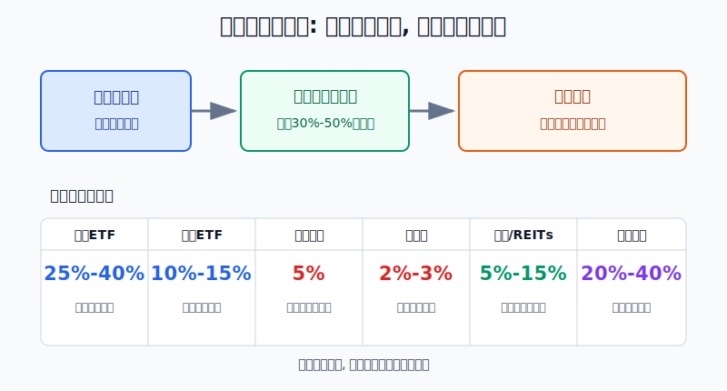
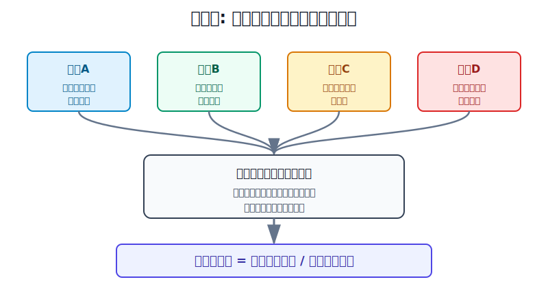
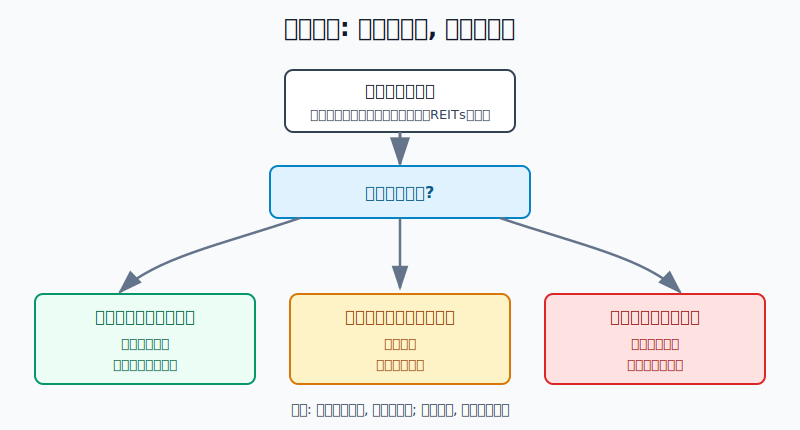

## 散户投资小白金融全品种操盘手册 - 15.4 单品种仓位上限 - ETF、个股、转债、黄金、REITs、美股分别怎么设
  
### 作者  
digoal  
  
### 日期  
2026-06-07   
  
### 标签  
金融产品 , 金融工具 , 散户 , 投资小白 , 全品操盘手册  
  
----  
  
## 背景 
  

> 适用读者: 已经知道“不要满仓”，但不知道每类工具到底该放多少的小白投资者。  
> 本文定位: 投资教育框架，不构成个性化投资建议。

## 先问一个反直觉的问题

仓位上限不是问“我有多看好它”，而是问: **如果它突然跌30%、50%，我的组合还能不能继续活着。** 真正成熟的仓位管理，不是把最看好的东西买到最大，而是先限制单个错误能造成的伤害。

## 核心概念: 上限是防火墙，不是目标仓位

单品种仓位上限，就是某一个风险来源最多占你总投资资金的比例。注意，这里说的是“风险来源”，不只是证券代码。

比如你买了两只沪深300 ETF，名字不同，底层指数高度相同，它们要合并计算。你买了纳斯达克100 ETF、美国科技行业ETF、又买了几只大型科技股，看起来是三类产品，实际上很多风险都来自同一批美国科技公司，也要合并看。你买黄金ETF、黄金基金、纸黄金，账户里显示三行，本质上仍是黄金价格风险。

本节行动结论先放前面: **小白不要从收益想象设仓位，而要从最大可承受亏损反推上限。默认规则是: 宽基ETF可做核心但同类合并；行业ETF和主题ETF控制在10%-15%；单只个股默认5%；单只可转债2%-3%；黄金总仓位5%-15%；REITs总仓位5%-10%，激进也不要超过15%；美股资产总仓位20%-40%，单只美股仍按个股上限处理。**

这些数字是“上限”，不是“必须买满”。如果你看不懂品种规则、短期要用钱、账户回撤已经接近承受线，上限还要继续下调。

## 逻辑推导链

【论证链标题】: 因为散户账户能承受的回撤有限，而每个品种都有独立风险和压力情景，所以仓位上限必须用“错了会亏多少”反推，而不能用“我有多看好”决定。

── 第一步: 前提陈述

前提A: 账户能承受的亏损是有限的。这是常量。亏10%后回本需要涨约11.1%，亏30%后回本需要涨约42.9%，亏50%后回本需要涨100%。亏得越深，回本坡度越陡。

前提B: 不同工具的风险形态不同。这是常量。宽基ETF像一篮子菜，坏一颗菜不至于毁掉整篮；单只个股像押一家店，店出了问题就直接伤到账户；可转债同时受股票、债券和信用影响；黄金受实际利率、美元和避险情绪影响；REITs受经营现金流、利率和流动性影响；美股还叠加汇率、税务和海外规则。

前提C: 压力情景下，很多资产会一起跌。这是变量。平时黄金、股票、REITs、海外资产看起来不完全同步，但流动性紧张或市场恐慌时，投资者会一起卖出，相关性会上升。

前提D: 小白很难提前选中长期大赢家。这是常量偏难题。少数股票创造了大量长期财富，但事前选中它们很难；所以单只个股不能替代组合。

── 第二步: 逻辑推导

由A可得: 因为账户承受力有限，所以任何单一品种都不能让一次判断错误造成不可修复的回撤。

由A+B可得: 因为不同品种的压力跌幅不同，所以仓位上限不能一刀切。压力跌幅越大、规则越复杂、流动性越差，上限越低。

再由A+B+C可得: 因为压力时资产可能一起下跌，所以不能只看平时波动，也不能以为“买了多个名字”就一定分散。风险同源时，必须合并计算。

最后由A+B+C+D可得: 因为散户无法稳定预判哪一个品种会成为长期赢家，所以仓位上限的核心不是限制收益，而是限制错误。**先保住组合，再让正确判断慢慢起作用。**

── 第三步: 正常情景下的操作结论

✅ 正常情景: 你是普通散户，资金不是职业交易资金；未来一年内不能接受超过15%-20%的组合回撤；没有稳定、可复盘的选股或择时系统。

对应操作: 先给组合设总回撤预算，再给单项错误设损失预算。小白可以把“单一风险来源造成的组合损失”控制在总资金的2%-4%以内。用公式反推:

**单品种上限 = 允许单项亏损 ÷ 压力情景跌幅。**

如果某个品种在压力情景下可能跌40%，而你只允许它给组合造成3%的损失，那么上限就是3% ÷ 40% = 7.5%。实际执行时向下取整，设为5%-7%更稳。

── 第四步: 数据和案例证实

证据1: SEC 的投资者教育材料《Beginners' Guide to Asset Allocation, Diversification, and Rebalancing》提醒，资产配置和分散化可以帮助降低重大损失风险；Investor.gov 也提醒，基金和ETF不一定天然分散，尤其是聚焦单一行业的产品。这对应前提B和C: 买了ETF不等于风险已经分散，关键要看底层资产是否同源。

证据2: Hendrik Bessembinder 在《Do Stocks Outperform Treasury Bills?》中研究1926年以来美国普通股数据，发现约七分之四的普通股生命周期收益低于一个月期国债；从财富创造看，表现最好的约4%上市公司解释了美国股市相对国债的净财富增长。这对应前提D: 个股长期收益高度集中，事前押中少数赢家很难，因此单只个股默认上限应低。

证据3: Nareit 的年度指数数据记录，FTSE Nareit All Equity REITs 在2008年的总回报约为-37.73%。这对应前提B: REITs有现金流和分红，但上市REITs不是存款，也不是债券替代品，压力情景下回撤可以很大。

证据4: Gold.de 的历史金价数据记录，美元计价黄金在2013年年度表现约为-28.58%；World Gold Council 的收益数据库也持续发布黄金和主要资产的历史收益数据。这对应前提B: 黄金是防守资产，但不是保本资产。它能对冲部分货币和风险偏好变化，却仍会出现年度级别的较大下跌。

失败案例: 一个散户把“高分红REITs安全”“黄金避险”“美股科技长期强”理解成可以重仓，于是分别买了30% REITs、25%黄金、30%纳斯达克和科技股。账户表面上有很多品种，实际暴露在利率、流动性和风险偏好上。若遇到利率上行、美元走强、风险资产调整，多个仓位可能同时亏损。失败点不在于这些资产不能买，而在于没有把单一风险来源的上限先写死。

历史不代表未来。上面数据仍有参考价值，是因为它们验证的是结构规律: 个股赢家很集中，ETF可能同源，REITs和黄金都有大回撤，压力情景会放大集中仓位的伤害。

── 第五步: 前提变化时的替代结论

若前提B变好，也就是品种是低费率、流动性好、覆盖面宽的核心宽基ETF，推导路径变为: 因为单一公司风险已经被摊薄，所以它可以承担核心仓功能。新结论: 同一市场的宽基ETF合计可以到25%-40%，但同一指数、同一风格要合并计算。

若前提B变差，也就是品种变成单只个股、单只转债、单只REIT、主题ETF或高溢价跨境ETF，推导路径变为: 因为独立风险、流动性风险和估值风险上升，所以仓位必须下调。新结论: 单只个股默认5%，单只转债2%-3%，主题或行业ETF10%-15%，高溢价跨境ETF先不买或只做观察仓。

若前提C变强，也就是市场恐慌、汇率大幅波动、利率快速上行、QDII或跨境ETF溢价明显、REITs成交低迷，推导路径变为: 因为退出成本上升，所以不能加仓摊低成本。新结论: 先把仓位降到上限以内，再谈是否等待修复。

若前提A改变，也就是你未来一年要买房、换工作、家庭现金流不稳定，推导路径变为: 因为账户承受力下降，所以所有风险资产上限都要下调。新结论: 现金和短债优先，进攻型仓位减半。

## 实操例子: 10万元账户怎么设单品种上限

这个例子对应论证链的正常结论: **先确定单项错误最多伤害组合多少，再反推每个工具能买多少。**

假设小林有10万元投资资金，生活钱已经单独放好。他能接受组合最大回撤15%，但不希望任何一个品种单独造成超过3%的组合损失，也就是3000元。

第一步，宽基ETF。小林准备买沪深300或中证A500这类宽基ETF。宽基覆盖面较广，单一公司风险低，但权益市场整体下跌时仍可能回撤30%以上。按3000元 ÷ 30% = 10000元，单只宽基ETF可设10%左右；如果是核心宽基组合，分散到A股宽基、美股宽基、债券或现金防守后，权益宽基合计可以更高，但同一指数产品不能重复算分散。

第二步，行业ETF。小林想买半导体ETF。行业ETF比宽基更窄，压力情景按40%回撤估算，3000元 ÷ 40% = 7500元。执行时设为5%-8%，最高不超过10%-15%。如果已经持有大量科技股或纳斯达克100，半导体ETF还要继续下调，因为风险同源。

第三步，单只个股。小林看好一家公司。单只个股遇到业绩不及预期、监管变化、竞争恶化时，跌50%并不稀奇。3000元 ÷ 50% = 6000元，所以默认买入上限设为5%，也就是5000元。只有连续复盘、基本面跟踪能力提升后，才考虑把极少数高信念个股提高到8%-10%，但这不是小白默认规则。

第四步，可转债。单只转债看起来有债底，但仍有正股下跌、溢价率收缩、信用恶化和强赎条款风险。小林把单只转债设为2%-3%，也就是2000-3000元；如果做可转债组合，分散10只以上，整体仓位可以到10%-15%，但不能用一只低价转债重仓赌反弹。

第五步，黄金和REITs。黄金不生息，适合做风险对冲，不适合当短线重仓工具。小林把黄金总仓位设为5%-10%，极端不确定时期也不超过15%-20%。REITs有分红，但利率上行和项目经营变差时会回撤，小林把REITs总仓位设为5%-10%，单只REIT不超过3%。

第六步，美股。小林通过QDII或跨境ETF配置美股。美股不是一个单品种，而是一组海外权益风险，还叠加汇率和产品溢价。若买的是标普500这类宽基，美股总仓位可以设为20%-30%；若集中在纳斯达克100、AI、半导体和单只科技股，就按行业ETF和个股规则重新合并，不能因为账户显示“海外资产”就放大到一半以上。

如果前提不成立，操作要切换。比如小林的半导体ETF从8%涨到14%，不是因为他更懂行业，而是价格上涨导致超上限。他要做的不是再追，而是把新增资金投向低相关资产，或分批减到上限以内。若某只个股跌到买入理由失效，不能因为仓位只有5%就无视风险，价格止损和逻辑止损仍要执行。

如果操作错误，后果很清楚。10万元账户若单只个股买到30%，遇到50%下跌，组合直接亏15%，已经吃掉全部回撤预算；后面就算其他资产没错，心理和资金都会被这一笔拖住。

## 可复用框架

【反推上限】

适用前提: 你不知道某个品种该买多少，但能大致估计它在压力情景下的跌幅。

核心逻辑: 因为账户先有可承受亏损，再有仓位，所以用允许亏损除以压力跌幅，反推出仓位上限。

操作步骤:

1. 写出组合最大可承受回撤，比如15%。
2. 写出单一风险来源最多可造成的组合亏损，比如2%-4%。
3. 估计品种压力跌幅: 宽基ETF按30%，行业ETF按40%，单只个股按50%，黄金按30%，REITs按40%，单只转债按30%-50%。
4. 用“允许单项亏损 ÷ 压力跌幅”计算上限。
5. 结果向下取整，复杂品种继续打折。

前提失效时: 如果你说不清品种为什么会跌、最大可能跌多少、怎么退出，就不要用公式硬算，直接降到观察仓或不买。

举一反三: 这个框架也适用于港股、小盘股、商品基金、期权买方和任何高波动工具。

【同源合并】

适用前提: 你持有多个名字不同、但底层风险相近的资产。

核心逻辑: 因为压力情景下同源资产会一起跌，所以分散要看底层风险，不看账户行数。

操作步骤:

1. 把持仓按风险来源分组: A股宽基、A股行业、单只个股、转债、黄金、REITs、美股宽基、美股科技、现金债券。
2. 同一指数、同一行业、同一地区、同一主题合并计算仓位。
3. 合并后超过上限的，不再加仓。
4. 用新增资金补低相关资产，或分批减到上限以内。

前提失效时: 如果一个ETF持仓高度集中，或者跨境ETF溢价很高，即使名字叫ETF，也按窄基或主题工具处理。

举一反三: 这个框架还可以用在“核心仓、卫星仓、试错仓”的划分里，防止卫星仓悄悄变成主仓。

## 本节行动清单

| 动作 | 合格标准 |
|---|---|
| 写总回撤预算 | 明确组合最大可承受回撤，比如15%-20% |
| 写单项亏损预算 | 单一风险来源最多伤害组合2%-4% |
| 同源资产合并 | 同指数、同行业、同主题、同地区一起算 |
| 单只个股封顶 | 默认5%，高信念也先不超过10% |
| 单只转债分散 | 单只2%-3%，组合才谈10%-15% |
| 黄金设为防守仓 | 总仓位5%-15%，不做短线重仓赌博 |
| REITs不当存款 | 总仓位5%-10%，单只不超过3% |
| 美股看双风险 | 同时检查权益风险、汇率风险和产品溢价 |
| 超上限先停止加仓 | 用新增资金再平衡，必要时分批减仓 |

## 一句话总结

单品种仓位上限的本质，是把“我看好什么”翻译成“我看错时最多亏多少”；上限写清楚，组合才不会被一次错误拖垮。

## 参考资料

- SEC: Beginners' Guide to Asset Allocation, Diversification, and Rebalancing, https://www.sec.gov/investor/pubs/assetallocation.htm
- Investor.gov: Asset Allocation and Diversification, 2026年访问, https://www.investor.gov/introduction-investing/getting-started/assessing-your-risk-tolerance
- FINRA: Asset Allocation and Diversification, 2026年访问, https://www.finra.org/investors/investing/investing-basics/asset-allocation-diversification
- Hendrik Bessembinder: Do Stocks Outperform Treasury Bills?, Journal of Financial Economics / SSRN, 2018年修订, https://papers.ssrn.com/sol3/papers.cfm?abstract_id=2900447
- Nareit: Annual Index Values & Returns, 2026年访问, https://www.reit.com/data-research/reit-indexes/annual-index-values-returns
- Gold.de: Goldpreis 2013 in US Dollar, 2026年访问, https://www.gold.de/kurse/goldpreis/entwicklung/2013/
- World Gold Council: Gold Price Returns, 数据截至2026年5月22日, https://www.gold.org/goldhub/data/gold-returns

> ⚠️ **声明**：本文内容为投资教育目的，所有历史数据、策略框架均为辅助学习工具，不构成证券投资建议。市场有风险，投资需谨慎。实际操作请结合自身风险承受能力，必要时咨询专业投顾。
  
#### [PostgreSQL 解决方案集合](../201706/20170601_02.md "40cff096e9ed7122c512b35d8561d9c8")
  
  
#### [德哥 / digoal's Github - 公益是一辈子的事.](https://github.com/digoal/blog/blob/master/README.md "22709685feb7cab07d30f30387f0a9ae")
  
  
#### [About 德哥](https://github.com/digoal/blog/blob/master/me/readme.md "a37735981e7704886ffd590565582dd0")
  
  

  
