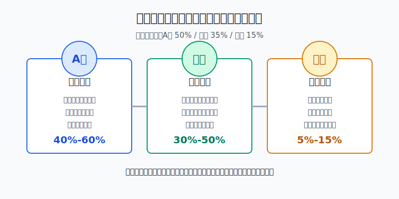
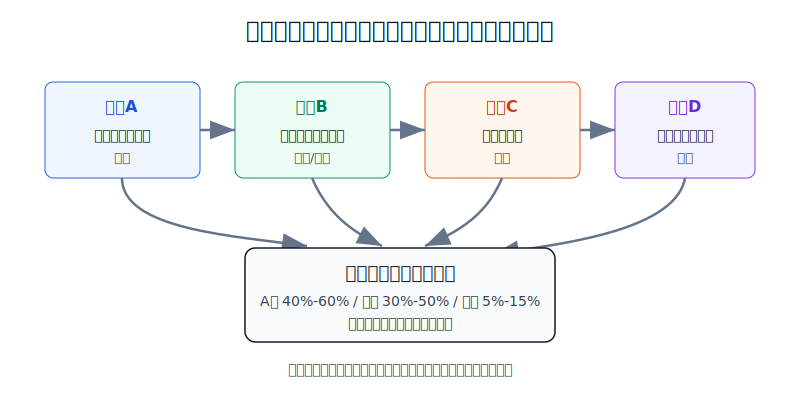
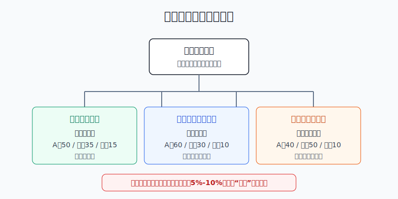

## 散户投资小白金融全品种操盘手册 - 15.5 A股、美股、港股之间如何分配
  
### 作者  
digoal  
  
### 日期  
2026-06-07   
  
### 标签  
金融产品 , 金融工具 , 散户 , 投资小白 , 全品操盘手册  
  
----  
  
## 背景 
  

> 适用读者: 已经有 ETF 或基金账户，想把股票仓分到 A股、美股、港股，但不知道比例怎么定的小白投资者。  
> 本文定位: 投资教育框架，不构成个性化投资建议。

## 先问一个反直觉的问题

三地股票分配，最危险的做法不是“没有买到最强市场”，而是**把三地当成收益率比赛**。今年谁涨得多就多买谁，明年谁跌得多就嫌弃谁，最后组合变成追涨记录本。

真正的分配问题只有一句话: **你愿意把多少股票风险放在人民币本土市场，多少放在美元全球龙头，多少放在港股这个离岸中国补充仓？**

## 核心概念: 先分股票仓，再分三地

这一节讨论的是**股票仓内部比例**，不是你的全部家庭资产。比如你有30万元可投资资金，先根据第十五章前几节决定“股票仓最多放15万元”，然后才讨论这15万元里面 A股、美股、港股怎么分。生活备用金、短期要用的钱、债券、黄金，不应该被这节的比例吞掉。

小白先记住三个角色。

A股是本币核心。它和你的人民币收入、人民币支出、国内政策和产业周期更近。它不是一定更稳，而是和你的生活币种更匹配。

美股是全球增长仓。标普500、纳斯达克100这类工具让你接触美元资产、全球龙头和科技创新，但同时带来美元汇率、估值偏高、科技权重集中等风险。

港股是补充卫星。港股里有很多中国互联网、金融、消费、资源和香港本地公司，估值常常看起来便宜，但便宜不等于会立刻上涨。港股还叠加港币、美元利率、海外资金风险偏好和离岸流动性。

本节行动结论先放在前面: **普通小白可以把股票仓分成 A股40%-60%、美股30%-50%、港股5%-15% 三个区间；不知道怎么开始时，用 A股50%、美股35%、港股15% 作为学习模板。比例不是收益预测，而是风险预算。每年检查一次，超出区间再平衡。**

## 逻辑推导链

【论证链标题】: 因为 A股、美股、港股承担的是不同风险，而家庭最终用钱币种和交易成本不同，所以三地分配应该用比例区间和再平衡，而不是用短期涨跌排名。

── 第一步: 前提陈述

前提A: 三地股票的风险来源不同。这是常量。A股更贴近人民币资产、国内政策和内需周期；美股更贴近美元资产、全球龙头和科技权重；港股更像离岸中国资产和国际资金情绪的交叉口。它们像三种交通工具，都是车，但路况、速度和刹车距离不同。

前提B: 多数中国散户的工资、房贷、家庭支出和养老目标仍以人民币为主。这是常量，但个人会不同。如果未来明确有美元学费、海外生活或外币负债，前提就会改变。

前提C: 三地市场的强弱会轮动。这是变量。一个市场连续几年领先，不代表下一年仍领先；一个市场估值便宜，也不代表马上修复。短期收益排名不能直接变成长期仓位比例。

前提D: 跨市场交易有成本和限制。这是变量。QDII额度、跨境ETF溢价、港股通汇率换算、海外账户规则、分红税和交易时间，都会影响实际执行。小白越是频繁调仓，越容易把成本、溢价和情绪一起买进去。

── 第二步: 逻辑推导

由A可得: 因为三地股票风险来源不同，所以只买其中一个市场，本质上是在集中押一种风险。只买 A股，是人民币本土市场集中；只买美股，是美元和美国大型科技权重集中；只买港股，是离岸中国和港股流动性集中。

由A+B可得: 因为家庭最终支出多数是人民币，所以 A股不能简单归零。它在组合里的作用不是保证赚钱，而是让股票仓有一块和生活币种、国内资产价格更接近的底座。

再由A+B+C可得: 因为美股代表全球龙头和美元资产，长期值得配置；但如果仓位过高，组合就会被美元、美国估值和科技集中度牵着走。所以美股适合作为第二核心，而不是让小白把所有股票仓都押到单一海外市场。

再由A+C+D可得: 因为港股可能提供估值修复和中国资产弹性，但波动、流动性和规则更复杂，所以港股更适合做补充仓。补充仓的正确姿势是有上限，而不是因为“便宜”就越跌越补。

最终由A+B+C+D可得: **三地分配应该写成区间: A股40%-60%、美股30%-50%、港股5%-15%。区间内不折腾，超出区间用新增资金和年度再平衡纠偏。**

── 第三步: 正常情景下的操作结论

✅ 正常情景: 这笔钱三年以上不用，生活备用金已经留好，主要支出仍是人民币，想用股票仓同时参与中国本土市场、美国全球龙头和港股补充机会。

对应操作: 先确定股票仓总额，再按 A股50%、美股35%、港股15% 建一个起始模板。之后每年检查一次。如果美股因为上涨和美元顺风变成股票仓50%以上，就暂停继续加美股，用新增资金补 A股或防守资产；如果港股跌到10%以下，先检查港股前提是否还成立，再决定是否补回，不自动抄底。

── 第四步: 数据和案例证实

证据1: MSCI ACWI 指数事实单页显示，截至2026年5月29日，MSCI ACWI 覆盖23个发达市场和24个新兴市场、2513只成分股，约覆盖全球可投资股票机会集的85%；其中美国权重为63.5%。这说明美股在全球股票市场里确实是核心，但也说明全球市值权重本身已经高度偏向美国，不能把“全球分散”误解成“只买美股”。

证据2: S&P Dow Jones Indices 的 S&P 500 事实单页显示，截至2026年5月29日，S&P 500 覆盖约80%的美国可投资市值；2022年总回报为-18.11%，2023年为+26.29%，2024年为+25.02%，2025年为+17.88%；前十大成分股权重为39.3%，市盈率为28.45倍。这个证据对应美股的双重特点: 它是强大的全球核心资产，但也有估值和头部公司集中风险。

证据3: 中证指数公司沪深300英文事实单页显示，截至2026年5月29日，沪深300由300只规模大、流动性好的 A股组成，目标是反映中国 A股市场整体表现；2022年收益为-21.63%，2023年为-11.38%，2024年为+14.68%，2025年为+17.66%，市盈率 TTM 为14.62倍。这个证据说明 A股不是“没有波动的本币资产”，但它提供了和美股不同的估值、政策和人民币资产暴露。

证据4: 恒生指数公司事实单页显示，截至2026年4月，恒生指数有90只成分股，并设置8%权重上限；恒生指数近1年上涨16.53%，但5年年化收益为-2.14%，1年年化波动率为18.47%，市盈率为14.08倍。这个证据说明港股可以反弹，也可能长时间低迷，所以它适合做卫星仓，不适合小白重仓赌估值修复。

失败案例: 2021年至2023年，很多投资者因为港股互联网和中概资产“比美股便宜很多”而持续加仓，但低估值遇到监管、地产、美元利率和海外资金风险偏好变化时，估值修复可以迟到很久。如果没有上限，补仓会从策略变成扛单。这个反例说明: 便宜只是港股仓位存在的理由之一，不是无限加仓的理由。

历史数据不代表未来。上面数据仍有参考价值，是因为它们验证的是结构事实: 美股全球权重大但集中，A股和人民币生活更接近但波动不低，港股便宜时也可能长期低迷。三地分配不是为了保证收益，而是为了不让单一市场决定整个股票仓命运。

── 第五步: 前提变化时的替代结论

若前提B改变，也就是未来两年内有确定人民币大额支出，推导路径变为: 因为短期人民币用钱不能承受股票和汇率双重波动，所以第一动作不是调整 A股、美股、港股比例，而是降低股票仓总额。新结论: 股票仓内部可以偏向 A股，例如 A股60%、美股30%、港股10%，但更重要的是把要用的钱移到现金、货币基金或短债。

若前提B反向改变，也就是未来有明确美元支出，推导路径变为: 因为美元支出需要美元资产匹配，所以美股或美元现金的比例可以提高。新结论: 股票仓可用 A股40%、美股50%、港股10% 的模板，但仍要给美股估值和科技集中风险设上限。

若前提D改变，也就是跨境ETF出现明显高溢价、QDII限购、港股通成本不友好，推导路径变为: 因为执行成本会吞掉分配收益，所以不要为了凑比例硬买。新结论: 暂停买入高溢价工具，用新增资金先补可交易、低成本的部分，等成本回落再恢复目标比例。

若前提C在港股上失效，也就是港股低估值长期没有转化为盈利改善和资金回流，推导路径变为: 因为估值修复逻辑没有兑现，所以港股不能继续按15%上限补。新结论: 港股降到5%-10%，保留观察仓，不让它拖垮股票仓。

## 实操例子: 20万元账户怎么分三地股票

这个例子对应论证链的正常结论: **长期资金、主要人民币支出、三地都有配置价值时，用比例区间建立股票仓。**

假设小陈有20万元可投资资金，生活备用金已经单独留好，未来三年没有确定大额支出。他根据自己的承受能力，决定股票仓上限是总资金的60%，也就是12万元。剩下8万元放在现金管理、债券基金和黄金等防守资产里。

第一步，先分股票仓，而不是一上来分全部20万元。小陈写下: “股票仓=12万元，最大回撤按30%压力测试，股票仓亏损3.6万元时仍能执行计划。”这一步对应前提B: 先确认这笔钱真的是长期风险资金。

第二步，在股票仓内部用基础模板。12万元按 A股50%、美股35%、港股15% 分配，就是 A股6万元、美股4.2万元、港股1.8万元。A股用宽基ETF或主流指数基金做本币核心；美股用标普500或全市场类工具做全球增长仓；港股用宽基或互联网、红利等明确风格工具做卫星仓。

第三步，写触发线。A股低于40%或高于60%，美股低于30%或高于50%，港股低于5%或高于15%，才需要检查是否再平衡。没有越界，只记录，不交易。这一步对应前提D: 交易有成本，不能天天为了小偏离折腾。

第四步，用新增资金优先纠偏。假设一年后美股涨得多，美股从4.2万元变成6万元，A股仍是6万元，港股跌到1.4万元，股票仓合计13.4万元。比例变成 A股44.8%、美股44.8%、港股10.4%。虽然港股跌了，但还在5%-15%区间内；美股也还没超过50%。小陈不需要卖美股补港股，只记录一次。

第五步，如果继续漂移再动。若后来美股涨到7.5万元，股票仓合计15万元，美股占50%，已经碰到上限。小陈下一笔新增资金不再买美股，而是补 A股或防守资产；如果美股超过55%，再考虑卖出一部分，把它拉回45%左右。动作是降集中度，不是判断美股马上要跌。

如果前提不成立，操作要切换。比如小陈两年后要用10万元装修，股票仓就不能继续维持12万元；先把10万元未来支出划出去，再用剩余长期资金重新计算股票仓。再比如港股工具出现5%以上溢价，小陈不为了凑15%硬买，先把计划写在复盘表里，等待成本正常。

如果操作错误，后果也很清楚。看到美股连续大涨后，小陈把 A股和港股都卖掉，股票仓100%买美股。短期看起来更顺，但组合从“三地风险分散”变成“美元加美国大盘集中”。下一次美元走弱、美国科技估值回落时，他没有第二块股票资产做缓冲，容易在回撤中恐慌卖出。

## 可复用框架

【三地三问】

适用前提: 你已经决定配置股票仓，且可选工具包括 A股、港股、美股ETF或基金。

核心逻辑: 因为三地股票承担不同风险，所以先问角色，再给比例，不按短期涨跌排名买。

操作步骤:

1. 问币种: 未来主要支出是人民币、美元，还是港币。
2. 问角色: A股做本币核心，美股做全球增长，港股做补充卫星。
3. 问上限: A股40%-60%，美股30%-50%，港股5%-15%。
4. 问成本: QDII、跨境ETF、港股通、海外账户成本是否可接受。

前提失效时: 短期要用人民币，先降股票仓；未来有美元支出，提高美元资产匹配；港股逻辑失效，降到观察仓；工具溢价过高，暂停买入。

举一反三: 这个框架也适用于 A股、债券、黄金之间的分配，只是角色要重新定义。

【区间再平衡】

适用前提: 你已经有三地股票仓，但经常因为涨跌想调仓。

核心逻辑: 因为小偏离不值得交易，大偏离会改变风险，所以用区间代替精确比例。

操作步骤:

1. 写目标比例，例如50/35/15。
2. 写允许区间，例如 A股40%-60%、美股30%-50%、港股5%-15%。
3. 每年固定日期计算实际比例。
4. 区间内不交易；越界后先用新增资金纠偏，不够再卖超配部分。

前提失效时: 目标比例不再符合生活阶段时，先重设比例；交易成本明显升高时，用更慢的新增资金再平衡。

举一反三: ETF核心仓、行业卫星仓、黄金防守仓，也可以用目标比例加允许区间管理。

## 本节行动清单

| 动作 | 合格标准 |
|---|---|
| 先定股票仓 | 只拿三年以上不用的钱进入股票仓 |
| 写三地角色 | A股本币核心，美股全球增长，港股补充卫星 |
| 设起始模板 | 不知道怎么开始，用 A股50%、美股35%、港股15% 学习 |
| 设允许区间 | A股40%-60%，美股30%-50%，港股5%-15% |
| 检查币种 | 未来人民币支出多，就不能过度提高海外股票 |
| 检查工具成本 | QDII限购、ETF溢价、港股通成本异常时不硬买 |
| 年度再平衡 | 每年一次，优先用新增资金纠偏 |

## 一句话总结

A股、美股、港股之间的分配，不是押谁明年最强，而是把人民币本土风险、美元全球龙头风险、港股离岸中国风险分别装进有上限的仓位里。

## 参考资料

- MSCI: MSCI ACWI Index (USD) Factsheet, May 29, 2026, https://www.msci.com/documents/10199/255599/msci-acwi-net.pdf
- S&P Dow Jones Indices: S&P 500 (USD) Factsheet, May 29, 2026, https://www.spglobal.com/spdji/en/indices/equity/sp-500/
- China Securities Index Co., Ltd.: CSI 300 Index Factsheet, May 29, 2026, https://oss-ch.csindex.com.cn/static/html/csindex/public/uploads/indices/detail/files/en/000300factsheeten.pdf
- Hang Seng Indexes: Hang Seng Index Factsheet, April 2026, https://www.hsi.com.hk/static/uploads/contents/en/dl_centre/factsheets/hsie.pdf

> ⚠️ **声明**：本文内容为投资教育目的，所有历史数据、策略框架均为辅助学习工具，不构成证券投资建议。市场有风险，投资需谨慎。实际操作请结合自身风险承受能力，必要时咨询专业投顾。
  
#### [PostgreSQL 解决方案集合](../201706/20170601_02.md "40cff096e9ed7122c512b35d8561d9c8")
  
  
#### [德哥 / digoal's Github - 公益是一辈子的事.](https://github.com/digoal/blog/blob/master/README.md "22709685feb7cab07d30f30387f0a9ae")
  
  
#### [About 德哥](https://github.com/digoal/blog/blob/master/me/readme.md "a37735981e7704886ffd590565582dd0")
  
  

  
