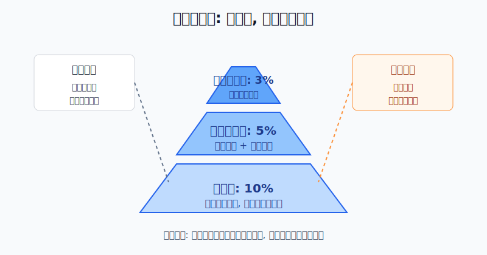
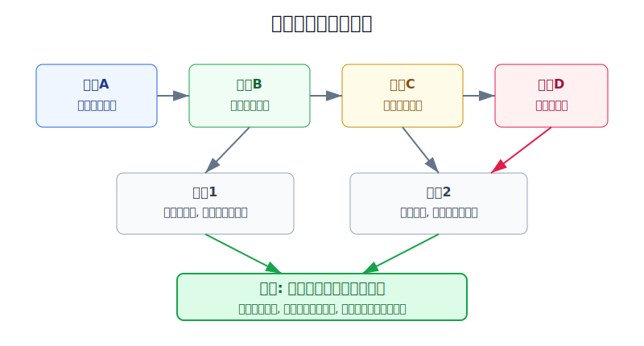
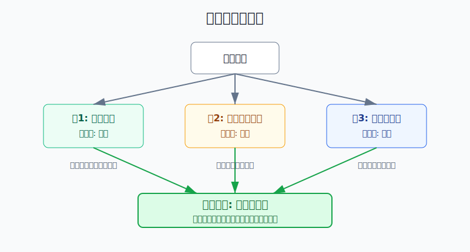

## 散户投资小白金融全品种操盘手册 - 15.6 金字塔加仓 - 只在盈利和逻辑增强时加
  
### 作者  
digoal  
  
### 日期  
2026-06-07   
  
### 标签  
金融产品 , 金融工具 , 散户 , 投资小白 , 全品操盘手册  
  
----  
  
## 背景 
  

> 适用读者: 已经知道单品种仓位上限，但一遇到上涨就想追、一遇到下跌就想补仓的小白投资者。  
> 本文定位: 投资教育框架，不构成个性化投资建议。

## 先问一个反直觉的问题

很多人以为高手敢加仓，是因为更有胆量。真实情况相反: **合格的加仓不是胆子变大，而是证据变强；不是亏了补救，而是赚了以后只加更小一笔。**

## 核心概念: 金字塔加仓不是“越亏越买”

金字塔加仓，就是先用一笔基础仓试错，等市场价格和投资逻辑都证明你没有看错，再追加更小的一笔；如果之后继续被验证，再加更小的一笔。它像盖金字塔: 底座最大，越往上越小，不能头重脚轻。

这里有一个关键区别:

- **正金字塔**: 先买10%，盈利后加5%，再盈利且逻辑增强后加3%。风险是逐级收紧的。
- **倒金字塔**: 先买10%，亏了再补20%，再亏继续补30%。看起来成本降了，实际是把错误越养越大。

本节行动结论先放在前面: **只有同时满足“已有盈利、逻辑增强、总仓位不超上限”三件事，才允许加仓；只满足价格上涨、不满足逻辑增强，不加；价格下跌但想摊低成本，更不叫金字塔加仓。**

## 逻辑推导链

【论证链标题】: 因为加仓会放大风险暴露，所以只有当已有盈利提供缓冲、投资逻辑继续增强、并且仓位仍在上限内时，金字塔加仓才是风险管理动作；否则就是情绪加码。

── 第一步: 前提陈述

前提A: 仓位大小决定看错时亏多少钱，这是常量。同样跌10%，1万元仓位亏1000元，5万元仓位亏5000元。方向判断很重要，但真正决定伤口大小的是仓位。

前提B: 已有盈利说明市场已经给了第一层验证，这是变量。它不代表未来一定继续涨，但至少说明你的第一笔仓位没有立刻被市场否定。盈利像安全垫，能为下一笔小仓位提供一部分缓冲。

前提C: 投资逻辑会增强，也会变弱，这是变量。宽基ETF的逻辑可能来自市场环境改善、趋势确认、估值仍未过热；个股的逻辑可能来自业绩兑现、现金流改善、竞争优势加强。只涨不等于逻辑增强。

前提D: 散户天然容易“卖掉赚钱的，抱住亏钱的”，这是常见行为偏差。它像种树时把长得好的枝条剪掉，却给枯枝不断浇水。没有规则时，人最容易把金字塔加仓做反。

── 第二步: 逻辑推导

由A可得: 因为每一次加仓都会放大组合波动，所以加仓前必须先问“如果这笔新增仓位错了，我亏得起吗”，而不是先问“如果涨了我能多赚多少”。

由A+B可得: 因为已有盈利说明第一笔判断获得了阶段性验证，又因为盈利可以吸收一部分回撤，所以加仓只能发生在盈利之后。亏损状态下继续买入，不是金字塔加仓，而是补仓；补仓需要另一套更严格的估值和止损逻辑。

再由B+C可得: 因为价格盈利只证明市场暂时站在你这边，不能证明基本逻辑仍然成立，所以还要看第二个条件: 新证据是否让原逻辑更强。宽基ETF可以看趋势、估值、流动性和风险偏好是否配合；个股可以看业绩、订单、现金流、负债和行业格局是否配合。

最后由A+B+C+D可得: 因为人性会让你在盈利时急着落袋、在亏损时不愿认错，所以必须把加仓写成机械规则。**正常的金字塔加仓，是用更小的新增仓位奖励被验证的判断；错误的加仓，是用更大的本金拯救未被验证的执念。**

── 第三步: 正常情景下的操作结论

✅ 正常情景: 第一笔仓位已经盈利；买入理由没有削弱，反而出现了新的验证；加仓后该品种仍不超过你的仓位上限；新增仓位小于上一笔仓位。

对应操作: 先定基础仓，再定触发线，再定每次加仓比例。小白可以用一个保守模板: 初始仓10%，第一次加仓5%，第二次加仓3%，同一主题或单只个股不超过事先写好的上限。每次加仓后，重新计算平均成本、最大回撤、卖出条件和下一次是否还能加。

── 第四步: 数据和案例证实

证据1: Jegadeesh 和 Titman 1993年发表于《Journal of Finance》的论文《Returns to Buying Winners and Selling Losers》研究美国股票后发现，过去3到12个月表现较好的股票，在之后3到12个月仍能产生显著正收益。这个结论不是让小白追任何上涨，而是说明一件事: 市场中确实存在“强者继续强一段时间”的现象，价格强势不能简单等同于泡沫。

证据2: Hurst、Ooi、Pedersen 2017年的《A Century of Evidence on Trend-Following Investing》把趋势跟随研究扩展到1880年以来的全球市场，结论包括时间序列动量在每个十年都取得正的平均收益，并且在10个最大60/40股债组合危机期中的8个表现较好。它验证的是“趋势延续”这个结构性现象，但也提醒我们: 研究对象是规则化、分散化策略，不是单票满仓追涨。

证据3: Odean 1998年发表于《Journal of Finance》的论文《Are Investors Reluctant to Realize Their Losses?》分析一家大型折扣券商约10000个账户交易记录，发现全年盈利实现比例PGR为0.148，亏损实现比例PLR为0.098。也就是说，投资者更愿意卖掉赚钱头寸，更不愿卖掉亏钱头寸。这个数据对应前提D: 没有规则时，小白很容易剪掉赢家、留下输家。

失败案例: SEC在2022年4月27日对Archegos及其创始人的指控中提到，Archegos从2020年3月约15亿美元价值、100亿美元敞口，扩张到2021年3月高峰时超过360亿美元价值、1600亿美元敞口，之后造成数十亿美元损失。这个案例不是普通散户交易，也涉及监管指控和复杂衍生品，但它给散户的教训很简单: 盈利后不断放大集中仓位和杠杆，一旦突破风险上限，就不是金字塔加仓，而是风险失控。

历史不代表未来。上面的研究和案例仍有参考价值，是因为它们分别验证了三件底层事实: 趋势在统计上会延续一段时间，散户确实容易反向操作，超上限加仓会把一次判断变成组合事故。

── 第五步: 前提变化时的替代结论

若前提B改变，也就是第一笔没有盈利，推导路径变为: 因为市场没有验证你的判断，所以新增仓位只会放大未验证风险。新结论: 不加仓，先检查买入理由是否仍成立；若理由失效，按止损或减仓规则处理。

若前提C改变，也就是价格上涨但逻辑变弱，推导路径变为: 因为利润来自价格波动，逻辑却没有跟上，所以加仓会把浮盈变成对运气的依赖。新结论: 不加仓，只持有或部分止盈。

若前提A改变，也就是加仓后会突破单品种或单主题上限，推导路径变为: 因为组合承受不了该品种反向波动，所以即使盈利和逻辑增强也不能继续加。新结论: 停止加仓，等待再平衡或寻找其他低相关资产。

反例/失败路径: 亏损后摊低成本。买入价10元，跌到8元，觉得“更便宜”就加倍买，平均成本降到8.67元；如果逻辑已经坏了，价格再跌到6元，亏损不是变小，而是因为仓位更大变成更深。这个动作叫倒金字塔，不叫金字塔。

## 实操例子: 10万元账户如何给宽基ETF做金字塔加仓

这个例子对应论证链的正常结论: **盈利、逻辑增强、仓位不超上限，三道门全过，才加更小一笔。**

假设小林有10万元投资资金，其中生活备用金已经单独放好。他给一只宽基ETF设定的最高仓位是30%，也就是最多3万元。本轮市场环境判断是: 估值没有明显过热，指数重新站上中期均线，成交活跃度改善，但他不确定行情能走多远。

第一步，先买基础仓，不一次打满。小林在ETF价格1.000元时买入1万份，花1万元，占总资金10%。这一步对应前提A: 判断刚开始，只放基础仓，让错误有控制空间。

第二步，写下第一次加仓条件。条件不是“涨了就买”，而是三句话: ETF价格比买入价上涨至少6%；指数没有跌回关键趋势线下方；市场环境没有从风险偏好改善切回明显避险。三条同时满足，才加5000元。

第三步，第一次加仓。ETF涨到1.060元，仍符合趋势和环境条件，小林买入约4717份，花5000元。此时总投入1.5万元，平均成本约1.019元。新增仓位小于第一笔，这对应“金字塔越往上越小”。

第四步，写下第二次加仓条件。ETF继续上涨到1.120元附近，并且第一次加仓后的总持仓仍处于盈利；同时估值没有进入明显过热区，市场成交和风险偏好仍然支持原逻辑。满足后，只加3000元。

第五步，第二次加仓。小林在1.120元买入约2679份，花3000元。总投入1.8万元，仍低于3万元上限。到这里，他已经完成“10%基础仓 + 5%第一次加仓 + 3%第二次加仓”的教学版金字塔，不再因为兴奋临时追加到30%。

第六步，写错了怎么办。若ETF跌破1.060元后又跌回1.020元附近，说明最后一次加仓的验证消失，小林先撤回3000元新增仓位，而不是继续补。如果ETF跌破初始买入逻辑，比如重新跌回趋势线下方、市场环境转弱，他按整笔持仓规则减仓或退出。

如果前提不成立，操作立即切换。ETF从1.000元跌到0.940元，小林不加仓，因为没有盈利缓冲；ETF涨到1.060元，但市场风险偏好突然转弱，小林也不加仓，因为价格上涨没有得到逻辑确认；ETF已经持有到3万元上限，即使继续涨，也只复盘不追买。

如果操作错误，后果很清楚。小林若在0.940元、0.900元、0.860元连续补仓，平均成本会下降，但总风险会快速上升。一旦市场继续下跌，他亏的不是“便宜筹码”，而是越来越大的仓位。

## 可复用框架

【三门加仓】

适用前提: 你已有持仓，并且准备在原方向上继续增加风险暴露。

核心逻辑: 因为加仓会放大亏损，所以必须让盈利、逻辑、上限三道门同时通过。

操作步骤:

1. 盈利门: 当前持仓整体盈利，或至少第一笔基础仓盈利达到预设触发线。
2. 逻辑门: 买入理由出现新验证，而不是只有价格上涨。
3. 上限门: 加仓后仍不突破单品种、单行业、单市场的仓位上限。
4. 缩小门: 新增仓位必须小于上一笔仓位。

前提失效时: 任意一道门不过，不加仓；已经加仓后逻辑失效，先撤回最新一笔新增仓位。

举一反三: 这个框架可用于宽基ETF、行业ETF、个股、黄金ETF和可转债组合，但不适合期货、裸期权等高杠杆工具的小白实盘。

【赢后再加】

适用前提: 你容易在亏损时补仓，或者在盈利时急着卖掉全部赢家。

核心逻辑: 因为市场先给盈利，才说明第一层判断被验证，所以加仓只能奖励赢家，不能拯救输家。

操作步骤:

1. 先写初始仓位，比如10%。
2. 再写盈利触发线，比如宽基ETF盈利6%，个股盈利8%-10%。
3. 再写逻辑验证项，比如趋势、估值、业绩、现金流、行业景气度。
4. 最后写新增比例，比如5%、3%，每次递减。

前提失效时: 持仓亏损时不使用这个框架；要补仓必须重新做估值、基本面和止损分析，不能借用“金字塔加仓”的名字。

举一反三: 年度组合再平衡也可以借鉴这个思路: 对被验证的资产增加一点权重，对失效的资产先问逻辑，而不是只看账面盈亏。

## 本节行动清单

| 动作 | 合格标准 |
|---|---|
| 写基础仓 | 第一笔仓位不超过该品种上限的一半 |
| 写盈利触发线 | ETF、个股、转债分别写清达到多少盈利才看加仓 |
| 写逻辑验证项 | 至少有一个价格之外的新证据支持原判断 |
| 写加仓比例 | 每次新增仓位小于上一笔，禁止越加越大 |
| 写总仓位上限 | 加仓后仍不突破单品种、单行业、单市场上限 |
| 写撤回规则 | 最新一笔加仓的触发条件消失，先撤回新增仓位 |
| 禁止亏损摊平 | 亏损状态下买入不叫金字塔加仓，必须另写补仓理由 |

## 一句话总结

金字塔加仓的核心不是“涨了就追”，而是用更小的新增仓位奖励已经盈利、逻辑更强、且仍在风险上限内的判断；三道门少一道，都不加。

## 参考资料

- Narasimhan Jegadeesh and Sheridan Titman: Returns to Buying Winners and Selling Losers: Implications for Stock Market Efficiency, Journal of Finance, 1993, https://www.bauer.uh.edu/rsusmel/phd/jegadeesh-titman93.pdf
- Brian Hurst, Yao Hua Ooi, Lasse H. Pedersen: A Century of Evidence on Trend-Following Investing, Journal of Portfolio Management / SSRN, 2017, https://papers.ssrn.com/sol3/papers.cfm?abstract_id=2993026
- Terrance Odean: Are Investors Reluctant to Realize Their Losses?, Journal of Finance, 1998, https://faculty.haas.berkeley.edu/odean/papers%20current%20versions/areinvestorsreluctant.pdf
- U.S. Securities and Exchange Commission: SEC Charges Archegos and its Founder with Massive Market Manipulation Scheme, 2022年4月27日, https://www.sec.gov/newsroom/press-releases/2022-70

> ⚠️ **声明**：本文内容为投资教育目的，所有历史数据、策略框架均为辅助学习工具，不构成证券投资建议。市场有风险，投资需谨慎。实际操作请结合自身风险承受能力，必要时咨询专业投顾。
  
#### [PostgreSQL 解决方案集合](../201706/20170601_02.md "40cff096e9ed7122c512b35d8561d9c8")
  
  
#### [德哥 / digoal's Github - 公益是一辈子的事.](https://github.com/digoal/blog/blob/master/README.md "22709685feb7cab07d30f30387f0a9ae")
  
  
#### [About 德哥](https://github.com/digoal/blog/blob/master/me/readme.md "a37735981e7704886ffd590565582dd0")
  
  

  
