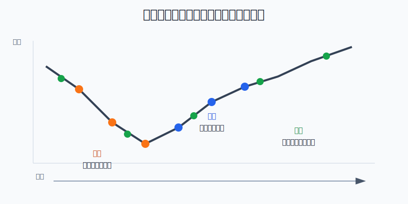
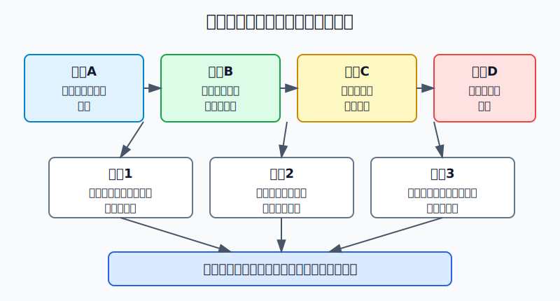
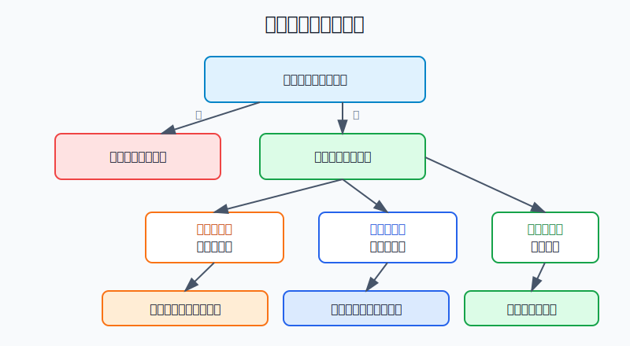

## 散户投资小白金融全品种操盘手册 - 15.7 分批买入 - 左侧、右侧、定投的区别
  
### 作者  
digoal  
  
### 日期  
2026-06-07   
  
### 标签  
金融产品 , 金融工具 , 散户 , 投资小白 , 全品操盘手册  
  
----  
  
## 背景 
  

> 适用读者: 已经知道不能满仓梭哈，但每次买入时仍然纠结“现在买、跌了买、涨了再买、还是每月买一点”的小白投资者。  
> 本文定位: 仓位执行教育，不构成个性化投资建议。

## 先问一个反直觉的问题

分批买入不是为了“买到最低点”。如果你真能稳定买到最低点，就不需要分批。分批买入真正解决的是另一个问题: **在你无法精确择时时，怎样让仓位增长有规则，而不是被恐惧和冲动牵着走。**

## 先把三个词翻译成人话

**左侧买入**，就是价格还在跌，你按预先写好的价格档或估值档慢慢买。它像下楼梯时每隔几级放一个垫子，优点是成本可能更低，缺点是你会越买越亏，看着账户变绿还要继续执行。

**右侧买入**，就是价格已经止跌、重新站回某条趋势线、突破某个压力位，或者基本面坏消息落地后再买。它像等车启动后再上车，优点是少接飞刀，缺点是买入价通常更高。

**定投**，就是固定时间、固定金额买入，不管涨跌。它像每月交房租一样自动执行，优点是纪律强，缺点是遇到长期上涨会比一次性投入少赚，遇到资产逻辑坏掉也不能盲目坚持。

本节行动结论先放在前面: **左侧买逻辑，右侧买确认，定投买纪律。小白不要把三者混用。指数ETF和长期资产更适合定投或轻度左侧；个股左侧补仓必须有更严格的逻辑验证；看不懂的品种，宁可右侧确认后少赚，也不要一路下跌一路加仓。**

## 逻辑推导链

【论证链标题】: 因为最低点不可稳定预测，分批买入必须先匹配资产逻辑、资金来源和心理承受力。

── 第一步: 前提陈述

前提A: 普通投资者无法长期稳定预测最低点。这是常量。最低点像雨停前最后一滴雨，你只有事后才知道它是哪一滴。

前提B: 分批只适用于“长期逻辑仍成立”的资产。这是变量。宽基ETF代表一篮子公司，逻辑坏掉的概率低于单只股票；单只公司如果财务造假、竞争优势消失、行业永久衰退，越跌越买就是把错误放大。

前提C: 留在现金里等待，也有机会成本。这是变量。市场上涨时，拖着不买会错过收益；市场下跌时，现金会给你后手。

前提D: 小白最容易在两种情绪里变形: 下跌时不敢买，上涨时追着买。这是行为变量。分批计划的价值，是把临场情绪提前写成规则。

── 第二步: 逻辑推导

由A+B可得: 因为最低点无法稳定预测，所以不要把全部资金押在一个价格；但因为分批会让你在下跌中继续投入，所以只有资产逻辑没有破坏时，左侧买入才成立。

由A+C可得: 因为现金等待不是无成本，所以如果你的资产配置目标已经明确，长期把钱放在场外等“更好价格”，本质上也是一种择时。

再由A+B+C+D可得: 因为你既不能精准抄底，又不能无限等待，还会被情绪影响，所以分批买入要按前提分工: **能验证长期逻辑并能承受浮亏，用左侧；需要市场先给信号，用右侧；没有判断优势但有长期现金流，用定投。**

── 第三步: 正常情景下的操作结论

✅ 正常情景: 你买的是宽基ETF、优质行业ETF或已经通过研究的核心资产；资金不是短期要用的钱；你愿意提前写出总仓位上限和每批金额。

对应操作: 先定总仓位，再定批次数。左侧买入用“价格/估值触发”，例如每跌5%买一批；右侧买入用“确认信号触发”，例如重新站上20日均线并回踩不破后买一批；定投用“时间触发”，例如每月工资到账后买一批。三种方式只能选主线，不能一跌就说自己是左侧，一涨又临时改成追涨。

── 第四步: 数据和案例证实

证据1: Vanguard 2023年研究比较了成本平均法和一次性投入。用全球市场数据测算，三个月分三批投入的一年后财富表现，落后一次性投入的比例约为68%；但成本平均法也有价值，它相对一直持有现金，在约69%的情形下更好。这个证据对应前提C: 分批不是为了提高长期期望收益，而是为了让害怕一次性投入的人不要长期空仓。

证据2: Charles Schwab 2025年研究做了一个20年模拟: 每年年初拿到2000美元并投资于代表美股的S&P 500，20年截至2024年。结果是完美择时账户约18.6万美元，马上投入约17.1万美元，全年定投约16.7万美元，最差择时也有约15.1万美元，而一直不买股票只有约4.7万美元。这个证据对应前提A和C: 完美择时收益最高，但现实难复制；长期拖延比买点差更伤人。

证据3: FINRA 2026年投资者教育文章说明，定投可以用10000美元资金每月投入1000美元、持续10个月来执行；它能减少冲动决策，也可能在下跌中限制一次性亏损，但因为现金停留更久，长期收益可能低于一次性投入，还可能增加交易费用。这个证据对应前提D: 定投是纪律工具，不是收益魔法。

失败案例: Enron 在2001年申请破产前，SEC投诉材料记载其股价在不到一年里从80美元以上跌到不足1美元。对这种公司做“越跌越买”，不是左侧策略，而是把B前提弄错了: 资产长期逻辑已经破坏，继续加仓只会扩大亏损。

历史不代表未来。上面数据仍有参考价值，是因为它们验证的是长期存在的机制: 市场择时很难、现金有机会成本、定投降低执行难度但不保证盈利、个股逻辑破坏时补仓会放大错误。

── 第五步: 前提变化时的替代结论

若前提B改变，也就是你买的不是宽基ETF，而是基本面恶化的单只股票，推导路径变为: 因为资产逻辑可能已经失效，所以分批不再是摊低成本，而是扩大暴露。新结论: 停止左侧补仓，先做逻辑复核；复核不通过，按止损或减仓规则处理。

若前提C改变，也就是这笔钱三个月后要买房、还债、交学费，推导路径变为: 因为现金用途确定，所以机会成本不再是核心，安全性才是核心。新结论: 不做左侧和右侧加仓，保留现金或低风险工具。

若前提D改变，也就是你下跌10%就睡不着、上涨5%就想加倍，推导路径变为: 因为情绪无法承受浮亏，所以即使资产逻辑成立，也不要重仓左侧。新结论: 改用小额定投或右侧确认，牺牲一点买入价格，换执行稳定。

## 实操例子: 10万元准备买宽基ETF，怎么分批

这个例子对应论证链的正常结论: **先定总仓位和前提，再选择左侧、右侧或定投。**

假设你有10万元投资资金，其中生活备用金已经单独放好，这10万元可以持有三年以上。你准备买某只宽基ETF，目标仓位最多6万元，剩余4万元留作现金和其他品种。

第一步，写总仓位上限: 这只ETF最多6万元，不能因为连续下跌临时加到8万元、10万元。判断依据来自前提B: 分批可以买入资产，但不能让单品种仓位失控。

第二步，如果选左侧买入，规则写成: 现价先买2万元；若指数再跌5%，买第二批1.5万元；再跌5%，买第三批1.5万元；若估值进入历史低位或市场出现极端恐慌，最多补最后1万元。每一批之前都要检查: 指数规则有没有变、ETF规模和流动性有没有恶化、这笔钱是否仍然三年以上不用。只要逻辑复核不通过，下一批暂停。

第三步，如果选右侧买入，规则写成: 先买1万元观察仓；等指数重新站上20日均线并回踩不破，再买2万元；若成交额放大、市场风险偏好恢复，再买2万元；剩下1万元只在突破后回撤不破时加。判断依据来自前提D: 你用更高买入价，换少一点接飞刀的压力。

第四步，如果选定投，规则写成: 6万元分12个月，每月5000元，工资到账后三个交易日内执行。若市场大跌，当月仍然按5000元执行，不临时加到2万元；若市场大涨，当月也不追到1万元。判断依据来自前提A和D: 你承认自己没有择时优势，所以用时间表替代情绪。

如果前提不成立，操作要切换。比如这10万元半年后要用，就不该买入波动资产；比如你买的是一只亏损扩大、负债恶化、审计有疑点的个股，就不能套用宽基ETF的定投方式；比如你连续三次因为恐慌取消买入计划，就说明左侧不适合你，应该改成更小金额的定投或右侧确认。

如果操作错误，后果很清楚。没有总仓位上限，分批会变成越跌越重仓；没有逻辑复核，左侧会变成补亏损个股；没有固定规则，右侧会变成追涨；没有退出条件，定投会变成对错误资产的长期输血。

## 可复用框架

【三问分批】

适用前提: 你准备把一笔钱分几次买入同一类资产。

核心逻辑: 因为分批方式取决于资产逻辑、资金性质和心理承受力，所以先回答三问，再下单。

操作步骤:

1. 问资产: 这是宽基、行业ETF、债券、黄金，还是单只股票？长期逻辑还在不在？
2. 问资金: 这笔钱多久不用？总仓位上限是多少？最坏浮亏能不能承受？
3. 问执行: 你更能忍受“买早了亏一段”，还是“买晚了少赚一段”？

前提失效时: 资产逻辑失效，停止补仓；资金期限变短，停止买入波动资产；心理承受力不足，降低每批金额或改成右侧确认。

举一反三: 这个框架也适用于可转债、黄金ETF、REITs和美股ETF。先看前提，再看买法。

【三类买法】

适用前提: 你已经确定要分批买入，但不知道用哪种节奏。

核心逻辑: 左侧、右侧、定投不是谁更高级，而是服务不同问题。

操作步骤:

1. 左侧: 每跌一档或估值降一档买一批，必须配合逻辑复核和仓位上限。
2. 右侧: 先等止跌、突破、回踩确认，再逐步提高仓位。
3. 定投: 固定日期、固定金额、固定标的，长期执行，定期复盘标的是否仍合格。

前提失效时: 如果你说不清触发条件，就不要分批；如果你临场改金额，就回到定投；如果你买的是个股，左侧每一批都要重新看基本面。

举一反三: 买入之外，卖出也可以用类似框架: 左侧止盈、右侧止损、定期再平衡。

## 本节行动清单

| 动作 | 合格标准 |
|---|---|
| 先定上限 | 写清总资金、目标仓位、单品种上限 |
| 选择主线 | 左侧、右侧、定投三选一，不能临场乱切 |
| 写触发条件 | 左侧用价格或估值，右侧用确认信号，定投用时间 |
| 每批复核逻辑 | 标的规则、规模、流动性、基本面没有恶化 |
| 保留现金 | 每次买完后仍有后手，不把计划外资金塞进去 |
| 记录偏差 | 哪一批没有按计划执行，写明是恐惧、贪婪还是前提变化 |

## 一句话总结

分批买入的核心不是“越跌越买”，而是让仓位增加服从前提: 左侧买逻辑，右侧买确认，定投买纪律。

## 参考资料

- Vanguard Research: Cost averaging: Invest now or temporarily hold your cash? 2023年2月，https://corporate.vanguard.com/content/dam/corp/research/pdf/cost_averaging_invest_now_or_temporarily_hold_your_cash.pdf
- Vanguard: How to invest a lump sum of money，https://investor.vanguard.com/investor-resources-education/online-trading/dollar-cost-averaging-vs-lump-sum
- Charles Schwab: Does Market Timing Work? 2025年7月18日，https://www.schwab.com/learn/story/does-market-timing-work
- FINRA: The Benefits and Limitations of Dollar-Cost Averaging，2026年5月19日，https://syndication.finra.org/content/benefits-and-limitations-dollar-cost-averaging
- Investor.gov: Dollar Cost Averaging，https://www.investor.gov/introduction-investing/investing-basics/glossary/dollar-cost-averaging
- SEC Complaint: Enron Corp. 相关诉讼材料，https://www.sec.gov/litigation/complaints/comp18515.pdf

> ⚠️ **声明**：本文内容为投资教育目的，所有历史数据、策略框架均为辅助学习工具，不构成证券投资建议。市场有风险，投资需谨慎。实际操作请结合自身风险承受能力，必要时咨询专业投顾。
  
#### [PostgreSQL 解决方案集合](../201706/20170601_02.md "40cff096e9ed7122c512b35d8561d9c8")
  
  
#### [德哥 / digoal's Github - 公益是一辈子的事.](https://github.com/digoal/blog/blob/master/README.md "22709685feb7cab07d30f30387f0a9ae")
  
  
#### [About 德哥](https://github.com/digoal/blog/blob/master/me/readme.md "a37735981e7704886ffd590565582dd0")
  
  

  
