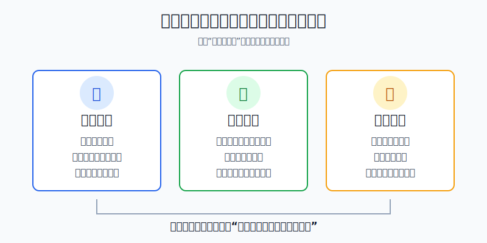
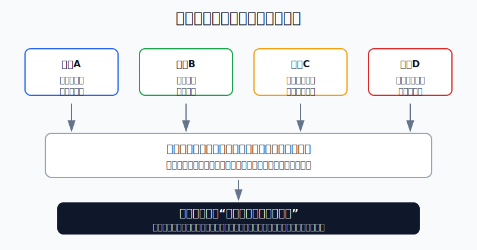
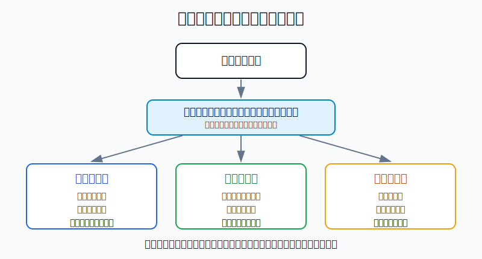

## 散户投资小白金融全品种操盘手册 - 15.8 止损 - 价格止损、逻辑止损、时间止损
  
### 作者  
digoal  
  
### 日期  
2026-06-07   
  
### 标签  
金融产品 , 金融工具 , 散户 , 投资小白 , 全品操盘手册  
  
----  
  
## 背景 
  

> 适用读者: 已经知道不能满仓、不能借钱交易，但一亏损就陷入“割肉还是再等等”的小白投资者。  
> 本文定位: 投资教育框架，不构成个性化投资建议。规则口径按 2026-06-06 可核查公开资料整理。

## 先问一个反直觉的问题

止损最难的地方，不是卖出，而是分清自己到底错在哪里。价格跌了，可能只是正常波动；买入理由坏了，才是真错误；等了很久还没有验证，说明这笔交易占用了时间和注意力。**止损不是亏损按钮，而是前提失效按钮。**

## 核心概念: 三种止损解决三种错误

价格止损，是用价格线承认短线交易错了。比如你买入是因为“突破20日均线后继续走强”，结果第二天跌回突破位下方，成交量也放大。此时错的不是公司长期价值，而是短线交易前提。价格止损适合交易仓、期货学习仓、杠杆工具和短线主题仓，不适合机械套在所有长期核心资产上。

逻辑止损，是用事实变化承认买入理由错了。比如你买某只个股，是因为收入增长、利润率改善、竞争优势稳定；后来财报连续两个季度证明收入增速下台阶、毛利率被价格战压缩、管理层还下调指引。此时即使价格没有跌到你的止损线，也要止损，因为当初买入的逻辑已经被证伪。

时间止损，是用验证期限承认“这笔钱等错地方了”。比如你买一个行业ETF，是因为预计三个月内政策和盈利数据会同时改善；三个月过去，政策没有落地，盈利也没改善，价格横盘或小亏。很多小白会说“反正亏得不多，再等等”。时间止损要解决的就是这种拖延: 没有按期验证，就退出或降仓，不让账户变成希望仓库。

本节行动结论先放在前面: **买入前必须写三句话: 价格错到哪里卖，逻辑坏到哪里卖，等到什么时候还没验证就卖。交易仓优先价格止损，研究仓优先逻辑止损，验证仓必须有时间止损；长期核心仓不因普通波动机械止损，但资金期限、仓位上限或配置逻辑失效时必须退出或降仓。**

## 逻辑推导链

【论证链标题】: 因为亏损可能来自正常波动，也可能来自买入前提失效，而散户又天然不愿承认亏损，所以止损必须提前写成“价格、逻辑、时间”三条规则。

### 第一步: 前提陈述

前提A: 亏损不等于错误。这是常量。资产价格像天气，短期会下雨；但下雨不等于房子塌了。宽基ETF年内回撤、个股财报前波动、行业ETF阶段调整，都可能只是波动，不一定说明买入理由失效。

前提B: 有些亏损确实是错误。这是常量。买入理由被财报、行业数据、政策变化、竞争格局或价格结构证伪时，继续持有就不是长期投资，而是在给错误续命。

前提C: 人天然更愿意兑现盈利、拖延亏损。这是常量。小白亏损后最常见的反应不是复盘前提，而是改口: 短线变长线，交易变配置，试错仓变信仰仓。

前提D: 止损单只是执行工具，不是风险消失器。这是常量。止损价被触发后，成交价仍可能受跳空、流动性、买卖价差影响；所以真正的风控不只是下一个止损单，而是先控制仓位、再定义失效条件。

前提E: 每个持仓角色不同。这是变量。核心仓、卫星仓、试错仓、交易仓、现金替代工具的任务不同，止损方式也必须不同。

### 第二步: 逻辑推导

由A可得: 因为亏损可能只是正常波动，所以不能只看“跌了多少”就卖。否则长期核心仓会被短期噪音洗出去。

由A+B可得: 因为亏损也可能是买入前提失效，所以也不能只说“长期会回来”。如果当初买入理由已经被证伪，不卖就是把错误变成更大的仓位风险。

再由B+C可得: 因为散户天然不愿认亏，所以止损规则必须写在买入前，而不是亏损后临时想。亏损后才写规则，往往是在替自己找理由。

再由D可得: 因为止损单不保证按理想价格成交，所以止损不能替代仓位管理。单笔最大亏损要先算好，不能靠“到时我会卖”来安慰自己。

最后由A+B+C+D+E可得: **止损规则必须按持仓角色拆成三条线: 价格线解决交易错，逻辑线解决判断错，时间线解决等待错。**

### 第三步: 正常情景下的操作结论

✅ 正常情景: 你买入前已经给这笔持仓定好角色、仓位上限、买入理由、验证期限和最大可承受亏损。

对应操作:

1. 交易仓: 用价格止损。跌破关键价位或亏损达到计划金额，先退出，不补仓摊平。
2. 研究仓或个股仓: 用逻辑止损。财报、行业、竞争、估值或监管事实破坏买入理由，就减仓或退出。
3. 主题仓或验证仓: 用时间止损。到了验证日期，证据还没有出现，就退出或降为观察仓。
4. 长期核心仓: 不因普通回撤机械止损；但资金期限变短、仓位超上限、配置逻辑失效时，执行降仓。

### 第四步: 数据和案例证实

证据1: 普通回撤很常见。J.P. Morgan Asset Management《Guide to the Markets》2026年版统计，1980年以来标普500年内平均最大回撤约14.2%，但46年里有35年全年仍为正收益。这个数据验证前提A: 对长期宽基资产来说，十几个点的年内下跌不能自动等同于买错。

证据2: 散户确实容易拖延亏损。Terrance Odean 1998年论文《Are Investors Reluctant to Realize Their Losses?》研究1987年至1993年美国一家大型折扣券商约1万个账户，发现投资者卖出盈利股票的比例约14.8%，卖出亏损股票的比例约9.8%。这个数据验证前提C: 人会更愿意落袋盈利，而不是及时处理亏损。

证据3: 止损订单不是成交价保证。FINRA 在2025年3月26日投资者教育文章《Stop Orders: Factors to Consider During Volatile Markets》中提醒，止损单触发后通常会变成市价单，成交价格可能与止损价不同，尤其在波动剧烈、跳空或流动性不足时。这个证据验证前提D: 下单工具不能替代仓位和预案。

证据4: 逻辑止损有真实反例。SEC 2020年12月16日公告称，瑞幸咖啡被指控通过虚构交易显著夸大收入、费用和亏损，并同意支付1.8亿美元罚款以和解会计欺诈指控。这个案例验证前提B: 当财务真实性这个买入前提被破坏时，问题不是股价跌了多少，而是持有逻辑已经重写。

历史数据不代表未来会重复，但这些证据说明的是稳定机制: 市场正常波动会制造假警报，行为偏差会让人拖延错误，交易工具本身又不能消灭跳空和流动性风险。所以止损必须提前写清，而不是亏损后临时发挥。

### 第五步: 前提变化时的替代结论

若前提A成立、B不成立，也就是价格下跌但买入逻辑没有坏，推导路径变为: 因为这是正常波动，不是错误，所以不执行逻辑止损。新结论: 核心仓按仓位上限和再平衡规则处理，不因为普通回撤清仓。

若前提B成立，也就是财报、行业、监管或竞争事实破坏买入理由，推导路径变为: 因为买入前提已经消失，所以不能用“跌多了会反弹”替代复盘。新结论: 执行逻辑止损，至少降到观察仓，严重失效时退出。

若前提C在亏损后变强，也就是你开始改口、补仓、取消止损，推导路径变为: 因为行为偏差已经接管决策，所以先把仓位降到不会影响情绪的水平。新结论: 暂停加仓，按原计划卖出，复盘后再决定是否重新买入。

若前提D恶化，也就是遇到跳空、跌停、成交稀薄、盘口价差扩大，推导路径变为: 因为止损可能无法按理想价格成交，所以原来的亏损预算失真。新结论: 高波动工具提前降仓，不把止损单当保险。

若前提E改变，也就是你把短线交易仓临时改成长期配置，推导路径变为: 因为持仓角色被偷换，原规则已经失效。新结论: 回到买入记录，若原本是交易仓，按交易仓止损；不能因为亏损而升级成核心仓。

失败案例: 一个小白用5万元买入热门主题ETF，原计划“跌破买入价8%止损，三个月政策没落地就退出”。两个月后跌了9%，他取消止损，说“长期看好产业”；三个月后政策仍未落地，他又说“再等下一轮行情”。这笔交易的问题不是看错主题，而是价格止损和时间止损都被取消，交易仓被改口成希望仓。

## 实操例子: 10万元账户如何写止损规则

这个例子对应论证链的正常结论: **先定义持仓角色，再把价格线、逻辑线、时间线写成可执行动作。**

假设小林有10万元投资资金，已经留足生活备用金。他把账户分成三块: 6万元核心宽基ETF，2万元防守资产，2万元主动仓。主动仓里，他准备拿1万元买行业ETF，5000元买一只个股，5000元留作现金等待机会。

第一步，给核心仓写规则。6万元宽基ETF的角色是长期核心仓，计划五年以上不用。小林写下: 不因为10%-15%的普通回撤清仓；如果权益仓从60%涨到70%以上，就再平衡减回60%；如果未来一年内要用钱，就先把要用的钱从权益仓转到现金或短债。这个动作对应前提A和E: 核心仓主要看资金期限和仓位，不套短线价格止损。

第二步，给行业ETF写价格线和时间线。1万元行业ETF属于卫星仓，小林的买入理由是“行业景气改善，指数站上半年线”。他写下: 跌破半年线并连续3个交易日收不回，卖出一半；亏损达到8%，且行业景气数据没有改善，全部退出；三个月后如果行业盈利数据仍未改善，即使只亏2%，也卖出或降到3000元观察仓。这里对应价格止损和时间止损。

第三步，给个股写逻辑线。5000元个股属于研究仓，买入理由是“收入增速保持20%以上、毛利率不低于过去两年中位数、估值不超过自己能接受的区间”。小林写下: 若连续两个季度收入增速低于15%，同时管理层下调全年指引，卖出至少一半；若出现财务真实性、监管重大处罚或核心产品失败，直接退出。这里对应逻辑止损。

第四步，反推单笔亏损金额。行业ETF若亏8%退出，1万元亏800元，占总账户0.8%；个股若先卖一半，最大计划亏损控制在500元到800元附近。小林确认: 单笔亏损不会让总账户失控，也不会逼自己靠补仓翻本。这个动作对应前提D: 止损之前先控制仓位。

第五步，写禁止动作。小林在交易记录里写三条: 触发价格止损后，不把短线仓改成长线仓；触发逻辑止损后，不用“已经跌很多”当持有理由；触发时间止损后，不把验证期无限延长。只要违反一次，本月主动仓停止新买入。

如果操作错误，后果很清楚。小林若把1万元行业ETF跌8%后的止损取消，又在跌15%时补仓1万元，原本800元的计划亏损会变成更大的组合问题。纠偏方法不是找新消息安慰自己，而是先把仓位降回原计划，再复盘是哪条线被自己改掉了。

## 可复用框架

【三线止损】

适用前提: 你准备买入ETF、个股、转债、商品基金、期权或期货学习仓，并且能提前写买入理由。

核心逻辑: 因为亏损可能来自价格结构、买入逻辑或验证时间，所以止损要分三条线，而不是只写一个百分比。

操作步骤:

1. 价格线: 适合交易仓。写清跌破哪里、亏多少、几天不修复就退出。
2. 逻辑线: 适合个股和行业仓。写清哪些财报、行业、监管、竞争事实会破坏买入理由。
3. 时间线: 适合主题和验证仓。写清几周或几个月内证据不出现就退出。

前提失效时: 如果你说不清这笔持仓是什么角色，先不买；如果买入后想改规则，先减仓，再复盘，不能边亏边改。

举一反三: 这个框架可以用在第十五章后面的止盈、再平衡、黑天鹅预案，也能用在A股、美股、港股、黄金、REITs和可转债。

【先仓后损】

适用前提: 你已经有止损意识，但经常发现止损后亏损仍然超出预期。

核心逻辑: 因为止损单不保证成交价，所以真正的亏损控制要从仓位开始，而不是从订单开始。

操作步骤:

1. 先定单笔最大亏损: 小白主动仓单笔计划亏损先控制在总账户0.5%-1%以内。
2. 再定仓位大小: 用最大亏损除以止损距离，反推可以买多少钱。
3. 最后定执行方式: 流动性差、跳空风险高、杠杆高的工具，要把仓位再降一档。

前提失效时: 如果止损距离太宽导致仓位太小，说明这笔交易不适合你当前账户；如果为了买更多而把止损线设得过窄，说明你在倒推安慰数字。

举一反三: 这个框架尤其适合期货、期权、杠杆ETF、低流动性个股和高波动主题基金。

## 本节行动清单

| 动作 | 合格标准 |
|---|---|
| 先定持仓角色 | 核心仓、卫星仓、试错仓、交易仓分清楚 |
| 写价格线 | 交易仓有明确价位、亏损额和执行动作 |
| 写逻辑线 | 个股和行业仓有财报、估值、竞争、监管失效条件 |
| 写时间线 | 主题仓和验证仓有明确复核日期 |
| 反推亏损金额 | 单笔计划亏损不超过账户能承受的范围 |
| 不临时改口 | 短线亏损不能改成长线，试错仓不能改成核心仓 |
| 复盘被触发的线 | 每次卖出后记录是价格、逻辑还是时间触发 |

## 一句话总结

止损不是因为亏了才卖，而是因为买入前提失效才卖；价格线管交易错误，逻辑线管判断错误，时间线管等待错误。

## 参考资料

- J.P. Morgan Asset Management: Guide to the Markets U.S., 2026年版，https://am.jpmorgan.com/content/dam/jpm-am-aem/global/en/insights/market-insights/guide-to-the-markets/mi-guide-to-the-markets-us.pdf
- Terrance Odean: Are Investors Reluctant to Realize Their Losses?, Journal of Finance, 1998年，https://faculty.haas.berkeley.edu/odean/papers/disposition/disposition.html
- FINRA: Stop Orders: Factors to Consider During Volatile Markets，2025年3月26日，https://www.finra.org/investors/insights/stop-orders-factors-consider-during-volatile-markets
- SEC: Luckin Coffee Agrees to Pay $180 Million Penalty to Settle Accounting Fraud Charges，2020年12月16日，https://www.sec.gov/newsroom/press-releases/2020-319

> ⚠️ **声明**：本文内容为投资教育目的，所有历史数据、策略框架均为辅助学习工具，不构成证券投资建议。市场有风险，投资需谨慎。实际操作请结合自身风险承受能力，必要时咨询专业投顾。
  
#### [PostgreSQL 解决方案集合](../201706/20170601_02.md "40cff096e9ed7122c512b35d8561d9c8")
  
  
#### [德哥 / digoal's Github - 公益是一辈子的事.](https://github.com/digoal/blog/blob/master/README.md "22709685feb7cab07d30f30387f0a9ae")
  
  
#### [About 德哥](https://github.com/digoal/blog/blob/master/me/readme.md "a37735981e7704886ffd590565582dd0")
  
  

  
