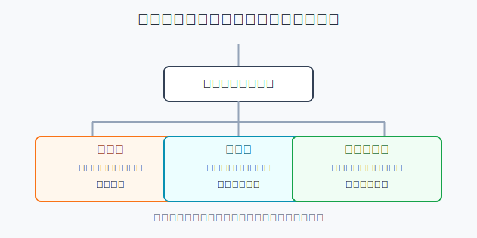
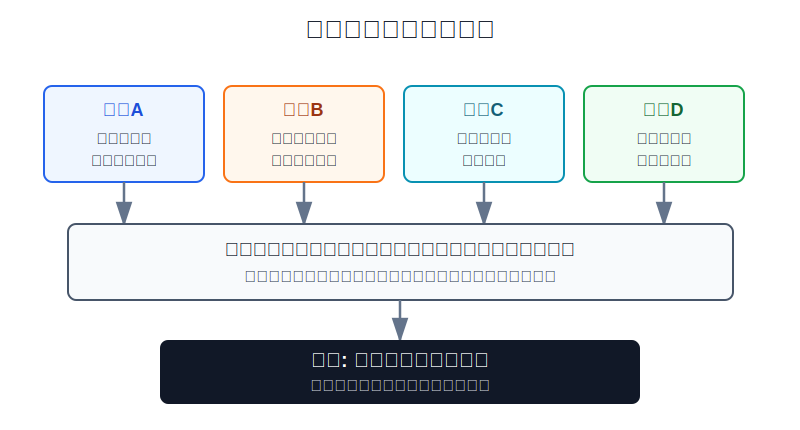
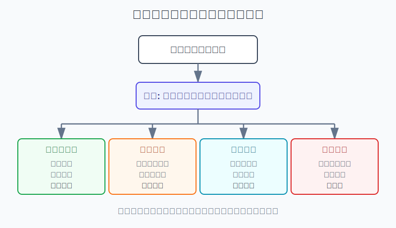

## 散户投资小白金融全品种操盘手册 - 15.9 止盈 - 估值止盈、趋势止盈、目标仓位止盈
  
### 作者  
digoal  
  
### 日期  
2026-06-07   
  
### 标签  
金融产品 , 金融工具 , 散户 , 投资小白 , 全品操盘手册  
  
----  
  
## 背景 
  

> 适用读者: 持仓已经赚钱，但一边怕卖飞、一边怕利润回吐的小白投资者。  
> 本文定位: 投资教育框架，不构成个性化投资建议。规则口径按 2026-06-06 可核查公开资料整理。

## 先问一个反直觉的问题

很多散户亏钱，不是因为从来没赚过，而是因为**赚钱以后不知道怎么处理风险**。涨了10%想再等等，涨了30%开始幻想翻倍，跌回成本线又舍不得卖。止盈不是猜最高点，真正的止盈是: 当盈利让估值、趋势或仓位风险超过计划时，把一部分钱从风险里拿出来。

## 核心概念: 止盈不是见好就跑

止盈，就是在盈利后按规则降低风险。它和“看空”不是一回事。你卖出一部分，不代表你判断马上大跌，而是承认一个事实: 资产涨多以后，原来的收益风险比、趋势状态、组合占比都会变。

估值止盈，看的是“价格是否已经太贵”。估值，就是市场愿意为未来利润、现金流或资产价值付多少钱。比如一只指数或股票涨得很快，但盈利没有同步增长，市盈率被推得很高，未来收益空间就会被压薄。此时止盈卖的不是“好资产”，卖的是“过高预期”。

趋势止盈，看的是“上涨结构是否开始坏掉”。趋势，就是价格沿着某个方向运行的状态。小白不用研究复杂技术指标，只要写清两条线: 跌破哪条均线或前低要减仓，反弹回不去哪个位置要确认转弱。趋势止盈适合交易仓、行业ETF、主题基金，不适合作为长期核心资产的唯一卖出理由。

目标仓位止盈，看的是“赚钱后仓位是否自动变大”。比如你原计划黄金只占10%，结果黄金涨多后变成18%；你原计划单只个股不超过8%，结果它涨成15%。即使资产本身没错，组合风险已经变了。这时止盈的动作叫再平衡: 把超出的部分卖掉，回到原计划。

本节行动结论先放在前面: **止盈只用三条线: 估值线、趋势线、目标仓位线。估值过热但逻辑没坏，分批减仓；趋势转弱，先保护利润；仓位超标，不讨论喜欢不喜欢，直接再平衡。**

## 逻辑推导链

【论证链标题】: 因为浮盈只说明价格上涨，而上涨后的主要风险来自估值透支、趋势转弱和仓位漂移，所以止盈必须对应这三类风险，而不是靠感觉猜顶部。

### 第一步: 前提陈述

前提A: 浮盈只说明你现在账面赚钱，不说明未来还能继续赚。这是常量。它像跑步时领先半圈，只能证明前面跑得不错，不能证明后面不会失速。

前提B: 价格涨得比基本面快，估值就会抬高；估值越高，未来需要兑现的好消息越多。这是变量。好资产如果价格太贵，也会把几年后的收益提前透支。

前提C: 趋势会延续，也会失速。这是变量。上涨时人人觉得逻辑顺，真正要观察的是: 回调后能不能再创新高，跌破关键位置后有没有修复。

前提D: 持仓赚钱后，仓位会自动变大。这是常量。你不加仓，它也可能因为上涨而占组合更多比例。仓位变大以后，同样一次回撤，对账户的伤害会变大。

### 第二步: 逻辑推导

由A+B可得: 因为浮盈不等于未来收益，估值过高又会压低未来收益空间，所以当资产价格明显跑在盈利、现金流或指数基本面前面时，应该分批止盈，而不是用“它以前涨得好”说服自己继续重仓。

由A+C可得: 因为趋势一旦转弱，浮盈可能快速回吐，所以交易仓不能只看账面利润，要预先写好趋势止盈线。跌破计划线时，先减仓保护利润；如果后续重新站回趋势，再按新计划评估。

由A+D可得: 因为赚钱后仓位会自动超标，所以止盈有时和市场观点无关。资产仍然优秀，也要把超过上限的部分卖掉。否则你不是在投资这只资产，而是在让它主导整个账户。

最终由A+B+C+D可得: **止盈不是“赚多少就卖”，而是“哪一种风险超过了买入计划”。超过估值线，减预期；跌破趋势线，保利润；超过仓位线，做再平衡。**

### 第三步: 正常情景下的操作结论

✅ 正常情景: 你买入前已经写清楚持仓角色、合理估值区间、趋势止盈线和仓位上限；现在持仓已有浮盈，但买入逻辑没有被证伪。

对应操作:

1. 估值止盈: 价格涨到合理估值上沿以上，先卖出20%-30%；继续明显高估，再卖出第二档。不要一次性猜顶。
2. 趋势止盈: 交易仓跌破自己写下的趋势线，例如20日线、60日线、前一波低点或右侧买入确认线，先减仓；反弹无法修复，再减第二档。
3. 目标仓位止盈: 单只个股、行业ETF、黄金、转债等超过账户上限时，卖出超出部分，把比例拉回目标区间。
4. 都没触发: 不因为“已经赚了”就乱卖。盈利本身不是卖出理由，风险超出计划才是。

### 第四步: 数据和案例证实

证据1: S&P Dow Jones Indices 的 S&P 500 factsheet 显示，S&P 500 Total Return 在2022年为-18.11%，2023年为+26.29%，2024年为+25.02%，2025年为+17.88%。同一类资产连续年份表现差异很大。这个证据对应前提A和C: 上一年盈利不能保证下一年继续盈利，趋势和环境变化后，必须复核风险。

证据2: Nasdaq Global Indexes 对互联网泡沫的复盘提到，Nasdaq-100 在1999年底的估算市盈率约104倍，2000年3月见顶后已经回撤50%时，2000年12月29日的追踪市盈率仍有113倍；泡沫顶点时，接近四分之三的 Nasdaq-100 成分公司市盈率高于60倍或没有盈利。这个案例对应前提B: 方向正确不等于价格合理，估值过热时不止盈，会把未来收益空间让给市场情绪。

证据3: Vanguard 2022年研究《Rational Rebalancing》用1989年末到2021年末的数据测算，60%股票/40%债券的组合如果从不再平衡，到2021年末股票占比会升到约80%；股票权重可能在约50%到80%之间漂移。这个证据对应前提D: 不止盈、不再平衡，组合风险会被市场上涨自动改写。

证据4: SEC Investor.gov 在资产配置投资者教育材料中说明，某些投资上涨更快会让组合偏离原目标，并改变整体风险；投资者可以通过卖出部分资产或买入其他资产让组合回到目标配置。这个证据同样验证目标仓位止盈: 卖出上涨资产的一部分，不是猜它会跌，而是把组合风险拉回计划。

失败案例: 2021年前后，许多高成长主题资产涨幅很大，投资者把“赛道好”直接等同于“价格还会涨”。等估值、流动性和趋势同时转弱时，很多浮盈迅速变成回撤。这个反例说明: 如果只看故事，不看估值线和趋势线，止盈会被贪婪拖成被动止损。

历史数据不代表未来会重复同样路径，但它们验证的是稳定机制: 资产涨多以后，要么估值变贵，要么仓位变大，要么趋势需要重新确认。止盈规则就是为了处理这些机制，而不是为了预测某一天的最高点。

### 第五步: 前提变化时的替代结论

若前提B改变，也就是估值已经过热，但基本面仍然健康，推导路径变为: 因为买入逻辑没有坏，只是价格透支，所以不必清仓。新结论: 分批减仓，保留核心仓位继续观察。

若前提C改变，也就是趋势转弱且反弹修复失败，推导路径变为: 因为浮盈有回吐风险，所以交易仓先保护利润。新结论: 降低仓位，等趋势重新确认再决定是否买回。

若前提D改变，也就是资产涨成组合主仓，推导路径变为: 因为组合风险已经超出原计划，所以不需要争论它是不是好资产。新结论: 卖出超出上限的部分，回到目标仓位。

若买入逻辑也被证伪，例如行业景气不再、公司财报变坏、转债触发强赎风险、主题ETF基本面退潮，推导路径变为: 这已经不是止盈问题，而是持有前提失效。新结论: 从“分批止盈”升级为退出或降到观察仓。

## 实操例子: 10万元账户怎么设置止盈

这个例子对应论证链的正常结论: **浮盈出现后，用估值、趋势、仓位三条线判断动作。**

假设小林有10万元投资资金，已经留好生活备用金。他的组合计划是: 宽基ETF 50%，行业ETF 15%，黄金ETF 10%，可转债组合10%，现金和短债15%。其中行业ETF是卫星仓，单个行业上限15%；黄金是防守仓，上限12%；单只个股如果有，绝对不超过8%。

第一步，写估值止盈线。小林持有的行业ETF从1.00元涨到1.45元，指数盈利没有同步增长，估值进入过去五年较高区域。他不需要判断明天是不是顶部，而是执行第一档: 卖出行业ETF的30%，把利润先锁一部分。如果继续上涨且估值更高，再卖第二档。判断依据是前提B: 价格跑得太快，未来收益空间变薄。

第二步，写趋势止盈线。小林把这只行业ETF定义为交易仓，所以买入计划里写明: 跌破60日均线并且三到五个交易日收不回，减半；反弹不能重新站上，再降到观察仓。均线就是一段时间的平均成交价格，用来观察价格是否还在原来的上升节奏里。判断依据是前提C: 趋势转弱时，浮盈要先保护。

第三步，写目标仓位止盈线。小林的黄金ETF原计划10%，因为上涨变成14%。黄金本身没坏，但已经超过12%上限。此时他卖出4个百分点，把黄金降回10%左右。判断依据是前提D: 仓位超标就是风险超标，和喜不喜欢黄金无关。

第四步，写动作顺序。如果同一持仓同时触发估值线和仓位线，先卖到仓位上限以内，再决定是否继续分批止盈。如果同时触发趋势线和买入逻辑失效，不再小修小补，直接降到观察仓或退出。

第五步，纠偏。假如小林卖出后资产继续涨，他不能立刻后悔追回。因为止盈目标不是卖在最高点，而是把风险降回计划。如果后续趋势重新确认、估值回到可接受区间、仓位还有空间，再按新的买入计划处理。

如果操作错误，后果很直接: 估值过热不减仓，利润可能被回撤吞掉；趋势破位不处理，交易仓会被拿成长期仓；仓位超标不再平衡，一个品种会劫持整个账户。纠偏方法只有一个: 每次买入时就把止盈线写在纸上，赚钱以后照表执行。

## 可复用框架

【三线止盈】

适用前提: 你持有ETF、个股、转债、黄金、REITs等有波动的资产，并且买入前写过角色和仓位上限。

核心逻辑: 因为盈利后的风险来自估值、趋势和仓位，所以止盈只检查这三条线。

操作步骤:

1. 估值线: 价格是否已经明显高于合理估值区间。触发后分批减仓。
2. 趋势线: 交易仓是否跌破计划中的趋势位置。触发后先保护利润。
3. 仓位线: 单品种或单票是否超过目标上限。触发后再平衡。

前提失效时: 如果买入逻辑被证伪，不再叫止盈，而是退出或降为观察仓；如果三条线都没触发，不因为浮盈本身卖出。

举一反三: 这个框架可以用于A股行业ETF、美股主题ETF、黄金ETF、可转债组合和单只个股。区别只在于估值指标、趋势线和仓位上限要按品种重写。

【先降风险】

适用前提: 你已经赚钱，但不知道该卖多少。

核心逻辑: 因为小白无法稳定卖在最高点，所以止盈的目标不是清仓逃顶，而是先把超出计划的风险降下来。

操作步骤:

1. 轻微触发: 只超过一条线，卖出20%-30%。
2. 中度触发: 同时触发估值线和仓位线，卖到目标仓位以内。
3. 重度触发: 趋势转弱且买入逻辑被证伪，退出或降到观察仓。

前提失效时: 如果这笔钱短期要用，不要等止盈信号，先从风险资产里划出来；资金用途变化优先级高于行情判断。

举一反三: 以后遇到“赚了要不要卖”，先不要问顶部在哪，先问风险有没有超过原计划。

## 本节行动清单

| 动作 | 合格标准 |
|---|---|
| 写估值线 | 买入前写清合理估值区间和高估减仓区间 |
| 写趋势线 | 交易仓写清跌破什么位置减仓，不临时改 |
| 写仓位线 | 单票、行业ETF、黄金、转债都有上限 |
| 分批止盈 | 估值过热但逻辑未坏时，不一次性猜顶 |
| 再平衡止盈 | 仓位超过目标上限时，卖出超出部分 |
| 区分止盈和止损 | 逻辑被证伪时是退出，不是普通止盈 |
| 写复盘记录 | 每次卖出记录触发了哪条线、卖出多少、剩余多少 |

## 一句话总结

止盈不是把赚钱的持仓立刻卖掉，而是当估值、趋势或仓位风险超过计划时，把利润变成更可控的组合。

## 参考资料

- S&P Dow Jones Indices: S&P 500 (USD) Factsheet, as of May 29, 2026, https://www.spglobal.com/spdji/en/indices/equity/sp-500/
- Nasdaq Global Indexes: Is AI Another Bubble for the Nasdaq-100?, https://www.nasdaq.com/articles/is-ai-another-bubble-for-the-nasdaq-100
- Vanguard Research: Rational Rebalancing: An Analytical Approach to Multiasset Portfolio Rebalancing Decisions and Insights, 2022, https://corporate.vanguard.com/content/dam/corp/research/pdf/rational_rebalancing_analytical_approach_to_multiasset_portfolio_rebalancing.pdf
- SEC Investor.gov: Asset Allocation, https://www.investor.gov/introduction-investing/getting-started/asset-allocation

> ⚠️ **声明**：本文内容为投资教育目的，所有历史数据、策略框架均为辅助学习工具，不构成证券投资建议。市场有风险，投资需谨慎。实际操作请结合自身风险承受能力，必要时咨询专业投顾。
  
#### [PostgreSQL 解决方案集合](../201706/20170601_02.md "40cff096e9ed7122c512b35d8561d9c8")
  
  
#### [德哥 / digoal's Github - 公益是一辈子的事.](https://github.com/digoal/blog/blob/master/README.md "22709685feb7cab07d30f30387f0a9ae")
  
  
#### [About 德哥](https://github.com/digoal/blog/blob/master/me/readme.md "a37735981e7704886ffd590565582dd0")
  
  

  
