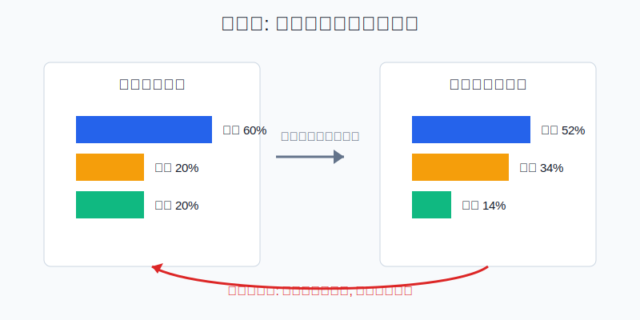
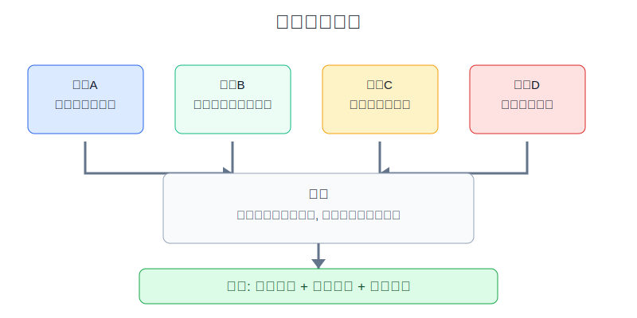
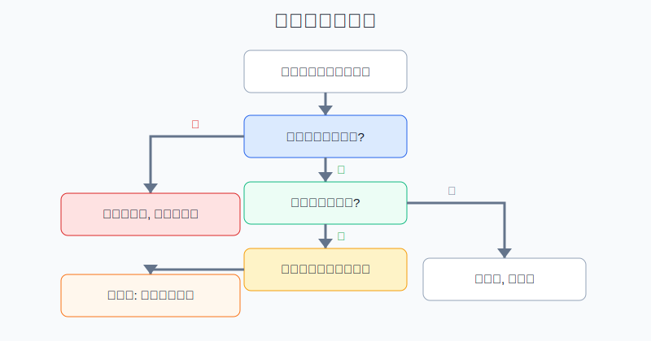

## 散户投资小白金融全品种操盘手册 - 15.10 再平衡 - 让组合自动低买高卖
  
### 作者  
digoal  
  
### 日期  
2026-06-07   
  
### 标签  
金融产品 , 金融工具 , 散户 , 投资小白 , 全品操盘手册  
  
----  
  
## 背景 
  

> 适用读者: 已经有核心仓、卫星仓、防守仓，但每次涨跌后不知道该不该调仓的小白投资者。  
> 本文定位: 投资教育框架，不构成个性化投资建议。

## 先问一个反直觉的问题

很多人以为“低买高卖”靠预测。真正适合散户的版本更朴素: **先写好比例，涨多了就减回去，跌多但前提没坏就补回去。** 这就是再平衡。它不保证赚钱，但能防止组合被市场情绪带偏。

## 核心概念: 再平衡不是猜顶抄底，而是修正仓位漂移

再平衡，就是把实际仓位重新拉回目标仓位。目标仓位不是“我觉得谁会涨”，而是你愿意把多少风险交给某类资产。

举个简单例子: 年初你设定核心宽基ETF 60%、行业卫星20%、债券和现金20%。一年后行业卫星涨得快，占比变成34%；防守资产降到14%。你若什么都不做，组合就从“稳健组合”变成“行业重仓组合”。再平衡的动作，是把行业卫星减回上限附近，把资金补给核心或防守。

本节行动结论先放在前面: **每个组合都要写目标比例和触发阈值；每月或每季度检查，只有偏离超过阈值才动作；优先用现金、分红和新增资金补低配资产，不够时才卖出超配资产。再平衡的目标是把风险拉回计划，不是追求卖在最高、买在最低。**

## 逻辑推导链

【论证链标题】: 因为资产涨跌会让仓位漂移，而目标比例代表风险预算，所以再平衡要用阈值规则把组合拉回计划。

── 第一步: 前提陈述

前提A: 不同资产不会同步涨跌。这是常量。宽基ETF、行业ETF、个股、黄金、债券、现金，像一桌菜里的不同味道，不会同时变咸、同时变淡。

前提B: 目标比例是风险预算。这是常量，但会随年龄、收入和用钱时间变化。核心仓60%和核心仓30%，差的不是数字，而是你愿意承担的波动大小。

前提C: 调仓有成本。这是变量。成本包括交易佣金、申赎费、买卖价差、跨境ETF溢价、税务影响和操作错误。偏离1个百分点就交易，往往是在给成本打工。

前提D: 人会追涨杀跌。这是行为常量。涨得多的资产看起来“更正确”，跌得多的资产看起来“该删除”。没有规则时，小白很容易把再平衡做成情绪化换仓。

── 第二步: 逻辑推导

由A可得: 因为资产涨跌不同，所以组合比例一定会漂移。只要时间够长，实际仓位就会偏离年初计划。

由A+B可得: 因为比例漂移会改变风险预算，所以不再平衡等于默认接受一个新组合。这个新组合不是你设计的，而是市场涨跌替你设计的。

再由B+C可得: 因为目标比例需要维护，但交易有成本，所以不能小偏离就交易。合理动作是设置触发阈值，让小波动自然消化，让大偏离触发动作。

再由C+D可得: 因为人会被短期涨跌影响，所以再平衡必须机械化: 先算比例，再看阈值，再决定用现金补低配，还是卖出超配。

── 第三步: 正常情景下的操作结论

✅ 正常情景: 这笔钱是长期资金；目标比例仍适合你；底层资产的买入前提没有破坏；偏离超过触发阈值。

对应操作: 大类资产偏离目标超过5个百分点，或小仓位相对目标偏离超过25%，进入再平衡清单。先用现金、分红、新增资金补低配资产；仍然偏离过大时，卖出超配资产的超限部分，把仓位拉回目标区间。

── 第四步: 数据和案例证实

证据1: Vanguard 2022年研究《Rational Rebalancing》用1989年末到2021年末的数据测算，60%股票/40%债券组合如果从不再平衡，到2021年末股票占比会升到约80%；研究还指出，不再平衡的股票权重可能在约50%到80%之间漂移。这个证据对应前提A和B: 长期不管，风险会被市场自动改写。

证据2: FINRA 的投资者教育材料《Asset Allocation and Diversification》说明，市场表现会改变各类资产价值，投资者需要检查是否回到原始配置；它列出的再平衡方式包括把资金转向落后资产、用新增投资补落后资产、卖出部分表现较好的资产。这个证据对应前提C: 现金流优先，是低摩擦的再平衡方式。

证据3: S&P Dow Jones Indices 的 S&P 500 年度数据中，S&P 500 Total Return 在2022年为-18.11%，2023年为+26.29%，2024年为+25.02%。这组连续年份说明，同一资产也会在亏损和大涨之间快速切换。若没有仓位规则，投资者很容易在下跌年删除资产、在上涨后追成重仓。

失败案例: 行业ETF从10%涨到30%，投资者没有减仓，反而因为“趋势很强”继续加钱。随后行业回撤40%，组合总资产被单一方向拖住。这里失败的不是“没猜到顶部”，而是前提B失效: 目标比例已经被突破，风险预算却没有修正。

历史不代表未来。上面数据仍有参考价值，是因为它们验证的是结构规律: 资产收益不同步，仓位会漂移；人会被涨跌影响，规则能减少情绪化操作。再平衡不是收益保证书，而是仓位纪律。

── 第五步: 前提变化时的替代结论

若前提B改变，也就是你的目标、收入稳定性或未来用钱时间变了，推导路径变为: 因为风险预算本身改变，所以不能机械回旧比例。新结论: 先重设目标仓位，再执行再平衡。例如两年内要买房，现金和短债比例应提高。

若前提C改变，也就是交易成本、溢价、税务或流动性明显不友好，推导路径变为: 因为调仓成本过高，所以不要一次性强行拉回。新结论: 用三到六个月的新增资金和分红慢慢补低配资产。

若底层资产前提被破坏，推导路径变为: 因为下跌不再只是价格波动，而是投资逻辑失效，所以不能用再平衡去补烂资产。新结论: 先复盘前提，必要时降级或退出。

## 实操例子: 10万元组合如何再平衡

这个例子对应论证链的正常结论: **目标没变、前提没坏、偏离超阈值时，才执行再平衡。**

小林年初有10万元长期投资资金，目标是: 核心宽基ETF 60%、行业卫星10%、黄金10%、债券和现金20%。他的行业卫星上限写得很清楚: 超过15%就不再加仓，超过20%必须降回区间。

一年后，账户变成11.2万元: 核心ETF 5.2万元，占46.4%；行业卫星2.5万元，占22.3%；黄金0.9万元，占8.0%；债券和现金2.6万元，占23.2%。行业卫星目标10%，实际22.3%，已经超过上限。

第一步，先问目标是否改变。小林仍然是长期资金，没有大额支出，行业卫星只是辅助，不该变成主仓。所以目标有效。

第二步，检查前提是否破坏。行业上涨来自短期景气和资金拥挤，不是他的长期核心资产。它可以保留，但不能继续扩张。

第三步，先用现金流处理。小林本月新增6000元，不再买行业卫星，而是补核心ETF和防守资产。这样做对应前提C: 先用新钱，少卖出，减少交易摩擦。

第四步，仍然超限就卖出超配。新增资金后，行业卫星仍超过20%。小林卖出7000元行业卫星，把它降到15%左右，资金转入核心ETF和债券现金。注意，他不是清仓，也不是判断行业马上会跌；他只是把超出风险预算的部分拿回来。

如果前提不成立，操作要切换。比如行业卫星下跌不是普通波动，而是政策、需求或盈利逻辑被破坏，就不能因为它低配而补仓；应该先退出再复盘。比如小林明年要用5万元，就要先提高现金，而不是机械买回核心ETF。

## 可复用框架

【三线再平衡】

适用前提: 你已经有目标比例，并且持有多类资产。

核心逻辑: 因为再平衡是仓位纪律，所以每次调仓先过三条线。

操作步骤:

1. 目标线: 目标比例是否仍适合当前生活阶段。
2. 偏离线: 大类偏离是否超过5个百分点，小仓位相对偏离是否超过25%。
3. 成本线: 交易费、价差、溢价、税务和流动性是否可以接受。

前提失效时: 目标线失效，先改配置；偏离线没触发，不交易；成本线不合格，用新增资金慢慢修正。

举一反三: 这个框架也适用于ETF组合、可转债组合、美股ETF组合和全球资产组合。

【现金优先】

适用前提: 偏离已经触发，但组合还有分红、利息、工资结余或新增资金。

核心逻辑: 因为调仓有成本，所以先让新钱流向低配资产，再考虑卖出超配资产。

操作步骤:

1. 停止给超配资产加钱。
2. 把新增资金、分红和利息投向低配资产。
3. 三到六个月后仍明显超配，再卖出超限部分。

前提失效时: 如果超配已经严重突破红线，例如卫星仓从10%涨到30%，不能只靠新钱慢慢稀释，应直接卖出超限部分。

举一反三: 工资定投、基金分红、债券到期资金，都可以用来做低摩擦再平衡。

## 本节行动清单

| 动作 | 合格标准 |
|---|---|
| 写目标比例 | 每类资产都有目标比例和上限 |
| 设触发阈值 | 大类偏离5个百分点，小仓位相对偏离25% |
| 固定体检 | 每月记录，每季度或半年判断是否动作 |
| 现金优先 | 新增资金、分红、利息先补低配资产 |
| 记录原因 | 写清目标、实际、偏离、动作、费用 |

## 一句话总结

再平衡不是预测顶部和底部，而是用目标比例和触发阈值，让组合在涨多时自动降风险，在跌多但前提没坏时自动补回纪律。

## 参考资料

- Vanguard Research: Rational Rebalancing: An Analytical Approach to Multiasset Portfolio Rebalancing Decisions and Insights, 2022, https://corporate.vanguard.com/content/dam/corp/research/pdf/rational_rebalancing_analytical_approach_to_multiasset_portfolio_rebalancing.pdf
- FINRA: Asset Allocation and Diversification, https://www.finra.org/investors/investing/investing-basics/asset-allocation-diversification
- S&P Dow Jones Indices: S&P 500 Index Overview and Factsheet, https://www.spglobal.com/spdji/en/indices/equity/sp-500/

> ⚠️ **声明**：本文内容为投资教育目的，所有历史数据、策略框架均为辅助学习工具，不构成证券投资建议。市场有风险，投资需谨慎。实际操作请结合自身风险承受能力，必要时咨询专业投顾。
  
#### [PostgreSQL 解决方案集合](../201706/20170601_02.md "40cff096e9ed7122c512b35d8561d9c8")
  
  
#### [德哥 / digoal's Github - 公益是一辈子的事.](https://github.com/digoal/blog/blob/master/README.md "22709685feb7cab07d30f30387f0a9ae")
  
  
#### [About 德哥](https://github.com/digoal/blog/blob/master/me/readme.md "a37735981e7704886ffd590565582dd0")
  
  

  
