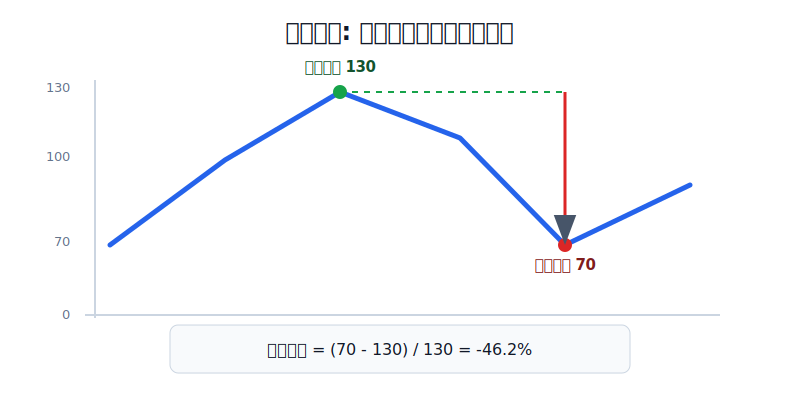
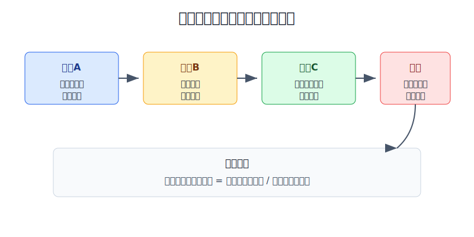
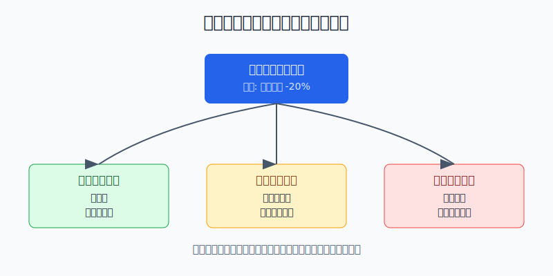

## 散户投资小白金融全品种操盘手册 - 15.11 最大回撤管理 - 先问自己能承受多大亏损
  
### 作者  
digoal  
  
### 日期  
2026-06-07   
  
### 标签  
金融产品 , 金融工具 , 散户 , 投资小白 , 全品操盘手册  
  
----  
  
## 背景 
  

> 适用读者: 已经学过仓位、止损、止盈和再平衡，但还没有把“我能亏多少”写成数字的小白投资者。  
> 本文定位: 投资教育框架，不构成个性化投资建议。

## 先问一个反直觉的问题

很多人买入前只问“能赚多少”，真正决定你能不能拿住的，却是“最多亏到哪里我会崩”。**最大回撤不是给基金经理看的指标，而是散户给自己设仓位上限的尺子。**

## 核心概念: 回撤不是亏损金额，是从高点掉下来的距离

回撤，就是账户从阶段高点往下跌的幅度。最大回撤，就是一段时间里从最高点跌到之后最低点的最大跌幅。它和“今年赚不赚钱”不是一回事。

举个简单例子: 账户从10万元涨到13万元，又跌到7万元。你如果只看本金，会说“亏了3万元”；但从最高水位看，是从13万元跌到7万元，最大回撤是46.2%。这才是你真实感受到的痛感，因为人不是从初始本金开始感受损失，而是从自己见过的账户高点开始感受损失。

最大回撤有两个用处。第一，它告诉你某个资产或策略在历史上最难熬的时候有多难熬。第二，它帮你反推仓位: 如果你最多只能承受组合跌20%，就不能让一个历史上可能跌50%的资产占到80%仓位。

本节行动结论先放在前面: **先写下自己能承受的组合最大回撤，再用压力回撤反推仓位上限。小白默认先把组合最大回撤预算控制在10%-20%区间；如果一套配置在压力测试下会让你亏到睡不着、借钱补仓或冲动清仓，那它不是收益更高，而是仓位已经超过你的承受力。**

## 逻辑推导链

【论证链标题】: 因为资产会出现峰谷回撤，亏损越深回本越难，而每个人的心理和现金流承受力不同，所以仓位必须由“可承受最大回撤”反推，而不是由“我看好多少”决定。

── 第一步: 前提陈述

前提A: 高波动资产一定会经历回撤。这是常量。股票、行业ETF、黄金、转债、REITs、美股ETF都不是直线上涨，它们更像爬山: 你看到山顶，不代表中途没有深谷。

前提B: 回撤越深，回本需要的涨幅越大。这是数学常量。亏10%只要涨11.1%回本，亏50%要涨100%才能回本，亏70%要涨233.3%才能回本。坑越深，爬出来越费力。

前提C: 每个人能承受的回撤不同。这是变量。有人账户跌10%就焦虑，有人跌25%还能按计划定投。差别不只来自胆子，还来自现金流、家庭责任、资金用途和投资经验。

前提D: 散户最危险的行为，往往出现在超过承受力之后。这是常见行为偏差。仓位太大时，人容易追问“什么时候回本”，而不是检查“买入前提是否还成立”。

── 第二步: 逻辑推导

由A可得: 因为资产会回撤，所以任何配置都不能只看预期收益，还要先问最坏阶段会跌多少。

由A+B可得: 因为深回撤会让回本难度非线性上升，所以控制最大回撤比事后祈祷反弹更重要。少亏一点，不只是少痛一点，而是让下一轮恢复更容易。

再由A+B+C可得: 因为每个人的承受力不同，所以同一只宽基ETF、同一只行业基金、同一只个股，对不同人应该有不同仓位。仓位不是观点强弱的表达，而是承受力的表达。

最后由A+B+C+D可得: 因为超过承受力会触发冲动补仓、低点割肉和计划失效，所以买入前必须先写最大回撤预算。**先定能亏多少，再决定能买多少。**

── 第三步: 正常情景下的操作结论

✅ 正常情景: 你是普通散户，投资资金不影响生活，已经留出应急钱，但还没有长期经历过完整牛熊周期。

对应操作: 先设组合最大回撤预算，例如10%、15%或20%。再给每类资产设压力回撤假设，例如宽基ETF按40%-50%压力回撤测算，行业/主题资产按50%-70%测算，单只个股按50%-80%测算。最后用公式反推仓位:

> 高波动资产仓位上限 = 组合可承受回撤 / 该资产压力回撤

例如，你最多能承受组合跌20%，而某类权益资产压力回撤按50%估算，那么这类高波动资产的粗略上限就是40%。这不是让你永远只买40%，而是告诉你: 如果买到80%，压力行情下组合可能跌40%，已经超过你的承受力。

── 第四步: 数据和案例证实

证据1: GIPS Standards 的基金管理人手册把最大回撤定义为从峰值到谷值的最大百分比损失，公式为“谷值减峰值，再除以峰值”。这对应前提A: 最大回撤不是情绪词，而是专业绩效报告里用于描述路径风险的标准指标。

证据2: 圣路易斯联储 FRED 的 S&P 500 日度收盘数据来自 S&P Dow Jones Indices。按公开历史数据，S&P 500 在2007年10月9日收于1565.15点，2009年3月9日收于676.53点，从峰值到谷值跌幅约56.8%。这对应前提A和B: 即使是美国大盘宽基指数，也会出现超过一半的峰谷回撤。

证据3: 2009年1月5日新浪财经报道，2008年沪深300全年跌幅达到65.95%；新浪财经2008年1月11日关于沪深300指数2007年运行分析的报道也提到，沪深300在2007年最高触及5891.72点。结合2008年A股大幅下跌，这说明蓝筹宽基指数也会经历极深回撤。这对应前提A: “买的是大盘指数”不等于没有大回撤。

失败情景: 一个投资者说自己长期看好权益资产，于是把100万元中的80万元买入宽基和行业ETF，只留20万元现金。他嘴上说能承受20%亏损，但如果权益资产遇到50%压力回撤，80万元会亏40万元，组合会跌40%。这时他的真实处境不是“长期看好”，而是承受力被突破: 要么低位割肉，要么借钱补仓，要么停止复盘。失败点不在于看错市场，而在于仓位和承受力不匹配。

历史不代表未来。上面数据仍有参考价值，是因为它们验证的是结构规律: 宽基指数也会深度回撤，深回撤需要更高涨幅才能修复，散户一旦在心理和现金流上扛不住，就会在错误时间做错误动作。

── 第五步: 前提变化时的替代结论

若前提C改变，也就是你发现自己账户跌10%就失眠、频繁看盘、想把所有仓位卖掉，推导路径变为: 因为真实承受力低于口头承受力，所以原仓位过高。新结论: 立即把最大回撤预算下调，把权益和高波动资产仓位降到能睡着的范围。

若前提A变强，也就是市场进入流动性冲击、暴跌、停牌、QDII限购、高溢价或行业基本面恶化阶段，推导路径变为: 因为资产压力回撤上升，所以同样仓位会带来更大组合回撤。新结论: 不加仓高波动资产，先提高现金和低波动资产比例。

若前提B已经造成现实压力，也就是组合回撤接近预算的80%，推导路径变为: 因为继续下跌就会突破承受力，所以不能继续按乐观情景加仓。新结论: 停止新增风险，检查买入逻辑，必要时降回目标仓位。

若前提D出现，也就是你开始说“再补一点就回本”“这次不可能再跌”“我不能认输”，推导路径变为: 因为情绪已经接管交易，所以继续操作会放大错误。新结论: 当天不做新买入，只执行事先写好的减仓、再平衡或暂停交易规则。

## 实操例子: 10万元账户如何用最大回撤反推仓位

这个例子对应论证链的正常结论: **先写组合能承受的最大回撤，再用压力回撤倒推高波动资产上限。**

假设小林有10万元长期投资资金，已经留出6个月生活费。他说自己最多能接受账户从高点跌到8万元，也就是组合最大回撤预算20%。这20%不是随便写的，而是他问过自己三个问题: 跌2万元会不会影响生活？会不会影响房租、贷款、孩子教育或父母医疗？会不会让自己冲动清仓？如果答案是不会，20%才算有效预算。

第一步，先把回撤预算换成金额。10万元的20%是2万元。也就是说，小林的组合在压力行情里最多亏2万元，再往下就会进入心理和现金流危险区。

第二步，给资产做压力回撤假设。宽基ETF按50%压力回撤测算，行业ETF按60%测算，单只个股按70%测算。这里不是预测它们一定会这么跌，而是用历史极端区间给自己做压力测试。压力测试的目的不是精确，而是让自己别用温和行情的感觉去配置极端行情的仓位。

第三步，反推仓位。如果小林只买宽基ETF，组合最大可承受回撤20%，宽基压力回撤50%，那么宽基仓位上限约为40%。也就是10万元里最多4万元放宽基，压力情景下亏2万元。若他还想买行业ETF和个股，就要从这40%里切出来，而不是额外叠加。

第四步，做一个保守版配置。小林把30%放宽基ETF，5%放行业ETF，3%放个股学习仓，62%放现金管理、货币基金、短债或其他低波动工具。压力情景下，宽基亏1.5万元，行业亏3000元，个股亏2100元，合计约2.01万元，接近20%预算。这个配置看起来不激进，但它有一个好处: 真遇到大跌时，小林还有现金和低波动资产，不需要在最低点被迫卖出。

第五步，设置三条线。组合回撤达到10%，也就是预算的一半，只检查前提，不乱加仓。回撤达到16%，也就是预算的八成，停止买入高波动资产，把超目标仓位降下来。回撤达到20%，突破预算，先减风险，复盘前不加仓。这样做对应前提D: 防止情绪接管。

如果前提不成立，操作要切换。小林如果发现自己跌8%就焦虑，那20%预算是假的，必须下调到10%-12%；如果他未来三年要买房，这笔钱就不该承受20%回撤；如果他经历过完整熊市、复盘稳定、现金流强，再考虑把权益仓位逐步提高，而不是一开始就满仓。

如果操作错误，后果很清楚。小林若把10万元中的8万元都买权益资产，压力情景下权益跌50%，组合会亏4万元，回撤40%。这已经不是“长期投资的波动”，而是超过承受力的风险暴露。超过承受力之后，所谓长期主义很容易变成低点割肉或盲目补仓。

## 可复用框架

【回撤倒推】

适用前提: 你准备配置ETF、个股、转债、黄金、REITs、美股或港股等有波动的资产，且能大致估计自己的最大承受亏损。

核心逻辑: 因为资产会回撤，且深回撤会让回本难度上升，所以先定组合最大回撤预算，再反推高波动资产仓位。

操作步骤:

1. 写预算: 组合从高点最多能跌多少，例如10%、15%、20%。
2. 写金额: 把百分比换成钱，例如10万元账户的20%是2万元。
3. 写压力: 给每类资产设压力回撤，例如宽基50%、行业60%、个股70%。
4. 算上限: 仓位上限 = 可承受回撤 / 压力回撤。
5. 留缓冲: 算出来的上限再打八折，给极端行情和相关性上升留空间。

前提失效时: 如果你说不清自己能亏多少，不加仓；如果实际回撤已经接近预算八成，不新增风险；如果资金三年内要用，回撤预算必须明显下调。

举一反三: 这个框架也适用于期货保证金、期权买方权利金、杠杆ETF和高波动主题基金。先问“错了会跌到哪里”，再问“对了能赚多少”。

【三线回撤】

适用前提: 你已经持有组合，想知道回撤发生后该不该动。

核心逻辑: 因为不同回撤位置代表不同风险阶段，所以动作必须分层，而不是一跌就补、一跌就卖。

操作步骤:

1. 观察线: 回撤达到预算50%，只检查前提和仓位，不凭情绪交易。
2. 控制线: 回撤达到预算80%，停止增加高波动仓位，超配部分降回目标。
3. 停手线: 回撤达到预算100%，先减风险，复盘前不做新的主动买入。

前提失效时: 如果买入逻辑已经失效，不能等到停手线才卖；如果只是市场普跌但组合仍在预算内，不能把正常波动当成灾难。

举一反三: 这个框架可以放进每周复盘表，也可以用于单只个股、行业ETF、转债组合和全球资产组合。

## 本节行动清单

| 动作 | 合格标准 |
|---|---|
| 写最大回撤预算 | 用百分比和金额同时写清楚，例如20%和2万元 |
| 做压力回撤假设 | 宽基、行业、个股分别给出压力跌幅，不用温和行情估风险 |
| 反推仓位上限 | 用“可承受回撤 / 压力回撤”算出高波动资产上限 |
| 留出缓冲 | 算出的上限再打八折，防止极端行情超过历史经验 |
| 设置三条线 | 预算50%观察，80%控风险，100%停手复盘 |
| 检查资金用途 | 三年内要用的钱，不承担高回撤 |
| 记录真实痛感 | 实际跌幅让你失眠，就下调预算，不欺骗自己 |

## 一句话总结

最大回撤管理的核心不是猜底，而是把“我能承受多大亏损”写成数字，再用这个数字反推仓位；能承受的仓位，才是你真正拿得住的仓位。

## 参考资料

- CFA Institute / GIPS Standards: 《Global Investment Performance Standards for Firms Handbook》，关于最大回撤的峰值、谷值和百分比损失计算，https://www.gipsstandards.org/wp-content/uploads/2021/06/gips-standards-fmp-handbook.pdf
- Federal Reserve Bank of St. Louis: S&P 500 (SP500), source: S&P Dow Jones Indices LLC, daily close，https://fred.stlouisfed.org/series/SP500
- Advisor Perspectives: S&P 500 Snapshot，提到2007年10月9日S&P 500收于1565.15、2009年3月9日收于676.53，https://www.advisorperspectives.com/dshort/updates/2026/01/16/s-p-500-snapshot-index-retreats-from-record-high
- 新浪财经: 《沪深300指数2007年运行分析报告》，2008年1月11日，https://finance.sina.com.cn/money/future/20080111/09254394017.shtml
- 新浪财经: 《沪深300指数年跌幅达66%》，2009年1月5日，https://finance.sina.com.cn/roll/20090105/04052606692.shtml

> ⚠️ **声明**：本文内容为投资教育目的，所有历史数据、策略框架均为辅助学习工具，不构成证券投资建议。市场有风险，投资需谨慎。实际操作请结合自身风险承受能力，必要时咨询专业投顾。
  
#### [PostgreSQL 解决方案集合](../201706/20170601_02.md "40cff096e9ed7122c512b35d8561d9c8")
  
  
#### [德哥 / digoal's Github - 公益是一辈子的事.](https://github.com/digoal/blog/blob/master/README.md "22709685feb7cab07d30f30387f0a9ae")
  
  
#### [About 德哥](https://github.com/digoal/blog/blob/master/me/readme.md "a37735981e7704886ffd590565582dd0")
  
  

  
