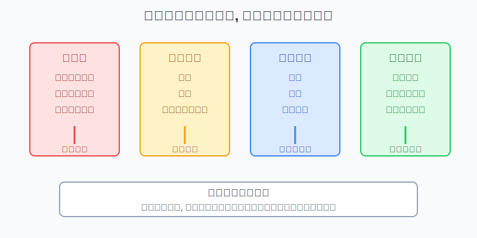
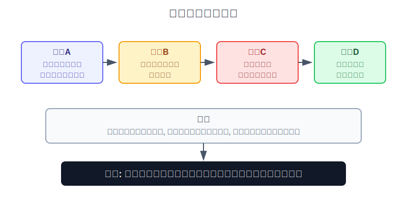
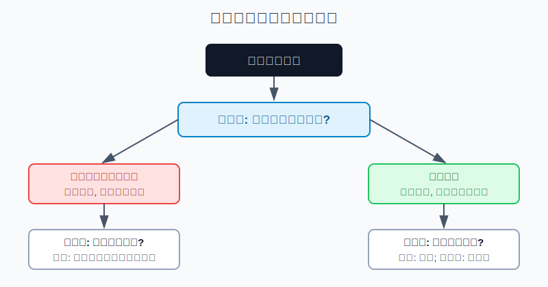

## 散户投资小白金融全品种操盘手册 - 15.12 黑天鹅预案 - 流动性、停牌、暴跌、政策变化
  
### 作者  
digoal  
  
### 日期  
2026-06-07   
  
### 标签  
金融产品 , 金融工具 , 散户 , 投资小白 , 全品操盘手册  
  
----  
  
## 背景 
  

> 适用读者: 已经学过仓位上限、止损、止盈和再平衡，但一遇到突发新闻、暴跌或停牌就不知道该先做什么的小白投资者。  
> 本文定位: 投资教育框架，不构成个性化投资建议。

## 先问一个反直觉的问题

黑天鹅最可怕的地方，不是你没有提前猜中它。普通人本来就猜不中。真正可怕的是: **事件发生后，你发现想卖卖不掉、想补钱没现金、想止损没有成交、想看规则却规则也在变。**

## 核心概念: 黑天鹅预案不是预测, 是保退出能力

黑天鹅，是指低概率、冲击大、事后大家又会找理由解释的突发事件。对散户来说，不需要把它讲得很玄。你只要记住一句话: **黑天鹅来时，最先坏掉的往往不是观点，而是退出能力。**

退出能力包括四件事。第一，流动性，就是你想卖的时候有没有人接盘，买卖价差会不会突然变宽。第二，交易连续性，就是标的会不会停牌、熔断、暂停申赎、额度受限。第三，价格连续性，就是价格会不会跳空、跌停、开盘直接越过你的止损位。第四，规则稳定性，就是监管、交易所、基金公司、券商会不会临时改变交易、保证金、申赎、估值或信息披露规则。

本节行动结论先放在前面: **黑天鹅预案必须写在买入前。任何高波动资产都要提前写清: 现金垫是多少、哪些仓位最先减、哪些资产不能用来救急、停牌或熔断时不做什么、政策变化时等哪几个信号再恢复交易。没有预案的仓位，默认下调一级；带杠杆、低流动性、单一政策敏感品种，默认再下调一级。**

## 逻辑推导链

【论证链标题】: 因为黑天鹅无法提前预测，但它会沿着流动性、交易暂停、价格跳空和规则变化四条路径伤害账户，所以散户要在买入前写好现金、降仓和停止交易预案。

── 第一步: 前提陈述

前提A: 黑天鹅事件无法稳定预测。这是常量。它像突然停电，平时讨论灯泡亮不亮没有意义，真正有用的是你有没有手电、备用电源和逃生路线。

前提B: 市场危机先伤流动性，再伤价格。这是常量。平时你看到的价格，是有买家、有卖家、有撮合、有规则时的价格；恐慌时买盘会变薄，买卖价差会变宽，止损单也会出现滑点。

前提C: 停牌、熔断、暂停申赎和额度限制会让“我随时能走”这句话失效。这是变量，但会反复出现。能交易时你有选择权，不能交易时你只有等待权。

前提D: 政策和交易规则会在极端环境中调整。这是变量。规则变化不一定是坏事，有时是为了稳定市场，但它会让原来的操作计划失效。

前提E: 小白遇到突发事件时容易做三件错事: 用生活钱补仓、加仓摊薄成本、在信息不清楚时频繁交易。这是行为偏差。它像车已经打滑，还用更大油门证明自己没开错。

── 第二步: 逻辑推导

由A可得: 因为黑天鹅无法稳定预测，所以预案不能建立在“我会提前跑掉”上，而要建立在“我没有提前跑掉时还能不能活下来”上。

由A+B可得: 因为危机会让流动性变差，所以高波动、低成交、带杠杆、单一小盘和单一主题仓位，不能等到出事后才处理。它们在平时看起来只是收益弹性，在危机里会变成退出阻力。

再由B+C可得: 因为交易暂停会让止损和再平衡短期失效，所以止损不是唯一防线。真正的第一防线是仓位上限、现金垫和不借钱。

最后由A+B+C+D+E可得: 因为事件、价格、流动性和规则会同时变化，所以黑天鹅预案必须提前写成动作表。**事件发生当天，不新增高风险仓，不用生活钱补仓，不把“跌得多”当成买入理由，先检查流动性、现金和规则。**

── 第三步: 正常情景下的操作结论

✅ 正常情景: 你是普通散户，账户里有ETF、基金、个股、转债、黄金、QDII、港股或美股资产；你没有职业交易系统；这笔资金亏损过大会影响生活和情绪。

对应操作: 买入前把每个资产放进黑天鹅表。宽基核心仓写再平衡规则；行业、个股、转债和REITs写最大仓位和最先减仓条件；QDII、跨境ETF和港美股写汇率、额度、申赎和交易时差风险；期权、期货、黄金T+D、杠杆ETF写强制退出线。账户层面至少保留生活资金和防守资金，不用它们救进攻仓。

── 第四步: 数据和案例证实

证据1: NYSE 2020年3月的市场熔断说明文章写到，当前美国市场熔断以标普500指数下跌幅度为标准，7%触发15分钟暂停，13%再次暂停15分钟，20%则当天剩余时间停止交易；文章还记录2020年3月9日、12日、16日、18日两周内四次触发熔断。这个证据对应前提C: 极端市场里，交易会按预设机制暂停，散户不能假设每一分钟都能自由成交。

证据2: SEC 的 Trading Suspensions 页面说明，美国联邦证券法允许 SEC 在认为符合公共利益和保护投资者需要时，暂停任一股票交易最长10个交易日。这个证据对应前提C和D: 停牌不是个别市场的特殊现象，而是现代市场保护投资者和维持秩序的一部分。

证据3: 伦敦金属交易所 LME 在2022年3月8日的镍市场通知中宣布，镍合约交易自伦敦时间8:15暂停；3月14日的后续通知确认，镍合约将于3月16日8:00恢复交易，并引入日内价格限制、交割延期等安排。这个案例对应前提B、C、D: 极端行情里，价格、交易、交割和规则会一起变化。

证据4: 中国证监会2018年11月6日发布《关于完善上市公司股票停复牌制度的指导意见》，明确“以不停牌为原则、停牌为例外，短期停牌为原则、长期停牌为例外”，并要求压缩停牌期限、增强市场流动性。这个证据对应前提C: 监管层也把流动性和交易机会当作基础制度问题。

证据5: 上交所2016年1月4日公告显示，沪深300指数当日13:33较前一交易日收盘首次下跌达到或超过7%，上交所自13:33开始实施指数熔断，当日不再恢复交易；1月7日，上交所又公告自2016年1月8日起暂停实施指数熔断机制。这个案例对应前提D: 市场规则会根据运行效果调整，散户预案不能假设规则永远不变。

失败案例: 一个10万元账户，7万元压在单一行业ETF和两只同赛道个股上，另有2万元买了可转债和跨境ETF，只留1万元现金。突发政策变化后，行业ETF连续下跌，个股停牌，跨境ETF高溢价回落，可转债流动性变差。他想补仓，却只有生活费可动；想止损，却发现最想卖的品种成交差。失败点不是没有预测政策，而是前提B、C、D同时变化时，他没有现金、没有低流动性仓位上限，也没有先后处理顺序。

历史不代表未来。上面案例仍有参考价值，是因为它们验证的是制度规律: 极端环境里，市场会暂停、规则会调整、流动性会变贵、价格会跳跃。黑天鹅预案不是预测下一次事件，而是防止任何一次事件把账户拖进被动状态。

── 第五步: 前提变化时的替代结论

若前提B变差，也就是买卖价差突然变宽、成交量萎缩、盘口很薄，推导路径变为: 因为退出成本升高，所以不能继续用平时仓位对待它。新结论: 停止加仓，优先降低低流动性和高波动仓位。

若前提C触发，也就是停牌、熔断、暂停申赎或额度受限，推导路径变为: 因为交易动作短期失效，所以不能把计划建立在“马上卖掉”上。新结论: 先检查现金垫和其他可交易资产，不用生活钱救被锁住的仓位。

若前提D改变，也就是政策、交易规则、保证金、基金申赎或估值规则变化，推导路径变为: 因为原计划的信息基础已经改变，所以不能按旧逻辑加仓。新结论: 等规则文本、交易恢复、成交量和价格稳定至少两个信号出现后，再决定是否恢复交易。

若前提E出现，也就是你开始想“跌这么多一定要抄底”“先借点钱补”“停牌前赶紧重仓赌复牌”，推导路径变为: 因为情绪已经越过预案，所以继续交易会把市场风险变成生活风险。新结论: 当天不新增风险仓，只做现金检查和仓位复盘。

## 实操例子: 20万元账户如何写黑天鹅预案

这个例子对应论证链的正常结论: **先写现金和降仓顺序，再谈遇到大跌要不要买。**

假设小林有20万元投资资金，已经另有6个月生活费，不准备借钱。他的组合是: 8万元宽基ETF，4万元债券和货币基金，3万元黄金ETF，2万元红利ETF，2万元半导体ETF，1万元个股和可转债试错仓。

第一步，先定现金底线。小林规定: 投资账户里4万元债券和货币基金是防守层，不为半导体ETF和个股补仓服务；如果家庭生活备用金不足6个月，进攻仓必须先降。这个动作对应前提E: 不让市场风险侵蚀生活账户。

第二步，写降仓顺序。遇到突发事件时，第一优先级不是卖宽基核心仓，而是检查高波动和低流动性仓: 个股、可转债试错仓、半导体ETF、单一主题仓。如果这些仓位合计超过总账户20%，先降到15%以内；如果买卖价差异常，分批挂限价单，不用市价单追着卖。

第三步，写停牌和熔断动作。如果个股停牌，小林不把生活钱转进账户补其他仓位；如果市场熔断或跨境基金暂停申赎，他当天停止新增交易，等交易恢复后再看成交量、溢价率和公告。判断依据来自前提C: 门关上时，动作从“交易”切换成“保存选择权”。

第四步，写暴跌动作。如果宽基ETF一周跌15%，但经济、流动性和长期配置逻辑没有被破坏，小林只按再平衡计划用防守账户的一小部分补回目标仓位，不能一把梭哈。如果半导体ETF跌15%，同时政策或行业逻辑被破坏，不补仓，先降仓或暂停。判断依据来自前提D: 宽基回撤和单一赛道逻辑破坏不是同一种事情。

第五步，写政策变化动作。遇到重大政策、交易规则或基金申赎规则变化时，小林只看三件事: 规则文本是什么，交易是否恢复正常，成交量和买卖价差是否回到可接受范围。三件事没看清，不新增仓位。若消息出来后第一天大涨，他也不追，因为预案的目标是降低被动，不是抢第一根反弹。

如果操作错误，后果很直接。小林若把防守层拿去补半导体ETF，市场继续跌时，组合没有减震器；若个股停牌后借钱补其他品种，投资亏损就变成债务压力；若熔断当天用市价单乱卖，成交价格会被恐慌流动性惩罚。黑天鹅里最贵的不是卖错一次，而是连续做错三个动作。

## 可复用框架

【四门预案】

适用前提: 你持有任何有波动、有交易规则、有流动性差异的资产。

核心逻辑: 因为黑天鹅会通过流动性、交易暂停、价格跳空和规则变化四道门伤害账户，所以每道门都要提前写动作。

操作步骤:

1. 流动性门: 成交量萎缩、价差变宽时，不加仓，先降低流动性资产。
2. 停牌门: 停牌、熔断、暂停申赎时，不用生活钱救仓位，先看现金垫。
3. 暴跌门: 跳空或跌停时，不把市价止损当万能工具，先按仓位上限处理。
4. 政策门: 规则改变时，等公告、交易恢复和成交稳定，再恢复动作。

前提失效时: 如果你没有现金垫、仓位已超上限、或者持有杠杆工具，预案直接升级为减仓模式，不进入抄底模式。

举一反三: 这个框架也适用于港股、美股、QDII、可转债、REITs、商品基金、期权和期货。

【三不一天】

适用前提: 突发事件刚发生，价格剧烈波动，新闻和社群消息很多。

核心逻辑: 因为信息最乱的时候最容易犯大错，所以先限制动作，再收集事实。

操作步骤:

1. 不借钱: 不用信用卡、消费贷、亲友借款、生活费补仓。
2. 不满仓: 不因为跌得多就把现金一次打完。
3. 不追消息: 不用未经证实的传闻决定大额买卖。
4. 当天只做一件事: 检查现金、仓位、流动性和规则，写下下一步触发条件。

前提失效时: 如果账户有杠杆、保证金或短期要用钱，先处理生存问题，不做观点表达。

举一反三: 这个框架适用于财报暴雷、地缘冲突、监管政策、系统故障、基金暂停申赎和市场熔断。

## 本节行动清单

| 动作 | 合格标准 |
|---|---|
| 写现金底线 | 生活资金和防守资金不参与救进攻仓 |
| 标出最先减仓资产 | 个股、主题、低流动性、杠杆和试错仓排在前面 |
| 写停牌动作 | 停牌或熔断时不新增风险仓，先看现金和可交易资产 |
| 写暴跌动作 | 宽基按再平衡，单一赛道按逻辑是否破坏处理 |
| 写政策动作 | 规则文本、交易恢复、成交稳定至少看清两个 |
| 禁止借钱补仓 | 任何黑天鹅当天都不把生活风险转成市场风险 |
| 复盘预案有效性 | 事件后记录哪些动作有用，哪些仓位太难退出 |

## 一句话总结

黑天鹅预案的核心不是猜中下一次危机，而是在危机来时保住现金、流动性和选择权；能退出、能等待、能不被迫交易，账户才有恢复的机会。

## 参考资料

- NYSE: Circuit Breakers Are Doing Their Job, but Don’t Close the Markets，2020年3月，https://www.nyse.com/article/circuit-breakers-are-doing-their-job-but-dont-close-the-markets
- U.S. SEC: Trading Suspensions，https://www.sec.gov/enforcement-litigation/trading-suspensions
- London Metal Exchange: Notice 22/055, Nickel Suspension Update: Criteria for Resumption of Trading and Application of Price Bands，2022年3月8日，https://www.lme.com/-/media/Files/News/Notices/2022/03/TRADING-22-055-NICKEL-SUSPENSION-UPDATE-CRITERIA-FOR-RESUMPTION-OF-TRADING-AND-APPLICATION-OF-PRICE.pdf
- London Metal Exchange: Notice 22/064, Nickel Market Update: Resumption of Trading，2022年3月14日，https://www.lme.com/-/media/files/news/notices/2022/03/trading-22-064-nickel-market-update-resumption-of-trading.pdf
- 中国证监会: 证监会发布《关于完善上市公司股票停复牌制度的指导意见》，2018年11月6日，https://www.csrc.gov.cn/csrc/c100028/c1001141/content.shtml
- 上海证券交易所: 关于实施指数熔断的公告，2016年1月4日，https://www.sse.com.cn/disclosure/announcement/general/c/c_20160104_4031718.shtml
- 上海证券交易所: 关于暂停实施指数熔断机制的通知，2016年1月7日，https://big5.sse.com.cn/site/cht/www.sse.com.cn/aboutus/mediacenter/hotandd/c/c_20160107_4033450.shtml

> ⚠️ **声明**：本文内容为投资教育目的，所有历史数据、策略框架均为辅助学习工具，不构成证券投资建议。市场有风险，投资需谨慎。实际操作请结合自身风险承受能力，必要时咨询专业投顾。
  
#### [PostgreSQL 解决方案集合](../201706/20170601_02.md "40cff096e9ed7122c512b35d8561d9c8")
  
  
#### [德哥 / digoal's Github - 公益是一辈子的事.](https://github.com/digoal/blog/blob/master/README.md "22709685feb7cab07d30f30387f0a9ae")
  
  
#### [About 德哥](https://github.com/digoal/blog/blob/master/me/readme.md "a37735981e7704886ffd590565582dd0")
  
  

  
