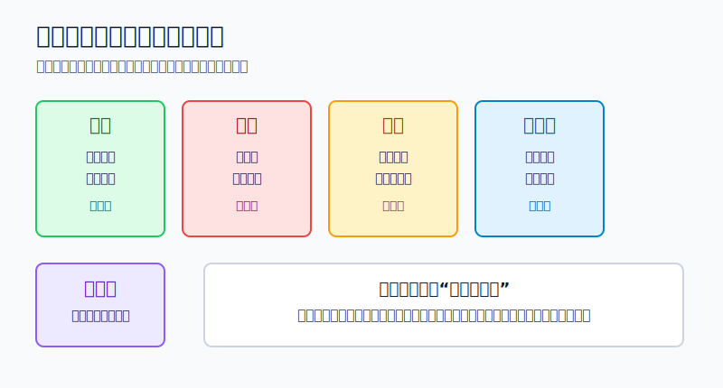
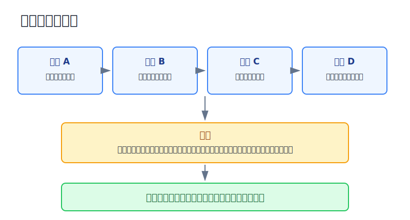
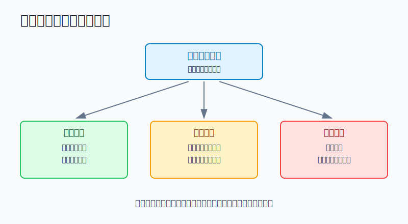

## 散户投资小白金融全品种操盘手册 - 15.13 组合体检表 - 收益、回撤、波动、集中度、相关性
  
### 作者  
digoal  
  
### 日期  
2026-06-07   
  
### 标签  
金融产品 , 金融工具 , 散户 , 投资小白 , 全品操盘手册  
  
----  
  
## 背景 
  

> 适用读者: 已经有多个持仓，但复盘时只会问“今年赚没赚”的小白投资者。  
> 本文定位: 投资教育框架，不构成个性化投资建议。

## 先问一个反直觉的问题

一个组合今年赚了10%，一定健康吗？不一定。如果这10%全靠一只主题基金贡献，账户从高点跌过15%，每天波动让你睡不好，而且所有资产本质上都押同一个方向，那它不是健康组合，只是暂时没出事。

## 核心概念: 组合体检不是看收益榜，而是查风险有没有变形

组合体检，就是固定时间把账户当作一张体检单来检查。体检单至少有五项: 收益、回撤、波动、集中度、相关性。

收益，是账户赚了多少，也要拆清楚是谁赚的。年化收益，就是把一段时间收益折算成一年口径；小白不要只看年化数字，要看收益来源是否过度依赖一个资产。

回撤，是账户从阶段高点跌下来的幅度。它衡量你真实感受到的痛感。组合从20万元涨到22万元，又跌到19万元，回撤不是亏1万元，而是从高点22万元跌到19万元，回撤13.6%。

波动，是账户日常上下摆动的幅度。它像汽车颠簸程度，不一定代表车坏了，但颠到你想跳车，说明仓位不适合你。

集中度，是钱是否压在少数资产、少数行业、少数国家、少数币种或少数风格上。相关性，是这些资产在压力行情里会不会一起跌。相关性可以理解为“同跌概率”。平时看起来是几只不同基金，压力时可能都在押科技成长、美元流动性或中国消费。

本节行动结论先放在前面: **每月做一次组合体检，只记录不频繁交易；每季度做一次正式判断。五项里任意一项红灯，先处理风险，再讨论加仓。收益绿灯但集中度和相关性红灯时，不能因为赚钱就放行。**

## 逻辑推导链

【论证链标题】: 因为单项收益不能说明组合是否健康，所以散户必须同时检查收益质量、下跌痛感、日常摆动、风险集中和压力同跌。

── 第一步: 前提陈述

前提A: 收益只说明结果，不说明结果是怎么来的。这是常量。就像体检只看体重不够，还要看血压、血脂和心率。组合赚了钱，可能来自稳健配置，也可能来自单一重仓赌对。

前提B: 回撤和波动决定你能不能拿住。这是常量加变量。同样10%收益，如果中途回撤3%，你容易坚持；如果中途回撤25%，很多人会在低点割肉。能不能拿住，不只取决于资产好坏，也取决于路径。

前提C: 集中度会把局部错误放大成账户错误。这是变量。单只个股、单一行业、单一主题、单一国家、单一币种，只要占比过高，一个局部问题就能拖住整个账户。

前提D: 相关性在压力行情里会上升。这是变量。平时A股、美股、港股、REITs、长债、黄金看起来各有逻辑，但遇到流动性收紧、利率上行、风险偏好下降时，很多资产会一起下跌。

── 第二步: 逻辑推导

由A可得: 因为收益不说明来源，所以组合体检不能只写“本月赚了多少”。必须拆出收益贡献: 哪个资产赚、哪个资产亏、收益是否来自少数持仓。

由A+B可得: 因为收益路径会影响执行，所以同样的最终收益，要同时看最大回撤和日常波动。一个让你中途扛不住的组合，即使回头看赚了钱，也不适合你复制。

再由B+C可得: 因为集中仓位会放大回撤和波动，所以任何超出上限的持仓，都要先解释风险，而不是用“它最近涨得好”来合理化。

最后由C+D可得: 因为表面分散不等于压力时分散，所以体检必须做相关性压力测试。**如果几个资产坏起来会同时坏，它们就不是几个风险，而是同一个风险的不同包装。**

── 第三步: 正常情景下的操作结论

✅ 正常情景: 你有长期投资资金，已经分出核心仓、卫星仓和防守仓；你希望组合能长期执行，而不是靠一次押中热点赚钱。

对应操作: 每月固定一天记录五项指标。收益看来源，回撤看是否接近预算，波动看是否影响执行，集中度看是否超过上限，相关性看压力情景下会不会同跌。全部绿灯，只记录不交易；出现黄灯，暂停给高风险资产加钱；出现红灯，先降风险，复盘前不新增仓位。

一张小白可用的体检表如下:

| 指标 | 绿灯 | 黄灯 | 红灯 | 动作 |
|---|---|---|---|---|
| 收益 | 收益来源分散，亏赚都能解释 | 收益主要来自1到2个资产 | 赚钱但说不清来源，或靠重仓单一主题 | 先拆收益贡献 |
| 回撤 | 低于预算50% | 达到预算50%-80% | 超过预算80%或突破预算 | 先控仓位 |
| 波动 | 日常波动不影响执行 | 频繁想临时交易 | 波动已影响睡眠、工作和计划 | 降低高波动资产 |
| 集中度 | 单资产、单行业、单币种在上限内 | 接近上限 | 超过上限仍继续加仓 | 再平衡或减仓 |
| 相关性 | 压力时仍有防守资产 | 多个资产风险来源重叠 | 表面多只基金，实际押同一方向 | 做同跌压力测试 |

── 第四步: 数据和案例证实

证据1: FINRA 在《Asset Allocation and Diversification》中说明，资产配置、分散和再平衡是管理投资风险的重要工具；市场表现会改变资产比例，投资者可以在年度检查中考虑是否需要再平衡。这个证据对应前提A和B: 组合健康不是只看收益，而是看资产比例和风险是否仍符合计划。

证据2: Vanguard 2022年研究《Rational Rebalancing》用1989年末到2021年末的数据测算，60%股票/40%债券组合如果从不再平衡，到2021年末股票占比会升到约80%。这个证据对应前提A和C: 赚钱的资产会自动变大，不体检，组合风险会被市场涨跌改写。

证据3: FINRA 2022年文章《Concentrate on Concentration Risk》提醒，当投资组合很大一部分集中在某项投资、资产类别或市场板块时，亏损会被放大；它还建议检查基金和ETF底层持仓是否重叠。这个证据对应前提C: 表面买了多个产品，不等于真正分散。

证据4: S&P Dow Jones Indices 的S&P 500年度数据中，S&P 500 Total Return 在2022年为-18.11%，2023年为+26.29%，2024年为+25.02%。这对应前提B: 同一类资产的年度表现会快速切换，单看某一年收益，容易在上涨后高估承受能力。

证据5: 2022年是相关性压力测试的典型年份。S&P 500 Total Return 为-18.11%；BlackRock的TLT资料显示，iShares 20+ Year Treasury Bond ETF在2022年NAV年度回报为-31.41%。这对应前提D: 长久期债券并不总能在股票下跌时保护账户，利率快速上行时，所谓防守资产也可能一起伤账户。

失败案例: 一个10万元账户，持有纳指100基金30%、半导体ETF20%、AI主题基金20%、某科技龙头10%、现金20%。表面看有5类资产，实际80%都押在科技成长和估值扩张上。如果当年上涨15%，收益指标是绿灯；但集中度和相关性已经红灯。一旦利率上行、科技估值回落或风险偏好下降，这些资产很可能一起跌。失败点不是科技资产一定不好，而是体检表只看收益，漏掉了同一个风险被重复买入。

历史不代表未来。上面数据仍有参考价值，是因为它们验证的是结构规律: 收益会掩盖风险，仓位会漂移，集中会放大亏损，压力行情里不同资产可能一起下跌。

── 第五步: 前提变化时的替代结论

若前提A改变，也就是收益为负但来源清楚、回撤在预算内、集中度没有超限，推导路径变为: 因为这只是计划内波动，所以不需要情绪化清仓。新结论: 记录原因，按原计划执行。

若前提B恶化，也就是回撤达到预算80%，推导路径变为: 因为继续下跌会突破承受力，所以不能再给高波动资产加钱。新结论: 停止新增风险，检查是否需要把卫星仓降回上限。

若前提C恶化，也就是某个行业或国家因为上涨从10%变成25%，推导路径变为: 因为它已经从卫星仓变成组合主导风险，所以不能继续追买。新结论: 用再平衡把它拉回目标区间。

若前提D恶化，也就是压力测试发现多只资产会在同一情景下同跌，推导路径变为: 因为表面分散失效，所以需要真正不同风险来源。新结论: 增加现金、短债、不同币种或不同风险来源资产，而不是继续买同主题的另一个基金。

反例: 如果你的组合收益一般，但回撤低、波动低、集中度合理、压力测试能扛住，它不是“没用的组合”。它可能正适合你的承受力。组合体检的目的不是追求每项最好，而是确认风险没有超出你能执行的范围。

## 实操例子: 20万元账户怎么做一次月度体检

这个例子对应论证链的正常结论: **收益、回撤、波动、集中度、相关性必须一起检查。**

假设小林有20万元长期投资资金，目标是最大回撤不超过15%。一个季度后账户变成21.4万元，表面看赚了7%。持仓如下:

| 持仓 | 市值 | 占比 |
|---|---:|---:|
| A股宽基ETF | 58000元 | 27.1% |
| 美股宽基QDII | 59000元 | 27.6% |
| 港股ETF | 20000元 | 9.3% |
| 黄金ETF | 13000元 | 6.1% |
| 短债和现金 | 40000元 | 18.7% |
| 半导体主题ETF | 24000元 | 11.2% |

第一步，看收益。账户赚了1.4万元，但其中半导体主题贡献约7000元，美股宽基贡献约5000元。收益不是坏事，但来源偏向成长和科技。结论: 收益黄灯，不加码半导体。

第二步，看回撤。过去季度账户最高到21.8万元，最低到20.7万元，最大回撤约5.0%。小林预算是15%，目前只用掉三分之一。结论: 回撤绿灯，不需要因为短期波动清仓。

第三步，看波动。过去一个月有两天单日浮亏超过1.5%，小林当天忍不住临时看盘和想卖。结论: 波动黄灯，说明高波动资产虽然没突破预算，但已经影响执行。

第四步，看集中度。半导体主题占11.2%，超过小林给单一主题设定的10%上限；美股宽基里本来就有大型科技股，再叠加半导体主题，科技成长暴露更高。结论: 集中度红灯。

第五步，看相关性。做一个压力测试: 如果美股宽基下跌20%、A股宽基下跌20%、半导体主题下跌40%，其他资产暂时不动，损失约为59000×20% + 58000×20% + 24000×40% = 31000元左右，占当前账户约14.5%，已经接近15%回撤预算。结论: 相关性红灯。

对应动作不是清空所有风险资产，而是按体检结果处理。第一，停止给半导体主题加钱。第二，把半导体主题从24000元降到15000元左右，回到7%以内。第三，卖出的9000元不去买另一个科技主题，而是补到短债现金或黄金。第四，一个月后复查，如果回撤、波动、集中度恢复绿灯，再恢复原来的定投节奏。

如果小林操作错误，最常见的是看到7%收益后继续加半导体，理由是“强者恒强”。这会让组合从全球分散变成科技成长重仓。等真正回撤来时，他以为自己是在承受市场波动，其实是在承受自己没有体检的后果。

## 可复用框架

【五灯体检】

适用前提: 你已经持有多个资产，至少每月能汇总一次账户。

核心逻辑: 因为收益不能单独代表健康，所以用五盏灯同时判断组合状态。

操作步骤:

1. 收益灯: 拆收益来源，不让单一资产解释大部分收益。
2. 回撤灯: 和最大回撤预算比较，达到预算80%就停止新增风险。
3. 波动灯: 如果波动影响睡眠和执行，说明仓位超过真实承受力。
4. 集中灯: 单一资产、行业、国家、币种、风格超过上限就标红。
5. 相关灯: 做同跌压力测试，检查表面分散是否会一起失效。

前提失效时: 如果五灯里有红灯，不讨论加仓；如果只有收益红灯但其他绿灯，先查策略是否失效，不急着换仓。

举一反三: 这个框架可以用于ETF组合、可转债组合、全球资产组合、退休账户和家庭资产配置。

【同跌测试】

适用前提: 你觉得自己已经分散，但持仓里有多个相似主题。

核心逻辑: 因为压力行情会让相关性上升，所以要问“坏消息来时，它们是不是一起坏”。

操作步骤:

1. 写出每个持仓真正的风险来源: 权益、利率、信用、商品、汇率、杠杆、流动性。
2. 假设同类风险同时下跌: 宽基跌20%，行业跌40%，个股跌50%，长债在利率上行时也下跌。
3. 把损失加总，和组合最大回撤预算比较。
4. 若超过预算，减少重复风险，增加现金、短债或其他真正不同来源的资产。

前提失效时: 如果你说不清持仓风险来源，先把它当作高相关资产处理，不能因为名称不同就当作分散。

举一反三: 买多个基金、多个港股、美股和A股科技资产、多个高股息资产时，都要做同跌测试。

## 本节行动清单

| 动作 | 合格标准 |
|---|---|
| 固定体检日期 | 每月记录一次，每季度正式判断一次 |
| 拆收益来源 | 写清哪几个资产贡献收益和亏损 |
| 对照回撤预算 | 达到预算80%，停止新增高风险仓位 |
| 查持仓重叠 | 看单一行业、国家、币种、风格是否超限 |
| 做同跌压力测试 | 同类风险一起下跌时，组合仍在可承受范围内 |

## 一句话总结

组合体检不是问“今年赚没赚”，而是问“这份收益是不是拿得住、亏得起、不过度集中、压力时不会一起倒”；五项同时健康，组合才是真的健康。

## 参考资料

- FINRA: Asset Allocation and Diversification, https://www.finra.org/investors/investing/investing-basics/asset-allocation-diversification
- Vanguard Research: Rational Rebalancing: An Analytical Approach to Multiasset Portfolio Rebalancing Decisions and Insights, 2022, https://corporate.vanguard.com/content/dam/corp/research/pdf/rational_rebalancing_analytical_approach_to_multiasset_portfolio_rebalancing.pdf
- FINRA: Concentrate on Concentration Risk, 2022年6月15日，https://www.finra.org/investors/insights/concentration-risk
- S&P Dow Jones Indices: S&P 500 Index Overview and Factsheet, https://www.spglobal.com/spdji/en/indices/equity/sp-500/
- BlackRock: iShares 20+ Year Treasury Bond ETF factsheet, https://www.blackrock.com/us/individual/literature/fact-sheet/tlt-ishares-20-year-treasury-bond-etf-fund-fact-sheet-en-us.pdf
- U.S. SEC: Beginners' Guide to Asset Allocation, Diversification, and Rebalancing，https://www.sec.gov/about/reports-publications/investorpubsassetallocationhtm

> ⚠️ **声明**：本文内容为投资教育目的，所有历史数据、策略框架均为辅助学习工具，不构成证券投资建议。市场有风险，投资需谨慎。实际操作请结合自身风险承受能力，必要时咨询专业投顾。
  
#### [PostgreSQL 解决方案集合](../201706/20170601_02.md "40cff096e9ed7122c512b35d8561d9c8")
  
  
#### [德哥 / digoal's Github - 公益是一辈子的事.](https://github.com/digoal/blog/blob/master/README.md "22709685feb7cab07d30f30387f0a9ae")
  
  
#### [About 德哥](https://github.com/digoal/blog/blob/master/me/readme.md "a37735981e7704886ffd590565582dd0")
  
  

  
