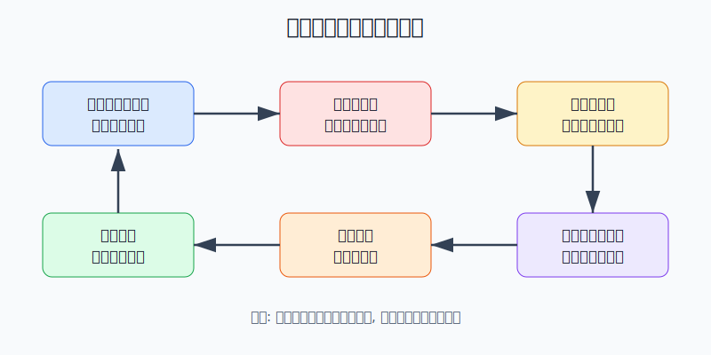
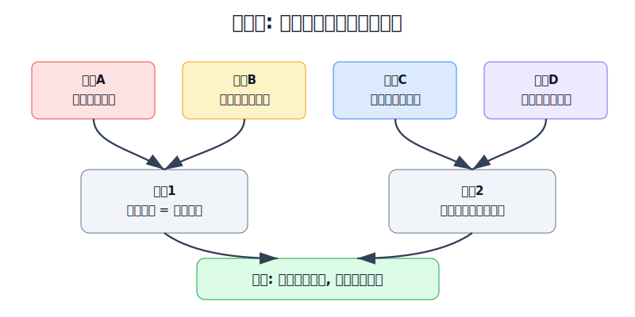
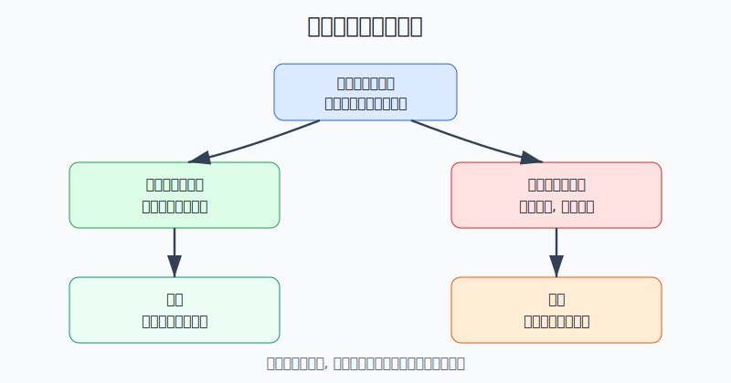

## 散户投资小白金融全品种操盘手册 - 16.1 止损为什么执行不了 - 损失厌恶与侥幸心理
  
### 作者  
digoal  
  
### 日期  
2026-06-07   
  
### 标签  
金融产品 , 金融工具 , 散户 , 投资小白 , 全品操盘手册  
  
----  
  
## 背景 
  

> 适用读者: 已经知道要止损，也写过止损线，但真正跌到那条线时总是下不了手的小白投资者。  
> 本文定位: 投资教育框架，不构成个性化投资建议。规则口径按 2026-06-06 可核查公开资料整理。

## 先问一个反直觉的问题

很多人不是不知道止损，而是太知道止损意味着什么: 一卖出，亏损就从屏幕上的数字变成真实结果。于是人会本能地拖延。**止损执行不了，不是因为你缺一条更神奇的线，而是因为亏损痛感、回本执念和侥幸心理在抢你的方向盘。**

## 核心概念: 止损不是知识题，是执行题

第十五章已经讲过价格止损、逻辑止损、时间止损。那一节解决的是“什么情况下该卖”。本节解决更难的问题: **为什么明明到了该卖的时候，人却做不到。**

用生活里的例子讲，止损像承认自己走错了路。你开车发现导航说前面堵死了，理性动作是掉头；但你已经开了两小时，油钱花了，时间花了，心里会冒出一句话: “再往前一点，万一通了呢？”投资里的亏损也是这样。账面亏损没有卖出前，心里总觉得还有翻盘空间；一旦卖出，就像给这段错误盖章。

这里有三个小白最容易踩的心理坑。

第一是损失厌恶。亏1000元带来的痛感，通常大于赚1000元带来的快乐。亏损不是简单的数字，它会让人觉得自己“判断错了”“不够聪明”“被市场打脸”。所以止损表面是卖出资产，心理上却像承认失败。

第二是侥幸心理。只要还没卖，人就可以继续讲故事: 主力洗盘、长期看好、再拿一拿、跌多了总会反弹。侥幸心理最会伪装成耐心，但真正的耐心是买入前写好的计划，侥幸是亏损后临时改出来的解释。

第三是回本执念。很多人不愿意在亏损处卖出，不是因为这只资产仍然值得持有，而是因为想在原价附近“体面离场”。问题是市场不认识你的成本价。你的成本价只对你的情绪重要，对资产未来涨跌没有约束力。

本节行动结论先放在前面: **不要在亏损后问“我要不要止损”，而要在买入前写成“如果A发生，我就在B时间卖出C仓位”。止损执行力不是靠胆子练出来的，而是靠预承诺、低仓位、固定动作和复盘惩罚机制设计出来的。**

## 逻辑推导链

【论证链标题】: 因为亏损会被大脑放大成痛感和失败感，而人在亏损区更愿意赌反弹，所以止损不能靠临场意志力，必须靠买入前预承诺和仓位约束。

### 第一步: 前提陈述

前提A: 同等金额的亏损，比同等金额的盈利更刺痛。这是常量。赚钱像收到礼物，亏钱像被拿走已有的东西。两者金额一样，但心理重量不同。

前提B: 卖出亏损仓位，会把“还有希望”的账面亏损变成“已经发生”的实际亏损。这是常量。没卖之前，人还能说只是浮亏；卖出之后，就必须承认这笔交易错了或至少阶段性错了。

前提C: 投资者天然更愿意卖掉赚钱的资产，拖着亏钱的资产。这是常见行为偏差。它叫处分效应，意思是人喜欢兑现胜利、回避失败。

前提D: 仓位越大、规则越模糊，侥幸心理越强。这是变量。亏500元时还能执行，亏5000元时就开始找理由；写“跌破关键位卖”容易反悔，写“收盘价连续2天跌破20日线卖一半”更难反悔。

前提E: 止损如果等到亏损后再决定，就变成了和痛感、羞耻感、希望感同时对抗。这是常量。人在情绪最重的时候，最不适合临时制定规则。

### 第二步: 逻辑推导

由A+B可得: 因为亏损痛感更强，而卖出会让亏损落地，所以止损不是普通下单动作，而是一次心理冲击。小白说“我到时会卖”，本质上是在高估亏损时的自己。

由A+B+C可得: 因为人更愿意兑现盈利、拖延亏损，所以止损线触发后，最自然的反应不是执行，而是改口。短线仓会被改成长线仓，试错仓会被改成核心仓，纪律会被改成“再观察一下”。

再由C+D可得: 因为仓位越大、规则越模糊，拖延亏损的理由越多，所以执行力必须在买入前设计。规则越具体，亏损后可发挥的空间越小；仓位越小，执行时的痛感越可控。

最后由A+B+C+D+E可得: **止损执行不了，不是止损知识不足，而是临场决策环境错了。正确做法是把止损从“亏损后做选择”改成“买入前签合同，触发后照合同办”。**

### 第三步: 正常情景下的操作结论

正常情景: 你买入前已经写清买入理由、失效条件、仓位上限和最大可承受亏损，且这笔钱不是短期生活钱。

对应操作:

1. 把止损写成条件句: 如果价格、逻辑或时间条件触发，就在固定时间卖出固定仓位。
2. 把单笔计划亏损压到总账户0.5%-1%以内。小白先让亏损小到可以执行，再谈策略优化。
3. 触发止损后不复辩。当天只执行原计划，不看新观点、不刷社区、不临时补仓。
4. 止损后只做复盘，不做报复性买入。先判断错的是价格、逻辑、仓位还是时间，再决定下一笔。

### 第四步: 数据和案例证实

证据1: 损失厌恶不是口头感觉。Tversky 和 Kahneman 1992年发表于《Journal of Risk and Uncertainty》的累计前景理论论文，在估计价值函数时给出的损失厌恶参数约为2.25。通俗讲，同等金额的亏损痛感大约是盈利快感的两倍量级。这验证前提A: 止损执行天然比止盈更难。

证据2: 真实账户里，人确实倾向卖赢留亏。Terrance Odean 1998年发表于《Journal of Finance》的研究，使用1987年至1993年美国一家大型折扣券商约1万个账户数据，发现除12月税务因素外，投资者实现盈利的比例约14.8%，实现亏损的比例约9.8%。这验证前提C: 人更愿意卖出盈利资产，而不是处理亏损资产。

证据3: 中国市场样本也能看到同类偏差。Chen、Kim、Nofsinger 和 Rui 2007年发表于《Journal of Behavioral Decision Making》的研究，分析1998年5月20日至2002年9月30日中国券商46,969个个人账户和212个机构账户。个人投资者的盈利实现比例为0.5190，亏损实现比例为0.3098，差值0.2092；机构投资者差值为0.0877。这个结果验证前提C和D: 散户更容易拖着亏损仓位，专业账户的偏差相对更小。

证据4: 失败案例来自逻辑止损不执行。2021年7月24日，中共中央办公厅、国务院办公厅发布“双减”意见，要求义务教育阶段学科类校外培训机构统一登记为非营利性机构，学科类培训机构一律不得上市融资。China Daily 对该政策的英文解读也明确提到，现有学科类培训机构必须登记为非营利组织，且不得向公众募资。对持有相关教育中概股的人来说，这不是普通价格波动，而是商业模式前提改变。2021年7月23日，Motley Fool 报道 TAL Education 当日一度下跌约70%。失败点不是“没有等到反弹”，而是逻辑前提已经被政策重写，却仍用回本执念对抗新事实。

历史数据不代表未来会重复，但这些证据说明的是稳定机制: 亏损会放大痛感，账户会诱发卖赢留亏，前提失效时拖延会让小错误变成大风险。所以止损执行力必须在买入前建立，而不是在亏损后临时召唤。

### 第五步: 前提变化时的替代结论

若前提D变强，也就是仓位太大，亏损金额已经让你失眠、频繁看盘、想补仓翻本，推导路径变为: 因为痛感已经超过执行能力，所以不能继续讨论“要不要再等等”。新结论: 先把仓位降到能执行计划的水平，再复盘买入理由。

若前提B被你重新包装，也就是你把“没卖就没亏”当成安慰，推导路径变为: 因为账面亏损同样占用本金和注意力，所以不卖并不等于风险消失。新结论: 回到买入前写的失效条件，只看条件是否触发，不看你愿不愿承认。

若前提C在盈利仓上出现反向诱惑，也就是你急着卖掉小盈利、却把大亏损留下，推导路径变为: 因为你正在用盈利获得心理安慰，而不是优化组合。新结论: 暂停卖出盈利仓，先处理失效亏损仓，避免账户留下越来越多问题资产。

若前提A减弱，也就是你已经通过低仓位和多次复盘训练出执行力，推导路径变为: 因为单笔亏损不会伤到情绪，所以止损可以更接近规则化。新结论: 逐步提高策略的一致性，但仍不取消买入前预案。

失败情景: 小林用10万元账户买入2万元行业ETF，买入计划写着“亏损8%且行业景气数据没有改善，就卖出”。跌到-8%时，他觉得卖出太难受，改成“跌到-15%再说”；跌到-15%时，他又补仓1万元，理由是“摊低成本”。这笔交易的问题不是一次看错，而是前提D恶化后，他把止损线改成了情绪线。原本计划亏损1600元，后面变成更大的组合风险。

## 实操例子: 10万元账户如何让止损真的执行

这个例子对应论证链的正常结论: **买入前把止损写成条件句，并把亏损金额控制到情绪能承受。**

假设小林有10万元投资资金，已经留出生活备用金。他准备拿1万元买一只行业ETF，理由是“行业景气数据连续改善，指数重新站上120日均线”。这笔钱属于卫星仓，不是核心仓。

第一步，先把最大亏损写成金额。小林规定单笔计划亏损不超过总账户1%，也就是1000元。若行业ETF止损距离是8%，那么这笔交易最多买入约12,500元。为了更保守，他只买1万元。这样触发止损时亏损约800元，痛感可控，执行难度下降。这个动作对应前提D: 仓位先小，执行才真。

第二步，把规则写成条件句。小林不写“跌破趋势就卖”这种模糊话，而写: “若收盘价连续2个交易日低于120日均线，且行业景气数据没有继续改善，第二个交易日收盘前卖出一半；若亏损达到8%，全部退出。”这里对应前提E: 不在亏损后临时制定规则。

第三步，写禁止动作。触发止损当天，不补仓，不看社区观点，不把行业ETF改成长期核心仓，不把亏损理由改成“反正总会涨回来”。如果想重新买入，必须等下一次周复盘，重新写买入理由。这个动作对应前提C: 防止卖赢留亏和临时改口。

第四步，设置执行提醒。小林把买入理由、止损条件、复盘日期写进交易记录，并在手机日历里设置复核提醒。每天只看收盘价，不在盘中因为波动反复改主意。这个动作的目的不是提高预测能力，而是减少亏损时的情绪接触。

第五步，触发后做复盘。若最后亏800元卖出，小林只回答四个问题: 买入理由是否清楚？止损条件是否触发？仓位是否让自己还能睡着？有没有违反禁止动作？只要四个问题都合格，这次止损就是合格交易，不因为卖出后反弹而否定纪律。

如果前提不成立，操作要切换。小林如果发现亏800元仍然很痛，说明1万元对他的主动仓仍然偏大，下一次降到5000元；如果他触发止损后忍不住马上买回，说明需要把“止损后冷静期”写成48小时；如果他总在盘中改规则，说明应只用收盘价和周复盘，不做盘中判断。

如果操作错误，后果很清楚。小林若跌8%不卖，跌15%补仓，把1万元仓位加到2万元，亏损从800元扩大到3000元附近，痛感会更强，后面更难执行。纠偏不是找新理由，而是先恢复规则: 卖回原计划仓位，停止补仓，重新判断买入前提是否还成立。

## 可复用框架

【预承诺止损】

适用前提: 你准备买入ETF、个股、可转债、商品基金、黄金、期权或期货学习仓，并且能提前写出买入理由。

核心逻辑: 因为亏损后人会放大痛感、拖延承认错误，所以止损必须在买入前写成可执行合同。

操作步骤:

1. 写条件: 如果什么价格、逻辑或时间条件触发。
2. 写动作: 卖出多少仓位，是一半、三分之一，还是全部。
3. 写时间: 触发后什么时候执行，用收盘前、次日开盘后或周复盘，不用“再看看”。
4. 写禁令: 触发当天不补仓、不改持仓角色、不刷观点找安慰。

前提失效时: 如果你写不出止损条件，先不买；如果亏损后想改规则，先减仓，再复盘；如果规则连续三次被你取消，停止主动交易一个月，只做学习仓。

举一反三: 这个框架能用在止盈、再平衡、黑天鹅预案和期权保险策略里。凡是情绪会干扰执行的地方，都要先写预承诺。

【情绪仓位】

适用前提: 你知道止损规则，但总是在亏损金额变大后执行不了。

核心逻辑: 因为仓位越大，损失厌恶和侥幸心理越强，所以仓位必须小到你能按规则卖出。

操作步骤:

1. 先定账户最大单笔痛感，例如总账户0.5%-1%。
2. 再定止损距离，例如8%、10%或15%。
3. 用“可承受亏损金额 / 止损距离”反推买入金额。
4. 触发止损后记录真实感受。如果仍然痛到无法执行，下次继续降仓。

前提失效时: 如果你为了买更多而把止损距离设得很窄，规则失真；如果你为了不卖而把止损距离越挪越远，纪律失效。两种情况都要回到金额预算。

举一反三: 这个框架尤其适合行业ETF、主题基金、单只个股、转债、期货和期权买方。越高波动，越要先算情绪仓位。

## 本节行动清单

| 动作 | 合格标准 |
|---|---|
| 写买入前预案 | 至少包含买入理由、失效条件、卖出比例、执行时间 |
| 把亏损金额算清 | 单笔计划亏损先控制在总账户0.5%-1%以内 |
| 用条件句表达 | 写“如果A发生, 我在B时间卖C仓位” |
| 禁止亏损后改口 | 短线仓不能改成长线仓, 试错仓不能改成核心仓 |
| 触发后不复辩 | 不刷社区、不临时补仓、不当天买回 |
| 止损后做复盘 | 只复盘规则是否合理和是否执行, 不用事后走势审判纪律 |
| 连续失控就停手 | 连续两次取消止损, 主动仓暂停新买入至少两周 |

## 一句话总结

止损执行不了，是因为亏损会放大痛感、保留希望、诱发侥幸；真正有效的办法不是亏损后鼓起勇气，而是买入前写好合同，触发后只执行。

## 参考资料

- Amos Tversky 与 Daniel Kahneman: Advances in Prospect Theory: Cumulative Representation of Uncertainty, Journal of Risk and Uncertainty, 1992, https://doi.org/10.1007/BF00122574
- Terrance Odean: Are Investors Reluctant to Realize Their Losses?, Journal of Finance, 1998, https://faculty.haas.berkeley.edu/odean/papers/disposition/disposition.html
- Gong-meng Chen, Kenneth A. Kim, John R. Nofsinger, Oliver M. Rui: Trading Performance, Disposition Effect, Overconfidence, Representativeness Bias, and Experience of Emerging Market Investors, Journal of Behavioral Decision Making, 2007, DOI: 10.1002/bdm.561
- 中共中央办公厅、国务院办公厅: 《关于进一步减轻义务教育阶段学生作业负担和校外培训负担的意见》, 2021年7月24日, https://www.gov.cn/zhengce/2021-07/24/content_5627132.htm
- China Daily / State Council policy watch: Wide-ranging guideline to rein in tutoring sector, 2021年7月26日, https://english.www.gov.cn/policies/policywatch/202107/26/content_WS60fdf199c6d0df57f98dd91b.html
- The Motley Fool: Why New Oriental, TAL, and Other Chinese Education Stocks Crashed Today, 2021年7月23日, https://www.fool.com/investing/2021/07/23/why-new-oriental-tal-and-other-chinese-educations/

> ⚠️ **声明**：本文内容为投资教育目的，所有历史数据、策略框架均为辅助学习工具，不构成证券投资建议。市场有风险，投资需谨慎。实际操作请结合自身风险承受能力，必要时咨询专业投顾。
  
#### [PostgreSQL 解决方案集合](../201706/20170601_02.md "40cff096e9ed7122c512b35d8561d9c8")
  
  
#### [德哥 / digoal's Github - 公益是一辈子的事.](https://github.com/digoal/blog/blob/master/README.md "22709685feb7cab07d30f30387f0a9ae")
  
  
#### [About 德哥](https://github.com/digoal/blog/blob/master/me/readme.md "a37735981e7704886ffd590565582dd0")
  
  

  
