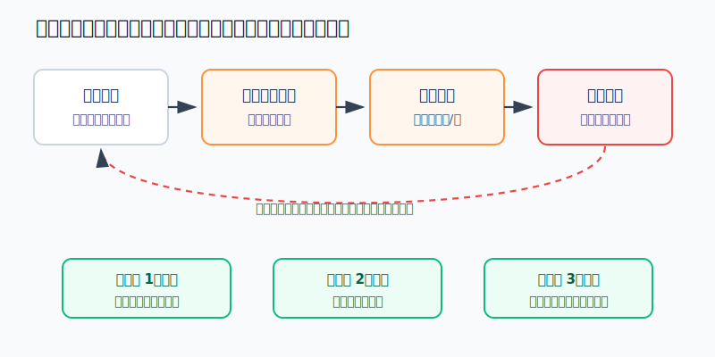
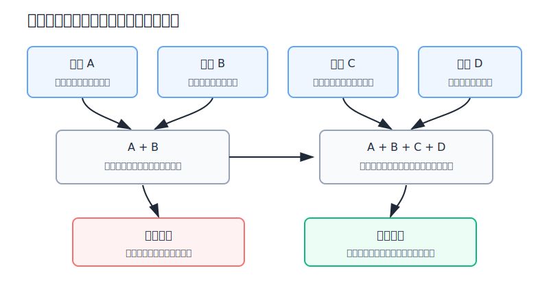
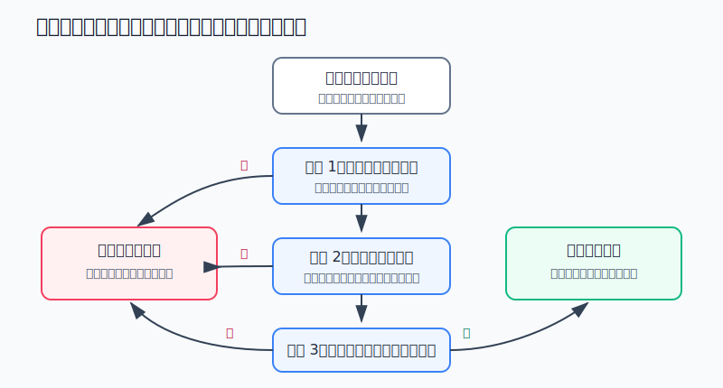

## 散户投资小白金融全品种操盘手册 - 16.2 为什么散户容易追涨杀跌 - 羊群效应与信息过载
  
### 作者  
digoal  
  
### 日期  
2026-06-07   
  
### 标签  
金融产品 , 金融工具 , 散户 , 投资小白 , 全品操盘手册  
  
----  
  
## 背景 
  

> 适用读者: 已经知道仓位、止损、复盘这些词，但一看到大涨大跌还是忍不住下单的小白投资者。  
> 本文定位: 投资教育框架，不构成个性化投资建议。

## 先问一个反直觉的问题

散户追涨杀跌，常常不是因为信息太少，而是因为信息太多。手机里每一条热榜、群聊、短视频和行情弹窗，都在抢你的注意力。**当注意力先被市场噪音占领，判断就会被群体情绪替代。**

## 核心概念: 羊群效应不是“别人傻”，而是人脑想省力

羊群效应，就是一个人看到很多人都在做同一件事，就更容易觉得这件事是对的。放在投资里，就是“大家都在买，所以我不买就落后”“大家都在跑，所以我不卖就完了”。

信息过载，是指你接触的信息数量超过了自己能处理的能力。小白最危险的地方在这里: 他以为自己是在“收集信息”，实际上是在把判断权交给最吵、最热、最容易刺激情绪的内容。

本节行动结论先放在前面: **任何因为热点、群聊、暴涨、暴跌而产生的交易冲动，都必须先过三道闸门: 是否在原计划内、是否有可验证的新证据、仓位和失效条件是否写清。三关不过，不买入、不补仓、不恐慌清仓。**

## 逻辑推导链

【论证链标题】: 因为注意力有限、群体情绪会提供虚假的安全感，而价格波动不等于价值变化，所以散户要用交易前清单截断追涨杀跌。

── 第一步: 前提陈述

前提A: 人的注意力有限，这是常量。市场信息却接近无限，这是变量，而且在行情剧烈时会突然放大。就像一个厨房同时响起十个闹钟，你听见的通常不是最重要的，而是最刺耳的。

前提B: 群体行为会带来安全感，这是常量。一个人买入会害怕，看到很多人都在买，害怕会变成“我是不是要错过了”。一个人卖出会犹豫，看到很多人都在骂市场，犹豫会变成“再不跑就晚了”。

前提C: 价格上涨或下跌只是市场报价变化，不自动等于价值变化，这是常量。ETF上涨，不代表估值一定便宜；个股跌停，不代表基本面一定破产。价格是信号，但不是结论。

前提D: 一键交易降低了行动摩擦，这是变量，而且越来越强。过去下单要打电话、填单子，现在只要点几下。行动越容易，情绪越容易直接变成成交。

── 第二步: 逻辑推导

由A+B可得: 因为注意力有限，而群体行为最容易被看见，所以散户的备选池经常不是“研究后筛出来的资产”，而是“今天最热的资产”。

再由A+B+C可得: 因为价格波动会被群体情绪解释成确定性故事，所以上涨时小白容易把“价格已经涨了”误读成“机会正在消失”，下跌时又把“价格正在跌”误读成“风险已经无法控制”。

最后由A+B+C+D可得: 因为交易摩擦很低，情绪不需要经过计划就能变成订单，所以追涨杀跌的关键风险不是看错一次，而是反复让情绪替你执行交易。

── 第三步: 正常情景下的操作结论

✅ 正常情景: 你没有提前写买入计划；消息来自热榜、群聊、短视频或单一观点；价格已经短期大涨或大跌；你下单的主要感受是怕错过、怕归零、怕被别人笑。

对应操作: 先暂停交易，把冲动写成三句话:

1. 我原计划里有没有这个动作？
2. 今天出现了什么可验证的新证据？
3. 如果我错了，最大仓位、止损条件和复盘时间是什么？

三句话写不清，这笔交易就不是计划，而是情绪。动作不是“少买一点试试”，而是先不动。因为少量情绪交易也会训练大脑: 只要足够兴奋，就可以绕过规则。

── 第四步: 数据和案例证实

证据1: SEC 在2014年6月16日发布的投资者公告《Behavioral Patterns of U.S. Investors》中，总结了会伤害投资表现的行为，包括频繁交易、处置效应、只看过去表现、狂热与恐慌、动量式追逐、噪音交易和分散不足。这个证据对应前提A和B: 投资者行为偏差不是个别人的性格问题，而是普遍会反复出现的决策漏洞。

证据2: Barber 和 Odean 在2000年《Journal of Finance》论文《Trading Is Hazardous to Your Wealth》中研究了1991-1996年一家大型折扣券商的66,465个家庭账户。交易最频繁的一组年化收益为11.4%，同期市场收益为17.9%；平均家庭年化收益为16.4%，组合年换手率为75%。这个证据对应前提D: 频繁行动并不等于更聪明，很多时候只是把佣金、价差和错误判断叠加起来。

证据3: Barber 和 Odean 在2008年《Review of Financial Studies》论文《All That Glitters》中发现，个人投资者更容易成为“吸引注意力股票”的净买入者，例如上新闻、成交量异常放大、单日涨跌极端的股票。这个证据对应前提A: 当可选标的太多时，注意力会先决定你看见什么，然后才轮到你说“我自己判断”。

证据4: Morningstar 的《Mind the Gap US 2025》研究显示，2015-2024年，美国开放式基金和ETF中，平均每一美元投资者实际获得的年化收益，比基金自身总回报低约1.2个百分点；现金流波动越高、交易越频繁的基金，投资者收益差通常越大。这个证据对应推导结论: 买在热时、卖在冷时，会让真实收益低于账面上看到的基金收益。

证据5: SEC 2021年10月发布的早期2021年股票和期权市场结构报告记录，GameStop 在2021年1月8日盘中低点到1月28日盘中高点之间上涨约2700%，随后到2月第一周收盘价下跌超过86%。这个案例不是为了讨论谁对谁错，而是说明当前提A、B、C、D同时强化时，价格、社交情绪、媒体注意力和一键交易会共同制造极端波动。后进场的人如果没有仓位和退出计划，很容易把参与感买成高位风险。

失败案例: 一个10万元账户，看到某主题ETF连续三天大涨，社群里都在说“时代机会”。他没有看估值、成交量、溢价率和仓位上限，直接买入3万元。两周后主题回撤20%，账户亏6%。他不愿承认追涨，又补仓2万元，试图证明自己没错。再跌10%，账户总亏损扩大。这里的错误不是“不该买主题ETF”，而是他让注意力和群体情绪越过了计划。

历史数据不代表未来。上面证据仍有参考价值，是因为它们验证的是行为结构: 人会被热点吸引，会在群体中寻找安全感，会把价格波动误读成确定性，会因为交易太容易而过度行动。只要这个结构不变，追涨杀跌就会反复出现。

── 第五步: 前提变化时的替代结论

若前提C改变，也就是价格上涨背后确实出现了可验证的新证据，例如盈利超预期、政策边际变化、行业供需改善、指数趋势确认，推导路径变为: 价格不是单独理由，而是证据的一部分。新结论: 可以按计划右侧买入，但必须写仓位上限和失效条件。右侧买入，就是等趋势确认后再买，不是看到热闹就冲。

若下跌背后确实是基本面破坏，例如财报造假、现金流恶化、监管红线、产品竞争力下降，推导路径变为: 下跌不是普通波动，而是买入理由失效。新结论: 按卖出计划减仓或清仓，这不是杀跌，而是逻辑止损。

若信息来源无法验证，只来自截图、群聊、匿名爆料或“老师说”，推导路径变为: 因为证据质量不合格，所以价格波动越大，越不能急着行动。新结论: 冷却一晚，只查公告、财报、基金公告、交易所数据和权威新闻。

反例: 趋势交易并不等于追涨。真正的趋势交易有入场条件、止损条件、仓位上限和复盘周期；追涨只有一个理由: “它在涨，而且别人都在说”。两者看起来都是上涨后买，底层完全不同。

## 实操例子: 10万元账户如何处理热点冲动

这个例子对应论证链的正常结论: **任何热点交易先过计划、证据、仓位三道闸门。**

假设小周有10万元投资账户，核心仓是宽基ETF和短债基金，另外允许自己用不超过10%的资金做行业ETF学习仓。某天半导体ETF大涨8%，群里连续刷屏，很多人说“再不上车就没机会”。

第一步，冷却。小周当天不追盘，先把冲动写下来: “我想买，是因为今天大涨、群里都在说、我怕错过。”这一步对应前提A和B: 先承认自己被注意力和群体情绪影响。

第二步，查计划。原计划写着: 行业ETF总仓位不超过10%，单次买入不超过3%，只有在估值没有明显高估、成交量不是异常拥挤、没有大幅溢价时才买。小周当前行业ETF仓位已有6%，所以最多只能再买4%，单次最多3%。

第三步，验事实。他只看四类证据: 基金公告和溢价率、指数估值位置、行业基本面变化、市场整体风险偏好。如果只是价格涨和社群热，没有新证据，就不买。如果确实出现业绩或政策证据，也只能按计划买入3%，不能一口气买满。

第四步，写失效条件。买入后，如果ETF跌破买入理由对应的趋势位置，或者行业基本面证据被证伪，就减回原仓位；如果只是短期回踩但前提没坏，等待周复盘，不在盘中补仓。

第五步，处理恐慌卖出。假设几天后市场大跌，群里开始说“行情结束”。小周先分清两件事: 如果宽基核心仓的长期配置前提没坏，只是市场波动，不清仓；如果行业ETF当初买入证据被证伪，按计划减仓。也就是说，卖出不是因为害怕，而是因为前提失效。

如果小周跳过这些步骤，结果很容易变形: 大涨日买入3万元，回撤后补到5万元，最后把本来10%的学习仓变成50%的情绪仓。此时他面临的不是半导体涨跌问题，而是整个账户被一个热点绑架的问题。

## 可复用框架

【三闸门】

适用前提: 你因为热点、暴涨、暴跌、群消息、短视频或他人观点产生立刻交易的冲动。

核心逻辑: 因为注意力和群体情绪会把价格波动包装成确定性，所以交易前必须先过计划、证据、仓位三道闸门。

操作步骤:

1. 计划闸门: 这个动作是否写在原来的买入或卖出计划里。
2. 证据闸门: 是否有公告、财报、估值、政策、流动性等可验证证据。
3. 仓位闸门: 最大买入金额、最大亏损、止损或复盘条件是否写清。

前提失效时: 如果三关任何一关不通过，冷却一晚，不做盘中情绪单；如果三关都通过，也只按计划执行，不因为兴奋扩大仓位。

举一反三: 这个框架可以用于行业ETF、个股、可转债、黄金、QDII、美股ETF和期权学习仓。

【冷却一晚】

适用前提: 你觉得“不立刻买就没了”或“不立刻卖就完了”。

核心逻辑: 真正由基本面、估值和资产配置支撑的机会，不会因为等一晚就完全消失；只能靠盘中冲动成交的机会，通常不适合小白重仓。

操作步骤:

1. 收盘后记录冲动来源: 涨跌幅、消息源、别人说法、自己的情绪。
2. 第二天只看原始资料: 公告、财报、基金公告、指数数据、交易所信息。
3. 重新计算仓位: 不超过原计划上限，不用补仓证明自己。
4. 写复盘日期: 没有复盘日期的交易，不允许进入账户。

前提失效时: 如果遇到已经写在计划里的风控触发点，例如逻辑止损、仓位超限、杠杆风险扩大，不需要冷却一晚，可以按预案执行。冷却是为了拦截情绪，不是为了拖延风控。

举一反三: 这个框架也适用于卖出决策。恐慌时先问“买入理由是否失效”，不要只问“今天跌了多少”。

## 本节行动清单

| 动作 | 合格标准 |
|---|---|
| 写冲动来源 | 明确是热榜、群聊、暴涨、暴跌、短视频还是公告触发 |
| 过计划闸门 | 原计划里写过这个买入、加仓、减仓或清仓动作 |
| 过证据闸门 | 至少有一个可验证事实，而不是只有观点和情绪 |
| 过仓位闸门 | 买入金额、账户最大亏损、止损或复盘条件写清 |
| 冷却一晚 | 热点盘中不追，恐慌盘中不砍，除非原预案触发 |
| 复盘交易 | 记录这笔交易是计划执行，还是情绪插队 |

## 一句话总结

追涨杀跌的本质，是注意力被热点拿走、判断被群体情绪接管；用计划、证据、仓位三道闸门，把情绪挡在下单按钮外面。

## 参考资料

- SEC Investor.gov: Investor Bulletin: Behavioral Patterns of U.S. Investors, 2014年6月16日，https://www.investor.gov/introduction-investing/general-resources/news-alerts/alerts-bulletins/investor-bulletins-72
- Brad M. Barber and Terrance Odean: Trading Is Hazardous to Your Wealth: The Common Stock Investment Performance of Individual Investors, Journal of Finance, 2000，https://onlinelibrary.wiley.com/doi/10.1111/0022-1082.00226
- Brad M. Barber and Terrance Odean: All That Glitters: The Effect of Attention and News on the Buying Behavior of Individual and Institutional Investors, Review of Financial Studies, 2008，https://academic.oup.com/rfs/article/21/2/785/1607197
- Morningstar: Mind the Gap US 2025，https://www.morningstar.com/business/insights/research/mind-the-gap
- SEC: Staff Report on Equity and Options Market Structure Conditions in Early 2021, 2021年10月，https://www.sec.gov/files/staff-report-equity-options-market-struction-conditions-early-2021.pdf

> ⚠️ **声明**：本文内容为投资教育目的，所有历史数据、策略框架均为辅助学习工具，不构成证券投资建议。市场有风险，投资需谨慎。实际操作请结合自身风险承受能力，必要时咨询专业投顾。
  
#### [PostgreSQL 解决方案集合](../201706/20170601_02.md "40cff096e9ed7122c512b35d8561d9c8")
  
  
#### [德哥 / digoal's Github - 公益是一辈子的事.](https://github.com/digoal/blog/blob/master/README.md "22709685feb7cab07d30f30387f0a9ae")
  
  
#### [About 德哥](https://github.com/digoal/blog/blob/master/me/readme.md "a37735981e7704886ffd590565582dd0")
  
  

  
