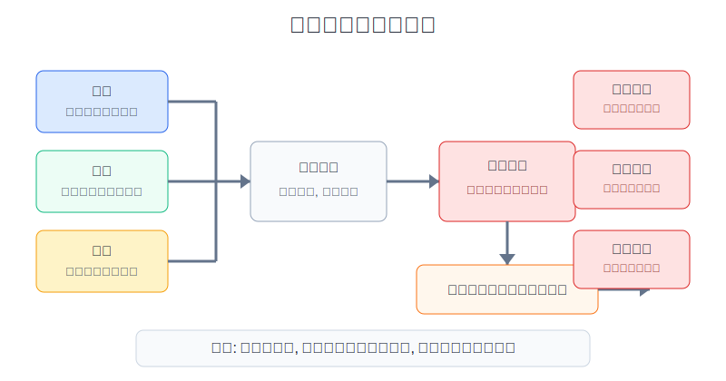
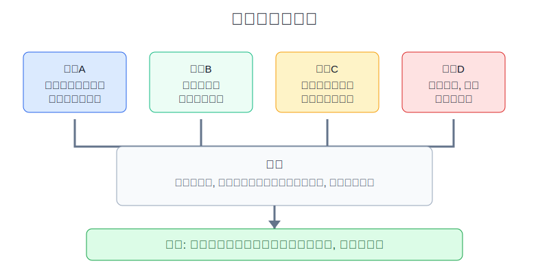
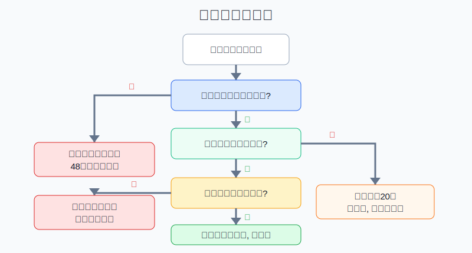

## 散户投资小白金融全品种操盘手册 - 16.3 赚钱后为什么更危险 - 过度自信
  
### 作者  
digoal  
  
### 日期  
2026-06-07   
  
### 标签  
金融产品 , 金融工具 , 散户 , 投资小白 , 全品操盘手册  
  
----  
  
## 背景 
  

> 适用读者: 刚赚过一笔钱、连续几次买对、开始觉得“我找到感觉了”的小白投资者。  
> 本文定位: 投资教育框架，不构成个性化投资建议。

## 先问一个反直觉的问题

亏钱后你会害怕，赚钱后你会兴奋。真正危险的，常常是后者。亏钱会让人停下来，赚钱会让人加速下单。**市场最容易收回利润的时候，不是你不知道风险，而是你觉得自己已经懂了。**

## 核心概念: 过度自信不是有信心，而是信心超过证据

有信心，是你知道自己按规则做了什么，也知道规则在什么条件下会失效。过度自信，是你只看到结果赚钱，就把能力、行情、运气混成一句话: “我判断对了。”

一笔盈利至少有三个来源:

| 来源 | 小白容易怎么误读 | 正确处理 |
|---|---|---|
| 能力 | “我研究水平提高了” | 看是否按买入计划、卖出计划、仓位规则执行 |
| 行情 | “我选的方向特别准” | 看同期宽基、行业、主题是否一起上涨 |
| 运气 | “这就是盘感” | 看样本是否足够，单笔盈利不能证明稳定能力 |

本节行动结论先放在前面: **赚钱后第一件事不是加仓，而是冷却、归因、回表。冷却，是至少隔一个交易日再做新决定；归因，是把盈利拆成能力、行情、运气三部分；回表，是把仓位重新拉回原计划。未完成这三步，不允许因为“刚赚到钱”提高仓位、增加交易频率、放宽止损。**

## 逻辑推导链

【论证链标题】: 因为盈利会强化自我归因，而过度自信会推高交易频率和仓位，所以赚钱后的第一动作是降速，不是加速。

── 第一步: 前提陈述

前提A: 一笔盈利由能力、行情和运气共同决定，这是常量。你买一只行业ETF赚钱，既有你选对行业的成分，也有大盘流动性、行业风格、消息刺激、买入时点的影响。它像打球进了一个三分，进球是真的，但不能直接证明你已经是稳定射手。

前提B: 人有自我归因偏差，这是行为常量。自我归因偏差，就是赚钱时更容易说“我厉害”，亏钱时更容易说“市场不讲道理”。这种偏差会让散户把短期收益误读成长期能力。

前提C: 过度自信会推高交易频率、仓位和冒险程度，这是变量，但在连续赚钱后会明显增强。表现很具体: 原来只买5%仓位，赚钱后想买20%；原来一周看一次，赚钱后一天交易三次；原来写止损，赚钱后说“这次格局大一点”。

前提D: 交易越多，成本和错误越多，这是常量。成本不只是佣金，还包括买卖价差、冲动下单、税费、追高、止损延迟。小白以为自己赚的是判断差价，频繁交易后常常把利润交给摩擦成本和错误决策。

── 第二步: 逻辑推导

由A可得: 因为盈利的原因不是单一能力，所以一笔赚钱不能直接证明“我会交易”。它只能证明: 在当时那组条件下，这笔交易的结果是正的。

由A+B可得: 因为人会把成功更多归给自己，所以盈利后如果不做归因，账户会自动把“行情给的钱”和“运气给的钱”记到能力账上。

再由A+B+C可得: 因为能力被高估会带来更大的仓位和更高的交易频率，所以赚钱后的错误通常不是立刻亏钱，而是下一笔风险变大。

最后由C+D可得: 因为仓位变大和交易变多会同时放大成本、波动和回撤，所以过度自信会把已经赚到的钱变成新的风险来源。

── 第三步: 正常情景下的操作结论

✅ 正常情景: 你刚赚过一笔钱；这笔盈利不足以证明策略稳定；原买入计划没有写清加仓条件；账户里没有足够多的同类样本；你已经出现“这次我看得很准”“下次应该多买点”的想法。

对应操作: 启动盈利后冷却规则。第一，48小时内不因为盈利开新仓或加仓同一方向；第二，把这笔盈利拆成能力、行情、运气三类原因；第三，把仓位拉回原计划上限；第四，只有当策略至少有20笔以上同类记录、最大回撤仍在预算内、买卖规则没有临时改动时，才允许小幅提高下一笔仓位。小幅提高的意思是从5%提高到6%，不是从5%跳到20%。

── 第四步: 数据和案例证实

证据1: Gervais 和 Odean 在2001年《Learning to Be Overconfident》中建立模型说明，交易者会从成功和失败中学习，但会过度把成功归因于自己的能力；在早期交易阶段，预期过度自信水平会上升。这个证据对应前提B: 刚赚到钱的小白最容易把结果误读成能力。

证据2: Barber 和 Odean 在2000年《Trading Is Hazardous to Your Wealth》中研究1991-1996年美国一家折扣券商的66,465个家庭账户，发现交易最活跃的投资者年化收益为11.4%，同期市场为17.9%，平均家庭账户为16.4%。论文把高交易水平和较差表现解释为过度自信的重要后果。这个证据对应前提C和D: 自信过头会变成多交易，多交易会吞掉收益。

证据3: Barber 和 Odean 在2001年《Boys Will Be Boys》中研究超过35,000个家庭账户，发现男性交易比女性多45%；交易使男性年净收益减少2.65个百分点，女性减少1.72个百分点。这里不要把结论理解成性别标签，作者用性别作为过度自信的代理变量，核心教训是: **越觉得自己有把握，越容易多交易；多交易会真实降低净收益。**

证据4: Statman、Thorley 和 Vorkink 在2006年《Investor Overconfidence and Trading Volume》中发现，股票换手率与滞后的市场收益在多个月份内呈正相关；他们把这个关系解释为投资者过度自信的证据之一。这个证据对应前提C: 市场上涨后，人会更想交易。

失败案例: 2020-2021年全球科技成长风格强势时，很多散户把上涨归因于自己“懂科技”“懂成长”。到2022年，Nasdaq 官方月度回顾记录，Nasdaq-100 全年下跌33.0%，是2008年以来最差年度表现。问题不在于科技资产不能买，而在于前提C失控: 如果上涨后把行业贝塔当成个人能力，再把仓位越做越大，行情一反转，利润就会变成回撤。

历史不代表未来。上面数据仍有参考价值，是因为它们验证的是结构规律: 盈利会改变人的自我评价，过度自信会推高交易量和仓位，频繁交易会带来真实成本。心理纪律不是为了否定能力，而是为了防止你把能力、行情、运气混为一谈。

── 第五步: 前提变化时的替代结论

若前提A改变，也就是盈利确实来自可复盘的规则，而不是单笔运气，推导路径变为: 因为规则已被多次样本验证，所以盈利可以作为策略有效性的证据之一。新结论: 可以提高策略信任度，但仓位只能小幅提高，并继续受单笔亏损上限约束。

若前提C变强，也就是你赚钱后已经开始频繁看盘、想满仓、想借钱、想买更刺激的品种，推导路径变为: 因为情绪已经接管风险预算，所以继续交易会放大错误。新结论: 立刻进入停手机制，至少两个交易日只记录不下单。

若前提D被忽视，也就是你说“反正赚来的钱亏一点也没事”，推导路径变为: 因为你把盈利当成赌场筹码，所以风险预算被心理账户扭曲。新结论: 盈利仍然是你的本金，必须按同一套仓位规则管理。

反例: 如果你买的是长期宽基ETF核心仓，盈利来自几年定投和再平衡，而不是短线判断，那么赚钱后不需要因为害怕过度自信而立刻卖出。正确动作是检查目标仓位是否超限、是否需要再平衡、未来用钱时间是否改变。前提不同，操作不同。

## 实操例子: 10万元账户刚赚8000元后怎么处理

这个例子对应论证链的正常结论: **盈利后先冷却、归因、回表，再决定下一笔，而不是把赚钱当作加速许可证。**

假设小周有10万元投资账户，最近用1.5万元买入一只AI主题ETF，三周赚了8000元。他现在很兴奋，准备把仓位加到5万元，还想买一只相关个股。

第一步，启动48小时冷却。小周在两个交易日内不加仓、不新开同方向个股、不提高风险资产比例。这样做对应前提B: 先让自我归因偏差降温。

第二步，拆盈利来源。他检查同期市场: 如果宽基ETF也上涨，科技成长风格也上涨，AI主题整体更强，那么这8000元里有很大一部分来自行情和风格，不全是他的选基能力。没有这一步，他会把市场给的钱当成自己本事。

第三步，仓位回表。小周原计划写的是: 单一主题ETF上限15%，单只个股上限5%，单笔错误最多亏账户2%。现在AI主题ETF市值已经超过2.3万元，占账户约21%。这已经超出计划。动作不是加到5万元，而是把主题ETF减回15%附近，或者至少停止加钱，等季度复盘再处理。

第四步，检验样本。小周只有这一笔AI主题交易，没有20笔同类记录，没有经历过回撤期，也没有证明自己能按计划卖出。所以这笔盈利不能支持仓位翻倍。下一笔如果还要做，只能按原仓位规则做学习仓。

第五步，设置错误后果。如果小周把仓位从1.5万元加到5万元，主题ETF随后回撤25%，账户会亏1.25万元，超过刚赚的8000元，还会倒亏3500元。更糟糕的是，他会开始想“都亏回去了，再等等”，这就从过度自信滑向急于翻本。

如果前提切换，操作也切换。若小周这8000元来自已经运行一年的网格或再平衡策略，且每笔交易都按规则执行，最大回撤也在预算内，那么可以把策略从试错仓升级一点点，例如从10%上限提高到12%。但只要盈利来自单笔押中、热门赛道、消息刺激或短期风格，就默认不能证明能力。

## 可复用框架

【赢后刹车】

适用前提: 你刚赚过一笔钱，尤其是单笔盈利超过账户3%，或连续三笔交易赚钱。

核心逻辑: 因为盈利会强化自我归因，所以先降速，避免把行情和运气误读成能力。

操作步骤:

1. 冷却: 48小时内不因为盈利新开同方向仓位。
2. 归因: 把盈利拆成能力、行情、运气三栏。
3. 回表: 检查仓位是否超过原计划上限。
4. 验样本: 少于20笔同类记录，不提高策略仓位。
5. 写动作: 只允许按原计划复投、减回上限或等待复盘。

前提失效时: 如果盈利来自长期核心配置，不需要因为赚钱本身卖出；检查再平衡阈值即可。如果盈利来自杠杆、期权、期货或单只小盘股，冷却时间至少延长到两个交易日。

举一反三: 这个框架也适用于亏损后的急于翻本。亏损后不是立刻加倍，盈利后也不是立刻加速。

【三因归因】

适用前提: 你想判断一笔赚钱能否证明自己能力提高。

核心逻辑: 因为盈利由能力、行情、运气共同决定，所以必须先拆原因，再决定是否扩大风险。

操作步骤:

1. 能力栏: 是否提前写了买入理由、卖出条件、仓位上限，并按计划执行。
2. 行情栏: 同期宽基、行业、主题是否一起上涨。
3. 运气栏: 是否单笔押中、消息刺激、样本不足、买入时点偶然有利。
4. 结论栏: 只有能力栏证据充分，且行情和运气占比不高，才允许小幅提高下一笔仓位。

前提失效时: 如果无法区分三类原因，默认按运气处理，不加仓，不升级策略。

举一反三: 这个框架可用于ETF、个股、可转债、黄金、期权、期货和美股交易复盘。

## 本节行动清单

| 动作 | 合格标准 |
|---|---|
| 写盈利来源 | 每笔大盈利都拆成能力、行情、运气 |
| 启动冷却 | 盈利后48小时内不冲动加仓同方向 |
| 检查仓位 | 盈利导致超出上限时，先减回计划或停止加钱 |
| 检查样本 | 少于20笔同类记录，不证明策略稳定 |
| 保留止损 | 赚钱后不放宽原来的卖出条件 |
| 拒绝翻倍 | 下一笔仓位只能小幅提高，不能因为赚钱直接翻倍 |

## 一句话总结

赚钱后最危险的不是利润本身，而是你把利润误读成稳定能力；先冷却、再归因、后回表，利润才不会变成下一次亏损的燃料。

## 参考资料

- Simon Gervais and Terrance Odean: Learning to Be Overconfident, Review of Financial Studies, 2001, https://doi.org/10.1093/rfs/14.1.1
- Brad M. Barber and Terrance Odean: Trading Is Hazardous to Your Wealth, Journal of Finance, 2000, https://doi.org/10.1111/0022-1082.00226
- Brad M. Barber and Terrance Odean: Boys Will Be Boys: Gender, Overconfidence, and Common Stock Investment, Quarterly Journal of Economics, 2001, https://doi.org/10.1162/003355301556400
- Meir Statman, Steven Thorley and Keith Vorkink: Investor Overconfidence and Trading Volume, Review of Financial Studies, 2006, https://doi.org/10.1093/rfs/hhj032
- Richard H. Thaler and Eric J. Johnson: Gambling with the House Money and Trying to Break Even, Management Science, 1990, https://doi.org/10.1287/mnsc.36.6.643
- Nasdaq: Nasdaq Index Performance: December 2022, 2023年1月, https://www.nasdaq.com/articles/nasdaq-index-performance-december-2022

> ⚠️ **声明**：本文内容为投资教育目的，所有历史数据、策略框架均为辅助学习工具，不构成证券投资建议。市场有风险，投资需谨慎。实际操作请结合自身风险承受能力，必要时咨询专业投顾。
  
#### [PostgreSQL 解决方案集合](../201706/20170601_02.md "40cff096e9ed7122c512b35d8561d9c8")
  
  
#### [德哥 / digoal's Github - 公益是一辈子的事.](https://github.com/digoal/blog/blob/master/README.md "22709685feb7cab07d30f30387f0a9ae")
  
  
#### [About 德哥](https://github.com/digoal/blog/blob/master/me/readme.md "a37735981e7704886ffd590565582dd0")
  
  

  
