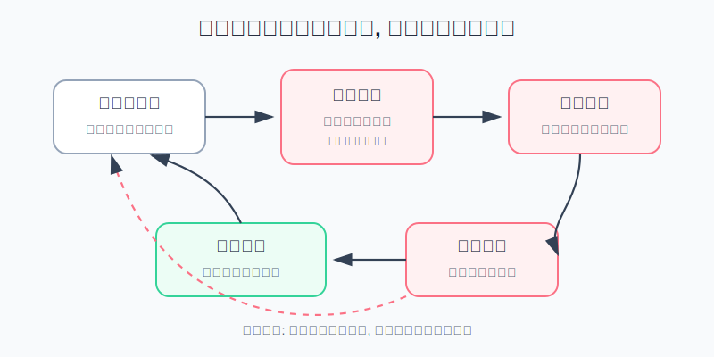
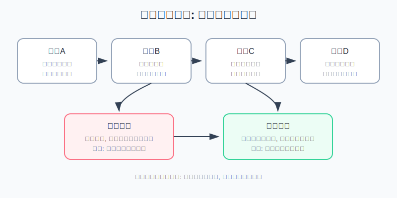
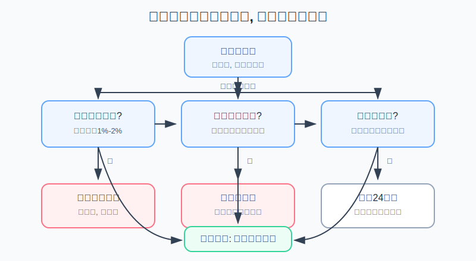

## 散户投资小白金融全品种操盘手册 - 16.4 亏损后为什么更危险 - 急于翻本
  
### 作者  
digoal  
  
### 日期  
2026-06-08   
  
### 标签  
金融产品 , 金融工具 , 散户 , 投资小白 , 全品操盘手册  
  
----  
  
## 背景 
  

> 适用读者: 经历过亏损后会忍不住补仓、加仓、频繁下单，或者总想“今天必须赚回来”的小白投资者。  
> 本文定位: 投资教育框架，不构成个性化投资建议。规则口径按 2026-06-06 可核查公开资料整理。

## 先问一个反直觉的问题

亏损后最危险的时刻，往往不是账户刚刚少了一笔钱，而是你开始觉得“我必须马上把它赚回来”。**一旦目标从执行计划变成抹平亏损，你交易的就不是机会，而是情绪。**

## 核心概念: 急于翻本不是勤奋，是目标被偷换

急于翻本，英文交易圈常叫 revenge trading，直译是“复仇式交易”。这个词听起来像情绪问题，但对散户来说，它本质上是一个风控问题: 原来你每笔交易都有买入理由、仓位上限、止损线和复盘时间；亏损发生后，你突然只剩一个目标: 把钱赢回来。

这就像开车走错了一个出口。正常做法是看导航，找下一个合法掉头点；急于翻本的做法，是在高速路上猛打方向盘。错过出口只是小问题，猛打方向盘才会出大事故。

本节行动结论先放在前面: **亏损后第一动作不是补仓，也不是寻找下一只更猛的票，而是停手。只要出现“想马上回本、想加倍仓位、想取消止损、想换更刺激品种”四个信号中的任意一个，当天主动交易停止；复盘后才能恢复交易，并且下一笔仓位降到原计划的一半。**

## 逻辑推导链

【论证链标题】: 因为亏损会放大痛感并把“回本”变成新的心理目标，而交易优势来自事前规则，不来自情绪补偿，所以亏损后必须先停手、降仓、复盘，不能用加大风险来抹平亏损。

### 第一步: 前提陈述

前提A: 亏损带来的痛感，通常大于同等盈利带来的快感。这是行为金融里的稳定机制。小白可以把它理解成: 捡到100元很开心，但丢掉100元会难受更久。亏损不是简单的数字减少，它会变成“我不能输”的心理压力。

前提B: 人在亏损区间更容易接受更大的赌注。这是常量。前景理论指出，人在盈利区间更偏向保住确定收益，在亏损区间更容易为了摆脱亏损而接受风险。翻成交易语言就是: 赚钱时你急着落袋，亏钱时你反而敢补仓、扛单、加杠杆。

前提C: 亏损会把参照点从“策略是否有效”改成“什么时候回本”。这是变量，但在散户账户里非常常见。买入前你问的是“这笔交易的条件是否满足”；亏损后你问的是“怎样回到成本价”。参照点一变，动作就会变形。

前提D: 交易优势来自事前定义的条件和风险上限。这是常量。无论是ETF定投、行业轮动、个股研究、可转债双低，还是期货学习仓，都必须先有买入条件、仓位上限、止损或失效条件。亏损后的冲动交易没有新增信息，只是新增动作。

前提E: 频繁交易和激进交易会显著增加散户的成本和错误。这是被多组实证数据反复验证的规律。佣金、买卖价差、滑点、税费、错误追涨、低位割肉，都会在高频冲动里叠加。

### 第二步: 逻辑推导

由A+B可得: 因为亏损会更痛，而且人在亏损区间更愿意冒险，所以亏损后天然不是冷静决策时刻。此时下的单，第一动机往往不是“机会更好”，而是“我受不了亏损挂在账户上”。

由B+C可得: 因为参照点已经从策略变成回本，所以你会把不该相关的东西强行连在一起。上一笔ETF亏损，不代表下一笔个股胜率更高；上午期货止损，不代表下午必须加倍赚回来。市场不欠你上一笔亏损。

再由C+D可得: 因为交易优势来自规则，而不是来自情绪补偿，所以一旦你为了回本临时扩大仓位、换品种、取消止损，原来的交易优势就已经消失。此时继续交易，不是在执行策略，而是在修复自尊。

最后由A+B+C+D+E可得: **亏损后的核心动作不是提高攻击性，而是降低决策速度和风险暴露。先停手，再确认买入前提是否还成立；前提成立也只能按原计划或半仓恢复，前提失效就减仓或退出。**

### 第三步: 正常情景下的操作结论

✅ 正常情景: 你刚经历一笔计划内亏损，亏损金额没有超过事前预算，账户总风险仍在可承受范围内。

对应操作:

1. 先冷却30分钟到24小时，期间不做新买入，不做加仓，不换更高波动品种。
2. 写下亏损原因: 是价格止损、逻辑止损、时间止损，还是自己违反规则。
3. 如果亏损是计划内成本，下一笔只能按原仓位或半仓执行，不能加倍。
4. 如果亏损来自买入逻辑失效，先降仓或退出，不用补仓摊低成本。
5. 如果亏损触发日亏损线或周亏损线，当天或本周停止主动交易，只保留既定的再平衡和风控动作。

### 第四步: 数据和案例证实

证据1: Kahneman 和 Tversky 在1979年《Prospect Theory: An Analysis of Decision under Risk》中提出前景理论，用“相对于参照点的收益和损失”解释风险决策；其价值函数在盈利区间呈风险厌恶，在亏损区间呈风险寻求。这验证前提A和B: 亏损后人会更愿意用更大风险换取摆脱亏损的机会。

证据2: Terrance Odean 1998年《Are Investors Reluctant to Realize Their Losses?》研究1987年至1993年美国一家大型折扣券商约1万个账户，发现投资者更愿意卖出盈利股票，而不是卖出亏损股票；论文报告非12月期间实现盈利的比例约14.8%，实现亏损的比例约9.8%。这验证前提C: 亏损会让人拖延承认错误，参照点会卡在成本价附近。

证据3: Barber 和 Odean 2000年《Trading Is Hazardous to Your Wealth》研究1991年至1996年66,465个美国家庭券商账户，发现交易最频繁的账户年化收益约11.4%，同期市场收益约17.9%，平均家庭账户约16.4%。这验证前提E: 更多交易不自动等于更高收益，尤其当交易来自过度自信和情绪推动时。

证据4: Barber、Lee、Liu 和 Odean 关于台湾市场的研究《Just How Much Do Individual Investors Lose by Trading?》使用1995年至1999年台湾市场完整交易资料，估算个人投资者整体组合因交易每年少赚约3.8个百分点，且几乎所有个人交易损失都可追溯到主动进攻型订单。这验证前提D和E: 急着主动出手的一方，往往是在把信息劣势和交易成本交给市场。

历史数据不代表未来会照搬，但这些证据验证的是稳定机制: 亏损会改变人的参照点，人在亏损区间会更敢冒险，频繁主动交易会让散户付出成本。因此，亏损后最该做的不是更努力交易，而是把手从买入键上拿开。

### 第五步: 前提变化时的替代结论

若前提C改变，也就是你亏损后仍能按交易计划复盘，没有出现回本执念，推导路径变为: 因为参照点仍然是策略有效性，而不是成本价，所以可以继续按原计划执行。新结论: 等待下一次满足条件的机会，但仓位不高于原计划。

若前提B明显变强，也就是你开始想“亏了5%，再补一倍只要涨2.5%就回本”，推导路径变为: 因为风险寻求已经接管账户，所以先切断交易。新结论: 当天停止主动交易，把补仓想法写进复盘表，次日再判断。

若前提D失效，也就是你说不清下一笔交易的买入条件、止损条件和仓位上限，推导路径变为: 因为交易优势不存在，所以不能下单。新结论: 账户保持现金或原持仓，直到计划补齐。

若前提E恶化，也就是你从ETF、宽基、低仓位工具切到期权、期货、杠杆ETF、低流动性小票，推导路径变为: 因为波动和成本同时上升，翻本交易会把可控亏损变成账户级风险。新结论: 不升级品种，不加杠杆，不用高风险工具修复低风险工具的亏损。

失败案例: 一个10万元账户原计划用1万元做行业ETF试错，止损8%，最大亏损800元。第一次止损后，他为了当天回本，又拿2万元追同一行业；再亏5%后，他把仓位加到4万元，理由是“反弹一下就回本”。这时原本800元的计划亏损，已经变成超过2000元的组合回撤，而且下一步很容易继续扩大。失败点不是行业判断错了一次，而是亏损后把仓位上限、止损线和交易目标一起改掉。

## 实操例子: 10万元账户如何处理一笔亏损

这个例子对应论证链的正常结论: **亏损后先降低决策速度和风险暴露，而不是用下一笔交易替上一笔亏损报仇。**

假设小林有10万元投资资金，其中6万元是宽基和债券ETF组成的核心仓，2万元是防守资金，2万元是主动仓。主动仓里，他拿1万元买入某行业ETF，买入理由是行业数据改善、价格站上半年线、成交量温和放大。买入计划写得很清楚: 跌破买入价8%且行业数据没有继续改善，就卖出；单笔最大亏损800元。

第一步，亏损发生后先判断是否计划内。行业ETF跌到止损线，小林亏损800元，占总账户0.8%。这笔亏损难受，但没有超过事前预算。对应前提A和B: 难受是真实的，但难受不能成为加仓理由。

第二步，执行停手规则。卖出后，小林当天不再买同一行业，不买更高波动个股，不切到期权或期货。他把交易软件从下单界面切到复盘表，强制冷却到第二天。这个动作对应前提C: 防止参照点从策略变成回本。

第三步，复盘亏损类型。他写下三行: 价格止损触发；行业数据没有继续改善；买入前的半年线突破失败。结论是“试错失败”，不是“市场针对我”。这个动作对应前提D: 只讨论计划和证据，不讨论面子。

第四步，决定下一笔仓位。第二天如果同类机会再次出现，小林只能用5000元半仓试单，而不是2万元加倍交易。理由很简单: 上一笔亏损说明当前环境没有给足确认，下一笔必须降低风险暴露。这个动作对应前提E: 亏损后交易频率和仓位都不能上升。

第五步，设置日亏损线和周亏损线。小林规定: 主动仓单日亏损达到总账户1%，当天停止主动交易；一周亏损达到总账户2%，本周不再开新主动仓，只允许处理已有风险。对10万元账户来说，日亏损线是1000元，周亏损线是2000元。这样做不是保守，而是防止一连串翻本交易把一个小错误变成账户事故。

如果前提不成立，操作要切换。若小林亏损后仍然情绪稳定，且下一笔机会来自完全不同、已经写好计划的低风险ETF，他可以按原计划小仓位执行；若他出现“这次必须赚回来”的念头，不管机会看起来多好，都停止交易。情绪分超过规则，交易资格自动暂停。

如果操作错误，后果也很清楚。小林若在亏800元后加仓到4万元，只要再跌5%，总亏损就扩大到2800元左右，超过周亏损线。此时他面对的已经不是“这只ETF要不要反弹”，而是账户纪律已经失效。纠偏方法不是继续找利好，而是把主动仓降回原计划上限，停手复盘一周。

## 可复用框架

【亏后四停】

适用前提: 你刚经历一笔亏损，尤其是短线交易、行业ETF、个股、可转债、期权、期货或杠杆工具亏损。

核心逻辑: 因为亏损会放大痛感并诱发风险寻求，所以先停止会放大风险的动作，再恢复判断能力。

操作步骤:

1. 停加仓: 不因为亏损而摊低成本，除非原计划写明分批买入条件且条件仍成立。
2. 停换品种: 不从ETF亏损切到个股、期权、期货等更刺激工具。
3. 停加杠杆: 不借钱、不融资、不用杠杆ETF或保证金工具翻本。
4. 停当天主动交易: 触发日亏损线后，只复盘，不开新仓。

前提失效时: 如果亏损只是长期核心仓的正常波动，且资金期限、仓位上限、配置逻辑都没变，不需要机械清仓；但也不能把核心仓波动当成短线翻本的理由。

举一反三: 这个框架可以用在牛市踏空、熊市被套、期权归零、可转债破位、黄金追涨失败等场景。只要你想“马上赢回来”，就先执行四停。

【三线复位】

适用前提: 你已经亏损，并且还想继续参与市场。

核心逻辑: 因为亏损后参照点会偏向回本，所以必须用三条线把账户拉回计划。

操作步骤:

1. 情绪线: 出现愤怒、急躁、羞耻、想加倍、频繁看盘，停止主动交易24小时。
2. 亏损线: 单日亏损达到总账户1%-2%，当天停止主动交易；连续两周亏损，主动仓减半。
3. 计划线: 下一笔交易必须重新写买入理由、仓位上限、止损条件和复盘时间。

前提失效时: 如果你无法执行亏损线，说明主动仓过大；先把主动仓降到即使连续亏三次也不会影响情绪的水平。

举一反三: 这个框架能和第十五章的仓位管理、止损、最大回撤管理连起来。仓位负责让亏损可承受，止损负责让错误停止，复位线负责让情绪不接管下一笔交易。

## 本节行动清单

| 动作 | 合格标准 |
|---|---|
| 写日亏损线 | 例如总账户1%-2%，触发后当天停止主动交易 |
| 写周亏损线 | 例如总账户2%-4%，触发后本周不再开新主动仓 |
| 记录亏损类型 | 价格止损、逻辑止损、时间止损、违反规则四选一 |
| 禁止加倍仓位 | 下一笔仓位不高于原计划，情绪不稳时减半 |
| 禁止升级品种 | 不用期权、期货、杠杆工具去修复ETF或个股亏损 |
| 冷却后再判断 | 亏损后至少30分钟不下单，触发亏损线后冷却24小时 |
| 复盘再恢复 | 没有写清下一笔计划前，不恢复主动交易 |

## 一句话总结

亏损后的纪律只有一句话: 市场不欠你回本，亏损后先停手、降仓、复盘；能按计划亏小钱的人，才有资格继续留在市场里。

## 参考资料

- Daniel Kahneman and Amos Tversky: Prospect Theory: An Analysis of Decision under Risk, Econometrica, 1979, https://www.econometricsociety.org/publications/econometrica/browse/1979/03/01/prospect-theory-analysis-decision-under-risk
- Terrance Odean: Are Investors Reluctant to Realize Their Losses?, Journal of Finance, 1998, https://faculty.haas.berkeley.edu/odean/papers/disposition/disposition.html
- Brad M. Barber and Terrance Odean: Trading Is Hazardous to Your Wealth: The Common Stock Investment Performance of Individual Investors, Journal of Finance, 2000, https://papers.ssrn.com/sol3/Delivery.cfm/000327306.pdf?abstractid=219228
- Brad M. Barber, Yi-Tsung Lee, Yu-Jane Liu and Terrance Odean: Just How Much Do Individual Investors Lose by Trading?, Review of Financial Studies, 2009, https://faculty.haas.berkeley.edu/odean/papers/Taiwan%20Performance/Just%20How%20Much%20Do%20Investors%20Lose.pdf

> ⚠️ **声明**：本文内容为投资教育目的，所有历史数据、策略框架均为辅助学习工具，不构成证券投资建议。市场有风险，投资需谨慎。实际操作请结合自身风险承受能力，必要时咨询专业投顾。
  
#### [PostgreSQL 解决方案集合](../201706/20170601_02.md "40cff096e9ed7122c512b35d8561d9c8")
  
  
#### [德哥 / digoal's Github - 公益是一辈子的事.](https://github.com/digoal/blog/blob/master/README.md "22709685feb7cab07d30f30387f0a9ae")
  
  
#### [About 德哥](https://github.com/digoal/blog/blob/master/me/readme.md "a37735981e7704886ffd590565582dd0")
  
  

  
