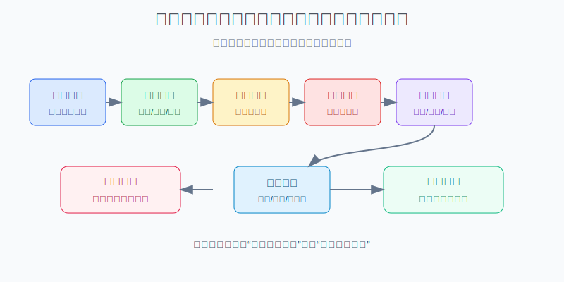
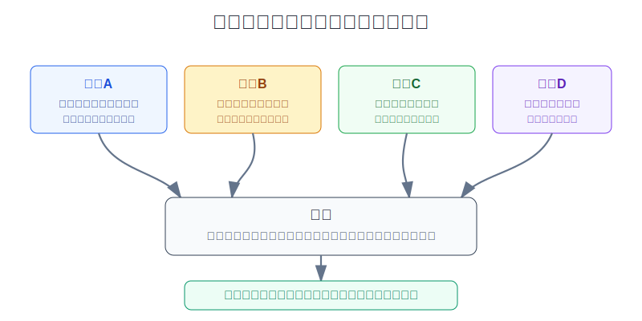
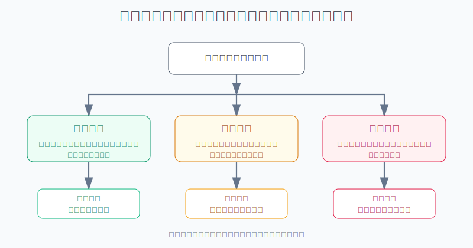

## 散户投资小白金融全品种操盘手册 - 16.5 如何建立交易前检查清单
  
### 作者  
digoal  
  
### 日期  
2026-06-07   
  
### 标签  
金融产品 , 金融工具 , 散户 , 投资小白 , 全品操盘手册  
  
----  
  
## 背景 
  

> 适用读者: 已经学过仓位、止损、止盈和复盘，但一打开交易软件就容易被新闻、涨跌幅和群聊带着走的小白投资者。  
> 本文定位: 投资教育框架，不构成个性化投资建议。

## 先问一个反直觉的问题

很多亏损不是发生在买入之后，而是发生在点“买入”之前。因为在那一刻，你可能还没写清楚为什么买、买错了怎么办、最多亏多少、用什么价格下单。**交易前检查清单的作用，不是让你更聪明，而是让你没准备好时下不了手。**

## 核心概念: 检查清单不是仪式感，而是把冲动变成条件

交易前检查清单，就是在下单前必须回答的一组问题。它不预测明天涨跌，也不替你选股票。它只做一件事: 把“我感觉可以买”变成“条件满足才可以买”。

小白最容易误解清单，以为它是一张很长的表，越复杂越专业。恰好相反，交易前清单必须短、硬、可执行。短，是因为下单前不能写论文；硬，是因为答案必须能判断通过还是不通过；可执行，是因为每一项都要对应一个动作。

本节行动结论先放在前面: **每次买入前，只检查六道门: 交易理由、品种角色、仓位风险、失效条件、卖出计划、下单执行。全部绿灯，按计划下单；出现黄灯，缩小仓位或延后；出现红灯，当天不下单。没有清单的交易，默认就是情绪交易。**

## 逻辑推导链

【论证链标题】: 因为散户下单时最容易被情绪、频繁交易和执行细节伤害，所以必须用交易前检查清单把每一笔交易挡在六道门之外。

── 第一步: 前提陈述

前提A: 人在亏钱、赚钱、看热闹新闻时，判断会变形。这是常量。赚钱后容易过度自信，亏损后容易急于翻本，看到别人赚钱容易追涨。它像晚上开车容易被远光灯晃眼，不是你眼睛坏了，而是环境会让判断变差。

前提B: 频繁交易会持续消耗收益。这是常量。每次交易都会付出显性成本和隐性成本: 佣金、税费、买卖价差、滑点、错过原计划、卖飞好资产、补仓坏资产。

前提C: 下单方式本身也有风险。这是变量。市价单追求成交，但价格可能不是你看到的价格；限价单控制价格，但可能不成交；止损单触发后可能变成市价成交，极端波动时会有滑点。订单不是一个按钮，而是一种风险选择。

前提D: 清单能减少重复任务中的遗漏。这是常量。飞行、手术、工厂检修、消防演练都依赖清单，不是因为专业人员记性差，而是因为高压力场景里，人会漏掉简单但关键的步骤。

── 第二步: 逻辑推导

由A可得: 因为情绪会改变判断，所以不能让“当下感觉”直接变成订单。下单前必须把交易理由写出来，逼自己区分“计划内机会”和“临时冲动”。

由A+B可得: 因为频繁交易会消耗收益，所以每一笔交易都要证明自己有必要。不能只是因为价格动了、群里热了、新闻多了，就把账户变成反应器。

再由A+B+C可得: 因为买入理由、仓位大小和下单方式都会影响结果，所以交易前清单不能只问“买不买”，还要问“买多少、错了怎么办、用什么订单、卖出条件是什么”。

最后由A+B+C+D可得: 因为人会漏、会冲动、会事后找理由，所以清单必须写在买入前。**交易前没有通过六道门，就不下单；如果理由正确但仓位过大，就把仓位降到风险预算内；如果情绪已经失控，就停止交易。**

── 第三步: 正常情景下的操作结论

✅ 正常情景: 你是普通散户，没有经过长期验证的短线交易系统；你买的是ETF、基金、个股、可转债、REITs、黄金、QDII或港美股；这笔钱亏多了会影响睡眠和下一次决策。

对应操作: 下单前用六道门检查。

| 检查门 | 绿灯 | 黄灯 | 红灯 | 动作 |
|---|---|---|---|---|
| 交易理由 | 能用一句话说明买入逻辑和数据依据 | 逻辑有，但数据不完整 | 只因为涨了、跌了、别人说了 | 红灯不下单 |
| 品种角色 | 明确是核心、卫星、防守还是试错 | 角色模糊但风险不高 | 买完会打乱组合结构 | 先定角色 |
| 仓位风险 | 买错后账户亏损在预算内 | 接近预算上限 | 超过单笔亏损预算 | 降仓位 |
| 失效条件 | 写清什么发生就说明买错 | 只有价格线，没有逻辑线 | 没想过错了怎么办 | 不下单 |
| 卖出计划 | 有止损、止盈或复盘触发条件 | 只有大概目标 | 只想买，不想卖 | 先补计划 |
| 下单执行 | 知道用市价、限价还是分批 | 流动性一般 | 价差大、溢价高、波动剧烈仍想追 | 延后或限价 |

── 第四步: 数据和案例证实

证据1: Barber 和 Odean 的论文《Trading Is Hazardous to Your Wealth》研究1991年至1996年一家大型折扣券商的66465个家庭账户，发现交易最活跃的投资者年化收益为11.4%，同期市场为17.9%；平均家庭账户年化收益为16.4%，年换手率达到75%。这个证据对应前提B: 频繁交易不是免费表达观点，它会真实拖累账户结果。

证据2: Barber 和 Odean 的《Boys Will Be Boys》使用1991年2月至1997年1月超过35000个家庭账户数据，发现男性交易频率比女性高45%，年化风险调整后净收益比女性低1.4个百分点；单身男性比单身女性交易多67%，收益低2.3个百分点。这个证据对应前提A和B: 过度自信会把“我看懂了”变成“我多交易”，而多交易未必带来好结果。

证据3: Odean 1998年发表在《Journal of Finance》的研究分析1987年至1993年10000个券商账户，发现投资者明显更愿意卖出赚钱的股票，而不是卖出亏损的股票，这就是处置效应。这个证据对应前提A: 如果买入前不写失效条件，亏损后人会本能地拖延承认错误。

证据4: FINRA 的订单类型说明提醒，市价单在正常交易时间通常能成交在当前买卖价附近，但快速波动时未必拿到原先看到的价格；限价单可以控制价格，但可能完全不成交；止损单触发后会转成市价单。这个证据对应前提C: 下单方式本身就是风险管理的一部分，不能在情绪最热时随手点。

证据5: Haynes 等人在2009年《New England Journal of Medicine》发表的手术安全清单研究，覆盖8家医院，清单引入前后分别收集3733例和3955例非心脏手术患者数据；死亡率从1.5%降到0.8%，住院并发症从11.0%降到7.0%。这个证据对应前提D: 在高压力、重复决策、容易遗漏步骤的场景里，清单能把简单但关键的动作固定下来。

失败案例: 一个10万元账户，看到半导体ETF连续三天大涨，群里都在讨论“主线来了”，小林临时买入2万元。他没有检查组合里已有纳指100、AI主题基金和科技龙头，也没写跌破什么条件退出，更没算半导体ETF如果回撤30%，账户会亏多少。两周后ETF回落18%，他不卖，因为“还没回本”；又补1万元，因为“跌多了应该反弹”。失败点不是半导体一定不能买，而是买入前六道门至少四道红灯: 理由来自热度，角色重复，仓位超预算，失效条件空白。

历史不代表未来。上面研究仍有参考价值，是因为它们验证的是行为规律: 人会过度自信，会交易太多，会卖早赢家、扛住亏损，会在下单细节上犯错。交易前检查清单不是预测市场，而是承认自己会犯这些错，并提前设置栏杆。

── 第五步: 前提变化时的替代结论

若前提A恶化，也就是你刚刚大亏、刚刚大赚、熬夜看盘、被群聊刺激、急着翻本，推导路径变为: 因为情绪已经接管判断，所以清单不能简化。新结论: 当天不新增风险仓，只允许记录想法，第二天再检查。

若前提B改变，也就是这不是临时交易，而是长期计划内的宽基ETF定投，推导路径变为: 因为交易频率已经被计划约束，所以清单可以简化。新结论: 只检查资金期限、目标仓位、估值区间和本次买入金额，不因为短期涨跌取消原计划。

若前提C恶化，也就是标的买卖价差变宽、成交量低、跨境ETF溢价高、财报或政策新闻刚落地，推导路径变为: 因为执行风险变高，所以即使买入逻辑通过，也不能用普通方式下单。新结论: 用限价、分批、降低仓位或等待流动性恢复。

若前提D失效，也就是你的清单太长、太软、每次都能给自己找理由通过，推导路径变为: 因为流程失去约束力，所以清单已经变成安慰剂。新结论: 把清单压缩到六道门，并规定红灯项目一票否决。

## 实操例子: 10万元账户想买半导体ETF，怎么过清单

这个例子对应论证链的正常结论: **一笔交易要先通过理由、角色、仓位、失效、卖出、执行六道门，再允许下单。**

假设小林有10万元长期投资账户，目前持仓是: 沪深300ETF 3万元，标普500QDII 2万元，短债和货币基金2万元，黄金ETF 1万元，纳指100基金1万元，现金1万元。周五半导体ETF大涨4%，他想买入15000元。

第一步，查交易理由。小林写下: “半导体ETF放量上涨，媒体说国产替代加速。”这句话不合格，因为它只有价格和新闻，没有估值、业绩、趋势确认或组合需要。绿灯版本应该是: “半导体行业指数处于过去5年估值中位数以下，价格重新站上60日均线，组合内没有A股成长卫星仓，我只用试错仓参与。”如果写不出这句话，第一门红灯，不下单。

第二步，查品种角色。半导体ETF不是核心资产，它是行业卫星仓。小林已经有1万元纳指100基金，里面科技成长含量不低。如果再买15000元半导体ETF，成长风险会从10%升到25%左右。结论: 角色黄灯，不能按15000元买。

第三步，查仓位风险。小林给行业卫星仓的上限是总账户10%，也就是1万元；给单笔错误的账户亏损预算是2%。如果半导体ETF买错后可能跌30%，允许仓位上限 = 2% ÷ 30% = 6.7%，也就是6700元。结论: 15000元红灯，最多只能做6000元到7000元观察仓。

第四步，查失效条件。小林写下两条: 价格跌破买入价10%，且行业ETF重新跌破60日均线，说明趋势试错失败；若行业估值快速上升到近5年高位但盈利预期没有同步改善，说明赔率变差。结论: 有价格线，也有逻辑线，绿灯。

第五步，查卖出计划。若试错失败，减掉全部观察仓；若上涨20%但估值进入明显偏贵区间，先卖出一半，剩下一半用趋势线跟踪；若三个月后既没有趋势也没有基本面改善，退出并复盘。结论: 绿灯。

第六步，查下单执行。半导体ETF当天涨幅大、波动高，小林不用市价单追。他把计划改成: 当天不追涨；下一个交易日若价格回落到计划区间、溢价率正常、买卖价差可接受，用限价单买入6000元。若没有回落，就放弃这次交易。结论: 执行绿灯，但动作是“等待条件”，不是立刻买。

最终结果: 原本15000元冲动买入，被清单改成最多6000元计划内观察仓，并且必须等价格、溢价和流动性都合格才执行。如果后面半导体继续大涨，小林可能少赚一点；但如果冲高回落，他保住了仓位纪律。清单的目标不是抓住每一次机会，而是防止一次冲动改变账户结构。

如果小林操作错误，后果很清楚: 他用15000元追进去，跌10%时不认错，跌20%时补仓，最后行业卫星仓变成账户主仓。那就不是半导体ETF的问题，而是交易前检查清单缺席的问题。

## 可复用框架

【六门清单】

适用前提: 你准备主动买入任何有波动的资产，包括ETF、基金、个股、转债、REITs、黄金、港美股和QDII。

核心逻辑: 因为散户最容易在下单前被情绪和热度带走，所以把交易拆成六道必须通过的门。

操作步骤:

1. 理由门: 一句话写清买入逻辑，不能只写“涨了”“跌了”“别人推荐”。
2. 角色门: 标明核心、卫星、防守或试错，不能买完后打乱组合结构。
3. 仓位门: 用“账户可亏金额 ÷ 可能跌幅”反推买入上限。
4. 失效门: 写清什么发生说明自己错了，至少包括价格线和逻辑线。
5. 卖出门: 写清止损、止盈、时间复盘或目标仓位调整条件。
6. 执行门: 确认订单类型、流动性、溢价、买卖价差和是否需要分批。

前提失效时: 六门里任何一门红灯，不下单；黄灯超过两项，只允许观察仓；情绪红灯时，当天停止新增交易。

举一反三: 这个框架也可以用于卖出、加仓、补仓、定投暂停和组合再平衡。

【红黄绿法】

适用前提: 你已经有清单，但经常给自己找理由通过。

核心逻辑: 因为软清单会变成自我安慰，所以每项必须落到红、黄、绿三个结果。

操作步骤:

1. 绿灯: 条件清楚、数字明确、动作可执行，允许按计划做。
2. 黄灯: 条件部分成立，但风险或信息不完整，仓位至少减半或延后。
3. 红灯: 理由模糊、仓位超限、失效条件缺失、情绪失控，直接不做。

前提失效时: 如果你发现每次都能把红灯解释成黄灯，说明清单太松。把规则改成“红灯一票否决”，并把当天交易记录到复盘表。

举一反三: 红黄绿法可以用于筛选基金、检查组合集中度、判断是否补仓、评估是否追热点。

## 本节行动清单

| 动作 | 合格标准 |
|---|---|
| 写一页固定清单 | 六道门不超过一页，每项能判断红黄绿 |
| 每次下单前截图或记录 | 留下买入前答案，防止事后改理由 |
| 先算仓位再看收益 | 单笔错误亏损控制在账户预算内 |
| 给红灯一票否决权 | 理由、仓位、失效、情绪任一红灯，当天不交易 |
| 黄灯自动降级 | 两个黄灯以上，只能观察仓或延后 |
| 明确订单类型 | 市价、限价、止损、分批都要提前写清 |
| 复盘清单有效性 | 每月检查哪些红灯救了你，哪些漏项还要补 |

## 一句话总结

交易前检查清单的核心不是提高预测能力，而是把冲动、过度自信、仓位失控和错误下单挡在交易按钮之外；没过六道门，不下单。

## 参考资料

- Brad M. Barber and Terrance Odean: Trading Is Hazardous to Your Wealth: The Common Stock Investment Performance of Individual Investors, 2000, https://faculty.haas.berkeley.edu/odean/papers/returns/individual_investor_performance_4-99.pdf
- Brad M. Barber and Terrance Odean: Boys Will Be Boys: Gender, Overconfidence, and Common Stock Investment, SSRN, 1998, https://papers.ssrn.com/sol3/papers.cfm?abstract_id=139415
- Terrance Odean: Are Investors Reluctant to Realize Their Losses?, Journal of Finance, 1998, https://faculty.haas.berkeley.edu/odean/papers%20current%20versions/areinvestorsreluctant.pdf
- FINRA: Order Types, https://www.finra.org/investors/investing/investment-products/stocks/order-types
- Alex B. Haynes et al.: A Surgical Safety Checklist to Reduce Morbidity and Mortality in a Global Population, New England Journal of Medicine, 2009, https://pubmed.ncbi.nlm.nih.gov/19144931/

> ⚠️ **声明**：本文内容为投资教育目的，所有历史数据、策略框架均为辅助学习工具，不构成证券投资建议。市场有风险，投资需谨慎。实际操作请结合自身风险承受能力，必要时咨询专业投顾。
  
#### [PostgreSQL 解决方案集合](../201706/20170601_02.md "40cff096e9ed7122c512b35d8561d9c8")
  
  
#### [德哥 / digoal's Github - 公益是一辈子的事.](https://github.com/digoal/blog/blob/master/README.md "22709685feb7cab07d30f30387f0a9ae")
  
  
#### [About 德哥](https://github.com/digoal/blog/blob/master/me/readme.md "a37735981e7704886ffd590565582dd0")
  
  

  
