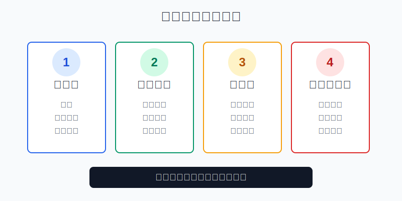
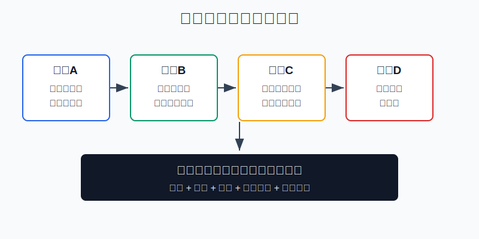
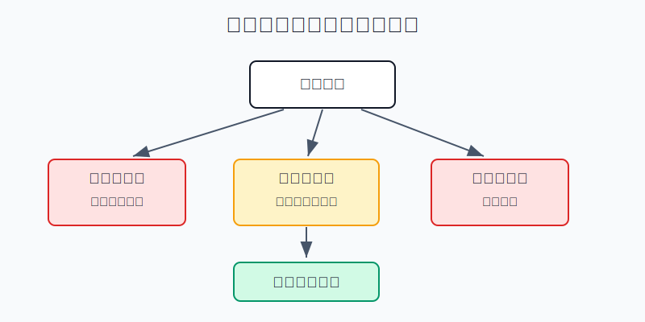

## 散户投资小白金融全品种操盘手册 - 16.6 如何写买入计划 - 买什么、为什么买、错了怎么办
  
### 作者  
digoal  
  
### 日期  
2026-06-08   
  
### 标签  
金融产品 , 金融工具 , 散户 , 投资小白 , 全品操盘手册  
  
----  
  
## 背景 
  

> 适用读者: 已经知道仓位、止损和止盈这些词，但一到真实下单时，仍然靠感觉、热搜、朋友推荐和临时冲动的小白投资者。  
> 本文定位: 投资教育框架，不构成个性化投资建议。

## 先问一个反直觉的问题

买入最容易，点一下就成交；买入计划最难，因为它要求你在最兴奋的时候先承认: **这笔交易会错，而且错了以后不能靠嘴硬解决。**

## 核心概念: 买入计划不是作文, 是下单前的验票口

买入计划只解决三件事: **买什么、为什么买、错了怎么办。** 再细一点，就是四张票。

第一张票是买什么。不是一句“我看好科技”就够了，而是写清品种、账户位置、买入金额、仓位上限、持有期限和下单方式。买一只宽基ETF、买一只行业ETF、买一只个股，承担的风险不是一回事。

第二张票是为什么买。理由必须能落到事实上: 现在是什么市场环境，这个品种赚的是什么钱，支持它的证据是什么。只写“最近很强”“大家都在讲”“跌多了该反弹”，不算理由。

第三张票是买多少。仓位是计划的刹车。没有仓位上限的买入，本质上是在把后续情绪交给市场涨跌管理。

第四张票是错了怎么办。这里要写失效条件、减仓动作、暂停加仓条件和复盘时间。错了怎么办不是悲观，而是保护账户不被一次错误拖进连续错误。

本节行动结论先放在前面: **任何买入动作，先写一页计划。四项没有写全，不买；理由写不清，转入观察清单；仓位超过上限，先降金额；错了没方案，禁止下单。**

## 逻辑推导链

【论证链标题】: 因为散户最容易在买入时被情绪驱动，又最容易在亏损后拒绝承认错误，所以买入计划必须在下单前写清品种、理由、仓位和失效条件。

── 第一步: 前提陈述

前提A: 人会受情绪和信息流驱动。这是常量。价格一涨，社群一热，短视频一刷，人的注意力会被推着走。下单前觉得自己在分析，下单后才发现自己是在跟着气氛跑。

前提B: 买入是最容易的动作，但承担后果的是仓位。这是常量。买入像上车，真正决定你会不会被甩出去的，不是上车姿势，而是车速、座位、安全带和下车路线。

前提C: 没有失效条件，亏损就会被解释成“再等等”。这是变量，但在散户账户里高频出现。没有提前写“什么情况说明我错了”，亏损后大脑会自动替持仓找借口。

前提D: 市场前提会改变。这是变量。你买入时的流动性、估值、政策、利率、行业景气和风险偏好，都不是永久常量。

── 第二步: 逻辑推导

由A+B可得: 因为人会被情绪推着走，而买入又太容易，所以没有书面计划时，下单会变成“先买了再说”。这种买入不是决策，是情绪的即时付款。

由B+C可得: 因为买入后真正承担风险的是仓位，而没有失效条件会让亏损被拖长，所以买入计划必须在下单前写明: 这笔钱最多占账户多少，亏损或逻辑失效时怎么处理。

再由C+D可得: 因为市场前提会变，所以“我看好”不能当作永久护身符。只要买入理由对应的前提改变，操作就要从加仓切换成暂停、减仓或清仓。

最后可得核心结论: **买入计划的本质，是把买入冲动压缩成一张可检查的动作表。表格通过，才允许买；表格不通过，就先观察。**

── 第三步: 正常情景下的操作结论

✅ 正常情景: 你是普通散户，没有职业交易系统；这笔钱亏损会影响情绪，但不会影响基本生活；你买的是ETF、基金、个股、转债、黄金、REITs、港美股或QDII等普通可交易品种。

对应操作: 每次买入前写一页计划，至少包括六行: 品种名称、买入理由、证据来源、买入金额、仓位上限、失效条件。计划写完后先检查三道门: 资金是不是闲钱，仓位有没有超上限，错了以后有没有动作。三道门任意一道没过，不下单。

── 第四步: 数据和案例证实

证据1: Barber 和 Odean 的论文《Trading Is Hazardous to Your Wealth》研究了1991年至1996年一家大型折扣券商的66,465个家庭账户。研究显示，交易最频繁的账户年化收益为11.4%，同期市场为17.9%；普通家庭账户年化收益为16.4%，且平均年换手率约75%。这个证据对应前提A和B: 频繁买卖不自动带来更高收益，情绪化行动会被成本和错误判断惩罚。

证据2: Odean 1998年在《Journal of Finance》发表的处置效应研究，分析了1987年至1993年1万个券商账户。全年口径下，投资者实现盈利的比例PGR为0.148，实现亏损的比例PLR为0.098。通俗说，散户更愿意卖掉赚钱的持仓，却更不愿意承认亏损。这个证据对应前提C: 如果买入前没有写失效条件，亏损后很容易变成长期硬扛。

证据3: SEC 2021年关于GameStop交易事件的工作人员报告显示，GME在2021年1月27日收于347.51美元，较1月11日收盘价上涨超过1600%；1月28日盘中最高483美元，随后到2月第一周收盘价较该高点下跌超过86%。报告还显示，单日交易GME的独立账户数到1月27日从月初不足1万个升至接近90万个。这个案例对应前提A和D: 热点会放大参与冲动，而价格和交易条件会快速反转。

历史不代表未来。上面数据仍有参考价值，是因为它们验证的是行为规律: 没有计划时，人容易交易过度；没有失效条件时，人容易卖赢家、扛输家；热点最热时，参与人数和波动会一起放大。

── 第五步: 前提变化时的替代结论

若前提A变强，也就是你明显被热搜、群聊、短视频和朋友盈利截图刺激，推导路径变为: 情绪接管决策，买入理由可信度下降。新结论: 当天不下单，只把标的放进观察清单，第二天重写理由。

若前提C缺失，也就是你写不出“什么情况说明我错了”，推导路径变为: 亏损后无法判断是正常波动还是逻辑破坏。新结论: 禁止买入，直到失效条件写清。

若前提D改变，也就是原来支持买入的政策、利率、盈利、估值、流动性或行业景气发生变化，推导路径变为: 原计划的信息基础失效。新结论: 停止加仓，先复盘原理由是否还成立；不成立就按计划减仓或清仓。

失败案例: 小李有10万元账户，看到AI主题ETF连续上涨，直接买入2万元，占账户20%。他的理由只有“AI是未来”，没有写估值、成交量、溢价、仓位上限和失效条件。两周后ETF下跌12%，他不愿减仓，又补了1万元，因为觉得“跌下来更便宜”。失败点不是AI主题一定不好，而是买入前没有计划，导致买入、补仓、扛亏都由情绪接管。

## 实操例子: 10万元账户怎么写一页买入计划

这个例子对应论证链的正常结论: **四项合格才买，不合格就观察。**

假设小林有10万元投资资金，生活备用金已经单独留好。他想买一只AI主题ETF，但这类资产只适合放在卫星仓，不适合替代核心宽基。

第一步，写买什么。小林写下: 买入对象是AI主题ETF，不是个股；账户定位是卫星仓；计划持有期限至少3个月；单一主题仓位上限为8%，也就是最多8000元。这个动作对应前提B: 先用仓位限制后果。

第二步，写为什么买。合格理由不能只写“AI有前途”。小林必须写出三条证据: 这个ETF规模和成交量能满足交易，当前没有明显高溢价，买入目的只是组合里的小比例弹性仓。如果三条证据写不出来，就转入观察清单。

第三步，写怎么买。小林不一次买满8000元，而是第一笔买4000元；剩余4000元只在原理由仍成立、账户总仓位没有超标、没有被热点情绪刺激时再买。第二笔不是“跌了就补”，而是“计划仍合格才补”。

第四步，写错了怎么办。小林写清: 如果买入理由中的任一核心证据失效，比如ETF持续高溢价、成交明显变差、主题仓位超过8%、或买入逻辑从组合弹性变成短线赌博，就暂停加仓；如果亏损达到自己预设的卫星仓亏损预算，就减半复盘；如果发现这笔钱会影响生活安排，直接退出。

第五步，写复盘时间。买入后第7天只检查计划是否被破坏，不因为一两天涨跌改计划；每月复盘一次仓位和理由。若计划仍成立但价格下跌，小林也不能自动加仓；若计划不成立但价格上涨，也不能把赚钱当作计划正确。

如果操作错误，后果很清楚。没有仓位上限，2万元主题仓会在下跌时拖累账户；没有失效条件，下跌会变成不断补仓；没有复盘时间，每天看盘会把中期计划做成短线赌博。

## 可复用框架

【三问买入】

适用前提: 你准备买入任何有波动的金融产品。

核心逻辑: 因为买入最容易被情绪驱动，所以先用三问把冲动变成计划。

操作步骤:

1. 买什么: 写清品种、金额、仓位上限、账户位置和持有期限。
2. 为什么买: 写清市场环境、品种逻辑和至少两条可核查证据。
3. 错了怎么办: 写清失效条件、减仓动作、暂停加仓条件和复盘时间。

前提失效时: 三问任意一问写不清，动作从“买入”切换成“观察”。

举一反三: 这个框架适用于ETF、个股、转债、黄金、REITs、QDII、港股、美股和商品基金。

【一页计划】

适用前提: 你容易临时下单，或者买完以后经常不知道该不该补仓、止损、止盈。

核心逻辑: 因为人会在亏损后改口，所以买入前必须把理由和失效条件同时写在同一页。

操作步骤:

1. 一页只写一笔交易，不混多个标的。
2. 用数字写仓位，不用“少买一点”“试试看”。
3. 用条件写退出，不用“到时候再看”。
4. 买入后只按计划复盘，不按群聊和短线涨跌重写理由。

前提失效时: 如果计划写完后发现亏损预算承受不了，直接降低金额或不买。

举一反三: 这个框架也能用于卖出计划、再平衡计划和黑天鹅预案。

## 本节行动清单

| 动作 | 合格标准 |
|---|---|
| 写买入对象 | 品种、金额、账户位置、持有期限写清 |
| 写买入理由 | 至少两条可核查证据，不用口号替代理由 |
| 写仓位上限 | 单一品种、单一行业、卫星仓不得越线 |
| 写失效条件 | 说明哪些变化代表原逻辑不成立 |
| 写错误动作 | 暂停加仓、减仓、清仓或转观察要提前定 |
| 写复盘时间 | 不用每天涨跌临时改计划 |

## 一句话总结

买入计划不是为了保证买对，而是为了让你在买错时还能按规则处理；能把“买什么、为什么买、错了怎么办”写清楚，才算真正完成买入前的决策。

## 参考资料

- Brad M. Barber and Terrance Odean: Trading Is Hazardous to Your Wealth: The Common Stock Investment Performance of Individual Investors，1999年工作论文，https://faculty.haas.berkeley.edu/odean/papers/returns/individual_investor_performance_4-99.pdf
- Terrance Odean: Are Investors Reluctant to Realize Their Losses? Journal of Finance，1998年，https://onlinelibrary.wiley.com/doi/abs/10.1111/0022-1082.00072
- SEC: Ten Things to Consider Before You Make Investing Decisions，https://www.sec.gov/investor/pubs/tenthingstoconsider.htm
- SEC: Staff Report on Equity and Options Market Structure Conditions in Early 2021，2021年10月18日，https://www.sec.gov/files/staff-report-equity-options-market-struction-conditions-early-2021.pdf

> ⚠️ **声明**：本文内容为投资教育目的，所有历史数据、策略框架均为辅助学习工具，不构成证券投资建议。市场有风险，投资需谨慎。实际操作请结合自身风险承受能力，必要时咨询专业投顾。
  
#### [PostgreSQL 解决方案集合](../201706/20170601_02.md "40cff096e9ed7122c512b35d8561d9c8")
  
  
#### [德哥 / digoal's Github - 公益是一辈子的事.](https://github.com/digoal/blog/blob/master/README.md "22709685feb7cab07d30f30387f0a9ae")
  
  
#### [About 德哥](https://github.com/digoal/blog/blob/master/me/readme.md "a37735981e7704886ffd590565582dd0")
  
  

  
