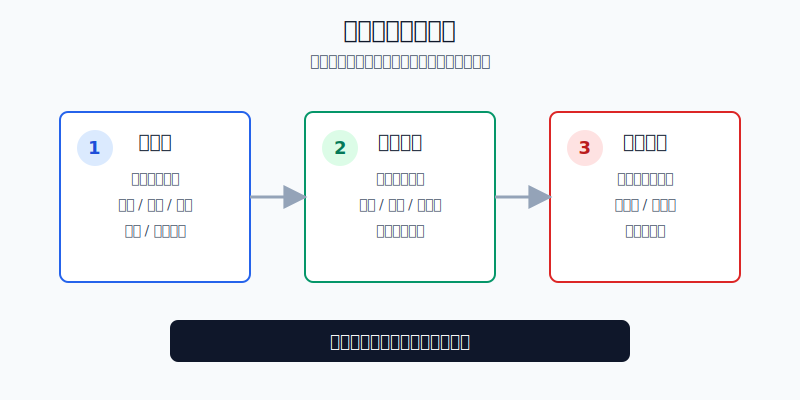
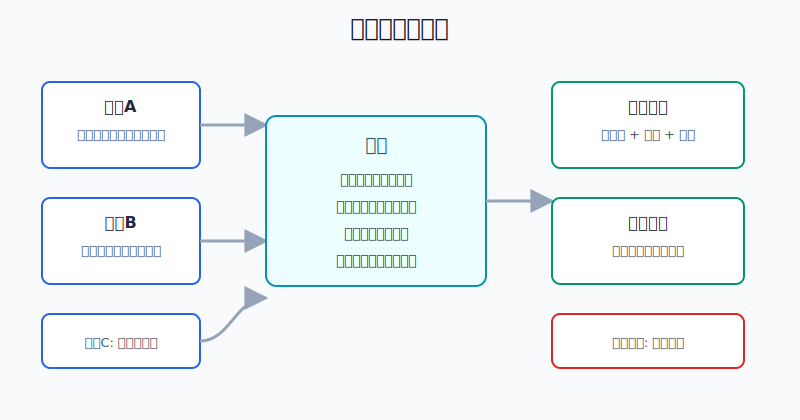
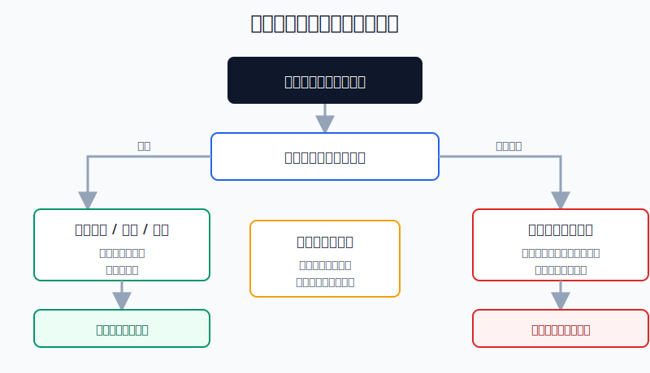

## 散户投资小白金融全品种操盘手册 - 16.7 如何写卖出计划 - 什么时候减仓、什么时候清仓
  
### 作者  
digoal  
  
### 日期  
2026-06-07   
  
### 标签  
金融产品 , 金融工具 , 散户 , 投资小白 , 全品操盘手册  
  
----  
  
## 背景 
  

> 适用读者: 已经知道要写买入理由，但一到卖出就被“再等等”“卖飞怎么办”“跌回来就不卖了”困住的小白投资者。  
> 本文定位: 投资教育框架，不构成个性化投资建议。规则口径按 2026-06-06 可核查公开资料整理。

## 先问一个反直觉的问题

卖出计划不是为了让你卖在最高点，而是为了让你在情绪最强的时候还能按规则行动。真正危险的不是少赚一段，而是赚钱时不肯减仓，亏损时不肯清仓，最后让一笔持仓从“计划内风险”变成“账户里的情绪炸弹”。

## 核心概念: 卖出计划不是一句“看情况”

一份合格的卖出计划，只写三件事。

第一，触发器。触发器就是“什么变化发生了，我才卖”。比如估值进入高估区、趋势跌破计划线、单只仓位超过上限、买入逻辑被财报证伪、资金三个月后要用。没有触发器，卖出就会变成刷行情、听消息、看心情。

第二，动作幅度。动作幅度就是“卖多少”。减仓和清仓不是一回事。公司没坏、指数没坏，只是估值高或仓位超标，通常是减仓；买入理由被证伪，或者资金用途改变，才考虑清仓或降到观察仓。观察仓就是留少量仓位继续跟踪，但不让它影响账户结果。

第三，复核时间。复核时间就是“什么时候重新判断”。比如个股等下一次财报，行业ETF每周看一次趋势和估值，组合每月检查仓位。没有复核时间，小白最容易把“等等看”拖成无限期持有。

本节行动结论先放在前面: **卖出计划必须写成“触发器 + 动作幅度 + 复核时间”。估值、趋势、仓位这些计划内风险，先减仓；买入逻辑、资金用途、风险承受能力这些底层前提失效，清仓或降到观察仓；三条线都没触发，不因为浮盈或浮亏本身乱卖。**

## 逻辑推导链

【论证链标题】: 因为卖出时人最容易被盈利、亏损和后悔感控制，而持仓风险又来自计划前提是否失效，所以卖出计划必须提前写清触发器、动作幅度和复核时间。

### 第一步: 前提陈述

前提A: 卖出比买入更容易受情绪影响。这是常量。买入时你像在做选择题，卖出时你像在处理账面得失: 涨了怕卖飞，跌了怕认错，横盘怕浪费时间。

前提B: 盈利本身不是卖出理由，亏损本身也不是卖出理由。这是常量。盈利只能说明过去价格涨过，亏损只能说明现在价格低于买入价。真正决定卖不卖的是: 当初持有这笔资产的前提还在不在。

前提C: 持仓风险会随着估值、趋势和仓位变化。这是变量。资产上涨后可能变贵，也可能让仓位变大；资产下跌后可能只是波动，也可能跌破原来的趋势结构。

前提D: 买入逻辑、资金用途和风险承受能力是底层前提。这是变量。比如个股财报证伪增长逻辑，短期要用钱，连续亏损后已经睡不好觉，这些都不是普通波动，而是持有条件改变。

前提E: 临场决策会放大行为偏差。这是常量。没有提前写好的规则，人会天然倾向于卖掉赚钱的持仓、拖住亏损的持仓，或者在行情剧烈波动时改口。

### 第二步: 逻辑推导

由A+E可得: 因为卖出时情绪强、临场判断容易偏，所以卖出规则必须写在买入前。等到已经大涨或大跌再写，本质上是在替当前情绪找理由。

由B+C可得: 因为盈利和亏损都不能单独说明持有前提失效，所以估值、趋势和仓位只应该触发“降低风险”，不应该自动触发“一键清仓”。如果资产没坏，只是仓位超标，卖出超出部分就够；如果趋势破位但逻辑未坏，可以先减交易仓。

由B+D可得: 因为买入逻辑、资金用途和风险承受能力是底层前提，所以它们一旦失效，卖出动作要升级。此时问题不再是“少赚一点还是多赚一点”，而是这笔持仓已经不适合继续放在原来的位置。

最后由A+B+C+D+E可得: **卖出计划不是预测顶部，而是把不同前提变化翻译成不同动作: 计划内风险用减仓处理，底层前提失效用清仓或观察仓处理，尚未触发规则就按复核时间继续观察。**

### 第三步: 正常情景下的操作结论

✅ 正常情景: 你买入前已经写清持仓角色、买入理由、估值或趋势参考、仓位上限、资金期限和复核日期。

对应操作:

1. 只触发估值线: 资产逻辑没坏，但价格进入高估区，卖出20%-30%，继续高估再卖第二档。
2. 只触发趋势线: 交易仓跌破计划线，先减半；反弹无法修复，再降到观察仓。
3. 只触发仓位线: 单只个股、行业ETF、黄金、转债等超过上限，卖出超出部分，回到目标区间。
4. 买入逻辑被证伪: 财报、行业、监管、竞争或产品事实破坏原假设，清仓或降到1%-3%观察仓。
5. 资金用途改变: 三到六个月内要用的钱，不再等行情，先从风险资产撤出。
6. 三条线都没触发: 不因为“赚了不少”或“亏了一点”乱卖，只按复核日期检查。

### 第四步: 数据和案例证实

证据1: Terrance Odean 1998年发表在《Journal of Finance》的研究《Are Investors Reluctant to Realize Their Losses?》分析1987年至1993年美国一家大型折扣券商约1万个账户，发现投资者卖出盈利股票的比例约14.8%，卖出亏损股票的比例约9.8%。这个证据对应前提E: 人天然更愿意兑现盈利、拖延亏损，所以卖出计划要提前写。

证据2: Peter Gollwitzer 和 Paschal Sheeran 2006年关于 implementation intentions 的元分析覆盖94项独立研究，结论是“如果-那么”式计划对目标实现有中到大的正向效果，平均效应量约 d=0.65。这里的“如果-那么”计划，就是“如果触发器出现，那么执行预先动作”。这个证据对应前提A+E: 行动规则越具体，越能减少临场摇摆。

证据3: Vanguard 2022年研究《Rational Rebalancing》用1989年末到2021年末的数据测算，60%股票/40%债券组合如果从不再平衡，到2021年末股票占比会升到约80%。这个证据对应前提C: 上涨会自动改变仓位风险，卖出超出部分不是看空，而是把组合拉回计划。

证据4: SEC Investor.gov 的资产配置投资者教育材料说明，某些投资上涨更快会让组合偏离原目标并改变整体风险，投资者可以通过卖出部分资产或买入其他资产让组合回到目标配置。这个证据同样验证仓位线: 卖出可以是风险校准，不是情绪判断。

证据5: FINRA 2025年3月26日投资者教育文章《Stop Orders: Factors to Consider During Volatile Markets》提醒，止损单触发后通常会变成市价单，成交价格可能与止损价不同，尤其在波动剧烈、跳空或流动性不足时。这个证据对应动作幅度: 计划不能只写“跌到某价卖”，还要写卖多少、用什么方式、遇到成交不理想怎么处理。

失败案例: 一个小白买入2万元行业ETF，原计划是“估值进入高估区先卖30%，跌破60日线减半，行业景气被证伪则退出”。后来ETF上涨35%，估值已经高估，他因为怕卖飞不减仓；随后跌破60日线，他又说“长期看好”；等行业数据转弱时，盈利已经回吐大半。这个反例说明: 触发器写了但不执行，卖出计划就会退化成事后安慰。

历史数据不代表未来会重复，但这些证据验证的是稳定机制: 人会受损失厌恶和后悔感影响，仓位会随价格漂移，交易工具也不能保证理想成交。所以卖出计划必须提前写成动作，而不是行情剧烈时临场发挥。

### 第五步: 前提变化时的替代结论

若前提C改变，也就是估值过热、趋势转弱或仓位超标，但前提D没有改变，推导路径变为: 因为底层持有理由还在，只是计划内风险升高，所以不需要清仓。新结论: 分批减仓或再平衡，保留符合计划的仓位。

若前提D改变，也就是买入逻辑被事实证伪、资金用途变短、风险承受能力下降，推导路径变为: 因为持有前提已经变了，所以原计划不能继续沿用。新结论: 清仓，或降到不影响账户结果的观察仓。

若前提E在波动中变强，也就是你开始取消止损、临时加仓、把短线改成长线，推导路径变为: 因为行为偏差已经接管账户，所以先降风险，再复盘。新结论: 暂停新买入，按原计划卖出，连续两次违反计划则本周停止主动交易。

若三条线都没有触发，推导路径变为: 因为没有证据说明计划失效，所以不做情绪卖出。新结论: 按复核时间继续观察，下一次只检查触发器，不刷新一套新理由。

## 实操例子: 10万元账户如何写卖出计划

这个例子对应论证链的正常结论: **先把触发器、动作幅度和复核时间写出来，再决定减仓还是清仓。**

假设小林有10万元投资账户，已经留好生活备用金。组合计划是: 宽基ETF 50%，行业ETF 15%，黄金ETF 10%，可转债组合10%，现金和短债15%。其中行业ETF属于卫星仓，黄金属于防守仓，可转债属于收益增强仓。

第一步，写行业ETF卖出计划。小林买入行业ETF的理由是“行业景气改善，指数估值还在合理区间，价格重新站上半年线”。他写下三个触发器: 估值进入过去五年较高区域，卖出30%；跌破半年线并连续5个交易日收不回，卖出一半；行业景气数据连续两个观察期转弱，清仓或降到3000元观察仓。复核时间是每周看价格结构，每月看行业数据。这里对应前提C和D: 估值、趋势是减仓触发器，景气证伪是清仓触发器。

第二步，写黄金ETF卖出计划。黄金的角色是防守资产，不是短线暴富工具。小林写下: 黄金仓位从10%涨到13%以上，卖出超出部分回到10%；如果实际利率明显上行、避险需求回落、组合又没有其他风险暴露，就把黄金降到8%-10%；如果只是短期价格波动，不因为涨跌本身卖出。这里对应前提C: 仓位超标先再平衡，不把防守仓炒成重仓赌局。

第三步，写可转债卖出计划。小林持有一组低价转债，买入理由是价格和溢价率都不高。他写下: 单只涨到目标价且转股溢价率明显抬高，减仓；触发强赎公告后，不再幻想继续大赚，按公告节奏退出；信用评级、正股基本面或流动性明显恶化，清仓该单只。这里对应前提D: 条款和信用前提一旦变化，不再按原来的收益增强逻辑持有。

第四步，写总账户卖出计划。任何单个行业ETF不得超过15%，单只个股不得超过8%，黄金不得超过12%，转债单只不得超过3%。超过上限时，卖出超出部分；如果连续三笔交易没有按计划执行，主动仓停止一周，只做复盘。这里对应前提E: 纪律失效本身就是风险信号。

第五步，写成交方式。小林不只写“到价就卖”，还写清楚: 流动性好的ETF用限价单分两档卖；成交量小的转债不在开盘前几分钟和尾盘最后几分钟急卖；遇到跳空低开，先卖到风险能承受，再复核是否继续退出。这里对应证据5: 订单不是保险，成交质量也要写进计划。

如果前提不成立，操作要切换。比如小林三个月后要交一笔大额支出，他不能说“等反弹再卖”，而要先把需要的钱从行业ETF、转债等波动资产里撤出来。比如行业ETF已经跌破趋势线但行业数据没有坏，他可以先减仓，不必清仓。比如财报或行业数据已经证伪买入逻辑，就不要用“已经跌了很多”当继续持有的理由。

如果操作错误，后果很具体: 该减仓时不减，仓位会越涨越大；该清仓时不清，错误会越拖越久；该复核时不复核，卖出计划会变成摆设。纠偏方法也很简单: 每次卖出后只记录三句话: 触发了哪条规则，卖了多少，剩下的仓位下一次什么时候复核。

## 可复用框架

【三格卖出】

适用前提: 你买入前已经能说清这笔持仓的角色、买入理由和仓位上限。

核心逻辑: 因为卖出风险来自触发器不清、动作不清和复核不清，所以每笔持仓必须填三格。

操作步骤:

1. 触发器: 写清估值、趋势、仓位、逻辑、资金用途哪一项变化才卖。
2. 动作幅度: 写清卖20%-30%、卖一半、卖超出部分、清仓或观察仓。
3. 复核时间: 写清每周、每月、财报后或公告后复核。

前提失效时: 如果你填不出触发器，先不要加仓；如果你填不出动作幅度，说明这笔持仓还没有计划；如果复核时间一拖再拖，先把仓位降一档。

举一反三: 这个框架可以用在A股ETF、美股ETF、个股、可转债、黄金、REITs和商品基金。不同品种只需要替换触发器。

【减清分流】

适用前提: 你已经看到卖出信号，但不确定该减仓还是清仓。

核心逻辑: 因为计划内风险和底层前提失效不是同一类问题，所以卖出动作要分流。

操作步骤:

1. 估值高、趋势弱、仓位超标: 先减仓或再平衡。
2. 买入逻辑被证伪、资金用途改变、风险承受能力下降: 清仓或降到观察仓。
3. 三条线都没触发: 不卖，等下一次复核。

前提失效时: 如果你发现自己想临时改规则，先把仓位降到睡得着的水平，再重新写计划；不能一边情绪失控一边加仓。

举一反三: 第15章的止损、止盈和再平衡，其实都可以归入这个框架: 计划内风险减仓，前提失效清仓，纪律失效先暂停。

## 本节行动清单

| 动作 | 合格标准 |
|---|---|
| 写触发器 | 每笔持仓至少有估值、趋势、仓位、逻辑或资金用途中的一类卖出条件 |
| 写动作幅度 | 明确卖20%-30%、卖一半、卖超出部分、清仓或观察仓 |
| 写复核时间 | 周复盘、月复盘、财报后、公告后，不能只写“看情况” |
| 区分减仓和清仓 | 计划内风险先减仓，底层前提失效才清仓 |
| 控制成交风险 | 流动性差的品种不用市价单冲动卖出 |
| 记录执行结果 | 每次卖出记录触发规则、卖出比例、剩余仓位 |
| 暂停纪律失控 | 连续违反计划时，停止主动交易一周，只做复盘 |

## 一句话总结

卖出计划的价值不是卖在最高点，而是在该减仓时敢减、该清仓时敢清、没触发规则时不乱动。

## 参考资料

- Terrance Odean: Are Investors Reluctant to Realize Their Losses?, Journal of Finance, 1998年，https://faculty.haas.berkeley.edu/odean/papers/disposition/disposition.html
- Peter M. Gollwitzer and Paschal Sheeran: Implementation Intentions and Goal Achievement: A Meta-analysis of Effects and Processes, Advances in Experimental Social Psychology, 2006年，https://doi.org/10.1016/S0065-2601(06)38002-1
- Vanguard Research: Rational Rebalancing: An Analytical Approach to Multiasset Portfolio Rebalancing Decisions and Insights, 2022年，https://corporate.vanguard.com/content/dam/corp/research/pdf/rational_rebalancing_analytical_approach_to_multiasset_portfolio_rebalancing.pdf
- SEC Investor.gov: Asset Allocation, https://www.investor.gov/introduction-investing/getting-started/asset-allocation
- FINRA: Stop Orders: Factors to Consider During Volatile Markets, 2025年3月26日，https://www.finra.org/investors/insights/stop-orders-factors-consider-during-volatile-markets

> ⚠️ **声明**：本文内容为投资教育目的，所有历史数据、策略框架均为辅助学习工具，不构成证券投资建议。市场有风险，投资需谨慎。实际操作请结合自身风险承受能力，必要时咨询专业投顾。
  
#### [PostgreSQL 解决方案集合](../201706/20170601_02.md "40cff096e9ed7122c512b35d8561d9c8")
  
  
#### [德哥 / digoal's Github - 公益是一辈子的事.](https://github.com/digoal/blog/blob/master/README.md "22709685feb7cab07d30f30387f0a9ae")
  
  
#### [About 德哥](https://github.com/digoal/blog/blob/master/me/readme.md "a37735981e7704886ffd590565582dd0")
  
  

  
