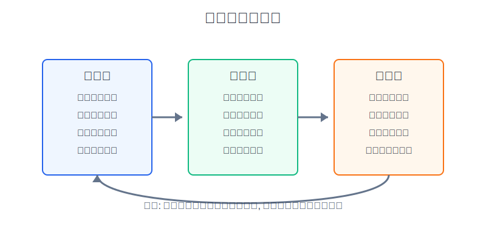
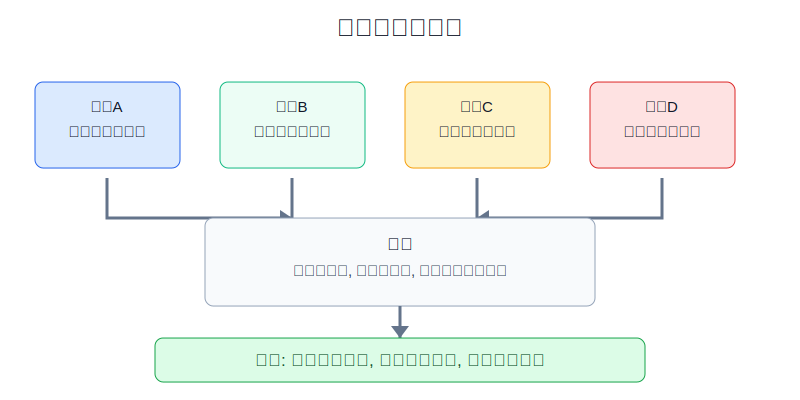
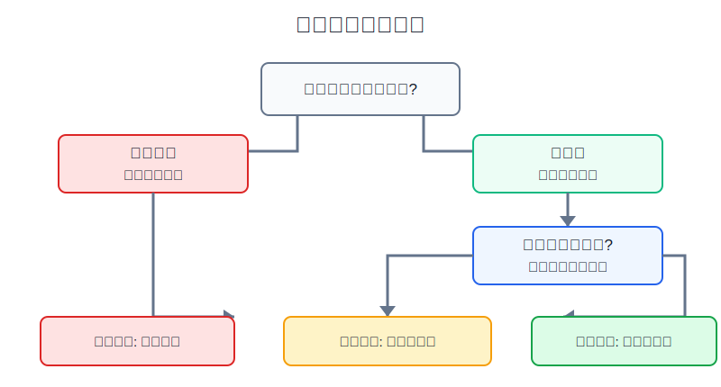

## 散户投资小白金融全品种操盘手册 - 16.8 复盘方法 - 日复盘、周复盘、月复盘
  
### 作者  
digoal  
  
### 日期  
2026-06-08   
  
### 标签  
金融产品 , 金融工具 , 散户 , 投资小白 , 全品操盘手册  
  
----  
  
## 背景 
  

> 适用读者: 已经能写买入计划和卖出计划，但交易结束后只会说“这次赚了”或“这次亏了”的小白投资者。  
> 本文定位: 投资教育框架，不构成个性化投资建议。

## 先问一个反直觉的问题

复盘最容易写错的不是数据，而是结论。很多人赚钱后写“判断正确”，亏钱后写“市场太差”。这不是复盘，这是给情绪补理由。**真正有用的复盘，不是证明你对不对，而是找出下一次该不该重复。**

## 核心概念: 复盘不是日记，而是交易样本管理

日记记录感受，复盘记录证据。日记可以写“今天很烦”，复盘必须写“买入前有没有计划、实际仓位是多少、触发条件有没有出现、执行时哪里变形”。

本节行动结论先放在前面: **日复盘只管单笔动作，周复盘只管重复模式，月复盘只管组合系统。每天不要写长文，只填事实；每周只找1个最该修的错误；每月只决定策略保留、降级、暂停或删除。复盘若不能改变下一次动作，就只是情绪记录。**

## 逻辑推导链

【论证链标题】: 因为单笔盈亏会误导判断，而重复记录能暴露模式，所以散户要用日、周、月三层复盘把交易从情绪反应变成可纠偏系统。

── 第一步: 前提陈述

前提A: 人的记忆会美化交易，这是行为常量。赚钱时容易记住“我看对了”，忘记“仓位过大”；亏钱时容易记住“消息突然变坏”，忘记“我本来就没有止损线”。

前提B: 单笔盈亏不等于交易质量，这是常量。一笔没计划的追涨也能赚钱，一笔按规则的小额止损也可能亏钱。结果像考试分数，过程才是答题步骤；只看分数，下一次仍不知道哪里该改。

前提C: 错误会重复出现，这是变量，但在小白身上很常见。常见模式包括开盘冲动下单、亏损后补仓、盈利后加大仓位、听消息买入、没有卖出条件。

前提D: 组合会逐月漂移，这是变量。某个行业涨多了，会从卫星仓变成主仓；现金被慢慢用光，防守层会消失；这些变化靠单日感觉很难发现。

── 第二步: 逻辑推导

由A+B可得: 因为记忆会改写细节，而盈亏会污染判断，所以复盘第一步不能写观点，必须先写事实: 计划、价格、仓位、理由、触发条件、实际动作。

由B+C可得: 因为一笔交易的盈亏不足以证明方法有效，所以周复盘不能问“哪笔赚最多”，而要问“哪类错误出现最多，哪类计划执行最好”。

再由C+D可得: 因为重复错误会累积成账户问题，组合漂移会改变风险预算，所以月复盘必须升级到系统层: 策略是否保留，仓位是否回到目标，哪些品种需要暂停。

最后由A+B+C+D可得: **复盘必须分层。日复盘纠动作，周复盘纠模式，月复盘纠系统。三层混在一起，小白就会把复盘写成流水账。**

── 第三步: 正常情景下的操作结论

✅ 正常情景: 你有交易计划；每周交易数量不超过自己能记录的范围；持仓以ETF、基金、个股、转债、黄金、REITs或海外资产为主；你想减少冲动交易和重复亏损。

对应操作: 当天收盘后用5到10分钟做日复盘，只记录事实和单笔错因；周末用30分钟做周复盘，只统计重复错误和有效动作；每月最后一个交易日做月复盘，只处理组合比例、策略库和暂停名单。

── 第四步: 数据和案例证实

证据1: Barber 和 Odean 的《Trading is Hazardous to Your Wealth》研究了1991到1996年美国一家折扣券商的66,465个家庭账户。最活跃交易者年化收益为11.4%，同期市场为17.9%，平均家庭账户为16.4%，且平均年换手率达到75%。这个证据对应前提B和C: 频繁交易本身不是能力，若没有复盘识别错误模式，交易越多越容易把成本和冲动放大。

证据2: Barber、Lee、Liu 和 Odean 对台湾1992到2006年日内交易者的研究显示，少数顶尖日内交易者能延续盈利，但能稳定、可预测地扣费后获得正异常收益的人不到全部日内交易者的1%。这个证据对应前提C: 真正可复制的交易能力必须靠长期样本验证，不能靠一两次赚钱自封“策略有效”。

证据3: Investor.gov 的资产配置教育材料说明，随着时间推移，某些投资会比其他投资增长更快，可能让持仓偏离投资目标并改变组合风险；例如股票比例可能从60%升到80%，因此需要再平衡。这个证据对应前提D: 月复盘不是形式，它负责检查组合是否已经被市场涨跌改写。

证据4: FINRA 关于波动率的投资者教育材料提醒，市场大跌时投资者容易冲动卖出或大幅改变组合配置，并建议设置清晰目标、保持分散、跟随财务计划。这个证据对应前提A: 情绪会在波动中放大，复盘表的价值是让你回到计划，而不是跟着盘面临时变脸。

失败案例: 小周有10万元账户，连续三周追涨同一类热门行业ETF。第一周赚800元，他写“方向对”；第二周亏1200元，他写“市场洗盘”；第三周继续加仓，行业回撤后账户亏到5%。如果他只看单笔盈亏，第一周会鼓励他继续追；如果他做周复盘，就会发现三笔交易的共同问题是“没有买入计划、没有仓位上限、都发生在上涨后”。失败不是因为他没猜到顶部，而是前提A和C失效: 记忆美化了赚钱样本，重复错误没有被拦下来。

历史不代表未来。上面数据仍有参考价值，是因为它们验证的是结构规律: 频繁交易会放大成本和错误，少数稳定盈利者依赖长期样本，组合会随市场变化漂移，波动会诱发冲动。复盘不能保证盈利，但能降低“同一种错反复犯”的概率。

── 第五步: 前提变化时的替代结论

若前提C改变，也就是你一周只有一次定投、几乎不做主动交易，推导路径变为: 因为单笔错误少，所以日复盘可以简化。新结论: 每次定投后只记录金额、资产、是否按计划执行；重点放在月复盘的仓位和现金检查。

若前提B改变，也就是你做的是短线、期权、期货或高波动个股，推导路径变为: 因为单笔盈亏更容易误导，且错误成本更高，所以复盘频率必须提高。新结论: 每笔交易当天必须复盘，连续3笔无计划交易，暂停实盘。

若前提D改变，也就是组合已经严重偏离目标，比如单一行业从10%涨到30%，推导路径变为: 因为风险预算已经被改写，所以月复盘不能只写观察。新结论: 进入再平衡或减仓流程，把超出上限的部分处理掉。

## 实操例子: 10万元账户如何做三层复盘

这个例子对应论证链的正常结论: **日复盘纠动作，周复盘纠模式，月复盘纠系统。**

假设小林有10万元投资账户，目标比例是宽基ETF 50%、行业ETF 15%、债券和现金25%、黄金10%。本周他做了三笔交易: 周一买入新能源行业ETF 6000元，周三卖出一部分黄金ETF，周五给宽基ETF定投3000元。

第一步，做日复盘，只写事实。周一这笔交易要填: 买入前计划是否存在，触发条件是什么，实际仓位从多少变到多少，是否超过行业ETF上限。如果答案是“看到上涨临时买入”，它就归入冲动样本，不因为当天上涨2%就进入策略库。

第二步，做周复盘，只找重复模式。小林把三笔交易放在一起看，发现周一新能源是追涨，周三黄金卖出是因为短线下跌害怕，周五宽基定投按计划执行。周复盘结论不是“本周亏了300元”，而是“非计划交易2笔，计划交易1笔；下周只允许执行写过买入理由和卖出条件的交易”。

第三步，做月复盘，只处理系统问题。月底账户变成: 宽基ETF 46%、行业ETF 23%、债券和现金17%、黄金14%。行业ETF超过15%目标，债券和现金低于25%，说明组合已经从稳健变成进攻。月复盘动作是: 停止给行业ETF加钱，新增资金优先补债券和现金；若行业ETF仍超过20%，卖出超限部分。

第四步，写纠偏规则。小林给下个月定三条红线: 没有买入计划不下单；单一行业超过20%必须降回目标区间；连续两笔冲动交易后暂停主动买入一周。每条规则都来自复盘发现的问题，而不是凭空增加约束。

如果前提不成立，操作要切换。若小林只是每月定投宽基ETF，没必要每天写长表，月度检查更重要。若小林开始做短线个股或期权，日复盘就不能省，因为高波动工具的错因必须当天归位。若他连续三个月都无法执行复盘，说明交易数量超过了管理能力，正确动作不是买更复杂的工具，而是减少交易。

## 可复用框架

【三问复盘】

适用前提: 任何一笔交易已经发生，或当天收盘后准备记录。

核心逻辑: 因为盈亏会误导判断，所以先问计划、执行、结果三件事。

操作步骤:

1. 计划: 买入或卖出前有没有写清理由、仓位、失效条件。
2. 执行: 实际价格、仓位和动作是否符合计划。
3. 结果: 盈亏来自计划有效、执行变形、市场随机波动，还是运气。

前提失效时: 如果没有计划，直接归入冲动样本；即使赚钱，也不能复制。

举一反三: ETF、个股、可转债、黄金、期权和期货都可以用这三问先过滤。

【三层复盘】

适用前提: 你每月至少有一次主动买卖，或者组合里有多个资产类别。

核心逻辑: 因为单笔动作、重复模式和组合系统不是同一层问题，所以复盘要分频率。

操作步骤:

1. 日复盘: 每笔交易当天填事实，不写长篇观点。
2. 周复盘: 统计错误类型，只改下周最重要的一条规则。
3. 月复盘: 检查目标仓位、策略库、暂停名单和再平衡动作。

前提失效时: 交易很少，日复盘可简化；交易很频繁，先减少交易，再谈复盘。

举一反三: 这个框架也适用于学习计划、健身计划和副业项目，日记录动作，周看模式，月调系统。

## 本节行动清单

| 动作 | 合格标准 |
|---|---|
| 建日复盘表 | 每笔交易记录计划、价格、仓位、理由、触发条件、实际动作 |
| 当天归因 | 错因只选1到2个，不写“市场不好”这种空话 |
| 周末统计 | 统计计划交易、冲动交易、盈利交易、亏损交易和重复错误 |
| 每周只改一条 | 下周只新增或修改一条最关键规则，避免规则太多执行不了 |
| 月底看组合 | 检查目标仓位、实际仓位、超限资产、现金比例和策略库 |
| 暂停失控交易 | 连续3笔无计划交易，暂停主动买入一周 |

## 一句话总结

复盘不是为了证明你聪明，而是为了让下一次少犯同一种错；日复盘管动作，周复盘管模式，月复盘管系统。

## 参考资料

- Brad M. Barber, Terrance Odean: Trading is Hazardous to Your Wealth: The Common Stock Investment Performance of Individual Investors, Journal of Finance, 2000，https://ssrn.com/abstract=219228
- Brad M. Barber, Yi-Tsung Lee, Yu-Jane Liu, Terrance Odean: The Cross-Section of Speculator Skill: Evidence from Day Trading, 2012，https://ssrn.com/abstract=529063
- Investor.gov: Asset Allocation and Diversification，https://www.investor.gov/introduction-investing/getting-started/asset-allocation
- Investor.gov: Don’t Panic, Plan It!，https://www.investor.gov/additional-resources/spotlight/formerdirectorlorischock-directors-take/dont-panic-plan-it
- FINRA: Volatility，https://www.finra.org/investors/investing/investing-basics/volatility

> ⚠️ **声明**：本文内容为投资教育目的，所有历史数据、策略框架均为辅助学习工具，不构成证券投资建议。市场有风险，投资需谨慎。实际操作请结合自身风险承受能力，必要时咨询专业投顾。
  
#### [PostgreSQL 解决方案集合](../201706/20170601_02.md "40cff096e9ed7122c512b35d8561d9c8")
  
  
#### [德哥 / digoal's Github - 公益是一辈子的事.](https://github.com/digoal/blog/blob/master/README.md "22709685feb7cab07d30f30387f0a9ae")
  
  
#### [About 德哥](https://github.com/digoal/blog/blob/master/me/readme.md "a37735981e7704886ffd590565582dd0")
  
  

  
