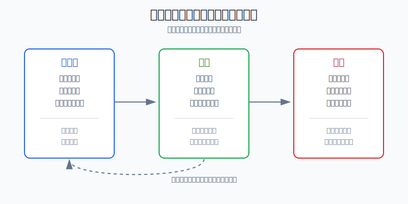
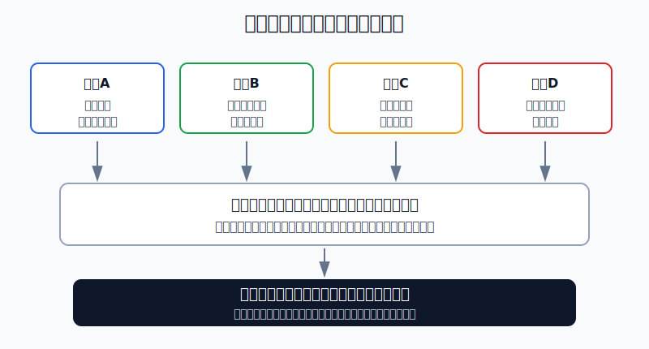
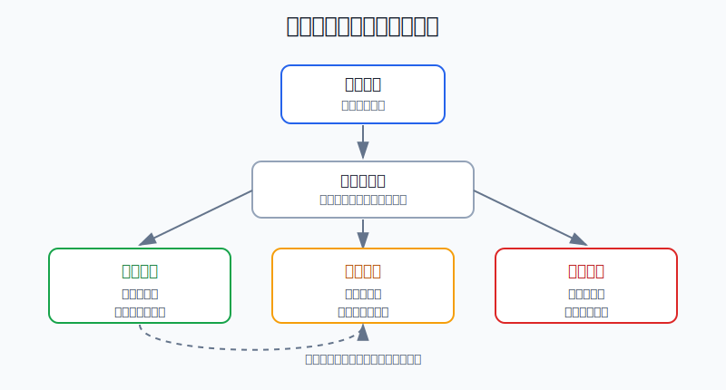

## 散户投资小白金融全品种操盘手册 - 16.9 建立自己的策略库 - 有效、失效、待验证
  
### 作者  
digoal  
  
### 日期  
2026-06-08   
  
### 标签  
金融产品 , 金融工具 , 散户 , 投资小白 , 全品操盘手册  
  
----  
  
## 背景 
  

> 适用读者: 已经写过买入计划、卖出计划和复盘记录，但一到实盘仍然靠感觉换策略的小白投资者。  
> 本文定位: 投资教育框架，不构成个性化投资建议。数据口径按 2026-06-06 可核查公开资料整理。

## 先问一个反直觉的问题

最危险的策略，不一定是亏过钱的策略，而是只赢过一次、却被你当成“长期有效”的策略。一次盈利可能是能力，也可能只是行情、运气和仓位凑巧站在你这边。**策略库的作用，就是不让一次胜利变成永久迷信。**

## 核心概念: 策略库不是收藏夹，而是交易规则的病历本

很多小白所谓“策略库”，其实只是把听来的方法存起来: 网格、定投、突破、双低转债、高股息、行业轮动、财报后买入。这样做没有错，但它还不是策略库。真正的策略库，像病历本，也像版本管理: 每个策略都要写清楚适用前提、买入条件、卖出条件、仓位上限、失效条件、执行记录和复盘结论。

本节只分三类:

| 分类 | 含义 | 允许动作 |
|---|---|---|
| 有效 | 前提清楚，执行过，扣除费用后结果合格，回撤在预算内 | 可以纳入常规流程，但保留仓位上限 |
| 待验证 | 逻辑看得懂，但样本不够、环境没走完、或还没实盘检验 | 只能小仓位试跑，不允许加成核心仓 |
| 失效 | 前提被破坏、结果连续偏离、成本吃掉收益，或自己无法执行 | 停止复制，放进红线样本库 |

本节行动结论先放在前面: **任何新方法先默认“待验证”；只有在前提、样本、成本、回撤和执行纪律都过关后，才能升级为“有效”；一旦前提变化或执行失控，必须降级。**

## 逻辑推导链

【论证链标题】: 因为一次盈亏不能证明策略有效，而散户又容易被最近结果影响，所以策略必须用记录分级，而不是用感觉决定是否继续用。

### 第一步: 前提陈述

前提A: 一次赚钱不能证明策略有效。这是常量。就像抛硬币连续两次正面，不代表你掌握了抛硬币技术。交易里的单次盈利，可能来自策略，也可能来自行情顺风、仓位太大、运气偏好或没有扣成本。

前提B: 每个策略都依赖特定前提。这是常量加变量。网格策略依赖震荡和流动性，趋势策略依赖方向延续，红利策略依赖现金流和估值不过热。前提一变，原策略就可能从武器变成包袱。

前提C: 成本、滑点和执行偏差会吃掉纸面优势。这是常量。滑点，就是计划成交价和实际成交价之间的差；买卖价差，就是买一价和卖一价之间的差；冲击成本，就是仓位太大导致自己一买就把价格推高、一卖就把价格打低。回测，就是把策略套到过去行情里看结果。回测里好看的策略，放到实盘里要扣交易费、买卖价差、冲击成本，还要承受自己手抖、追单、提前止盈和不敢止损。

前提D: 人会选择性记忆成功，淡化失败。这是常量。赚钱时会说“我的策略有效”，亏钱时会说“这次情况特殊”。如果没有策略卡，复盘很容易变成替自己辩护。

### 第二步: 逻辑推导

由A可得: 因为一次盈亏不能说明策略质量，所以策略不能靠“这次赚了”升级，也不能靠“这次亏了”立刻删除。它必须先进入记录。

由A+B可得: 因为策略依赖前提，所以策略卡第一行不是收益率，而是适用环境。一个在牛市有效的追涨方法，不能直接搬到震荡市；一个在利率下行有效的债券策略，不能默认适合利率快速上行。

再由B+C可得: 因为前提和成本会改变真实结果，所以策略验证不能只看理论收益。必须同时看最大回撤、交易次数、费用、滑点、错过信号次数和是否能按规则执行。

最后由C+D可得: 因为人的记忆会美化策略，所以必须把每次使用结果写进同一张策略卡。**没有记录的策略，只能叫灵感；没有失效条件的策略，只能叫愿望。**

### 第三步: 正常情景下的操作结论

✅ 正常情景: 你发现一个新方法，能说清它赚什么钱，也愿意用小仓位验证。

对应操作: 先把它放入“待验证”。写清五件事: 适用前提、买入条件、卖出条件、仓位上限、失效条件。验证期间只用试错仓，不加杠杆，不把一次盈利升级成核心方法。验证结束后按表分级:

| 判断项 | 升级为有效 | 继续待验证 | 降级为失效 |
|---|---|---|---|
| 前提 | 前提出现且未被破坏 | 前提还没充分出现 | 前提已经变了 |
| 结果 | 扣成本后仍优于备选方案 | 盈亏不明显，样本不足 | 连续偏离预期 |
| 回撤 | 在预算内 | 接近预算 | 突破预算 |
| 执行 | 能按规则做完 | 偶尔犹豫但可纠正 | 总是临时改口 |
| 复用 | 下一次仍能照做 | 还要补记录 | 不能复制 |

### 第四步: 数据和案例证实

证据1: Barber 和 Odean 在《Trading Is Hazardous to Your Wealth》中研究了 1991-1996 年美国一家大型折扣券商超过 6 万个家庭账户。论文摘要显示，平均家庭股票组合年化几何净收益约 15.3%，而交易最频繁的 20% 家庭约 10.0%。年化几何净收益，可以理解为扣除交易成本后、按复利口径折算的一年收益。这个证据对应前提C和D: 频繁更换策略、频繁交易，未必增加能力，反而容易被成本和过度自信拖累。

证据2: Barber、Lee、Liu 和 Odean 2014 年发表于《Journal of Financial Markets》的日内交易研究显示，在台湾市场样本中，少于 1% 的日内交易者能在扣除费用后稳定、可预测地取得正的异常收益。异常收益，就是超过普通市场波动和基准表现之外的收益。这个证据对应前提A: 交易赚钱不等于拥有可复制能力，稳定有效策略非常稀缺。

证据3: S&P Dow Jones Indices 的 SPIVA U.S. Year-End 2025 报告显示，2025 年 79% 的美国主动大盘股票基金跑输 S&P 500；报告还指出，过去 15 年多数主动基金类别跑输各自基准。SPIVA 是 S&P 用来比较主动基金和指数基准的长期统计报告。这个证据对应前提A和B: 连专业基金经理长期跑赢基准都不容易，小白更不能把短期跑赢当作策略已经有效。

证据4: SEC 投资者教育办公室在 2022 年《Investor Bulletin: Performance Claims》中提醒，回测是把策略套到过去市场条件上，展示如果当时存在可能怎样表现；回测表现是假设性的，不等于真实业绩。这个证据对应前提C: 回测好看只能进入“待验证”，不能直接进入“有效”。

失败案例: SEC 2014 年指控 F-Squared 和前 CEO 做出虚假业绩宣传，称其把通过回测得出的历史表现包装成真实投资业绩。这个案例说明，如果把“假设结果”当成“实盘有效”，策略库就会失去最基本的过滤功能。

历史数据不代表未来。上面证据仍有参考价值，是因为它们验证的是稳定机制: 交易成本真实存在，过度自信会提高交易频率，回测和实盘之间有差距，短期成功不能自动证明长期可复制。

### 第五步: 前提变化时的替代结论

若前提B改变，也就是策略适用环境消失，推导路径变为: 因为策略赚的钱来自特定环境，所以环境消失后不能继续按原规则放大仓位。新结论: 从“有效”降回“待验证”，重新小仓位观察。

若前提C恶化，也就是交易成本、溢价、滑点或买卖价差变大，推导路径变为: 因为纸面优势被成本吃掉，所以策略不再合格。新结论: 降低频率或直接归入“失效”。

若前提D恶化，也就是你开始只记录赚钱交易、不记录亏损交易，推导路径变为: 因为数据被自己筛选过，所以策略库已经失真。新结论: 暂停使用该策略，把缺失记录补齐后再判断。

反例: 一个小白用行业ETF追涨策略在牛市赚了12%，就把它列为“有效”。后面震荡市仍按同样方法追高，结果连续三次买在短期高点，每次亏5%-8%。失败点不是行业ETF不能买，而是他把“牛市趋势策略”误当成“所有环境都有效的策略”。

## 实操例子: 10万元账户如何建立第一版策略库

这个例子对应论证链的正常结论: **新方法先待验证，证据过关再升级，前提失效就降级。**

假设小林有10万元长期投资资金，已经按前面章节分出6万元核心宽基ETF、2万元防守资产、2万元主动仓。他现在想测试“行业ETF突破后买入”的策略。

第一步，写策略卡。策略名称: 行业ETF右侧突破。适用前提: 市场风险偏好回升，目标行业指数站上120日均线，成交额放大。买入条件: 突破后回踩不跌破关键位置。卖出条件: 跌回突破位并连续3个交易日不能收复。仓位上限: 单一行业ETF不超过账户8%。失效条件: 突破失败两次，或行业基本面没有同步改善。

第二步，先归类为“待验证”。小林不能因为看了三张成功案例图，就直接买满8%。他先用3000元试跑，记录买入日期、价格、理由、卖出条件、计划亏损和实际执行偏差。

第三步，验证结果。三个月后共执行4次，2次盈利、2次亏损，扣除费用后合计只赚120元，但有一次没有按规则卖出，导致亏损扩大。结论不是“有效”，而是“继续待验证”。原因是样本少，执行偏差还没解决。

第四步，前提切换。若后面市场进入震荡，突破后经常假突破，小林要把这张策略卡标黄: “震荡市暂停使用”。如果仍连续使用，策略从待验证降为失效。

第五步，错误纠偏。若小林因为第一次赚了600元就把仓位加到1.5万元，后面一次亏损就可能吃掉前面收益。纠偏方法是把仓位降回3000元试跑，把“第一次盈利后加仓”写进错误样本，而不是继续找理由。

## 可复用框架

【三层策略库】

适用前提: 你已经有买入计划和复盘习惯，想把常用方法沉淀下来。

核心逻辑: 因为策略有效性需要证据，所以所有策略先入库、再验证、再分级。

操作步骤:

1. 待验证: 新策略、新环境、新品种，全部先放这里，只能小仓位。
2. 有效: 前提清楚，结果可复用，扣成本后合格，执行能完成。
3. 失效: 前提破坏、成本过高、回撤超预算、自己无法遵守。

前提失效时: 有效策略不能永久有效。只要环境换了，就降回待验证。

举一反三: 这个框架可以用于ETF定投、行业轮动、可转债双低、黄金防守仓、期权保险策略和个股财报策略。

【策略卡】

适用前提: 你准备测试任何一个新方法。

核心逻辑: 因为人的记忆不可靠，所以用固定字段把策略锁住。

操作步骤:

1. 写前提: 什么市场、什么品种、什么资金期限适用。
2. 写动作: 何时买、何时卖、最大仓位多少。
3. 写失效: 哪些事实出现后必须暂停。
4. 写记录: 每次执行后的收益、回撤、成本和偏差。
5. 写分级: 有效、待验证、失效，只能三选一。

前提失效时: 如果你写不出失效条件，这个策略不能入库；如果你不愿记录亏损，这个策略不能升级。

举一反三: 这个框架也能用于检查别人推荐的“稳赚模型”。只要对方说不清前提、成本和失效条件，就不要把它当策略。

## 本节行动清单

| 动作 | 合格标准 |
|---|---|
| 建一个策略库表 | 至少包含名称、前提、买入、卖出、仓位、失效、记录、分级 |
| 新策略先待验证 | 第一次听到或第一次使用的方法，不直接列为有效 |
| 扣除真实成本 | 交易费、价差、溢价、滑点都要写入结果 |
| 记录执行偏差 | 追单、提前卖、不止损、不按仓位，都要写 |
| 每月复查分级 | 有效可降级，待验证可升级，失效不得偷用 |

## 一句话总结

策略库的本质不是收集更多方法，而是用证据决定哪些方法可以复用、哪些方法还要验证、哪些方法必须停止。

## 参考资料

- Barber and Odean: Trading Is Hazardous to Your Wealth, https://faculty.haas.berkeley.edu/odean/papers/returns/returns.html
- Barber, Lee, Liu and Odean: The Cross-Section of Speculator Skill, https://faculty.haas.berkeley.edu/odean/papers/day%20traders/The%20Cross-Section%20of%20Speculator%20Skill.pdf
- S&P Dow Jones Indices: SPIVA U.S. Year-End 2025, https://www.spglobal.com/spdji/en/spiva/article/spiva-us/
- SEC Investor Bulletin: Performance Claims, https://www.investor.gov/introduction-investing/general-resources/news-alerts/alerts-bulletins/investor-bulletins-47
- SEC Press Release 2014-289: F-Squared Performance Claims, https://www.sec.gov/newsroom/press-releases/2014-289

> ⚠️ **声明**：本文内容为投资教育目的，所有历史数据、策略框架均为辅助学习工具，不构成证券投资建议。市场有风险，投资需谨慎。实际操作请结合自身风险承受能力，必要时咨询专业投顾。
  
#### [PostgreSQL 解决方案集合](../201706/20170601_02.md "40cff096e9ed7122c512b35d8561d9c8")
  
  
#### [德哥 / digoal's Github - 公益是一辈子的事.](https://github.com/digoal/blog/blob/master/README.md "22709685feb7cab07d30f30387f0a9ae")
  
  
#### [About 德哥](https://github.com/digoal/blog/blob/master/me/readme.md "a37735981e7704886ffd590565582dd0")
  
  

  
