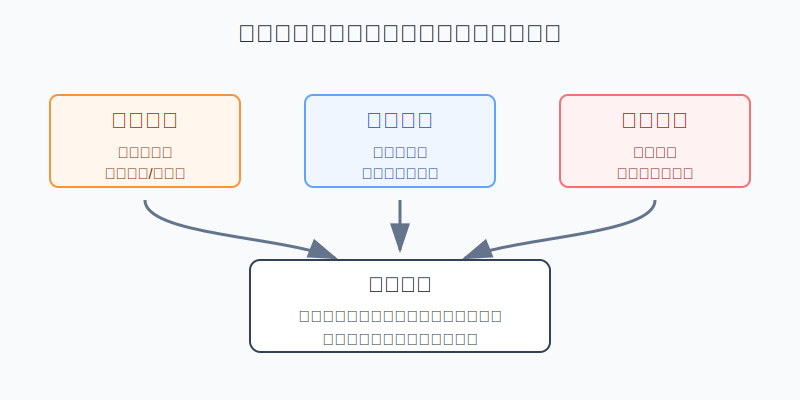
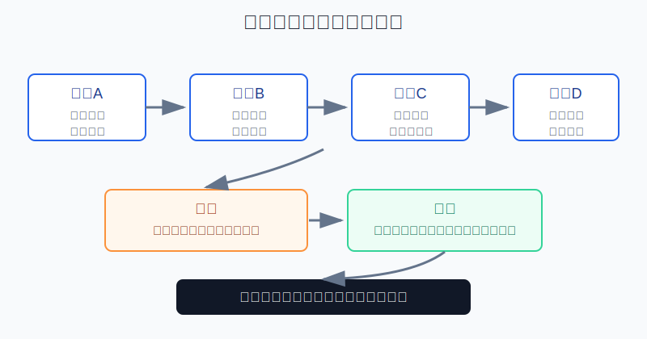
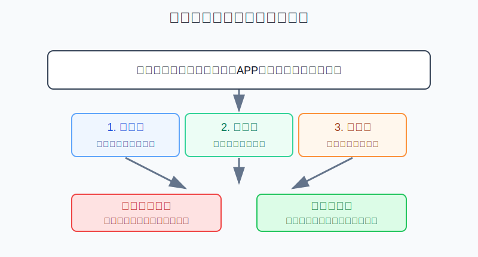

## 散户投资小白金融全品种操盘手册 - 16.10 远离“老师带单”“内幕消息”“稳赚模型”
  
### 作者  
digoal  
  
### 日期  
2026-06-08   
  
### 标签  
金融产品 , 金融工具 , 散户 , 投资小白 , 全品操盘手册  
  
----  
  
## 背景 
  

> 适用读者: 在短视频、微信群、直播间、私信里见过“老师带你回本”“内部票”“稳赚策略”的小白投资者。  
> 本文定位: 投资教育框架，不构成个性化投资建议。

## 先问一个反直觉的问题

真正危险的“投资老师”，往往不是一上来就骗你转钱。他会先免费讲课、免费诊股、展示盈利截图，让你觉得自己遇到了贵人。**但只要他让你进私域群、下载陌生APP、向个人账户转钱、相信稳赚不赔，这就不是帮你投资，而是在把你从正规金融系统里搬走。**

## 核心概念: 骗局卖的不是收益，是“确定性幻觉”

“老师带单”，就是有人以专家、讲师、投顾、操盘手身份，直接告诉你买什么、什么时候买、什么时候卖。“内幕消息”，就是声称自己有公开市场之外的特殊渠道。“稳赚模型”，就是把一套公式、软件、量化策略包装成几乎不会亏的赚钱机器。

这三句话听起来不同，底层动作一样: 让你把判断权交出去。小白本来应该问“这个产品是什么风险、我最多亏多少、这笔钱适合不适合我”，骗局会把问题换成“老师准不准、消息真不真、模型神不神”。一旦问题被换掉，你就开始用崇拜代替核验，用焦虑代替计划，用转账代替投资。

本节行动结论先放在前面: **遇到任何带单、内幕、稳赚承诺，先执行三不原则: 不进收费群，不向个人或陌生账户转账，不下载非官方APP。然后做三步核验: 查机构资质、查人员身份、查收款和交易路径。任一项查不到，直接停止。真正的投资机会，不会要求你绕开正规渠道。**

## 逻辑推导链

【论证链标题】: 因为合法投资服务有资质边界，而“带单、内幕、稳赚”会诱导小白离开可核验渠道，所以最优动作不是判断老师准不准，而是先验资质、再验账户、最后才看观点。

── 第一步: 前提陈述

前提A: 证券投资咨询不是谁都能做。这是常量。《证券法》第一百六十条规定，从事证券投资咨询服务业务，应当经国务院证券监督管理机构核准；未经核准，不得为证券交易相关活动提供服务。用小白能懂的话说，给别人收费荐股不是“朋友圈聊天”，而是有牌照边界的业务。

前提B: 公开市场没有稳定的“稳赚不赔”。这是常量。股票、基金、期货、期权、黄金、REITs 都有价格波动和前提失效。真正专业的人会讲风险、仓位和失效条件；骗子才会把收益说得像存款利息一样确定。

前提C: 骗局最常用的手法，是制造紧迫感和稀缺感。这是变量，但高发。它会说“今晚就建仓”“只带最后20个人”“内部票不能外传”“不跟就踏空”。目的不是提高你的收益率，而是压缩你的核验时间。

前提D: 钱一旦离开正规账户和正规交易软件，追偿难度会显著上升。这是常量。你以为自己在买股票，实际可能只是给对方控制的钱包、个人账户、假平台充值。

── 第二步: 逻辑推导

由A可得: 因为投资咨询有资质要求，所以任何收费荐股、带单、直播一对一指导，都必须先查机构和人员是否合规。查不到，后面的观点再动听也不进入判断。

由A+B可得: 因为合法机构也不能保证市场稳赚，所以越是承诺“包赚、保本、内部确定性”，越不是投资能力强，而是更接近违规营销或诈骗筛选。

再由B+C可得: 因为市场本身不确定，而骗局要把你推向快速决策，所以“限时、保密、错过不再有”不是机会信号，而是风险信号。

最后由C+D可得: 因为骗子最终需要控制你的钱，所以他一定会把你带离正规券商、基金公司、期货公司、银行三方存管或官方APP。**只要交易路径不可核验，先停手。**

── 第三步: 正常情景下的操作结论

✅ 正常情景: 有人在线上向你推荐股票、基金、期货、期权、外盘、量化模型或“高收益策略”；你无法在监管或协会网站查清机构和人员；对方要求进群、付费、下载陌生APP、向个人账户转账，或承诺收益。

对应操作: 不讨论行情，不验证截图，不跟着试一单。先截图保存证据，退出群聊，停止转账。若已经付款或入金，第一时间联系银行、券商或支付平台冻结风险，并向公安机关、反诈平台或监管部门反映。

── 第四步: 数据和案例证实

证据1: 公安部2024年6月公布的十大高发电信网络诈骗类型显示，2023年刷单返利、虚假网络投资理财等10种常见类型发案占比近88.4%；虚假网络投资理财类诈骗的个案损失金额最大；受害者平均年龄37岁，18岁至40岁占62.1%，41岁至65岁占33.1%。这说明投资理财诈骗不是只骗老人，也正好瞄准有收入、有焦虑、有投资需求的人。

证据2: 深圳市地方金融管理局、深圳证监局在2025年9月风险提示中指出，部分无资质机构或个人以“内幕消息”“稳赚不赔”“配资十倍杠杆”“高收益港股期权策略”等为噱头，通过微信群、短视频、直播带货、假冒APP及境外网站诱导投资者参与非法证券期货活动，或以证券期货投资为名行诈骗之实。这个证据对应前提C和D: 入口在内容平台，收口在假平台和转账路径。

证据3: 证监会系统公开的非法证券期货活动案例中，曾有“牛股师”通过QQ群、短信、股票软件等方式指导买卖股票，以指导费、咨询费、服务费、会费名义收取投资者800余万元；也有团伙注册多家公司、招聘员工超过200人，以“内幕信息”“翻倍牛股”为诱饵非法荐股。这个证据对应前提A: 免费诊股和老师人设，常常只是收费和诱导交易的前置环节。

失败案例: 投资者加入微信群后，看到老师每天晒盈利截图，先交3980元入门费，又被要求下载“专用交易APP”。前几天账户显示盈利，随后客服以“账户异常”“补保证金”“缴税解冻”为由继续索要资金。最后APP无法登录，群聊解散。这个失败不是因为他看错了某只股票，而是前提D早就失效: 钱没有进入正规证券账户，所谓盈利只是屏幕里的数字。

历史不代表未来。上面数据仍有参考价值，是因为它们验证的是行为结构: 骗局利用投资者想回本、怕踏空、想省学习成本的心理，把人从可核验路径推向不可核验路径。只要这个结构没变，防范规则就有效。

── 第五步: 前提变化时的替代结论

若前提A通过，也就是机构和人员确实能在官方渠道查到，推导路径变为: 合规资质只是入场券，不等于观点必然正确。新结论: 继续检查服务合同、收费方式、风险揭示和是否承诺收益；仍然不能把带单当成买卖指令。

若前提B被对方否认，也就是对方坚持说“我们模型回撤极低、稳赚不赔、亏了包赔”，推导路径变为: 因为公开市场不存在无风险高收益，所以承诺越满，风险越高。新结论: 不购买、不试单、不付款。

若前提C变强，也就是你已经亏损、急于翻本、特别想相信一个老师，推导路径变为: 因为情绪会降低核验能力，所以当天不做任何转账和下单。新结论: 冷静24小时，只做截图、查询和向可信的人复述。

若前提D已经触发，也就是你已经转账或在陌生APP入金，推导路径变为: 因为资金路径可能已经脱离监管，所以不要继续补钱解冻。新结论: 停止追加，保存聊天记录、转账凭证、APP截图、对方账号，尽快报警并联系支付通道。

## 实操例子: 看到“老师带你三个月翻倍”怎么办

这个例子对应论证链的正常结论: **先验资质、再验账户、最后才看观点；任何一项不通过，直接停止。**

假设小陈有8万元投资资金，去年亏了1.5万元。某短视频账号每天讲市场，评论区有人引导他加微信。加上后，对方说老师正在带一波“政策内幕票”，入群费6800元，三个月目标翻倍，先付款再进VIP群。

第一步，不问股票代码，先验资质。小陈让对方提供公司全称、证券投资咨询业务资质、老师姓名和执业编号。对方只发营业执照截图，说“我们是内部私募团队，不方便公开”。这一步已经不合格。营业执照不等于证券投资咨询资质，个人自称老师也不等于从业资格。

第二步，验账户和交易路径。对方要求向个人支付宝转6800元，再下载群里链接里的APP。小陈检查发现，这不是券商官网，也不是手机应用商店里的官方软件，更没有银行三方存管。对应前提D: 钱一旦进去，可能只是给假平台充值。

第三步，验承诺。对方说“亏了老师补，保守翻倍，不赚钱退费”。这正好触发前提B的反向信号。正规投资服务会解释风险，不会把市场收益包装成确定承诺。

第四步，执行停止动作。小陈不再争辩，也不试一单。他把聊天记录、付款要求、APP链接截图保存，退出群聊，把该账号拉黑，并在自己的交易计划里写一句话: “任何收费带单、个人收款、陌生APP，全部按高危处理。”

如果前提切换，比如对方真是持牌机构的投顾，也不代表可以跟单满仓。小陈仍要要求书面服务协议、风险揭示、收费标准，并把任何建议转化成自己的买入计划: 买什么、为什么买、仓位多少、错了怎么办。没有这四项，不下单。

如果操作错误，后果很具体。小陈若先付6800元，就会进入沉没成本陷阱: 已经交钱，所以更想相信老师；一旦APP里显示小赚，又会追加资金；等到无法提现时，对方还会用“缴税、解冻、补流水”继续让他转钱。真正的止损点不是亏损后，而是第一次要求你绕开正规渠道时。

## 可复用框架

【三验三不】

适用前提: 任何人向你推荐具体证券、基金、期货、期权、外盘、量化模型，尤其是要求付费、入群、下载软件或跟单。

核心逻辑: 因为合法投资服务可核验，骗局必须制造不可核验路径，所以先查真假，再谈观点。

操作步骤:

1. 验资质: 查机构是否在证监会或相关协会名录中，查人员是否有对应执业信息。
2. 验账户: 只使用正规机构官网、官方APP、官方客服电话和银行三方存管路径。
3. 验承诺: 只要出现保本、包赚、稳赚、内幕、限时翻倍，直接判为高危。

前提失效时: 任一项查不到，不付款、不入群、不下载APP；已经付款的，停止追加并保存证据。

举一反三: 这个框架也适用于私募基金、外盘期货、港股期权、数字货币、黄金T+D和任何“老师带你回本”的产品。

【24小时冷静】

适用前提: 你特别想相信对方，尤其是在刚亏钱、刚踏空、刚看到别人盈利截图的时候。

核心逻辑: 因为骗局靠情绪压缩核验时间，所以先把决策从当下情绪里拿出来。

操作步骤:

1. 当天不转账、不下载、不下单。
2. 把对方的公司名、老师名、收款账户、APP链接逐项记录。
3. 第二天再查资质、问官方客服、向家人或可信朋友复述整件事。

前提失效时: 如果对方说“今天不交就没资格”“消息马上过期”，说明它更需要你冲动，直接停止。

举一反三: 买高溢价跨境ETF、追涨热门主题基金、亏损后想加杠杆翻本，也可以先用24小时冷静法。

## 本节行动清单

| 动作 | 合格标准 |
|---|---|
| 不进收费带单群 | 任何收费荐股、喊单、直播一对一指导，先查资质 |
| 不信内幕消息 | 对方越强调保密、稀缺、翻倍，越要停手 |
| 不碰陌生APP | 只从官网或官方应用商店下载正规机构APP |
| 不向个人账户转钱 | 投资资金只走本人实名账户和正规金融机构路径 |
| 不看盈利截图下单 | 截图、群友晒单、老师战绩都不能替代计划 |
| 保存证据 | 聊天记录、收款账户、APP链接、合同、转账凭证都截图留存 |
| 写入交易纪律 | 交易前检查清单中加入“是否存在带单、内幕、稳赚承诺” |

## 一句话总结

远离“老师带单”“内幕消息”“稳赚模型”的关键，不是练出火眼金睛判断谁是真高手，而是记住一条硬规则: **凡是绕开资质、绕开正规账户、绕开风险揭示的机会，都先当成风险处理。**

## 参考资料

- 《中华人民共和国证券法》第一百六十条，2019年修订，https://www.gov.cn/xinwen/2019-12/29/content_5464866.htm
- 中国证监会: 证券投资咨询机构名录（2026年3月），2026年4月9日，https://www.csrc.gov.cn/csrc/c101900/c1029656/content.shtml
- 深圳市地方金融管理局、深圳证监局: 关于警惕非法证券期货陷阱的风险提示，2025年9月5日，https://www.csrc.gov.cn/shenzhen/c105615/c7581512/content.shtml
- 黑龙江证监局: 非法证券期货活动12大典型案例，2020年5月14日，https://www.csrc.gov.cn/heilongjiang/c105405/c1268955/content.shtml
- 山东证监局: 防范非法证券期货活动系列宣传案例，2026年3月24日，https://www.csrc.gov.cn/shandong/c106399/c7621740/content.shtml
- 中国金融信息网转公安部消息: 公安部曝光十大高发电信网络诈骗类型，2024年6月25日，https://www.cnfin.com/xy-lb/detail/20240625/4066570_1.html

> ⚠️ **声明**：本文内容为投资教育目的，所有历史数据、策略框架均为辅助学习工具，不构成证券投资建议。市场有风险，投资需谨慎。实际操作请结合自身风险承受能力，必要时咨询专业投顾。
  
#### [PostgreSQL 解决方案集合](../201706/20170601_02.md "40cff096e9ed7122c512b35d8561d9c8")
  
  
#### [德哥 / digoal's Github - 公益是一辈子的事.](https://github.com/digoal/blog/blob/master/README.md "22709685feb7cab07d30f30387f0a9ae")
  
  
#### [About 德哥](https://github.com/digoal/blog/blob/master/me/readme.md "a37735981e7704886ffd590565582dd0")
  
  

  
