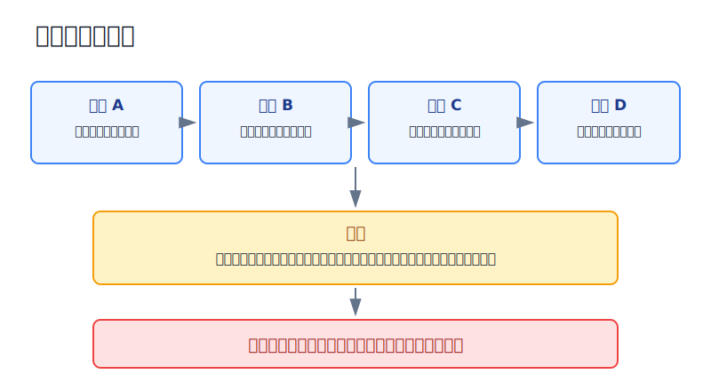
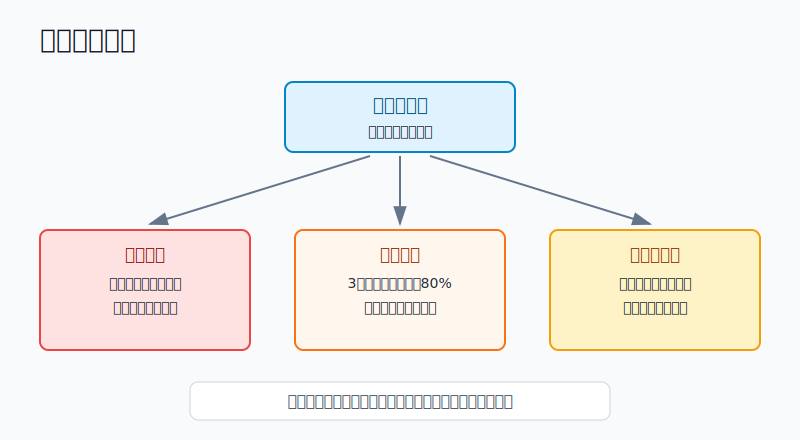
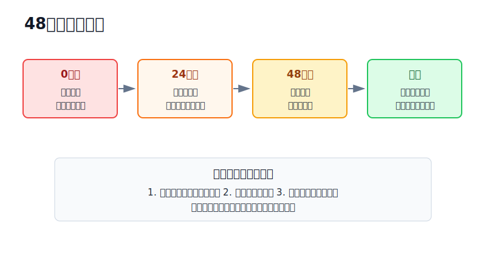

## 散户投资小白金融全品种操盘手册 - 16.11 什么时候应该停止交易 - 情绪失控、连续亏损、看不懂市场
  
### 作者  
digoal  
  
### 日期  
2026-06-07   
  
### 标签  
金融产品 , 金融工具 , 散户 , 投资小白 , 全品操盘手册  
  
----  
  
## 背景 
  

> 适用读者: 已经会写买入计划、卖出计划和复盘表，但仍然会在情绪上头、连续亏损或行情看不懂时继续下单的小白投资者。  
> 本文定位: 投资教育框架，不构成个性化投资建议。规则口径按 2026-06-06 可核查公开资料整理。

## 先问一个反直觉的问题

真正成熟的交易者，不是每天都能找到机会的人，而是知道哪一天不该交易的人。市场每天都开门，但你的判断力不是每天都在线。**停止交易不是认输，而是承认自己此刻不具备承担新风险的资格。**

## 核心概念: 停止交易不是清仓，是暂停新增风险

小白一听“停止交易”，容易理解成“把所有东西卖掉，再也不碰市场”。这不对。

本节讲的停止交易，主要指三件事: 不开新仓，不补风险仓，不为了翻本换更刺激的品种。它不是否定长期配置，也不是让你错过定投计划。它像开车遇到大雾: 不是把车扔了，而是减速、开灯、必要时靠边等能见度恢复。

停止交易有三个典型触发点。

第一，情绪失控。你不是在执行计划，而是在证明自己没错、想马上回本、害怕错过、害怕被别人超过。

第二，连续亏损。亏一次可能是市场波动，连续亏损说明你的策略、环境、仓位或执行至少有一项出了问题。

第三，看不懂市场。你说不清上涨为什么发生，下跌为什么发生，规则有没有变，风险来自哪里，却仍然想用真金白银下注。

本节行动结论先放在前面: **只要触发情绪红灯、亏损红灯、认知红灯三者之一，当天停止新增风险仓；触发两项，至少冷却48小时；触发三项，主动仓减半并暂停一周，直到复盘表写清“错在哪里、下次怎么错小一点”。**

## 逻辑推导链

【论证链标题】: 因为交易优势来自清醒判断和事前规则，而情绪失控、连续亏损、认知模糊会同时破坏判断质量、风险边界和执行纪律，所以散户必须把“停止交易”写成硬规则。

### 第一步: 前提陈述

前提A: 情绪会降低判断质量。这是常量。人在愤怒、焦虑、兴奋、羞耻、急于证明自己时，会更容易把“我想做”误认为“市场给机会”。它像酒后开车，不是你完全不会开，而是事故概率明显上升。

前提B: 连续亏损不是普通噪音，而是系统报警。这是变量。单笔亏损可能只是计划内试错；连续亏损说明市场环境可能变了，策略可能失效，仓位可能过大，或者你已经开始违反规则。

前提C: 看不懂市场时，你无法给风险定价。这是常量。你可以不知道未来怎么走，但必须知道自己正在买什么风险。如果你连上涨靠什么、下跌怕什么、错了怎么办都说不清，继续下单就是把账户交给运气。

前提D: 频繁交易对散户天然有成本劣势。这是常量。佣金可能降低了，但买卖价差、滑点、错误追涨、低位割肉、精力消耗和税费并不会消失。交易越多，越需要证明自己真的有优势。

### 第二步: 逻辑推导

由A可得: 因为情绪会扭曲判断，所以情绪强烈时不能让“想下单”直接变成“已成交”。此时最重要的动作不是找机会，而是切断情绪到订单之间的通道。

由A+B可得: 因为连续亏损会放大情绪，所以亏损越多，越不能用更高频、更大仓位、更高波动的交易来修复账户。亏损后的加速下单，通常不是策略升级，而是情绪接管。

再由B+C可得: 因为连续亏损又看不懂原因，说明你已经失去校准能力。你不知道是市场错、策略错、仓位错，还是执行错。这时继续交易，只会把原因不明的小亏损滚成账户级亏损。

最后由A+B+C+D可得: **停止交易不是主观建议，而是风控开关。只要判断质量下降、亏损连续出现、风险无法解释，就先停手；等情绪、亏损边界和认知框架恢复，再用更小仓位恢复交易。**

### 第三步: 正常情景下的操作结论

✅ 正常情景: 你是普通散户，账户里有ETF、基金、个股、可转债、港美股、黄金、REITs、期权或期货学习仓；你没有长期验证的职业交易系统；短期亏损会影响下一笔判断。

对应操作: 用“三灯停手表”判断。

| 红灯类型 | 触发条件 | 立即动作 | 恢复条件 |
|---|---|---|---|
| 情绪红灯 | 想马上回本、想证明自己、睡不好、反复刷行情、想取消止损 | 当天不新增风险仓，撤销临时挂单 | 24小时后能复述原计划，且没有加倍冲动 |
| 亏损红灯 | 连续3笔主动交易亏损；单日亏损达到总账户1%-2%；周亏损达到总账户2%-4%；回撤达到预算80% | 主动仓暂停，写亏损来源 | 复盘分清市场错、策略错、仓位错、执行错 |
| 认知红灯 | 说不清买入逻辑、风险来源、规则变化、流动性变化、失效条件 | 不开新仓，只允许处理已有风险 | 能用一句话说明风险，并写出错了怎么办 |

这里要分清两类动作。停止交易期间，不做的是新增风险: 追热点、补亏损仓、换高波动品种、加杠杆、扩大主动仓。仍然允许做的是风控动作: 按原计划止损、降低超限仓位、处理保证金风险、恢复现金垫、记录复盘。

### 第四步: 数据和案例证实

证据1: Barber 和 Odean 2000年《Trading Is Hazardous to Your Wealth》研究1991年至1996年66,465个美国家庭券商账户，发现交易最频繁的账户年化收益约11.4%，同期市场收益约17.9%，平均家庭账户约16.4%，且平均账户年换手率约75%。这个证据对应前提D: 多交易不等于多收益，尤其当交易来自过度自信和情绪反应时。

证据2: Chague、De-Losso 和 Giovannetti 2020年《Day Trading for a Living?》研究2013年至2015年开始做巴西股指期货日内交易的个人，发现坚持超过300天的人中97%亏钱，只有1.1%赚到超过巴西最低工资，0.5%超过银行柜员起薪。这个证据对应前提B和D: 短线频繁交易不仅难，而且会把执行、成本和情绪压力集中到同一天。

证据3: FINRA 当前的 Frequent Intraday Trading 投资者教育页面提醒，频繁日内交易可能带来损失，成本会侵蚀收益，且需要持续盯盘；使用保证金时，投资者可能亏掉部分甚至超过最初投入资金，不应使用必要生活资产来做这类交易。这个证据对应前提A和D: 如果交易已经影响生活资产和情绪，继续交易本身就是风险扩大。

证据4: SEC 投资者教育材料长期提醒，承诺快速利润、内部消息、保证高收益、催促马上投入，都是常见风险信号；如果一个投资说不清楚，就不应该买。这个证据对应前提C: 看不懂不是小问题，而是拒绝交易的充分理由。

失败案例: 一个10万元账户，小林用2万元做主动仓。周一买行业ETF亏700元，周二追个股亏900元，周三又因为群里消息买入可转债亏600元。三天合计亏2200元，已经超过总账户2%的周亏损线。此时他最危险的动作不是亏损本身，而是周四想买期权“快速回本”。如果他继续做，账户已经从计划内试错切换成情绪交易。正确动作是暂停主动仓，保留核心仓和现金，不再开新风险仓，先把三笔亏损按市场、策略、仓位、执行四类拆清楚。

历史数据不代表未来。上面证据仍有参考价值，是因为它们验证的是结构规律: 情绪会让人过度交易，短线高频交易需要很强优势，频繁交易会积累成本，看不懂的机会往往不是机会，而是风险包装。

### 第五步: 前提变化时的替代结论

若前提A改变，也就是你情绪稳定，只是在执行长期宽基ETF定投，推导路径变为: 因为动作来自计划，不来自冲动，所以不必因为短期市场噪音机械停投。新结论: 继续按资金期限、目标仓位和再平衡规则执行。

若前提B恶化，也就是连续亏损来自同一类资产、同一类逻辑、同一类下单错误，推导路径变为: 因为错误具有重复性，所以不能只停一天。新结论: 主动仓暂停一周，下一次恢复仓位减半。

若前提C恶化，也就是市场出现规则变化、跨境ETF高溢价、流动性骤降、财报或政策信息互相矛盾，推导路径变为: 因为定价基础不清，所以不能把不确定性当机会。新结论: 等公告、成交、溢价、买卖价差至少两个信号恢复正常后，再考虑交易。

若前提D暂时降低，比如你做的是低频再平衡、没有融资、没有追涨，推导路径变为: 因为交易成本和情绪压力较低，所以停止交易规则只针对主动仓，不影响既定组合维护。新结论: 核心仓按计划，主动仓按红灯规则暂停。

反例: 账户下跌不一定必须停止交易。如果你持有的是长期核心宽基，仓位在上限内，资金期限是5年以上，下跌没有破坏配置逻辑，你只是按再平衡买回目标仓位，这不是情绪交易。真正需要停的，是“为了把亏损赚回来而新增风险”的动作。

## 实操例子: 10万元账户触发停手规则后怎么做

这个例子对应论证链的核心结论: **触发红灯时，先暂停新增风险仓，再复盘亏损来源，最后用更小仓位恢复。**

假设小林有10万元投资资金，其中6万元是宽基ETF和债券ETF组成的核心仓，2万元是现金和短债，2万元是主动仓。主动仓规则写得很清楚: 单日亏损线是总账户1%，也就是1000元；周亏损线是总账户2%，也就是2000元；连续3笔主动交易亏损，暂停主动仓。

周一，小林用8000元买行业ETF，亏700元止损。周二，他用6000元买个股，亏900元。周三，他本来应该复盘，却看到同赛道新闻，买入6000元可转债，又亏600元。三笔合计亏2200元，触发两个红灯: 连续3笔亏损，周亏损超过2%。

第一步，0小时动作: 撤销所有新增买入挂单。小林不能再买同一赛道，也不能买期权、期货、杠杆ETF去回本。这个动作对应前提A和B: 情绪和连续亏损同时出现，交易资格暂停。

第二步，24小时动作: 写亏损来源。第一笔是趋势试错失败，属于市场错和策略错混合；第二笔是个股买入前没有财报验证，属于计划不完整；第三笔是看到新闻追进去，属于执行错。写到这里，小林已经能看见问题: 不是市场不给机会，而是自己亏损后缩短了检查流程。

第三步，48小时动作: 重写主动仓规则。小林把主动仓从2万元降到1万元，把单笔买入上限从8000元降到4000元；恢复交易前，必须完成第16章第五节的六道交易前检查清单；任何同赛道交易间隔至少24小时。

第四步，恢复动作: 一周后如果出现新的低风险ETF机会，小林也只能用4000元以内观察仓，不允许用1万元“补回来”。连续两笔复盘合格后，主动仓才可以逐步恢复到原上限。这里的关键不是快速赚钱，而是证明自己重新具备按规则亏小钱的能力。

如果前提不成立，动作要调整。比如这三天亏损不是主动交易，而是核心宽基ETF跟随市场下跌，仓位没有超限，资金期限也没变，小林不需要清空核心仓；他只需要停止临时加仓和追热点，按再平衡规则处理。

如果操作错误，后果会很直接。小林若在亏2200元后买入2万元期权，只要再亏50%，账户损失就扩大到1.22万元，超过总账户12%。本来一周主动仓错误，变成全账户回撤事故。纠偏方法不是再找下一笔机会，而是把主动仓降回可承受范围，暂停一周，重新建立交易资格。

## 可复用框架

【停手三灯】

适用前提: 你准备做主动交易，包括行业ETF、个股、可转债、港美股、期权、期货、黄金T+D、杠杆或反向工具。

核心逻辑: 因为主动交易需要清醒判断、明确边界和可解释风险，所以情绪、亏损、认知任一红灯都能触发停止交易。

操作步骤:

1. 情绪灯: 想回本、想证明自己、害怕错过、想取消规则，当天停止新增风险仓。
2. 亏损灯: 连续3笔亏损、日亏损1%-2%、周亏损2%-4%、回撤达预算80%，暂停主动仓。
3. 认知灯: 说不清风险来源、规则变化、失效条件、流动性情况，不开新仓。

前提失效时: 如果你做的是长期核心仓定投或再平衡，且动作来自事前计划，不来自情绪冲动，停止交易规则只暂停主动仓，不暂停组合维护。

举一反三: 这个框架可以用于牛市踏空、熊市补仓、财报后追涨、跨境ETF高溢价、期权末日交易、期货保证金压力等场景。

【48复位】

适用前提: 你已经触发至少一个红灯，还想继续参与市场。

核心逻辑: 因为低质量状态下的新交易会放大错误，所以用48小时把账户从情绪模式拉回规则模式。

操作步骤:

1. 0小时: 撤销临时新单，不补仓，不升级品种，不加杠杆。
2. 24小时: 写亏损来源，分成市场错、策略错、仓位错、执行错。
3. 48小时: 重写下一笔计划，包含买入理由、仓位上限、失效条件和卖出动作。
4. 恢复交易: 第一笔仓位减半，连续两次复盘通过后再恢复原上限。

前提失效时: 如果涉及保证金、强平、生活资金风险，不等48小时，先处理生存问题: 降杠杆、补足现金、停止所有新增风险。

举一反三: 这个框架也适用于连续追涨失败、止损后想报复市场、看到内幕消息想重仓、熬夜看美股后第二天冲动下单。

## 本节行动清单

| 动作 | 合格标准 |
|---|---|
| 写三灯规则 | 情绪、亏损、认知三类红灯都写进交易计划 |
| 写日亏损线 | 常见范围是总账户1%-2%，触发后当天停止主动交易 |
| 写周亏损线 | 常见范围是总账户2%-4%，触发后本周不新增主动仓 |
| 连续亏损停手 | 连续3笔主动交易亏损，主动仓暂停并复盘 |
| 看不懂不交易 | 不能解释风险来源和失效条件，就不开新仓 |
| 区分停止和清仓 | 停止新增风险，不等于机械卖出长期核心仓 |
| 恢复先减半 | 停手后第一笔恢复交易，仓位不超过原计划一半 |

## 一句话总结

停止交易的本质，是在判断力下降、亏损连续出现、风险解释不清时，先保护账户的选择权；会停手的人，才不会把一次错误变成一串错误。

## 参考资料

- FINRA: Frequent Intraday Trading: Understanding the Basics, https://www.finra.org/investors/insights/frequent-intraday-trading
- Brad M. Barber and Terrance Odean: Trading Is Hazardous to Your Wealth: The Common Stock Investment Performance of Individual Investors, Journal of Finance, 2000, https://papers.ssrn.com/sol3/papers.cfm?abstract_id=219228
- Fernando Chague, Rodrigo De-Losso and Bruno Giovannetti: Day Trading for a Living?, 2020, https://papers.ssrn.com/sol3/papers.cfm?abstract_id=3423101
- SEC: "High Yields" and Hot Air, https://www.sec.gov/about/reports-publications/investorpubsinvestorfraud
- SEC: Be Alert for Telltale Signs of Online Investment Fraud, https://www.sec.gov/investor/pubs/cyberfraud/signs.htm

> ⚠️ **声明**：本文内容为投资教育目的，所有历史数据、策略框架均为辅助学习工具，不构成证券投资建议。市场有风险，投资需谨慎。实际操作请结合自身风险承受能力，必要时咨询专业投顾。
  
#### [PostgreSQL 解决方案集合](../201706/20170601_02.md "40cff096e9ed7122c512b35d8561d9c8")
  
  
#### [德哥 / digoal's Github - 公益是一辈子的事.](https://github.com/digoal/blog/blob/master/README.md "22709685feb7cab07d30f30387f0a9ae")
  
  
#### [About 德哥](https://github.com/digoal/blog/blob/master/me/readme.md "a37735981e7704886ffd590565582dd0")
  
  

  
