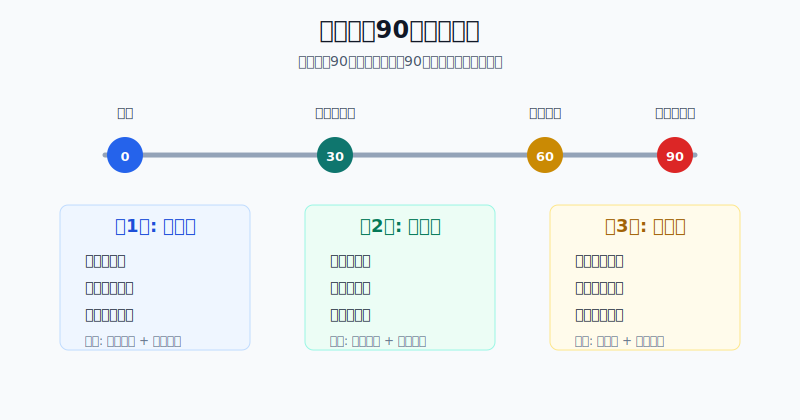
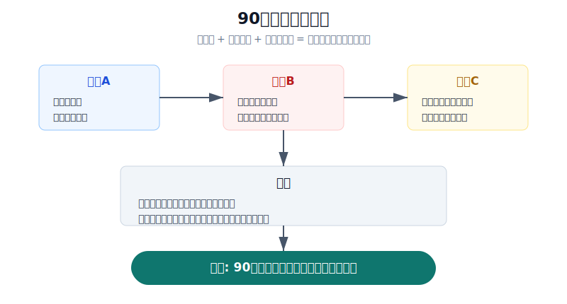
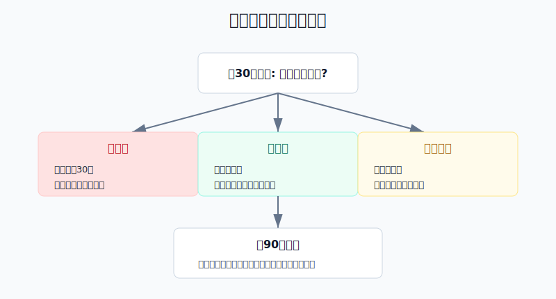

## 散户投资小白金融全品种操盘手册 - 17.1 刚入门的90天学习路径
  
### 作者  
digoal  
  
### 日期  
2026-06-08   
  
### 标签  
金融产品 , 金融工具 , 散户 , 投资小白 , 全品操盘手册  
  
----  
  
## 背景 
  

> 适用读者: 刚开户、刚开始买基金或ETF，或者亏过几笔后发现自己其实还没有系统的新手。  
> 本文定位: 典型场景实战手册，不构成个性化投资建议。数据口径按 2026-06-06 可核查公开资料整理。

## 先问一个反直觉的问题

刚入门最重要的事，不是尽快找到一只会涨的股票，而是先让自己有资格下单。开户只要几分钟，真正入门至少要90天。**这90天的目标不是赚大钱，而是把账户从“手痒下单”训练成“有规则行动”。**

## 核心概念: 90天不是课程表，是三道风控门

很多小白把学习路径理解成“先看几本书，再找高手推荐股票”。这个顺序是反的。投资不是考试，知道概念不等于能管住账户；真正要训练的是三件事: 能解释风险，能写出规则，能用小仓位执行并复盘。

所以，本节给你的不是每天读什么书，而是一个90天闯关表。

第1关，0到30天，叫认知关。你要知道自己到底能碰哪些工具，不能碰哪些工具。现金、货币基金、短债、宽基ETF、行业ETF、个股、可转债、港美股、期权、期货，名字都像“投资”，底层风险完全不同。

第2关，31到60天，叫规则关。你要把账户分成生活钱、防守钱、进攻钱，写清单品种仓位上限、买入条件、卖出条件和停止交易条件。没有规则之前，所谓机会只是诱惑。

第3关，61到90天，叫试运行。你可以用很小的钱做真实执行，但重点不是赚多少，而是验证自己能不能按计划买、按计划不买、亏了以后不乱补仓。

## 逻辑推导链

【论证链标题】: 因为新手最大风险不是少赚，而是在不懂规则时用真钱试错，所以刚入门的90天应先完成认知、规则、试运行三关，再扩大真实仓位。

### 第一步: 前提陈述

前提A: 市场入口越来越低，但产品数量和风险层级很复杂，这是常量。中国结算2024年统计年报显示，2024年新增投资者1,274.28万，期末投资者数23,680.34万；同年沪深A股5,123只，ETF 1,043只。开户像进商场，门很好进，但货架上有食品、药品、刀具和易燃品，不能见到包装就买。

前提B: 新手常常高估自己，低估骗局和错误决策，这是变量。FINRA Foundation 2024年投资者调查中，受访投资者平均只答对11道投资知识题里的5.3道；面对“保证、无风险、年化25%”这类明显红旗，约一半投资者没有直接识别为风险。年轻投资者还更容易受社交媒体影响，35岁以下受访者中61%会依据金融网红建议做投资决定。

前提C: 频繁交易和主动选股，对普通人并不友好，这是常量。Barber 和 Odean 研究1991-1996年66,465个美国家庭券商账户，交易最频繁的一组年化收益约11.4%，同期市场约17.9%。S&P Dow Jones Indices 的 SPIVA U.S. Year-End 2025 也显示，2025年79%的美国主动大盘股票基金跑输S&P 500。连专业基金经理都很难长期稳定跑赢指数，新手一上来就重仓选股，胜率基础并不牢。

前提D: 能长期留下来的投资者，靠的不是第一笔赚多少，而是有没有反馈闭环，这是常量。反馈闭环就是: 下单前有理由，持有中有观察，错了有纠偏，做完有复盘。没有闭环，盈利会变成自信膨胀，亏损会变成急于翻本。

### 第二步: 逻辑推导

由A+B可得: 因为开户很容易，而知识和防骗能力常常跟不上，所以前30天不能把“能买”当成“该买”。这一阶段的任务是识别风险，不是追收益。

由B+C可得: 因为新手容易受热点影响，而频繁交易和主动选股本身胜率不高，所以31到60天要先写规则。规则不是束缚你赚钱，而是防止你在最不成熟的时候把仓位开大。

再由A+B+C+D可得: 因为市场复杂、认知不足、交易不容易、反馈又需要时间，所以61到90天只能小仓试运行。小仓位的意义不是小气，而是用可承受的成本验证自己能不能执行。

最后结论是: **刚入门的90天，顺序必须是先认知、再规则、后试运行；没有通过上一关，不进入下一关。**

### 第三步: 正常情景下的操作结论

✅ 正常情景: 你是普通散户，没有稳定验证过的交易系统，投资资金亏多了会影响情绪和生活决策。

对应操作: 按三段走。

| 时间 | 核心任务 | 允许动作 | 禁止动作 | 过关标准 |
|---|---|---|---|---|
| 0-30天 | 认知关 | 学工具、看规则、做模拟、整理禁买清单 | 重仓个股、杠杆、期权期货、听消息买入 | 能说清6类底层风险和自己不能碰什么 |
| 31-60天 | 规则关 | 写三层账户、仓位上限、买卖条件、复盘表 | 临时加仓、追热点、把现金全部用掉 | 每笔交易都有买入理由和失效条件 |
| 61-90天 | 试运行 | 用小仓位买宽基ETF、货币/短债或观察仓 | 用大钱证明自己、亏损后补仓翻本 | 有30天记录，且无红线交易 |

一个小白默认规则可以写得很硬: 前60天不碰杠杆、不碰期权期货、不融资、不借钱、不满仓；如果要真实买入，只买自己能解释清楚的低复杂度品种。第61天以后，真实试运行资金也不应影响生活钱和防守钱，主动试错仓先控制在总投资资金的5%以内，单笔错误不让账户亏超过1%。

### 第四步: 数据和案例证实

证据1: 中国结算2024年统计年报显示，2024年新增投资者1,274.28万，期末投资者数23,680.34万，沪深A股5,123只、ETF 1,043只。这个证据对应前提A: 市场入口和产品供给都很大，新手需要先学分类，而不是随便点进一个热门品种。

证据2: FINRA Foundation 2024年投资者调查显示，2,861名非退休账户投资者平均答对5.3/11道投资知识题；约一半受访者没有直接识别“保证、无风险、年化25%”这类诈骗红旗。这个证据对应前提B: 即使已经是投资者，也可能存在基础知识缺口。

证据3: Barber 和 Odean 2000年论文显示，交易最频繁的家庭账户年化收益约11.4%，同期市场约17.9%。这个证据对应前提C: 新手越想通过频繁操作快速证明自己，越容易被成本、情绪和错误判断拖累。

证据4: SPIVA U.S. Year-End 2025 显示，2025年79%的美国主动大盘股票基金跑输S&P 500。这个证据也对应前提C: 主动选股和择时不是不能做，而是不能作为刚入门第一优先级。

失败案例: 小周刚开户，看到AI和半导体很热，第一周就把10万元里的7万元买成3只个股和1只行业ETF。第二周回撤8%，他不复盘，反而又把剩余现金补进去，理由是“跌多了会反弹”。一个月后账户亏到12%，他已经不敢止损，也不敢继续学习。问题不在于AI一定不好，而在于小周没有通过认知关和规则关，就直接用大仓位试错。

历史数据不代表未来。上面数据仍有参考价值，是因为它们验证的是结构规律: 产品多、知识缺口存在、频繁交易不占优、主动跑赢很难。90天路径解决的不是预测问题，而是训练新手不要在最脆弱的时候犯大错。

### 第五步: 前提变化时的替代结论

若前提B改善，也就是你已经能解释ETF、债券、转债、个股、黄金、QDII的主要风险，并能识别常见骗局，推导路径变为: 因为认知关已通过，所以可以提前进入规则关。新结论: 可以写组合模板，但仍不跳过小仓试运行。

若前提C恶化，也就是市场进入牛市、身边人都在赚钱、你明显出现踏空焦虑，推导路径变为: 因为情绪诱惑变强，所以90天路径不能加速，反而要把主动试错仓降得更低。新结论: 只允许按计划买宽基或现金管理工具，不用个股追热点证明自己。

若前提D没有建立，也就是你每次交易都不写理由、不写卖出条件、不复盘，推导路径变为: 因为没有反馈闭环，所以真实交易不会带来学习，只会带来随机结果。新结论: 停止新增风险仓，回到第31天重写规则。

反例: 如果你只是把长期不用的钱按月定投宽基ETF，仓位很小，也没有追热点、加杠杆和临时补仓，这不等于危险交易。此时90天路径的重点不是禁止你定投，而是让你写清资金期限、目标仓位和再平衡规则。

## 实操例子: 10万元新手账户怎么过90天

这个例子对应论证链的结论: **先过三关，再扩大真实仓位。**

假设小林有10万元投资资金，另外已经留足6个月生活费。第0天，他不急着买股票，而是先把10万元分成三层: 6万元防守资金放在货币基金、短债或现金管理工具观察；3万元作为未来核心配置预备金；1万元作为90天学习资金。

第1到30天，小林只做三件事。第一，列出自己看得懂和看不懂的品种；第二，完成本书第一章到第四章的风险地图和ETF基础；第三，写禁买清单: 不融资、不借钱、不买期权期货、不买听不懂的跨境高溢价产品、不买没有成交量的小ETF。第30天如果他说不清“宽基ETF和行业ETF有什么风险差别”，就不进入下一关。

第31到60天，小林开始写规则。他规定: 单只个股暂时不买；行业ETF观察仓不超过总账户5%；宽基ETF未来可以做核心，但第一次买入不超过总账户10%；任何主动交易单笔亏损不超过总账户1%；连续3笔亏损暂停一周。这里的重点不是数字多漂亮，而是每个数字都能解释。

第61到90天，小林开始小仓试运行。他用5000元买一只流动性足够的宽基ETF，用3000元做货币或短债观察，用2000元保留现金，不碰个股。每周末记录一次: 买入理由是否仍成立、仓位是否超限、有没有冲动下单、有没有因为涨跌改变计划。第90天，如果30天内没有红线交易，才允许下一季度把核心ETF计划提高到更合适的比例。

如果前提不成立，动作要切换。比如小林第45天看到热门个股连续涨停，想把3万元预备金全部买进去，这说明他不是通过规则关，而是被情绪拉走。正确动作不是“少买一点试试”，而是把这笔冲动写进复盘表，延后48小时再判断。

如果操作错误，后果很清楚。小林若第1周就用7万元追热点，亏10%就是账户亏7%；如果再补仓，亏损会迅速变成心理问题。90天路径的价值，就是把这种大错提前拦住。

## 可复用框架

【三关入门】

适用前提: 你刚开始投资，或者亏损后准备重新建立系统。

核心逻辑: 因为新手最容易在知识不足时扩大风险，所以先认知、再规则、后试运行。

操作步骤:

1. 认知关: 30天内能说清每个品种赚什么钱、亏什么钱、最坏情况是什么。
2. 规则关: 30天内写出三层账户、仓位上限、买卖条件、停手条件。
3. 试运行: 30天内只用小仓位验证执行，不用大钱证明自己。

前提失效时: 如果无法解释风险，回到认知关；如果无法执行规则，回到规则关；如果连续亏损，暂停试运行。

举一反三: 这个框架也适用于学习港股、美股、可转债、黄金、REITs、期权和期货。

【先证资格】

适用前提: 你想扩大仓位或从ETF进入个股、转债、港美股等更复杂品种。

核心逻辑: 因为仓位越大，错误越贵，所以先证明自己能按规则亏小钱，再考虑赚大钱。

操作步骤:

1. 写下扩仓理由，不接受“最近涨得好”。
2. 写下错误代价，单笔错误先不超过总账户1%。
3. 写下复盘证据，至少连续30天没有红线交易。
4. 扩仓只扩一档，不从观察仓直接跳到重仓。

前提失效时: 如果扩仓来自焦虑、攀比、回本冲动或消息刺激，当天不扩仓。

举一反三: 后面遇到牛市踏空、熊市补仓、被套后加仓，都先问一句: 我是在证明资格，还是在证明情绪?

## 本节行动清单

| 动作 | 合格标准 |
|---|---|
| 写90天日历 | 0-30天认知，31-60天规则，61-90天试运行 |
| 写禁买清单 | 至少包括借钱、融资、满仓、杠杆、听不懂的复杂品种 |
| 写三层账户 | 生活钱、防守钱、进攻钱分开，不混用 |
| 写仓位上限 | 单品种、单行业、主动试错仓都有数字 |
| 写买卖条件 | 买入理由、失效条件、卖出动作同时存在 |
| 写复盘表 | 每周记录一次，不凭感觉说自己进步 |
| 过关再扩仓 | 没过上一关，不进入下一关 |

## 一句话总结

刚入门的90天，不是用来证明你能赚多少钱，而是证明你不会因为不懂、冲动和重仓，把以后赚钱的资格先亏掉。

## 参考资料

- 中国证券登记结算有限责任公司: 《2024年统计年报》，https://www.chinaclear.cn/zdjs/tjnb/202506/542ecc4ea6e14595ac34be6843c7ebb5/files/2024%E5%B9%B4%E7%BB%9F%E8%AE%A1%E5%B9%B4%E6%8A%A5.pdf
- FINRA Investor Education Foundation: Investors in the United States, 2024 NFCS Investor Survey, https://finrafoundation.org/InvestorReport2024
- Brad M. Barber and Terrance Odean: Trading Is Hazardous to Your Wealth, Journal of Finance, 2000, https://onlinelibrary.wiley.com/doi/10.1111/0022-1082.00226
- S&P Dow Jones Indices: SPIVA U.S. Year-End 2025, https://www.spglobal.com/spdji/en/spiva/article/spiva-us/

> ⚠️ **声明**：本文内容为投资教育目的，所有历史数据、策略框架均为辅助学习工具，不构成证券投资建议。市场有风险，投资需谨慎。实际操作请结合自身风险承受能力，必要时咨询专业投顾。
  
#### [PostgreSQL 解决方案集合](../201706/20170601_02.md "40cff096e9ed7122c512b35d8561d9c8")
  
  
#### [德哥 / digoal's Github - 公益是一辈子的事.](https://github.com/digoal/blog/blob/master/README.md "22709685feb7cab07d30f30387f0a9ae")
  
  
#### [About 德哥](https://github.com/digoal/blog/blob/master/me/readme.md "a37735981e7704886ffd590565582dd0")
  
  

  
