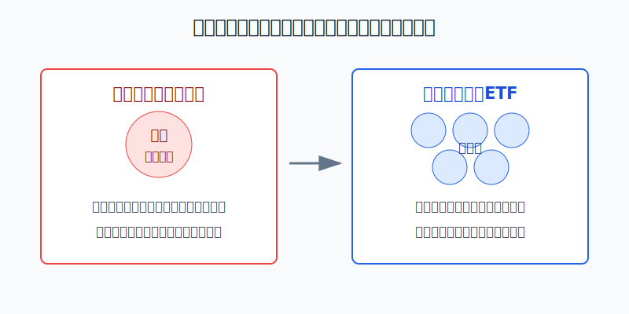
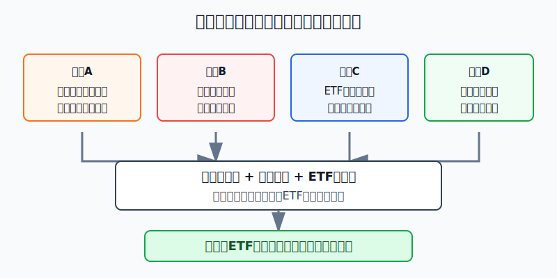
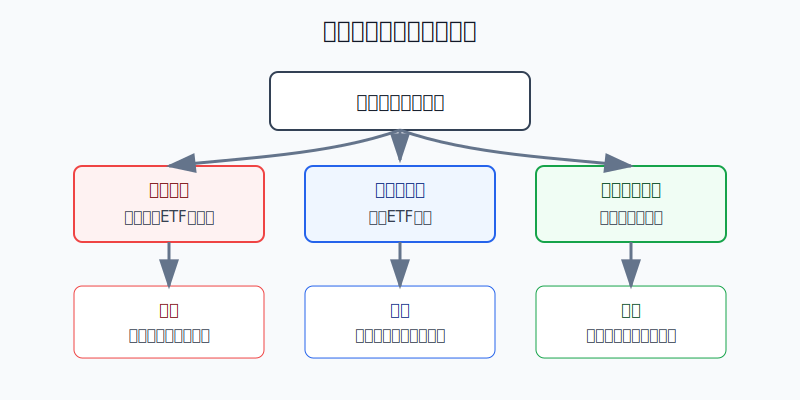

## 散户投资小白金融全品种操盘手册 - 17.2 只有少量资金时，为什么ETF优先于个股
  
### 作者  
digoal  
  
### 日期  
2026-06-08   
  
### 标签  
金融产品 , 金融工具 , 散户 , 投资小白 , 全品操盘手册  
  
----  
  
## 背景 
  

> 适用读者: 可投资资金只有几千到几万元，想开始实战，但不知道先买ETF还是先买个股的小白投资者。  
> 本文定位: 投资教育框架，不构成个性化投资建议。

## 先问一个反直觉的问题

资金少时，很多人觉得更应该买个股，因为“买对一只涨得快”。真实顺序相反：**钱越少，越不能把第一步做成押一家公司。** 少量资金最缺的不是刺激，而是容错率。

## 核心概念: ETF不是保本工具，而是把第一步做宽

ETF可以理解成一只在交易所买卖的基金。它常见的用法，是把一篮子股票、债券、黄金或其他资产装进一个交易代码里。你买的不是某一家公司的命运，而是一套指数或一篮子资产的表现。

个股像只坐一辆车：司机、车况、路线、天气都要判断。ETF像先坐一列车：你仍会遇到晚点和颠簸，但不会因为一辆车爆胎就停在路边。

所以本节的行动结论很明确：**少量资金先用宽基ETF做核心学习仓；行业ETF和个股后置。个股不是不能买，而是必须等你有研究能力、仓位上限和失效条件后，再用小比例验证。**

## 逻辑推导链

【论证链标题】: 因为少量资金容错率低，而个股判断链长、风险集中，所以先用宽基ETF降低第一步的犯错成本。

── 第一步: 前提陈述

前提A: 少量资金的容错率低。这是常量。1万元账户亏20%，只剩8000元；要回到1万元，需要再赚25%。钱少时，每一次重仓错误都会直接伤到信心和后续操作空间。

前提B: 个股风险集中，且长期赢家分布很偏。这是常量。买一只股票，本质是把钱交给一家公司的经营、估值、行业周期和市场情绪。Hendrik Bessembinder对1926-2019年美国上市普通股的研究显示，57.8%的股票相对短期国库券减少了股东财富，而美国股市整体仍创造了47.4万亿美元净财富。意思不是个股不能赚钱，而是市场总回报高度集中在少数大赢家身上。

前提C: ETF能把“选一家”的问题先变成“选一篮子”的问题，但ETF仍有工具风险。这是变量。SEC Investor.gov说明，ETF的市场价格会相对净值出现溢价或折价，波动越高，投资风险越高。ETF优先，不等于看见ETF三个字就买。

前提D: 主动跑赢指数并不容易。这是变量。S&P Dow Jones Indices的SPIVA U.S. Year-End 2025显示，2025年美国大型主动股票基金中，78.78%跑输S&P 500；10年期跑输比例为85.59%。专业基金经理都不容易长期胜出，小白第一步不该默认自己能靠一两只个股胜出。

── 第二步: 逻辑推导

由A+B可得: 因为少量资金经不起大比例试错，而个股把风险集中到一家公司，所以少量资金直接买个股，容易从“学习投资”变成“押注结果”。

再由B+C可得: 因为ETF把一篮子资产装进一个交易代码，所以它能先降低单家公司判断错误的冲击；但因为ETF仍有市场波动、费用、价差、折溢价和流动性问题，所以ETF优先必须限定为“合格ETF优先”，尤其是宽基ETF优先。

最后由A+B+C+D可得: **少量资金的正确顺序是先做宽，再做深。先用宽基ETF建立市场暴露和交易纪律；等资金量、研究能力和复盘记录提高后，再把行业ETF和个股放进卫星仓或试错仓。**

── 第三步: 正常情景下的操作结论

✅ 正常情景: 你已经留足生活备用金；这笔钱三年以上不用；总资金只有几千到几万元；还不能稳定读懂财报、估值和卖出条件。

对应操作: 先把学习仓放在宽基ETF、债券或现金管理等规则清楚的工具上。股票类ETF只做分批，不一次买满；单只个股暂时不做核心仓。若一定要学个股，单票只能放在试错仓，且先写清买入理由、亏损上限和失效条件。

── 第四步: 数据和案例证实

证据1: 交易门槛看似相同，底层风险不同。上交所《交易规则（2023年修订）》为截至2026年6月6日仍现行有效的交易通用规则；A股日常交易里，股票和ETF通常都以100股（份）或其整数倍作为买入申报单位。也就是说，100股股票和100份ETF都能交易，但100股股票只对应一家公司，100份宽基ETF背后对应的是一篮子资产。

证据2: 个股赢家分布很偏。Bessembinder的1926-2019年研究显示，57.8%的美国上市普通股相对短期国库券减少了股东财富，但股票市场整体仍创造47.4万亿美元净财富。这个证据对应前提B：少量资金如果只买少数个股，最难的是提前猜中少数长期赢家。

证据3: 专业主动管理也常输给基准。SPIVA U.S. Year-End 2025显示，2025年78.78%的美国大型主动股票基金跑输S&P 500，10年期跑输比例为85.59%。这个证据对应前提D：小白不该把“我能选中好股票”当成默认能力。

证据4: ETF已经是标准化工具。ICI《2026 Investment Company Fact Book》显示，截至2025年底，美国ETF市场有4495只基金，总净资产13.4万亿美元。这个数据不代表所有ETF都适合买，但说明ETF不是边缘产品，而是成熟市场里被广泛使用的资产配置工具。

失败案例: 把ETF当成“不会亏”的个股替代品。Nasdaq官方事实表显示，Nasdaq-100价格指数2022年下跌32.97%。如果一个小白把全部2万元买入单一高弹性指数或窄主题ETF，回撤同样会很难受。这个反例说明：ETF降低的是单家公司风险，不消灭市场风险；宽基ETF优先，也不等于重仓押单一热门方向。

历史不代表未来。上面数据仍有参考价值，是因为它们验证的是结构规律：小资金容错率低，个股收益分布偏，主动胜出难，分散化工具能降低第一步难度。

── 第五步: 前提变化时的替代结论

若前提“这笔钱三年以上不用”不成立，推导路径变为: 因为短期要用的钱承受不起股票波动，所以股票ETF和个股都不适合进入实盘。新结论: 先放现金管理、货币基金、短债等低波动工具。

若前提“ETF是合格宽基”不成立，推导路径变为: 因为杠杆ETF、反向ETF、单一行业ETF、窄主题ETF、高溢价跨境ETF的风险结构已经变窄或变复杂，所以ETF优先失效。新结论: 暂停下单，先排除看不懂、成交差、溢价高、费用高的产品。

若前提“你不会研究个股”改变，推导路径变为: 因为你已经能读懂财报、估值、竞争格局和卖出条件，所以可以用小比例学习个股。新结论: 个股只能做卫星仓或试错仓，不能替代宽基ETF底座。

## 实操例子: 2万元账户怎么开始

这个例子对应论证链的正常结论：**先用宽基ETF建立底座，再用小比例学习个股。**

假设小林有2万元可投资资金，生活备用金已经留好，未来三年不用。他想买A股，也想学个股。

第一步，先定资金任务。2万元不是“翻倍本金”，而是“学习仓”。如果这笔钱一年内要交学费、还债或买房，直接停止股票类操作，转入现金管理。这一步对应前提变化的第一种情况。

第二步，先分三层。示例分法是：1.4万元作为核心学习仓，研究宽基ETF；4000元作为防守或现金仓；2000元作为试错仓。这样做不是保证收益，而是防止第一次判断错误就把账户打穿。

第三步，ETF先过四项检查：跟踪什么指数、规模和成交是否够、费用和买卖价差是否合理、是否存在明显溢价。四项写不清，不下单。这一步对应前提C。

第四步，个股只允许进试错仓。若小林想买一家公司，先写三句话：我为什么买、什么情况说明我错了、最多亏多少钱就停止。写不出来，不买；写出来也只用2000元以内，不追加。

第五步，复盘三个月再升级。三个月内只记录买入理由、指数变化、ETF折溢价、个股试错结果。若连续三次复盘说不清，就取消个股试错，把资金回到ETF和现金仓。

如果操作错误，常见后果是把2万元分成两三只热门个股。单只亏20%，账户就会明显受伤；亏损后又想靠下一只股翻本，交易会越来越情绪化。纠偏方法不是再找“更强的票”，而是回到本节框架：先做宽，再做深。

## 可复用框架

【先宽后深】

适用前提: 可投资资金只有几千到几万元，且还没有稳定研究个股的能力。

核心逻辑: 因为钱少时容错率低，而个股风险集中，所以先用宽基ETF降低第一步难度；等能力和资金都提高后，再研究行业和个股。

操作步骤:

1. 先宽: 宽基ETF、现金管理、债券类工具先建立底座。
2. 后深: 行业ETF和个股只放在卫星仓或试错仓。
3. 写边界: 每次下单前写资金期限、仓位上限、失效条件。

前提失效时: 如果ETF不是宽基、成交差、溢价高、规则看不懂，就不适用“ETF优先”；如果钱短期要用，股票ETF和个股都后置。

举一反三: 这个框架也适用于美股ETF、港股ETF、QDII基金和商品基金。先判断一篮子，再判断具体工具。

【小钱三问】

适用前提: 你准备拿少量资金实盘，但不确定该买什么。

核心逻辑: 因为少量资金亏不起大比例错误，所以先问清钱的用途、工具的风险、自己的能力。

操作步骤:

1. 这笔钱多久不用？三年内要用，不买股票类资产。
2. 这个工具有多宽？宽基优先，窄主题和单只个股后置。
3. 我错了怎么办？写不出止损、减仓或暂停条件，就不下单。

前提失效时: 如果你开始用“涨得快”替代上述三问，说明已经从学习切换成追涨，立即降仓或暂停。

举一反三: 以后买黄金ETF、REITs、可转债、行业ETF，都先用这三问过滤。

## 本节行动清单

| 动作 | 合格标准 |
|---|---|
| 先确认资金期限 | 三年内要用的钱，不进股票ETF和个股 |
| 先选宽基ETF | 能说清指数、费用、规模、成交和折溢价 |
| 个股后置 | 不会财报和估值时，个股不做核心仓 |
| 试错有上限 | 单只个股只进试错仓，先写亏损上限 |
| 分批执行 | 学习仓不一次买满，记录每次买入理由 |
| 复盘再升级 | 连续三次说不清，就暂停个股试错 |

## 一句话总结

只有少量资金时，ETF优先于个股，不是因为ETF稳赚，而是因为它先帮你把“押一家公司”的风险降成“一篮子市场风险”；小钱最重要的任务，是活下来、学明白、少犯大错。

## 参考资料

- 上海证券交易所: 《上海证券交易所交易规则（2023年修订）》，现行有效，2026年6月6日访问，https://www.sse.com.cn/lawandrules/sselawsrules2025/trade/universal/c/c_20250612_10781695.shtml
- SEC Investor.gov: Exchange-Traded Funds (ETFs)，2026年访问，https://www.investor.gov/introduction-investing/investing-basics/investment-products/mutual-funds-and-exchange-traded-2
- S&P Dow Jones Indices: SPIVA U.S. Year-End 2025，数据截至2025年12月31日，https://www.spglobal.com/spdji/en/spiva/article/spiva-us/
- Hendrik Bessembinder: Wealth Creation in the U.S. Public Stock Markets 1926 to 2019，SSRN，2020年，https://papers.ssrn.com/sol3/papers.cfm?abstract_id=3537838
- Investment Company Institute: 2026 Investment Company Fact Book，2026年4月，https://www.ici.org/system/files/2026-04/2026-factbook.pdf
- Nasdaq: Nasdaq-100 Fact Sheet，截至2026年3月31日，https://indexes.nasdaq.com/docs/FS_NDX.pdf

> ⚠️ **声明**：本文内容为投资教育目的，所有历史数据、策略框架均为辅助学习工具，不构成证券投资建议。市场有风险，投资需谨慎。实际操作请结合自身风险承受能力，必要时咨询专业投顾。
  
#### [PostgreSQL 解决方案集合](../201706/20170601_02.md "40cff096e9ed7122c512b35d8561d9c8")
  
  
#### [德哥 / digoal's Github - 公益是一辈子的事.](https://github.com/digoal/blog/blob/master/README.md "22709685feb7cab07d30f30387f0a9ae")
  
  
#### [About 德哥](https://github.com/digoal/blog/blob/master/me/readme.md "a37735981e7704886ffd590565582dd0")
  
  

  
