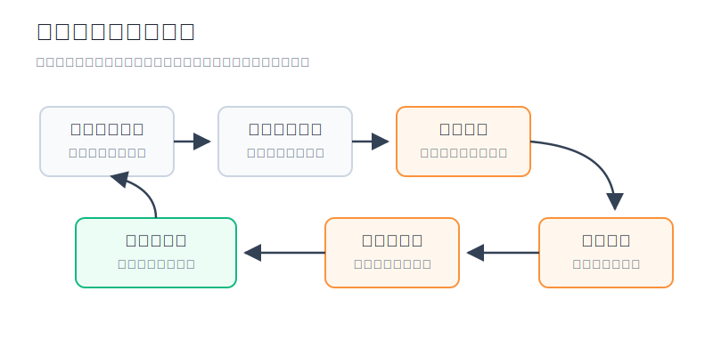
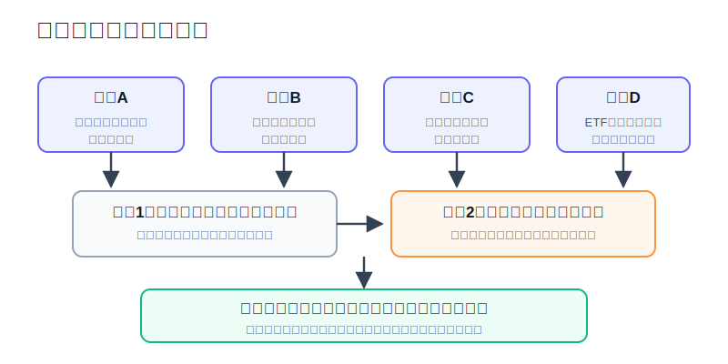
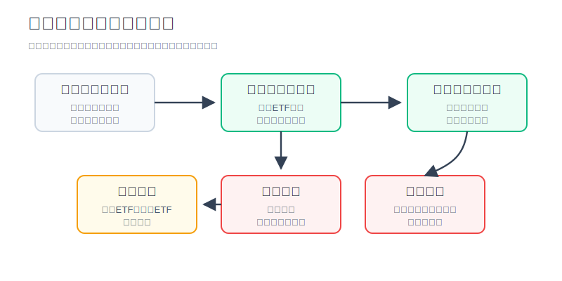

## 散户投资小白金融全品种操盘手册 - 17.3 牛市来了怎么避免踏空焦虑
  
### 作者  
digoal  
  
### 日期  
2026-06-08   
  
### 标签  
金融产品 , 金融工具 , 散户 , 投资小白 , 全品操盘手册  
  
----  
  
## 背景 
  

> 适用读者: 看到指数连续上涨、朋友开始晒收益，既怕错过又怕追高的小白投资者。  
> 本文定位: 投资教育框架，不构成个性化投资建议。

## 先问一个反直觉的问题

牛市最容易让小白亏钱的时刻，往往不是刚涨的时候，而是大家都开始说“牛市确定了”的时候。因为这时你买的不是资产，而是焦虑: **怕别人已经上车，怕自己永远追不上，怕再等一天就少赚一大截。**

## 核心概念: 踏空焦虑不是错过行情，而是仓位失控

踏空，就是市场涨了，而你没有足够仓位参与。踏空焦虑，是你把“少赚了”翻译成“必须马上补回来”。这两个东西不一样。

少赚了，是结果；马上补回来，是情绪动作。真正伤账户的通常不是前者，而是后者。因为一个人如果在上涨20%以后，直接把本来只适合30%的权益仓加到80%，接下来哪怕市场只回撤10%，账户心理压力也会突然变大。牛市还没赚明白，先把纪律弄丢了。

本节行动结论先放在前面: **牛市来了，不要用“一把梭”解决踏空焦虑。先写权益仓位上限，再用宽基ETF建立底仓，随后只在信号继续确认时分批加仓。没有底仓的，先解决“在场”；已经有仓位的，先检查是否超线；涨得太快、溢价太高、看不懂原因时，暂停追入。**

## 逻辑推导链

【论证链标题】: 因为牛市只能事后确认，完全空仓会错过核心上涨日，而追涨满仓又会放大回撤，所以小白要用“底仓参与 + 阶梯加仓 + 仓位上限”处理踏空焦虑。

── 第一步: 前提陈述

前提A: 牛市在早期看起来很像反弹，这是常量。行情刚启动时，没有人会敲锣告诉你“这是牛市第一天”。它通常只是从一段下跌或震荡里先涨一截，等多数人承认牛市时，价格已经走出一大段。

前提B: 完全空仓会承担机会成本，这是常量。机会成本，就是你为了等待更确定的信号，放弃了已经发生的上涨。它不像亏损那样显示在账户里，但会显示在你的焦虑里。

前提C: 追涨满仓会承担回撤成本，这是常量。牛市也会调整，甚至会有很急的调整。仓位越重，回撤越容易把你从“怕错过”打回“怕亏钱”。

前提D: 宽基ETF和分批买入能降低两类错误，这是相对稳定的前提。宽基ETF降低选错个股的风险；分批买入降低一次买在短期高点的风险。但它们不能消灭市场波动。

── 第二步: 逻辑推导

由A+B可得: 因为牛市早期无法被完全确认，而完全空仓会错过上涨日，所以小白不能把策略写成“等牛市确定再买”。等到所有人都说确定，往往已经不是低风险入场点。

再由B+C可得: 因为踏空会制造焦虑，而焦虑会诱导一次性补仓，所以小白也不能把策略写成“涨了就赶紧买满”。这不是解决踏空，而是把机会成本变成回撤成本。

最后由C+D可得: 因为ETF和分批能降低选错和择时风险，所以合理动作不是猜牛市真假，而是把参与方式制度化: 先用可承受的底仓留在市场里，再用趋势、成交、估值和仓位上限决定是否继续加仓。

── 第三步: 正常情景下的操作结论

✅ 正常情景: 这笔钱是三年以上不用的长期资金；你还没有明显权益仓；市场已经出现宽基指数走强、成交改善、风险偏好回升，但估值和溢价没有明显失控。

对应操作: 先把权益仓位上限写出来，例如总账户最高50%或60%。第一笔只建立底仓，例如10%到20%的宽基ETF；随后每次只有在信号继续确认时加一格，每格5%到10%。任何时候都不因为“别人赚了”突破仓位上限。

── 第四步: 数据和案例证实

证据1: J.P. Morgan Asset Management 的《Guide to Retirement 2026》测算，2006年1月2日至2025年12月31日，1万美元完全投资于标普500总回报指数可变为80,619美元；如果错过其中最好的10个交易日，结果降至35,866美元。该资料还指出，10个最佳交易日中有6个发生在10个最差交易日的两周内。这个证据对应前提B: 完全空仓等待“舒服的时点”，会有错过关键上涨日的风险。

证据2: S&P Dow Jones Indices 2026年评论显示，标普500总回报在2022年为-18.11%，2023年为+26.29%，2024年为+25.02%，2025年为+17.88%。这个顺序很重要: 大跌后的反弹和连续上涨，往往在投资者还没恢复信心时已经开始。它验证了前提A: 牛市和修复行情都不会等你情绪准备好。

证据3: FINRA 在投资者教育中提醒，频繁进出、冲动决策和害怕错过机会，也就是FOMO，可能损害投资表现；FINRA 还在打击“拉高出货”骗局的材料中说明，骗子会利用“现在不买就没机会”的时间压力来放大FOMO。这个证据对应前提C: 踏空焦虑不是小问题，它会直接改变交易动作。

证据4: 2015年A股行情提供了反面案例。中国人民银行《2015年金融市场运行情况》记录，2015年上证指数年内最高点为5178.19点，最低点为2850.71点；陆家嘴金融网转载中国证券网2015年8月26日收盘数据，上证指数当天报收2927.29点。也就是说，从5178点高位到8月26日收盘，指数已经下跌约43.5%。这说明当“牛市已确定”的声音最响时，追涨重仓承受的不是小波动，而可能是组合级别的伤害。

历史数据不代表未来。上面数据的价值不在于告诉你下一次牛市怎么走，而在于验证同一条结构规律: 完全空仓会错过不舒服时刻里的上涨，追涨满仓会在情绪最热时放大风险。小白要处理的不是“有没有牛市”，而是“自己在牛市和假牛市里都能活下来”。

── 第五步: 前提变化时的替代结论

若前提B改变，也就是你已经有30%到50%的核心权益仓，推导路径变为: 你不是踏空，而是觉得自己赚得不够快。新结论: 不新增大仓位，只用小比例卫星仓参与更强方向，或者等再平衡时调整。

若前提C加强，也就是指数短期大涨、主题ETF溢价明显、社群情绪极热，推导路径变为: 价格已经把乐观预期计入太多。新结论: 暂停追入，等回踩、溢价回落或下一次复盘窗口。

若前提A被证伪，也就是上涨不是宽基改善，而只是单一题材、单一消息、少数股票拉动，推导路径变为: 这不是适合小白加核心仓的牛市信号。新结论: 不把主题热度当成牛市确认，只允许用学习仓小额观察。

失败案例: 账户10万元，本来计划权益仓最高50%，但看到指数两个月涨了18%，朋友都在赚钱，就把8万元一次性买入高波动行业ETF。随后行业回撤20%，账户亏损1.6万元。这里错的不是“看多市场”，而是前提C失控: 仓位先越过承受力，后面所有判断都会被亏损情绪绑架。

## 实操例子: 10万元账户如何处理牛市焦虑

这个例子对应论证链的正常结论: **先用底仓解决在场问题，再用阶梯加仓解决参与问题，最后用上限解决失控问题。**

假设小陈有10万元投资资金，其中2万元是半年内可能要用的钱，不能进权益市场；剩下8万元是三年以上不用的长期资金。他看到宽基指数连续上涨，身边人开始讨论牛市，自己目前只有1万元货币基金和9万元现金。

第一步，先切掉不能冒险的钱。2万元短期资金继续放在现金或低风险工具里，不参与这轮行情。因为这笔钱的目标是安全和流动性，不是收益最大化。

第二步，给长期资金设上限。小陈风险承受能力一般，规定总账户权益仓最高50%，也就是最多5万元；其中核心宽基ETF最高4万元，行业或主题学习仓最高1万元。这个上限一旦写下，后面无论市场多热，都不能因为情绪改成80%。

第三步，建立底仓。市场已经出现宽基指数走强、成交改善，但他无法判断这是真牛市还是反弹，所以第一笔买入1.5万元宽基ETF，占总账户15%。这一步对应前提A和B: 不等完全确认，但也不一次买满。

第四步，设置三档加仓。第一档: 如果指数回踩不跌破关键均线，且成交没有快速萎缩，再加5000元。第二档: 如果宽基指数继续创新高，且不是少数题材拉动，再加1万元。第三档: 如果组合盈利超过8%，市场仍没有出现明显高估和高溢价，再加1万元。三档全部完成后，核心宽基仓位约4万元，到达计划上限，不再加核心仓。

第五步，处理“别人赚更多”的刺激。如果社群开始晒翻倍收益，小陈只允许用最多1万元学习仓看行业ETF，而且单个主题最多5000元。学习仓亏损达到10%，停止加仓并复盘；盈利达到20%但估值和情绪过热，至少减回本金或降到原仓位。

第六步，写错误纠偏。如果买入后指数连续跌破原来确认信号，小陈不补仓证明自己。他先暂停后续两档加仓，等周复盘重新判断。若只是正常回踩，底仓不动；若上涨前提被证伪，例如成交快速萎缩、宽基转弱、只有题材股乱涨，就不再把这轮行情当作牛市处理。

如果小陈不按这个流程做，最容易出现的后果是: 一开始空仓观望，涨多后焦虑，一次买入5万元甚至8万元；随后一回撤就害怕，低位卖出；再上涨又追。账户不是被市场打败，而是被反复改计划打败。

## 可复用框架

【底仓梯子】

适用前提: 你有长期资金，当前权益仓偏低，但无法确认行情是真牛市还是反弹。

核心逻辑: 因为牛市不能提前完全确认，所以先用底仓留在场内；因为追涨满仓会放大回撤，所以每次只按信号加一格。

操作步骤:

1. 写上限: 总权益仓最高多少，核心ETF最高多少，主题学习仓最高多少。
2. 建底仓: 用10%到20%的宽基ETF解决完全空仓问题。
3. 分三格: 每次加5%到10%，加仓必须对应趋势、成交、估值或回踩确认。
4. 到线停手: 到达上限后不再因为别人赚钱而加仓。

前提失效时: 如果上涨只是单一题材带动，底仓可以保留，但不加核心仓；如果ETF溢价过高，等待溢价回落；如果短期钱被混入账户，先把短期钱撤出风险资产。

举一反三: 这个框架适用于A股宽基ETF、美股宽基ETF、港股ETF和全球组合的权益仓调整。

【两问止焦】

适用前提: 你看到市场上涨后，产生“必须马上买”的冲动。

核心逻辑: 因为焦虑会把少赚误判成亏损，所以先问仓位和价格，再决定动作。

操作步骤:

1. 我是否已经有符合计划的核心仓。如果有，就不是踏空，只是赚得不如别人快。
2. 我现在买入后，最大回撤是否仍在承受范围内。如果不能承受，就说明买入金额过大。
3. 两问都通过，再按下一格仓位执行；任何一问不过，暂停到下一个复盘日。

前提失效时: 如果你的原计划根本没有写仓位上限，不允许直接下单，先补计划；如果市场出现极端溢价或连续暴涨，问题不是踏空，而是追高风险。

举一反三: 这个框架也适用于可转债、黄金、QDII、跨境ETF和行业ETF。

## 本节行动清单

| 动作 | 合格标准 |
|---|---|
| 区分资金 | 半年到一年内要用的钱不进权益仓 |
| 写权益上限 | 总账户权益仓、核心仓、学习仓都有最高比例 |
| 建立底仓 | 用宽基ETF优先，不用个股解决踏空焦虑 |
| 阶梯加仓 | 每次只加5%到10%，必须有确认条件 |
| 到线停手 | 达到上限后不因社群晒收益继续加仓 |
| 复盘前提 | 跌了先看上涨逻辑是否失效，不用补仓证明自己 |

## 一句话总结

牛市来了，真正要避免的不是少赚一段，而是因为踏空焦虑把仓位一次性推到自己承受不了的位置；用底仓参与、阶梯加仓和仓位上限，把焦虑变成动作规则。

## 参考资料

- J.P. Morgan Asset Management: Guide to Retirement 2026, “Returns of the S&P 500 / Impact of being out of the market”，https://am.jpmorgan.com/content/dam/jpm-am-aem/global/en/insights/retirement-insights/guide-to-retirement-us.pdf?os=ios0
- S&P Dow Jones Indices: Great Expectations, 2026年评论，https://www.spglobal.com/spdji/en/commentary/article/great-expectations/
- FINRA: What Is Micro-Investing?, https://www.finra.org/investors/insights/micro-investing
- FINRA: Avoiding Pump-and-Dump Scams, 2025年4月24日，https://www.finra.org/investors/insights/pump-and-dump-scams
- FINRA and SEC Office of Investor Education and Advocacy: Social Sentiment Investing Tools, 2019年4月3日，https://www.finra.org/investors/insights/social-sentiment-investing-tools
- 中国人民银行: 2015年金融市场运行情况，2016年1月，https://www.pbc.gov.cn/jinrongshichangsi/147160/147173/19c8d1026ac240c5bd48628694d20510/2016012516493935858.pdf
- 陆家嘴金融网转载中国证券网: 收盘：沪指3000点得而复失 人气羸弱筑底任重道远，2015年8月26日，https://www.ljzfin.com/news/info/22354.html

> ⚠️ **声明**：本文内容为投资教育目的，所有历史数据、策略框架均为辅助学习工具，不构成证券投资建议。市场有风险，投资需谨慎。实际操作请结合自身风险承受能力，必要时咨询专业投顾。
  
#### [PostgreSQL 解决方案集合](../201706/20170601_02.md "40cff096e9ed7122c512b35d8561d9c8")
  
  
#### [德哥 / digoal's Github - 公益是一辈子的事.](https://github.com/digoal/blog/blob/master/README.md "22709685feb7cab07d30f30387f0a9ae")
  
  
#### [About 德哥](https://github.com/digoal/blog/blob/master/me/readme.md "a37735981e7704886ffd590565582dd0")
  
  

  
