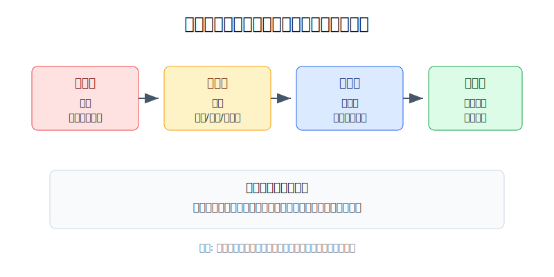
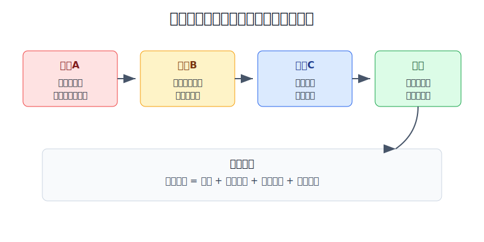
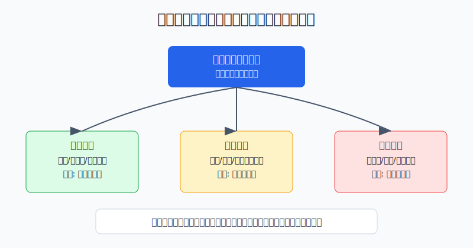

## 散户投资小白金融全品种操盘手册 - 17.4 熊市亏损后如何重建组合
  
### 作者  
digoal  
  
### 日期  
2026-06-08   
  
### 标签  
金融产品 , 金融工具 , 散户 , 投资小白 , 全品操盘手册  
  
----  
  
## 背景 
  

> 适用读者: 已经在熊市里亏过钱、持仓混乱、想补仓又怕继续跌，或者账户里同时有ETF、个股、转债、基金却不知道先处理哪一个的小白投资者。  
> 本文定位: 投资教育框架，不构成个性化投资建议。规则口径按 2026-06-06 可核查公开资料整理。

## 先问一个反直觉的问题

熊市亏损后，最急的事不是“怎么回本”，而是“账户还能不能被你控制”。**如果组合结构已经坏了，急着抄底只是在给错误加仓。**

## 核心概念: 重建组合不是猜底，是恢复可控

熊市像一次体检。牛市里很多问题被上涨盖住: 仓位太重、行业太集中、个股太多、没有现金、喜欢补仓、没有止损。熊市一来，这些问题会同时暴露。账户亏损本身已经难受，更危险的是你开始把所有动作都围绕“回本”展开。

重建组合，不是把每只亏损资产都补到成本价，也不是卖光之后等一个神奇低点。它更像把一间被风暴吹乱的房子重新收拾: 先关窗止水，再把能用的东西、需要修的东西、必须扔的东西分开，最后才考虑添置新东西。

本节行动结论先放在前面: **熊市亏损后按四步走: 第一，停止情绪补仓和加杠杆；第二，把持仓分成核心资产、卫星资产、问题资产；第三，把组合降回最大回撤预算和仓位上限内；第四，只用新增资金或小仓位分批恢复买入。**

## 逻辑推导链

【论证链标题】: 因为熊市会同时放大账户回撤和心理压力，而亏损后的错误补仓会把可控损失变成结构性风险，所以熊市后必须先止血、分类、复位仓位，再用小额分批恢复进攻。

### 第一步: 前提陈述

前提A: 熊市不是普通下跌，而是风险偏好、估值和流动性一起收缩的阶段。这是变量，但一旦发生，影响会很大。小白可以把它理解成: 平时下雨只是鞋湿了，熊市是地面积水、交通堵塞、店铺关门一起出现。

前提B: 深度亏损后，人的目标会从“执行计划”变成“回到成本价”。这是高概率行为偏差。第十六章讲过，亏损会诱发急于翻本，账户越亏，越容易想补仓、加仓、换更刺激的品种。

前提C: 同一个亏损账户里，资产质量不一样。这是常量。宽基ETF亏损，和高估值主题基金亏损，不是一回事；低成本长期核心仓回撤，和逻辑已经变坏的个股被套，也不是一回事。

前提D: 仓位超过承受力后，正确逻辑也会被错误执行毁掉。这是常量。哪怕你买的是好资产，只要仓位大到让你睡不着，你就容易在低位割肉、反弹追高、来回做错。

前提E: 熊市后的恢复通常不是直线。市场会反弹、回落、再反弹，真正底部只有事后才知道。这是常量。用一次满仓抄底去赌最低点，胜率和心理承受力都不适合小白。

### 第二步: 逻辑推导

由A+B可得: 因为熊市会放大亏损，而亏损会把目标改成回本，所以亏损后第一反应通常不可靠。你想买入，不一定是看到了更高胜率，也可能只是想把浮亏尽快抹掉。

由B+C可得: 因为亏损资产质量不同，所以不能用“都跌了很多”作为统一补仓理由。核心宽基跌了，可以按计划定投；问题个股跌了，继续补仓可能只是把单点错误变成组合灾难。

再由C+D可得: 因为资产质量不同、仓位承受力也有限，所以重建组合的核心不是判断明天涨跌，而是把资产放回正确位置: 核心仓保留并控制比例，卫星仓降到上限，问题仓退出或止损。

最后由A+B+C+D+E可得: **熊市亏损后不能直接进入“抄底模式”，而要进入“修复模式”。先停止会扩大风险的动作，再分类持仓，再把仓位压回最大回撤预算内，最后用小额分批恢复买入。**

### 第三步: 正常情景下的操作结论

✅ 正常情景: 你经历了熊市亏损，但没有借钱投资，没有被强平，仍有工资或其他现金流，投资资金不是未来一两年必须使用的钱。

对应操作:

1. 先止血: 停止补仓问题资产，停止加杠杆，停止把ETF亏损转去期权、期货、融资、杠杆ETF里翻本。
2. 再分类: 把所有持仓分为核心资产、卫星资产、问题资产三类。
3. 做复位: 用第十五章的最大回撤预算反推仓位，把权益、行业、个股、转债等高波动资产降回上限内。
4. 留现金: 至少保留能让你不被迫卖出的现金或低波动资产，不能把最后的流动性也拿去补仓。
5. 恢复进攻: 只有组合回到可控区后，才允许用新增资金或小仓位分批买入，且每笔买入都写清失效条件。

### 第四步: 数据和案例证实

证据1: 圣路易斯联储 FRED 的 S&P 500 日度收盘数据来自 S&P Dow Jones Indices。按公开历史数据，S&P 500 在2007年10月9日收于1565.15点，2009年3月9日收于676.53点，从峰值到谷值跌幅约56.8%。这说明即使是美国大盘核心指数，熊市里也会出现足以击穿普通人承受力的回撤。

证据2: 新浪财经2009年1月5日报道称，沪深300指数2008年全年跌幅为65.95%；新浪财经2008年1月11日关于沪深300指数2007年运行分析的报道提到，沪深300在2007年最高触及5891.72点。这个案例说明，A股核心宽基指数同样会经历极深回撤，亏损后靠一次满仓抄底解决问题，并不是稳健方法。

证据3: Barber 和 Odean 2000年《Trading Is Hazardous to Your Wealth》研究1991年至1996年66,465个美国家庭券商账户，发现交易最频繁账户的年化收益约11.4%，同期市场收益约17.9%，平均家庭账户约16.4%。这对应前提B: 亏损后越想靠频繁操作追回来，越容易把交易成本和错误决策叠加到组合上。

证据4: Morningstar 2024年《Mind the Gap》研究截至2023年底的10年基金投资者收益，报告普通投资者每年比所持基金的总收益少约1.1个百分点。这个差距主要来自买卖时点和资金流行为。它验证一个朴素结论: 投资者常常不是输在资产本身，而是输在压力阶段的进出节奏。

历史数据不代表未来会照搬，但它们验证的是稳定规律: 熊市回撤会很深，账户超过承受力后动作容易变形，频繁交易和错误择时会进一步拖累收益。因此，熊市亏损后的第一任务不是证明自己能买到底，而是先把组合拉回可执行的规则里。

### 第五步: 前提变化时的替代结论

若前提A改变，也就是市场已经从恐慌下跌转为流动性改善、估值回到合理区间、成交和风险偏好逐步恢复，推导路径变为: 因为系统性压力下降，所以可以逐步恢复风险资产暴露。新结论: 不满仓抄底，用三到六个月分批买回目标仓位。

若前提B变强，也就是你每天盯着成本价、反复计算“再涨多少回本”、想把亏损品种补到更大仓位，推导路径变为: 因为回本执念已经接管决策，所以所有新增买入暂停。新结论: 先写复盘表，问题仓不补，核心仓也只允许按原定投计划执行。

若前提C显示多数持仓是问题资产，比如高估值主题、基本面变坏个股、低流动性小票、杠杆产品或到期归零工具，推导路径变为: 因为资产本身不再符合长期持有前提，所以等待回本不是策略。新结论: 按仓位和流动性分批退出，把资金转回现金、宽基或低波动工具。

若前提D失效，也就是组合回撤已经超过你事先能承受的最大回撤预算，推导路径变为: 因为账户已经在危险区，所以不能继续加风险。新结论: 先降低权益和高波动资产比例，直到睡眠、现金流和复盘能力恢复。

失败案例: 一个10万元账户，熊市前有7万元权益仓，其中3万元宽基ETF、2万元行业ETF、2万元个股。下跌后账户剩7.2万元，他不分类，直接把剩余现金全部补到亏损最大的个股上，理由是“它跌最多，反弹也最快”。结果个股继续跌30%，账户又亏6000元，现金也没了。失败点不是他没猜到底，而是把问题资产当成最有弹性的机会，把最后的修复资金也交给了最脆弱的仓位。

## 实操例子: 10万元账户亏到7.5万元后怎么重建

这个例子对应论证链的正常结论: **先把组合救回可控区，再用小额分批恢复进攻。**

假设小林原来有10万元投资资金，熊市后账户剩7.5万元。当前持仓是: 宽基ETF 3万元，行业ETF 1.5万元，三只个股合计1.5万元，可转债和现金管理1万元，现金5000元。账面亏损2.5万元，他最想做的动作是把5000元现金全补到亏损最大的个股上。

第一步，先止血。小林把“回本”从目标里拿掉，改成“组合重新可控”。当天不补仓、不加杠杆、不买期权、不买期货、不把现金打光。这个动作对应前提A和B: 熊市加亏损会扭曲判断，所以先降低动作速度。

第二步，给持仓分类。宽基ETF费率低、分散度高、仍是长期核心资产，归为核心资产。行业ETF仍有长期逻辑，但波动大、估值和趋势都弱，归为卫星资产。三只个股里，一只有稳定现金流且买入逻辑未坏，归为卫星资产；另外两只业绩下修、负债上升、流动性变差，归为问题资产。可转债和现金管理归为防守资产。

第三步，设重建后的目标比例。小林承认自己最多只能承受组合再跌15%，所以把权益和高波动资产上限降到45%。以7.5万元账户计算，高波动资产上限约3.4万元。他现在宽基3万元、行业1.5万元、个股1.5万元，合计6万元，明显超过承受力。

第四步，先减问题仓。两只问题个股合计1万元，小林不再等回本，分两次退出: 第一周卖出一半，第二周若基本面没有改善，卖出剩余。这样做不是因为他确定它们不会反弹，而是因为问题仓不该继续占用修复资金。这个动作对应前提C: 资产质量不同，处理方式不同。

第五步，卫星仓降到上限。行业ETF从1.5万元降到8000元，留下观察仓；那只逻辑未坏的个股从5000元降到3000元，只当学习仓。宽基ETF保持3万元，但暂停额外补仓一个月，只按固定日期小额定投。这样组合的高波动资产降到约4.1万元，仍偏高，但已经从80%降到55%左右，下一步用新增收入继续修复。

第六步，恢复现金和防守资产。小林把卖出资金中的70%放回货币基金、短债或现金管理，30%留作未来三个月分批买入宽基ETF的计划资金。买入规则写清楚: 每月固定买一次；若组合回撤再次接近预算80%，暂停新增权益；若市场急涨导致权益仓位超过目标，也不追。

如果前提不成立，动作要切换。若小林未来一年要用钱买房，权益仓位不应该是45%，而应明显更低；若他现金流很强、核心资产占比高、没有问题仓，可以不急着卖核心宽基，只按再平衡恢复目标比例；若他已经用了融资或杠杆工具，第一动作不是分类，而是先降杠杆，防止被动平仓。

如果操作错误，后果很清楚。小林若把5000元现金补到问题个股，短期反弹也许让他舒服几天，但组合结构没有变: 权益仓过高、问题仓仍在、现金太少、回撤预算被突破。只要市场再跌一轮，他会从“想回本”变成“被迫卖出”。重建组合的目标，是让他下一次下跌还能按计划行动。

## 可复用框架

【三仓分拣】

适用前提: 你在熊市后有多只亏损持仓，分不清哪些该留、哪些该减、哪些该卖。

核心逻辑: 因为亏损资产质量不同，所以先分类再动作，不能只按亏损幅度决定补仓顺序。

操作步骤:

1. 核心资产: 宽基ETF、低成本指数基金、长期配置资产，买入逻辑未坏，处理方式是保留、定投或再平衡。
2. 卫星资产: 行业ETF、主题基金、单只好公司、转债组合，处理方式是降到仓位上限内。
3. 问题资产: 逻辑破坏、杠杆过高、流动性差、基本面恶化、规则不懂的品种，处理方式是退出或止损。

前提失效时: 如果你无法判断一项资产属于哪类，先按卫星资产处理，仓位降到小到不会影响睡眠；不要因为看不懂就默认长期持有。

举一反三: 这个框架可以用于A股、港股、美股、QDII、可转债、黄金和REITs组合。亏损幅度不是分类标准，资产角色和买入前提才是分类标准。

【四步重建】

适用前提: 你的组合已经经历明显回撤，但账户没有爆仓，仍有时间和现金流修复。

核心逻辑: 因为熊市后的恢复不是直线，而亏损后判断容易变形，所以先恢复控制权，再恢复进攻。

操作步骤:

1. 止血: 停止情绪补仓、加杠杆、换高风险品种翻本。
2. 分类: 核心、卫星、问题三类写清楚，每类给出动作。
3. 复位: 用最大回撤预算反推仓位，把高波动资产降回上限内。
4. 分批: 只用新增资金或小仓位恢复买入，三到六个月完成，不赌最低点。

前提失效时: 如果市场和账户继续恶化，分批买入暂停，先提高现金和低波动资产比例；如果基本面和流动性已经改善，仍按计划分批，不一次性满仓。

举一反三: 这个框架也适用于牛市末期回撤、行业踩雷、海外资产大跌、QDII高溢价回落后的组合修复。

## 本节行动清单

| 动作 | 合格标准 |
|---|---|
| 停止翻本动作 | 不补问题仓、不加杠杆、不升级到期权期货等高风险工具 |
| 列出全部持仓 | 写清名称、成本、现值、仓位、亏损、买入理由 |
| 做三仓分类 | 每个持仓标成核心、卫星、问题三类之一 |
| 重新写回撤预算 | 用当前账户金额计算还能承受多少亏损 |
| 降低问题仓 | 逻辑破坏的品种不等回本，按计划退出或止损 |
| 恢复现金缓冲 | 留出不会被迫卖出的现金或低波动资产 |
| 分批恢复买入 | 只在组合回到上限内后，用新增资金或小仓位执行 |

## 一句话总结

熊市亏损后的正确顺序是: 先止血，再分类，再把仓位拉回承受力以内，最后才小额分批恢复买入；能重建系统的人，才有资格等下一轮机会。

## 参考资料

- Federal Reserve Bank of St. Louis: S&P 500 (SP500), source: S&P Dow Jones Indices LLC, daily close，https://fred.stlouisfed.org/series/SP500
- Advisor Perspectives: S&P 500 Snapshot，提到2007年10月9日S&P 500收于1565.15、2009年3月9日收于676.53，https://www.advisorperspectives.com/dshort/updates/2026/01/16/s-p-500-snapshot-index-retreats-from-record-high
- 新浪财经: 《沪深300指数2007年运行分析报告》，2008年1月11日，https://finance.sina.com.cn/money/future/20080111/09254394017.shtml
- 新浪财经: 《沪深300指数年跌幅达66%》，2009年1月5日，https://finance.sina.com.cn/roll/20090105/04052606692.shtml
- Brad M. Barber and Terrance Odean: Trading Is Hazardous to Your Wealth: The Common Stock Investment Performance of Individual Investors, Journal of Finance, 2000，https://papers.ssrn.com/sol3/papers.cfm?abstract_id=219228
- Morningstar: Mind the Gap 2024，关于基金投资者收益与基金总收益之间的差距，https://www.morningstar.com/lp/mind-the-gap

> ⚠️ **声明**：本文内容为投资教育目的，所有历史数据、策略框架均为辅助学习工具，不构成证券投资建议。市场有风险，投资需谨慎。实际操作请结合自身风险承受能力，必要时咨询专业投顾。
  
#### [PostgreSQL 解决方案集合](../201706/20170601_02.md "40cff096e9ed7122c512b35d8561d9c8")
  
  
#### [德哥 / digoal's Github - 公益是一辈子的事.](https://github.com/digoal/blog/blob/master/README.md "22709685feb7cab07d30f30387f0a9ae")
  
  
#### [About 德哥](https://github.com/digoal/blog/blob/master/me/readme.md "a37735981e7704886ffd590565582dd0")
  
  

  
