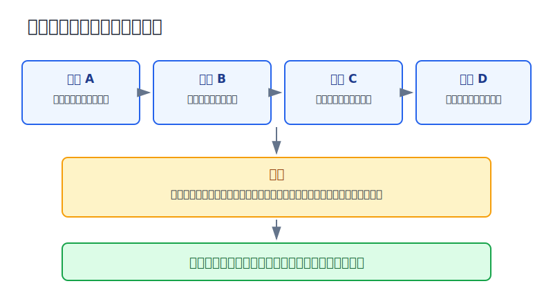
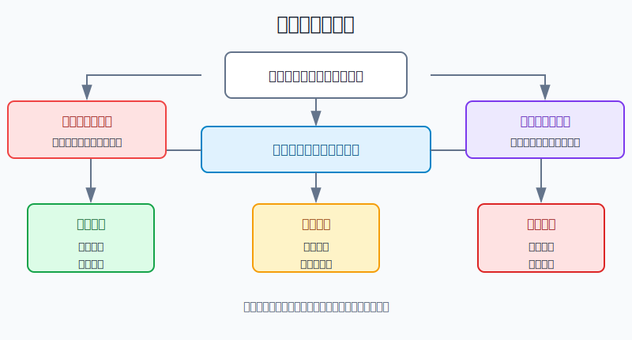
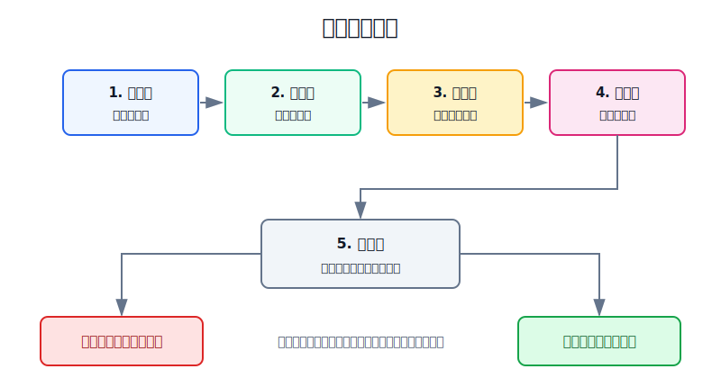

## 散户投资小白金融全品种操盘手册 - 17.5 震荡市如何减少无效交易
  
### 作者  
digoal  
  
### 日期  
2026-06-07   
  
### 标签  
金融产品 , 金融工具 , 散户 , 投资小白 , 全品操盘手册  
  
----  
  
## 背景 
  

> 适用读者: 已经经历过“追上去就回落、割下来又反弹”，在震荡市里越做越累的小白投资者。  
> 本文定位: 投资教育框架，不构成个性化投资建议。数据和规则口径按 2026-06-06 可核查公开资料整理。

## 先问一个反直觉的问题

震荡市最折磨人的地方，不是完全没有机会，而是机会看起来每天都有。上午突破，下午回落；今天利好，明天熄火；你越想把每一段波动都抓住，账户越容易被手续费、买卖价差、滑点和错误判断慢慢磨掉。

**震荡市的第一策略，不是提高交易技巧，而是减少没有规则的交易次数。**

## 核心概念: 无效交易不是亏钱交易，而是没有优势的交易

很多小白会把“亏了”叫无效交易，把“赚了”叫有效交易。这个分法太粗。

本节说的无效交易，是指下单前没有明确优势的交易。它有四个特征: 没有环境判断，没有位置边界，没有触发条件，没有退出规则。赚钱也可能是运气，亏钱则很难复盘。

震荡市像人在走廊里来回走。趋势市像人从一楼往十楼爬，方向比较明确；震荡市则是在三楼到五楼之间来回绕。你若每看到他抬脚就冲进去，很容易在三楼买、五楼加仓、四楼止损、三楼又追空。最后不是方向错一次，而是来回被打。

所以本节行动结论先放在前面: **震荡市只做三类动作: 核心仓按原计划持有或再平衡；主动仓降到总账户10%-20%以内；主动交易只在“区间边界 + 触发信号 + 退出规则”同时满足时做。中间位置不交易，连续两次假突破后暂停同策略一周。**

## 逻辑推导链

【论证链标题】: 因为震荡市方向优势弱，而交易成本、心理误判和仓位压力确定存在，所以散户要把交易从“看到波动就出手”改成“等边界、等触发、用小仓、能退出”。

### 第一步: 前提陈述

前提A: 震荡市的价格主要在区间里来回摆动。这是变量。它可能维持几周，也可能被放量突破或跌破打破。对小白来说，判断震荡市不是预测顶部和底部，而是承认当下没有清晰单边趋势。

前提B: 频繁进出一定有成本。这是常量。成本不只是佣金，还包括买卖价差、成交滑点、基金申赎费用、跨境ETF溢价、税费、盯盘时间和下错单后的心理消耗。它像过桥费，桥不一定通向利润，但费用先收。

前提C: 震荡市里噪音会伪装成信号。这是常量。一次上涨可能只是反弹，不是新趋势；一次下跌可能只是回踩，不是破位。小白最容易把“价格动了”误认为“机会来了”。

前提D: 仓位越大，越容易把判断变成证明自己。这是常量。轻仓时你能承认错了，重仓时你会开始找理由: “再等等”“马上反弹”“这次不一样”。震荡市最怕的不是试错，而是用大仓位反复试错。

### 第二步: 逻辑推导

由A可得: 因为价格在区间内来回摆动，所以中间位置的方向胜率最不清楚。你在区间中间追涨，离上沿近，安全垫薄；你在区间中间杀跌，离下沿近，也容易割在反弹前。

由A+B可得: 因为方向优势不明显，而每次交易都有成本，所以频繁交易需要很高的命中率才能抵消摩擦。普通散户没有稳定短线优势时，交易次数越多，越像用账户给市场交学费。

再由B+C可得: 因为噪音很多、成本确定，所以不能用“有波动”作为买卖理由。正确做法是提前写触发条件: 接近区间下沿才考虑小仓买入，接近区间上沿才考虑减仓；若放量突破并站稳，再从震荡规则切换为趋势规则。

最后由A+B+C+D可得: **震荡市减少无效交易的核心，不是完全不动，而是把主动交易压缩到少数有边界、有触发、有退出的动作里。**

### 第三步: 正常情景下的操作结论

✅ 正常情景: 市场没有明确单边趋势，主要指数或你关注的ETF在一个区间内反复波动；你没有职业级短线系统；资金里既有长期核心仓，也有想主动操作的仓位。

对应操作:

| 账户部分 | 震荡市动作 | 规则 |
|---|---|---|
| 核心仓 | 少动 | 宽基ETF、债券、现金、黄金等按原计划持有或再平衡，不因一天涨跌频繁换 |
| 卫星仓 | 控制 | 行业ETF、主题ETF、个股等合计不超过总账户20%-30%，单一方向更低 |
| 主动交易仓 | 降频 | 控制在总账户10%-20%以内，只在边界触发时交易 |
| 试错仓 | 更小 | 单笔不超过总账户2%-5%，连续两次假突破后暂停同策略一周 |

这里的关键不是“永远不交易”，而是把下单资格变窄。中间位置没有优势，不交易；没有退出规则，不交易；已经连续两次被假突破打脸，不交易；仓位超过上限，不交易。

### 第四步: 数据和案例证实

证据1: Barber 和 Odean 2000年《Trading Is Hazardous to Your Wealth》研究1991年至1996年66,465个美国家庭券商账户，发现交易最频繁的一组账户年化收益约11.4%，同期市场收益约17.9%，平均家庭账户约16.4%。这个证据对应前提B: 交易多不等于收益高，频繁进出会被成本和错误择时拖累。

证据2: Barber、Lee、Liu 和 Odean 2009年研究台湾市场1992年至2006年的完整交易数据，估算个人投资者因主动交易每年损失约2.2个百分点，且散户总亏损大约等于机构总盈利。这个证据对应前提B和C: 当很多人同时在短线波动里抢优势，缺少系统优势的一方通常支付成本。

证据3: Morningstar 2024年《Mind the Gap》研究显示，截至2023年底的10年期内，基金投资者实际拿到的年化收益比基金自身总回报低约1.1个百分点；报告把差距归因于资金流入流出的时点选择。这个证据对应前提C: 买卖时点的冲动会让投资者少拿到底层资产本身的收益。

证据4: SEC 的 ETF 投资者公告提醒，ETF 可以像股票一样交易，但投资者买卖时面对的是市场价格，可能与净值不同，还会受到买卖价差影响。这个证据对应前提B: 哪怕工具是ETF，短线频繁进出也不是零成本。

失败案例: 小林拿10万元账户做震荡市交易，核心仓原本6万元，现金2万元，主动仓2万元。某行业ETF在1.00元到1.12元之间震荡。他第一次在1.09元追入8000元，跌到1.04元止损；第二次看到放量突破1.12元，又买入1万元，第二天跌回1.08元；第三次他觉得“跌多了该反弹”，在1.07元加到1.8万元，结果跌破1.00元。他的错误不是每次方向都错，而是三次都没有遵守边界: 第一次在区间上半段追，第二次突破没有等确认，第三次仓位超过主动仓纪律。

历史数据不代表未来。上面证据仍有参考价值，是因为它们证明的是结构规律: 频繁交易有摩擦，择时冲动会拖累收益，短线噪音很容易被误读。震荡市正是这些问题集中出现的环境。

### 第五步: 前提变化时的替代结论

若前提A改变，也就是指数或ETF放量突破区间上沿，并且连续2-3个交易日没有跌回区间，推导路径变为: 因为价格不再只是区间内波动，趋势前提开始出现，所以不能继续用“上沿必减”的震荡规则。新结论: 从震荡规则切到趋势规则，允许小仓顺势加仓，但仍要写回落失效条件。

若前提A向下改变，也就是价格跌破区间下沿，并且反抽无力，推导路径变为: 因为下沿支撑失效，低吸前提不存在，所以不能继续按震荡低吸补仓。新结论: 先降主动仓，等重新站回区间或形成新底部再评估。

若前提B恶化，也就是买卖价差扩大、成交量萎缩、跨境ETF溢价升高，推导路径变为: 因为交易成本变高，所以即便接近边界，也要降低交易频率和仓位。新结论: 只允许处理已有仓位，不新增主动交易。

若前提D恶化，也就是你已经因为连续亏损想翻本，推导路径变为: 因为仓位和情绪开始互相放大，所以交易资格暂停。新结论: 主动仓暂停48小时，按第16章第十一节的停手规则复盘。

反例: 震荡市减少交易，不等于所有下跌都不买。如果你做的是长期宽基ETF定投，资金期限5年以上，仓位未超上限，买入来自月度计划而不是临时冲动，那么这不是无效交易。真正要减少的是没有边界、没有触发、没有退出的临时交易。

## 实操例子: 10万元账户在震荡市怎么少做错

这个例子对应论证链的正常结论: **主动仓降频，只在区间边界和触发条件同时满足时交易。**

假设小林有10万元投资资金: 5万元宽基ETF核心仓，1.5万元债券和货币基金，1万元黄金ETF，1.5万元行业ETF卫星仓，1万元主动交易仓。最近一个月，沪深300相关ETF大致在3.70元到4.05元之间来回波动，成交量没有明显放大，均线也缠在一起。小林把这个环境定义为震荡市。

第一步，先写区间，而不是先猜方向。小林把3.70元附近定义为观察下沿，把4.05元附近定义为观察上沿，中间3.85元到3.95元不做主动交易。这个动作对应前提A: 中间位置方向优势最弱。

第二步，写触发条件。接近3.75元以下时，不是立刻满仓买，而是等两个条件: 当天没有继续放量下跌；第二天能站回3.75元上方。两个条件满足，才允许用3000元试错。这个动作对应前提C: 价格动了不等于信号成立。

第三步，写退出规则。若买入后跌破3.68元并且收不回，试错仓退出；若反弹到3.98元以上，减掉一半；到4.05元附近不再加仓。这个动作对应前提B和D: 先规定怎么离场，避免亏了硬扛、涨了贪心。

第四步，限制次数。小林规定一周最多做两笔主动交易；连续两次买入后都被止损，暂停同一策略一周。这个动作对应前提B: 震荡市里最贵的不是一次错，而是连续小错。

如果前提切换，操作也要切换。比如ETF放量突破4.05元，并连续3天站稳，小林不能继续在4.05元机械减仓；他要把震荡规则切换成趋势跟踪规则，用更小的回踩确认仓参与。反过来，如果跌破3.70元并连续收不回，他也不能继续按“到了下沿就低吸”，因为原来的下沿已经失效。

如果小林不按规则，后果很容易量化。假设他在区间中间3.92元买入1.5万元，跌到3.75元割肉，亏损约650元；随后4.05元追突破又买1.5万元，跌回3.90元，亏损约555元。两次合计亏1200元，看起来不大，但若一周重复三轮，就是总账户3%以上的损耗。震荡市就是这样把“小亏无所谓”磨成“大亏很难受”。

## 可复用框架

【边界交易】

适用前提: 市场或持仓品种处于可识别区间，成交和消息没有显示趋势已经明显突破。

核心逻辑: 因为震荡市中间位置没有方向优势，所以只在接近边界且触发信号成立时小仓试错。

操作步骤:

1. 先写区间: 最近1-3个月的上沿、下沿和中间禁区。
2. 再写触发: 靠近下沿要有止跌或重新站回信号，靠近上沿要有减仓或不追信号。
3. 最后写退出: 破下沿怎么止损，到上沿怎么减仓，突破站稳怎么切换趋势规则。

前提失效时: 如果放量突破并站稳，边界交易失效，切到趋势规则；如果跌破下沿并确认，低吸规则失效，先做风控。

举一反三: 这个框架可以用于宽基ETF、行业ETF、可转债组合、黄金ETF和高股息ETF，但不适合流动性很差、价差很大的小品种。

【五门下单】

适用前提: 你想在震荡市做主动交易，但不想每天被波动牵着走。

核心逻辑: 因为无效交易来自没有优势的冲动，所以每笔交易必须通过环境、位置、触发、仓位、退出五道门。

操作步骤:

1. 环境门: 现在是震荡、趋势，还是看不懂。
2. 位置门: 当前价格在区间下沿、上沿，还是中间。
3. 触发门: 是否有事先写好的确认信号。
4. 仓位门: 单笔是否低于总账户2%-5%，主动仓是否低于总账户10%-20%。
5. 退出门: 错了卖哪里，赚了减哪里，前提变了怎么切换。

前提失效时: 任一门不合格，不是“再想想”，而是直接不交易；连续两次假突破，暂停同策略一周。

举一反三: 这个框架也适用于牛市踏空焦虑、熊市补仓、财报后追涨、跨境ETF高溢价和可转债低价诱惑。

## 本节行动清单

| 动作 | 合格标准 |
|---|---|
| 定义震荡区间 | 写出上沿、下沿、中间禁区，不用模糊感觉下单 |
| 降低主动仓 | 主动交易仓控制在总账户10%-20%以内 |
| 中间位置不交易 | 不在区间中间追涨杀跌，只观察和复盘 |
| 边界才试错 | 接近边界且触发信号成立，单笔2%-5%小仓 |
| 先写退出 | 买入前写好破位止损、上沿减仓、突破切换 |
| 限制频率 | 一周最多两笔主动交易，连续两次假突破暂停一周 |
| 复盘无效交易 | 每周统计没有通过五道门却下单的次数 |

## 一句话总结

震荡市的胜负，不在于你能不能抓住每一次波动，而在于你能不能让大多数没有边界、没有触发、没有退出的交易死在下单前。

## 参考资料

- Brad M. Barber and Terrance Odean: Trading Is Hazardous to Your Wealth: The Common Stock Investment Performance of Individual Investors, Journal of Finance, 2000, https://papers.ssrn.com/sol3/papers.cfm?abstract_id=219228
- Brad M. Barber, Yi-Tsung Lee, Yu-Jane Liu and Terrance Odean: Just How Much Do Individual Investors Lose by Trading?, Review of Financial Studies, 2009, https://academic.oup.com/rfs/article-abstract/22/2/609/1592901
- Morningstar: Mind the Gap 2024, https://www.morningstar.com/content/cs-assets/v3/assets/blt9415ea4cc4157833/bltebc45c862e642793/6759e563cbd7d6cef415ac94/Mind_the_Gap_2024.pdf
- SEC Investor.gov: Updated Investor Bulletin: Exchange-Traded Funds, https://www.investor.gov/introduction-investing/general-resources/news-alerts/alerts-bulletins/investor-bulletins-24
- FINRA: Frequent Intraday Trading: Understanding the Basics, https://www.finra.org/investors/insights/frequent-intraday-trading

> ⚠️ **声明**：本文内容为投资教育目的，所有历史数据、策略框架均为辅助学习工具，不构成证券投资建议。市场有风险，投资需谨慎。实际操作请结合自身风险承受能力，必要时咨询专业投顾。
  
#### [PostgreSQL 解决方案集合](../201706/20170601_02.md "40cff096e9ed7122c512b35d8561d9c8")
  
  
#### [德哥 / digoal's Github - 公益是一辈子的事.](https://github.com/digoal/blog/blob/master/README.md "22709685feb7cab07d30f30387f0a9ae")
  
  
#### [About 德哥](https://github.com/digoal/blog/blob/master/me/readme.md "a37735981e7704886ffd590565582dd0")
  
  

  
