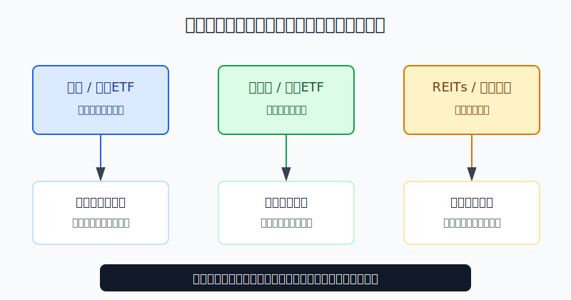
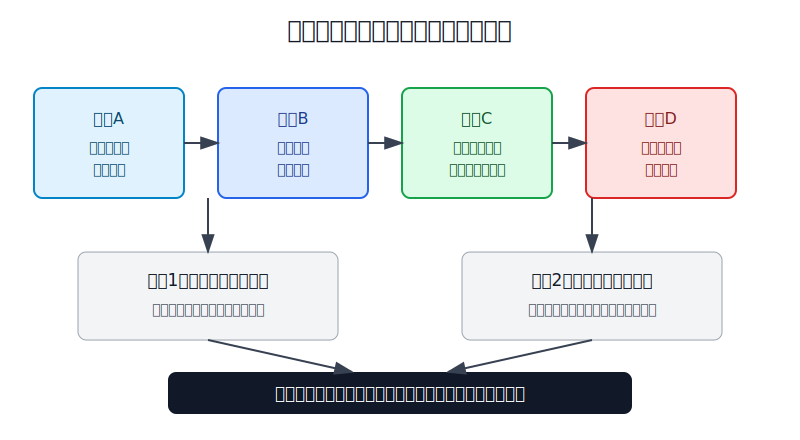
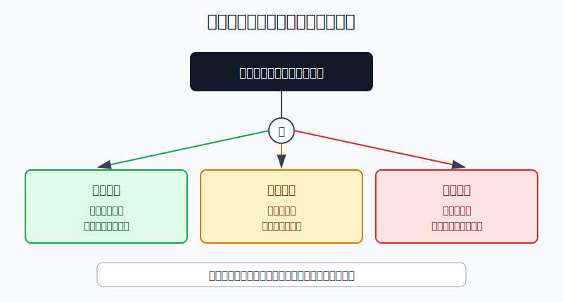
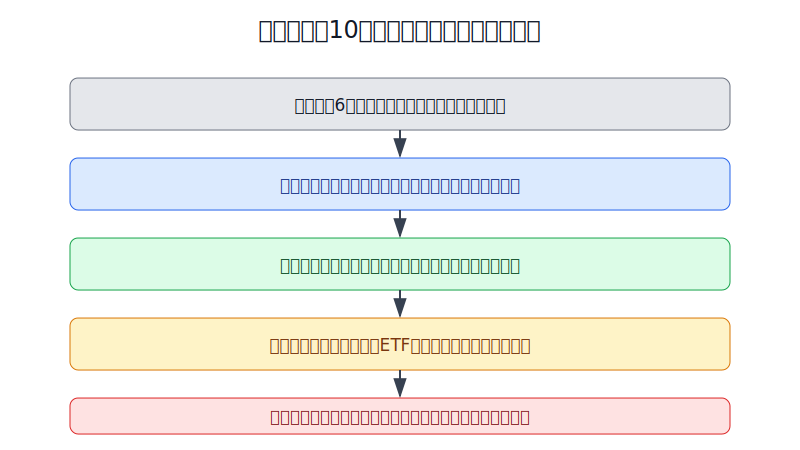

## 散户投资小白金融全品种操盘手册 - 17.6 利率下行周期如何配置债券和高股息
  
### 作者  
digoal  
  
### 日期  
2026-06-07   
  
### 标签  
金融产品 , 金融工具 , 散户 , 投资小白 , 全品操盘手册  
  
----  
  
## 背景 
  

> 适用读者: 已经知道债券、债券ETF、红利ETF和REITs这些工具，但一听到“降息”“利率下行”就想把低风险资金全部挪过去的小白投资者。  
> 本文定位: 场景实战手册，不构成个性化投资建议。

## 先问一个反直觉的问题

利率下行时，最危险的动作不是错过债券上涨，而是把“债券可能涨”和“高股息看起来香”混成一句话: 低利率来了，买高息资产。真正的操作顺序应该反过来: **先问这笔钱多久不用，再问资产靠什么赚钱，最后才决定买多少。**

## 核心概念: 利率下行是一阵顺风，不是安全带

利率可以理解为“钱的租金”。租金下降时，老债券原来约定的利息变得更值钱，所以债券价格容易受益。这个逻辑对债券最直接，尤其对中长久期债券更明显。久期可以简单理解为债券价格对利率变化的敏感度，久期越长，利率变化时价格反应越大。

高股息资产不一样。红利ETF、高股息股票、REITs赚的是企业或基础设施的现金流，利率下行会让市场更愿意寻找现金流，也会降低部分企业融资压力，但它们本质上仍是权益类或准权益类资产。分红会变，股价会跌，REITs的底层项目也会经营不达预期。

本节行动结论先放前面: **利率下行周期里，小白可以提高债券和现金流资产的关注度，但不能把它们当存款替代。短钱仍放现金和短债；防守仓以中短久期债券为主；长久期债券只做小比例弹性仓；高股息和REITs必须通过现金流质量检查，仓位不能挤占核心宽基和备用金。**

## 逻辑推导链

【论证链标题】: 因为利率下行会同时改变债券价格和现金流资产估值，但二者风险来源不同，所以配置要按“期限、久期、现金流质量”三步走。

── 第一步: 前提陈述

前提A: 债券价格和市场利率大多反向运动。这是常量。SEC Investor.gov 对债券利率风险的解释很直接: 市场利率上升时，固定利率债券价格会下降；反过来，市场利率下降时，老债券价格会上升。用生活比喻讲，就是新店租金降了，旧合同里锁定高租金收入的铺位就更值钱。

前提B: 久期越长，债券价格对利率越敏感。这是常量。短债像短途车，路上颠一下影响有限；长债像高速车，方向盘动一点，车身反应就大。所以利率下行时，长债弹性更大；利率重新上行时，长债伤害也更大。

前提C: 低利率会提高市场对稳定现金流的需求。这是变量。存款、货币基金和短债收益下降后，投资者容易去找红利ETF、REITs和高股息股票。但这些资产的“息”不是债券票息，更不是银行存款利息，而是企业利润或项目经营现金流的分配。

前提D: 现金流质量会变化。这是变量。高股息公司可能因为利润下滑、负债上升而减少分红；REITs可能因为出租率、收费量、运维成本、剩余期限变化而影响可供分配金额。也就是说，利率下行只能给估值提供顺风，不能替底层经营背书。

── 第二步: 逻辑推导

由A+B可得: 因为债券价格和利率反向运动，而久期决定反应强度，所以利率下行周期里，债券仓不是简单“买债”，而是按久期分层: 短债负责低波动，中短债负责防守，长债负责小比例弹性。

再由A+B+C可得: 因为短端收益下降会让人追逐更高票息，所以小白最容易把长债、红利ETF、REITs都当“高息替代品”。这一步必须拦住: 只要价格会波动、分红不保证，它就不是活钱工具。

再由C+D可得: 因为高股息资产的核心是现金流质量，所以利率下行只能让它进入候选清单，不能直接成为买入理由。现金流覆盖分红、负债压力可控、估值没有被追高，三项都合格，才允许进入卫星仓。

最后可得核心结论: **利率下行时，真正的配置动作不是“全买高息”，而是“短钱不动，防守仓适度加中短债，弹性仓小比例加长债，收益型卫星仓只买现金流合格的红利ETF或REITs”。**

── 第三步: 正常情景下的操作结论

✅ 正常情景: 你已经留好6个月生活费，投资资金三年以上不用；宏观环境是贷款利率、国债收益率或政策利率处在下行或低位区间；你的目标是降低组合波动并获得一点现金流，不是靠债券或高股息短线暴富。

对应操作: 先保留现金和短债层，再把防守仓放在中短久期债券工具上；只有利率继续下行证据明确时，才拿小仓位买长久期债券ETF或债券基金；高股息优先用分散的红利ETF，不直接重仓单只高股息股票；REITs只在理解底层资产、分派率和二级市场波动后小比例配置。

── 第四步: 数据和案例证实

证据1: 债券价格和利率反向，是固定收益的基础规则。SEC Investor.gov 的利率风险投资者公告说明，市场利率上升会压低固定利率债券价格；FINRA 的债券投资者教育也提示，利率上升时债券价格通常下降，反之亦然。这个证据对应前提A。

证据2: 2022年是长久期失败案例。BlackRock/iShares 资料显示，iShares 20+ Year Treasury Bond ETF（TLT）2022年按NAV计算年度回报约为-31.41%；同一年，美联储快速加息，联邦基金目标区间从2022年3月的0%-0.25%一路升到2023年7月的5.25%-5.50%。这验证前提B: 长久期不是低风险现金替代，利率方向反了，回撤会很大。

证据3: 中国低利率环境确实已经改变了资产收益比较。中国人民银行发布的2025年金融市场运行情况显示，2025年末10年期国债收益率为1.85%，债券市场托管余额为196.7万亿元；2024年12月，路透社曾报道中国10年期国债收益率跌破2%，为2002年以来低位。这个证据说明: 低利率不是口号，它会真实改变存款、债券和现金流资产之间的吸引力。

证据4: 高股息和REITs不能当保本收益。中证指数公司对中证红利指数的说明是，指数选取现金股息率高、分红较稳定且有一定规模和流动性的100只证券，但这只是筛选标准，不是收益承诺。中国投资者网的REITs投教材料也提醒，公募REITs招募说明书披露的现金分派率是预期值，不刚兑不保底。这个证据对应前提C+D: 高息看起来诱人，但底层现金流仍要经受经营和市场价格检验。

失败案例: 2022年的长债回撤说明，利率上行会让“债券防守”失效；高股息公司的分红下调则说明，“股息率高”可能只是股价先跌出来的数字。历史不代表未来，但这两个反例证明同一件事: **任何收益型资产，一旦底层前提变了，就不能继续按原来的利率下行剧本操作。**

── 第五步: 前提变化时的替代结论

若前提A改变，也就是利率从下行转为重新上行，推导路径变为: 因为债券价格会承压，而长久期反应最大，所以长债从弹性来源变成回撤来源。新结论: 先降低长久期仓位，回到短债和现金管理；等利率上行压力稳定后再评估。

若前提C改变，也就是市场已经把红利ETF、REITs追到高估值，推导路径变为: 因为分红没有变多，只是买入价格变贵，所以未来实际收益率下降。新结论: 不追涨，把新增资金留在短债或现金层，等待估值和分派率重新匹配。

若前提D改变，也就是公司利润下降、REITs出租率或收费量下降，推导路径变为: 因为现金流质量变差，所以高股息不再是防守理由，而是风险信号。新结论: 已有持仓减到观察仓，单只高股息股票不补仓，优先用分散ETF替代。

## 实操例子: 10万元资金怎么配置

这个例子对应论证链的正常结论: **短钱不动，债券按久期分层，高股息按现金流质量过滤。**

假设小林有10万元可投资资金，生活备用金已经单独留好，未来三年没有确定大额支出。他原来的组合是: 5万元宽基ETF，2万元现金和货币基金，1万元短债基金，2万元行业ETF。现在他看到新闻说利率处在下行周期，想配置债券和高股息。

第一步，先确认不能动的钱。2万元现金和货币基金继续保留，不因为利率低就全部挪走。这对应前提C: 收益下降会诱导追高息，但短钱的任务是随时可用，不是追收益。

第二步，调整防守仓。小林把原来的1万元短债基金增加到2万元，其中1.5万元放短债或中短债，5000元作为中久期观察仓。这个动作对应前提A+B: 利率下行对债券有利，但防守仓不能让久期过长。

第三步，开一个小比例弹性仓。如果未来国债收益率继续下行，且债券基金净值没有大幅脱离预期，小林最多用5000元买入中长久期债券基金或债券ETF，分两次买，每次2500元。这个仓位的任务是吃利率下行的价格弹性，不是现金替代。

第四步，处理高股息。小林不直接买单只高股息股票，而是先用5000元红利ETF观察仓替代。买入前写三条: 指数分散度是否够，前十大权重是否过度集中，股息率是否来自稳定分红而不是股价暴跌。若选择REITs，也只用3000-5000元观察仓，并写清底层项目、分派率、剩余期限和二级市场溢价。

第五步，写退出条件。如果10年期国债收益率连续上行、债券基金净值明显回撤，小林先减中长久期观察仓；如果红利ETF上涨后股息率被压低，停止加仓；如果某只高股息股票或REITs披露的现金流不达预期，不补仓，先降到观察仓。

如果小林操作错误，最常见的后果是把“利率下行配置”做成“高息资产满仓”。一旦利率反向、红利估值过热、底层现金流变差，债券和高股息可能一起回撤。纠偏方法不是猜底，而是回到三句话: 这笔钱多久不用？这只资产靠什么赚钱？前提失效时我先减哪一层？

## 可复用框架

【三层利率仓】

适用前提: 利率处在下行或低位区间，你想配置债券和收益型资产，但不想把账户做成单一押注。

核心逻辑: 因为利率下行先影响债券价格，再影响现金流资产估值，所以组合必须按资金期限和风险来源分层。

操作步骤:

1. 现金层: 一年内要用的钱，只放现金管理、货币基金、超短债或短债。
2. 防守层: 三年以上不用的钱，可以配置短债和中短债，承担有限久期。
3. 弹性层: 只用小仓位参与长债、红利ETF、REITs，必须写清买入前提和退出线。

前提失效时: 利率上行先砍长久期；现金流变差先砍高股息和REITs；资金期限缩短时，所有弹性仓都要让位给现金层。

举一反三: 这个框架也适用于黄金、商品和海外债券。任何资产只要被你拿来做“场景判断”，就要先定义它是现金层、防守层还是弹性层。

【高息三问】

适用前提: 你看到红利ETF、高股息股票或REITs的分派率很高，想把它加入组合。

核心逻辑: 因为高息可能来自真实现金流，也可能来自价格下跌后的数字幻觉，所以先验质量，再谈收益。

操作步骤:

1. 问来源: 分红来自经营现金流，还是靠举债、卖资产、一次性收益？
2. 问价格: 当前股息率高，是因为分红稳定，还是因为价格已经大跌？
3. 问分散: 能不能用ETF替代单只个股，避免一个公司或一个项目决定账户命运？

前提失效时: 现金流覆盖不住分红，不买；负债压力上升，不加仓；价格涨到分派率明显下降，停止追买。

举一反三: 以后看银行股、能源股、REITs、优先股基金和高收益债，都先问这三句，不被“高息”两个字牵着走。

## 本节行动清单

| 动作 | 合格标准 |
|---|---|
| 分清资金期限 | 一年内要用的钱不买中长债、高股息或REITs |
| 分清债券久期 | 短债防守，中短债平衡，长债只做小比例弹性 |
| 识别利率方向 | 利率下行才加久期，利率重新上行先降久期 |
| 检查高股息质量 | 现金流覆盖、负债可控、估值不过热 |
| 控制收益型仓位 | 红利ETF和REITs是卫星仓，不替代核心仓和现金层 |
| 写退出条件 | 利率反向、现金流变差、资金期限缩短，立即降风险 |

## 一句话总结

利率下行周期的正确姿势不是满仓高息资产，而是用久期吃债券顺风，用现金流质量过滤高股息，再用仓位上限防止一个判断毁掉整个组合。

## 参考资料

- SEC Investor.gov: Investor Bulletin: Interest Rate Risk, https://www.sec.gov/files/ib_interestraterisk.pdf
- FINRA: Bonds, https://www.finra.org/investors/investing/investment-products/bonds
- SEC Investor.gov: Bond Funds and Income Funds, https://www.investor.gov/additional-resources/general-resources/glossary/bond-funds-income-funds
- BlackRock/iShares: iShares 20+ Year Treasury Bond ETF (TLT), 2026年访问, https://www.blackrock.com/us/individual/products/239454/ishares-20-year-treasury-bond-etf
- Federal Reserve: FOMC statement, 2022年3月16日, https://www.federalreserve.gov/newsevents/pressreleases/monetary20220316a.htm
- Federal Reserve: FOMC statement, 2023年7月26日, https://www.federalreserve.gov/newsevents/pressreleases/monetary20230726a.htm
- 中国人民银行: 2025年金融市场运行情况, 2026年2月发布, 上海市地方金融管理局转载页, https://jrj.sh.gov.cn/SCGK194/20260212/4b38eeb3671641f69fb860a0cb7adee5.html
- Reuters/TradingView: China 10-year govt bond yield drops below 2%, 2024年12月, https://www.tradingview.com/news/reuters.com%2C2024%3Anewsml_P8N3KK02L%3A0-china-10-year-govt-bond-yield-drops-below-2-lowest-in-22-years/
- 中证指数有限公司: 中证红利指数事实表, 2026年3月31日, https://oss-ch.csindex.com.cn/static/html/csindex/public/uploads/indices/detail/files/zh_CN/000922factsheet.pdf
- 中国投资者网: 理性认识公募REITs产品快速问答, https://www.investor.org.cn/learning_center/investors_classroom/hot_topic/online/essay_competition_2816/202108/t20210805_501890.shtml

> ⚠️ **声明**：本文内容为投资教育目的，所有历史数据、策略框架均为辅助学习工具，不构成证券投资建议。市场有风险，投资需谨慎。实际操作请结合自身风险承受能力，必要时咨询专业投顾。
  
#### [PostgreSQL 解决方案集合](../201706/20170601_02.md "40cff096e9ed7122c512b35d8561d9c8")
  
  
#### [德哥 / digoal's Github - 公益是一辈子的事.](https://github.com/digoal/blog/blob/master/README.md "22709685feb7cab07d30f30387f0a9ae")
  
  
#### [About 德哥](https://github.com/digoal/blog/blob/master/me/readme.md "a37735981e7704886ffd590565582dd0")
  
  

  
