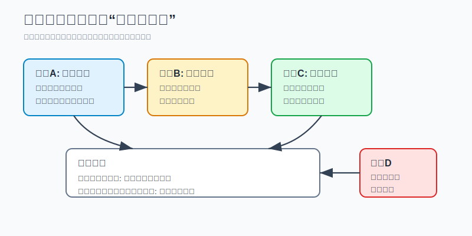
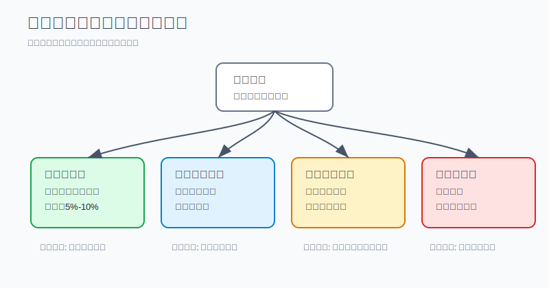
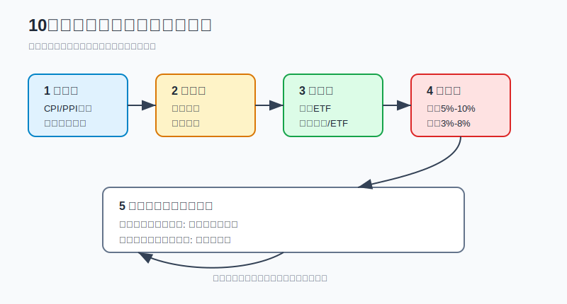

## 散户投资小白金融全品种操盘手册 - 17.7 通胀周期如何理解黄金和商品
  
### 作者  
digoal  
  
### 日期  
2026-06-07   
  
### 标签  
金融产品 , 金融工具 , 散户 , 投资小白 , 全品操盘手册  
  
----  
  
## 背景 
  

> 适用读者: 已经知道黄金、商品基金、资源股这些工具，但一看到“通胀”两个字就不知道该买什么、买多少、什么时候停手的小白投资者。  
> 本文定位: 典型场景实战手册，不构成个性化投资建议。

## 先问一个反直觉的问题

通胀来了，不是所有“抗通胀资产”都会一起涨。真正的顺序是: **先看通胀从哪里来，再看央行怎么反应，最后才决定黄金和商品谁更适合放进组合。**

## 核心概念: 黄金和商品不是同一个按钮

黄金和商品经常被放在同一类里，叫“抗通胀资产”。这个说法只对了一半。

**商品**，指原油、天然气、铜、铝、铁矿石、玉米、大豆这些真实生产资料。它像厨房里的米、油、燃气和电费。涨价来源是供需: 缺货、库存低、运输受阻、天气异常、战争扰动，都会让价格先跳起来。

**黄金**，更像一张“货币信用和实际利率”的温度计。实际利率，就是扣掉通胀后的利率。实际利率越低，拿现金和债券的吸引力越弱，黄金这种不生息资产的机会成本就越低；当市场担心纸币购买力、地缘风险或金融系统稳定时，黄金的防守属性会增强。

所以本节行动结论先放前面: **通胀来自能源、粮食、金属短缺时，商品仓更直接；通胀叠加货币信用受疑、实际利率走弱、避险升温时，黄金仓更适合；如果央行强紧缩把需求打下去，商品和黄金都不能无脑追涨。**

## 逻辑推导链

【论证链标题】: 因为通胀来源和政策反应不同，所以黄金与商品在通胀周期里的角色不同；小白要按情景配置小比例对冲仓，而不是把“通胀”直接翻译成重仓买入。

── 第一步: 前提陈述

前提A: 通胀来源不同。这是变量。能源、粮食、金属涨价是上游商品冲击；服务、工资、房租上涨更多是经济内部价格粘性。前者像厨房成本突然涨，商品更直接；后者像房租和人工慢慢涨，商品未必是主角。

前提B: 央行会用利率压通胀。这是常量，但力度是变量。加息会提高现金和债券的吸引力，也会压制经济需求。对黄金来说，实际利率上升会提高持有黄金的机会成本；对商品来说，需求被压下去会削弱涨价逻辑。

前提C: 黄金和商品的资产属性不同。这是常量。黄金不产生现金流，主要赚货币信用重估和避险的钱；商品不产生长期复利，主要赚供需缺口和库存紧张的钱。

前提D: 小白账户承受不了高波动重仓。这是常量。商品和黄金都可能短期大涨大跌，商品期货还可能叠加保证金和移仓风险。防守仓一旦做成重仓赌博，就不再防守。

── 第二步: 逻辑推导

由A+C可得: 因为商品涨价会直接推高生产和生活成本，所以当通胀源头是能源、粮食、金属短缺时，商品基金、商品ETF或资源行业ETF更像“上游账单对冲”。

由B+C可得: 因为黄金不生息，所以它不只是看CPI高不高，还要看实际利率、美元和避险情绪。如果通胀高但实际利率快速上升、美元强，黄金可能不涨；如果通胀让市场怀疑货币购买力、实际利率转弱，黄金的防守价值更强。

再由A+B+C+D可得: 因为通胀来源会变，政策反应会变，资产波动又高，所以正确动作不是“通胀来了就满仓黄金商品”，而是: **先分类通胀，再选择黄金或商品，再设仓位上限，最后用失效条件退出。**

── 第三步: 正常情景下的操作结论

✅ 正常情景一: 通胀主要来自能源、粮食、金属，库存偏低，供应受扰，经济需求还没有明显塌陷。  
对应操作: 商品相关仓位可以作为3%-8%的卫星对冲仓，优先用规则清楚、流动性好的商品基金、商品ETF或资源行业ETF，不用期货重仓。

✅ 正常情景二: 通胀叠加货币信用担忧、避险上升，实际利率不再继续快速走高。  
对应操作: 黄金可以作为5%-10%的防守仓，优先用黄金ETF或实物黄金中流动性更清楚的方式，不把黄金当短线暴富工具。

── 第四步: 数据和案例证实

证据1: 2022年美国就是典型的商品冲击型通胀。美国劳工统计局2022年6月CPI报告显示，美国CPI同比上涨9.1%，其中能源指数同比上涨41.6%，汽油同比上涨59.9%，食品同比上涨10.4%。这对应前提A: 当能源和食品是通胀主因时，商品价格会直接进入居民账单。

证据2: 世界银行2022年4月《Commodity Markets Outlook》指出，俄乌战争冲击商品市场，预计2022年能源价格上涨超过50%，非能源价格上涨约20%，布伦特原油均价约100美元/桶。这对应前提A+C: 商品短缺型通胀里，能源和原材料不是概念，而是供应链和贸易路线被重定价。

证据3: 世界黄金协会《Gold Demand Trends Full Year 2022》显示，2022年全球央行净购金1136吨，创1950年以来新高；但同一年黄金美元价格基本持平。这个组合很重要: 央行购金说明货币和储备信用需求增强，但美元和利率压力又压住了金价表现。这正好对应前提B+C: 黄金看通胀，也看实际利率和美元。

失败案例: 2008年原油说明商品逻辑会在需求塌陷时失效。美国能源信息署月度数据中，WTI原油2008年7月均价约133.37美元/桶，到2008年12月降至约41.12美元/桶。前期通胀和油价都高，但金融危机让需求快速塌陷，商品仓从对冲变成回撤来源。这里失败的不是“商品不抗通胀”，而是前提B和需求条件改变了。

历史不代表未来。上面数据仍有参考价值，是因为它们验证的是结构规律: 商品短缺会推高上游价格；黄金受货币信用、实际利率和避险共同影响；一旦强紧缩压垮需求，追商品会从对冲变成风险。

── 第五步: 前提变化时的替代结论

若前提A改变，也就是通胀主要来自服务、工资和房租，而不是商品短缺，推导路径变为: 因为商品不是涨价源头，所以商品仓不一定受益。新结论: 不追商品，把重点放在现金流、债券久期、红利资产和组合再平衡。

若前提B改变，也就是实际利率快速上升、美元走强、央行强紧缩，推导路径变为: 因为黄金机会成本上升，商品需求被压制，所以黄金和商品都不能因为“通胀高”继续加仓。新结论: 降低商品仓，黄金只保留计划内防守仓。

若前提D改变，也就是你把黄金商品仓从10%做成30%，推导路径变为: 因为防守仓变成了组合主风险，所以即使方向看对，账户也会被波动控制。新结论: 先把仓位减回计划，再讨论观点。

## 实操例子: 10万元账户遇到通胀新闻

这个例子对应论证链的正常结论: **先分类通胀，再选择黄金或商品，再设仓位上限，最后用失效条件退出。**

假设小林有10万元长期投资资金，生活备用金已经留好，原组合是: 宽基ETF 50%，债券和现金30%，海外资产10%，黄金和商品0%。最近新闻里能源、粮食、金属都涨，他担心通胀侵蚀购买力。

第一步，看通胀来源。小林不问“黄金和商品谁涨得快”，先看CPI、PPI、能源价格、食品价格和工业金属价格。如果涨价主要来自能源、粮食、金属，说明前提A偏向商品短缺型；如果主要是服务和工资粘性，商品仓暂停。

第二步，看政策反应。若央行持续强加息、实际利率上行、美元走强，小林不追黄金，也不追商品。因为这对应前提B改变: 高利率会压黄金估值，也会压商品需求。若实际利率不再快速上升，同时避险情绪升温，黄金才有防守仓意义。

第三步，分配仓位。小林给黄金设8%上限，也就是8000元；给商品设5%上限，也就是5000元。第一次只买一半: 黄金ETF 4000元，商品或资源ETF 2500元。剩余额度留给确认前提后的第二次买入。

第四步，写失效条件。若能源和粮食价格回落、库存修复，商品仓减半；若实际利率继续快速上行、美元继续走强，黄金不加仓；若黄金加商品合计超过15%，无论观点多强，都先再平衡。

第五步，纠偏。小林如果看到商品基金一个月涨20%，把商品仓从5%加到20%，这不是通胀对冲，而是追涨。纠偏动作是把超出计划的部分卖回现金或核心宽基ETF，让对冲仓重新服务组合，而不是支配组合。

## 可复用框架

【三分通胀】

适用前提: 你看到通胀上行，想判断黄金和商品怎么配。

核心逻辑: 因为通胀来源不同，所以资产选择必须先分型。

操作步骤:

1. 分来源: 是能源、粮食、金属涨价，还是服务、工资、房租粘性。
2. 分政策: 实际利率和美元是在压制资产，还是避险和货币信用在发力。
3. 分工具: 商品短缺用商品或资源工具小比例对冲；货币信用担忧用黄金防守。

前提失效时: 商品短缺消失，商品仓降；实际利率走强，黄金不追；通胀不是商品驱动，不把商品当默认答案。

举一反三: 这个框架也能用在黄金ETF、资源行业ETF、商品基金、QDII商品基金和海外资源股上。

【对冲上限】

适用前提: 你已经判断通胀周期需要黄金或商品，但不知道买多少。

核心逻辑: 因为黄金和商品都是高波动对冲工具，所以仓位要先封顶。

操作步骤:

1. 黄金先设5%-10%防守仓上限。
2. 商品先设3%-8%卫星仓上限。
3. 黄金加商品合计超过15%，先暂停新增。
4. 任一前提失效，用再平衡减回计划。

前提失效时: 如果你开始借钱、重仓期货、用生活钱追商品，说明已经离开对冲框架，动作是降杠杆、降仓位、回到现金和核心资产。

举一反三: 这个框架也适用于第十五章的组合系统: 所有防守资产都要有上限，不能因为短期有效就变成全部仓位。

## 本节行动清单

| 动作 | 合格标准 |
|---|---|
| 分清通胀来源 | 能说出是商品短缺型，还是服务工资粘性 |
| 检查实际利率 | 明白高通胀不等于黄金必涨 |
| 区分黄金和商品 | 黄金看货币信用和避险，商品看供需缺口 |
| 设仓位上限 | 黄金5%-10%，商品3%-8%，合计不超过计划 |
| 写失效条件 | 供给恢复、需求塌陷、强紧缩时主动降仓 |
| 不碰重仓杠杆 | 小白默认不用期货、T+D、借钱追商品 |

## 一句话总结

通胀周期里，黄金和商品不是同一个按钮: 商品对冲上游短缺，黄金对冲货币信用和实际利率变化；小白只用小比例仓位做对冲，前提一变就减回计划。

## 参考资料

- U.S. Bureau of Labor Statistics: Consumer Price Index News Release, June 2022, https://www.bls.gov/news.release/archives/cpi_07132022.htm
- World Bank: Food and Energy Price Shocks from Ukraine War, Commodity Markets Outlook, 2022-04-26, https://www.worldbank.org/en/news/press-release/2022/04/26/food-and-energy-price-shocks-from-ukraine-war
- World Gold Council: Gold Demand Trends Full Year 2022, https://www.gold.org/goldhub/research/gold-demand-trends/gold-demand-trends-full-year-2022
- U.S. Energy Information Administration: Cushing, OK WTI Spot Price FOB, https://www.eia.gov/dnav/pet/hist/LeafHandler.ashx?f=M&n=PET&s=RWTC

> ⚠️ **声明**：本文内容为投资教育目的，所有历史数据、策略框架均为辅助学习工具，不构成证券投资建议。市场有风险，投资需谨慎。实际操作请结合自身风险承受能力，必要时咨询专业投顾。
  
#### [PostgreSQL 解决方案集合](../201706/20170601_02.md "40cff096e9ed7122c512b35d8561d9c8")
  
  
#### [德哥 / digoal's Github - 公益是一辈子的事.](https://github.com/digoal/blog/blob/master/README.md "22709685feb7cab07d30f30387f0a9ae")
  
  
#### [About 德哥](https://github.com/digoal/blog/blob/master/me/readme.md "a37735981e7704886ffd590565582dd0")
  
  

  
