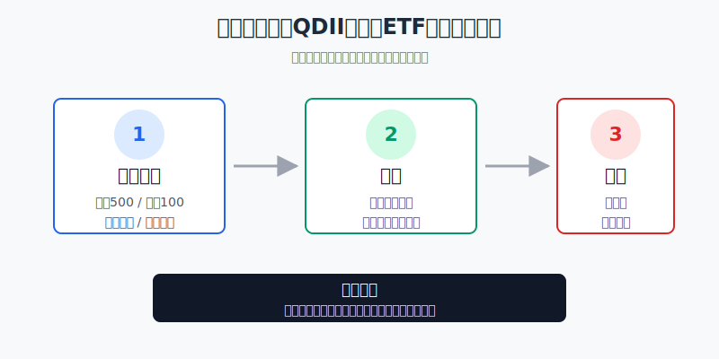
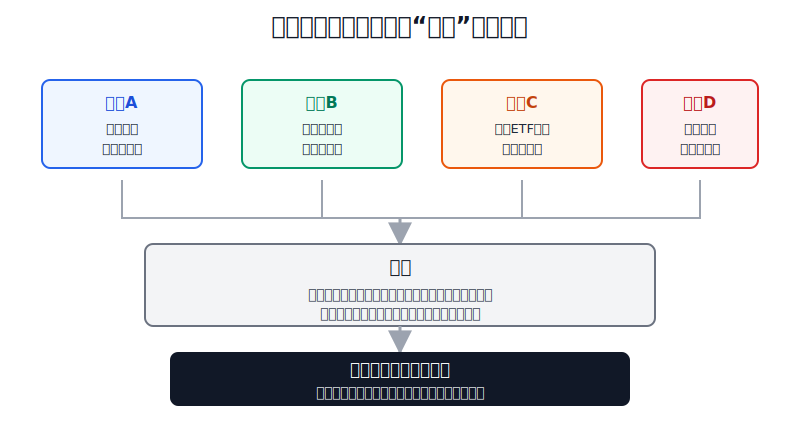
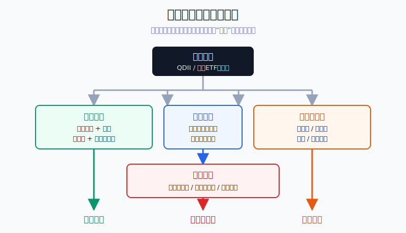

## 散户投资小白金融全品种操盘手册 - 17.8 美股大跌时QDII和跨境ETF该怎么看
  
### 作者  
digoal  
  
### 日期  
2026-06-08   
  
### 标签  
金融产品 , 金融工具 , 散户 , 投资小白 , 全品操盘手册  
  
----  
  
## 背景 
  

> 适用读者: 已经通过QDII基金或跨境ETF配置美股、纳指、标普500、全球股票，但一遇到美股大跌就想补仓或割肉的小白投资者。  
> 本文定位: 投资教育框架，不构成个性化投资建议。

## 先问一个反直觉的问题

美股大跌时，最危险的动作不一定是卖出，也不一定是买入，而是把“美股跌了”当成唯一信号。对人民币账户来说，你买的不是一个单纯的美股指数，而是**底层资产、汇率、QDII申赎或跨境ETF溢价**叠在一起的结果。

## 核心概念: 你看到的跌幅，未必就是你的买入成本

先把两个工具分清楚。

QDII基金，是境内基金公司通过获批额度投资海外资产。你买的是基金份额，通常按基金净值申购赎回，到账慢一些，但不需要自己开境外账户。

跨境ETF，是在境内交易所上市交易、跟踪海外资产的ETF。你可以像买A股ETF一样场内买卖，但成交价由境内买卖双方撮合出来，短期可能高于基金参考净值。高出来的部分叫溢价。

所以美股大跌时，小白要同时问三件事:

第一，底层资产到底跌了多少。标普500跌、纳斯达克100跌、单一AI主题跌，含义不同。宽基回撤可能是长期配置里的正常颠簸，主题回撤可能是估值和盈利前提被重新定价。

第二，人民币汇率怎么动。你用人民币看QDII净值时，美元兑人民币上升会抬高人民币净值，人民币升值会压低人民币净值。也就是说，海外指数跌10%，你的人民币基金净值不一定刚好跌10%。

第三，场内价格有没有买贵。跨境ETF在大跌或热点阶段都可能出现异常溢价。你以为自己是在“抄底美股”，实际可能是在用1.05元买1元左右的海外资产。

本节行动结论先放在前面: **美股大跌时，先拆三层，再做动作。宽基、长期资金、低溢价、仓位未超标，可以按计划分批；高溢价、短期资金、主题仓位过重、买入逻辑失效，先暂停或减仓。**

## 逻辑推导链

【论证链标题】: 因为QDII和跨境ETF把美股波动、汇率变化和交易价格偏离叠加在一起，所以美股大跌不是自动买入或卖出信号，而是一次三层成本检查。

── 第一步: 前提陈述

前提A: 美股宽基出现两位数回撤并不罕见。这是常量。宽基指数像长途车，路上颠簸不是事故本身；如果每次颠簸都跳车，你很难享受到长期复利。

前提B: QDII和跨境ETF的人民币收益不只由美股涨跌决定，还受汇率影响。这是变量。你用人民币买海外资产，实际拿到的是“海外资产表现 + 外币兑人民币变化”后的结果。

前提C: 跨境ETF的场内价格可能偏离参考净值，尤其在额度、申购、海外市场时差或买盘拥挤时。这是变量。参考净值像货物真实价值，场内成交价像柜台报价；柜台报价可以短期高于货值。

前提D: 资金期限和组合仓位决定你能不能承受回撤。这是常量加变量。长期闲钱可以承受波动，半年内要用的钱不能拿去赌反弹；10%的海外仓和50%的海外仓，心理压力完全不同。

── 第二步: 逻辑推导

由A可得: 因为宽基回撤是长期投资的一部分，所以“跌了10%-15%”不能单独推出“该清仓”。如果资金期限和买入逻辑没变，普通回撤更像复盘信号，不是逃跑命令。

由A+B可得: 因为人民币净值会被汇率改变，所以不能只看美股指数跌幅。美元走强时，美股下跌可能被汇率部分缓冲；人民币升值时，美股下跌可能被放大。你要判断的是人民币账户的真实风险，而不是海外新闻标题。

再由A+B+C可得: 因为跨境ETF还叠加场内溢价，所以“指数跌了”也不等于“今天买便宜了”。如果美股跌了8%，但跨境ETF溢价从1%冲到8%，你买入时先多付了7个百分点左右的交易成本。

最后由A+B+C+D可得: 因为大跌、汇率、溢价和资金期限会同时影响结果，所以正确动作不是喊抄底或割肉，而是四问: **跌的是宽基还是主题？人民币成本有没有被汇率抬高？跨境ETF有没有高溢价？这笔钱能不能等三年以上？**

── 第三步: 正常情景下的操作结论

✅ 正常情景: 你持有的是标普500、纳斯达克100或全球宽基类QDII/跨境ETF；这笔钱三年以上不用；海外仓位没有超过计划上限；跨境ETF溢价在0%-1%附近，买卖价差正常；你不是在追单一热门主题。

对应操作: 不因一次大跌清仓。若原计划本来就有定投或再平衡规则，可以把计划金额分成3到6笔执行；跨境ETF溢价超过3%暂停新买，超过5%默认不追；若已经重仓主题产品，先把它归为卫星仓，不用宽基规则安慰自己。

── 第四步: 数据和案例证实

证据1: 普通回撤并不罕见。J.P. Morgan Asset Management《Guide to the Markets》2026年版统计，1980年以来标普500年内平均最大回撤约14.2%，但46年里有35年全年仍为正收益。这个数据对应前提A: 对宽基资产来说，年内两位数下跌不能自动等同于长期趋势失败。

证据2: QDII已经是有规模的公募品类，同时受额度管理。中国证券投资基金业协会《公募基金市场数据(2026年4月)》显示，截至2026年4月底，QDII基金337只，净值10539.19亿元；国家外汇管理局QDII额度表显示，截至2026年5月末，QDII累计批准额度1761.69亿美元，其中证券基金类合计972.80亿美元。这个数据对应前提B和C: QDII是成熟通道，但跨境投资仍受额度、申赎和运作安排约束。

证据3: 汇率会明显改变人民币体验。美联储G.5A年度外汇数据显示，人民币兑美元年度平均汇率从2022年的6.7290，到2024年的7.1957、2025年的7.1875。数字越高，代表一美元需要更多人民币。这个数据对应前提B: 同样是1万美元美股资产，人民币买入成本会随汇率变化。

证据4: 高溢价不是理论风险。华夏基金在上交所披露的公告显示，华夏野村日经225 ETF（513520）在2024年1月23日因二级市场交易价格明显高于基金份额参考净值，开市起至当日10:30停牌；同一产品在2026年6月5日仍发布二级市场交易价格溢价风险提示。这个案例对应前提C: 跨境ETF场内价格会因供求和套利不顺偏离净值，甚至触发风险提示和临时停牌。

失败案例: 小林看到纳斯达克100大跌8%，打开账户发现某只纳指跨境ETF还能买，于是一次性买入5万元。但他没有看溢价，买入时溢价是6%；也没有看仓位，买完后海外科技主题仓从总资产15%升到35%。几天后标的指数没再大跌，但溢价回到1%，他先亏掉约5个百分点的溢价回归；随后如果科技股继续回撤，组合压力被放大。这个亏损不是因为“美股不能买”，而是前提C和D被忽略。

历史不代表未来。上面的数据仍有参考价值，是因为它们验证的是结构规律: 宽基会回撤，人民币账户会受汇率影响，跨境ETF会出现折溢价，资金期限决定承受能力。只要这些结构存在，大跌时就要先拆解，不要只看一个跌幅。

── 第五步: 前提变化时的替代结论

若前提C改变，也就是跨境ETF溢价超过3%、连续发布风险提示、基金限购或暂停申购，推导路径变为: 因为场内成交价已经明显偏离参考净值，所以“美股跌了”不再等于“买入价格便宜”。新结论: 暂停新买，等待溢价回落，或改看同类低溢价QDII/ETF。

若前提D改变，也就是这笔钱一年内要用，推导路径变为: 因为短期资金不能承受海外权益和汇率双重波动，所以就算美股看起来跌便宜，也不能拿短钱补仓。新结论: 保留现金、货币基金或短债工具，不把应急钱放进QDII股票类产品。

若底层资产从宽基变成单一主题，推导路径变为: 因为主题产品集中度高、估值弹性大，所以它不能按核心宽基处理。新结论: 把主题QDII或主题跨境ETF归入卫星仓，单一主题仓位控制在总资产3%-5%以内，逻辑坏了就减，不用“长期配置”包装。

若汇率前提改变，也就是美元阶段性很贵、海外资产估值仍不便宜，推导路径变为: 因为人民币买入成本被汇率和估值同时抬高，所以一次性买满会降低容错率。新结论: 降低买入速度，把计划拆成6到12个月。

## 实操例子: 20万元账户遇到美股大跌怎么办

这个例子对应论证链的正常结论: **先拆底层资产、汇率、溢价和资金期限，再决定是分批加仓、持有、暂停下单还是减仓。**

假设小林有20万元长期投资资金，已经留足6个月生活备用金。他原计划海外资产占总资产20%，也就是4万元。目前他已经持有2.5万元美股宽基QDII，另有5000元纳指跨境ETF，总海外仓3万元，占总资产15%。某天晚上，美股大跌，纳斯达克100跌得更多，中文社区开始喊“抄底”。

第一步，先看资金期限。小林确认这20万元里，至少15万元三年以上不用，另有5万元可能一年内买车。动作很明确: 可能一年内要用的5万元不参与补仓。这个判断对应前提D。

第二步，分清底层资产。美股宽基QDII是核心仓，纳指跨境ETF是准核心或成长卫星，单一AI主题QDII只应算卫星。小林没有把“纳指跌了”直接等同于“所有海外资产都便宜”，而是把宽基和主题分开看。这个动作对应前提A。

第三步，看汇率。假设美元兑人民币处在近几年偏高区间，小林就不一次性把海外仓从15%打到20%，而是把剩余1万元计划拆成4笔，每月2500元。这个动作对应前提B: 美元贵时，人民币买入成本也贵，分批能提高容错率。

第四步，看跨境ETF溢价。小林发现纳指跨境ETF当天溢价4.5%，并且基金公告最近提示过溢价风险。动作不是追买，而是暂停这只跨境ETF，把它放入观察。若仍想执行海外配置计划，可以看低溢价同类产品或按净值申购QDII，但仍然要考虑申赎效率和费用。这个动作对应前提C。

第五步，决定动作。小林对已有2.5万元宽基QDII不清仓，因为资金期限没变、宽基逻辑没坏、仓位还低于20%上限；对5000元纳指跨境ETF不加仓，因为当前溢价过高；对剩余1万元海外配置计划，拆成4到6笔，只在低溢价或QDII申购状态正常时执行。

第六步，写纠偏规则。如果美股继续下跌10%，但溢价回到1%以内、海外仓仍低于20%、资金期限没变，小林可以执行下一笔分批买入；如果纳指主题仓涨跌导致海外科技暴露超过总资产10%，先停止加仓；如果一年内要用的钱突然变多，直接削减海外权益计划。

如果操作错误，后果很具体。小林若在4.5%溢价时一次买满1万元，溢价回到1%就先损失约350元；若再把一年内要用的钱也拿去补仓，市场继续跌时，他可能被迫在低位赎回。纠偏方法不是预测下一晚美股涨跌，而是回到四问: 跌什么，贵不贵，汇率怎样，钱能等多久。

## 可复用框架

【四问决策】

适用前提: 你持有或准备买入QDII基金、跨境ETF，且底层资产主要是美股或全球股票。

核心逻辑: 因为人民币账户承受的是底层资产、汇率、折溢价和资金期限的合成风险，所以大跌后先问四个问题，再做动作。

操作步骤:

1. 跌什么: 宽基回撤按长期配置处理，主题回撤按卫星仓处理。
2. 贵不贵: 跨境ETF溢价0%-1%可按计划，超过3%暂停新买，超过5%默认不追。
3. 汇率怎样: 美元贵且资产估值不低时，降低单次买入金额，延长分批周期。
4. 钱能等多久: 三年内要用的钱，不买QDII股票类产品，不参与大跌补仓。

前提失效时: 如果基金限购、暂停申购、连续风险提示、仓位超标或主题逻辑被证伪，动作从“分批买入”切换为“暂停、减仓或重新分类”。

举一反三: 这个框架也适用于港股QDII、日经ETF、德国ETF、全球科技主题基金。只要是跨境资产，就不要只看一个指数涨跌。

【三层报价】

适用前提: 你准备在场内买跨境ETF。

核心逻辑: 因为跨境ETF有底层资产价格、人民币汇率和场内交易价格三层变量，所以先算真实买入成本，再决定是否下单。

操作步骤:

1. 看底层: 跟踪标普500、纳指100、日经225，还是单一主题指数。
2. 看汇率: 人民币买入外币资产的成本是否处于高位。
3. 看溢价: 用场内价格和参考净值计算溢价率。
4. 看订单: 成交额正常、价差不宽时，用限价单分批；异常时放弃本次交易。

前提失效时: 如果海外市场休市、IOPV参考意义下降、溢价异常扩大或买卖价差明显变宽，不用市价单抢成交。

举一反三: 这个框架还能用在商品ETF、债券ETF、REITs和封闭式基金上。凡是“净值”和“场内价格”可能分离的工具，下单前都要先看偏离。

## 本节行动清单

| 动作 | 合格标准 |
|---|---|
| 分清工具 | QDII按净值申赎，跨境ETF按场内价格成交 |
| 分清底层 | 宽基、纳指、行业主题、海外债券不要混成一类 |
| 查汇率 | 记录买入时美元兑人民币水平，不只记录指数跌幅 |
| 算溢价 | 跨境ETF超过3%暂停新买，超过5%默认不追 |
| 查公告 | 看是否限购、暂停申购、溢价风险提示或临时停牌 |
| 看资金期限 | 三年内要用的钱，不参与海外权益补仓 |
| 控仓位 | 海外仓、科技仓、单一主题仓都有上限 |
| 分批执行 | 计划金额拆成3到6笔，不在恐慌日一次打满 |

## 一句话总结

美股大跌时，QDII和跨境ETF不是只能抄底或割肉；真正的小白实战框架，是把底层资产、汇率、溢价和资金期限拆开检查，前提正常才分批，前提失效就暂停或减仓。

## 参考资料

- J.P. Morgan Asset Management: Guide to the Markets U.S., 2026年版，https://am.jpmorgan.com/content/dam/jpm-am-aem/global/en/insights/market-insights/guide-to-the-markets/mi-guide-to-the-markets-us.pdf
- 中国证券投资基金业协会: 《公募基金市场数据(2026年4月)》，2026年5月27日，https://www.amac.org.cn/sjtj/tjbg/gmjj/202605/P020260527642499680112.pdf
- 国家外汇管理局广东省分局: 《合格境内机构投资者（QDII）投资额度审批情况表（截至2026年5月31日）》，2026年6月3日，https://www.safe.gov.cn/guangdong/2026/0601/3230.html
- Federal Reserve Board: Foreign Exchange Rates - G.5A Annual，2026年1月5日，https://www.federalreserve.gov/releases/g5a/current/
- 上海证券交易所 ETF 投资者教育: 《ETF瞬时套利策略》，说明 IOPV、折溢价套利和申购赎回单位，https://etf.sse.com.cn/fund/learning/strategy/c/5704303.shtml
- 华夏基金管理有限公司: 《华夏野村日经225交易型开放式指数证券投资基金（QDII）二级市场交易价格溢价风险提示及临时停牌公告》，2024年1月23日，https://www.sse.com.cn/disclosure/fund/announcement/c/new/2024-01-23/513520_20240123_LTAG.pdf
- 华夏基金管理有限公司: 《华夏野村日经225交易型开放式指数证券投资基金（QDII）二级市场交易价格溢价风险提示公告》，2026年6月5日，https://www.sse.com.cn/disclosure/fund/announcement/c/new/2026-06-05/513520_20260605_5ORT.pdf

> ⚠️ **声明**：本文内容为投资教育目的，所有历史数据、策略框架均为辅助学习工具，不构成证券投资建议。市场有风险，投资需谨慎。实际操作请结合自身风险承受能力，必要时咨询专业投顾。
  
#### [PostgreSQL 解决方案集合](../201706/20170601_02.md "40cff096e9ed7122c512b35d8561d9c8")
  
  
#### [德哥 / digoal's Github - 公益是一辈子的事.](https://github.com/digoal/blog/blob/master/README.md "22709685feb7cab07d30f30387f0a9ae")
  
  
#### [About 德哥](https://github.com/digoal/blog/blob/master/me/readme.md "a37735981e7704886ffd590565582dd0")
  
  

  
