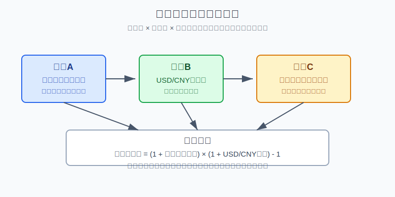
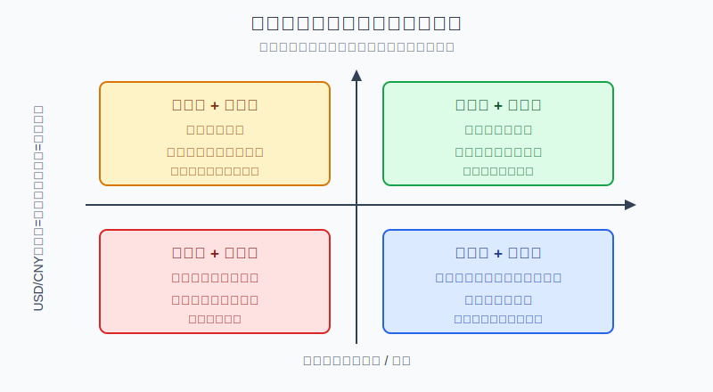

## 散户投资小白金融全品种操盘手册 - 17.9 美元升值/贬值时，美股资产该怎么理解
  
### 作者  
digoal  
  
### 日期  
2026-06-07   
  
### 标签  
金融产品 , 金融工具 , 散户 , 投资小白 , 全品操盘手册  
  
----  
  
## 背景 
  

> 适用读者: 已经通过QDII、跨境ETF或境外账户接触美股，但一看到“美元升值”“美元贬值”就想立刻加仓或清仓的小白投资者。  
> 本文定位: 投资教育框架，不构成个性化投资建议。数据口径按 2026-06-06 可核查公开资料整理。

## 先问一个反直觉的问题

美元升值时，买美股一定更赚钱吗？美元贬值时，美股资产就一定不值得持有吗？

答案都不是。你真正买到的不是“美元”两个字，而是**美元计价的股票资产**。美股本身涨跌是一层，美元兑人民币变化是一层，你未来用人民币还是美元花钱又是一层。只看美元强弱下单，就像只看天气不看路况开车。

## 核心概念: 美元不是美股的同义词

先把三件事分开。

第一件事是**美股资产**。标普500、纳斯达克100、美国科技龙头、美国债券ETF，它们的收益来自公司利润、估值、利率、风险偏好和分红，不是只来自美元。

第二件事是**美元汇率**。对人民币投资者来说，最常用的观察口径是USD/CNY，也就是1美元能换多少人民币。USD/CNY上升，代表美元相对人民币升值；USD/CNY下降，代表美元相对人民币贬值。

第三件事是**你的用钱币种**。如果你的工资、房贷、家庭开支和未来大额支出都是人民币，那么你最终要看人民币结果；如果未来有确定美元支出，例如留学学费，美元资产反而有一部分币种匹配意义。

本节行动结论先放在前面: **美元升值不是自动买入美股的理由，美元贬值也不是自动卖出美股的理由。每次复盘必须拆成三行: 美股美元账、USD/CNY变化、人民币合并结果；再根据资金期限、仓位上限和资产逻辑决定动作。**

## 逻辑推导链

【论证链标题】: 因为美股资产收益和美元兑人民币变化会共同决定人民币结果，所以小白不能用“美元强弱”替代“资产、汇率、期限、仓位”的完整判断。

### 第一步: 前提陈述

前提A: 美股资产先按美元计价和交易。这是常量。你买标普500ETF、纳指ETF或美股个股，第一本账是美元价格涨跌。用生活里的话说，你先在美元货架上买了一篮子资产。

前提B: 人民币投资者最终看到的收益，还要经过USD/CNY换算。这是变量。USD/CNY上升，美元资产换回人民币时有汇率顺风；USD/CNY下降，美元资产换回人民币时有汇率逆风。汇率不是装饰，它会进入最终收益公式。

前提C: 美元强弱不能稳定替代美股基本面判断。这是常量。美元升值有时来自美国经济相对强，有时来自避险，有时来自利率差；同样的美元升值，对美股可能是顺风，也可能压制跨国公司利润和风险偏好。

前提D: 资金期限和未来用钱币种决定这层波动能不能承受。这是变量。三年以上不用的钱，可以用仓位和再平衡慢慢消化波动；一年内要用的人民币钱，不应该承担美股下跌再叠加美元贬值的双重打击。

### 第二步: 逻辑推导

由A+B可得: 因为你持有的是美元计价资产，但最终可能用人民币衡量，所以只看美股涨跌是不完整的。美元账赚钱，不等于人民币账同幅度赚钱；美元账亏钱，也不等于人民币账一定亏同样幅度。

再由A+B+C可得: 因为美元升值和美股涨跌不是同一个变量，所以“美元升值”只能说明汇率账顺风，不能直接推出“美股资产更值得追高”。如果美股估值贵、仓位超标、主题逻辑变差，美元顺风只是在短期缓冲风险，不是消灭风险。

再由B+C+D可得: 因为汇率会放大或压缩人民币结果，而短期用钱不能等待修复，所以小白必须先问“这笔钱未来用什么币种花、多久以后花”，再问“美元现在强不强”。

最后由A+B+C+D可得: **正确动作不是预测美元，而是把账户拆成三本账，并用四象限处理: 美股涨跌看资产逻辑，美元升贬看汇率贡献，仓位动作看期限和上限。**

### 第三步: 正常情景下的操作结论

✅ 正常情景: 你持有的是美股宽基QDII、跨境ETF或主流美股ETF；这笔钱三年以上不用；海外资产没有超过计划上限；你能接受USD/CNY反向波动5%-10%；买入逻辑不是“美元会涨”，而是“长期配置一部分美国权益资产”。

对应操作: 继续按计划持有或分批配置，但每次复盘必须拆三行:

| 复盘项目 | 写什么 | 动作用途 |
|---|---|---|
| 美股美元账 | 标普500、纳指或所持ETF本身涨跌 | 判断资产逻辑是否成立 |
| 汇率账 | USD/CNY从买入时到复盘时变化 | 判断人民币结果被放大还是压缩 |
| 仓位账 | 海外资产占总资产比例、是否超上限 | 决定加仓、暂停、再平衡或减仓 |

四种情景下的动作也要提前写清。

| 情景 | 账户结果 | 小白动作 |
|---|---|---|
| 美股涨 + 美元升 | 人民币收益被放大 | 不追高，检查海外仓是否超上限 |
| 美股涨 + 美元跌 | 资产赚钱但人民币收益被压缩 | 不因汇率逆风否定资产，继续拆账复盘 |
| 美股跌 + 美元升 | 汇率缓冲亏损 | 不把缓冲当安全，先查资产逻辑是否坏掉 |
| 美股跌 + 美元跌 | 人民币结果双重受压 | 短期钱退出讨论，超仓先降风险 |

### 第四步: 数据和案例证实

证据1: 投资者教育材料明确把汇率列为国际投资收益变量。Investor.gov的国际投资材料说明，外汇汇率变化会增加或减少投资回报；FINRA在2024年12月5日的货币风险文章中也提醒，投资海外证券时，投资者会同时面对资产本身和计价货币的风险。这个证据对应前提A和B: 跨境投资不是单层资产价格。

证据2: 2022年是“美股跌、美元兑人民币升”的教学例子。FRED的S&P 500数据中，指数从2021年12月31日的4766.18降到2022年12月30日的3839.50，美元账约为-19.44%；FRED的DEXCHUS数据中，USD/CNY从2021年12月30日的6.3726升到2022年12月30日的6.8972，汇率项约为+8.23%；合并后的人民币账约为-12.81%。这说明美元升值可以缓冲美股下跌，但不能把大幅下跌自动变成赚钱。

证据3: 2025年是“美股涨、美元兑人民币跌”的教学例子。FRED数据显示，S&P 500从2024年12月31日的5881.63升到2025年12月31日的6845.50，美元账约为+16.39%；DEXCHUS从7.2993降到6.9931，汇率项约为-4.19%；合并后的人民币账约为+11.51%。这说明美股上涨时，如果美元相对人民币走弱，人民币收益会被压缩，但资产上涨本身并没有因此消失。

证据4: 2026年初至6月初也出现了“美股涨、美元兑人民币跌”的近似复盘。FRED的S&P 500截至2026年6月4日为7584.31，相比2025年12月31日6845.50约上涨10.79%；DEXCHUS截至2026年5月29日为6.7662，相比2025年12月31日6.9931约下降3.24%；用最接近端点做教学估算，人民币合并结果约为+7.20%。这个例子验证前提B: 汇率逆风会改变人民币体验，但不能替代资产账判断。

失败案例: 小林看到美元指数走强，就把20万元账户里的海外资产从20%加到45%，理由是“美元升值，美股更稳”。但他买入的是高估值科技主题QDII，而不是美元现金。接下来如果科技股下跌15%，同时美元升值5%，人民币账仍约为0.85×1.05-1=-10.75%；如果美元后来回落3%，跌幅还会扩大。这个失败不是因为美元一定不能买，而是把“汇率顺风”误当成“资产安全”。

历史数据不代表未来。上面例子的价值，不是预测下一次美元怎么走，而是验证一个稳定公式: **人民币结果由资产收益和汇率变化共同决定，任何一层都不能单独当交易理由。**

### 第五步: 前提变化时的替代结论

若前提D改变，也就是这笔钱一年内要用人民币支出，推导路径变为: 因为短期资金无法等待美股和汇率两层波动修复，所以美元升值也不能把这笔钱变成长期资金。新结论: 不把短期人民币钱放进美股QDII或跨境ETF，主体资金留在人民币现金管理、货币基金或短债工具。

若前提B改变，也就是未来有确定美元支出，例如一年后要交美元学费，推导路径变为: 因为未来支出本身是美元，所以持有一部分美元现金、美元货币基金或低波动美元资产有币种匹配意义。新结论: 可以分批建立美元匹配仓，但不等于重仓美股权益；学费钱不能因为“也是美元”就买高波动科技股。

若前提C改变，也就是美元升值同时伴随美股估值过热、仓位超标、跨境ETF高溢价，推导路径变为: 因为汇率顺风被资产估值、仓位和工具溢价抵消，所以追买的容错率下降。新结论: 暂停新买，等待仓位、溢价或估值至少一项恢复合理。

反例: 美元贬值不等于必须卖出美股。若你持有的是低成本宽基ETF，资金期限五年以上，仓位仍在上限内，公司盈利和指数规则没有变化，美元贬值只是压缩短期人民币收益。正确动作是继续拆账复盘，而不是把长期资产做成外汇短线。

## 实操例子: 20万元账户遇到美元贬值怎么办

这个例子对应论证链的核心结论: **先拆美元账、汇率账和仓位账，再决定是否调整。**

假设小林有20万元长期投资资金，已留足生活备用金。其中4万元是美股宽基QDII，占总资产20%；买入时USD/CNY为7.20。三个月后，美股ETF美元账上涨8%，但USD/CNY从7.20降到6.84，美元相对人民币贬值5%。

第一步，算人民币结果。人民币收益约为1.08×0.95-1=+2.6%。小林不能说“美股没用”，因为资产账确实赚钱；也不能说“只赚2.6%太差，换成别的更刺激”，因为汇率逆风是本节前提B的一部分。

第二步，检查资金期限。这4万元三年以上不用，所以不因三个月汇率逆风清仓。如果其中2万元半年后要用来付人民币学费，动作会立刻改变: 半年内要用的钱退出美股权益仓，回到人民币低波动工具。

第三步，检查仓位。虽然人民币收益只有2.6%，但海外仓仍是约4.1万元，占总资产约20.5%，没有超过小林的25%上限。结论: 不加仓赌美元反弹，也不清仓否定美股，只继续按月复盘。

第四步，写情景切换。如果下一阶段变成“美股跌8% + 美元再跌5%”，人民币结果约为0.92×0.95-1=-12.6%。若这时海外仓仍在上限内、资金期限没变，可以继续按计划；若海外仓已被前期加仓推到35%，先停止新增美股仓，必要时降回上限。

第五步，避免错误动作。小林最容易犯的错，是看到美元跌就买外汇杠杆或期权对冲。小白默认不做复杂外汇对冲，因为对冲本身也有成本、保证金、期限和方向错误风险。更简单的纠偏是: 降低单次买入金额、拉长分批周期、守住海外仓上限。

如果操作错误，后果很直接。小林若因为美元贬值后“想赚回来”，把美股仓从20%加到50%，下一次美股和美元同跌时，亏损会从局部波动变成全账户压力。纠偏方法不是预测汇率底部，而是回到三本账: 资产逻辑、汇率贡献、仓位上限。

## 可复用框架

【三账复盘】

适用前提: 你持有美股、QDII、跨境ETF、美元债券ETF或其他美元相关资产，最终仍以人民币衡量家庭财富。

核心逻辑: 因为人民币结果由资产收益和USD/CNY变化共同决定，所以每次复盘都要把收益拆开。

操作步骤:

1. 写美元账: 标的资产本身涨跌多少。
2. 写汇率账: USD/CNY相对买入时上升还是下降。
3. 写人民币账: 用公式计算合并结果。
4. 写动作账: 仓位是否超上限，资金期限是否仍满足。

前提失效时: 如果未来支出本身就是美元，人民币账不是唯一标准；但资产波动仍要单独管理，不能把美元匹配仓全部放进高波动股票资产。

举一反三: 这个框架也适用于港股、黄金、海外债券、商品基金和全球REITs。只要底层计价币种和家庭用钱币种不同，就要拆账。

【四象限法】

适用前提: 你不知道美元升值或贬值时该不该动美股仓位。

核心逻辑: 因为美股涨跌和美元升贬值会形成四种组合，所以先判断象限，再决定动作。

操作步骤:

1. 美股涨 + 美元升: 收益放大，先查是否超仓，不追高。
2. 美股涨 + 美元跌: 收益压缩，拆清贡献，不否定资产。
3. 美股跌 + 美元升: 汇率缓冲，检查资产逻辑，不把缓冲当安全。
4. 美股跌 + 美元跌: 双重受压，短期钱不参与，超仓先降风险。

前提失效时: 如果持有的是单一主题、高溢价跨境ETF、杠杆ETF或短期要用的钱，不能套用宽基长期配置规则；动作从“复盘观察”切换到“暂停、降仓或退出”。

举一反三: 这个框架也适用于“港币变化时港股资产怎么看”“黄金涨跌和美元变化怎么拆”“海外债券基金为什么净值和汇率一起动”。

## 本节行动清单

| 动作 | 合格标准 |
|---|---|
| 记录买入汇率 | 每次买美股、QDII、跨境ETF，都写下USD/CNY起点 |
| 拆三本账 | 复盘时分别写美元资产收益、汇率变化、人民币结果 |
| 不用美元强弱替代资产判断 | 美元升值不自动追买，美元贬值不自动清仓 |
| 做四象限判断 | 美股涨跌和美元升贬值组合后再决定动作 |
| 短期人民币钱不进美股 | 一年内要用的人民币资金，不参与美股权益仓 |
| 外币资产设上限 | 海外仓因上涨或汇率顺风超过上限时，做再平衡 |
| 不默认复杂对冲 | 小白不把外汇、期权、期货当默认汇率对冲工具 |

## 一句话总结

美元升值和贬值，只是在改变美股资产的人民币换算结果；小白真正要学会的不是猜美元，而是把美股美元账、汇率账和仓位账拆开，前提正常就按计划，前提失效就暂停或降风险。

## 参考资料

- Investor.gov: International Investing，2026年访问，https://www.investor.gov/introduction-investing/investing-basics/investment-products/international-investing
- FINRA: Currency Risk: Why It Matters to You，2024-12-05，https://www.finra.org/investors/insights/currency-risk-why-it-matters-you
- Federal Reserve Bank of St. Louis FRED: S&P 500 [SP500]，数据截至2026-06-04，https://fred.stlouisfed.org/data/SP500
- Federal Reserve Bank of St. Louis FRED: Chinese Yuan Renminbi to U.S. Dollar Spot Exchange Rate [DEXCHUS]，数据截至2026-05-29，https://fred.stlouisfed.org/data/DEXCHUS
- Board of Governors of the Federal Reserve System: H.10 Foreign Exchange Rates，https://www.federalreserve.gov/releases/h10/

> ⚠️ **声明**：本文内容为投资教育目的，所有历史数据、策略框架均为辅助学习工具，不构成证券投资建议。市场有风险，投资需谨慎。实际操作请结合自身风险承受能力，必要时咨询专业投顾。
  
#### [PostgreSQL 解决方案集合](../201706/20170601_02.md "40cff096e9ed7122c512b35d8561d9c8")
  
  
#### [德哥 / digoal's Github - 公益是一辈子的事.](https://github.com/digoal/blog/blob/master/README.md "22709685feb7cab07d30f30387f0a9ae")
  
  
#### [About 德哥](https://github.com/digoal/blog/blob/master/me/readme.md "a37735981e7704886ffd590565582dd0")
  
  

  
