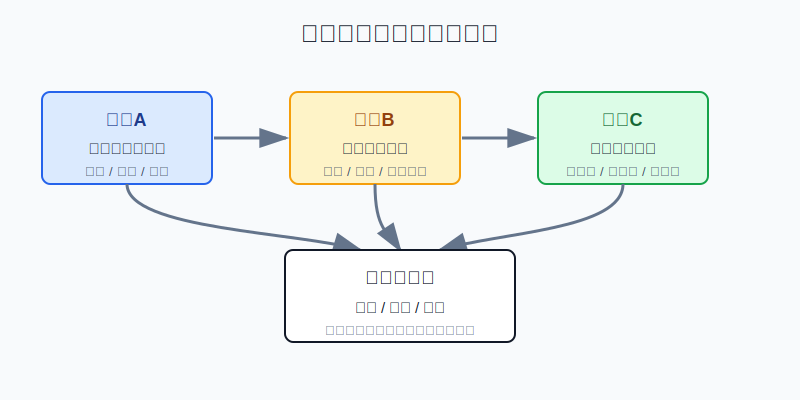
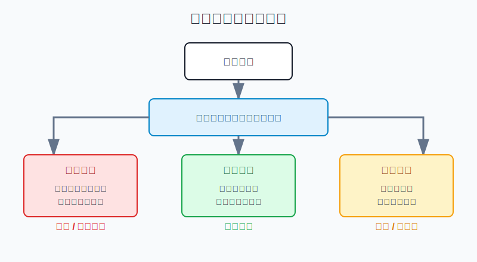
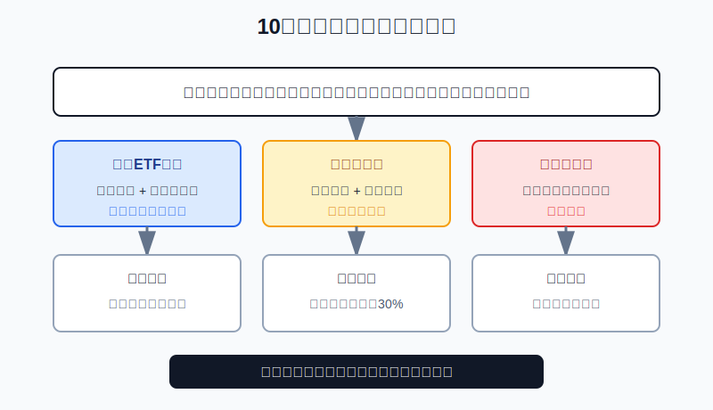

## 散户投资小白金融全品种操盘手册 - 17.10 持仓被套后 - 补仓、止损、等待的判断框架
  
### 作者  
digoal  
  
### 日期  
2026-06-08   
  
### 标签  
金融产品 , 金融工具 , 散户 , 投资小白 , 全品操盘手册  
  
----  
  
## 背景 
  

> 适用读者: 已经有持仓浮亏，正在纠结“要不要补仓拉低成本”“割肉是不是太痛”“再等等会不会回来”的小白投资者。  
> 本文定位: 投资教育框架，不构成个性化投资建议。规则口径按 2026-06-06 可核查公开资料整理。

## 先问一个反直觉的问题

被套后最危险的动作，往往不是卖错，而是先问“怎么回本”。因为一旦目标变成回本，你就会把所有判断都往一个方向拧: 跌了想补，反弹想等，坏消息想忽略。**被套不是诊断结果，只是账面状态；真正的诊断是买入前提还在不在。**

## 核心概念: 补仓、止损、等待解决的是三类问题

补仓，不是“亏了就买更多”。补仓的正确含义是: 这笔资产的长期前提仍成立，仓位还没有超过上限，现金本来就预留给分批买入，价格下跌只是让计划中的下一档买点出现。换句话说，补仓是执行原计划，不是给错误续命。

止损，不是“亏了就认输”。止损的正确含义是: 当初买入的理由已经被事实破坏，继续持有不再符合原计划。比如个股财务真实性出问题，行业景气被证伪，基金溢价过高且流动性恶化，短线交易跌破原来的价格线。止损处理的是前提失效，不是处理你的面子。

等待，也不是“什么都不做”。等待的正确含义是: 买入前提没有破，但仓位已经够了，或者资金短期要用，或者还没有到复核时间。此时最好的动作可能就是不补、不卖，只记录下一次复核条件。等待必须有日期和条件，没有日期的等待就是拖延。

本节行动结论先放在前面: **持仓被套后，先按“前提、仓位、期限”三问诊断。前提失效，止损或降到观察仓；前提成立且仓位、现金、期限都允许，才分档补仓；前提未破但仓位过重或资金期限不够，等待或减风险。不要因为亏损比例本身决定动作。**

## 逻辑推导链

【论证链标题】: 因为被套只说明价格低于成本，而真正决定动作的是买入前提、仓位预算和资金期限，所以补仓、止损、等待必须先诊断再执行。

### 第一步: 前提陈述

前提A: 账面亏损不等于买入逻辑错误。这是常量。价格像天气，短期下雨不等于房子塌了。宽基ETF、优质债券基金、黄金ETF、长期组合都可能出现阶段浮亏，但浮亏本身不能证明它们已经不适合账户。

前提B: 有些浮亏确实来自买入前提失效。这是常量。个股财务造假、行业景气反转、主题估值被证伪、强赎或退市风险出现时，继续持有不是耐心，而是在把旧理由套到新事实上。

前提C: 补仓会同时降低平均成本和提高风险敞口。这是常量。平均成本降低只是账面数字变好，真正增加的是你对同一资产押下的钱更多了。如果原来买1万元亏10%，补1万元后看起来成本低了，但这笔资产对账户的影响也翻倍了。

前提D: 散户在亏损后更容易拖延认错。这是常量。被套会触发损失厌恶: 不卖就好像没有亏，补仓就好像离回本更近。这个心理会让人把“计划内补仓”和“情绪性摊平”混在一起。

前提E: 仓位上限、现金来源和资金期限会变化。这是变量。比如原计划单个行业ETF最多10%，但补仓后会变成18%；或者未来三个月要用钱；或者连续亏损已经让你睡不好觉。此时即使资产没有坏，也未必适合继续加仓。

### 第二步: 逻辑推导

由A可得: 因为浮亏不自动等于错误，所以不能一跌就止损。尤其是长期核心仓，如果买入前提、资金期限和仓位上限都没变，普通回撤更多是复核信号，不是清仓信号。

由B+D可得: 因为有些浮亏来自前提失效，而人又天然不愿认亏，所以也不能一跌就“长期持有”。如果财报、规则、行业或条款已经把原逻辑推翻，等待只会把错误拖长。

由C+E可得: 因为补仓会提高风险敞口，所以补仓的前提不是“我亏了”，而是“原计划允许我在这里增加仓位”。如果补仓会突破品种上限、占用短期要用的钱，或者让单笔亏损超过账户承受范围，就不能补。

最后由A+B+C+D+E可得: **被套后的正确顺序是先诊断前提，再检查仓位和期限，最后才选择动作: 前提失效用止损，前提成立且预算允许用分档补仓，前提未破但预算不允许用等待或减风险。**

### 第三步: 正常情景下的操作结论

✅ 正常情景: 你买入前写过持仓角色、买入理由、仓位上限、补仓条件、止损条件和复核时间。

对应操作:

1. 核心宽基ETF被套: 买入前提没有坏，资金五年以上不用，权益仓没超过上限，按原定投计划继续；如果权益仓已超上限，只等待或再平衡。
2. 行业ETF被套: 行业景气和估值前提还在，仓位低于上限，允许最多两档补仓；如果行业数据转坏，停止补仓，降到观察仓。
3. 个股被套: 财报、竞争、现金流和治理没有破坏买入理由，才允许小额复核；只要财务真实性、核心产品或监管前提失效，止损或清仓。
4. 可转债被套: 价格便宜但信用、强赎、流动性或正股逻辑恶化，不补；只有债底、溢价率和信用仍在计划内，才考虑分散补。
5. 短线交易仓被套: 触发价格止损或时间止损，执行退出；不能把短线仓临时改成长线仓。
6. 三个问题都答不清: 不补仓，先降到睡得着的仓位，再补学习和复盘。

### 第四步: 数据和案例证实

证据1: 普通回撤确实常见。J.P. Morgan Asset Management《Guide to the Markets》2026年版统计，1980年以来标普500年内平均最大回撤约14.2%，但46年里有35年全年仍为正收益。这个数据验证前提A: 对长期宽基资产来说，阶段被套不能自动等同于买错。

证据2: 投资者确实更容易拖住亏损。Terrance Odean 1998年发表在《Journal of Finance》的论文《Are Investors Reluctant to Realize Their Losses?》研究1987年至1993年美国一家大型折扣券商约1万个账户，发现投资者卖出盈利股票的比例约14.8%，卖出亏损股票的比例约9.8%。这个证据验证前提D: 被套后人会天然抗拒止损，所以必须提前写规则。

证据3: 分批买入必须是规则，而不是情绪。FINRA 2026年5月19日关于 Dollar-Cost Averaging 的投资者教育文章说明，定期定额是在固定时间用相同金额投资，不管市场涨跌；这能让投资者在低价时买到更多份额，在高价时买到更少份额。这个证据对应前提C: 合格的补仓应当像定投一样有固定金额、固定间隔和上限，而不是越跌越赌。

证据4: 止损执行本身也有风险。FINRA 2025年3月26日文章提醒，止损单触发后通常会变成市价单，成交价格可能与止损价不同，尤其在波动剧烈、跳空或流动性不足时。这个证据对应前提E: 被套后的退出计划不能只写“跌到某价卖”，还要写卖多少、怎么卖、流动性差怎么办。

失败案例: SEC 2020年12月16日公告称，瑞幸咖啡同意支付1.8亿美元罚款以和解会计欺诈指控；SEC 起诉材料称其至少在2019年4月至2020年1月期间通过关联方交易虚构超过3亿美元零售销售。这个案例验证前提B: 当财务真实性这种底层前提失效时，问题已经不是“跌多了会不会反弹”，而是原来的持有逻辑被推翻。

历史数据不代表未来会重复，但这些证据说明的是稳定机制: 市场会制造正常回撤，人会拖延认亏，分批买入只有在规则化时才是风控工具，订单本身也不能保证理想成交。所以被套后的第一动作不是补仓或止损，而是诊断前提。

### 第五步: 前提变化时的替代结论

若前提A成立、B不成立，也就是价格下跌但买入逻辑没有坏，推导路径变为: 因为这是正常波动，不是买入前提失效，所以不执行逻辑止损。新结论: 核心仓按计划定投或等待，卫星仓只在仓位允许时小额补。

若前提B成立，也就是财报、行业、规则、信用或条款破坏买入理由，推导路径变为: 因为原计划已经不适用，所以不能用补仓降低成本。新结论: 停止补仓，卖出或降到1%-3%的观察仓。

若前提C被忽略，也就是越跌越补但没有上限，推导路径变为: 因为平均成本下降掩盖了风险敞口上升，所以账户可能从“小亏一笔”变成“重仓押错”。新结论: 立刻停止补仓，计算该品种是否超过上限，超过部分先减回计划。

若前提E改变，也就是短期要用钱、仓位过重、情绪失控，推导路径变为: 因为你已经不具备继续承受波动的条件，所以即使资产没坏，也不能继续加仓。新结论: 等待或减风险，先保证资金用途和心理承受力。

反例: 一个小白用2万元买入热门主题ETF，原计划最多占账户10%。跌10%后他补2万元，跌20%后又补2万元，结果这只主题ETF从卫星仓变成账户第一大仓。即使后来反弹，他的错误也已经发生: 不是看错一段行情，而是用补仓破坏了仓位系统。

## 实操例子: 10万元账户被套后怎么处理

这个例子对应论证链的核心结论: **先诊断前提，再检查仓位和期限，最后选择补仓、止损或等待。**

假设小林有10万元投资账户，已经留好生活备用金。现在账户里有4万元宽基ETF、1万元行业ETF、8000元个股、5000元可转债组合、1万元黄金ETF、3.7万元现金和短债。一个月后市场下跌，他出现三笔被套持仓。

第一笔是宽基ETF，从4万元跌到3.6万元，浮亏10%。小林先问前提: 这笔钱计划五年以上不用，买的是核心宽基，买入理由是长期配置，不是短线突破。再问仓位: 权益仓没有超过原计划上限。再问期限: 未来一年不用这笔钱。结论是等待或按原定投计划继续，不因为10%浮亏清仓。这里对应前提A: 普通回撤不等于逻辑失效。

第二笔是行业ETF，从1万元跌到8500元，浮亏15%。小林的原计划写的是: 行业景气改善、估值不高、价格重新站上半年线才买；单个行业ETF最多占账户12%，最多补两档，每档3000元。现在行业景气数据没有坏，估值回到合理区间，但价格还没修复半年线。结论是先不补，等价格或行业数据出现一个确认信号；如果确认后补第一档3000元，补完也只占账户约1.3万元，低于12%上限。这里对应前提C+E: 补仓要看计划额度，不看回本冲动。

第三笔是个股，从8000元跌到5200元，浮亏35%。小林复核后发现，公司连续两个季度收入增速明显下台阶，毛利率被价格战压缩，管理层还下调全年指引。虽然股价已经跌很多，但买入理由已经被财报和竞争格局破坏。结论是卖出或降到2000元以内观察仓，不补仓。这里对应前提B: 逻辑坏了，便宜不是安全。

第四步，检查资金期限。小林三个月后要交一笔2万元支出，所以3.7万元现金和短债里至少2万元不能动。即使宽基ETF和行业ETF看起来有机会，也不能用这2万元补仓。这里对应前提E: 短期要用的钱没有资格参与摊低成本。

第五步，写执行记录。小林不写“今天亏得难受”，只写三行: 宽基ETF，前提未破，等待或按月定投；行业ETF，前提未破但缺确认，等确认后最多补3000元；个股，前提破坏，降到观察仓。下一次复核日期分别写在月末、行业数据公布日和下一次财报日。

如果操作错误，后果也很具体。宽基ETF被普通回撤吓跑，可能把长期配置做成短线猜涨跌；行业ETF未确认就连续补，可能把卫星仓变成重仓；个股逻辑破坏后还补，可能把一次判断错误扩大成账户错误。纠偏方法只有一个: 任何补仓前，先写清“补完后占账户多少、错了最多亏多少、哪条前提失效就停止”。

## 可复用框架

【三问诊断】

适用前提: 你已经持有某个资产并出现浮亏，正在纠结补仓、止损或等待。

核心逻辑: 因为浮亏只说明价格低于成本，不说明前提是否失效，所以先问前提，再问仓位，再问期限。

操作步骤:

1. 问前提: 买入理由是否还成立。核心资产看配置逻辑，行业看景气和估值，个股看财报和竞争，可转债看信用和条款。
2. 问仓位: 补完后是否超过上限，单笔亏损是否仍在账户承受范围内。
3. 问期限: 这笔钱未来六到十二个月是否要用，当前情绪是否还能执行计划。

前提失效时: 只要买入理由被事实破坏，停止补仓，卖出或降到观察仓；不要用“已经跌很多”替代复盘。

举一反三: 这个框架可以用在宽基ETF、行业ETF、个股、可转债、黄金、REITs、QDII和跨境ETF。

【补仓三限】

适用前提: 买入前提没有坏，你确实想通过分批买入降低成本。

核心逻辑: 因为补仓同时降低成本和增加风险，所以必须有金额上限、次数上限和失效上限。

操作步骤:

1. 金额上限: 补完后该品种不超过原计划仓位，比如行业ETF不超过账户10%-15%，单只个股不超过5%-8%。
2. 次数上限: 小白最多两到三档补仓，每档固定金额，不能越跌越加倍。
3. 失效上限: 一旦财报、行业、信用、流动性或资金期限破坏前提，立刻停止补仓。

前提失效时: 从“补仓模式”切换到“止损模式”或“观察仓模式”；已经补过的仓位也要重新计算风险。

举一反三: 定投宽基ETF、分批买债券ETF、低位配置黄金ETF，都可以用这个框架；但短线交易、杠杆ETF、期权和期货学习仓不适合用补仓摊平。

## 本节行动清单

| 动作 | 合格标准 |
|---|---|
| 先写被套类型 | 核心仓、卫星仓、个股仓、转债仓、交易仓分清楚 |
| 复核买入前提 | 用财报、行业、估值、趋势、条款或资金期限验证 |
| 计算补仓后仓位 | 补完后仍低于品种上限和账户承受上限 |
| 限制补仓次数 | 小白最多两到三档，每档固定金额，不加倍 |
| 设置停止条件 | 前提失效、仓位超限、短期要用钱，任一出现就停止补仓 |
| 区分等待和拖延 | 等待必须有复核日期和触发条件 |
| 记录执行结果 | 每次只写前提、动作、下一次复核日 |

## 一句话总结

持仓被套后，不要先问怎么回本；先问买入前提还在不在、仓位还扛不扛得住、这笔钱还等不等得起。

## 参考资料

- J.P. Morgan Asset Management: Guide to the Markets U.S., 2026年版，https://am.jpmorgan.com/content/dam/jpm-am-aem/global/en/insights/market-insights/guide-to-the-markets/mi-guide-to-the-markets-us.pdf
- Terrance Odean: Are Investors Reluctant to Realize Their Losses?, Journal of Finance, 1998年，https://faculty.haas.berkeley.edu/odean/papers/disposition/disposition.html
- FINRA: The Benefits and Limitations of Dollar-Cost Averaging，2026年5月19日，https://www.finra.org/investors/insights/dollar-cost-averaging
- FINRA: Stop Orders: Factors to Consider During Volatile Markets，2025年3月26日，https://www.finra.org/investors/insights/stop-orders-factors-consider-during-volatile-markets
- SEC: Luckin Coffee Agrees to Pay $180 Million Penalty to Settle Accounting Fraud Charges，2020年12月16日，https://www.sec.gov/newsroom/press-releases/2020-319

> ⚠️ **声明**：本文内容为投资教育目的，所有历史数据、策略框架均为辅助学习工具，不构成证券投资建议。市场有风险，投资需谨慎。实际操作请结合自身风险承受能力，必要时咨询专业投顾。
  
#### [PostgreSQL 解决方案集合](../201706/20170601_02.md "40cff096e9ed7122c512b35d8561d9c8")
  
  
#### [德哥 / digoal's Github - 公益是一辈子的事.](https://github.com/digoal/blog/blob/master/README.md "22709685feb7cab07d30f30387f0a9ae")
  
  
#### [About 德哥](https://github.com/digoal/blog/blob/master/me/readme.md "a37735981e7704886ffd590565582dd0")
  
  

  
