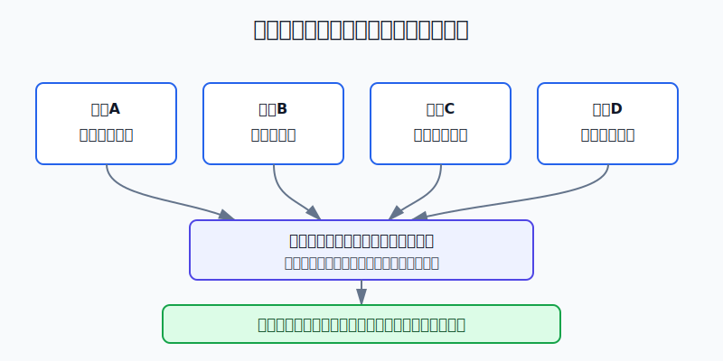
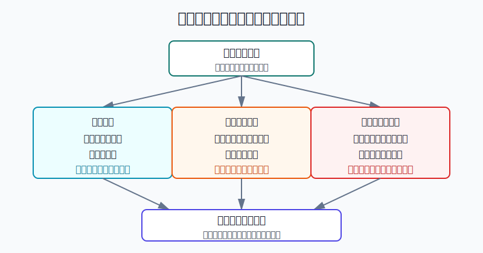
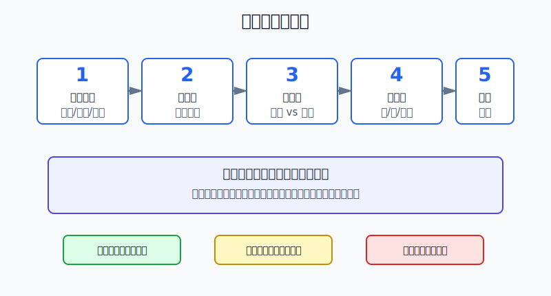

## 散户投资小白金融全品种操盘手册 - 17.11 年度资产配置复盘 - 下一年怎么调
  
### 作者  
digoal  
  
### 日期  
2026-06-07   
  
### 标签  
金融产品 , 金融工具 , 散户 , 投资小白 , 全品操盘手册  
  
----  
  
## 背景 
  

> 适用读者: 已经持有ETF、基金、个股、债券、黄金、港美股或现金类资产，但年底只会问“今年赚没赚、明年买什么”的小白投资者。  
> 本文定位: 投资教育框架，不构成个性化投资建议。规则口径按 2026-06-06 可核查公开资料整理。

## 先问一个反直觉的问题

年度复盘最容易犯的错，不是算错收益，而是把复盘做成预测大会。很多人年底打开账户，第一句话是“明年什么会涨”。真正该问的是: **我的钱还有多久要用，我今年承受了多大波动，现在的仓位还是不是我原来能承受的仓位。**

## 核心概念: 年度复盘不是换一批热门资产，而是重写账户边界

资产配置，就是把钱分到不同风险来源里，比如现金、短债、宽基ETF、行业ETF、个股、黄金、REITs、QDII、美股ETF、港股资产。年度复盘，就是一年结束时检查这张分配表有没有被现实改写。

小白常把年度复盘理解成“总结今年哪个资产涨得好，明年继续追”。这很危险。因为市场涨跌会自动改变你的仓位。股票涨多了，股票占比会变大；债券或黄金跌了，防守资产占比会变小；某个主题涨得猛，它可能从卫星仓变成账户主风险。你没有主动加仓，账户也可能已经变得更激进。

本节行动结论先放在前面: **年度资产配置复盘只做四件事: 重算资金期限，校准最大回撤预算，检查仓位漂移，写出下一年执行单。只有当前提变化或仓位越界时才调仓；如果只是想追今年涨得好的资产，不调。**

## 逻辑推导链

【论证链标题】: 因为年度复盘要解决的是“账户是否仍匹配目标和承受力”，而不是“明年哪个资产涨”，所以调仓必须由资金期限、风险预算和仓位漂移触发。

### 第一步: 前提陈述

前提A: 资金期限会改变。这是变量。今天是5年不用的钱，明年可能变成买房首付、孩子教育金、父母医疗备用金。钱离用途越近，越不能承受大回撤。它像旅行时间表: 离出发还有一年可以慢慢准备，明天就出发就不能再把车送去大修。

前提B: 风险承受力会改变。这是变量。今年亏5%你睡得着，不代表明年亏5%也睡得着。收入变化、家庭支出、年龄、负债、市场经验，都会改变你能承受的最大回撤。

前提C: 市场涨跌会改写实际仓位。这是常量。你定的是“股票60%、债券30%、黄金10%”，但一年后可能变成“股票72%、债券20%、黄金8%”。账户风险不是按你的初始计划运行，而是按当前市值运行。

前提D: 年度预测的稳定性低。这是常量加变量。你可以判断利率、流动性、估值和风险偏好，但不能把“明年一定涨”写进家庭资产配置。预测可以辅助排序，不能替代仓位纪律。

### 第二步: 逻辑推导

由A+B可得: 因为资金用途和风险承受力会变，所以年度复盘第一步不是看收益排行榜，而是重新确认“这笔钱还能投多久、最大能亏多少”。如果时间变短或承受力下降，仓位必须更保守。

由B+C可得: 因为市场涨跌会让实际仓位偏离目标，所以即使你没有主动交易，组合也可能已经超过风险预算。赚钱的资产越涨越大，亏钱的资产越变越小，账户会自动向强势资产集中。

再由C+D可得: 因为预测不稳定，而仓位漂移是已经发生的事实，所以调仓优先处理事实，不优先处理观点。你可以记录明年看好的方向，但不能因为看好就突破单品种、单行业、单市场的上限。

最后由A+B+C+D可得: **年度复盘的核心动作，是把账户拉回“目标、期限、承受力”三者一致的状态。前提没变，只做再平衡；前提变了，先改目标仓位；仓位越界，按阈值调回；只有观点变化但没有数字变化，不动。**

### 第三步: 正常情景下的操作结论

✅ 正常情景: 你是普通散户，有一笔中长期投资资金，持有多个资产，不依赖短线预测赚钱，也没有职业级交易系统。

对应操作: 年底用“四张表”决定下一年怎么调。

| 表 | 要填的数字 | 触发动作 |
|---|---|---|
| 资金期限表 | 1年内、1-3年、3-5年、5年以上分别多少钱 | 1年内要用的钱退出高波动资产 |
| 风险预算表 | 最大可承受回撤、今年最大回撤、明年回撤上限 | 今年已接近承受极限，下一年降风险 |
| 仓位漂移表 | 目标比例、当前比例、偏离比例 | 偏离超过阈值，做再平衡 |
| 执行单 | 买什么、卖什么、不碰什么、何时复查 | 下一年照单执行，减少临时下单 |

一个小白可用的阈值: 核心资产偏离目标5个百分点以内，只记录；偏离5-10个百分点，用新增资金和定投方向慢慢修；偏离超过10个百分点，才考虑卖出超配资产、补回低配资产。这个阈值不是法律，也不是收益保证，它的作用是防止你因为一点波动就频繁交易。

### 第四步: 数据和案例证实

证据1: SEC在《Beginners' Guide to Asset Allocation, Diversification, and Rebalancing》中说明，资产配置取决于资金期限和风险承受力；随着投资目标临近，投资者通常需要调整配置。SEC还给了一个直观例子: 如果原计划股票占60%，市场上涨后股票变成80%，就需要卖出部分股票或买入低配资产，把组合拉回原来的配置。这个证据对应前提A和C: 年度复盘处理的是目标、期限和仓位漂移，不是追涨。

证据2: FINRA在《Asset Allocation and Diversification》中提醒，市场表现会改变各类资产市值，使组合不再提供原来想要的增长和风险平衡；虽然没有官方固定时间表，但可以把每年一次的投资检查作为再平衡时点。FINRA列出的三种做法是: 把资金转向低配资产、用新增资金补低配资产、卖出部分表现较好的资产再投向低配资产。这个证据对应前提C: 调仓不是凭感觉，而是把偏离拉回目标。

证据3: S&P Dow Jones Indices的2025年12月《Market Attributes: U.S. Equities》报告显示，S&P 500 Total Return在2022年为-18.11%，2023年为+26.29%，2024年为+25.02%，2025年为+17.88%。这对应前提D: 同一个大类资产年度表现会快速切换，不能把上一年的涨跌直接当作下一年的答案。

证据4: BlackRock的iShares 20+ Year Treasury Bond ETF事实表显示，截至2026年3月31日，TLT的NAV年度表现为2022年-31.41%，2023年+2.96%，2024年-7.84%，2025年+4.17%，且该基金有效久期为15.33年。这个证据对应前提C和D: “债券”也不是无波动资产，尤其是长久期债券。年度复盘必须看你买的到底是什么风险，而不是只看资产名字。

失败案例: 小林2024年底看到美股和科技主题连续上涨，就把原本20万元账户从“60%宽基、25%短债现金、10%黄金、5%主题”改成“80%美股和科技、10%黄金、10%现金”。他的理由是“过去两年都涨”。问题不是美股一定会跌，而是他把预测写进了仓位，还把防守资产砍掉。假如下一年权益资产回撤25%，他的账户单靠权益部分就可能损失约4万元，占总账户20%，已经超过很多小白的承受线。失败点在于: 他没有先问资金期限和回撤预算，而是让上一年收益决定下一年仓位。

历史数据不代表未来。上面证据仍有参考价值，是因为它们验证的是结构规律: 仓位会漂移，资金期限会改变，不同资产年度表现会切换，资产名字不能替代风险识别。

### 第五步: 前提变化时的替代结论

若前提A改变，也就是明年有买房、结婚、教育、医疗或创业备用金需求，推导路径变为: 因为资金期限缩短，所以不能继续承受权益、商品、长债和高波动主题的回撤。新结论: 把这部分钱转入现金、货币基金、短债或存款类安排，不用它追求高收益。

若前提B改变，也就是今年最大回撤已经让你睡不好、影响工作或破坏交易纪律，推导路径变为: 因为真实承受力低于纸面承受力，所以明年要降低风险资产上限。新结论: 降低主题、个股、杠杆和高波动资产比例，保留更高现金垫。

若前提C恶化，也就是某类资产上涨后超过目标10个百分点以上，推导路径变为: 因为账户已经被市场推向集中，所以不能继续加仓赢家。新结论: 用再平衡把它拉回目标区间。

若只有前提D变化，也就是你对明年市场更乐观或更悲观，但资金期限、风险预算、仓位偏离都没变，推导路径变为: 因为观点不等于事实，所以不允许大幅改仓。新结论: 最多调整卫星仓，不动核心仓。

反例: 年度复盘不是每年都必须大换仓。如果你的资金期限没变，最大回撤在预算内，仓位偏离小于5个百分点，持仓逻辑没有破坏，正确动作就是记录，不交易。少动也是一种操作。

## 实操例子: 20万元账户年底怎么调

这个例子对应论证链的核心结论: **先检查前提，再决定目标仓位；先处理偏离，再讨论明年观点。**

假设小林有20万元投资资金，原目标是: A股宽基30%，美股宽基25%，短债和现金25%，黄金10%，行业主题10%。年底账户涨到22万元，当前持仓如下:

| 资产 | 当前市值 | 当前占比 | 原目标 | 偏离 |
|---|---:|---:|---:|---:|
| A股宽基ETF | 56000元 | 25.5% | 30% | -4.5个百分点 |
| 美股宽基QDII | 76000元 | 34.5% | 25% | +9.5个百分点 |
| 短债和现金 | 39000元 | 17.7% | 25% | -7.3个百分点 |
| 黄金ETF | 19000元 | 8.6% | 10% | -1.4个百分点 |
| 行业主题ETF | 30000元 | 13.6% | 10% | +3.6个百分点 |

第一步，重算资金期限。小林发现明年可能要拿3万元装修，期限只有12个月。这个前提A改变，所以这3万元不能继续放在权益资产里。动作: 先从整体账户中划出3万元现金或短债，不参与下一年的进攻仓。

第二步，校准风险预算。小林今年最大回撤是8%，还能接受；但如果美股和行业主题同时回撤25%，账户损失可能超过2.6万元。小林给下一年设的最大回撤线是12%，也就是22万元账户最多希望控制在约2.64万元以内。结论: 美股和主题合计48.1%，偏激进，不能继续加。

第三步，检查仓位漂移。美股宽基目标25%，当前34.5%，偏离9.5个百分点，接近需要处理的区间；短债现金目标25%，当前17.7%，低配7.3个百分点。结论: 不需要因为美股涨得好继续追，应该优先补短债现金。

第四步，定调仓动作。小林不一次性大换仓，而是做三件事: 卖出美股宽基12000元，把其中10000元补到短债现金，2000元补到A股宽基；暂停行业主题新增资金；明年定投只投A股宽基和短债现金，直到现金短债回到25%左右。

第五步，写下一年执行单。执行单不是一句“看情况”，而是写成数字:

| 条目 | 下一年规则 |
|---|---|
| 现金短债 | 低于22%时，所有新增资金先补现金短债 |
| 美股宽基 | 高于32%不新增，高于35%分批降到30%以内 |
| 行业主题 | 上限10%，超过12%只减不加 |
| 黄金 | 8%-12%之间不动，低于8%再考虑补 |
| 复查频率 | 每季度看一次，非极端情况不月月调仓 |

如果前提不成立，动作要切换。比如小林明年没有装修需求，收入稳定，回撤承受力提高，美股也只是偏离3个百分点，那他不需要卖出美股，只要把新增资金投向低配资产即可。

如果操作错误，常见后果是把年度复盘变成追涨。小林若看到美股涨得好，又把短债现金砍到5%，账户就失去缓冲。真正回撤来时，他会被迫在低点卖风险资产去满足现金需求。纠偏方法是先补现金桶，再谈收益。

## 可复用框架

【四表复盘】

适用前提: 你每年至少能整理一次全部账户，包括证券账户、基金账户、港美股账户、现金和债券类资产。

核心逻辑: 因为年度调仓必须由前提和数字触发，所以用资金期限、风险预算、仓位漂移、执行单四张表约束动作。

操作步骤:

1. 资金期限表: 把1年内要用的钱先拿出来，不放高波动资产。
2. 风险预算表: 写出最大可承受回撤，并检查今年真实回撤是否超出承受力。
3. 仓位漂移表: 比较目标比例和当前比例，偏离小就不交易，偏离大才调仓。
4. 执行单: 写出下一年加什么、减什么、不碰什么、何时复查。

前提失效时: 如果资金期限突然缩短，先改资金桶；如果回撤承受力下降，先降风险资产上限；如果只是观点变了，不允许大幅改核心仓。

举一反三: 这个框架可以用于家庭年度资产配置、ETF组合、港美股组合、退休账户和孩子教育金账户。

【偏离阈值】

适用前提: 你已经有目标仓位，比如宽基、债券现金、黄金、主题、海外资产各占多少。

核心逻辑: 因为频繁调仓会增加成本和情绪干扰，所以只在偏离达到阈值时行动。

操作步骤:

1. 偏离5个百分点以内: 只记录，不交易。
2. 偏离5-10个百分点: 用新增资金、定投方向和分红现金慢慢修。
3. 偏离超过10个百分点: 考虑卖出超配资产，补回低配资产。
4. 调完后写下一次复查日期，不因为短期涨跌反复改。

前提失效时: 如果遇到流动性风险、保证金风险、家庭急用钱，先处理现金和安全边界，阈值规则让位于生存问题。

举一反三: 这个框架也适用于单行业ETF、单只个股、可转债组合、黄金仓位和跨境ETF溢价控制。

## 本节行动清单

| 动作 | 合格标准 |
|---|---|
| 列全账户 | 把现金、基金、ETF、股票、债券、黄金、港美股都算进总资产 |
| 分资金期限 | 1年内要用的钱不放高波动资产 |
| 写最大回撤 | 用具体百分比，不写“我能承受一点亏损” |
| 算仓位漂移 | 每个资产写目标比例、当前比例、偏离比例 |
| 设再平衡阈值 | 先用5%、10%两档，避免频繁交易 |
| 写下一年执行单 | 明确加什么、减什么、不碰什么、何时复查 |
| 不追年度冠军 | 今年涨得好不是明年重仓的充分理由 |

## 一句话总结

年度资产配置复盘不是问“明年什么会涨”，而是问“我的钱还能承受什么风险”；下一年怎么调，先看资金期限、风险预算和仓位漂移，再看市场观点。

## 参考资料

- U.S. SEC: Beginners' Guide to Asset Allocation, Diversification, and Rebalancing, https://www.sec.gov/about/reports-publications/investorpubsassetallocationhtm
- FINRA: Asset Allocation and Diversification, https://www.finra.org/investors/investing/investing-basics/asset-allocation-diversification
- S&P Dow Jones Indices: Market Attributes: U.S. Equities December 2025, https://www.spglobal.com/spdji/en/documents/commentary/market-attributes-us-equities-202512.pdf
- BlackRock: iShares 20+ Year Treasury Bond ETF Fact Sheet, as of 2026-03-31, https://www.blackrock.com/us/individual/literature/fact-sheet/tlt-ishares-20-year-treasury-bond-etf-fund-fact-sheet-en-us.pdf

> ⚠️ **声明**：本文内容为投资教育目的，所有历史数据、策略框架均为辅助学习工具，不构成证券投资建议。市场有风险，投资需谨慎。实际操作请结合自身风险承受能力，必要时咨询专业投顾。
  
#### [PostgreSQL 解决方案集合](../201706/20170601_02.md "40cff096e9ed7122c512b35d8561d9c8")
  
  
#### [德哥 / digoal's Github - 公益是一辈子的事.](https://github.com/digoal/blog/blob/master/README.md "22709685feb7cab07d30f30387f0a9ae")
  
  
#### [About 德哥](https://github.com/digoal/blog/blob/master/me/readme.md "a37735981e7704886ffd590565582dd0")
  
  

  
