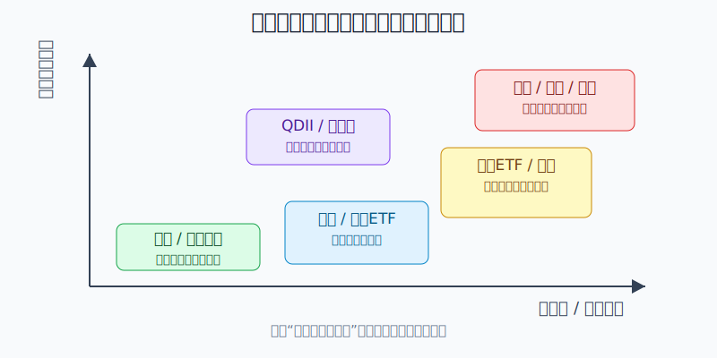
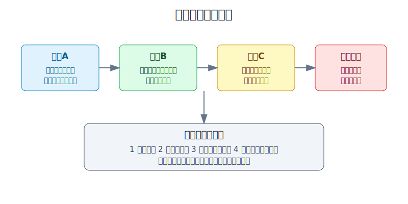
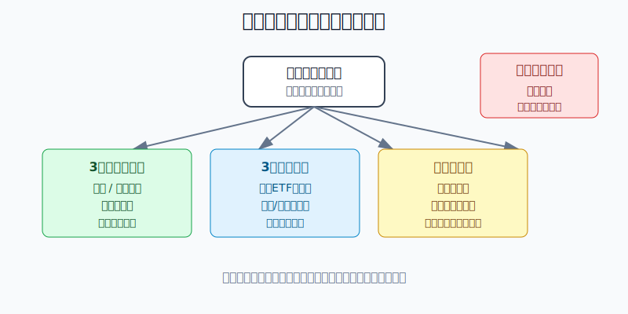

## 散户投资小白金融全品种操盘手册 - 附录.1 散户可参与金融工具对照表 - 门槛、风险、流动性、适合人群
  
### 作者  
digoal  
  
### 日期  
2026-06-08   
  
### 标签  
金融产品 , 金融工具 , 散户 , 投资小白 , 全品操盘手册  
  
----  
  
## 背景 
  

> 适用读者: 已经知道市场上有很多工具，但不知道自己到底能碰哪些、应该先学哪些、哪些要暂时放进禁买清单的小白投资者。  
> 本文定位: 附录工具总表，不构成个性化投资建议。规则和数据口径按 2026-06-06 可核查公开资料整理，实际开户和交易以交易所、监管机构、券商和基金公告最新规则为准。

## 先问一个反直觉的问题

散户亏钱，很多时候不是因为少知道一个消息，而是因为**拿错了工具**。短期要用的钱拿去买股票，想稳健的钱拿去碰期权，想配置海外资产却忽略汇率和合规边界，这些错误在下单前就已经埋好了。

## 核心概念: 工具不是收益标签，是风险容器

银行存款、货币基金、ETF、个股、可转债、黄金、REITs、QDII、港股通、美股、期权、期货，看上去都叫“投资”。但它们装的风险完全不同。

存款装的是银行信用和期限风险。货币基金装的是低风险债券和流动性风险。ETF装的是一篮子资产的市场波动。个股装的是一家公司经营、估值和情绪的风险。期权和期货装的是杠杆、保证金、到期日和强平风险。港股、美股、QDII还会额外装进汇率、交易规则、税务和跨境合规风险。

所以本节不是告诉你哪个工具最赚钱，而是给你一张“先筛掉不合适工具”的地图。**小白的默认动作是先匹配，不是先追收益。**

## 逻辑推导链

【论证链标题】: 因为散户可选工具越来越多，但每种工具的门槛、风险和流动性不同，所以小白必须先按“能不能买、亏什么、能不能退出、适不适合自己”筛选工具，再决定是否下单。

### 第一步: 前提陈述

前提A: 市场入口很低，工具供给很多，这是常量。中国结算2024年统计年报显示，2024年期末投资者数为23,680.34万，沪深A股5,123只，ETF 1,043只。中基协2026年4月公募基金市场数据也显示，境内公募基金资产净值合计39.36万亿元。对小白来说，市场像一个巨大商场，门口很宽，但货架上既有矿泉水，也有烈酒和电锯。

前提B: 工具自带规则，不会因为你是新手就降低伤害，这是常量。比如交易所规则体系中，场内股票和基金交易有基本申报单位；创业板新开权限个人投资者有10万元和24个月证券交易经验要求；科创板、港股通、股票期权、融资融券等工具还有更高门槛或额外经验要求。这些规则说明: 工具不是随便点一下就能安全使用。

前提C: 每个人的资金期限、风险承受能力、知识水平不同，这是变量。同样10万元，3个月后要交学费，和5年不用，是两笔完全不同的钱；同样买ETF，买宽基ETF和买高溢价跨境ETF，也是两种不同的风险。

前提D: 当工具和人不匹配时，亏损会从“市场波动”变成“结构性错误”，这是常量。结构性错误就是: 你本来只想赚一点收益，却拿了会强平的工具；你本来需要随时取钱，却买了波动资产；你本来只是想配置海外，却忽略汇率、额度、税务和合规边界。

### 第二步: 逻辑推导

由A+B可得: 因为工具很多，而且每种工具都有不同规则，所以“能买”不等于“该买”。开户成功只是拿到入场券，不是通过了风险考试。

由B+C可得: 因为工具规则固定，而你的资金期限和能力会变化，所以同一个工具对不同人不是同一种东西。宽基ETF对长期资金是核心资产候选，对下个月要用的钱就是错误工具。

再由A+B+C+D可得: 因为工具多、规则硬、个人前提不同，而工具不匹配会放大亏损，所以散户必须按四个问题筛选: 第一，能不能合法合规参与；第二，最坏亏的是什么；第三，什么时候能退出；第四，自己能不能解释清楚。

最后结论是: **散户选择工具的顺序不是收益率排序，而是匹配排序。四问有一问答不清，就降级到更简单的工具。**

### 第三步: 正常情景下的操作结论

✅ 正常情景: 你是普通个人投资者，没有成熟交易系统，没有稳定读财报和管理杠杆的能力，这笔投资资金亏多了会影响情绪和生活安排。

对应操作: 先把工具分成四层。

第一层是现金和低风险工具: 存款、货币基金、国债逆回购、短债基金。它们不是用来暴富的，是用来保证账户不缺氧。

第二层是核心配置工具: 宽基ETF、债券ETF、黄金ETF、部分QDII基金。它们适合作为学习和组合底座，但仍要看费用、规模、流动性、折溢价和资金期限。

第三层是进攻和研究工具: 行业ETF、个股、可转债、REITs、高股息资产。它们需要你能解释收益来源、风险来源和卖出条件。

第四层是复杂工具: 融资融券、期权、期货、黄金T+D、杠杆和反向产品、境外券商账户。对小白来说，这一层默认不是实盘工具；先学习、模拟、核对规则，不能用来翻本。

### 第四步: 数据和案例证实

证据1: 中国结算2024年统计年报显示，2024年期末投资者数23,680.34万，沪深A股5,123只，ETF 1,043只。这个证据对应前提A: 投资入口足够大，产品数量足够多，小白必须先学分类。

证据2: 中基协发布的2026年4月公募基金市场数据显示，境内公募基金资产净值合计39.36万亿元。这个证据也对应前提A: 基金已经是普通投资者参与市场的重要入口，但“公募基金”下面仍有货币、债券、股票、混合、QDII、ETF等多种风险层级。

证据3: 多项适当性规则证明前提B。创业板新增个人投资者要求申请权限开通前20个交易日日均资产不低于10万元并参与证券交易24个月以上；科创板个人投资者要求20个交易日日均资产不低于50万元并参与证券交易24个月以上；港股通个人投资者通常要求20个交易日日均资产不低于50万元；上交所股票期权个人投资者要求申请开户前20个交易日日均证券市值与资金可用余额合计不低于50万元，并满足6个月交易经历等条件；融资融券规则中，证券公司不得为从事证券交易时间不足半年、最近20个交易日日均证券类资产低于50万元等客户开立信用账户。门槛不是为了制造神秘感，而是在提醒你: 工具越复杂，错误越贵。

证据4: 存款和货币基金的规则说明“低风险”也不等于“没有规则”。《存款保险条例》规定同一存款人在同一家投保机构的被保险存款本息在最高偿付限额50万元以内全额偿付；2018年央行和证监会规范货币市场基金互联网销售和赎回服务，对单个投资者持有的单只货币市场基金，在单一销售机构单日T+0赎回提现额度设定不高于1万元。这个证据对应前提B和C: 连现金管理工具都要看额度、期限和流动性。

失败案例1: “原油宝”事件说明，产品名字简单不代表底层风险简单。2020年12月，银保监会通报对中国银行“原油宝”产品风险事件作出行政处罚，对中国银行及其分支机构合计罚款5050万元，并指出产品管理、风险管理、内控管理、销售管理等问题。普通投资者以为自己买的是“原油价格”，实际碰到的是期货合约、移仓、极端价格和产品规则的综合风险。

失败案例2: 跨境工具也不能只看App体验。2026年5月22日，证监会通报依法查处老虎、富途、长桥等机构非法跨境展业案件，指出相关主体未经核准在境内开展证券交易营销推广、处理交易指令等证券服务并获取收益，违反证券基金期货法律法规。这个案例对应前提B和D: 对内地投资者来说，境外账户不是单纯的“多一个交易入口”，还涉及业务许可、跨境服务、资金出入、税务和监管边界。

历史案例不代表未来会重复，但它们验证的是稳定规律: 工具越复杂，越不能只看收益页面；底层规则看不懂，亏损就会从价格波动变成规则风险。

### 第五步: 前提变化时的替代结论

若前提C改变，也就是这笔钱3个月内要用，推导路径变为: 因为资金期限短，所以任何会出现明显净值波动、交易折价或赎回延迟的工具都不匹配。新结论: 只放存款、货币基金、国债逆回购等现金管理工具，并预留到账时间。

若前提B强化，也就是某个工具有资产门槛、经验门槛、知识测试、保证金或合规限制，推导路径变为: 因为工具已经要求更高适当性，所以不能绕开门槛硬上。新结论: 通过公募基金、宽基ETF、模拟盘或学习账户替代直接交易。

若前提D出现，也就是你开始想用融资、期权、期货或杠杆产品回本，推导路径变为: 因为情绪已经替代规则，复杂工具会放大错误。新结论: 当天停止新增交易，回到现金仓和复盘表。

反例: 如果你已经留足生活费，投资期限超过3年，能接受20%-30%的阶段性回撤，并且能解释宽基ETF跟踪什么指数、费用多少、如何分批和再平衡，那么宽基ETF就不是危险工具，而是可以进入核心仓候选。关键不是工具名字，而是前提是否成立。

## 散户工具对照表

这张表的用法很简单: 先看“适合什么钱”，再看“最怕什么错”。如果某一行的“最怕的错”正好是你现在最容易犯的错，就先不碰。

| 工具 | 常见参与门槛 | 核心风险 | 流动性 | 更适合的人 | 最怕的错 |
|---|---|---|---|---|---|
| 银行存款 | 银行账户；注意单家银行存款保险50万元限额 | 银行信用、提前支取利息变化、单一银行集中 | 通常高，定期提前支取会损失利息 | 生活钱、短期钱、防守钱 | 把所有钱集中在单家机构，忽略本息合计限额 |
| 货币基金 | 基金账户或证券账户；快速赎回有额度规则 | 收益下行、流动性安排、不是存款 | 较高，普通赎回和快速赎回规则不同 | 备用金、短期闲钱 | 把T+0快赎当成无限额银行卡 |
| 国债逆回购 | 证券账户；按交易所规则下单 | 利率波动、到期日安排错误 | 到期自动回款，节假日前要看占款天数 | 几天到几周的闲钱 | 没看资金可用日，影响后续用钱 |
| 短债基金 / 债券基金 | 基金账户；无统一资产门槛 | 利率风险、信用风险、净值波动 | 开放式基金按申赎规则，场内债券ETF按交易规则 | 防守资金和中短期配置资金 | 以为债券基金等于保本 |
| 宽基ETF | 证券账户；场内买入通常100份起 | 市场波动、跟踪误差、折溢价、流动性 | 场内交易较便利，股票ETF通常T+1 | 长期资金、核心仓学习者 | 用短期钱追涨，或者买成交稀疏的小ETF |
| 行业 / 主题ETF | 证券账户；通常100份起 | 行业集中、估值过热、主题退潮 | 取决于规模和成交量 | 能解释行业周期的人 | 把热点当核心仓，越涨越加 |
| A股个股 | 证券账户；主板规则相对基础，创业板/科创板另有权限要求 | 公司经营、估值、财务、退市、情绪波动 | 取决于成交量和停牌风险 | 能读公告、财报并写卖出条件的人 | 单票重仓，用消息代替研究 |
| 创业板 / 科创板股票 | 创业板新增个人投资者通常10万元+24个月；科创板通常50万元+24个月 | 高波动、估值不确定、技术和商业模式变化 | 取决于个股流动性 | 有经验且能承受高波动的人 | 只因为名字有科技感就买 |
| 可转债 | 证券账户和对应权限；不同券商有适当性流程 | 正股波动、溢价率、强赎、信用风险 | 场内交易便利，但个券流动性分化 | 能看价格、溢价率、强赎条款的人 | 只看低价，不看信用和强赎 |
| 黄金ETF / 实物黄金 | 证券账户或银行/金店渠道 | 金价波动、买卖价差、保管、汇率和实际利率变化 | 黄金ETF较便利，实物黄金价差更大 | 防守资产配置者 | 把黄金当短线暴富工具 |
| 公募REITs / 高股息资产 | 证券账户或基金账户 | 项目经营、分红波动、估值波动、流动性 | REITs场内交易但规模和成交量分化 | 需要现金流型资产学习的人 | 只看分派率或股息率，不看资产质量 |
| QDII基金 / 跨境ETF | 基金账户或证券账户；受额度、溢价和申赎规则影响 | 海外市场波动、汇率、额度、折溢价、时差 | QDII赎回较慢，跨境ETF场内交易但会有溢价 | 想做全球配置、能接受汇率波动的人 | 高溢价追买，忽略汇率和到账时间 |
| 港股通 | A股账户基础上开通权限；个人通常20个交易日日均资产不低于50万元 | 港股波动、汇率、交易制度、税费、标的范围 | 港股T+0交易、T+2交收，具体以港股通规则为准 | 已有A股经验且能理解港股规则的人 | 以为港股便宜就一定安全 |
| 美股 / 境外账户 | 路径、牌照、税务、资金出入境和跨境展业规则需逐项核对 | 市场波动、汇率、税务、券商监管、跨境合规 | 取决于账户和市场规则 | 有合规意识、能读英文信息披露的人 | 只看App能下单，不查业务许可和资金规则 |
| 融资融券 | 信用账户；监管规则要求交易经验和资产门槛 | 杠杆、利息、担保比例、强平 | 流动性取决于标的和担保物 | 有成熟风控的人 | 借钱补仓、越亏越加杠杆 |
| 股票期权 | 期权账户；通常50万元、交易经历、知识测试等适当性要求 | 到期归零、波动率、保证金、卖方大亏 | 合约流动性分化，临近到期风险高 | 能算最大亏损和希腊字母的人 | 把期权当彩票或裸卖收租 |
| 期货 / 黄金T+D | 期货或黄金账户；金融期货和特定品种有资金、经验、测试要求 | 杠杆、每日结算、追加保证金、强平、跳空 | 主力合约较好，极端行情会变差 | 专门学习风控且极小仓试错的人 | 满仓、借钱、扛单、反复补保证金 |

## 实操例子: 20万元账户怎么用这张表

这个例子对应论证链的正常结论: **先匹配资金期限和能力，再选择工具层级。**

假设小林有20万元可投资资金，已经留足6个月生活费。他刚开始系统学习，没有期权、期货和融资融券经验，也不想因为投资影响家庭现金流。

第一步，先分资金期限。未来6个月可能用到的5万元，不进入波动资产，只放存款、货币基金或国债逆回购。理由对应前提C: 短期钱不能承受净值波动和退出不确定。

第二步，建立防守层。小林把6万元放进货币基金、短债基金和少量债券ETF观察，不追求高收益，只要求自己能解释利率风险和信用风险。理由对应前提B: 低风险工具也要看规则，不等于保本。

第三步，建立核心层。小林把6万元作为未来宽基ETF核心仓预算，但不一次买满。他先用2万元分批买流动性好的宽基ETF，剩余4万元按月投入或等再平衡信号。理由对应论证链结论: 长期资金可以进入核心工具，但仓位要分批。

第四步，建立学习层。小林最多拿2万元做行业ETF、可转债或黄金ETF的学习仓，单个主题不超过总账户5%。任何买入都必须写三句话: 我买的是什么风险，错了在哪里卖，仓位为什么不超过这个数。

第五步，复杂工具先不实盘。融资融券、股票期权、期货、黄金T+D、境外券商账户都进入学习清单，不进入真实仓位。理由对应前提D: 他现在没有管理杠杆、到期日、保证金和跨境合规的能力。

如果前提改变，操作也要变。比如小林明年要买房，核心ETF预算就要降级成现金管理；如果他已经连续一年复盘、能读财报、能控制单票仓位，再给个股小仓位研究资格；如果他亏损后想开融资融券回本，当天停止新增交易，先复盘而不是升级工具。

如果操作错误，后果很具体。小林若把20万元里的15万元拿去买单一行业ETF，一次行业回撤20%，账户就亏3万元，情绪会立刻破坏后续计划；若再用融资补仓，亏损会从市场波动升级为杠杆风险。正确纠偏不是“再找更猛的工具”，而是回到表格: 降级、减仓、复盘。

## 可复用框架

【四问筛选】

适用前提: 你准备买任何一个新工具，但还不确定是否适合自己。

核心逻辑: 因为工具不匹配会把普通波动变成结构性错误，所以先问规则和风险，再问收益。

操作步骤:

1. 问门槛: 我能不能合法合规参与，是否需要权限、资产、经验或测试。
2. 问亏损: 最坏亏什么，是净值波动、本金损失、强平、到期归零，还是规则和汇率风险。
3. 问退出: 什么时候能卖出或赎回，是否有停牌、限额、折溢价、流动性和到账延迟。
4. 问能力: 我能不能用自己的话解释收益来源、风险来源和失效条件。

前提失效时: 四问任意一问答不清，工具降级；如果情绪是回本、攀比、怕踏空，当天不升级工具。

举一反三: 这个框架适用于ETF、个股、转债、REITs、港美股、期权、期货和任何新产品。

【三层工具】

适用前提: 你想把账户从乱买，改成有层次的组合。

核心逻辑: 因为不同资金承担不同任务，所以工具必须先分层。

操作步骤:

1. 现金层: 存款、货币基金、国债逆回购，负责随时可用。
2. 核心层: 宽基ETF、债券ETF、黄金ETF或合适的QDII，负责长期配置。
3. 学习层: 行业ETF、个股、可转债、REITs等，负责小比例研究和试错。

前提失效时: 学习层亏损影响情绪，就降仓；核心层资金期限变短，就转回现金层；出现杠杆翻本冲动，停止交易。

举一反三: 后面做A股、美股、港股、黄金、商品、期权和期货，都先问这笔钱属于哪一层。

## 本节行动清单

| 动作 | 合格标准 |
|---|---|
| 给每笔钱贴期限标签 | 3个月内、1年内、3年以上分别处理 |
| 写工具四问 | 门槛、亏损、退出、能力四项都能答清 |
| 先配现金层 | 生活钱和短期钱不进入波动资产 |
| 核心仓先用简单工具 | 宽基ETF、债券、黄金等先于个股和复杂工具 |
| 学习仓设上限 | 单个主题、单只个股、单个复杂工具都不能越界 |
| 复杂工具先模拟 | 融资、期权、期货、黄金T+D不用于翻本 |
| 每季度更新表格 | 规则、门槛、额度、税费变化后重新核对 |

## 一句话总结

散户选工具，先别问哪个最猛，先问哪个工具的门槛、风险、流动性和自己的资金期限匹配；匹配了，收益才有意义，不匹配，机会会变成伤口。

## 参考资料

- 中国证券登记结算有限责任公司: 《2024年统计年报》，https://www.chinaclear.cn/zdjs/tjnb/202506/542ecc4ea6e14595ac34be6843c7ebb5/files/2024%E5%B9%B4%E7%BB%9F%E8%AE%A1%E5%B9%B4%E6%8A%A5.pdf
- 中国证券投资基金业协会: 《公募基金市场数据（2026年4月）》，https://www.amac.org.cn/sjtj/tjbg/gmjj/202605/P020260527642499680112.pdf
- 上海证券交易所: 《上海证券交易所交易规则（2023年修订）》，https://www.sse.com.cn/lawandrules/sselawsrules2025/trade/universal/c/c_20250612_10781695.shtml
- 深圳证券交易所投资者教育: 《参与创业板交易的投资者需要满足哪些条件？》，https://www.szse.cn/www/investor/knowledge/t20200527_577693.html
- 上海证券交易所投教: 《第三期：聚焦科创板投资者适当性管理》，https://edu.sse.com.cn/tib/qa/c/4752417.shtml
- 上海证券交易所: 《股票期权试点投资者适当性管理指引》，https://www.sse.com.cn/lawandrules/sselawsrules2025/option/c/c_20250610_10781453.shtml
- 中国证监会: 《证券公司融资融券业务管理办法》，https://www.csrc.gov.cn/csrc/c106256/c1654005/content.shtml
- 中国金融期货交易所: 《交易者适当性制度管理办法》，https://www.cffex.com.cn/u/cms/www/202003/271635174xwg.pdf
- 中国政府网: 《存款保险条例》，https://www.gov.cn/zhengce/content/2015-03/31/content_9562.htm
- 上海证券交易所转发监管公告: 《关于进一步规范货币市场基金互联网销售、赎回相关服务的指导意见》，https://www.sse.com.cn/lawandrules/regulations/csrcannoun/c/10117397/files/23a67f3f5c7f451f9126b79e53dec868.pdf
- 中国证监会: 《证监会严肃查处老虎等机构非法跨境展业案件》，https://www.csrc.gov.cn/csrc/c100028/c7634330/content.shtml
- 新浪财经转引银保监会官网消息: 《因“原油宝”事件，中国银行被罚5050万元》，https://finance.sina.com.cn/wm/2020-12-05/doc-iiznctke4979589.shtml

> ⚠️ **声明**：本文内容为投资教育目的，所有历史数据、策略框架均为辅助学习工具，不构成证券投资建议。市场有风险，投资需谨慎。实际操作请结合自身风险承受能力，必要时咨询专业投顾。
  
#### [PostgreSQL 解决方案集合](../201706/20170601_02.md "40cff096e9ed7122c512b35d8561d9c8")
  
  
#### [德哥 / digoal's Github - 公益是一辈子的事.](https://github.com/digoal/blog/blob/master/README.md "22709685feb7cab07d30f30387f0a9ae")
  
  
#### [About 德哥](https://github.com/digoal/blog/blob/master/me/readme.md "a37735981e7704886ffd590565582dd0")
  
  

  
