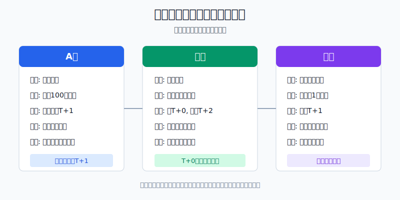
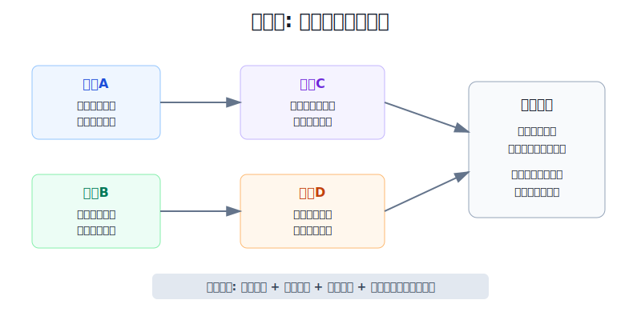
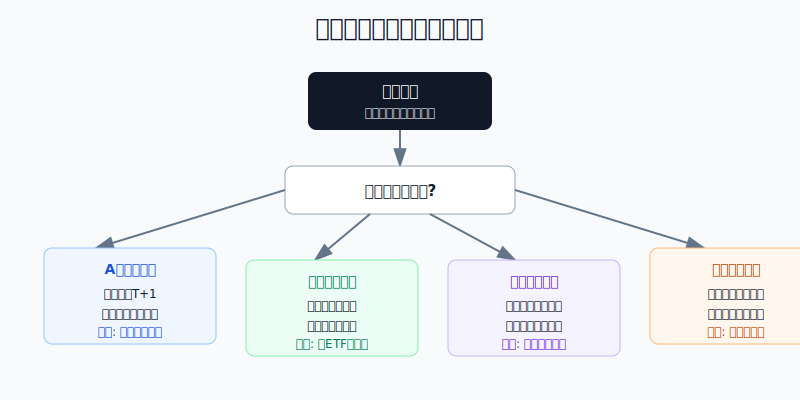

## 散户投资小白金融全品种操盘手册 - 附录.2 A股、港股、美股交易规则对照表
  
### 作者  
digoal  
  
### 日期  
2026-06-07   
  
### 标签  
金融产品 , 金融工具 , 散户 , 投资小白 , 全品操盘手册  
  
----  
  
## 背景 
  

> 适用读者: 已经知道三地市场都可以买股票，但还没有把交易时间、交易单位、T+0/T+1、涨跌幅、费用和账户权限放在一张表里比较的小白投资者。  
> 本文定位: 投资教育框架，不构成税务、法律或证券投资建议。规则口径按 2026-06-06 可核查公开资料整理，实操前以交易所、结算机构和券商最新提示为准。

## 先问一个反直觉的问题

同样是“买100股股票”，在A股、港股、美股里，可能是三件完全不同的事。A股普通股票当天买入通常不能当天卖出；港股可以买了当天卖，但一手可能不是100股；美股看起来灵活，却会把时差、结算资金和账户权限一起丢给你。**规则没翻译清楚，买入理由越自信，越容易在执行环节亏错。**

## 核心概念: 交易规则不是说明书，是仓位的一部分

把三地市场想成三条高速路。车都是车，但限速、收费站、车道宽度、掉头规则都不同。

**交易时间**决定你什么时候能用比较正常的盘口成交。A股和港股都在白天交易，但港股有开市前、午休、收市竞价；美股按美东时间交易，中国投资者经常在夜里看盘。

**交易单位**决定你最小要买多少。A股小白习惯一手100股；港股每手股数由发行人决定，一手金额可能很大；美股通常能按1股交易，部分券商还有碎股，但碎股规则由券商决定。

**回转和交收**决定你能不能当天纠错。A股普通股票通常是T+1回转；港股可以T+0日内买卖，但交收是T+2；美股可以日内交易，但现金账户要管已结算资金，保证金账户要管日内保证金规则。

**价格保护和账户权限**决定最坏情景怎么发生。A股多数股票有涨跌幅限制；港股和美股没有普遍意义上的日涨跌停，更多依靠市场波动调节、个股停牌、LULD和熔断等机制。没有涨跌停，不等于风险更小，而是价格可以用另一种方式快速变化。

所以本节的行动结论先放在前面: **下单前先把三地规则翻译成四句话: 现在是不是合适时段，最小买入金额是多少，当天能不能卖，错误发生时账户会怎么处理。四句话写不清，就不下单。**

## 逻辑推导链

【论证链标题】: 因为A股、港股、美股的交易时间、最小单位、回转交收和账户权限不同，所以同样的买卖动作必须先做规则翻译，不能直接跨市场照搬。

── 第一步: 前提陈述

前提A: 三地交易时间不同。这是常量。A股按北京时间日盘运行；深交所公开交易概览列出开盘集合竞价9:15至9:25，连续竞价9:30至11:30、13:00至14:57，收盘集合竞价14:57至15:00。港交所证券市场有9:00至9:30开市前时段、9:30至12:00和13:00至16:00连续交易、16:00后收市竞价。美股常规核心交易时间按美东时间9:30至16:00，盘前盘后还要看交易所和券商支持。

前提B: 三地最小交易单位不同。这是常量。A股普通股票买入通常按100股或其整数倍；港股的每手股数不是统一100股，而是由发行人决定；美股通常可以1股为单位交易，碎股交易则取决于券商。

前提C: 三地回转和交收不同。这是常量加变量。A股普通股票通常实行T+1回转，今天新买的普通股票不能靠当天卖出纠错。香港投委会说明，港股交收及结算周期为T+2，但可以即日买卖，也就是T+0回转。美国证券市场从2024-05-28起，多数证券标准交收周期改为T+1，但日内买卖还要看现金账户、保证金账户和券商规则。

前提D: 三地价格保护和账户权限不同。这是变量。A股多数股票有涨跌幅限制，深交所交易概览列出普通股票和基金常见价格限制比例为10%，ST或*ST股票为5%，特殊情形另行处理。港股没有普遍日涨跌停，但有市场波动调节机制和个股停牌等安排。美股没有A股式日涨跌停，盘前盘后、LULD、市场熔断和券商订单规则共同影响成交。

前提E: 小白最容易犯的错误，是把“能交易”理解成“适合交易”。这是变量，但要按高概率风险处理。港股T+0会诱发频繁买卖，美股盘前盘后会诱发抢跑，A股T+1会让人低估当天买错后的退出限制。

── 第二步: 逻辑推导

由A可得: 因为交易时间不同，所以你不能只看行情软件价格在跳，就默认自己处在正常成交窗口。A股开盘集合竞价、港股开市前和收市竞价、美股盘前盘后，都不是小白默认下单窗口。

由A+B可得: 因为时间窗口和最小单位同时影响成交质量，所以买入前必须先算“能不能成交”和“最小仓位是否合格”。港股一手金额超过单票上限时，投资逻辑再好也不能硬买。

再由B+C可得: 因为最小仓位和回转规则决定纠错空间，所以A股普通股票不能把当天卖出当作止损方案；港股虽然能T+0，但频繁交易会叠加成本和价差；美股虽然灵活，但现金账户和保证金账户的后果不同。

再由C+D可得: 因为交收和价格保护不同，所以同样的“止损”在三地执行难度不同。A股跌停时可能卖不出去；港股没有普遍涨跌停但流动性会分层；美股盘前盘后可能成交在很宽的买卖价差里。

最后由A+B+C+D+E可得: 三地股票交易的正确顺序不是“先看涨跌，再想规则”，而是“先翻译规则，再决定是否买”。规则翻译通过以后，投资判断才有落地意义。

── 第三步: 正常情景下的操作结论

✅ 正常情景: 你用闲钱买一只A股普通股票、一只港股股票或ETF、一只美股股票或ETF；没有融资、卖空、期权、杠杆ETF和高频交易经验；资金不是短期要用钱。

对应操作: A股默认只在自己能承受T+1退出限制时买入；港股先查每手股数、一手金额、费用和汇率，再在连续交易时段限价下单；美股默认使用现金账户、常规盘中、限价或谨慎市价，不把盘前盘后和日内交易当作主策略。

── 第四步: 数据和案例证实

证据1: 深交所交易概览验证了A股日盘、涨跌幅和竞价机制。其页面列明9:15至9:25开盘集合竞价、9:30至11:30和13:00至14:57连续竞价、14:57至15:00收盘集合竞价，并列出普通股票和基金10%、ST或*ST股票5%的价格限制比例。这对应前提A和D: A股下单要先看所处时段和涨跌幅边界。

证据2: 上交所《上海证券交易所交易规则（2023年修订）》截至2026-06-06显示为现行有效。这个证据说明，A股交易不是券商页面里的简单按钮，而是交易所规则、订单类型、价格优先和时间优先共同约束。需要注意的是，上交所已发布后续修订安排，实盘要以交易所和券商最新实施口径为准。

证据3: 港交所证券市场交易时间和港股一手规则验证了前提A和B。港交所公布了开市前、连续交易和收市竞价时段；港交所FAQ说明香港证券市场的board lot是一手交易单位，不同证券的一手股数由发行人决定，碎股市场流动性通常弱于整手市场。这个证据说明，港股小白第一步不是问股价高低，而是先算一手金额。

证据4: 香港投委会关于股票交收的说明验证前提C。投委会写明，港股交收及结算周期为T+2，但可以即日买卖，即T日买入的港股可以于T日卖出。这个证据说明，港股T+0是真规则，但T+0只是允许你当天交易，不代表频繁交易有优势。

证据5: SEC和FINRA验证美股交收和日内规则正在变化。SEC资料说明，美国多数证券交易标准交收周期自2024-05-28起缩短为T+1；FINRA Regulatory Notice 26-10说明，新日内保证金标准自2026-06-04起生效，并替代旧PDT日内交易保证金要求，券商还有过渡安排。这个证据说明，美股小白不能只背中文社区旧口诀，要看券商当下规则。

失败案例: 小林用同一套思路做三地交易。上午在A股买入一只普通股票，下午发现买错，才意识到当天不能卖；随后看到港股可以T+0，就在一只一手金额很高、买卖价差很宽的股票上来回交易，结果方向没亏多少，费用和价差先吃掉收益；晚上又看美股盘前财报波动，直接用市价单追入，成交价比常规盘参考价格差很多。三次错误都不是“看错公司”，而是前提A、B、C、D没有先翻译清楚。

历史规则和费用口径会更新，但这些证据仍有参考价值，因为它们验证的是结构规律: 时间、单位、回转、交收和账户权限会直接改变真实盈亏。

── 第五步: 前提变化时的替代结论

若前提A改变，也就是你处在集合竞价、港股收市竞价、美股盘前盘后或自己精神状态很差的夜间时段，推导路径变为: 因为成交质量和判断状态都下降，所以不应把当前价格当成稳定价格。新结论: 等连续交易主时段，或只用预设限价小单。

若前提B改变，也就是最小交易单位已经超过你的单票仓位上限，推导路径变为: 因为一买就仓位失控，所以后续所有止损纪律都会变形。新结论: 不买该个股，改用ETF、基金或放弃。

若前提C改变，也就是你依赖当天卖出来纠错，推导路径变为: 因为A股普通股票不能当天卖，美股现金账户存在已结算资金约束，港股T+0会诱发高频成本，所以“当天纠错”不是可靠风控。新结论: 买入前先把仓位降到买错也能承受。

若前提D改变，也就是价格保护机制或账户权限不清楚，推导路径变为: 因为你不知道最坏情景怎么处理，所以无法定义最大损失。新结论: 不实盘试错，先读交易所、券商和结算说明。

## 三地交易规则总表

| 维度 | A股 | 港股 | 美股 | 小白动作 |
|---|---|---|---|---|
| 主要交易时间 | 北京时间日盘，通常包括开盘集合竞价、连续竞价、收盘集合竞价 | 香港时间日盘，开市前、连续交易、收市竞价分段 | 美东时间9:30至16:00为常规核心时段，盘前盘后另看券商 | 不熟悉竞价和延长时段时，只在连续交易主时段执行 |
| 最小交易单位 | 普通股票买入通常100股或其整数倍 | 每手股数由发行人决定，可能是100、200、500、1000股等 | 通常可1股交易，碎股取决于券商 | 下单前先算最小买入金额 |
| 当天能否卖出 | 普通股票通常T+1，今天新买不能今天卖 | 港股可T+0即日买卖 | 可日内交易，但受账户、结算资金、保证金和券商规则影响 | 不把当天卖出当作默认止损 |
| 标准交收 | A股普通股票和资金交收有本地规则，实务看券商可用和可取 | 港股T+2交收 | 多数美股证券自2024-05-28起标准T+1交收 | 区分“可交易资金”和“可取资金” |
| 涨跌幅机制 | 多数股票有日涨跌幅限制，板块和风险警示股票规则不同 | 无普遍日涨跌停，存在市场波动调节和停牌等安排 | 无A股式日涨跌停，存在LULD、市场熔断、停牌等机制 | 不用“有无涨跌停”判断市场是否安全 |
| 费用重点 | 佣金、过户费、卖出印花税等，以交割单为准 | 印花税、交易费、征费、券商佣金、平台费、汇率成本 | 券商佣金或零佣金、SEC/FINRA相关费用、汇率、融资利息等 | 每笔买卖都看往返成本，不只看佣金广告 |
| 账户风险 | 融资融券另有门槛和强制处理规则 | 港股通有门槛、交易日、汇率和标的范围限制 | 现金账户、保证金账户、日内保证金规则差异很大 | 权限越复杂，仓位越小 |
| 默认订单纪律 | 限价优先，别在涨跌停附近追单 | 限价优先，先看一手和买卖价差 | 常规盘内执行，盘前盘后只用限价小单 | 成交质量比抢速度重要 |

## 实操例子: 10万元账户同时面对三地机会

这个例子对应论证链的正常结论: **同样是股票机会，先翻译规则，再决定是否下单。**

假设小林有10万元长期学习资金，已经留好生活备用金。他看到三个机会: A股一只普通股票50元，港股一只股票40港元，美股一只ETF 300美元。他计划每个市场最多用1万元试错，单个标的不超过账户8%，也就是8000元。

第一步，翻译A股。50元一股，普通买入单位按100股算，一手约5000元，仓位合格。但普通股票当天买入通常不能当天卖出，所以小林不能写“跌2%当天止损卖出”这种计划。他的合格动作是: 若买入，就把仓位控制在买错一天也能承受的范围内，止损计划至少要考虑T+1后的执行。

第二步，翻译港股。40港元一股，如果一手100股，一手4000港元，折合人民币后在上限内；如果一手500股，一手20000港元，已经超过8000元单票上限。小林必须先查券商页面显示的每手股数，而不是凭感觉买。若一手金额合格，再看买卖价差、费用和港币/人民币汇率；若一手金额不合格，直接换港股ETF或放弃。

第三步，翻译美股。300美元一股，按1股交易约等值2000多元人民币，最小单位合格。但小林人在中国，如果他是在北京时间凌晨看到盘前价格跳动，就不按盘前市价单追。他先确认自己是现金账户还是保证金账户，买入资金是否已结算，再决定是否在常规盘中用限价单执行。

第四步，写三地共同的错误预案。A股买错: 不补仓摊低，等T+1后按计划处理。港股买错: 虽可当天卖，但如果价差和费用太高，不为了情绪纠错来回交易。美股买错: 若发生在盘前盘后，不追价二次下单，等常规盘确认流动性。

第五步，复盘不只看涨跌。小林的复盘表要拆成四列: 规则是否翻译清楚，最小仓位是否合格，退出路径是否可执行，真实成本是否覆盖。只要任一列不合格，就算最后赚了钱，也标记为错误交易。

如果操作错误，后果很具体。A股错误会卡在T+1退出；港股错误会被一手金额、碎股和费用放大；美股错误会被盘前盘后价差、未结算资金或保证金规则放大。纠偏方法不是换一个“更准”的消息源，而是回到规则表，把下单资格重新检查一遍。

## 可复用框架

【四门下单】

适用前提: 你准备在A股、港股、美股任一市场买股票或ETF。

核心逻辑: 因为规则决定仓位入口和退出路径，所以下单前先过四道门。

操作步骤:

1. 时间门: 当前是不是适合小白执行的正常交易时段。
2. 单位门: 最小买入金额是否低于单票仓位上限。
3. 回转门: 如果买错，当天、次日、交收日前后分别能做什么。
4. 账户门: 这笔交易是否涉及未结算资金、保证金、融资、卖空或特殊权限。

前提失效时: 任一门说不清，不下单；如果只是不想错过机会，更要停手。

举一反三: 这个框架也适用于ETF、可转债、QDII、跨境ETF、期权和期货。工具越复杂，四门检查越不能省。

【三市翻译】

适用前提: 你已经在一个市场有经验，想把经验迁移到另一个市场。

核心逻辑: 因为同名动作在不同市场后果不同，所以先把动作翻译成金额、时间和退出条件。

操作步骤:

1. 把“买一点”翻译成最小交易单位和真实金额。
2. 把“马上卖”翻译成T+0、T+1、T+2和账户限制。
3. 把“止损”翻译成当时是否能成交、能否限价、价差是否可接受。
4. 把“低成本”翻译成往返费用、税费、汇率和融资利息。

前提失效时: 翻译后发现仓位过大、退出不可执行或成本过高，就不交易。

举一反三: 这个框架可以直接用于后面附录里的ETF、QDII、跨境ETF和美股ETF对照。

## 本节行动清单

| 动作 | 合格标准 |
|---|---|
| 写清市场 | 先写A股、港股还是美股，不把三地规则混用 |
| 查交易时段 | 知道当前是连续交易、集合竞价、盘前盘后，还是休市 |
| 算最小金额 | A股看100股，港股看每手股数，美股看1股或券商碎股规则 |
| 确认回转交收 | A股普通股票T+1，港股T+0但T+2交收，美股T+1交收且看账户规则 |
| 检查价格保护 | 知道有没有涨跌幅、VCM、LULD、停牌或熔断影响 |
| 算真实成本 | 往返费用、买卖价差、汇率、融资利息一起算 |
| 看账户权限 | 现金、保证金、港股通、境外券商账户分别检查 |
| 不用规则试错 | 规则没懂前，用纸面演练，不用真钱体验 |

## 一句话总结

A股、港股、美股的差别，不只是上市地不同，而是交易时间、最小单位、回转交收、价格保护和账户权限全部不同；小白先翻译规则，再下单，才能把“看懂机会”变成“执行不出错”。

## 参考资料

- 上海证券交易所: 《上海证券交易所交易规则（2023年修订）》，现行有效，2026-06-06访问，https://www.sse.com.cn/lawandrules/sselawsrules2025/trade/universal/c/c_20250612_10781695.shtml
- 深圳证券交易所: Trading Overview，2026-06-06访问，https://investor.szse.cn/English/services/trading/tradOverview/index.html
- HKEX: Securities Market Trading Hours，2026-06-06访问，https://www.hkex.com.hk/Services/Trading-hours-and-Severe-Weather-Arrangements/Trading-Hours/Securities-Market?sc_lang=en
- HKEX: Securities Market Operations FAQ，2026-06-06访问，https://www.hkex.com.hk/Global/Exchange/FAQ/Securities-Market/Trading/Securities-Market-Operations?sc_lang=en
- HKEX: Securities Transaction Fees，2026-06-06访问，https://www.hkex.com.hk/Services/Rules-and-Forms-and-Fees/Fees/Securities-%28Hong-Kong%29/Trading/Transaction?sc_lang=en
- 香港投资者及理财教育委员会: 股票交收，2026-06-06访问，https://www.ifec.org.hk/web/sc/investment/investment-products/stock/stock-trading/stock-settlement.page
- NYSE: Holidays & Trading Hours，2026-06-06访问，https://www.nyse.com/trade/hours-calendars
- Nasdaq: Stock Market Holidays & Trading Hours，2026-06-06访问，https://www.nasdaq.com/market-activity/stock-market-holiday-schedule
- U.S. SEC: Shortening the Securities Transaction Settlement Cycle，2024-05-28起T+1，https://www.sec.gov/compliance/risk-alerts/shortening-securities-transaction-settlement-cycle
- FINRA: Regulatory Notice 26-10，2026-04-20，https://www.finra.org/rules-guidance/notices/26-10

> ⚠️ **声明**：本文内容为投资教育目的，所有历史数据、策略框架均为辅助学习工具，不构成证券投资建议。市场有风险，投资需谨慎。实际操作请结合自身风险承受能力，必要时咨询专业投顾。
  
#### [PostgreSQL 解决方案集合](../201706/20170601_02.md "40cff096e9ed7122c512b35d8561d9c8")
  
  
#### [德哥 / digoal's Github - 公益是一辈子的事.](https://github.com/digoal/blog/blob/master/README.md "22709685feb7cab07d30f30387f0a9ae")
  
  
#### [About 德哥](https://github.com/digoal/blog/blob/master/me/readme.md "a37735981e7704886ffd590565582dd0")
  
  

  
