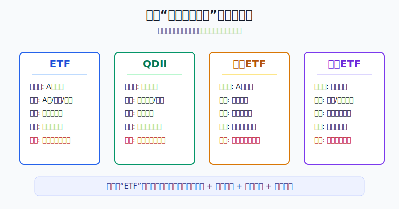
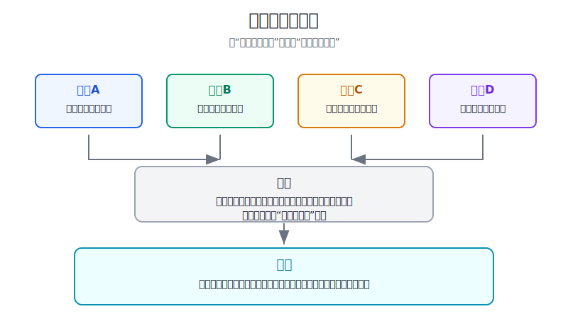
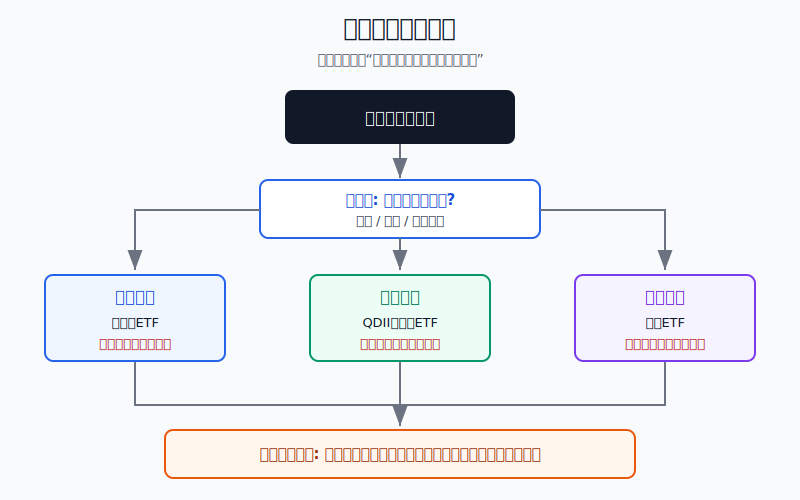

## 散户投资小白金融全品种操盘手册 - 附录.3 ETF、QDII、跨境ETF、美股ETF对照表
  
### 作者  
digoal  
  
### 日期  
2026-06-07   
  
### 标签  
金融产品 , 金融工具 , 散户 , 投资小白 , 全品操盘手册  
  
----  
  
## 背景 
  

> 适用读者: 已经知道“买ETF比买单只股票更适合小白”，但分不清 ETF、QDII、跨境ETF、美股ETF 到底差在哪、该用哪一个入口配置海外资产的投资者。  
> 本文定位: 投资教育框架，不构成个性化投资建议。规则口径按 2026-06-06 可核查公开资料整理。

## 先问一个反直觉的问题

很多人以为自己在比较四个基金品种，其实是在比较四张“车票”。车票不同，上车地点、结算货币、到账时间、拥挤程度、退票规则都不一样。**同样买纳斯达克100，你用 QDII、跨境ETF、还是美股ETF，买到的市场方向相近，但承担的执行风险完全不同。**

## 核心概念: 先分清“底层资产”和“交易外壳”

ETF 是交易型开放式指数基金，简单说，就是在交易所买卖的一篮子资产。它可以跟踪 A股宽基、行业指数、债券、黄金，也可以跟踪境外指数。

QDII 是合格境内机构投资者基金，简单说，就是由境内基金公司拿获批额度去投资境外市场，投资者通常通过场外申购赎回。你买的是基金份额，不是直接去美国市场下单。

跨境ETF 是在 A股交易所买卖、底层投向境外资产的 ETF。它像一张人民币车票，带你间接买海外指数。优势是方便，风险是场内交易价格可能和基金净值偏离，尤其在海外市场休市、额度紧张或资金追捧时。

美股ETF 是在美国交易所上市的 ETF，通常用美元交易，按美国市场规则成交和结算。它的品种多、流动性强，但需要你处理境外账户、汇率、税务、合规和信息披露阅读问题。

本节行动结论先放在前面: **不要问“哪个收益最高”，先问四个问题: 我从哪里交易，底层资产在哪里，价格按什么机制形成，退出时会不会被额度、溢价、汇率或税务卡住。小白默认顺序是: 国内资产先用境内ETF；长期海外配置先看 QDII；想场内交易海外指数再看跨境ETF；只有规则、税务、汇率和账户安全都能说清，才使用美股ETF。**

## 逻辑推导链

【论证链标题】: 因为 ETF、QDII、跨境ETF、美股ETF 的底层资产可以相似，但交易外壳不同，所以选择工具时必须先选入口和规则，再选收益和指数。

### 第一步: 前提陈述

前提A: 外壳决定交易规则。这是常量。ETF 和跨境ETF在交易所盘中成交，价格由买卖双方撮合；QDII通常按基金净值申购赎回；美股ETF按美国市场规则用美元成交。外壳像门禁卡，同一栋楼，门禁不同，你能进的门、进门时间和出门方式都不同。

前提B: 底层资产决定主要风险来源。这是常量。跟踪沪深300，主要承担 A股权益风险；跟踪纳斯达克100，主要承担美国科技成长股风险；跟踪美国债券，主要承担美元利率和信用风险。名字里有 ETF，不代表风险一样。

前提C: 跨市场工具天然有时差、额度和净值口径问题。这是变量。QDII受外汇额度和海外市场交易日影响；跨境ETF会遇到国内交易时海外市场休市、盘中价格先于或滞后于净值、二级市场溢价过高等问题；美股ETF则叠加人民币和美元汇率波动。

前提D: 执行风险会吞掉看对方向的收益。这是常量。买卖价差、成交额不足、场内高溢价、申购暂停、汇率换算、税务扣缴和结算时间，都可能让“方向看对”变成“交易做错”。

### 第二步: 逻辑推导

由A+B可得: 因为交易外壳决定你怎么买卖，底层资产决定你赚亏什么钱，所以不能只看基金名字。两个产品都写“纳斯达克100”，一个可能是场外 QDII，一个可能是场内跨境ETF，一个可能是美国市场 ETF，它们的底层方向相近，但交易体验和执行风险不同。

由B+C可得: 因为海外资产会受到交易日、额度、净值估算和汇率影响，所以跨市场工具不能只看盘中涨跌。海外市场没开盘时，国内场内价格可能先被情绪推高；基金净值尚未更新时，投资者可能误把场内价格当成真实资产价值。

再由C+D可得: 因为时差、额度和流动性会改变买入价格和退出难度，所以小白选择海外工具时，优先级不是“哪个当天涨得快”，而是“哪个外壳最适合我的账户、资金期限和操作能力”。

最后由A+B+C+D可得: **四类工具的选择顺序是: 先确认交易入口，再确认底层资产，再检查价格机制，最后检查退出条件。入口不懂不买，底层不懂不买，溢价和价差说不清不追，汇率税务合规说不清不碰。**

### 第三步: 正常情景下的操作结论

✅ 正常情景: 你是普通散户，主要用境内证券账户和基金账户，想用一篮子工具配置 A股、港股、美股或全球资产，不做高频交易，也不靠短线套利赚钱。

对应操作: 先用下面这张表做第一轮筛选。

| 工具 | 主要交易入口 | 底层资产常见方向 | 价格形成 | 适合什么钱 | 第一风险 |
|---|---|---|---|---|---|
| ETF | A股证券账户场内买卖 | A股宽基、行业、债券、黄金、商品等 | 盘中撮合成交，参考净值和IOPV | 国内核心仓、行业卫星、防守资产 | 成交额小、买卖价差大、折溢价 |
| QDII | 基金账户申购赎回，部分可场内交易 | 港股、美股、全球股票、海外债券、商品等 | 按基金净值确认，通常有净值时差 | 长期海外配置，不追盘中交易 | 额度限制、申购暂停、净值滞后、汇率 |
| 跨境ETF | A股证券账户场内买卖 | 港股、美股、日本、德国、全球主题等境外指数 | 盘中撮合成交，净值受海外市场影响 | 想用人民币账户便捷买海外指数 | 高溢价、海外休市错位、流动性 |
| 美股ETF | 境外券商账户或合规通道 | 美国宽基、行业、债券、REITs、商品、全球资产 | 美国市场美元实时成交 | 熟悉境外账户和税务规则的长期投资者 | 汇率、税务、合规、账户安全、信息披露 |

第二轮再用这张“下单前对照表”过滤。

| 检查项 | ETF | QDII | 跨境ETF | 美股ETF |
|---|---|---|---|---|
| 是否盘中交易 | 是 | 多数不是，少数LOF可场内 | 是 | 是 |
| 是否直接承担汇率影响 | 国内资产ETF通常较弱 | 通常有 | 通常有 | 有，且以美元记账 |
| 是否可能被额度影响 | 一般不看QDII额度 | 是 | 申赎层面可能受影响 | 不受境内QDII额度影响 |
| 是否要看溢价 | 要看 | 场外申购主要看净值，场内份额要看 | 必须重点看 | 要看ETF溢价和买卖价差 |
| 是否适合短线追涨 | 不作为默认用途 | 不适合 | 风险较高 | 需要专业交易能力 |
| 小白优先用途 | 国内指数和防守资产 | 长期海外配置 | 便捷海外指数暴露 | 规则熟悉后的全球配置 |

### 第四步: 数据和案例证实

证据1: 中国证券投资基金业协会披露的公募基金市场数据按股票基金、混合基金、债券基金、货币基金和 QDII 基金等类型统计，说明 QDII 是公募基金体系里的明确类别。2026年4月末，公募基金资产净值合计约39.36万亿元，其中 QDII 基金337只，净值10539.19亿元。这个证据对应前提A: QDII首先是境内公募基金外壳，而不是投资者直接去海外交易。

证据2: 国家外汇管理局持续公布 QDII 投资额度审批情况表。最新表格显示，截至2026年5月末，QDII累计批准额度总计1761.69亿美元。QDII额度由机构获批使用，不是散户自己无限制兑换后随意买全球基金。这个证据对应前提C: QDII通道存在额度约束，极端热门或额度紧张时，基金可能限购、暂停申购或改变申购节奏。

证据3: 交易所 ETF 市场已经足够大。上海证券交易所发布的《ETF行业发展报告（2026）》显示，截至2025年底，境内交易所挂牌上市ETF数量达到1381只，总规模达6.02万亿元；其中跨境ETF规模9374亿元。这个证据对应前提B: ETF不是单一产品，而是一组外壳，底层资产不同，风险差异很大。

证据4: 美国证券市场从2024年5月28日起将股票、公司债、市政债、ETF等证券的标准结算周期缩短为T+1。这个证据对应前提A和D: 美股ETF遵循美国市场规则，交易和结算口径与A股、QDII不同，小白不能把国内基金经验直接照搬。

证据5: SEC和FINRA面向投资者的ETF教育材料都提醒，ETF会在交易所交易，投资者需要关注买卖价差、折溢价、流动性和产品结构。这个证据对应前提D: ETF外壳便利，但便利不等于无执行风险。

失败案例: 小林看到某只跨境ETF盘中涨幅大，觉得“买的是海外指数，海外市场长期好”，于是没有查溢价就追进去。当天海外市场休市，国内资金把场内价格推到明显高于净值参考的位置。第二天海外指数没怎么跌，但溢价回落，小林先亏了几千元。这个失败不是底层指数错，而是外壳风险错: 他把场内成交价当成了真实净值，把跨境ETF当成了普通A股ETF。

历史数据不代表未来。上面证据仍有参考价值，是因为它们验证的是制度结构: ETF是交易所交易外壳，QDII是境内基金海外投资通道，跨境ETF叠加场内交易和境外底层资产，美股ETF按美国市场规则运行。制度结构不随某一次行情改变。

### 第五步: 前提变化时的替代结论

若前提C改变，也就是 QDII 额度紧张、基金暂停申购、跨境ETF出现高溢价，推导路径变为: 因为入口价格和申购条件已经偏离正常状态，所以不能用“长期看好海外资产”来合理化追买。新结论: 暂停买入，等额度、溢价或申购状态恢复，再重新评估。

若前提D恶化，也就是成交额很小、买卖价差很宽、盘中价格远离净值参考，推导路径变为: 因为执行成本已经上升，所以看对底层资产也可能亏在交易上。新结论: 用限价、降低仓位、换流动性更好的同类产品，或者等待。

若前提A改变，也就是你已经开了境外账户并能看懂美国ETF招募文件、费用、税务和结算规则，推导路径变为: 因为交易入口能力提高，所以可以把美股ETF纳入候选。新结论: 仍然先用宽基和低费率大规模ETF做核心，不从冷门主题和杠杆ETF开始。

若前提B改变，也就是你以为买的是“海外分散”，实际底层集中在少数科技股、单一国家或单一行业，推导路径变为: 因为风险来源变窄，所以它不能当全球核心仓。新结论: 降低仓位，把它放到卫星仓，核心仓换成更分散的宽基。

反例: 不是所有跨境ETF都危险，也不是所有美股ETF都高级。一个规模大、成交活跃、溢价正常的跨境宽基ETF，可能比一个冷门、低成交、结构复杂的美股ETF更适合小白。工具没有天然高低，只有是否匹配账户、规则和执行能力。

## 实操例子: 10万元账户想配置美国市场，怎么选

这个例子对应论证链的核心结论: **先选入口，再选底层，最后看执行条件。**

假设小林有10万元长期投资资金，已经有A股证券账户和基金账户，没有境外券商账户。他想拿2万元配置美国市场，目标不是短线交易，而是长期分散。

第一步，先选入口。小林没有境外账户，也不熟悉美国税务和结算规则，所以美股ETF先不作为默认入口。剩下两个选择是 QDII 和跨境ETF。这一步对应前提A。

第二步，确认底层。小林要的是美国市场核心暴露，不是押注单一主题，所以优先看跟踪标普500、纳斯达克100或更分散美国宽基指数的产品，不先选AI、半导体、机器人等主题。这一步对应前提B。

第三步，比较 QDII 和跨境ETF。如果小林是长期持有、每月定投、不需要盘中买卖，QDII更适合，因为它按净值申购赎回，能减少盘中追涨冲动。如果他一定要用证券账户场内买卖，跨境ETF也能用，但必须先查成交额、买卖价差、溢价率和海外市场是否休市。这一步对应前提C和D。

第四步，写下单规则。小林把2万元分成四个月，每月5000元。若选择 QDII，规则是: 基金开放申购、额度正常、基金规模和费率可接受时按计划申购；若暂停大额申购，就等下一期，不换成高溢价跨境ETF硬追。若选择跨境ETF，规则是: 只在溢价处于自己设定上限以内、成交额足够、买卖价差较窄时挂限价买入；海外市场休市且场内价格大涨时不追。

第五步，前提不成立时切换。若跨境ETF溢价明显偏高，小林不买；若 QDII 暂停申购，他不把计划仓位一次性挪去冷门主题；若人民币短期大幅贬值导致美元资产账面上涨很快，他也不因为“看起来涨得好”突破2万元上限。

如果操作错误，后果很具体。小林若在跨境ETF高溢价时一次性买入2万元，哪怕之后美国指数只横盘，溢价收敛也可能造成损失；若他为了避开 QDII 限购转去买冷门美股主题ETF，账户风险会从“美国核心权益”变成“单一主题波动”；若他直接开境外账户买美股ETF却不懂汇率、税务和账户安全，后续卖出、分红和换汇都可能出问题。

## 可复用框架

【四问选壳】

适用前提: 你想用基金或ETF买一篮子资产，尤其是海外资产。

核心逻辑: 因为收益来自底层资产，但风险也来自交易外壳，所以先问入口、底层、价格、退出四件事。

操作步骤:

1. 问入口: 我是在A股证券账户、基金账户，还是美国市场交易？
2. 问底层: 它买的是A股、港股、美股、债券、黄金，还是单一主题？
3. 问价格: 我按净值买，还是按场内成交价买？有没有折溢价？
4. 问退出: 赎回多久到账？是否有额度、限购、流动性、税务或汇率问题？

前提失效时: 入口规则不懂，先不用；底层不清，先查指数和持仓；价格偏离净值，先等；退出条件不清，不下单。

举一反三: 这个框架也适用于港股ETF、商品ETF、债券ETF、REITs基金和可转债基金。

【红灯停手】

适用前提: 你已经选定某只 ETF、QDII、跨境ETF或美股ETF，准备下单。

核心逻辑: 因为执行风险会吞掉收益，所以任何一个红灯出现，都先暂停，不用“长期看好”掩盖当下交易问题。

操作步骤:

1. 溢价红灯: 场内价格明显高于净值参考，不追。
2. 流动性红灯: 成交额小、买卖价差宽，不追。
3. 额度红灯: QDII限购或暂停申购，不换冷门高风险产品硬买。
4. 规则红灯: 汇率、税务、结算、账户安全说不清，不碰美股ETF。

前提失效时: 如果红灯消失，也不是立刻满仓，而是回到原计划分批买入。

举一反三: 红灯停手可以用于所有场内产品，尤其是跨境ETF、商品ETF、低成交债券ETF和热门主题ETF。

## 本节行动清单

| 动作 | 合格标准 |
|---|---|
| 先写入口 | 证券账户、基金账户、境外账户，三者先分清 |
| 查底层资产 | 能说清跟踪指数、主要持仓、国家和行业集中度 |
| 查价格机制 | 场内成交价、基金净值、IOPV、折溢价能分清 |
| 查流动性 | 看成交额、买卖价差、规模，不只看涨跌幅 |
| 查额度状态 | QDII和跨境产品关注限购、暂停申购和公告 |
| 查汇率税务 | 涉及美元或境外账户时，先写清汇率和税务影响 |
| 写退出条件 | 什么时候卖、多久到账、什么情况不能卖，都要提前写 |

## 一句话总结

ETF、QDII、跨境ETF、美股ETF不是“谁更高级”的关系，而是四种交易外壳；小白先选自己能理解和能退出的外壳，再谈底层资产和收益。

## 参考资料

- 中国证券投资基金业协会: 公募基金市场数据（2026年4月）, https://www.amac.org.cn/sjtj/tjbg/gmjj/202605/P020260527642499680112.pdf
- 国家外汇管理局: 合格境内机构投资者 QDII 投资额度审批情况表（截至2026年5月末）, https://www.safe.gov.cn/safe/2018/0425/16849.html
- 上海证券交易所: ETF 行业发展报告（2026）, https://etf.sse.com.cn/fundtrends/c/10808765/files/31409f49c20a4ca6944fb4cfd387cff8.pdf
- 深圳证券交易所: 基金产品与交易规则资料, https://www.szse.cn/
- Investor.gov: New T+1 Settlement Cycle, https://www.investor.gov/newT1settlement-cycle
- Investor.gov: Exchange-Traded Funds, https://www.investor.gov/introduction-investing/investing-basics/investment-products/mutual-funds-and-exchange-traded-2
- FINRA: Exchange-Traded Funds and Products, https://www.finra.org/investors/investing/investment-products/exchange-traded-products

> ⚠️ **声明**：本文内容为投资教育目的，所有历史数据、策略框架均为辅助学习工具，不构成证券投资建议。市场有风险，投资需谨慎。实际操作请结合自身风险承受能力，必要时咨询专业投顾。
  
#### [PostgreSQL 解决方案集合](../201706/20170601_02.md "40cff096e9ed7122c512b35d8561d9c8")
  
  
#### [德哥 / digoal's Github - 公益是一辈子的事.](https://github.com/digoal/blog/blob/master/README.md "22709685feb7cab07d30f30387f0a9ae")
  
  
#### [About 德哥](https://github.com/digoal/blog/blob/master/me/readme.md "a37735981e7704886ffd590565582dd0")
  
  

  
