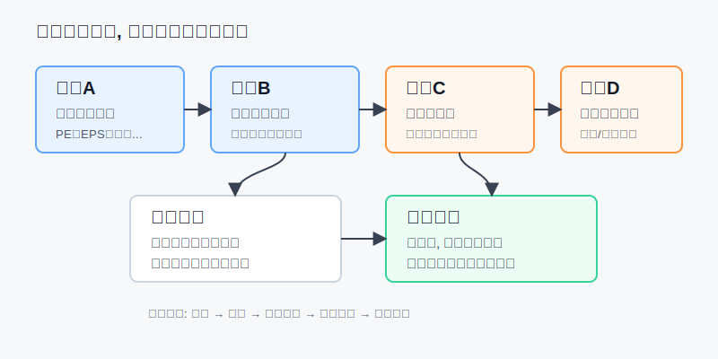
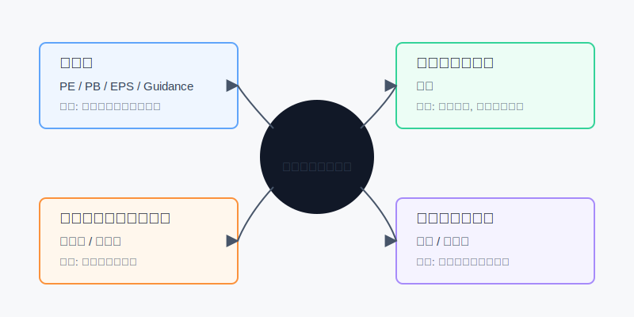

## 散户投资小白金融全品种操盘手册 - 附录.4 常用术语表 - PE、PB、久期、溢价率、回撤、波动率、EPS、Guidance
  
### 作者  
digoal  
  
### 日期  
2026-06-07   
  
### 标签  
金融产品 , 金融工具 , 散户 , 投资小白 , 全品操盘手册  
  
----  
  
## 背景 
  

> 适用读者: 看研报、基金公告、财报和交易软件时，经常被 PE、PB、久期、溢价率、回撤、波动率、EPS、Guidance 卡住的小白投资者。  
> 本文定位: 投资教育框架，不构成个性化投资建议。规则口径按 2026-06-06 可核查公开资料整理。

## 先问一个反直觉的问题

术语最大的危险，不是你不懂，而是你半懂。你看到“PE低”就觉得便宜，看到“久期长”就觉得收益高，看到“Guidance好”就追进去。**术语不是结论，只是风险标签；读懂标签以后，才轮到买卖动作。**

## 核心概念: 术语是压缩包，不是操作按钮

金融术语像食品包装上的成分表。它能告诉你里面有什么，但不能替你判断今天该吃多少、适不适合你、吃错了会不会不舒服。

本节行动结论先放前面: **以后看到任何术语，先问五件事: 公式是什么，数据从哪里来，适用前提是什么，前提失效时会骗你什么，最后才问账户动作。** 这套顺序比背定义重要。

## 逻辑推导链

【论证链标题】: 因为术语会压缩信息，也会省略前提，所以小白必须先把术语还原成“公式、口径、前提、失效条件”，再决定买卖。

### 第一步: 前提陈述

前提A: 术语会把复杂信息压缩成一个数字。这是常量。PE把股价和利润压缩成一个倍数；久期把债券价格对利率的敏感度压缩成年数；溢价率把成交价和净值的偏离压缩成百分比。压缩包很方便，但你不能只看文件名就下单。

前提B: 每个术语都有适用前提。这是常量。PE适合盈利稳定的公司；PB更适合银行、保险、资源、地产这类资产负债表有意义的行业；久期主要解释利率风险，不解释信用违约；溢价率主要解释 ETF 或跨境产品买卖价是否偏离净值。

前提C: 前提会随市场、行业和公司变化。这是变量。周期股利润在高点时 PE 会显得很低；科技公司 PB 很高，可能因为品牌、软件、生态不在账面资产里；跨境 ETF 在热点阶段可能高溢价；长久期债券在利率上行时会从防守品变成回撤来源。

前提D: 账户动作取决于你的资金期限和风险预算。这是变量。同一个 20% 回撤，对五年以上闲钱是波动，对三个月后要用的钱就是风险事故。

### 第二步: 逻辑推导

由A+B可得: 因为术语是压缩后的数字，而每个数字都依赖适用前提，所以读术语的第一步不是判断“好不好”，而是还原“它回答的是哪个问题”。

再由B+C可得: 因为适用前提会变化，所以同一个术语在不同场景下会给出相反含义。低 PE 可能是便宜，也可能是利润高点后的价值陷阱；高 PB 可能是贵，也可能是轻资产公司的正常特征；高 Guidance 可能说明公司景气，也可能已经被市场提前定价。

最后由A+B+C+D可得: **术语只能进入检查清单，不能直接变成下单理由。正确动作是先分类，再看失效条件，最后用账户仓位决定买、卖、等。**

### 第三步: 正常情景下的操作结论

✅ 正常情景: 你不是职业分析师，只是想读懂公告、研报、基金页面和交易软件，并把术语用于自己的买卖检查。

对应操作: 把 8 个常用词分成四组。

| 问题 | 术语 | 它真正提醒你什么 |
|---|---|---|
| 这东西贵不贵 | PE、PB、EPS、Guidance | 价格和盈利、资产、预期是否匹配 |
| 债券怕不怕利率 | 久期 | 利率变化会让债券价格波动多大 |
| ETF买卖价有没有买贵 | 溢价率 | 场内成交价是否明显高于净值 |
| 我能不能扛住 | 回撤、波动率 | 账户下跌和上下波动是否超过承受力 |

### 第四步: 数据和案例证实

证据1: SEC 的 Investor.gov 对 PE 的解释是用当前股价除以当前每股收益，EPS 则来自过去12个月盈利和普通股股数。这个证据说明 PE 和 EPS 是一组词，不能拆开看。Apple 2025 年 Form 10-K 显示，2025 财年净利润为 1120.10 亿美元，稀释 EPS 为 7.46 美元，计算稀释 EPS 使用的加权稀释股数为 150.04697 亿股。也就是说，EPS不是神秘指标，它来自净利润和股数。

证据2: NVIDIA 2026年4月26日结束的 2027 财年第一季度财报显示，收入为 816.15 亿美元，GAAP 稀释 EPS 为 2.39 美元；同时公司给出下一季度收入 Guidance 为 910 亿美元，上下浮动 2%。这个证据说明 Guidance 是管理层对未来的预期，不是已经发生的事实。看 Guidance 时，必须同时看实际财报、市场预期和风险提示。

证据3: FINRA 对债券利率风险的说明很直接: 利率上升时债券价格通常下跌，利率下降时债券价格通常上涨；久期越高，对利率变化越敏感。BlackRock 的 TLT 事实表显示，截至 2026年3月31日，iShares 20+ Year Treasury Bond ETF 的有效久期为 15.33 年。这意味着它不是“低风险现金替代”，而是明显带有利率弹性的债券工具。

证据4: SEC 的 ETF 投资者指南说明，ETF 市场价格可能高于或低于其资产净值，并且买卖价差会降低投资者真实回报。指南里的例子是: 如果 bid 是 59.50 美元、ask 是 60.00 美元，买 200 份后立刻卖出会因价差损失 100 美元。这个证据对应溢价率和买卖价差: 你以为在买资产，其实先付了交易成本。

失败案例: 小林看到一只周期股 PE 只有 8 倍，以为“比 30 倍科技股便宜太多”，于是重仓买入。他没问这个 PE 来自哪里。后来发现公司利润来自上一轮商品价格高点，下一年利润下滑，PE 反而从 8 倍变成 25 倍，股价还跌了。失败点不在 PE 这个词，而在他没有检查“盈利是否稳定”这个前提。

历史数据不代表未来。上面的证据仍有参考价值，是因为它们验证的是结构规律: 估值指标依赖利润口径，债券久期依赖利率方向，ETF成交价可能偏离净值，风险指标必须结合资金期限。

### 第五步: 前提变化时的替代结论

若盈利前提改变，也就是公司亏损、利润一次性暴增、周期利润处在高点，推导路径变为: 因为 EPS 不稳定，所以 PE 不再是可靠的便宜判断。新结论: 先看现金流、收入、行业周期和利润可持续性，不用低 PE 直接下单。

若资产前提改变，也就是公司主要价值来自品牌、软件、专利、用户网络，推导路径变为: 因为账面净资产不能完整反映真实价值，所以 PB 会天然偏高。新结论: PB 只做辅助，不用它否定所有轻资产公司。

若交易前提改变，也就是跨境 ETF 溢价超过 3%、买卖价差变宽、海外市场休市导致 IOPV 参考性下降，推导路径变为: 因为成交价已经偏离净值，所以“标的跌了”不等于“我买便宜了”。新结论: 暂停追买，等溢价回落或改用低溢价工具。

若利率前提改变，也就是利率重新上行，推导路径变为: 因为长久期债券价格对利率上行更敏感，所以长久期从弹性来源变成回撤来源。新结论: 降低长久期仓位，回到现金、货币基金、短债或中短债。

## 小白术语表

| 术语 | 一句话解释 | 常用公式/来源 | 适用场景 | 最容易骗你的地方 |
|---|---|---|---|---|
| PE | 你为一份盈利付多少钱 | 股价 / EPS | 盈利稳定的股票、指数、行业比较 | 利润在高点时 PE 会显得便宜；亏损公司 PE 失效 |
| PB | 你为一份账面净资产付多少钱 | 股价 / 每股净资产 | 银行、保险、资源、地产、REITs辅助判断 | 资产质量差时低 PB 不是便宜；轻资产公司 PB 常偏高 |
| 久期 | 债券价格对利率变化的敏感度 | 基金事实表、债券资料 | 债券基金、债券 ETF、利率下行/上行判断 | 久期只解释利率风险，不解释信用风险和流动性风险 |
| 溢价率 | 场内成交价比净值贵多少 | (成交价 - 参考净值) / 参考净值 | ETF、跨境ETF、QDII场内交易 | 高溢价买入，可能标的没跌你也先亏溢价回归 |
| 回撤 | 从高点跌到低点的幅度 | (低点 - 高点) / 高点 | 账户复盘、策略验证、仓位上限 | 样本太短会低估风险；历史最大回撤不是未来上限 |
| 波动率 | 价格上下摆动的剧烈程度 | 常见为收益率标准差 | 基金风险等级、期权、仓位控制 | 波动率把上涨和下跌都算进去，不等于一定亏钱 |
| EPS | 每股能分到的利润 | 净利润 / 股数 | 读财报、计算 PE、比较盈利变化 | 回购会抬高 EPS；一次性收益会污染 EPS |
| Guidance | 公司管理层给出的未来业绩展望 | 财报新闻稿、电话会、8-K、IR材料 | 财报季判断预期差 | 它是前瞻性预期，不是承诺；好 Guidance 也可能已被定价 |

## 实操例子: 看到一串术语时怎么处理

这个例子对应论证链的正常结论: **先把术语分类，再查前提，最后决定账户动作。**

假设小林有 10 万元投资资金，其中 6 万元宽基 ETF，2 万元债券基金，1 万元个股，1 万元现金。他看到三条信息:

1. 某股票 PE 12 倍，PB 0.9 倍。
2. 某跨境 ETF 当天跟踪指数下跌 3%，但场内溢价率 4.5%。
3. 某长债 ETF 有效久期约 15 年，近期因为降息预期上涨。

第一步，处理 PE 和 PB。小林不直接说“低估”，而是先查 EPS 来源: 是过去一年真实盈利，还是一次性收益；再查行业: 如果是银行或资源股，PB 有参考价值；如果是软件或平台公司，PB 参考价值下降。若利润来自周期高点，他不买或只放入观察。

第二步，处理溢价率。跨境 ETF 的溢价率 4.5%，如果买 20000 元，等于先为净值附近的资产多付约 900 元。小林的动作不是追买，而是暂停，等溢价回到 1% 附近，或者改看同类低溢价产品。

第三步，处理久期。有效久期约 15 年，意味着利率上行 1 个百分点时，价格可能有约 15% 的压力。小林如果只是想放防守钱，就不能把它当短债；如果只是做利率下行的小弹性仓，仓位不超过总资产 5%。

第四步，处理回撤和波动率。小林写下自己的承受线: 总账户最大可接受回撤 10%。如果一只产品历史最大回撤接近 30%，那它不能占 30% 仓位；否则单品种下跌就可能打穿账户承受力。

如果操作错误，后果很具体: 他可能因为低 PE 买进利润高点的周期股，因为指数下跌追入高溢价 ETF，因为“债券”两个字重仓长久期产品。纠偏方法不是背更多术语，而是回到五问: 公式、口径、前提、失效条件、账户动作。

## 可复用框架

【五问术语法】

适用前提: 你正在阅读财报、基金公告、研报、交易软件或财经文章，里面出现了一个看似重要的金融术语。

核心逻辑: 因为术语会压缩信息并省略前提，所以必须先还原口径，再决定动作。

操作步骤:

1. 公式: 这个词怎么算，分子分母是什么。
2. 来源: 数据来自财报、基金公告、指数公司、交易所，还是二手平台。
3. 前提: 这个词在哪类资产、行业、市场环境里有效。
4. 失效: 什么情况下它会误导我。
5. 动作: 它对应买入、卖出、暂停、降仓，还是只记录。

前提失效时: 不强行解释术语，先换指标。PE失效看现金流和收入，PB失效看资产质量和盈利能力，溢价率异常先暂停交易，久期风险升高先降仓位。

举一反三: 这个框架也适用于 ROE、股息率、夏普比率、转股溢价率、到期收益率、换手率和成交额。

【四类归档】

适用前提: 你已经知道一个词的大概意思，但不知道它和下单有什么关系。

核心逻辑: 因为不同术语服务于不同问题，所以先归档，再行动。

操作步骤:

1. 估值类: PE、PB、EPS、Guidance，问价格和业绩是否匹配。
2. 利率类: 久期，问债券会不会被利率变化伤到。
3. 交易类: 溢价率，问成交价有没有买贵。
4. 风险类: 回撤、波动率，问自己能不能扛住。

前提失效时: 如果一个术语跨错了场景，比如用 PB 判断软件公司、用低 PE 判断周期股、用“债券”两个字替代久期检查，直接退回五问术语法。

举一反三: 这个框架可以做成你的交易软件旁边的一张小卡片，每次下单前扫一遍。

## 本节行动清单

| 动作 | 合格标准 |
|---|---|
| 给术语分类 | 先判断它属于估值、利率、交易还是风险 |
| 写出公式 | 不知道分子分母，就不把它当下单理由 |
| 查数据来源 | 财报、基金公告、交易所、指数公司优先 |
| 写适用前提 | PE看盈利稳定，PB看资产质量，久期看利率，溢价率看净值偏离 |
| 写失效条件 | 每个术语至少写一个会误导你的场景 |
| 连接账户动作 | 术语只能触发买、卖、等、降仓、记录中的一个动作 |
| 不单词下单 | 任何一个术语单独出现，都不足以成为重仓理由 |

## 一句话总结

术语不是让你显得专业的装饰品，而是下单前的风险标签；真正有用的读法，是把每个词还原成公式、口径、前提和失效条件。

## 参考资料

- U.S. SEC Investor.gov: Price-earnings (P/E) Ratio, https://www.investor.gov/introduction-investing/investing-basics/glossary/price-earnings-pe-ratio
- U.S. SEC: Mutual Funds and Exchange-Traded Funds (ETFs) - A Guide for Investors, https://www.sec.gov/about/reports-publications/investor-publications/introduction-mutual-funds
- U.S. SEC: Investor Bulletin - Exchange-Traded Funds, https://www.sec.gov/investor/pubs/etfs.pdf
- FINRA: Bonds, interest rate risk and duration risk, https://www.finra.org/investors/investing/investment-products/bonds
- FINRA: Volatility, https://www.finra.org/investors/investing/investing-basics/volatility
- Apple Inc.: 2025 Form 10-K, fiscal year ended 2025-09-27, https://www.sec.gov/Archives/edgar/data/320193/000032019325000079/aapl-20250927.htm
- NVIDIA: Announces Financial Results for First Quarter Fiscal 2027, quarter ended 2026-04-26, https://nvidianews.nvidia.com/_gallery/download_pdf/6a0e17dc3d633295d45282e6/
- BlackRock: iShares 20+ Year Treasury Bond ETF Fact Sheet, as of 2026-03-31, https://www.blackrock.com/us/individual/literature/fact-sheet/tlt-ishares-20-year-treasury-bond-etf-fund-fact-sheet-en-us.pdf

> ⚠️ **声明**：本文内容为投资教育目的，所有历史数据、策略框架均为辅助学习工具，不构成证券投资建议。市场有风险，投资需谨慎。实际操作请结合自身风险承受能力，必要时咨询专业投顾。
  
#### [PostgreSQL 解决方案集合](../201706/20170601_02.md "40cff096e9ed7122c512b35d8561d9c8")
  
  
#### [德哥 / digoal's Github - 公益是一辈子的事.](https://github.com/digoal/blog/blob/master/README.md "22709685feb7cab07d30f30387f0a9ae")
  
  
#### [About 德哥](https://github.com/digoal/blog/blob/master/me/readme.md "a37735981e7704886ffd590565582dd0")
  
  

  
