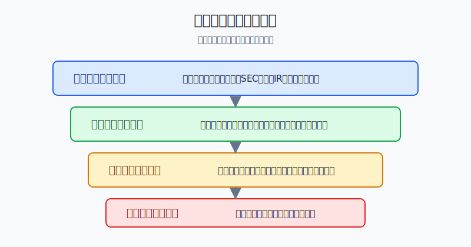
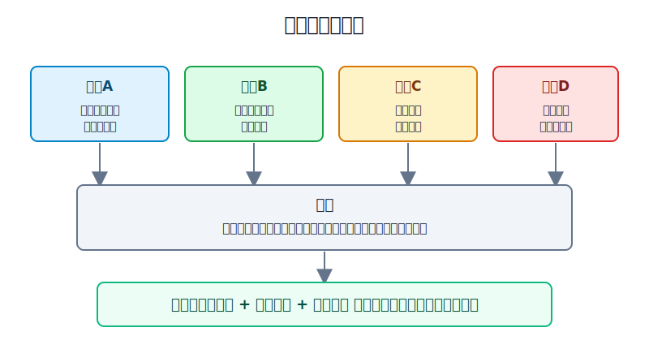
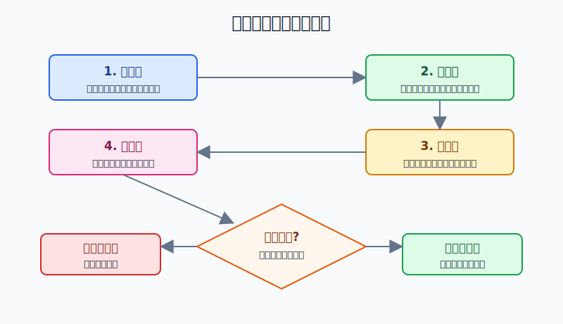

## 散户投资小白金融全品种操盘手册 - 附录.5 常用数据来源 - 交易所、基金公告、指数公司、SEC、公司IR、央行、统计局
  
### 作者  
digoal  
  
### 日期  
2026-06-07   
  
### 标签  
金融产品 , 金融工具 , 散户 , 投资小白 , 全品操盘手册  
  
----  
  
## 背景 
  

> 适用读者: 已经开始自己查数据，但经常分不清“官方公告、财经软件、媒体解读、社区观点”谁更可靠的小白投资者。  
> 本文定位: 投资教育框架，不构成个性化投资建议。

## 先问一个反直觉的问题

散户亏钱，有时不是因为没有数据，而是因为数据太多。你在券商软件看到一个PE，在短视频看到一个业绩截图，在群里看到一张资金流表，最后以为自己“查过了”。真正的问题是：**你查到的是原件，还是别人转述后的二手结论？**

## 核心概念: 数据源不是越多越好，而是要分层

查数据像查身份证。原件优先于复印件，复印件优先于别人嘴里说的号码。

第一层是原始披露。A股和港股看交易所公告、上市公司公告、基金公告；美股看SEC EDGAR和公司IR；基金看基金合同、招募说明书、定期报告和临时公告；指数看指数公司的编制方案、样本、权重和调整公告；宏观看央行、统计局、财政部、交易所和监管机构公开数据。

第二层是规则口径。比如PE用静态、滚动还是预测，基金规模是哪一天，指数样本什么时候调整，GDP是现价还是不变价，成交额是人民币、港币还是美元。口径错了，数字越精确越误导。

第三层是整理工具。券商软件、财经网站、数据库、行情终端很有用，但它们是“厨房切好的菜”，不是土地里的原料。小白可以用它们筛选和提醒，但不能只凭它们下结论。

第四层是市场观点。研报、媒体、社区、短视频、群聊只能帮你发现线索，不能替你确认事实。观点可以启发，但不能当证据。

所以本节先给行动结论：**下单前按“原始披露 → 规则口径 → 行情执行 → 冲突复核”的顺序查数据。三件事说不清，不下单：数据从哪里来、口径是什么、当前交易价格是否已经反映了这个信息。**

## 逻辑推导链

【论证链标题】: 因为投资数据会被转述、压缩和误读，所以小白必须先找原始来源，再核对口径和行情，最后才把观点放进交易计划。

── 第一步: 前提陈述

前提A: 投资数据天然会被二次加工。这是常量。财经软件会把年报、公告、指数文件、行情和估值加工成一个页面；媒体会把复杂文件压缩成标题；社区会把标题再压缩成一句话。它像传话游戏，越往后越方便，也越容易丢细节。

前提B: 原始披露最接近事实，但也最需要读口径。这是常量。上市公司公告告诉你公司正式披露了什么，基金公告告诉你基金合同和运作发生了什么，SEC文件告诉你美股公司向监管提交了什么，央行和统计局告诉你宏观统计口径下发生了什么。但这些原件不是“直接给答案”，而是给你可核验的事实基础。

前提C: 不同市场的数据口径不同。这是变量。A股、港股、美股的信息披露制度不同；ETF、QDII、跨境ETF、美股ETF的净值和交易价格时间不同；指数公司的样本、权重和调整规则不同；宏观数据还有初值、修正值、同比、环比、季调和非季调。只看数字不看口径，就像只看体温不看是摄氏度还是华氏度。

前提D: 下单需要的是可执行条件，不是资料收藏。这是常量。你最终要决定买不买、买多少、用什么价格买、错了怎么办。数据源服务于交易计划，不是让你把网页收藏夹越堆越高。

── 第二步: 逻辑推导

由A可得: 因为数据会被加工，所以看到一个数字时，第一反应不能是“这个数字说明什么”，而是“这个数字从哪份原件来”。

由A+B可得: 因为原件最接近事实，所以研究A股个股先找交易所公告和公司定期报告，研究美股个股先找SEC EDGAR和公司IR，研究基金先找基金公告和合同，研究指数先找指数公司编制方案。

再由A+B+C可得: 因为不同来源口径可能不一致，所以必须核对时间、单位、币种、复权、样本范围、估值口径和披露滞后。否则，你可能拿2024年年报数据去判断2026年价格，或者拿场外基金净值去解释场内ETF实时价格。

最后由A+B+C+D可得: 因为交易动作需要可验证条件，所以只有当“事实来源、统计口径、当前行情”三者能互相对上时，数据才进入交易计划。三者有冲突时，默认先不下单。

── 第三步: 正常情景下的操作结论

✅ 正常情景: 你准备买入ETF、基金、个股、可转债、REITs、黄金、港美股、QDII或跨境ETF，但买入理由来自某个数据，比如估值低、业绩增长、分红高、利率下行、美元走强、指数调整、基金折溢价。

对应操作: 先把数据分成三列。

| 要确认的问题 | 首选来源 | 辅助来源 | 红灯 |
|---|---|---|---|
| 公司业绩和重大事项 | 交易所公告、SEC EDGAR、公司IR | 券商研报、财经网站 | 只有截图，没有公告链接 |
| 基金和ETF规则 | 基金公告、招募说明书、定期报告、基金公司官网 | 券商基金页面 | 只看收益率，不看合同和持仓 |
| 指数样本和权重 | 指数公司官网、编制方案、样本公告 | 行情软件指数页面 | 不知道指数买的是什么 |
| 宏观利率和货币 | 央行、统计局、财政部、监管机构 | 数据库、媒体图表 | 不知道数据期别和修订 |
| 当前交易条件 | 交易所行情、券商盘口、ETF官网净值和折溢价 | 财经网站行情 | 成交额小、价差大、溢价高仍追单 |

结论很硬：原始来源找不到，不下单；口径说不清，先降级为观察；行情执行条件不合格，即使逻辑正确也不追单。

── 第四步: 数据和案例证实

证据1: 美股披露有明确文件分工。SEC EDGAR提供上市公司等主体提交文件的公开搜索；Investor.gov解释，10-K是年度报告，10-Q是季度报告，8-K是当前报告，公司通常要在重大事件发生后4个工作日内提交8-K。这个证据对应前提B: 公司信息不是只靠新闻，监管披露本身就分层。

证据2: A股信息披露有集中入口。上海证券交易所和深圳证券交易所官网均提供上市公司公告查询，巨潮资讯网长期作为上市公司公告和定期报告的重要集中披露入口。这个证据对应前提B: 小白研究A股，不应只看软件摘要，而要能回到公告原文。

证据3: 港股也有官方披露入口。香港交易所披露易提供上市公司公告、通函、财务报表等公开文件查询。这个证据对应前提C: 同样是上市公司，不同市场有不同披露入口，不能用A股软件习惯直接套港股。

证据4: 宏观数据必须看发布机构和时间。国家统计局发布的2025年国民经济和社会发展统计公报显示，2025年全年国内生产总值为140.94万亿元，按不变价格计算比上年增长5.0%。这个数字的意义不在于“GDP涨了就买什么”，而在于它示范了宏观数据要同时看发布机构、年份、指标名称、单位和计算口径。

证据5: 央行数据同样有口径边界。中国人民银行定期发布金融统计数据、社会融资规模、货币供应量等数据。比如M2、社会融资规模存量、人民币贷款余额各自回答的问题不同，不能把“流动性宽松”四个字直接等同于所有资产都会上涨。这个证据对应前提C: 宏观变量要先问“它衡量什么”。

证据6: 指数不是一串代码，而是一套规则。中证指数公司会发布指数编制方案、样本和权重等资料。沪深300、中证500、红利指数、行业指数的选样规则不同，所以同样叫ETF，底层风险可能完全不同。这个证据对应前提C: 买ETF前必须知道指数买的是什么。

失败案例: 小林看到某跨境ETF盘中涨幅很大，社区说“对应海外市场大涨，赶紧上车”。他只看了场内价格，没有查基金公司官网的IOPV、上一日净值、溢价率，也没有注意海外市场当时休市，场内价格主要由国内资金交易决定。结果他在高溢价时买入，第二天溢价收敛，哪怕海外指数没有大跌，他也先亏一截。这个失败不是因为他没有数据，而是因为他只看了“价格”这一层，没有核对“净值口径”和“当前交易条件”。

历史不代表未来。上面的证据仍有参考价值，是因为它们验证的是制度结构：市场里存在原始披露、规则口径、整理工具和市场观点四层信息。这个结构不会因为某一次牛市或熊市消失。

── 第五步: 前提变化时的替代结论

若前提A恶化，也就是你看到的数据只来自截图、短视频、群聊或二手表格，推导路径变为: 因为信息已经被多次转述，所以错误概率上升。新结论: 不把它当买入依据，只把它当线索，回到公告、SEC、基金公司、指数公司或统计部门查原件。

若前提B失效，也就是原始披露找不到、公告已过期、基金合同更新、公司IR页面和监管文件不一致，推导路径变为: 因为事实底座不稳，所以交易理由不能成立。新结论: 暂停下单，先确认最新文件。

若前提C改变，也就是同一个数字出现两个口径，比如静态PE和滚动PE差异很大、人民币和美元口径混用、场内价格与基金净值差距很大，推导路径变为: 因为数字不可比，所以不能直接推出高估或低估。新结论: 先统一口径，再判断。

若前提D改变，也就是数据核验通过，但盘口成交额很小、买卖价差很宽、ETF溢价过高、市场刚发生重大事件，推导路径变为: 因为执行风险上升，所以“研究上可以买”不等于“现在就能买”。新结论: 用限价、分批、降低仓位或等待流动性恢复。

## 实操例子: 10万元账户想买一只红利ETF，怎么查数据

这个例子对应论证链的正常结论: **事实来源、统计口径、当前行情三者一致，才进入交易计划。**

假设小林有10万元长期账户，想拿1万元买一只红利ETF。他的理由是：“红利指数估值低、分红稳定、适合震荡市。”

第一步，找原件。小林先打开基金公司官网，找到这只ETF的基金合同、招募说明书、最近一期定期报告和产品页面。目的不是读完所有文件，而是确认三件事：跟踪哪个红利指数、管理费和托管费是多少、最近持仓和规模是否正常。这一步对应前提B。

第二步，查指数口径。他到指数公司官网找对应红利指数的编制方案，确认它按什么规则选股，是看股息率、分红连续性、流动性，还是还加入波动率、行业权重限制。这里要特别小心：高股息不等于低风险，指数规则决定它可能集中在银行、煤炭、公用事业或运营商等板块。这一步对应前提C。

第三步，对公司和基金公告。如果ETF最近规模快速变化、跟踪误差扩大、暂停申购赎回、发生分红、调整费率或换基金经理，小林必须在基金公告里确认。券商软件的摘要可以做提醒，但最终以公告为准。这一步对应前提A+B。

第四步，看当前交易条件。小林打开券商盘口和基金公司页面，记录成交额、买卖价差、IOPV、上一日净值、场内价格和溢价率。如果成交额很小、买卖价差宽，或者溢价明显偏高，他不追单；即使红利逻辑成立，也只挂限价或等待。这一步对应前提D。

第五步，写成交易计划。小林把买入条件写成：只有当基金规模、跟踪指数、费用、持仓、溢价和流动性都合格时，才买入不超过1万元；如果溢价高于自己设定上限，改为等待；如果指数样本高度集中在自己已有持仓行业，买入金额减半。

第六步，前提不成立时切换。如果他发现“低估值”来自两年前截图，或者基金已换指数、规模变小、成交额很低，那么原买入理由失效。正确动作不是换一个说法继续买，而是把这只ETF移出候选表，重新筛选。

如果操作错误，后果很具体：小林只看“近一年分红率高”和“红利两个字”，没看指数编制和ETF溢价，结果买到的是行业高度集中的产品，还在高溢价时成交。后面一旦利率预期、行业政策或资金偏好变化，他会同时承受行业集中、估值回落和溢价收敛三重风险。

## 可复用框架

【三源核验】

适用前提: 你准备用某个数据支持买入、卖出、加仓、补仓或换仓。

核心逻辑: 因为单一数据页面可能错、慢或口径不清，所以任何关键数据至少过三源: 原始披露、规则口径、行情执行。

操作步骤:

1. 原始披露: 找公告、定期报告、SEC文件、基金合同、指数方案或统计发布。
2. 规则口径: 写清时间、单位、币种、复权、样本范围、估值口径和是否修订。
3. 行情执行: 检查当前价格、成交额、买卖价差、折溢价、流动性和交易时间。

前提失效时: 原件找不到，不下单；口径不一致，先统一；行情执行差，等待或降仓位。

举一反三: 这个框架可以用在个股财报、ETF筛选、QDII溢价、可转债转股溢价率、REITs分派率、黄金ETF净值和美股财报季。

【四层过滤】

适用前提: 你每天看到很多财经信息，不知道哪些该信。

核心逻辑: 因为信息越靠近观点层越容易失真，所以按原始披露、规则口径、整理工具、市场观点四层过滤。

操作步骤:

1. 原始披露层: 能找到原文，才算事实进入候选。
2. 规则口径层: 能解释口径，才允许比较。
3. 整理工具层: 用来筛选、排序和提醒，不直接下结论。
4. 市场观点层: 只用来发现问题，不用来替代证据。

前提失效时: 如果一条信息只能停留在第四层，不能上溯到第一层，就只能记为“待验证线索”，不能变成订单。

举一反三: 四层过滤也适合识别投资骗局。越是催你立刻行动、越是不给原始来源、越是只给截图和收益图，越要停手。

## 本节行动清单

| 动作 | 合格标准 |
|---|---|
| 建一个数据源书签夹 | A股交易所、巨潮、基金公司、指数公司、SEC EDGAR、HKEXnews、央行、统计局都能快速打开 |
| 每次记录来源 | 交易计划里写清数据链接、发布日期和指标名称 |
| 统一口径 | 时间、币种、单位、复权、样本范围、估值算法能说清 |
| 原件优先 | 公告和监管文件优先于软件摘要、媒体图表和社区截图 |
| 冲突先停手 | 两个来源不一致时，不急着解释，先找最新原件 |
| 行情再确认 | 下单前看成交额、价差、折溢价和交易时间 |
| 每周清理线索 | 观点类信息不能验证原件的，从候选表删除 |

## 一句话总结

常用数据源的正确用法不是收藏更多网站，而是先找原件、再查口径、最后核对行情；原件、口径、行情三者对不上，就不要把数据变成订单。

## 参考资料

- SEC: EDGAR Search Filings, https://www.sec.gov/search-filings
- Investor.gov: Using EDGAR to Research Investments, https://www.investor.gov/introduction-investing/getting-started/researching-investments/using-edgar-research-investments
- 上海证券交易所: 上市公司公告, https://www.sse.com.cn/disclosure/listedinfo/announcement/
- 深圳证券交易所: 上市公司公告, https://www.szse.cn/disclosure/listed/notice/index.html
- 巨潮资讯网: 公告查询, https://www.cninfo.com.cn/new/disclosure
- HKEXnews: Listed Company Information, https://www.hkexnews.hk/
- 国家统计局: 中华人民共和国2025年国民经济和社会发展统计公报, https://www.stats.gov.cn/sj/zxfb/202602/t20260228_1959007.html
- 中国人民银行: 统计数据, https://www.pbc.gov.cn/diaochatongjisi/116219/index.html
- 中证指数有限公司: 指数资料与编制方案, https://www.csindex.com.cn/

> ⚠️ **声明**：本文内容为投资教育目的，所有历史数据、策略框架均为辅助学习工具，不构成证券投资建议。市场有风险，投资需谨慎。实际操作请结合自身风险承受能力，必要时咨询专业投顾。
  
#### [PostgreSQL 解决方案集合](../201706/20170601_02.md "40cff096e9ed7122c512b35d8561d9c8")
  
  
#### [德哥 / digoal's Github - 公益是一辈子的事.](https://github.com/digoal/blog/blob/master/README.md "22709685feb7cab07d30f30387f0a9ae")
  
  
#### [About 德哥](https://github.com/digoal/blog/blob/master/me/readme.md "a37735981e7704886ffd590565582dd0")
  
  

  
