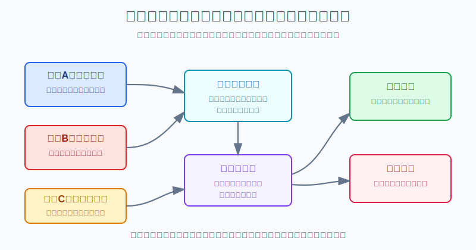
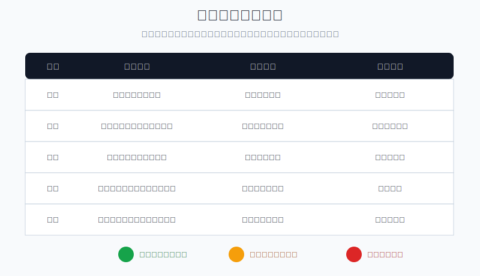
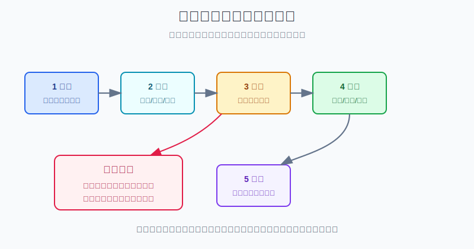

## 散户投资小白金融全品种操盘手册 - 附录.6 下单前检查清单
  
### 作者  
digoal  
  
### 日期  
2026-06-07   
  
### 标签  
金融产品 , 金融工具 , 散户 , 投资小白 , 全品操盘手册  
  
----  
  
## 背景 
  


> 适用读者: 已经读完前面章节，准备把ETF、基金、个股、可转债、黄金、REITs、QDII、港股或美股的想法变成真实订单的小白投资者。  
> 本文定位: 可复制的下单模板，不构成个性化投资建议。规则口径按 2026-06-06 可核查公开资料整理。

## 先问一个反直觉的问题

下单前最危险的动作，不是买错品种，而是没有把“买错会怎样”算清楚。交易软件只会问你是否确认，不会问这笔钱是不是一年内要用、仓位会不会超限、溢价是不是太高、错了是不是卖得掉。**所以这张清单不是让你多想一点，而是让你没填完时不能点确认。**



## 核心概念: 下单清单是最后一道风控，不是研究报告

下单前检查清单，只管一件事: **这笔订单能不能被允许进入账户。**

它不负责预测明天涨跌，也不负责证明你一定会赚钱。它像出门前摸口袋: 钥匙、手机、钱包、门卡都在，才关门。投资里的“口袋”就是资金期限、买入理由、品种角色、仓位上限、失效条件、卖出计划、订单方式和交易留痕。

本节行动结论先放在前面: **每次下单前，用红黄绿检查十格。任一红灯不下单；两个黄灯以上，仓位至少减半或延后；全部绿灯，才按限价、按金额、按计划执行。**



## 逻辑推导链

【论证链标题】: 因为下单会把一个想法立刻变成账户风险，所以必须先用清单挡住期限错配、情绪交易、仓位超限和执行滑点。

### 第一步: 前提陈述

前提A: 资金期限决定可承受波动。这是变量。三个月后要交的房租、学费、装修款，不能和五年不用的长期资金接受同样的回撤。短期钱买高波动资产，就像把明天要用的车开去越野，路还没跑完，正事先耽误。

前提B: 人在下单那一刻容易被情绪接管。这是常量。刚赚钱时容易放大仓位，刚亏钱时容易急着翻本，看到群聊和热搜时容易把“别人都在买”误认为“我也该买”。

前提C: 仓位错误比方向错误更伤账户。这是常量。买错1000元和买错50000元，都是看错，但后果不是一个级别。散户真正要防的不是每次都看对，而是一次看错就把本金和心态打坏。

前提D: 订单方式本身有风险。这是变量。市价单追求成交，但快速波动时成交价可能不是你看到的价格；限价单控制价格，但可能不成交；止损单触发后也可能变成市价成交。ETF还要看溢价、折价、成交量和买卖价差。

前提E: 清单能减少高压力重复动作中的遗漏。这是常量。清单不是因为人笨，而是因为人在压力和重复动作里会漏掉简单但关键的问题。

### 第二步: 逻辑推导

由A可得: 因为钱有期限，所以下单前第一问不是“会不会涨”，而是“这笔钱多久不用”。如果期限不匹配，收益想象再好也不能下单。

由B+C可得: 因为情绪会放大仓位，而仓位错误会放大损失，所以每笔订单都要先算“买错最多亏账户多少”。如果亏损超过预算，正确动作不是继续说服自己，而是减仓或放弃。

再由C+D可得: 因为订单价格、流动性、溢价和买卖价差会改变真实成本，所以买入理由通过不等于可以随手点确认。执行条件不合格，计划内交易也会变成追价交易。

最后由A+B+C+D+E可得: **下单前检查清单必须写在交易软件确认之前。红灯说明前提不成立，不能做；黄灯说明前提不完整，只能降级；绿灯说明风险、理由和执行都已经被约束，才允许下单。**

### 第三步: 正常情景下的操作结论

✅ 正常情景: 你是普通散户，没有职业级短线系统；这笔订单不是固定日期、固定金额的长期定投；亏损会影响你的睡眠、现金安排或下一次判断。

对应操作: 下单前填下面十格。

| 检查项 | 必填答案 | 绿灯 | 黄灯 | 红灯 |
|---|---|---|---|---|
| 资金期限 | 这笔钱多久不用 | 3年以上或符合品种波动 | 1-3年但仓位小 | 1年内要用还买高波动 |
| 账户角色 | 核心、卫星、防守、试错 | 角色明确且不冲突 | 角色模糊但占比低 | 买完打乱组合结构 |
| 买入理由 | 一句话写清逻辑 | 有数据和触发条件 | 逻辑有但证据弱 | 只因涨跌、消息、推荐 |
| 数据来源 | 看了什么资料 | 交易所、公告、财报、指数资料 | 二手资料但可核查 | 只看群聊和短视频 |
| 仓位上限 | 本次最多买多少 | 符合单品种上限 | 接近上限 | 超过上限 |
| 最大亏损 | 买错最多亏账户多少 | 单笔亏损在预算内 | 接近预算 | 超预算 |
| 失效条件 | 什么发生说明买错 | 价格线和逻辑线都有 | 只有价格线 | 没想过错了怎么办 |
| 卖出计划 | 何时减仓或清仓 | 止损、止盈、复盘条件明确 | 只有大概目标 | 只想买不想卖 |
| 执行条件 | 限价、市价、分批、溢价、价差 | 价格和流动性合格 | 波动大但可降仓 | 溢价高、价差大还追 |
| 留痕复盘 | 下单理由和截图 | 有记录和复查日 | 只有简单备注 | 下完就忘 |

红黄绿动作很简单: **红灯一票否决；两个黄灯以上，仓位至少减半或延后一天；全部绿灯，按限价和计划金额下单。**

### 第四步: 数据和案例证实

证据1: SEC在《Beginners' Guide to Asset Allocation, Diversification, and Rebalancing》中说明，资产配置取决于资金期限和风险承受能力；短期目标更适合低风险安排，接近目标时通常需要调整资产组合。这个证据对应前提A: 下单前必须先问资金期限。

证据2: Barber 和 Odean 的论文《Trading Is Hazardous to Your Wealth》研究1991年至1996年一家大型折扣券商的66465个家庭账户，发现交易最活跃的投资者年化收益为11.4%，同期市场为17.9%，平均家庭账户年化收益为16.4%，年换手率约75%。这个证据对应前提B和C: 高频冲动交易会真实拖累收益。

证据3: FINRA在订单类型说明中提醒，报价和最终成交价可能不完全一致，尤其在快速波动市场；市价单成交确定性高但价格不确定，限价单能控制价格但可能不成交，止损单触发后会变成市价单。这个证据对应前提D: 下单方式不是细节，而是风险的一部分。

证据4: Haynes等人在2009年《New England Journal of Medicine》发表的手术安全清单研究，覆盖8家医院，清单引入前后分别收集3733例和3955例非心脏手术患者数据；死亡率从1.5%降到0.8%，住院并发症从11.0%降到7.0%。这不是投资研究，但它验证了前提E: 在高压力、重复、容易遗漏的场景里，清单可以把关键动作固定下来。

失败案例: 小林有10万元账户，看到某跨境科技ETF连续上涨，临时想买15000元。他没有查溢价率，只看到价格在涨；没有算仓位，账户里已经有纳指100基金12000元；没有写失效条件，只想着“先买了再说”。假设这类高波动资产回撤30%，15000元仓位会亏4500元，占账户4.5%。如果他原本单笔错误亏损预算只有2%，这笔订单在下单前已经红灯。失败点不是科技ETF一定不能买，而是资金角色、仓位上限、执行条件和失效条件都没过。

历史数据不代表未来。上面证据仍有参考价值，是因为它们证明的不是某个资产会涨跌，而是几个稳定规律: 钱有期限，人会冲动，频繁交易有成本，订单方式会改变成交结果，清单能减少遗漏。

### 第五步: 前提变化时的替代结论

若前提A改变，也就是这笔钱一年内要用，推导路径变为: 因为资金期限缩短，所以不能承受权益、商品、长债、主题基金和高波动个股的回撤。新结论: 这笔钱退出下单清单，进入现金、货币基金、短债或存款类安排。

若前提B恶化，也就是你刚刚大赚、刚刚大亏、熬夜看盘、被群聊刺激，推导路径变为: 因为情绪已经接管判断，所以清单不能简化。新结论: 当天不新增风险仓，只记录想法，第二天重填。

若前提C触发，也就是按公式算出的仓位小于你想买的金额，推导路径变为: 因为账户亏损预算小于想象仓位，所以方向判断让位于生存边界。新结论: 按公式减仓，不能为了“看好”突破上限。

若前提D恶化，也就是标的成交量低、买卖价差大、跨境ETF溢价高、财报或政策刚落地，推导路径变为: 因为执行价格不可靠，所以即使理由通过，也不能急着成交。新结论: 限价、分批、降低仓位，或者等待流动性恢复。

反例: 固定日期、固定金额、长期宽基ETF定投，可以使用简化清单。因为它的交易频率、金额和品种已经预设，不需要每次重写完整买入逻辑。但仍要检查资金期限、目标仓位、账户现金和是否出现极端溢价。



## 实操例子: 10万元账户想买行业ETF，清单怎么填

这个例子对应论证链的正常结论: **先确认期限和角色，再用最大亏损反推仓位，最后检查订单执行。**

假设小林有10万元长期账户，目前持仓是: 沪深300ETF 30000元，标普500QDII 20000元，短债和货币基金25000元，黄金ETF 10000元，纳指100基金10000元，现金5000元。他看到AI行业ETF最近放量上涨，想一次买入15000元。

第一步，填资金期限。小林确认这笔钱3年以上不用，资金期限绿灯。

第二步，填账户角色。AI行业ETF不是核心仓，而是主题卫星仓。小林已有纳指100基金10000元，科技成长风险已经占10%。如果再买15000元，科技成长暴露会接近25%。他的卫星仓上限原本是15%。这一项红灯，不能按15000元下单。

第三步，填买入理由。原始理由是“放量上涨，大家都说AI主线强”。这句话红灯，因为它只有价格和热度。合格版本应该写成: “只用试错仓参与AI主题，条件是指数不处于明显高溢价交易状态，价格回踩后仍维持趋势，且总科技成长仓位不超过账户15%。”如果写不出这个版本，当天不下单。

第四步，算仓位。小林给单笔错误的账户亏损预算是2%，也就是2000元。假设AI行业ETF买错后可能回撤30%，本次买入上限 = 2000 ÷ 30% = 6667元。为了留余地，他把订单金额改为6000元。仓位从红灯改为黄灯。

第五步，写失效条件和卖出计划。失效条件: 买入后跌破计划价10%，且行业指数重新跌破关键趋势线，说明趋势试错失败；如果估值快速升高但盈利预期没有同步改善，说明赔率变差。卖出计划: 试错失败全卖；上涨20%后若仓位超过卫星上限，卖出一半；三个月后没有趋势延续，也没有基本面改善，退出复盘。

第六步，查执行条件。当天涨幅大，小林不追市价。他写下: 等下一个交易日回落到计划价格附近，确认溢价率、买卖价差和成交量正常后，用限价单买入6000元；如果没有回落，不成交也接受。

最终结果: 原本15000元冲动买入，被清单改成最多6000元计划内试错仓；如果理由仍写不清，结果就是不下单。清单的价值，不是让小林抓住所有上涨，而是防止一次情绪订单把账户结构改坏。

## 可直接复制的下单前检查卡

```text
日期:
账户:
标的:
动作: 买入 / 加仓 / 减仓 / 清仓
计划金额:

1. 资金期限: 这笔钱多久不用？
2. 账户角色: 核心 / 卫星 / 防守 / 试错？
3. 买入理由: 一句话写清，不超过50字。
4. 数据来源: 公告 / 财报 / 指数资料 / 交易所 / 其他。
5. 仓位上限: 当前占比__%，买后占比__%，上限__%。
6. 最大亏损: 可能回撤__%，本次买错最多亏__元，占账户__%。
7. 失效条件: 价格线__；逻辑线__。
8. 卖出计划: 止损__；止盈__；复盘日期__。
9. 执行条件: 限价__；是否分批__；溢价/价差/成交量是否合格__。
10. 红黄绿结果: 红__项；黄__项；绿__项。

动作结论: 不下单 / 延后 / 减半 / 按计划执行
```

## 可复用框架

【十格清单】

适用前提: 你准备主动下任何一笔有波动风险的订单，不论是ETF、基金、个股、可转债、REITs、黄金、QDII、港股还是美股。

核心逻辑: 因为订单会立刻改变账户风险，所以必须在确认前同时检查资金、理由、仓位、退出和执行。

操作步骤:

1. 先问资金期限，短期钱不进高波动品种。
2. 再定账户角色，不能让卫星仓变成主仓。
3. 用最大亏损反推买入金额，不让看好突破上限。
4. 写失效条件和卖出计划，避免买后才找理由。
5. 最后检查订单方式、溢价、价差和留痕。

前提失效时: 任一红灯不下单；两个黄灯以上至少减半；情绪红灯当天停止新增交易。

举一反三: 这个框架可以用于加仓、补仓、卖出、定投暂停、组合再平衡和跨市场交易。

【亏损反推】

适用前提: 你知道自己愿意为单笔错误承受多少账户亏损。

核心逻辑: 因为仓位决定错误的杀伤力，所以先定最多亏多少，再反推最多买多少。

操作步骤:

1. 写出账户总额，比如100000元。
2. 写出单笔错误亏损预算，比如2%，也就是2000元。
3. 估算标的买错后的可能回撤，比如行业ETF按30%压力测试。
4. 买入上限 = 单笔可亏金额 ÷ 可能回撤。
5. 如果算出的上限低于想买金额，按公式减仓。

前提失效时: 如果标的是杠杆、期货、期权卖方、流动性很差的小票，不能只用这个公式，先回到高风险产品红线清单。

举一反三: 这个框架可以用于个股、行业ETF、可转债、黄金、跨境ETF和主题基金。

## 本节行动清单

| 动作 | 合格标准 |
|---|---|
| 打印或复制十格清单 | 每次主动下单前填完，不填不下单 |
| 设置红灯规则 | 资金期限、买入理由、仓位上限、失效条件任一红灯，直接不做 |
| 设置黄灯规则 | 两个黄灯以上，仓位至少减半或延后一天 |
| 用亏损反推仓位 | 单笔错误亏损写成具体金额和账户百分比 |
| 写订单方式 | 限价、市价、分批、溢价、价差、成交量提前确认 |
| 留下交易证据 | 保存下单前理由、价格、仓位、复查日期 |
| 每月复查一次 | 看哪些红灯救了你，哪些黄灯后来变成问题 |

## 一句话总结

下单前检查清单的本质，是把“我想买”翻译成“这笔钱能不能承受、仓位会不会伤身、错了能不能退出、价格能不能接受”；翻译不出来，就不下单。

## 参考资料

- U.S. SEC: Beginners' Guide to Asset Allocation, Diversification, and Rebalancing, https://www.sec.gov/about/reports-publications/investorpubsassetallocationhtm
- FINRA: Order Types, https://www.finra.org/investors/investing/investment-products/stocks/order-types
- Brad M. Barber and Terrance Odean: Trading Is Hazardous to Your Wealth: The Common Stock Investment Performance of Individual Investors, 2000, https://faculty.haas.berkeley.edu/odean/papers/returns/individual_investor_performance_4-99.pdf
- Alex B. Haynes et al.: A Surgical Safety Checklist to Reduce Morbidity and Mortality in a Global Population, New England Journal of Medicine, 2009, https://www.nejm.org/doi/full/10.1056/NEJMsa0810119
- WHO: Checklist helps reduce surgical complications, deaths, 2010, https://www.who.int/news/item/11-12-2010-checklist-helps-reduce-surgical-complications-deaths

> ⚠️ **声明**：本文内容为投资教育目的，所有历史数据、策略框架均为辅助学习工具，不构成证券投资建议。市场有风险，投资需谨慎。实际操作请结合自身风险承受能力，必要时咨询专业投顾。
  
#### [PostgreSQL 解决方案集合](../201706/20170601_02.md "40cff096e9ed7122c512b35d8561d9c8")
  
  
#### [德哥 / digoal's Github - 公益是一辈子的事.](https://github.com/digoal/blog/blob/master/README.md "22709685feb7cab07d30f30387f0a9ae")
  
  
#### [About 德哥](https://github.com/digoal/blog/blob/master/me/readme.md "a37735981e7704886ffd590565582dd0")
  
  

  
