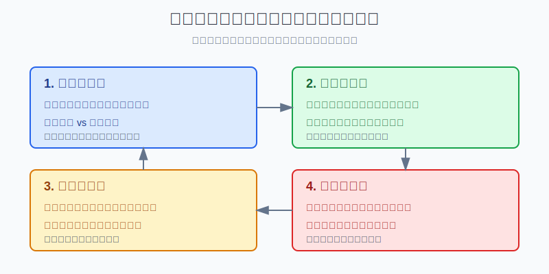
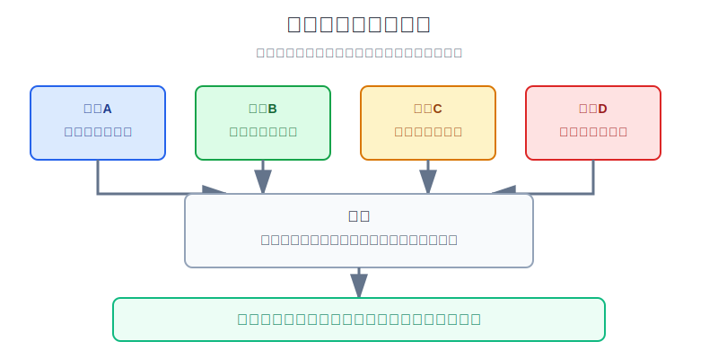
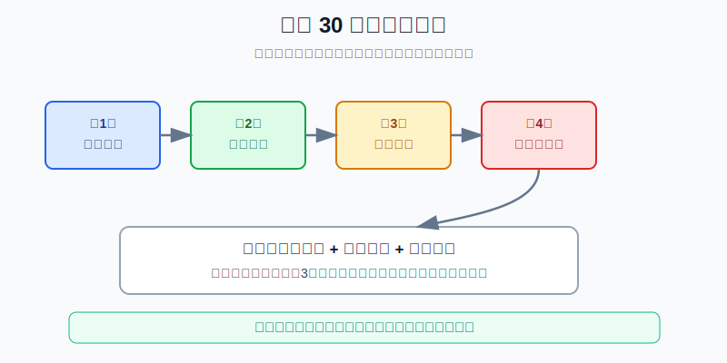

## 散户投资小白金融全品种操盘手册 - 附录.7 每周复盘模板
  
### 作者  
digoal  
  
### 日期  
2026-06-08   
  
### 标签  
金融产品 , 金融工具 , 散户 , 投资小白 , 全品操盘手册  
  
----  
  
## 背景 
  

> 适用读者: 已经开始买ETF、基金、个股、可转债、黄金、港美股或其他资产，但每到周末只会看账户赚亏，不知道下周该改什么的小白投资者。  
> 本文定位: 投资教育框架，不构成个性化投资建议。

## 先问一个反直觉的问题

每周复盘最重要的不是“这周赚了多少”，而是“下周少犯哪一个错误”。账户收益会受市场噪声影响，但重复错误会受你的习惯影响。**周复盘不是预测下周行情，而是把本周的交易变成下周的刹车。**

## 核心概念: 周复盘不是总结大会，而是一张纠偏表

日复盘看单笔动作，月复盘看组合系统。周复盘夹在中间，任务只有一个: 找出本周最重复、最伤账户、最需要立刻修的行为模式。

所以这张模板不能写成日记。不要写“本周市场很差”“我心态不好”“下周看反弹”。这些句子不能变成动作。合格的周复盘要写成数字和规则: 本周交易几笔，几笔有计划，几笔冲动下单，仓位有没有超限，现金比例有没有下降，哪一类错误出现次数最多，下周用哪一条规则拦住它。

本节行动结论先放在前面: **每周复盘只填四块: 账户事实、交易样本、偏差归因、下周动作。先用事实过滤情绪，再用统计找重复模式，最后只改一条下周规则。规则超过三条，小白通常执行不了；本周只抓主错因，下周才有机会真的改。**

## 逻辑推导链

【论证链标题】: 因为单笔盈亏有噪声、错误会重复、仓位会漂移，所以周复盘必须从事实表推导出一条下周可执行规则。

### 第一步: 前提陈述

前提A: 单笔盈亏有噪声，这是常量。一笔追涨买入也能短期赚钱，一笔按计划止损也会让账户变红。盈亏像天气，交易质量像出门有没有带伞；只看天气，会把运气误判成能力。

前提B: 错误会成批重复，这是变量，但在小白身上很常见。常见模式包括看到上涨就买、跌了就补、赚钱后加大仓位、亏损后急于翻本、没有卖出条件也下单。

前提C: 仓位每周会漂移，这是变量。一个行业ETF涨多了，可能从10%变成18%；连续几次补仓后，现金比例可能从25%降到10%；账户风险不是按你脑子里的计划运行，而是按周末实际市值运行。

前提D: 规则太多会失效，这是常量。小白周末写十条反省，下周开盘只记得情绪。真正能执行的规则，必须短、具体、可检查。

### 第二步: 逻辑推导

由A可得: 因为单笔盈亏会误导判断，所以周复盘第一步不能写观点，必须先填账户事实和交易事实。

由A+B可得: 因为一笔交易不能证明方法有效，但重复错误会暴露习惯，所以周复盘第二步要把交易按“有计划、无计划、超仓位、改卖出条件、按规则执行”分类。

由B+C可得: 因为重复错误会累积成仓位问题，所以周复盘不能只看每笔交易，还要看本周结束后的现金比例、单品种比例、单行业比例和风险资产比例。

再由D可得: 因为规则太多会执行不了，所以周复盘最后不能写一堆愿望，只能输出一条最关键的下周动作规则。

最后由A+B+C+D可得: **周复盘的标准动作是: 先填事实，再统计偏差，最后只改一条规则。它不负责预测行情，只负责减少下周重复犯错的概率。**

### 第三步: 正常情景下的操作结论

✅ 正常情景: 你每周有0到10笔交易，主要持有ETF、基金、个股、转债、黄金、REITs、QDII、港股或美股资产，不是职业日内交易者，也没有复杂量化系统。

对应操作: 每周收盘后用30分钟填一次周复盘表。第一块填账户事实，第二块填交易样本，第三块找本周主错因，第四块写下周规则。只要本周有交易，就必须写；如果本周没有交易，也要检查仓位和现金是否偏离目标。

### 第四步: 数据和案例证实

证据1: Barber 和 Odean 的《Trading is Hazardous to Your Wealth》研究了1991到1996年美国一家折扣券商的66,465个家庭账户。研究显示，最活跃交易者年化收益约11.4%，同期市场约17.9%，平均家庭账户约16.4%，并且平均年换手率达到75%。这个证据对应前提A和B: 频繁交易并不自动等于能力，若不记录和纠偏，交易越多越容易把成本、冲动和错误放大。

证据2: Barber、Lee、Liu 和 Odean 对台湾1992到2006年日内交易者的研究显示，少数人能持续盈利，但能稳定、可预测地扣费后取得正异常收益的人不到全部日内交易者的1%。这个证据对应前提B: 真正可复制的交易能力需要长期样本验证，不能靠一两周赚钱就把冲动交易写进策略库。

证据3: SEC 的资产配置和再平衡投资者教育材料说明，随着市场变化，投资组合会偏离原来的配置；例如原来股票60%的组合，可能因为股票上涨变成80%，从而改变账户风险。这个证据对应前提C: 周复盘至少要看仓位漂移，不能只看本周收益。

证据4: FINRA 关于市场波动的投资者教育材料提醒，波动环境下投资者容易冲动卖出或大幅改变组合，并强调清晰目标、分散配置和按计划行动。这个证据对应前提D: 模板的价值不是写更多情绪，而是在波动中把动作拉回计划。

失败案例: 小张有10万元账户，本周三次买入同一个热门行业ETF。周一买3000元，因为它上涨；周三再买5000元，因为社群都在讨论；周五又买7000元，因为他怕踏空。周末一看，本周还赚了600元，于是写“方向判断正确”。这就是错误复盘。正确复盘应写: 本周行业ETF从目标10%升到18%；三笔交易均无买入计划；买入理由都来自盘中上涨和外部讨论；主错因是追涨加仓。下周规则应写: 行业ETF超过15%不新增，没有买入计划不下单。失败不在于他一定会亏，而在于他把短期盈利误判成可复制方法。

历史数据不代表未来。上面证据仍有参考价值，是因为它们验证的是结构规律: 频繁交易会放大错误，少数稳定盈利者依赖长期样本，仓位会被市场涨跌改写，波动会诱发情绪动作。周复盘不能保证盈利，但能减少同一种错误重复出现。

### 第五步: 前提变化时的替代结论

若前提B改变，也就是你本周没有主动交易，推导路径变为: 因为没有交易样本，所以周复盘重点从“交易错因”切换到“仓位漂移”。新结论: 只填账户事实、目标仓位、实际仓位和下周是否需要补现金或控制超配资产。

若前提C恶化，也就是某一资产已经超过你的上限，比如单一行业从10%涨到22%，推导路径变为: 因为仓位漂移已经改变风险预算，所以周复盘不能只记录。新结论: 下周规则必须包含“停止新增”或“分批降回目标区间”。

若前提D失效，也就是你每周都写很多规则但执行不了，推导路径变为: 因为规则负担超过执行能力，所以不是继续加规则，而是减少交易数量。新结论: 下周只允许执行已有计划内交易，其他全部暂停。

反例: 周复盘不是越复杂越好。一个每月只定投宽基ETF的小白，不需要每周写2000字复盘；他只要每周确认是否按计划扣款、现金是否够、仓位是否偏离即可。模板要服务行动，不要制造负担。

## 每周复盘模板

下面这张表可以直接复制使用。合格标准是: 每一格都能用数字、分类或一句动作规则填写。

| 区域 | 字段 | 填写要求 |
|---|---|---|
| 账户事实 | 本周总资产 | 写周初、周末金额，不只写涨跌感受 |
| 账户事实 | 本周收益率 | 写百分比，同时标注是否跑赢自己的基准 |
| 账户事实 | 本周最大回撤 | 从本周高点到账户低点的最大跌幅 |
| 账户事实 | 现金比例 | 低于目标比例时，下周优先补现金 |
| 账户事实 | 仓位漂移 | 写目标比例、实际比例、偏离百分点 |
| 交易样本 | 本周交易笔数 | 买入、卖出、加仓、减仓分别统计 |
| 交易样本 | 计划交易数 | 买卖前写过理由、仓位、失效条件才算 |
| 交易样本 | 冲动交易数 | 看到上涨、听消息、怕踏空、急翻本都算 |
| 交易样本 | 执行偏差 | 是否改止损、超仓位、提前止盈、临时补仓 |
| 偏差归因 | 本周主错因 | 只选一个: 追涨、补仓、无计划、超仓、没卖出条件 |
| 偏差归因 | 本周有效动作 | 找一个值得重复的动作，比如按计划止损 |
| 偏差归因 | 禁止复制样本 | 赚钱但无计划的交易，归入禁止复制 |
| 下周动作 | 保留规则 | 哪条规则继续有效 |
| 下周动作 | 暂停动作 | 哪类交易下周暂停 |
| 下周动作 | 新增规则 | 只写一条，必须能在开盘前检查 |

## 实操例子: 10万元账户周末怎么填

这个例子对应论证链的正常结论: **先填事实，再统计偏差，最后只改一条规则。**

假设小林账户10万元，目标仓位是宽基ETF 50%、行业ETF 15%、债券和现金25%、黄金10%。本周他做了四笔交易: 周一按计划定投宽基ETF 3000元；周二看到半导体上涨，临时买入行业ETF 5000元；周四因为黄金下跌，卖出黄金ETF 3000元；周五又追买半导体ETF 4000元。

第一步，填账户事实。周初总资产100000元，周末100800元，本周收益率0.8%。现金比例从25%降到17%。行业ETF从目标15%升到24%。黄金从目标10%降到7%。如果只看收益，他会觉得本周不错；但事实表显示账户已经从均衡变成偏进攻。

第二步，分类交易样本。四笔交易里，计划交易1笔，冲动交易2笔，情绪卖出1笔。周一宽基定投按计划执行，保留。周二和周五半导体买入都没有买入计划，归入冲动交易。周四卖黄金不是因为卖出条件触发，而是因为短线下跌害怕，归入情绪卖出。

第三步，找主错因。小林本周不是“看错行情”，而是“无计划交易导致行业仓位超限”。主错因只能选一个，就选“追涨行业ETF”。原因是它出现2次，并且直接把行业ETF推到24%，超过目标15%。

第四步，写下周规则。不要写“下周保持理性”这种空话，要写成可检查规则: **行业ETF高于20%时不新增；没有买入计划的行业ETF订单全部取消。**这条规则能在开盘前执行，也能在盘中拦住冲动。

第五步，写纠偏动作。下周新增资金不买行业ETF，优先补债券和现金；如果行业ETF继续超过22%，分批卖出一部分，把它降到20%以内。黄金低于8%先不急着补，等现金比例回到22%以上再考虑。

如果前提不成立，操作要切换。若小林本周没有交易，只需要检查仓位漂移，不必硬找交易错因。若他做的是期权、期货或高波动个股，周复盘还不够，每笔交易当天都要复盘。若他连续两周都出现“无计划交易超过2笔”，下周不是继续优化模板，而是暂停主动买入。

## 可复用框架

【一错一规】

适用前提: 本周至少有一笔主动买卖，或者仓位出现明显偏离。

核心逻辑: 因为错误会重复，而规则太多会失效，所以每周只抓一个主错因，并把它改写成一条下周规则。

操作步骤:

1. 统计本周所有交易，不按盈亏评价，先按是否有计划分类。
2. 找出现次数最多、对仓位影响最大的错因。
3. 把错因改写成可执行规则，比如“无买入计划不下单”“单一行业超过20%不新增”。
4. 下周只检查这一条规则是否执行。

前提失效时: 如果一周内错因超过三类，说明交易数量已经超过管理能力，先减少交易，再谈修规则。

举一反三: 这个框架可以用于ETF、个股、转债、黄金、QDII、港美股，也可以用于月度复盘中的策略库管理。

【四格周表】

适用前提: 你有多个资产类别，或每周会查看账户并可能下单。

核心逻辑: 因为事实、样本、归因、动作是四个不同层级，所以周复盘表必须分格填写，不能混成情绪总结。

操作步骤:

1. 账户事实: 填收益、回撤、现金、仓位漂移。
2. 交易样本: 填交易笔数、计划交易、冲动交易、执行偏差。
3. 偏差归因: 找本周主错因和一个有效动作。
4. 下周动作: 保留一条、暂停一类、新增一条。

前提失效时: 如果本周无交易，保留账户事实和仓位漂移两格；如果本周高频交易，先把交易数量降到能记录的范围内。

举一反三: 这个框架也适合家庭预算、学习计划和工作项目复盘，先列事实，再找模式，最后改动作。

## 本节行动清单

| 动作 | 合格标准 |
|---|---|
| 固定时间 | 每周最后一个交易日收盘后或周末固定30分钟 |
| 先填事实 | 账户金额、收益率、回撤、现金比例、仓位偏离都用数字 |
| 分类交易 | 每笔交易标记为计划交易、冲动交易、情绪卖出或规则执行 |
| 找主错因 | 只选一个最重复、最伤账户的问题 |
| 写下周规则 | 只写一条，必须能在开盘前判断是否违反 |
| 禁止复制运气 | 赚钱但无计划的交易，不进入策略库 |
| 连错就暂停 | 连续两周无计划交易超过2笔，下周暂停主动买入 |

## 一句话总结

每周复盘不是问“下周会不会涨”，而是问“本周哪一个错误最该被拦住”；先填事实，再找主错因，最后只写一条下周规则。

## 参考资料

- Brad M. Barber, Terrance Odean: Trading is Hazardous to Your Wealth: The Common Stock Investment Performance of Individual Investors, Journal of Finance, 2000, https://ssrn.com/abstract=219228
- Brad M. Barber, Yi-Tsung Lee, Yu-Jane Liu, Terrance Odean: The Cross-Section of Speculator Skill: Evidence from Day Trading, 2012, https://ssrn.com/abstract=529063
- U.S. SEC: Beginners' Guide to Asset Allocation, Diversification, and Rebalancing, https://www.sec.gov/about/reports-publications/investorpubsassetallocationhtm
- FINRA: Volatility, https://www.finra.org/investors/investing/investing-basics/volatility

> ⚠️ **声明**：本文内容为投资教育目的，所有历史数据、策略框架均为辅助学习工具，不构成证券投资建议。市场有风险，投资需谨慎。实际操作请结合自身风险承受能力，必要时咨询专业投顾。
  
#### [PostgreSQL 解决方案集合](../201706/20170601_02.md "40cff096e9ed7122c512b35d8561d9c8")
  
  
#### [德哥 / digoal's Github - 公益是一辈子的事.](https://github.com/digoal/blog/blob/master/README.md "22709685feb7cab07d30f30387f0a9ae")
  
  
#### [About 德哥](https://github.com/digoal/blog/blob/master/me/readme.md "a37735981e7704886ffd590565582dd0")
  
  

  
