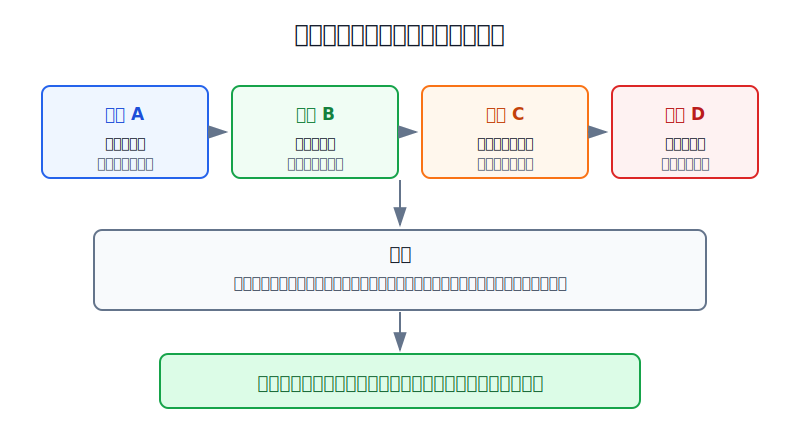
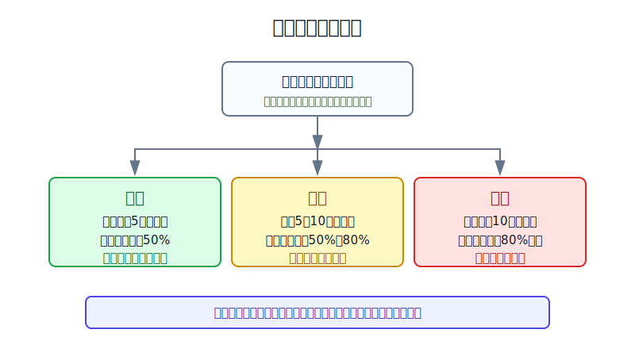
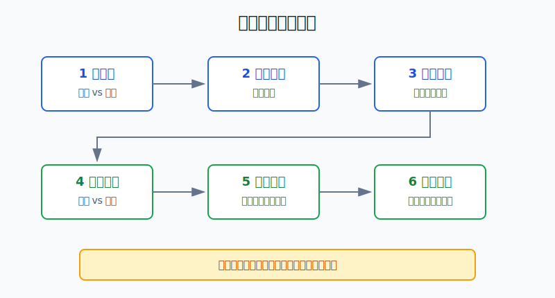

## 散户投资小白金融全品种操盘手册 - 附录.8 每月组合体检模板
  
### 作者  
digoal  
  
### 日期  
2026-06-08   
  
### 标签  
金融产品 , 金融工具 , 散户 , 投资小白 , 全品操盘手册  
  
----  
  
## 背景 
  

> 适用读者：已经持有多个资产，但月底只会看“这个月赚没赚”的小白投资者。  
> 本文定位：可直接复制使用的月度模板，服务于第十五章“组合体检表”、第十六章“月复盘”和第十七章“年度资产配置复盘”。

## 先问一个反直觉的问题

每月体检不是为了多交易，而是为了少交易。你填这张表的目的，不是预测下个月涨跌，而是确认账户有没有偏离原计划：钱是不是越投越集中，回撤是不是快碰到承受线，现金是不是被慢慢用光。

## 核心概念：月度体检是一张刹车表

月度组合体检，就是每月固定一天，把所有账户合并成一张表：证券账户、基金账户、港美股账户、现金、债券、黄金、REITs、QDII、可转债，都按市值算进来。

这张表只回答三个问题：

1. 本月账户发生了什么事实？
2. 这些事实有没有触发风险阈值？
3. 下个月到底是加、减、停，还是不动？

本节行动结论先放在前面：**每月体检只填一次，先填数字，再看红黄绿灯。全部绿灯，只记录不交易；出现黄灯，暂停给超配资产加钱；出现红灯，先把风险降回上限。**

## 逻辑推导链

【论证链标题】：因为账户会自动漂移，而人会被短期涨跌带偏，所以月度体检必须用固定模板把“感觉”压回“数字”。

── 第一步：前提陈述

前提A：账户比例会被市场涨跌自动改写。这是常量。你没有主动加仓，强势资产也会因为上涨变成更大仓位；防守资产也会因为被挪用而慢慢变小。

前提B：散户很容易被当月盈亏误导。这是常量。赚钱时觉得自己风险承受力变强，亏钱时又觉得所有资产都不安全。情绪不是数据，不能直接变成调仓指令。

前提C：频繁交易会制造成本和错判。这是变量，但在散户身上高频出现。交易越多，越容易把一次行情波动误读成策略信号。

前提D：提前写好的阈值能减少临时动作。这是常量加变量。阈值不是保证赚钱，它的作用是让你只在越界时行动，而不是看新闻、群聊或短线涨跌行动。

── 第二步：逻辑推导

由A可得：因为账户会漂移，所以每月必须记录目标仓位、当前仓位和偏离比例。只看持仓名称，不知道风险是否已经集中。

由A+B可得：因为当月盈亏会污染判断，所以体检表必须先写收益来源、最大回撤、现金比例，再写结论。顺序反了，结论就容易变成给情绪找理由。

再由B+C可得：因为频繁交易会放大错判，所以月度体检不能把每个波动都变成买卖。绿灯只记录，黄灯先暂停加风险，红灯才进入调整。

最后由C+D可得：因为阈值能把临时冲动挡在表外，所以月度体检的核心不是“下个月买什么”，而是“哪些风险已经越界，哪些动作必须停止”。

── 第三步：正常情景下的操作结论

✅ 正常情景：你有中长期投资资金，组合里至少有3类资产，例如宽基ETF、行业ETF、债券现金、黄金、REITs、QDII、美股或港股资产。

对应操作：每月最后一个交易日或每月固定周末，填一次体检表。全部绿灯，下月继续原计划；任一黄灯，下月新增资金不投向黄灯资产；任一红灯，先把红灯资产降回上限或把现金补回底线。

── 第四步：数据和案例证实

证据1：美国SEC在《Beginners' Guide to Asset Allocation, Diversification, and Rebalancing》中提醒，资产配置取决于资金期限和风险承受力；当股票从原定60%涨到80%时，需要通过卖出超配资产、买入低配资产或改变新增资金方向来恢复原配置。这个证据对应前提A和D：市场会改写仓位，体检表要把组合拉回计划。

证据2：Morningstar《Mind the Gap 2025》统计，截至2024年12月31日的10年里，美国基金和ETF的平均投资者收益为年化7.0%，基金总体收益为年化8.2%，差距约1.2个百分点，约等于基金总体收益的15%。报告还指出，现金流越不稳定、交易越多的基金，投资者收益缺口越大。这个证据对应前提B和C：临时买卖会吃掉本该拿到的收益。

证据3：Barber和Odean在《Trading is Hazardous to Your Wealth》中研究1991到1996年66,465个美国家庭账户，最活跃交易者年化收益为11.4%，同期市场为17.9%，平均家庭账户换手率约75%。这个证据对应前提C：交易多不等于能力强，很多时候只是成本和错判更多。

证据4：FINRA在集中度风险教育材料中提醒，组合中很大比例集中在某项投资、某类资产或某个板块时，亏损会被放大；同时，基金和ETF也要检查底层持仓是否重叠。这个证据对应前提A：表面买了很多产品，不代表风险真的分散。

历史数据不代表未来。上面证据仍有参考价值，是因为它们验证的是结构规律：账户会漂移，情绪会导致错误时点，频繁交易有成本，集中风险会把局部错误放大成账户错误。

── 第五步：前提变化时的替代结论

若前提A恶化，也就是某类资产从目标20%涨到32%，推导路径变为：因为账户已经被市场推向集中，所以不能继续给它加钱。新结论：新增资金先补低配资产；若超过上限10个百分点以上，分批降回目标区间。

若前提B恶化，也就是本月回撤已经让你睡不好或频繁临时下单，推导路径变为：因为真实承受力低于纸面承受力，所以不能继续提高风险资产比例。新结论：暂停主动买入，先降低高波动仓位。

若前提C恶化，也就是本月出现3笔以上无计划交易，推导路径变为：因为错误已经从单笔动作变成行为模式，所以月度体检必须升级为纪律处理。新结论：下月只允许执行定投和再平衡，不做临时买卖。

反例：如果本月收益为负，但回撤没有超过预算，仓位没有漂移，现金仍在底线以上，买入理由没有失效，正确动作不是清仓，而是记录。亏钱不自动等于策略错，越界才是动作触发器。

## 每月组合体检模板

把下面这张表复制到你的月度复盘里。每月只填一张，不要每天改。

| 模块 | 要填什么 | 本月记录 | 灯号 | 下月动作 |
|---|---|---|---|---|
| 1. 总资产 | 上月总资产、本月总资产、本月收益率 |  | 绿/黄/红 |  |
| 2. 收益来源 | 贡献最多的3个资产、拖累最多的3个资产 |  | 绿/黄/红 |  |
| 3. 回撤预算 | 本月最大回撤、年度最大回撤、你的回撤上限 |  | 绿/黄/红 |  |
| 4. 仓位漂移 | 目标比例、当前比例、偏离百分点 |  | 绿/黄/红 |  |
| 5. 集中和重叠 | 单资产、单行业、单国家、单币种、同主题基金重叠 |  | 绿/黄/红 |  |
| 6. 现金底线 | 生活钱、防守钱、进攻钱是否分清 |  | 绿/黄/红 |  |
| 7. 同跌测试 | 假设权益跌20%、行业跌40%、长债跌10%，组合亏多少 |  | 绿/黄/红 |  |
| 8. 行为纪律 | 本月无计划交易次数、追涨杀跌次数、是否按计划卖出 |  | 绿/黄/红 |  |
| 9. 下月执行单 | 加什么、减什么、暂停什么、不碰什么 |  |  |  |

## 红黄绿阈值表

下面这组阈值是小白版，不是法律规则。它的目的，是让你先有一套能执行的默认口径。

| 指标 | 绿灯 | 黄灯 | 红灯 |
|---|---|---|---|
| 仓位偏离 | 偏离目标5个百分点以内 | 偏离5到10个百分点 | 偏离超过10个百分点 |
| 回撤预算 | 当前回撤低于预算50% | 达到预算50%到80% | 达到预算80%以上或突破预算 |
| 单一行业/主题 | 不超过组合10% | 10%到15% | 超过15%且继续加仓 |
| 单只个股 | 不超过组合5% | 5%到8% | 超过8%或替代核心资产 |
| 现金和短债 | 高于计划底线 | 接近底线 | 低于底线，还想加风险 |
| 无计划交易 | 0笔 | 1到2笔 | 3笔以上 |
| 同跌损失 | 压力损失低于回撤预算50% | 50%到80% | 80%以上 |

灯号对应动作也要固定：

| 灯号 | 动作 |
|---|---|
| 绿灯 | 记录，不交易，继续原定投或持仓计划 |
| 黄灯 | 不加风险，用新增资金补低配资产，下一月复查 |
| 红灯 | 停止新增风险，减回上限，补现金或防守资产 |

## 实操例子：20万元账户怎么填

这个例子对应论证链的正常结论：**先填事实，再看阈值，最后才写动作。**

假设小林有20万元长期投资资金，目标仓位是：A股宽基30%，美股宽基25%，短债现金25%，黄金10%，行业主题10%。本月结束时，账户变成20.8万元。

| 资产 | 目标比例 | 当前市值 | 当前比例 | 偏离 |
|---|---:|---:|---:|---:|
| A股宽基ETF | 30% | 52000元 | 25.0% | -5.0个百分点 |
| 美股宽基QDII | 25% | 64000元 | 30.8% | +5.8个百分点 |
| 短债现金 | 25% | 39000元 | 18.8% | -6.2个百分点 |
| 黄金ETF | 10% | 21000元 | 10.1% | +0.1个百分点 |
| 半导体主题ETF | 10% | 26000元 | 12.5% | +2.5个百分点 |

第一步，填总资产。本月从20万元变成20.8万元，收益4%。绿灯，但这只是结果，不是结论。

第二步，拆收益来源。主要收益来自美股宽基和半导体主题，短债现金没有明显贡献。收益来源偏向权益和科技成长，标黄。

第三步，看回撤预算。小林年度最大可承受回撤是15%，本月最大回撤是4%，低于预算50%，回撤绿灯。

第四步，看仓位漂移。美股宽基偏离+5.8个百分点，短债现金偏离-6.2个百分点，都进入黄灯。结论不是“美股强，继续追”，而是“新增资金先补短债现金和A股宽基”。

第五步，做同跌测试。假设A股宽基跌20%、美股宽基跌20%、半导体主题跌40%，黄金和短债暂时不动，预计损失约52000×20% + 64000×20% + 26000×40% = 33600元，占当前账户约16.2%。这已经超过小林15%的回撤预算，相关性红灯。

第六步，写下月执行单：

| 条目 | 下月动作 |
|---|---|
| 美股宽基QDII | 不新增，若继续高于32%，分批降到30%以内 |
| 半导体主题ETF | 不新增，保持在15%红线以内 |
| 短债现金 | 新增资金优先补到22%以上 |
| A股宽基ETF | 若有定投，只投宽基，不投主题 |
| 临时交易 | 无买入计划不下单，本月若出现2笔冲动交易，下月暂停主动买入 |

如果小林操作错误，最常见的错误是看到本月赚4%，继续追买半导体和美股宽基。后果是账户看起来更赚钱，实际更集中；等风险偏好下降时，A股、美股、半导体可能一起跌，组合回撤会突破预算。纠偏方法不是预测顶部，而是按体检表先补现金、停加主题、把超配资产拉回目标。

## 可复用框架

【月检六格】

适用前提：你至少持有3类资产，并且每月能整理一次账户。

核心逻辑：因为收益会掩盖风险，所以每月只按固定顺序填六格：总资产、收益来源、回撤、仓位、同跌、动作。

操作步骤：

1. 先填总资产和收益来源，不急着下结论。
2. 再填回撤预算和仓位漂移，找出红黄绿灯。
3. 做同跌测试，检查表面分散是否失效。
4. 最后写下月执行单，只允许数字触发动作。

前提失效时：如果你只有一只货币基金或一只宽基定投，模板可以简化；如果你有期权、期货、杠杆ETF，必须额外增加保证金、杠杆倍数和强平风险检查。

举一反三：这个框架可以用于ETF组合、港美股组合、可转债组合、家庭资产配置和退休账户。

【红灯优先】

适用前提：体检表里同时出现赚钱资产和风险越界资产。

核心逻辑：因为赚钱会让人低估风险，所以红灯优先级高于收益。

操作步骤：

1. 任一红灯出现，先停止新增风险。
2. 红灯来自仓位超限，就减回上限或用新增资金稀释。
3. 红灯来自回撤接近预算，就降低高波动资产。
4. 红灯来自无计划交易，就暂停主动买入。

前提失效时：如果红灯来自短期急用钱、家庭负债或保证金风险，先处理现金和安全边界，收益目标让位。

举一反三：当牛市赚钱、主题基金暴涨、个股翻倍、港美股汇率收益叠加时，都要用“红灯优先”压住追涨冲动。

## 本节行动清单

| 动作 | 合格标准 |
|---|---|
| 固定日期 | 每月最后一个交易日或固定周末体检一次 |
| 合并账户 | 把现金、基金、股票、ETF、转债、黄金、港美股都算进去 |
| 先填数字 | 不先写观点，不先看新闻 |
| 标红黄绿 | 每个模块都给灯号，不能只看收益 |
| 写执行单 | 下月只允许执行表里写过的动作 |
| 保留记录 | 每月至少保存12个月，年底复盘才有样本 |

## 一句话总结

每月组合体检模板不是让你更勤快地买卖，而是让你在账户偏离、情绪上头、风险集中时及时踩刹车；绿灯不动，黄灯停加，红灯降险。

## 参考资料

- U.S. SEC: Beginners' Guide to Asset Allocation, Diversification, and Rebalancing, https://www.sec.gov/about/reports-publications/investorpubsassetallocationhtm
- FINRA: Asset Allocation and Diversification, https://www.finra.org/investors/investing/investing-basics/asset-allocation-diversification
- FINRA: Concentrate on Concentration Risk, 2022年6月15日, https://www.finra.org/investors/insights/concentration-risk
- Morningstar: Mind the Gap 2025, 2025年8月13日, https://www.morningstar.com/content/cs-assets/v3/assets/blt9415ea4cc4157833/blt2c5c4d9171638c42/689b424311f3880edc4b4813/US_Mind_the_Gap_2025.pdf
- Brad M. Barber, Terrance Odean: Trading is Hazardous to Your Wealth, Journal of Finance, 2000, https://ssrn.com/abstract=219228

> ⚠️ **声明**：本文内容为投资教育目的，所有历史数据、策略框架均为辅助学习工具，不构成证券投资建议。市场有风险，投资需谨慎。实际操作请结合自身风险承受能力，必要时咨询专业投顾。
  
#### [PostgreSQL 解决方案集合](../201706/20170601_02.md "40cff096e9ed7122c512b35d8561d9c8")
  
  
#### [德哥 / digoal's Github - 公益是一辈子的事.](https://github.com/digoal/blog/blob/master/README.md "22709685feb7cab07d30f30387f0a9ae")
  
  
#### [About 德哥](https://github.com/digoal/blog/blob/master/me/readme.md "a37735981e7704886ffd590565582dd0")
  
  

  
