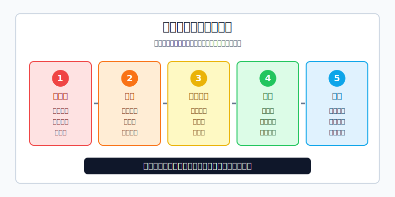
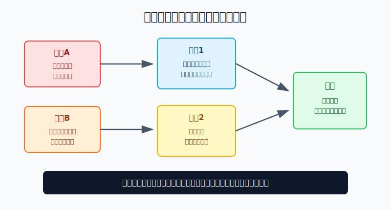
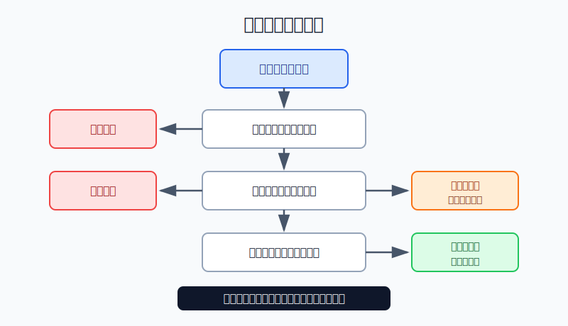

## 散户投资小白金融全品种操盘手册 - 附录.9 高风险产品红线清单
  
### 作者  
digoal  
  
### 日期  
2026-06-08   
  
### 标签  
金融产品 , 金融工具 , 散户 , 投资小白 , 全品操盘手册  
  
----  
  
## 背景 
  

> 适用读者: 已经看过股票、ETF、转债、黄金、REITs、港美股、期货和期权章节，但还想知道“哪些东西小白一开始就不要碰”的散户投资者。  
> 本文定位: 投资教育和风险排雷，不构成任何证券、基金、期货、期权或跨境投资建议。

## 先问一个更现实的问题

散户亏钱，很多时候不是因为买了“会波动”的产品，而是买了**错了以后无法体面退出**的产品。红线清单的作用不是帮你预测涨跌，而是在下单前先问: 这东西一旦错了，会不会把一次亏损变成债务、强平、诈骗或长期套牢？

## 核心概念: 红线不是风险提示，是一票否决

普通风险提示像路边的“慢行”牌，意思是你可以走，但要小心。红线不一样，红线像悬崖边的护栏，意思是普通人不要跨过去。

本书前面讲了很多工具: ETF、转债、黄金、REITs、美股、期货、期权。它们不是天然都不能碰，真正危险的是五类结构:

1. **平台不合法**: 无牌平台、场外配资、虚拟盘、假App、群里带单。你以为在交易，其实资金可能根本没有进入正规市场。
2. **杠杆会强平**: 融资融券、期货、黄金T+D、裸卖期权、部分境外保证金产品。你以为亏损只是浮亏，系统会要求你补钱或直接平仓。
3. **最大亏损说不清**: 裸卖认购、融券做空、复杂期权组合、带追缴责任的合约。你不知道最坏会亏多少，就没有资格谈“赔率”。
4. **规则会改变结果**: 杠杆/反向ETF的每日重置，商品基金的移仓，期权的到期归零，期货的交割和保证金调整。名字简单，不代表机制简单。
5. **退出不可靠**: 成交量很小、买卖价差很大、临近退市、长期停牌、OTC或灰色平台。买入很容易，卖出时没有对手盘。

本节行动结论先放在前面: **任何产品只要触发“平台不明、借钱加杠杆、最大亏损说不清、规则看不懂、退出没把握”中的任意一条，小白默认不下单。不是少买一点，而是不下单。**

## 逻辑推导链

【论证链标题】: 因为高风险产品会把判断错误放大成账户错误、债务错误或法律风险，所以散户必须先用红线清单筛掉它们，再讨论收益。

── 第一步: 前提陈述

前提A: 高风险产品真正危险的地方，通常不是“价格会跌”，而是自带放大器。这是常量。杠杆会放大亏损，期权卖方会放大义务，非法平台会放大信用风险，低流动性会放大退出成本。

前提B: 散户的资金、信息、盯盘时间和风控工具都有限。这是常量。专业机构可以用系统监控保证金、用对冲降低敞口、用合规团队核验交易结构，小白很难做到。

前提C: 合法性、适当性门槛、保证金比例、到期日、流动性和平台风控规则都会影响最终亏损。这是变量。行情没变，券商提高保证金、产品临近到期、平台不能出金，也会让结果变坏。

前提D: 高风险产品最常见的销售话术，是“低门槛、高杠杆、回本快、老师带、稳赚模型”。这是行为变量。它专门击中散户亏损后想翻本、牛市中怕踏空的心理。

── 第二步: 逻辑推导

由A可得: 因为这些产品自带放大器，所以它们不能按“涨了赚、跌了亏”这么简单理解。你买的不是一个价格方向，而是一整套合约、杠杆、平台和退出规则。

由A+B可得: 因为散户承压能力有限，所以只要产品会强平、追缴、到期归零或无法退出，一次判断错误就可能超过账户预设亏损。

再由A+B+C可得: 因为平台、适当性、保证金和流动性会改变真实风险，所以“能买到”不等于“适合买”。能开权限，也不等于已经理解风险。

最后由A+B+C+D可得: 因为销售话术会诱导你先看收益、后看风险，所以正确顺序必须反过来: **先查红线，再看收益；先算最坏，再谈机会。**

── 第三步: 正常情景下的操作结论

✅ 正常情景: 你是普通散户，没有职业交易系统，没有全天盯盘能力，没有稳定验证过的策略，也不能承受本金之外的额外追缴。

对应操作: 把下面这些列入默认禁用区:

| 红线类别 | 典型表现 | 小白动作 |
|---|---|---|
| 非法或灰色平台 | 场外配资、虚拟盘、假App、陌生人开户链接、无牌境外保证金平台 | 不开户、不入金、不跟单 |
| 借钱或高杠杆 | 信用贷炒股、套信用卡、10倍配资、重仓融资融券 | 不借钱、不满仓、不加杠杆 |
| 亏损无边界 | 裸卖认购、裸卖跨式、融券做空、复杂场外衍生品 | 最大亏损写不清就不做 |
| 规则复杂 | 期货交割、期权到期、杠杆ETF每日重置、商品基金移仓 | 规则说不清先模拟学习 |
| 退出困难 | 成交稀少ETF、仙股、退市边缘股、停牌风险高的品种 | 不重仓，不拿急用钱买 |

── 第四步: 数据和案例证实

证据1: 证监会2020年7月8日集中曝光258家非法从事场外配资的平台及运营机构，并指出这些平台常用“最高十余倍炒股资金”“杠杆炒股、盈利高”“实盘交易、门槛低”等话术吸引投资者。证监会同时说明，证券融资融券业务属于证券公司专营业务，场外配资合同属于无效合同，参与者自行承担相关风险和责任。这对应前提C和D: 平台不合法时，第一风险不是行情，而是交易关系本身不受正常保护。

证据2: 证监会2022年6月8日公布8个场外配资典型案例。益升网案中，平台向客户提供保证金金额1至10倍配资资金，2019年11月至2020年3月收取客户以保证金名义投入的资金约3811.48万元；涨股宝APP案中，平台提供3至8倍杠杆。还有虚拟盘诈骗案中，被害人2020年6月至8月入金134.50万元、出金32.86万元，亏损101.64万元。这对应前提A和C: 高杠杆和假平台会把普通交易风险变成刑事案件和本金损失。

证据3: CFTC 的 Futures Market Basics 提醒，商品期货和期权交易复杂且高风险，通常很少适合个人投资者；许多个人会亏掉全部资金，并可能需要支付超过初始投入的金额。它还提醒客户资金管理、注册、每日按市值调整等问题。这对应前提A和B: 保证金合约不能按“最多亏本金”理解。

证据4: FINRA 2026年6月4日的保证金教育文章说明，美国 Reg T 下券商一般可对合格股票初始借出最多50%的购买资金；客户保证金账户权益通常不得低于所持多头证券当前市值的25%；券商还可以设置更高的自有维持保证金要求，并且可以不提前书面通知就提高要求。FINRA 同文还提醒，券商不必先发出保证金通知再卖出账户证券，也不必让客户选择卖出哪项资产。这对应前提C: 杠杆账户里，退出权不完全在你手里。

证据5: SEC 投资者公告2023年8月29日提醒，杠杆和反向ETF通常按每日目标设计，持有超过一天后，长期表现可能与标的指数的倍数或反向倍数显著不同，波动市场会放大这种差异。公告举例: 某指数4个月上涨2%，一只追求2倍每日收益的杠杆ETF反而下跌6%，一只追求2倍每日反向收益的ETF下跌25%。这对应前提A和C: 产品名字里的“2倍”不是长期收益承诺。

证据6: 上交所《股票期权试点投资者适当性管理指引（2017年修订）》要求，个人投资者申请股票期权开户前20个交易日证券市值与资金账户可用余额合计不低于50万元，并要求具备相应交易经历。证监会《证券期货投资者适当性管理办法》也强调，要基于投资者风险承受能力和产品风险等级提出适当性匹配意见。门槛不是身份标签，而是提醒你: 复杂产品需要资金、经验和风险承受力同时匹配。

历史不代表未来。上面这些证据仍然有参考价值，是因为它们验证的是结构规律: 非法平台会让交易关系失真，杠杆会让亏损加速，保证金规则会改变退出权，复杂产品会让收益路径和名字不一致。

── 第五步: 前提变化时的替代结论

若前提C变好，也就是平台合法、产品透明、亏损上限能写成数字、流动性充足，推导路径变为: 因为基础交易关系可验证，所以产品不再自动禁用。新结论: 可以进入仓位判断，但仍然只允许小比例试错，不能借钱和满仓。

若前提A仍然存在，也就是产品合法但有杠杆、保证金、到期或强平，推导路径变为: 因为结构风险仍在，所以不能把“合规”误读成“低风险”。新结论: 小白只做模拟盘或极小仓位学习，单次最大亏损先控制在总投资资金的0.5%-1%。

若前提B改变，也就是你已具备多年记录、稳定策略、足额保证金缓冲和严格复盘系统，推导路径变为: 高风险产品可以作为专业工具研究，但仍不是默认配置。新结论: 用专业风控表处理，不用“感觉”和“老师说”下单。

若前提D出现，也就是你已经开始想“亏了靠杠杆翻本”“这次机会不能错过”“群里老师很准”，推导路径变为: 情绪已经先于规则。新结论: 当天停止交易，先写红线检查表，写不完不下单。

失败案例的共同点不是“运气差”，而是前提被破坏后还继续交易: 平台不合法还入金，杠杆过高还补钱，规则不懂还重仓，流动性差还幻想随时卖出。

## 实操例子: 10万元账户如何使用红线清单

这个例子对应论证链的核心结论: **任一红线触发，默认不下单。**

假设你有10万元投资资金，已经买过宽基ETF，也有几次个股亏损经历。某天你看到一个群里推广“10倍配资，老师带单，实盘可查，今天开户明天翻本”。

第一步，查平台合法性。它不是证券公司融资融券账户，而是通过网页、App或个人账户转账入金。触发“非法或灰色平台”红线。动作: 不开户，不下载，不转账。哪怕对方发收益截图，也不进入下一步。

第二步，算杠杆。10万元配10倍，名义控制资金可能接近100万元。股票只要反向波动10%，你的本金就可能被打穿，还不算利息、手续费和平台处理规则。触发“借钱或高杠杆”红线。动作: 不用“少配一点”安慰自己，直接退出。

第三步，问最大亏损。对方如果只说“我们有风控线”“老师会提醒”，但说不清亏损、强平、不能出金、交易是否进交易所的细节，触发“最大亏损说不清”红线。动作: 停止沟通，保留证据，必要时向监管或公安渠道反映。

再换一个场景。你在正规券商里看到一只3倍杠杆ETF，觉得“指数长期上涨，那我长期拿3倍不是更好吗”。第一步，平台合规，暂时过关；第二步，产品有杠杆和每日重置，触发规则复杂红线；第三步，你如果不能解释为什么指数4个月涨2%时，2倍杠杆ETF仍可能亏损，那就说明你买的是名字，不是机制。动作: 不把它放进长期核心仓，只能在模拟表里观察，直到你能写清持有期限、止损、仓位上限和波动情景。

再换一个更温和的场景。你想买一只规模较大、成交活跃、跟踪沪深300的普通ETF。平台合规，最大亏损最多是投入本金，规则清楚，买卖价差小，适当性门槛匹配。它没有触发红线。动作: 进入正常仓位管理，用本书的“环境判断、品种选择、仓位上限、买入条件、卖出条件、复盘”模板处理。

## 可复用框架

【五问封口】

适用前提: 你准备买一个自己不熟悉、收益宣传很诱人的产品。

核心逻辑: 因为高风险产品的问题常藏在平台、杠杆、亏损边界、规则和退出里，所以先问五个问题，把不该做的交易封住。

操作步骤:

1. 平台合法吗: 能否在监管、交易所、协会或正规券商渠道核验？
2. 是否用杠杆: 是否需要借钱、保证金、追加资金或承担强平？
3. 最大亏损是多少: 能否写成具体金额，是否会超过投入本金？
4. 规则讲得清吗: 到期、交割、每日重置、移仓、税费和权限是否理解？
5. 退出顺畅吗: 成交量、买卖价差、停牌、退市和提现是否可控？

前提失效时: 任意一问回答不清，停止交易。不是“再研究一下就买”，而是先不买，再研究。

举一反三: 这个框架可以用于场外配资、期货、期权、杠杆ETF、跨境产品、私募产品、结构化票据和任何群里推荐的“高收益机会”。

【三层处理】

适用前提: 产品通过了五问，但你仍不确定该不该买。

核心逻辑: 因为不是所有高风险产品都一样，所以按红、黄、绿三层处理，不把所有机会混成一团。

操作步骤:

1. 红灯: 平台不合法、最大亏损无边界、需要借钱补保证金、无法出金或无法核验交易。动作是不碰。
2. 黄灯: 平台合规，但规则复杂、波动大、流动性一般、需要专业判断。动作是模拟盘或极小仓学习。
3. 绿灯: 平台合规、规则清楚、亏损封顶、流动性好、仓位可控。动作是进入正常仓位管理。

前提失效时: 绿灯产品一旦出现流动性变差、规则变更、仓位过大或情绪化加仓，立刻降级为黄灯或红灯。

举一反三: 股票从绿灯变黄灯，常见于成交萎缩、基本面恶化、退市风险上升；ETF从绿灯变黄灯，常见于规模过小、溢价过高、买卖价差扩大。

## 本节行动清单

| 动作 | 合格标准 |
|---|---|
| 写下五条红线 | 平台不明、借钱杠杆、亏损无边界、规则不懂、退出困难 |
| 拒绝非法平台 | 不碰场外配资、虚拟盘、假App、无牌境外保证金平台 |
| 禁止借钱交易 | 不用信用贷、信用卡、网贷、亲友借款补仓或加杠杆 |
| 先写最大亏损 | 写不出具体金额，不下单 |
| 先查规则 | 到期、交割、每日重置、保证金、强平规则说不清，不下单 |
| 先看退出 | 成交量少、价差大、提现不明、停牌退市风险高，不重仓 |
| 触发红线即停止 | 不用“少买一点”“老师很准”“这次特殊”破例 |

## 一句话总结

高风险产品排雷的核心不是判断它会不会涨，而是先判断: 错了以后，亏损会不会被杠杆、平台、规则和流动性放大到你承受不了。

## 参考资料

- 中国证监会: 《证监会集中曝光非法从事场外配资平台名单》，2020年7月8日，https://www.csrc.gov.cn/csrc/c100028/c1000750/content.shtml
- 中国证监会: 《场外配资典型案例》，2022年6月8日，https://www.csrc.gov.cn/csrc/c106299/c3452535/content.shtml
- CFTC: Futures Market Basics，https://www.cftc.gov/LearnAndProtect/EducationCenter/FuturesMarketBasics/index2.htm
- FINRA: Know What Triggers a Margin Call，2026年6月4日，https://www.finra.org/investors/insights/margin-calls
- SEC Investor.gov: Updated Investor Bulletin: Leveraged and Inverse ETFs，2023年8月29日，https://www.investor.gov/introduction-investing/general-resources/news-alerts/alerts-bulletins/investor-alerts/sec
- OCC: Characteristics and Risks of Standardized Options，June 2024 ODD，https://www.theocc.com/company-information/documents-and-archives/options-disclosure-document
- 上海证券交易所: 《上海证券交易所股票期权试点投资者适当性管理指引（2017年修订）》，https://www.sse.com.cn/lawandrules/sselawsrules2025/option/c/c_20250610_10781453.shtml
- 中国证监会: 《证券期货投资者适当性管理办法》，2017年7月1日起施行，https://www.csrc.gov.cn/csrc/c106256/c1653849/content.shtml

> ⚠️ **声明**：本文内容为投资教育目的，所有历史数据、策略框架均为辅助学习工具，不构成证券投资建议。市场有风险，投资需谨慎。实际操作请结合自身风险承受能力，必要时咨询专业投顾。
  
#### [PostgreSQL 解决方案集合](../201706/20170601_02.md "40cff096e9ed7122c512b35d8561d9c8")
  
  
#### [德哥 / digoal's Github - 公益是一辈子的事.](https://github.com/digoal/blog/blob/master/README.md "22709685feb7cab07d30f30387f0a9ae")
  
  
#### [About 德哥](https://github.com/digoal/blog/blob/master/me/readme.md "a37735981e7704886ffd590565582dd0")
  
  

  
