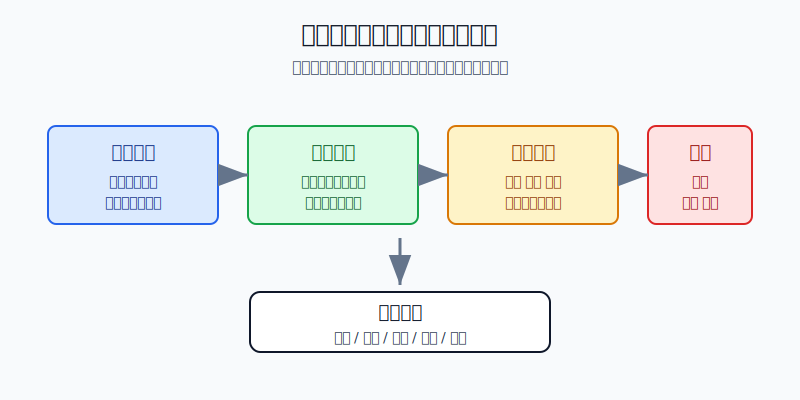
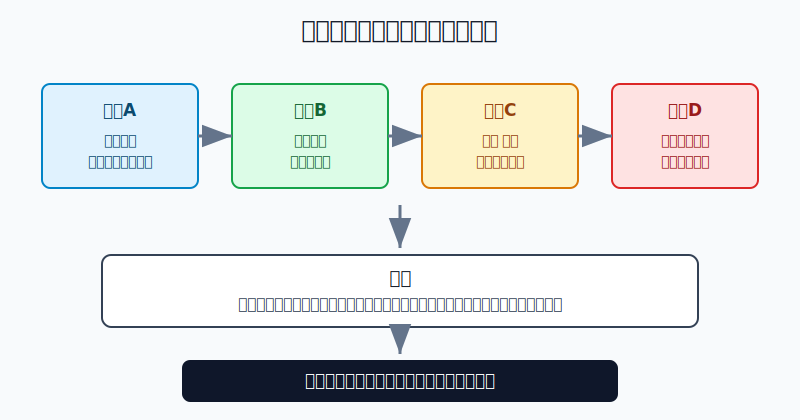
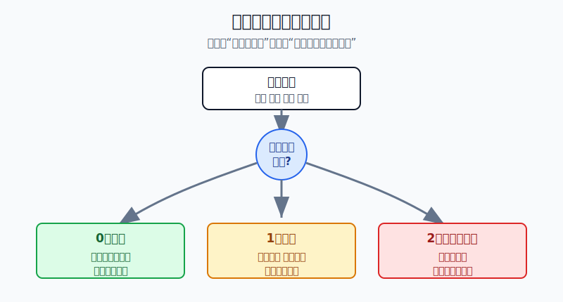

## 散户投资小白金融全品种操盘手册 - 附录.10 本书所有策略的适用前提与失效条件
  
### 作者  
digoal  
  
### 日期  
2026-06-08   
  
### 标签  
金融产品 , 金融工具 , 散户 , 投资小白 , 全品操盘手册  
  
----  
  
## 背景 
  

> 适用读者: 已经读过前面章节，但担心“策略太多、场景太多、到底什么时候该用”的小白投资者。  
> 本文定位: 投资教育框架，不构成个性化投资建议。

## 先说一个最容易亏钱的真相

很多亏损不是因为策略本身错，而是因为你把一个有前提的策略，当成了任何时候都能用的万能按钮。定投、网格、再平衡、双低转债、黄金防守、期权保险，都有自己的“使用说明书”。

## 核心概念: 适用前提和失效条件

适用前提，就是一把钥匙对应的锁。钥匙没错，但锁换了，硬拧只会把门和钥匙一起弄坏。

失效条件，就是告诉你“这把钥匙现在别用了”的信号。比如宽基ETF定投的前提是长期资金、分散资产、能承受回撤；如果这笔钱三个月后要交房款，资金前提已经失效，就不能继续把它当长期定投资金。再比如杠杆ETF和反向ETF的前提是短期、明确、能盯盘；如果你把它拿来长期持有，产品前提就变了。

本节行动结论先放在前面: **每个策略使用前，都要过四道门: 资金前提、品种前提、环境前提、红线前提。0个前提失效，按计划执行；1个前提失效，暂停加仓或降低速度；2个及以上前提失效，降仓、退出或重写策略。**

## 逻辑推导链

【论证链标题】: 因为策略收益来自特定风险补偿，而市场和个人条件会变化，所以策略必须先写适用前提，再写失效后的动作。

── 第一步: 前提陈述

前提A: 每个策略只是在赚某一种风险的钱。这是常量。宽基ETF赚的是企业长期增长和市场风险溢价；债券赚的是利息和利率变化；黄金赚的是避险、实际利率下行和货币信用重估；期权保险赚的不是收益，而是用成本换保护。

前提B: 风险补偿有环境边界。这是常量。利率下行时，长久期债券更容易受益；风险偏好上升时，权益资产更容易受益；波动剧烈但方向不明时，杠杆和反向产品更容易被日度重置拖累。

前提C: 资金期限、估值、利率、流动性、汇率、政策和情绪都会变化。这是变量。你买入时是长期闲钱，半年后可能变成买房钱；你买入时ETF折溢价正常，行情热起来后可能出现高溢价。

前提D: 人会把过去赚到的钱误以为是永久规律。这是行为常量。一个策略连续有效三次，小白很容易在第四次把仓位加大；等前提变了，亏损也会被同步放大。

── 第二步: 逻辑推导

由A+B可得: 因为策略只赚特定风险的钱，而风险补偿有环境边界，所以没有任何策略适合所有市场。

再由B+C可得: 因为环境边界会变化，所以买入时成立的逻辑，持有中必须重新检查。不是价格跌了就一定补，也不是价格涨了就一定追。

再由C+D可得: 因为人会被过去的盈亏影响，所以失效条件必须提前写，而不是亏损后临时找理由。临时找理由，本质上是在给错误仓位续命。

── 第三步: 正常情景下的操作结论

✅ 正常情景: 资金期限合格；品种风险理解清楚；当前市场环境支持该策略；没有触碰借钱、满仓、高杠杆、流动性太差等红线。

对应操作: 按计划执行，但每周或每月体检一次。体检只问四件事: 资金还能不能承受波动，品种风险有没有变，环境前提是否仍支持，红线有没有被触碰。

── 第四步: 数据和案例证实

证据1: S&P Dow Jones Indices 的 SPIVA U.S. Year-End 2024 报告显示，2024年有65%的美国主动大盘股票基金跑输S&P 500；截至2024年末的15年周期里，没有一个统计类别出现“多数主动经理跑赢基准”的结果。这个证据对应前提A和B: 连专业基金经理的策略也有边界，小白更不能把某个方法当永久提款机。

证据2: SEC 投资者公告《Leveraged and Inverse ETFs》提醒，杠杆和反向ETF通常追求的是单日倍数或反向收益，可能让买入并长期持有的投资者误解其表现目标。这个证据对应前提B和C: 产品结构本身决定了适用前提，一旦把短期工具拿去长期持有，策略就已经变形。

证据3: FINRA 的投资者教育材料《Asset Allocation and Diversification》把资产配置、分散和再平衡放在一起讨论，并提示投资者可在年度审查中考虑是否需要再平衡。这个证据对应前提C: 组合不是买完就结束，前提检查本身就是投资动作的一部分。

失败案例: 投资者用“震荡市网格”买行业ETF，最初几次高抛低吸成功，于是把网格资金从组合的10%加到40%。随后行业基本面下行，ETF一路下跌，网格从“赚波动”变成“越跌越买”。这里失败的不是网格本身，而是两个前提同时失效: 行业长期逻辑被破坏，仓位红线也被突破。

历史数据不代表未来。上面数据仍有参考价值，是因为它们验证的不是某个点位，而是结构规律: 策略有边界，产品有结构，人的纪律会被行情考验。

── 第五步: 前提变化时的替代结论

若资金前提改变，推导路径变为: 因为这笔钱不再是长期闲钱，所以不能继续承受长期波动。新结论: 停止买入权益、商品、转债和长久期资产，把短期要用的钱转回现金管理或短债。

若品种前提改变，推导路径变为: 因为你不再理解风险来源，或产品流动性、折溢价、杠杆结构已经不合格，所以不能继续用原策略。新结论: 暂停交易，先查公告、规模、成交额、折溢价和费用。

若环境前提改变，推导路径变为: 因为策略赚的钱来自旧环境，而新环境不再支付这笔风险补偿，所以仓位要降级。新结论: 从“买入/加仓”切到“观察/持有/减仓”。

若红线前提被触碰，推导路径变为: 因为借钱、满仓、重杠杆、看不懂还加仓会把普通波动变成生存风险，所以不再讨论收益。新结论: 先降风险，后谈机会。

## 策略适用前提总表

| 策略 | 适用前提 | 失效条件 | 动作切换 |
|---|---|---|---|
| 货币基金、现金管理 | 1年内要用的钱，目标是流动性 | 预期它赚大钱，或拿它和股票收益比 | 只当停车场，不当进攻仓 |
| 短债、债券ETF | 风险偏好低，能接受小幅净值波动 | 利率快速上行、信用风险暴露、久期过长 | 降低久期，优先看高等级和流动性 |
| 宽基ETF定投 | 长期闲钱，至少3到5年不用，能承受回撤 | 短期要用钱，或估值极端过热还加速买 | 降低节奏，改为估值和仓位约束 |
| 行业ETF、主题ETF | 明确行业逻辑，仓位是卫星，不替代核心 | 主题过热、成交拥挤、逻辑证伪、仓位超限 | 停止加仓，分批降回上限 |
| 红利、高股息、REITs | 追求现金流，能看懂分红来源 | 分红靠透支，资产经营下滑，利率上行压估值 | 从“看股息率”切到“看现金流质量” |
| A股和美股个股 | 了解公司、估值、仓位和失效条件 | 财务质量变坏、竞争格局变坏、估值透支 | 先降仓，再重新写买入理由 |
| 可转债双低 | 分散持有，价格和溢价率都不高 | 信用恶化、强赎风险临近、低价来自退市风险 | 不因便宜补仓，先排雷 |
| 黄金ETF | 需要防守，实际利率下行或避险需求上升 | 风险偏好明显回升、实际利率走强、仓位过高 | 从进攻买入切到防守持有或再平衡 |
| QDII、跨境ETF、美股ETF | 做全球配置，能承受汇率和时差 | 高溢价、额度紧张、汇率单边押注、短期追涨 | 等溢价回落，控制海外仓位 |
| 商品基金、资源ETF | 通胀、供需或库存逻辑清楚 | 只因价格上涨追入，供需逻辑反转 | 降低仓位，不用商品替代核心资产 |
| 期权保护、备兑 | 用来保险或增强收益，能理解到期日和义务 | 把期权当彩票，裸卖，重仓末日期权 | 回到保险属性，不做无限风险暴露 |
| 期货、杠杆ETF、反向ETF | 极小仓位、短期、明确风控、能盯盘 | 借钱、满仓、扛单、长期持有日度重置产品 | 退出学习区，不用高风险工具翻本 |

## 实操例子: 20万元组合如何做策略体检

这个例子对应论证链的正常结论: **每个策略先过四道门，失效数量决定动作。**

小周有20万元长期投资资金，组合是: 宽基ETF 10万元，行业ETF 3万元，短债基金3万元，黄金ETF 2万元，可转债组合2万元。他给自己写的规则是: 行业ETF最高不超过20%，单只可转债不超过2%，黄金最高15%，任何高风险工具不借钱不加杠杆。

第一步，看资金前提。小周未来3年没有确定大额支出，生活备用金单独放着，所以长期资金前提合格。如果他半年后要买房，这一步就直接失效，宽基、行业、转债都要降仓，不需要再讨论行情。

第二步，看品种前提。宽基ETF规模、成交额、跟踪误差正常；短债基金持仓以高等级债为主；黄金ETF只是防守仓；行业ETF从15%涨到24%。这里行业ETF的品种前提没有坏，但仓位红线被突破。

第三步，看环境前提。宽基估值不极端，继续定投；行业ETF上涨来自短期热度，成交拥挤，但基本面还没证伪；黄金的避险逻辑仍在，但已经接近仓位上限。

第四步，决定动作。行业ETF只有“仓位红线”一个前提失效，所以动作不是清仓，而是暂停加仓，并把超出20%的部分分两次降回15%到18%。黄金不再新增，只保留防守仓。宽基ETF继续按月定投，短债继续做防守资金。

如果两个月后行业基本面也被证伪，比如盈利下修、政策收紧、龙头公司业绩连续低于预期，那就变成两个前提失效: 环境前提失效 + 仓位红线失效。动作要从“暂停加仓”升级为“降仓或退出”，不能再用“跌了更便宜”安慰自己。

## 可复用框架

【四门体检】

适用前提: 你已经有持仓，或准备使用本书任一策略。

核心逻辑: 因为策略有边界，所以每次操作前先过资金、品种、环境、红线四道门。

操作步骤:

1. 资金门: 这笔钱多久不用，最大亏损能不能承受。
2. 品种门: 这个工具赚什么钱，亏损来自哪里，流动性是否合格。
3. 环境门: 当前估值、利率、情绪、汇率、政策是否支持策略。
4. 红线门: 有没有借钱、满仓、重杠杆、看不懂还加仓。

前提失效时: 0个失效按计划，1个失效暂停加仓，2个及以上失效降仓或退出。

举一反三: 这个框架能用在ETF、个股、转债、黄金、REITs、QDII、期权和期货。

【失效优先】

适用前提: 你已经盈利或亏损，开始想给持仓找理由。

核心逻辑: 因为人会维护旧判断，所以复盘先找失效条件，再看收益机会。

操作步骤:

1. 先写原始买入前提。
2. 逐条标记仍成立、部分成立、不成立。
3. 不成立的前提达到2条，先降风险。

前提失效时: 如果连原始买入前提都写不出来，说明这不是策略，是冲动交易；先停止加仓。

举一反三: 亏损补仓、盈利加仓、年度再平衡、主题基金追涨，都要先做失效检查。

## 本节行动清单

| 动作 | 合格标准 |
|---|---|
| 写前提 | 每个策略至少写资金、品种、环境、红线四项 |
| 写失效条件 | 不写“跌了再看”，要写具体触发信号 |
| 定体检频率 | 长期配置每月看一次，短期工具每次交易前看 |
| 失效分档 | 0个失效执行，1个失效暂停，2个失效降风险 |
| 留复盘记录 | 记录前提变化，而不是只记录盈亏 |

## 一句话总结

策略不是让你在任何行情里硬干，而是让你在前提成立时行动，在前提失效时及时切换动作。

## 参考资料

- S&P Dow Jones Indices: SPIVA U.S. Year-End 2024, https://www.spglobal.com/spdji/en/spiva/article/spiva-us-year-end-2024/
- S&P Dow Jones Indices: SPIVA U.S. Year-End 2024 Scorecard PDF, https://www.spglobal.com/spdji/en/documents/spiva/spiva-us-year-end-2024.pdf
- SEC Investor.gov: Updated Investor Bulletin: Leveraged and Inverse ETFs, https://www.investor.gov/introduction-investing/general-resources/news-alerts/alerts-bulletins/investor-alerts/sec
- FINRA: Asset Allocation and Diversification, https://www.finra.org/investors/investing/investing-basics/asset-allocation-diversification
- Investor.gov: Asset Allocation, Diversification, and Rebalancing 101, https://www.investor.gov/introduction-investing/getting-started/asset-allocation

> ⚠️ **声明**：本文内容为投资教育目的，所有历史数据、策略框架均为辅助学习工具，不构成证券投资建议。市场有风险，投资需谨慎。实际操作请结合自身风险承受能力，必要时咨询专业投顾。
  
#### [PostgreSQL 解决方案集合](../201706/20170601_02.md "40cff096e9ed7122c512b35d8561d9c8")
  
  
#### [德哥 / digoal's Github - 公益是一辈子的事.](https://github.com/digoal/blog/blob/master/README.md "22709685feb7cab07d30f30387f0a9ae")
  
  
#### [About 德哥](https://github.com/digoal/blog/blob/master/me/readme.md "a37735981e7704886ffd590565582dd0")
  
  

  
