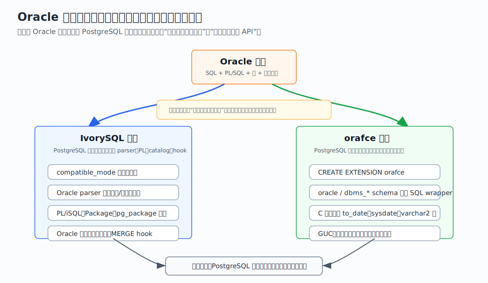
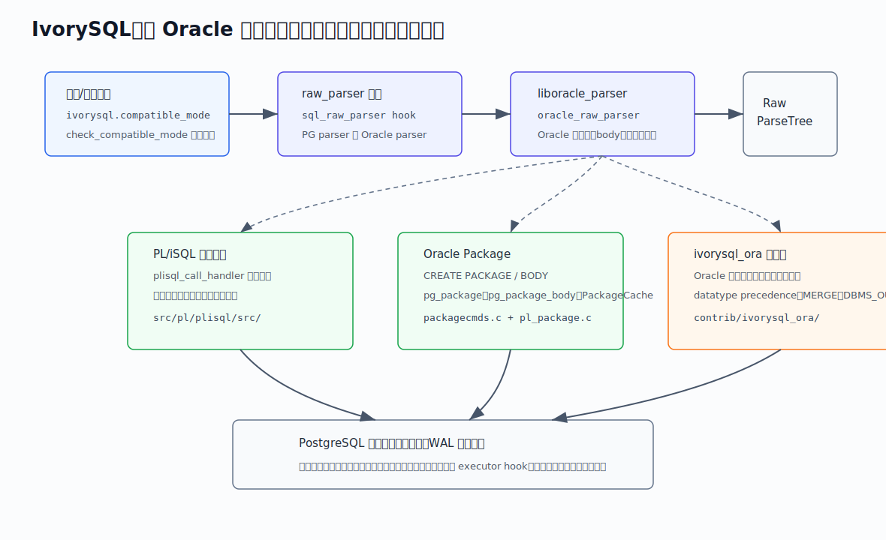
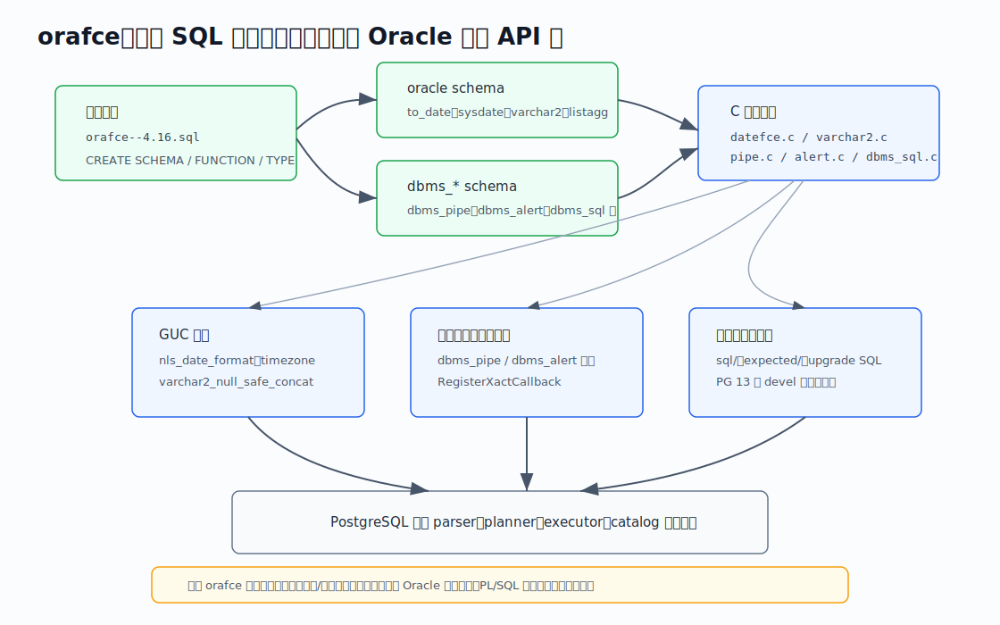
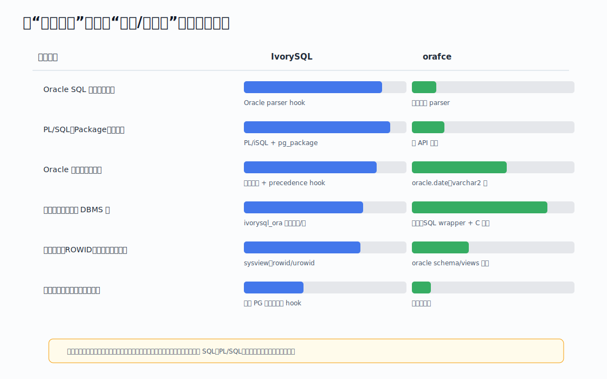
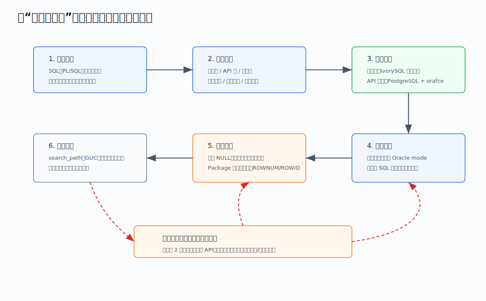

## 数据库筑基课 - Oracle 兼容性

### 作者
digoal

### 日期
2026-06-08

### 标签
PostgreSQL , 应用开发者 , 数据库筑基课 , Oracle 兼容 , 数据库迁移 , IvorySQL , orafce    

----

## 背景
  


这一节属于“场景实践 + 数据类型/执行语义 + 过程语言迁移”的交叉主题。很多企业把 Oracle 迁移到 PostgreSQL 生态时，第一反应是问：“这个数据库兼容 Oracle 吗？”这个问法太粗。真正会让迁移项目返工的，往往不是 `add_months` 这种单个函数，而是隐藏在 SQL 方言、PL/SQL 包体、空串与 NULL、隐式类型转换、日期格式、系统视图、权限、事务行为、客户端调用习惯里的语义差异。

所以本节不把 Oracle 兼容性写成一张“特性支持表”。我们换一个更工程化的视角：Oracle 兼容不是布尔值，而是一个分层能力栈。你要先判断业务需要兼容到哪一层，再决定用 PostgreSQL 原生改写、用 orafce 这类扩展补齐 API，还是用 IvorySQL 这类 PostgreSQL 分叉把兼容性下沉到解析器、过程语言和系统目录层。

本文主要参考两个本地源码仓库：

- `IvorySQL`：基于 PostgreSQL 的 Oracle 兼容分叉。
- `orafce`：PostgreSQL 扩展，模拟 Oracle RDBMS 的部分函数、操作符、类型和包。

DeepWiki 的 `IvorySQL/IvorySQL` 与 `orafce/orafce` 页面用于辅助梳理模块边界；正文中的关键机制尽量回到本地源码、README、安装 SQL 和测试入口验证。

## 一、它解决什么问题？

Oracle 兼容性解决的是“迁移摩擦”问题。Oracle 应用通常不是只包含普通 SQL，它还可能包含：

- Oracle SQL 方言：`ROWNUM`、`ROWID`、Oracle 风格 `MERGE`、特殊关键字和标识符规则。
- PL/SQL 过程语言：函数、过程、触发器、异常、游标、自治事务。
- Package：包头、包体、包变量、包内函数和过程、初始化逻辑、包级状态。
- Oracle 数据类型和隐式转换：`NUMBER`、`VARCHAR2`、`DATE`、`TIMESTAMP`、`INTERVAL`、空字符串、字符/字节长度语义。
- 内置函数和包：`to_date`、`sysdate`、`nvl`、`decode`、`listagg`、`dbms_output`、`dbms_sql`、`dbms_pipe`、`utl_file` 等。
- 系统视图与工具依赖：迁移工具、监控脚本和报表 SQL 可能依赖 Oracle 数据字典风格视图。

如果没有兼容层，迁移通常有三类成本：

1. 改 SQL 和 PL/SQL。成本最高，因为业务逻辑分散在应用、存储过程、报表、批处理和工具脚本里。
2. 改行为预期。同一条 SQL 在 PostgreSQL 中可能能跑，但空串、日期、隐式转换、聚合顺序、异常处理和函数稳定性不同。
3. 改运维体系。权限、对象依赖、备份恢复、升级脚本、测试基线都要重新确认。

兼容层的价值是减少这些改写成本，但它的代价是引入新的边界：兼容层覆盖不到的语义仍要改写；兼容层覆盖到的语义也要纳入升级和回归测试。



图 1 说明：IvorySQL 和 orafce 都站在 PostgreSQL 生态上，但入口不同。IvorySQL 通过分叉把兼容性推进 parser、PL/iSQL、Package catalog、类型转换和执行 hook；orafce 作为扩展，主要在 `oracle` 和 `dbms_*` schema 下补齐常用 API。两者不是简单替代关系，而是服务不同迁移深度。

## 二、它是什么？

Oracle 兼容性可以定义为：在 PostgreSQL 生态中，用内核改造、扩展、SQL wrapper、过程语言、系统视图和配置参数，让 Oracle 应用的语法、对象模型、类型语义、函数包行为和运维接口尽量保持原有预期。

按实现深度，可以拆成六层：

| 层次 | 典型内容 | 如果缺失会怎样 |
|---|---|---|
| 语法层 | Oracle parser、关键字、`MERGE`、`ROWNUM`、`ROWID` | SQL 直接解析失败，需要批量改写 |
| 过程语言层 | PL/SQL/PL-iSQL、异常、游标、自治事务 | 存储过程和触发器迁移成本高 |
| 对象模型层 | Package、包变量、包体、系统目录 | 包内状态和依赖关系难以保留 |
| 类型语义层 | `NUMBER`、`VARCHAR2`、Oracle `DATE`、隐式转换 | SQL 能跑但结果、错误和索引选择可能不同 |
| API 层 | 函数、聚合、`dbms_*`、`utl_file` | 应用调用需要逐个改写 |
| 运维观察层 | 系统视图、权限、GUC、测试和升级脚本 | 迁移后监控、审计、发布容易断裂 |

IvorySQL 与 orafce 分别代表两种典型路线。

IvorySQL README 明确说它基于 PostgreSQL，增加 `compatible_db` 开关以在 Oracle 与 PostgreSQL 兼容模式之间切换，并把 PL/iSQL 和 Oracle 风格 Package 作为亮点。本地源码中，`src/backend/utils/misc/ivy_guc.c` 定义了 `ivorysql.compatible_mode`，`src/backend/parser/parser.c` 通过 `sql_raw_parser` hook 调用当前 parser，`src/backend/oracle_parser/liboracle_parser.c` 在 `_PG_init` 中注册 `oracle_raw_parser`，`src/pl/plisql/src/` 提供 PL/iSQL handler 和 package 执行逻辑，`src/include/catalog/pg_package.h` 定义 package 系统目录。

orafce README 则把项目定位为“emulate a subset of functions and packages from the Oracle RDBMS”。它的主安装脚本 `orafce--4.16.sql` 创建 `oracle` schema，并用 `CREATE FUNCTION ... AS 'MODULE_PATHNAME', 'c_symbol' LANGUAGE C` 把 SQL 名称绑定到 C 实现；`orafce.c` 在 `_PG_init` 中定义 `orafce.nls_date_format`、`orafce.timezone`、`orafce.varchar2_null_safe_concat`、`orafce.oracle_compatibility_date_limit` 等 GUC；`datefce.c`、`varchar2.c`、`pipe.c`、`alert.c`、`dbms_sql.c` 等文件分别实现日期、字符类型、进程间通信和动态 SQL 包。

## 三、核心原理

### 1. IvorySQL：兼容模式先换 parser，再影响类型、包和执行 hook

IvorySQL 的关键不是“多了一堆函数”，而是 Oracle 模式会改变 SQL 进入数据库后的第一道门。

在 `src/backend/parser/parser.c` 中，`raw_parser()` 不直接固定调用 PostgreSQL 标准 parser，而是调用函数指针 `sql_raw_parser`。默认值是 `standard_raw_parser`，但 `src/backend/oracle_parser/liboracle_parser.c` 的 `_PG_init()` 会把 `ora_raw_parser` 设置为 `oracle_raw_parser`，同时安装关键字、常量长度填充和标识符引用 hook。

`src/backend/utils/misc/ivy_guc.c` 中的 `ivorysql.compatible_mode` 是用户态 GUC。`check_compatible_mode()` 会检查 Oracle parser 和 `ivorysql_ora` 是否已加载；`assign_compatible_mode()` 在切到 Oracle parser 时把 `sql_raw_parser` 指向 `ora_raw_parser`，并切换 `MERGE` transform/executor hook，随后刷新 search path。换句话说，Oracle 模式不是单纯的 search_path 技巧，而是改变了解析入口和部分执行路径。



图 2 说明：`compatible_mode` 先选择 parser，Oracle parser 产出 raw parse tree；之后 PL/iSQL、Package catalog、`ivorysql_ora` 类型/函数/包和 PostgreSQL 执行器共同工作。底层存储、事务、WAL 仍是 PostgreSQL 体系，所以兼容层越深，越要测试语义与原 PostgreSQL 行为的交叉点。

### 2. PL/iSQL 与 Package：把 Oracle 对象模型落到 PostgreSQL catalog

Oracle 迁移中最难的是 Package。单个函数可以改写，Package 却包含包头、包体、变量、子过程、初始化逻辑和访问控制。

IvorySQL 的 `src/pl/plisql/src/pl_handler.c` 实现 PL/iSQL call handler。它在 `_PG_init()` 中定义 `plisql.variable_conflict`、`plisql.print_strict_params`、`plisql.check_asserts`、`plisql.extra_warnings`、`plisql.extra_errors` 等 GUC，并注册事务/子事务回调、内部函数和自治事务初始化。执行时，`plisql_call_handler()` 会根据调用来源区分普通函数、包函数和子过程函数；包函数路径会进入 `plisql_get_package_func()`。

Package 的 catalog 侧证据在 `src/include/catalog/pg_package.h`：其中定义了 `pg_package` 目录，字段包括 `pkgname`、`pkgnamespace`、`pkgowner`、`define_invok`、`editable`、`use_collation`、`accesssource`、`pkgsrc`。`src/backend/commands/packagecmds.c` 负责 `CREATE PACKAGE` 和 `CREATE PACKAGE BODY` 的插入/更新、权限与依赖处理。`src/pl/plisql/src/pl_package.c` 则负责包内变量、类型、函数、过程和依赖的解析与编译。

这说明 IvorySQL 的 Package 兼容不是“在 schema 里放一组函数”，而是把 Package 当作一类数据库对象处理。这类深度兼容能降低 PL/SQL 迁移改写量，但也意味着数据库升级、dump/restore、权限和依赖管理必须跟着这套扩展 catalog 走。

### 3. ivorysql_ora：补类型、函数、包和局部执行语义

`contrib/ivorysql_ora/src/ivorysql_ora.c` 是 IvorySQL Oracle 扩展层入口。它安装了几类 hook：

- `oracle_datatype_precedence_hook = pg_compatible_oracle_precedence`，用于 Oracle 类型优先级和隐式转换。
- `ora_exec_merge_matched_hook = IvyExecMergeMatched` 与 `ora_transform_merge_stmt_hook = IvytransformMergeStmt`，用于 Oracle 风格 `MERGE`。
- `ora_updatexml_hook = updatexml`，用于 XML 函数。
- `ProcessUtility_hook` 拦截 `DISCARD ALL` / `DISCARD PACKAGES`，执行后重置 DBMS_OUTPUT buffer。

类型语义可以从 `contrib/ivorysql_ora/src/datatype/compatible_oracle_precedence.c` 看出来。代码定义了 Oracle 类型优先级数组，包含 `ORACHARCHAROID`、`ORAVARCHARCHAROID`、`NUMBEROID`、`BINARY_FLOATOID`、`BINARY_DOUBLEOID`、Oracle date/timestamp/interval 等。遇到 `UNKNOWNOID` 字符串字面量时，它按 Oracle 语义倾向视作 `CHAR`；当 Oracle 类型和 PostgreSQL 类型混合运算时，会把 `bpchar`、`varchar`、`numeric/int`、`float`、`date/timestamp` 等映射到对应 Oracle 类型，再按优先级选择目标类型。

这类机制解释了一个重要事实：Oracle 兼容不仅是“函数名一样”，还包括表达式类型推导。否则 `varchar2 + number`、日期加减、字符串字面量比较等 SQL 在边界情况下会出现不同错误或不同结果。

### 4. orafce：SQL wrapper + C 函数 + GUC 的扩展模型

orafce 不替换 PostgreSQL parser。它的主模型是：

1. `CREATE EXTENSION orafce` 执行 `orafce--4.16.sql`。
2. 安装脚本创建 `oracle`、`dbms_pipe`、`dbms_alert`、`dbms_sql` 等 schema 或对象。
3. SQL 名称通过 `MODULE_PATHNAME` 绑定到 C 符号。
4. `_PG_init()` 定义行为 GUC，并为部分包申请共享内存或注册事务回调。

例如 `orafce--4.16.sql` 中创建 `oracle.trunc(date,text)`，绑定到 `ora_date_trunc`；创建 `dbms_sql.open_cursor()`，绑定到 `dbms_sql_open_cursor`；创建 `dbms_sql.desc_rec` 复合类型，用于描述列元数据。C 侧 `datefce.c` 实现 `ora_to_date()` 和 `orafce_sysdate()`：`ora_to_date()` 对空字符串返回 NULL，并处理 Oracle 日期 bug 的边界；`orafce_sysdate()` 用 `orafce.timezone` 把 statement timestamp 转成 timestamp(0)，模拟 Oracle `DATE` 秒级精度。

`varchar2.c` 中的 `orafce_varchar2_null_safe_concat` 控制 `varchar2`/`nvarchar2` 拼接时 NULL 与空串语义。默认兼容 PostgreSQL，开启后才更靠近 Oracle 的空串拼接预期。这一点很适合做迁移护栏：不要假设扩展一装就全局变成 Oracle 行为，GUC 值和 search_path 同样是兼容性的一部分。



图 3 说明：orafce 的优势是低侵入、易安装、易在 PostgreSQL 主线版本上使用；边界是它主要补 API 面，不替换 SQL 方言入口，也不提供完整 Oracle PL/SQL 对象模型。对“应用 SQL 里只是大量调用 Oracle 函数/包”的项目，它很有效；对“大量 Oracle 专用语法和 Package body”的项目，仅靠 orafce 通常不够。

## 四、横向对比

| 维度 | PostgreSQL 原生改写 | PostgreSQL + orafce | IvorySQL |
|---|---|---|---|
| 主要目标 | 长期回归 PostgreSQL 标准生态 | 低成本补齐 Oracle 常用函数、类型和包 API | 尽量减少 Oracle SQL/PLSQL/Package 改写 |
| 语法兼容 | 弱，需要改写 | 弱，基本不替换 parser | 强于扩展路线，存在 Oracle parser hook |
| PL/SQL 与 Package | 需要重写为 PL/pgSQL 或应用逻辑 | 只覆盖部分 `dbms_*` API，不等于完整 PL/SQL | 有 PL/iSQL、Package catalog 和 package 执行逻辑 |
| 类型与隐式转换 | PostgreSQL 语义 | 有 `oracle.date`、`varchar2`、`nvarchar2` 等类型和 GUC | `ivorysql_ora` 定义 Oracle 类型、cast、operator，并有 precedence hook |
| 内置函数/包 | PostgreSQL 函数为主 | 强项，`orafce--4.16.sql` 中有大量 Oracle wrapper | 也有 `ivorysql_ora` 内置函数和包 |
| 执行器/DDL hook | 原生 | 少量扩展内部能力 | 会切换 `MERGE` transform/executor hook、ProcessUtility hook 等 |
| 运维复杂度 | 最低但改写成本高 | 中等，依赖扩展版本和 GUC | 更高，依赖分叉版本、兼容模式和扩展 catalog |
| 适合场景 | 新系统、可接受重构、追求长期标准化 | 函数/包调用多，SQL 方言和 PL/SQL 复杂度可控 | 存量 Oracle 代码多，短期需要最大限度减少改写 |
| 不适合场景 | 迁移窗口短、PL/SQL 资产巨大 | 需要完整 Oracle parser 或 Package body 语义 | 只想轻量使用主线 PostgreSQL，且不能接受分叉运维 |

这张表背后的关键原因是“兼容性深度不同”。扩展能定义函数、类型、操作符、聚合、GUC、共享内存和回调，但不能轻易改变 PostgreSQL 的核心语法入口和系统目录模型。分叉能把兼容性做深，但代价是你要接受一个改造过的 PostgreSQL 内核、额外 catalog、额外测试矩阵和升级路径。



图 4 说明：条形不是精确兼容率，而是工程覆盖深度的相对判断。真实项目里，`to_date` 支持并不代表日期迁移完成，Package 支持也不代表所有包状态、异常、权限和依赖都无风险。每一层都要用业务样本验证。

## 五、效果如何？

Oracle 兼容层的效果不能只看“支持多少函数”。更合理的评估指标包括：

| 指标 | 怎么衡量 | 为什么重要 |
|---|---|---|
| SQL 免改比例 | 业务 SQL 样本中直接解析成功并结果一致的比例 | 直接影响迁移工期 |
| PL/SQL 免改比例 | 过程、函数、触发器、Package 编译和运行通过率 | 决定是否能保留数据库内业务逻辑 |
| 语义一致性 | 空串、日期、隐式转换、异常、游标、包变量等边界结果 | 解析成功不等于结果正确 |
| 执行计划稳定性 | 迁移前后关键 SQL 的访问路径、连接顺序、耗时 | 类型变化和函数 wrapper 可能影响优化器 |
| 运维可控性 | GUC、search_path、权限、备份恢复、升级脚本、测试流水线 | 兼容层要能长期维护 |
| 失败可分类性 | 每个失败能归入语法/API/类型/事务/性能/权限 | 便于决定改 SQL、换路线还是加扩展 |

从源码证据看：

- orafce 的 `orafce--4.16.sql` 中有 500 多个 `CREATE FUNCTION`，说明它在函数/API 面覆盖很广；但这些 wrapper 不改变 PostgreSQL parser，所以 Oracle 专用语法和完整 PL/SQL 不能因此自动兼容。
- IvorySQL 的 `GNUmakefile.in` 有 `oracle-check`、`oracle-check-world`、`oracle-pg-check-world` 等测试入口，`contrib/ivorysql_ora/Makefile` 也有 Oracle regression 列表；这说明分叉路线必须同时维护 Oracle 与 PostgreSQL 两套行为基线。
- `ivorysql_ora` 相关源码里，`pg_type.dat` 定义了 `sys.oracharchar`、`sys.oravarcharchar`、`sys.number`、`sys.oradate`、`sys.binary_float`、`sys.binary_double`、`sys.rowid` 等 Oracle 相关类型；`datatype--1.0.sql` 又补了大量 cast、operator、operator class 定义。这说明它不是只补函数，而是尝试把类型语义放进表达式解析、比较、排序和索引路径。

代价也很明确：

- 兼容层越深，行为越可能偏离 PostgreSQL 原生预期。例如同一集群里 Oracle mode 与 PG mode 的 search_path、parser、隐式转换和函数解析都要严格隔离。
- 兼容层越浅，迁移越要靠应用改写。例如 orafce 可以补 `oracle.to_date()`，但不能让 PostgreSQL 接受所有 Oracle SQL grammar。
- wrapper 函数可能改变优化器可见性。简单 SQL 函数和 C 函数的稳定性、严格性、并行安全标记会影响计划；迁移后必须看 `EXPLAIN`，不能只看结果。

## 六、实操 DEMO

下面给出两个最小验证路径。本文没有在本机启动数据库执行这些 SQL，因此不提供伪造输出；读者可以按自己的环境执行，并把实际结果纳入迁移基线。

### DEMO 1：PostgreSQL + orafce 验证 API 层兼容

目标：确认函数、类型、GUC 和 search_path 是否满足业务 SQL 的最小样本。

```sql
CREATE EXTENSION IF NOT EXISTS orafce;

SHOW orafce.nls_date_format;
SHOW orafce.timezone;
SHOW orafce.varchar2_null_safe_concat;

SET search_path TO oracle, "$user", public, pg_catalog;

SELECT oracle.add_months(date '2005-05-31', 1);
SELECT oracle.to_date('2026-06-07 10:30:00', 'YYYY-MM-DD HH24:MI:SS');
SELECT oracle.sysdate();

CREATE TEMP TABLE t_orafce (
    id integer,
    name oracle.varchar2(20)
);

INSERT INTO t_orafce VALUES (1, 'hello');
SELECT id, name, oracle.lengthb(name) FROM t_orafce;
```

验证点：

- `search_path` 中是否优先找到 `oracle` schema 下的函数。
- `oracle.to_date()`、`oracle.sysdate()` 的日期精度和时区是否符合业务预期。
- `varchar2` 的长度、空串、拼接行为是否符合迁移前样本。
- 关键 SQL 是否因为函数 wrapper 影响索引条件下推或执行计划。

### DEMO 2：IvorySQL Oracle mode 验证语法和 Package 层兼容

目标：确认 Oracle parser、PL/iSQL、Package 和 `ivorysql_ora` 是否加载并协同工作。

根据 IvorySQL README，本地开发环境可通过类似路径初始化 Oracle mode：

```bash
./configure --prefix=/path/to/ivorysql --enable-debug --enable-cassert
make -j$(nproc)
make install
initdb -D data_ora -m oracle
pg_ctl -D data_ora start
make oracle-check
```

进入数据库后，建议先验证模式和依赖：

```sql
SHOW ivorysql.compatible_mode;
SET ivorysql.compatible_mode = oracle;

-- 检查 Oracle 函数和类型是否可见
SELECT sysdate() FROM dual;
SELECT length('hello') FROM dual;

-- 验证最小 Package
CREATE OR REPLACE PACKAGE demo_pkg IS
    FUNCTION add_one(x number) RETURN number;
END;
/

CREATE OR REPLACE PACKAGE BODY demo_pkg IS
    FUNCTION add_one(x number) RETURN number IS
    BEGIN
        RETURN x + 1;
    END;
END;
/

SELECT demo_pkg.add_one(41) FROM dual;
```

验证点：

- `ivorysql.compatible_mode` 切换是否成功；如果失败，应检查 `liboracle_parser` 和 `ivorysql_ora` 是否在预加载库中。
- Oracle 语法、`dual`、`number`、Package 语法是否解析通过。
- 包函数调用是否进入 PL/iSQL package 执行路径。
- 同一 SQL 在 Oracle mode 和 PG mode 下是否有不同解析或结果。

## 七、最佳实践

### 面向数据库架构师

先做兼容性分层，不要先选产品。把业务资产拆成 SQL 方言、PL/SQL、Package、类型、函数包、系统视图、客户端驱动、运维脚本七类。每类抽样 20 到 100 个高频对象，建立迁移基线。

如果主要问题是 API 层，例如大量 `add_months`、`last_day`、`to_char`、`nvl`、`dbms_output`，优先验证 PostgreSQL + orafce。它对主线 PostgreSQL 侵入小，长期升级压力较小。

如果主要问题是 Oracle parser、PL/SQL、Package、隐式转换和系统视图，优先验证 IvorySQL 这类深兼容路线。不要只看函数表，要验证 Package 状态、异常、事务、权限、dump/restore 和升级路径。

### 面向 DBA

把 GUC 和 search_path 当成兼容性配置的一部分固化下来。orafce 至少要关注 `orafce.nls_date_format`、`orafce.timezone`、`orafce.varchar2_null_safe_concat`、`orafce.oracle_compatibility_date_limit`；IvorySQL 至少要关注 `ivorysql.compatible_mode`、`ivorysql.database_mode`、`nls_length_semantics`、`ivorysql.identifier_case_switch` 和预加载库。

不要把开发库里“能跑”的设置手工搬到生产。应写成初始化脚本、数据库参数模板和回归测试。尤其是 search_path，函数解析错 schema 会导致结果正确性风险，而不是普通报错。

对 `utl_file`、`dbms_pipe`、`dbms_alert`、`dbms_sql` 这类包，额外检查权限、共享内存、事务提交时机和安全边界。它们不只是函数调用，还可能涉及文件系统、进程间消息或动态 SQL。

### 面向业务开发者

不要只提交“编译通过”。每个迁移 SQL 都应该补边界样例：

- 空字符串、NULL、空格字符串。
- 日期格式、闰年、月末、时区、秒级精度。
- 字符长度与字节长度，尤其是中文、多字节字符。
- 隐式转换，例如字符串与数字、日期与数字、`varchar2` 与 `text`。
- 聚合顺序，例如 `listagg` 是否需要显式 `ORDER BY`。
- 异常处理和动态 SQL。

如果某段 Oracle 代码靠隐式行为工作，迁移时最好显式化。例如把依赖 `search_path` 的函数改成 schema-qualified，或者把隐式日期格式改成显式 format mask。

## 八、适合与不适合场景

### PostgreSQL + orafce 适合

- 应用主要使用 Oracle 函数、日期函数、字符串函数、`varchar2`、`dbms_output`、`dbms_random`、`dbms_sql` 等 API。
- SQL 方言差异可控，PL/SQL 资产较少，或者愿意改写为 PL/pgSQL/应用逻辑。
- 企业希望尽量留在主线 PostgreSQL 或云厂商 PostgreSQL 生态。
- 迁移项目可以接受“补一层扩展 + 少量改写”的模式。

### PostgreSQL + orafce 不适合

- 大量 Oracle 专用语法直接要求免改。
- 大量 Package body、包变量、自治事务和复杂异常处理需要原样迁移。
- 业务依赖 Oracle 数据字典视图、ROWID/ROWNUM 语义或复杂隐式转换。
- 迁移团队误以为安装扩展就等于完整 Oracle mode。

### IvorySQL 适合

- 存量 Oracle SQL/PLSQL/Package 规模大，短期改写风险高。
- 需要 Oracle parser、PL/iSQL、Package catalog、Oracle 类型 precedence 和系统视图层面的深兼容。
- 团队愿意维护分叉数据库，并为 Oracle mode 和 PostgreSQL mode 建立双重回归。
- 迁移目标是尽量降低业务代码改动，而不是最大化 PostgreSQL 原生化。

### IvorySQL 不适合

- 只需要少量 Oracle 函数，没必要引入内核分叉。
- 组织要求严格使用主线 PostgreSQL 或指定云 PostgreSQL 服务。
- 运维团队无法承担额外模式、额外 catalog、预加载库和升级验证。
- 项目目标是长期摆脱 Oracle 语义，而不是保留 Oracle 行为。

## 九、常见坑

1. 把函数兼容当成数据库兼容。`oracle.to_date()` 能跑，不代表 Oracle SQL、PL/SQL、Package 和系统视图都兼容。

2. 忽略空串与 NULL。Oracle 常把空字符串视作 NULL，PostgreSQL 不这样处理。orafce 的 `varchar2_null_safe_concat` 也不是默认开启。

3. 忽略 search_path。orafce 的很多函数在 `oracle` schema 下；如果 search_path 顺序不对，调用到的可能是 PostgreSQL 原生函数或其他扩展函数。

4. 忽略隐式转换。IvorySQL 的 `compatible_oracle_precedence.c` 说明类型优先级本身就是兼容点。迁移测试不能只覆盖同类型比较。

5. 忽略日期边界。orafce README 和 `datefce.c` 都提到 Oracle 日期 bug 和兼容限制。月末、闰年、时区、秒级精度必须回归。

6. 忽略 Package 状态。Package 不是普通 schema 函数；包变量、包体初始化、访问控制、依赖失效都要测试。

7. 忽略 `dbms_*` 包的事务语义。`dbms_alert` 通知可能与提交时机相关，`dbms_pipe` 涉及共享内存消息，`utl_file` 涉及文件权限。

8. 忽略升级脚本。orafce 有大量版本升级 SQL；IvorySQL 有分叉内核和扩展 SQL。升级不是只替换二进制。

9. 忽略执行计划。函数 wrapper、类型 cast、隐式转换都可能改变索引可用性和估算选择率。

10. 忽略双模式风险。IvorySQL 同时支持 PG 和 Oracle compatibility mode，业务必须明确在哪个 mode 下运行，不能依赖默认值漂移。

## 十、扩展问题

1. 你的 Oracle 应用里，真正阻碍迁移的是语法、函数、Package，还是类型隐式转换？

2. 如果只迁移表和 SQL，不迁移 PL/SQL，业务逻辑应该放到应用层、PL/pgSQL，还是保留兼容过程语言？

3. 哪些 Oracle 行为应该兼容，哪些应该借迁移机会显式改写成 PostgreSQL 标准写法？

4. 你的迁移测试是“跑通样例”，还是覆盖了空串、日期、隐式转换、异常和执行计划？

5. 使用分叉数据库获得深兼容后，未来升级到新 PostgreSQL 主版本的成本由谁承担？

## 十一、扩展阅读

- IvorySQL README：`IvorySQL/README.md`。用于确认 IvorySQL 基于 PostgreSQL、支持 `compatible_db`/`compatible_mode`、PL/iSQL、Oracle style Package，以及 `initdb -m oracle`、`make oracle-check` 等路径。
- IvorySQL GUC：`IvorySQL/src/backend/utils/misc/ivy_guc.c`。用于确认 `ivorysql.compatible_mode`、Oracle parser 依赖检查和 parser hook 切换。
- IvorySQL parser：`IvorySQL/src/backend/parser/parser.c` 与 `IvorySQL/src/backend/oracle_parser/liboracle_parser.c`。用于确认 `sql_raw_parser`、`ora_raw_parser` 和 Oracle raw parser 注册。
- IvorySQL PL/iSQL：`IvorySQL/src/pl/plisql/src/pl_handler.c`、`IvorySQL/src/pl/plisql/src/pl_package.c`。用于确认 PL/iSQL handler、GUC、package function 执行与 package 解析。
- IvorySQL Package catalog：`IvorySQL/src/include/catalog/pg_package.h`、`IvorySQL/src/backend/commands/packagecmds.c`。用于确认 Package 作为 catalog 对象存在。
- IvorySQL Oracle 扩展：`IvorySQL/contrib/ivorysql_ora/src/ivorysql_ora.c`、`IvorySQL/contrib/ivorysql_ora/src/datatype/compatible_oracle_precedence.c`、`IvorySQL/contrib/ivorysql_ora/src/datatype/datatype--1.0.sql`。用于确认 hook、类型、cast、operator 和 Oracle 类型 precedence。
- IvorySQL 测试入口：`IvorySQL/GNUmakefile.in`、`IvorySQL/contrib/ivorysql_ora/Makefile`、`IvorySQL/src/oracle_test/regress/`。用于确认 Oracle regression 测试体系。
- orafce README：`orafce/README.asciidoc`。用于确认 orafce 是 Oracle 函数、操作符和包的子集兼容扩展，以及日期函数、`oracle.date` 等说明。
- orafce 控制文件与安装脚本：`orafce/orafce.control`、`orafce/orafce--4.16.sql`。用于确认 default version、module path、schema、函数、类型和包 wrapper。
- orafce C 实现：`orafce/orafce.c`、`orafce/datefce.c`、`orafce/varchar2.c`、`orafce/pipe.c`、`orafce/alert.c`、`orafce/dbms_sql.c`。用于确认 GUC、日期语义、varchar2 拼接、共享内存消息、alert 和动态 SQL。
- orafce 测试入口：`orafce/Makefile`、`orafce/sql/`、`orafce/expected/`。用于确认 regression 测试列表。
- DeepWiki：`IvorySQL/IvorySQL`、`orafce/orafce`。用于辅助理解项目目录与架构边界；具体实现结论以上述本地源码为准。

## 十二、结论

Oracle 兼容性最容易犯的错误，是把它当成“能不能”的判断。正确做法是把它拆成“需要兼容哪一层、用什么机制兼容、代价是什么、如何验证”。

orafce 是 PostgreSQL 生态里非常实用的 Oracle API 补齐层。它适合函数、类型和常用包调用较多，但 SQL 方言和 PL/SQL 深度可控的迁移项目。

IvorySQL 是更深的兼容路线。它通过 parser hook、Oracle parser、PL/iSQL、Package catalog、`ivorysql_ora` 类型和执行 hook，把 Oracle 语义推到 PostgreSQL 内核周边甚至内核内部。它能降低存量 Oracle 代码改写量，但也带来更高的运维、升级和回归测试责任。

迁移决策不要从产品开始，要从业务资产开始。先把 SQL、PL/SQL、Package、类型、函数包、系统视图和运维脚本分层，再用最小样本验证。只有能被测试闭环证明的兼容性，才是可以进入生产的兼容性。



图 5 说明：兼容性迁移不是一次性选择，而是闭环。盘点资产、分类语义、选择路线、最小验证、边界回归、生产护栏，每一步失败都要回到语义分类，而不是笼统地说“这个数据库不兼容”。
  
## 附录 
1、克隆代码  
```  
git clone --depth 1 https://github.com/IvorySQL/IvorySQL
git clone --depth 1 https://github.com/orafce/orafce
```  
  
2、启用 codex, 使用 [数据库筑基课 skill](../skills/README.md).  
```
文章标题: 
  数据库筑基课 - Oracle 兼容性
项目源码(本地目录): 
  IvorySQL
  orafce
项目 codebase 文件名: 
  IvorySQL/CLAUDE.md 
  orafce/CLAUDE.md 
开源项目相关的 deepwiki repoName: 
  IvorySQL/IvorySQL
  orafce/orafce
```
  
  
#### [PostgreSQL 解决方案集合](../201706/20170601_02.md "40cff096e9ed7122c512b35d8561d9c8")
  
  
#### [德哥 / digoal's Github - 公益是一辈子的事.](https://github.com/digoal/blog/blob/master/README.md "22709685feb7cab07d30f30387f0a9ae")
  
  
#### [About 德哥](https://github.com/digoal/blog/blob/master/me/readme.md "a37735981e7704886ffd590565582dd0")
  
  

  
