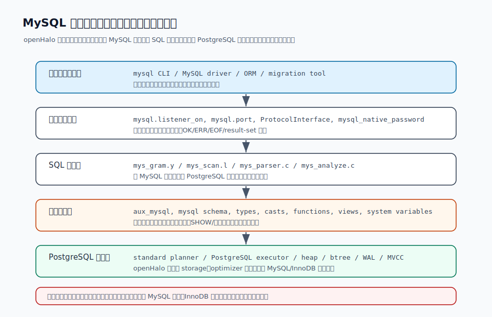
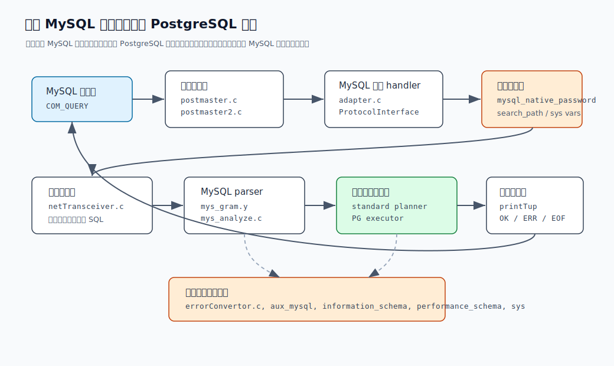
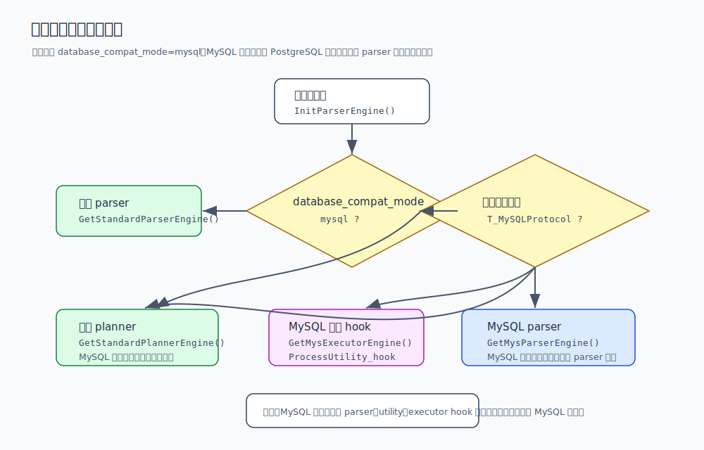
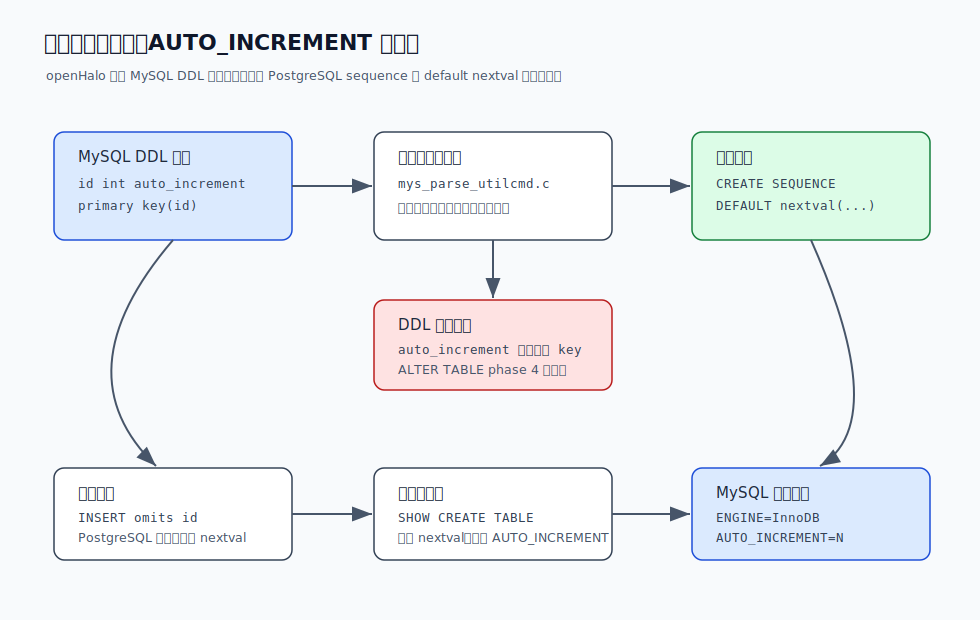
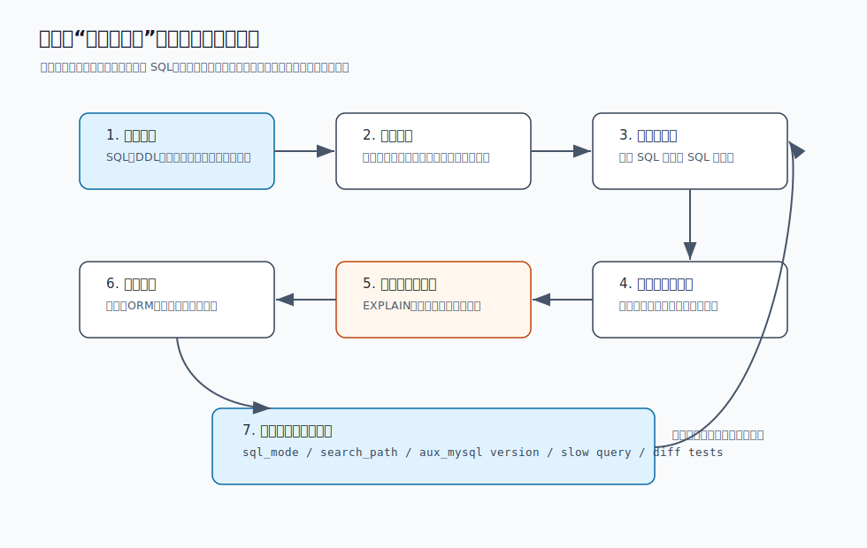

## 数据库筑基课 - MySQL 兼容性

### 作者
digoal

### 日期
2026-06-08

### 标签
PostgreSQL , 应用开发者 , 数据库筑基课 , MySQL 兼容 , openHalo , 数据库迁移 , SQL 方言    

----

## 背景
  


这一节属于“场景实践 + SQL 方言 + 协议适配 + 类型/DDL 语义”的交叉主题。很多 MySQL 迁移项目一开始会问：“这个 PostgreSQL 系数据库兼容 MySQL 吗？”这个问题太粗。真正会让项目延期的，往往不是 `select 1` 能不能跑，而是应用连接协议、认证插件、SQL 方言、`AUTO_INCREMENT`、`LIMIT`、`SHOW` 语句、系统变量、`information_schema`、字符集/排序规则、隐式类型转换、错误码、事务行为和 ORM 元数据探测是否能一起工作。

本文沿用这个系列的工程化写法：不把 MySQL 兼容性写成一张静态支持表，而是把它拆成分层能力栈，解释每一层解决什么问题、靠什么实现、代价是什么、怎么验证。

本文主要参考本地 `openHalo` 源码、`openHalo/CLAUDE.md`、`openHalo/README.md`、`openHalo/CONTRIBUTING.md`、`contrib/aux_mysql` 安装脚本，以及 DeepWiki `HaloTech-Co-Ltd/openHalo` 页面。DeepWiki 只作为架构脉络辅助；关键判断回到本地源码和官方手册验证。

## 一、它解决什么问题？

MySQL 兼容性解决的是“应用迁移摩擦”问题。MySQL 应用通常不是只依赖 SQL 文本，它还依赖一整套运行习惯：

- 客户端协议：`mysql` CLI、JDBC/ODBC/Python/Go 驱动、连接池、ORM 默认都按 MySQL wire protocol 和握手流程工作。
- 认证与会话：`mysql_native_password`、数据库名、字符集、`autocommit`、`sql_mode`、`time_zone`、`last_insert_id`、session tracking。
- SQL 方言：反引号、`SHOW`、`USE db`、`LIMIT`、MySQL 函数、用户变量、`ON DUPLICATE KEY`、多表更新、`CREATE TABLE ... ENGINE/CHARSET/COLLATE`。
- DDL 与类型：`AUTO_INCREMENT`、`tinyint unsigned`、`mediumint`、`datetime`、`year`、`blob`、`enum/set` 外观、表注释、列注释。
- 元数据外观：`information_schema`、`performance_schema`、`sys`、`SHOW CREATE TABLE`、`SHOW VARIABLES`、`SHOW INDEX`。
- 错误与结果协议：错误码、OK 包中的 affected rows、warning count、last insert id、列类型编码。
- 运维和工具：迁移工具、监控脚本、巡检 SQL、备份恢复脚本、应用健康检查 SQL。

如果没有兼容层，把 MySQL 应用迁到 PostgreSQL 通常有三类成本：

1. 改连接入口。驱动、连接串、认证、连接池初始化 SQL 都要调整。
2. 改 SQL 与 DDL。尤其是 `SHOW`、`AUTO_INCREMENT`、`CREATE TABLE` 选项、MySQL 函数和隐式转换。
3. 改运行预期。同一条 SQL 可能能执行，但空值、日期、错误、事务、锁等待、元数据字段和执行计划不同。

openHalo 的目标是把一部分改写成本下沉到数据库侧：让 MySQL 客户端能连进来，让常用 MySQL SQL 和工具查询能被解析、翻译和返回。但它的代价也很明确：底层不是 MySQL/InnoDB 复刻，迁移前必须知道哪一层兼容、哪一层只是外观模拟、哪一层仍然是 PostgreSQL 语义。



图 1 说明：openHalo 的兼容性不是一个布尔开关，而是客户端、协议、parser、语义补齐、元数据外观和 PostgreSQL 内核的组合。越靠上越接近 MySQL 应用习惯，越靠下越回到 PostgreSQL 存储、事务、优化和执行体系。

## 二、它是什么？

MySQL 兼容性可以定义为：在 PostgreSQL 派生内核上，通过第二监听器、MySQL 协议 handler、MySQL parser/analyzer、DDL/类型/函数补丁、系统变量和元数据视图，让 MySQL 应用在较少改造的情况下连接、执行和观察数据库。

以 openHalo 为例，它不是“PostgreSQL 上装一个函数扩展”这么浅，也不是“完整实现一个 MySQL 内核”这么深。它大致分成六层：

| 层次 | openHalo 中的证据 | 解决的问题 | 典型边界 |
|---|---|---|---|
| 连接协议层 | `src/include/postmaster/protocol_interface.h`、`src/backend/postmaster/postmaster2.c`、`src/backend/adapter/mysql/adapter.c` | 让 MySQL 客户端通过 3306 风格入口连接 | 协议兼容不等于所有 MySQL 命令都支持 |
| 认证会话层 | `userLogonAuth.c`、`pwdEncryptDecrypt.c`、`systemVar.c` | 握手、认证、系统变量、`autocommit`、`sql_mode` | 变量可能是兼容外观，不一定控制真实 InnoDB 行为 |
| SQL parser 层 | `mys_gram.y`、`mys_scan.l`、`mys_parser.c`、`mys_analyze.c` | 接受 MySQL 方言并转换为可分析树 | 不在 grammar 中的方言仍需改写 |
| DDL/utility 层 | `mys_tablecmds.c`、`mys_prepare.c`、`mys_sequence.c`、`mys_uservar.c`、`mys_utility.c` | 表选项、自增、prepare、用户变量、MySQL utility | DDL 外观可能映射到 PostgreSQL 内部对象 |
| 类型/函数层 | `src/backend/utils/adt/mysql/`、`contrib/aux_mysql/aux_mysql--*.sql` | 日期、时间、字符串、cast、函数、domain、collation | 需要测试隐式转换和边界日期 |
| 元数据外观层 | `aux_mysql` 创建 `mysql`、`mys_informa_schema`、`performance_schema`、`sys`、`mys_sys` | 支持工具查询、`SHOW`、`information_schema` | 不等价于 MySQL 数据字典和 Performance Schema 真实采集 |

`openHalo/README.md` 明确说 openHalo 支持 MySQL SQL dialect 和 communication protocol，目标是减少 MySQL 5.7 或更新版本应用迁移时的改写量。`configure.ac` 显示它标识为 `Halo 14.18`，`PG_VERSION_STR` 中输出 `openHalo`，说明它站在 PostgreSQL 14 系内核基础上。

## 三、核心原理

### 1. 第二监听器：不是代理，而是 postmaster 内部多协议入口

openHalo 的第一层改造在 postmaster。`database_compat_mode` 有 `postgresql` 和 `mysql` 两个枚举值；`mysql.listener_on`、`mysql.port`、`mysql.halo_mysql_version`、`mysql.max_allowed_packet` 等 GUC 在 `src/backend/utils/misc/guc.c` 中定义，其中 `database_compat_mode`、`mysql.listener_on`、`mysql.port` 都是 `PGC_POSTMASTER` 级别，修改后需要重启。

`src/backend/postmaster/postmaster.c` 在启动时正常创建 PostgreSQL 监听 socket；如果 `halo_mysql_listener_on` 为 true，则调用 `setSecondProtocolHandler(getSecondProtocolHandler())`，再执行第二协议 handler 的 `listen_init()`。`postmaster2.c` 维护 `ListenSocket` 到 `ProtocolInterface` 的映射。新连接进来时，`ConnCreate()` 会通过监听 socket 找到对应 handler，并调用 handler 的 `accept()`。

`src/include/postmaster/protocol_interface.h` 定义了 `ProtocolRoutine` 回调表，包含 `listen_init`、`accept`、`start`、`authenticate`、`mainfunc`、`read_command`、`end_command`、`printtup`、`process_command` 等函数指针。`src/backend/adapter/mysql/adapter.c` 注册 `T_MySQLProtocol`，把这些回调接到 MySQL 实现上。

这说明 openHalo 的 MySQL 入口不是外部 SQL proxy，也不是把 MySQL 协议转换成 libpq 再发回来，而是在 postmaster 内部把不同监听 socket 分派到不同 protocol handler。这样做的好处是路径短、能复用 PostgreSQL 后端进程和执行体系；代价是多协议行为会侵入 postmaster、认证、结果输出和错误处理路径，测试面比普通扩展大。



图 2 说明：MySQL 客户端从第二监听器进入，`adapter.c` 负责握手、认证、命令包处理、结果包编码和错误包编码；SQL 文本进入 MySQL parser/analyzer 后，主要仍交给 PostgreSQL 规划与执行链路。

### 2. 认证与会话：先让 MySQL 客户端“觉得自己连上了 MySQL”

MySQL 客户端连接时，第一步不是 SQL，而是握手和认证。`adapter.c` 的 `authenticate()` 调用 `assembleHandshakePacketPayload(halo_mysql_version, ...)` 组装握手包，再通过 `parseHandshakeRespPacketPayload()` 解析客户端响应。`userLogonAuth.c` 中使用 `mysql_native_password` 插件名；`pwdEncryptDecrypt.c` 中有 `mysql_native_password:` 前缀和相关密码哈希逻辑。

认证成功后，openHalo 做了几件 MySQL 会话化处理：

- 将客户端传入的数据库名转成小写。
- 如果客户端指定数据库，则把 `search_path` 设置成 `<database>, mysql, pg_catalog, "$user", public`。
- 设置 `client_min_messages=error` 和 `bytea_output=hex`。
- 把 `standard_parserengine_auxiliary` 设为 `off`。
- 初始化 MySQL 数据类型、prepared statement、表信息和 session tracking 相关哈希表。

这里最重要的细节是 `standard_parserengine_auxiliary=off`。`src/backend/parser/parser.c` 中确实有非标准 parser 解析失败后回退标准 parser 的逻辑，但 MySQL 协议认证后主动关闭了这个兜底。因此 MySQL 通道不是“先试 MySQL parser，不行再偷偷用 PostgreSQL parser”。对应用迁移来说，这更利于暴露真实不兼容 SQL；对调试来说，也意味着不要把 PostgreSQL 协议下能执行的 SQL 等同于 MySQL 协议下能执行。

### 3. parser engine：MySQL 协议连接才切到 MySQL parser

`src/backend/parser/parsereng.c` 的 `InitParserEngine()` 是理解 openHalo 兼容边界的关键：

- `database_compat_mode=postgresql` 时，使用 `GetStandardParserEngine()`。
- `database_compat_mode=mysql` 且当前连接的 `protocol_handler` 是 `T_MySQLProtocol` 时，使用 `GetMysParserEngine()`。
- `database_compat_mode=mysql` 但当前不是 MySQL 协议连接时，仍使用标准 PostgreSQL parser。

这解释了一个常见误区：把 `database_compat_mode` 设成 `mysql`，并不代表所有 `psql` 连接都按 MySQL 方言解析。MySQL 方言路径和 MySQL wire protocol 绑定得很紧。

`mys_parser.c` 注册的 `ParserRoutine` 不只是 raw parser，还包括 `transformSelectStmt`、`transformInsertStmt`、`transformUpdateStmt`、`transformDeleteStmt`、`transformCreateStmt`、`transformAlterTableStmt`、`ParseFuncOrColumn`、`func_get_detail`、`make_fn_arguments` 等 hook。也就是说 openHalo 在 parse/analyze 层做了不少 MySQL 语义处理，而不是只换了词法关键字表。

同时，`planner_engine.c` 在 MySQL mode 下仍选择 `GetStandardPlannerEngine()`。`executor_engine.c` 在 MySQL 协议连接中会选择 `GetMysExecutorEngine()`，并把 `ProcessUtility_hook` 设成 `mys_standard_ProcessUtility`。这说明它的主要规划路径还是 PostgreSQL 标准规划器；MySQL 特化更多集中在 parser、utility、执行 hook、协议输出和局部语义。



图 3 说明：MySQL 兼容模式必须同时看全局模式和当前连接协议。MySQL 协议连接进入 MySQL parser 与 MySQL executor hook；PostgreSQL 协议连接仍主要走标准 parser。迁移测试必须用真实 MySQL 客户端或 MySQL driver 连接，而不能只用 `psql` 验证 SQL 文本。

### 4. `aux_mysql`：补类型、cast、collation、系统变量和元数据外观

`contrib/aux_mysql` 是 openHalo MySQL 兼容的辅助扩展。`aux_mysql.control` 显示默认版本为 `1.5`，`module_pathname='$libdir/mysm'`；`mysql.conf` 设置 `database_compat_mode='mysql'` 和 `search_path='"$user", public, mysql, pg_catalog'`。`Makefile` 的 `installcheck-force` 会用这个临时配置跑扩展安装检查。

`aux_mysql--1.1.sql` 一开始创建五个 schema：

- `mysql`
- `mys_informa_schema`
- `performance_schema`
- `sys`
- `mys_sys`

随后它创建大量 MySQL 风格 domain，例如 `mysql.tinyint`、`mysql."tinyint unsigned"`、`mysql.mediumint`、`mysql."int unsigned"`、`mysql.datetime`、`mysql.binary`、`mysql.blob`、`mysql.year_`；还修改/创建部分 cast，例如 bool 到 int、bit 到 bytea、text 到 interval；并创建 `mysql.case_insensitive`、`mysql.ignore_accents` ICU collation。

`aux_mysql--1.3--1.4.sql` 更像一个 MySQL 外观层：它创建 `mys_informa_schema.base_variables`，插入 `autocommit`、`auto_increment_increment`、`character_set_client`、`collation_connection`、`default_storage_engine`、`foreign_key_checks`、`innodb_buffer_pool_size`、`sql_mode`、`time_zone`、`lower_case_table_names` 等大量变量；创建 `mysql.set_system_variable()`、`mysql.get_system_variable()` 等函数；并创建 `information_schema`、`performance_schema`、`sys` 风格对象和 `SHOW CREATE TABLE` 相关函数。

这里必须分清“变量外观”和“真实行为”。例如脚本里有很多 `innodb_*` 变量和 `default_storage_engine='InnoDB'`，`SHOW CREATE TABLE` 也会拼出 `ENGINE=InnoDB DEFAULT CHARSET=utf8mb4`。但 openHalo 源码中没有 `src/backend/storage/mysql`、`src/backend/optimizer/mysql` 这类 MySQL/InnoDB 存储引擎实现；`CLAUDE.md` 也明确总结没有 `mysql/` under storage、executor、optimizer，查询在 parse/analyze 之后复用 PostgreSQL executor。结论是：这些对象主要服务工具兼容、元数据兼容和应用探测，不代表底层真的变成 InnoDB。

### 5. DDL 翻译：`AUTO_INCREMENT` 被映射成 sequence + `nextval`

`AUTO_INCREMENT` 是理解 MySQL 兼容性的好例子。MySQL 官方手册把 `AUTO_INCREMENT` 放在 `CREATE TABLE` / `ALTER TABLE` 语义中，用于生成自增值，并能通过 `LAST_INSERT_ID()` 或客户端 API 获取插入后值。openHalo 接受这个外观，但内部承载方式是 PostgreSQL sequence。

`mys_parse_utilcmd.c` 处理列定义时，如果发现自增列，会：

- 检查类型是否属于整数族，例如 `int2`、`int4`、`int8`、`tinyint`、`smallint`、`mediumint`、`bigint` 及 signed/unsigned 变体。
- 如果表选项里指定 `AUTO_INCREMENT=N`，把它转成 sequence start option。
- 调用 `generateSerialExtraStmts()` 生成序列相关语句。
- 把列默认值设置成 `nextval('sequence'::regclass)`。

`mys_tablecmds.c` 在 ALTER TABLE phase 4 检查：如果表里有自增列，而这个列不是 key，则报错 `Incorrect table definition; the auto_increment column ... must be defined as a key`。ALTER TABLE 的表选项 `auto_increment` 则通过 `ATExecTableOptionAutoIncrement()` 修改对应 sequence 的值。

`aux_mysql--1.3--1.4.sql` 中的 `SHOW CREATE TABLE` 逻辑又会反向读取列默认值：如果发现 `nextval(`，就拼回 `AUTO_INCREMENT`，并根据当前最大值计算 `AUTO_INCREMENT=N` 外观。



图 4 说明：这是典型的“兼容性翻译”而不是“机制复制”。应用看到 MySQL DDL 和 `AUTO_INCREMENT` 外观；数据库内部用 PostgreSQL sequence、默认值和约束检查承载。验证时要同时测 DDL、插入、`last_insert_id`、并发插入、回滚、`SHOW CREATE TABLE` 和迁移工具读元数据的结果。

### 6. 日期时间与 `sql_mode`：边界语义必须采样验证

MySQL 迁移很容易在日期时间和隐式转换上踩坑。openHalo 在 `src/backend/utils/adt/mysql/` 下有 `mys_date.c`、`mys_timestamp.c`、`mys_varlena.c`、`mys_adtext.c`、`mys_ruleutils.c`、`mys_ri_trigger.c` 等文件。

`mys_date.c` 的 `mys_date_in()` 用 `MYS_TIME_NO_ZERO_IN_DATE | MYS_TIME_NO_ZERO_DATE` 标志解析日期，解析失败报 `Incorrect datetime value`。遇到带时区的日期时间字符串，会转换到当前会话时区再得到 date。`mys_timestamp.c` 中 `mys_strToDatetimeInternal()` 对有时区和无时区输入走不同路径，并包含数字日期时间解析逻辑，例如两位年份映射和时间范围检查。

`systemVar.h` 定义了 MySQL `SQL_MODE` 位，例如 `MYS_MODE_ONLY_FULL_GROUP_BY`、`MYS_MODE_STRICT_TRANS_TABLES`、`MYS_MODE_NO_ZERO_DATE`、`MYS_MODE_INVALID_DATES`、`MYS_MODE_NO_ENGINE_SUBSTITUTION`。但 `systemVar.c` 中处理 `sql_mode` 时，`STRICT_TRANS_TABLES` 分支里实际把 `isStrictTransTablesOn` 设为 false，并只把 `NO_ZERO_IN_DATE`、`NO_ZERO_DATE`、`ALLOW_INVALID_DATES` 等写入 `mys_sqlMode`。这类细节提醒我们：不能仅凭系统变量名推断行为等价，必须拿业务样本测。

### 7. 结果包和错误包：兼容还包括“返回给客户端的样子”

数据库兼容不只是输入 SQL。MySQL 客户端还期待 MySQL 风格的返回包。

`adapter.c` 中维护 `affectedRows`、`lastInsertID`、`warnings`、`serverStatus`、`moreResultsFlag`、`autoCommit`、`inTransactionFlag` 等状态。`sendOKPacket()` 会把这些字段放入 OK 包；`printTupStartup()`、`printTup()` 等回调把 PostgreSQL tuple slot 编码成 MySQL result-set；`errorConvertor.c` 把 PostgreSQL `ErrorData` 映射为 MySQL 错误码和消息。

这解释了为什么“能用 MySQL driver 连上”需要协议层配合，而不是只把 SQL 翻译完就结束。ORM 和客户端库常常依赖 affected rows、last insert id、列类型编码、错误码和 warning count 做后续逻辑，迁移验证要覆盖这些客户端可见行为。

## 四、横向对比

| 维度 | MySQL/InnoDB 原生 | PostgreSQL 原生改写 | openHalo MySQL 兼容 |
|---|---|---|---|
| 主要目标 | 运行 MySQL 应用和 MySQL 运维生态 | 长期回归 PostgreSQL 标准生态 | 在 PostgreSQL 内核上减少 MySQL 应用迁移改写 |
| 客户端协议 | MySQL wire protocol | PostgreSQL v3 protocol | 同时保留 PostgreSQL 入口，并可启用 MySQL 第二监听器 |
| SQL 方言 | 原生 MySQL grammar | PostgreSQL grammar，需要改写 | MySQL parser/analyzer + PostgreSQL 标准 planner/executor |
| 存储引擎 | InnoDB/MyISAM 等 MySQL 引擎 | PostgreSQL heap/index/WAL/MVCC | PostgreSQL 存储体系，不是 InnoDB 复刻 |
| `AUTO_INCREMENT` | MySQL 自增机制 | `serial` / identity / sequence | MySQL 外观，内部映射 sequence + `nextval` |
| 系统变量 | 真实控制 MySQL server/engine 行为 | PostgreSQL GUC | 大量 MySQL 变量外观和部分会话行为，需区分真实控制与展示 |
| `information_schema` / `performance_schema` | MySQL 数据字典和性能采集 | PostgreSQL catalog/stat views | 通过 `aux_mysql` 提供 MySQL 风格元数据外观 |
| 迁移成本 | 无迁移或低迁移 | SQL/DDL/应用都要改 | 比原生改写低，但仍需验证不支持语法和语义边界 |
| 运维成本 | MySQL 体系 | PostgreSQL 体系 | PostgreSQL 运维为主，加上 MySQL 兼容层测试矩阵 |
| 适合场景 | 继续运行 MySQL 工作负载 | 新系统、愿意重构、追求标准 PG | MySQL 应用迁到 PostgreSQL 生态，且短期希望减少应用改造 |
| 不适合场景 | 想获得 PostgreSQL 能力 | 迁移窗口很短、MySQL 方言资产很重 | 依赖 InnoDB 内部行为、MySQL 复制生态、复杂存储引擎特性的系统 |

这张表背后的关键原因是：MySQL 兼容有“协议兼容、语法兼容、行为兼容、存储引擎兼容、运维生态兼容”多层。openHalo 覆盖了前几层的一大部分，但底层仍是 PostgreSQL。因此它最适合作为迁移减摩工具，而不是宣称所有 MySQL 内核行为都等价。

## 五、效果如何？

兼容性的效果不能只看“能否连接”或“支持多少函数”。更合理的评估指标是：

| 指标 | 怎么衡量 | 为什么重要 |
|---|---|---|
| 连接免改比例 | 现有 MySQL driver/连接池/ORM 是否能直接连 3306 入口 | 决定应用启动成本 |
| SQL 解析通过率 | 高频 SQL、报表 SQL、初始化 SQL、迁移脚本直接执行比例 | 决定改写工作量 |
| DDL 转换成功率 | `CREATE TABLE`、索引、约束、注释、自增、字符集表选项是否能建表 | 决定 schema 迁移风险 |
| 语义一致性 | 日期、空值、隐式转换、分组、排序、事务、错误行为是否一致 | 解析成功不等于结果正确 |
| 客户端行为一致性 | affected rows、last insert id、列类型、warning、错误码是否符合应用预期 | ORM 和业务代码可能依赖这些字段 |
| 执行计划与性能 | 核心 SQL 的 `EXPLAIN`、延迟、吞吐、锁等待、内存/临时文件 | PostgreSQL planner 和 MySQL optimizer 不同 |
| 元数据兼容 | `SHOW`、`information_schema`、`performance_schema`、`sys` 是否满足工具 | 迁移工具、监控和巡检脚本依赖元数据 |
| 运维可控性 | 备份恢复、升级扩展、GUC、日志、慢 SQL、回滚方案 | 兼容层要能长期维护 |

从源码证据看，openHalo 的收益是：

- MySQL 客户端入口是内核级第二监听器，不是应用侧代理。
- MySQL parser/analyzer 有独立 grammar、scanner、关键字表和 transform hook。
- `aux_mysql` 提供了大量 MySQL 类型、cast、collation、系统变量和元数据视图外观。
- `AUTO_INCREMENT`、表选项、`SHOW CREATE TABLE`、用户变量、prepared statement 等常见迁移点有专门代码路径。
- PostgreSQL 执行体系被复用，复杂查询可能受益于 PostgreSQL planner/executor 的能力。

代价也很明确：

- MySQL 协议层回归测试尚未完整接入。`CONTRIBUTING.md` 说明当前标准回归测试主要面向 PostgreSQL mode，MySQL regression tests 计划未来用 Python 引入。
- 系统变量名不等于真实行为等价。`aux_mysql` 中大量 `innodb_*` 和 `performance_schema` 外观需要按“工具兼容”理解。
- 规划器不是 MySQL optimizer。业务 SQL 的索引选择、连接顺序、函数可优化性必须重新看 `EXPLAIN`。
- 存储不是 InnoDB。行锁、间隙锁、自增锁、redo/undo、复制、崩溃恢复、统计信息、buffer pool 指标不能按 MySQL 原样推断。
- MySQL parser 覆盖不到的 SQL 不会自动靠 PostgreSQL parser 兜底，尤其是在真实 MySQL 协议连接下。

## 六、实操 DEMO

下面给出最小验证路径。本文没有在本机启动 openHalo 实例执行这些命令，因此不提供伪造输出；读者应在自己的环境里执行，并把实际结果纳入迁移基线。

### DEMO 1：启用 MySQL 兼容入口

目标：确认第二监听器、兼容模式和辅助扩展是否可用。

`postgresql.conf`：

```conf
database_compat_mode = 'mysql'
mysql.listener_on = true
mysql.port = 3306
```

初始化扩展：

```sql
-- 使用 PostgreSQL 协议进入管理入口
CREATE EXTENSION aux_mysql CASCADE;
```

如果需要 MySQL 客户端通过密码登录，按 `README.md` 的路径设置密码加密方式并创建用户：

```sql
SET password_encryption = mysql_native_password;
CREATE USER app_user PASSWORD 'app_password';
```

然后用 MySQL 客户端连接：

```bash
mysql -P 3306 -h 127.0.0.1 -uapp_user -p
```

验证点：

- `mysql` CLI 是否完成握手和认证。
- `SELECT pg_backend_pid();` 是否能返回当前 PostgreSQL 后端 pid。
- `SHOW VARIABLES LIKE 'sql_mode';` 是否返回 MySQL 风格变量。
- `SELECT @@autocommit;`、`SELECT @@time_zone;` 是否符合应用初始化 SQL 预期。

### DEMO 2：验证 DDL、`AUTO_INCREMENT` 和元数据外观

目标：确认 MySQL DDL 外观能映射成 PostgreSQL 内部对象，并能被工具读回。

```sql
CREATE DATABASE demo_mysql;
USE demo_mysql;

CREATE TABLE orders (
    id int AUTO_INCREMENT,
    user_id int NOT NULL,
    amount decimal(10,2) NOT NULL,
    created_at datetime,
    PRIMARY KEY (id),
    KEY idx_orders_user (user_id)
) ENGINE=InnoDB DEFAULT CHARSET=utf8mb4 COMMENT='order table';

INSERT INTO orders(user_id, amount, created_at)
VALUES (101, 19.90, '2026-06-07 10:30:00');

SELECT LAST_INSERT_ID();
SHOW CREATE TABLE orders;
SHOW INDEX FROM orders;
SELECT column_name, data_type, column_key, extra
FROM information_schema.columns
WHERE table_schema = 'demo_mysql' AND table_name = 'orders'
ORDER BY ordinal_position;
```

验证点：

- `AUTO_INCREMENT` 列是否必须是 key。
- 插入后 `LAST_INSERT_ID()` 是否符合应用预期。
- `SHOW CREATE TABLE` 是否恢复出 `AUTO_INCREMENT` 和 `ENGINE=InnoDB` 外观。
- 元数据字段是否满足 ORM、迁移工具和巡检脚本。

### DEMO 3：验证语义边界

目标：用业务样本验证日期、隐式转换、分组和错误行为，而不是只看语法通过。

```sql
SET sql_mode = 'STRICT_TRANS_TABLES,NO_ZERO_IN_DATE,NO_ZERO_DATE,NO_ENGINE_SUBSTITUTION';

CREATE TABLE compat_probe (
    id int AUTO_INCREMENT PRIMARY KEY,
    d date,
    ts datetime,
    n int,
    s varchar(20)
);

-- 日期时间边界
INSERT INTO compat_probe(d, ts, n, s)
VALUES ('2026-06-07', '2026-06-07 10:30:00+08:00', 1, '001');

-- 业务中常见的隐式转换样本
SELECT id, n + s AS n_plus_s
FROM compat_probe
WHERE s = 1;

-- 分组和 sql_mode 样本
SELECT s, n
FROM compat_probe
GROUP BY s;
```

验证点：

- 带时区字符串转 `datetime`/`date` 是否符合业务预期。
- 字符串到数字的隐式转换结果、错误或 warning 是否和 MySQL 基线一致。
- `ONLY_FULL_GROUP_BY`、`STRICT_TRANS_TABLES` 等 `sql_mode` 是否真实影响你的样本。
- 应用是否依赖 MySQL 的 warning 而不是 error。



图 5 说明：迁移验证要做成闭环。每个失败 SQL 都要归类：是协议、parser、DDL、类型、结果语义、执行计划、元数据外观还是运维工具问题。只有分类清楚，才能决定是改 SQL、补兼容层、调整配置，还是保留在 MySQL。

## 七、最佳实践

### 面向数据库架构师

先做分层盘点，不要先问“兼容率”。把存量资产拆成连接协议、SQL 方言、DDL、类型/函数、事务、元数据、运维工具七类。每类抽样高频对象和边界对象，形成 MySQL 基线与 openHalo 基线。

优先验证真实 MySQL 客户端路径。`psql` 下能跑不代表 MySQL wire protocol 下能跑，因为 `InitParserEngine()` 会根据当前 protocol handler 选择 parser。

把 `aux_mysql` 视为迁移依赖，而不是可选小扩展。没有 `aux_mysql`，`mysql` schema、case-insensitive collation、系统变量、元数据外观和很多 helper 函数都可能缺失；`adapter.c` 获取 `mysql.case_insensitive` 时也会提示扩展可能未安装。

### 面向 DBA

配置要写进重启计划。`database_compat_mode`、`mysql.listener_on`、`mysql.port` 等是 postmaster 级参数，不能指望在线切换。

建立两套观测面：一套看 MySQL 客户端感知，例如 `SHOW VARIABLES`、`SHOW PROCESSLIST`、`SHOW CREATE TABLE`、错误码；另一套看 PostgreSQL 真实运行，例如 `pg_stat_activity`、`pg_locks`、`EXPLAIN`、WAL、checkpoint、autovacuum、索引膨胀。

不要按 MySQL/InnoDB 指标直接解释 openHalo。`innodb_buffer_pool_size` 这类变量可能出现在兼容外观里，但真实缓存、WAL、MVCC、锁和 vacuum 行为仍要按 PostgreSQL 体系诊断。

### 面向业务开发者

先跑应用启动 SQL 和 ORM metadata SQL。很多兼容问题发生在业务查询之前，例如连接池执行 `SET NAMES`、`SHOW VARIABLES`、`SELECT @@tx_isolation`、`SHOW FULL TABLES`、`SHOW CREATE TABLE`。

把隐式转换和日期边界写成回归用例。尤其是字符串数字比较、空串、`0000-00-00`、两位年份、带时区字符串、`GROUP BY` 非聚合列、`last_insert_id`。

不要把 `ENGINE=InnoDB` 外观当成 InnoDB 行为承诺。应用如果依赖间隙锁、锁等待错误、复制语义、binlog、触发器执行细节或存储引擎特性，需要单独验证，不能只看 DDL 能建。

## 八、适合与不适合场景

适合场景：

- MySQL 应用要迁到 PostgreSQL 生态，但短期无法大规模改写应用 SQL。
- 应用主要依赖常见 MySQL DDL、查询、`SHOW`、系统变量和元数据探测。
- 业务愿意接受底层 PostgreSQL 存储和执行语义，并愿意做迁移回归测试。
- 迁移目标看重 PostgreSQL 生态能力，同时希望保留 MySQL 客户端工具和部分开发习惯。
- 复杂查询较多，希望利用 PostgreSQL planner/executor 的能力，但仍保留 MySQL 方言入口。

不适合场景：

- 强依赖 InnoDB 内部行为，例如 gap lock、自增锁模式、特定 undo/redo 行为、MySQL 复制/binlog 生态。
- 强依赖 MySQL Performance Schema 真实采集指标和 MySQL 数据字典原始细节。
- 应用 SQL 极端依赖 MySQL parser 边角语法，且没有改写预算。
- 不能接受 PostgreSQL 运维体系，例如 vacuum、WAL、checkpoint、统计信息、索引膨胀诊断。
- 只用 `psql` 验证，不愿建立 MySQL driver 级回归测试。

## 九、常见坑

1. 只测连接成功，不测应用初始化 SQL。很多 ORM 会先跑 `SHOW VARIABLES`、`SET NAMES`、`SELECT @@...`。
2. 用 PostgreSQL 协议验证 MySQL 方言。真实 MySQL 通道才会选择 MySQL parser。
3. 把 `SHOW CREATE TABLE` 中的 `ENGINE=InnoDB` 当成真实 InnoDB 存储。
4. 忽视 `aux_mysql` 版本和升级脚本。SQL 扩展变化会影响元数据外观和系统变量。
5. 忽视 `sql_mode` 实际实现。变量显示值和行为未必完全等价，要用样本测。
6. 不测 warning 和错误码。应用可能依赖 MySQL warning 计数或特定错误码。
7. 不测并发插入和回滚下的 `AUTO_INCREMENT`。openHalo 内部用 sequence 承载，自增值行为要按样本确认。
8. 不看执行计划。MySQL optimizer 和 PostgreSQL planner 的选择可能完全不同。
9. 不区分工具兼容和业务语义兼容。元数据外观能满足工具，不代表业务结果完全一致。
10. 不建立回滚路径。兼容层迁移失败时，要能把失败 SQL 分类并回退到改写、绕过或保留 MySQL。

## 十、扩展问题

1. 如果一个数据库同时提供 PostgreSQL 协议和 MySQL 协议，权限、search_path、错误码和系统变量应该以哪个入口为准？
2. `AUTO_INCREMENT` 映射为 sequence 后，哪些 MySQL 应用假设会失效？例如回滚后自增值、批量插入、并发插入、last insert id。
3. 当 `SHOW VARIABLES` 展示了一个变量，但它不控制真实底层行为，文档和运维界面应该如何标注？
4. MySQL 方言 parser 和 PostgreSQL planner 结合时，如何设计测试集才能覆盖“能解析但计划很差”的情况？
5. 兼容层应该优先支持更多 SQL 方言，还是优先把少数高频语义做到完全一致？
6. 对应用开发者来说，什么时候继续使用 MySQL 兼容入口，什么时候应该逐步改写到 PostgreSQL 原生 SQL？

## 十一、扩展阅读

- 本地源码：`openHalo/README.md`，说明 openHalo 支持 MySQL SQL dialect 和 communication protocol，并给出启用 `database_compat_mode='mysql'`、`mysql.listener_on=true`、`mysql.port=3306`、`CREATE EXTENSION aux_mysql CASCADE` 的步骤。
- 本地源码：`openHalo/CONTRIBUTING.md`，说明当前标准回归测试主要面向 PostgreSQL mode，MySQL regression tests 计划未来引入 Python。
- 本地源码：`openHalo/configure.ac`，`AC_INIT([Halo], [14.18], ...)` 和 `PG_VERSION_STR` 中的 `openHalo` 标识。
- 本地源码：`openHalo/src/include/postmaster/protocol_interface.h`，多协议 `ProtocolRoutine` 回调表。
- 本地源码：`openHalo/src/backend/postmaster/postmaster.c`、`openHalo/src/backend/postmaster/postmaster2.c`，第二监听器和 socket 到 protocol handler 的映射。
- 本地源码：`openHalo/src/backend/adapter/mysql/adapter.c`、`userLogonAuth.c`、`pwdEncryptDecrypt.c`、`netTransceiver.c`、`systemVar.c`，MySQL 协议、握手、认证、系统变量、结果包和错误包。
- 本地源码：`openHalo/src/backend/parser/parsereng.c`、`parser.c`、`mysql/mys_parser.c`、`mysql/mys_gram.y`、`mysql/mys_analyze.c`，parser engine 和 MySQL grammar/analyzer。
- 本地源码：`openHalo/src/backend/executor/executor_engine.c`、`openHalo/src/backend/optimizer/plan/planner_engine.c`，MySQL mode 下执行 hook 与标准 planner 的关系。
- 本地源码：`openHalo/src/backend/commands/mysql/mys_tablecmds.c`、`openHalo/src/backend/parser/mysql/mys_parse_utilcmd.c`，MySQL DDL 和 `AUTO_INCREMENT` 翻译逻辑。
- 本地源码：`openHalo/src/backend/utils/adt/mysql/mys_date.c`、`mys_timestamp.c`，MySQL 日期时间输入和转换逻辑。
- 本地源码：`openHalo/contrib/aux_mysql/aux_mysql--*.sql`、`aux_mysql.control`、`mysql.conf`，类型、cast、collation、系统变量和元数据外观。
- DeepWiki：<https://deepwiki.com/HaloTech-Co-Ltd/openHalo>，用于辅助梳理 openHalo 项目结构，关键结论已回到本地源码验证。
- GitHub：<https://github.com/HaloTech-Co-Ltd/openHalo>，openHalo 公开仓库。
- MySQL 官方手册：<https://dev.mysql.com/doc/refman/8.4/en/create-table.html>，`CREATE TABLE` 与 `AUTO_INCREMENT` 参考。
- MySQL 官方手册：<https://dev.mysql.com/doc/refman/8.4/en/information-schema.html>，`INFORMATION_SCHEMA` 元数据参考。
- MySQL 官方手册：<https://dev.mysql.com/doc/refman/8.4/en/transport-protocols.html>，MySQL 客户端连接传输协议参考。
  
## 附录 
1、克隆代码  
```  
git clone --depth 1 https://github.com/HaloTech-Co-Ltd/openHalo
```  
  
2、启用 codex, 使用 [数据库筑基课 skill](../skills/README.md).  
```
文章标题: 
  数据库筑基课 - MySQL 兼容性
项目源码(本地目录): 
  openHalo
项目 codebase 文件名: 
  openHalo/CLAUDE.md 
开源项目相关的 deepwiki repoName: 
  HaloTech-Co-Ltd/openHalo
```
  
  
  
#### [PostgreSQL 解决方案集合](../201706/20170601_02.md "40cff096e9ed7122c512b35d8561d9c8")
  
  
#### [德哥 / digoal's Github - 公益是一辈子的事.](https://github.com/digoal/blog/blob/master/README.md "22709685feb7cab07d30f30387f0a9ae")
  
  
#### [About 德哥](https://github.com/digoal/blog/blob/master/me/readme.md "a37735981e7704886ffd590565582dd0")
  
  

  
