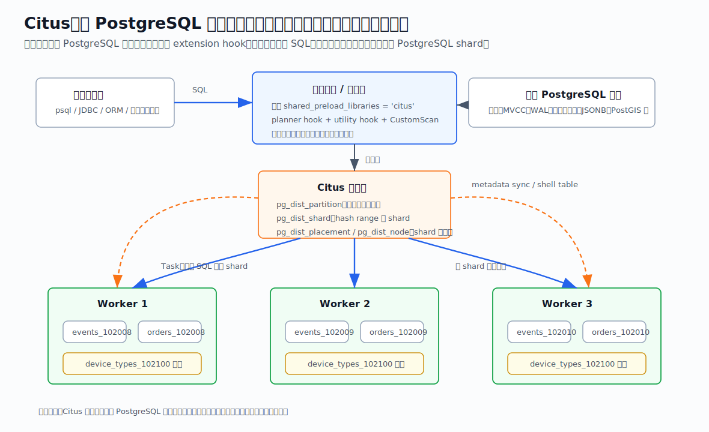
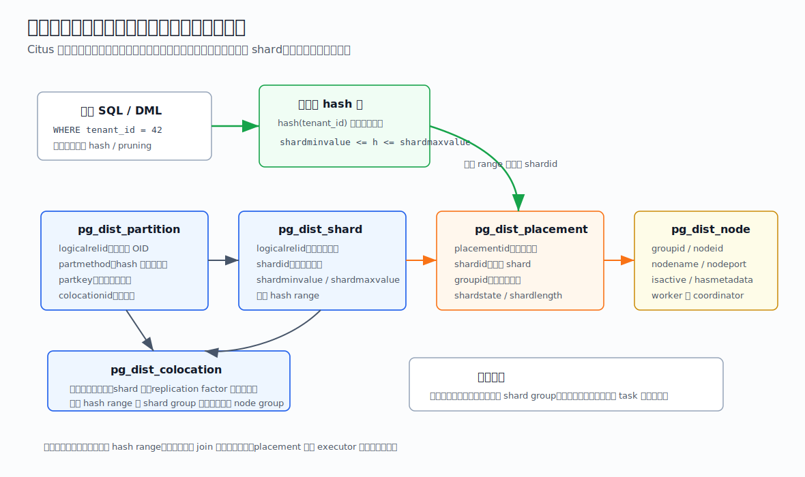
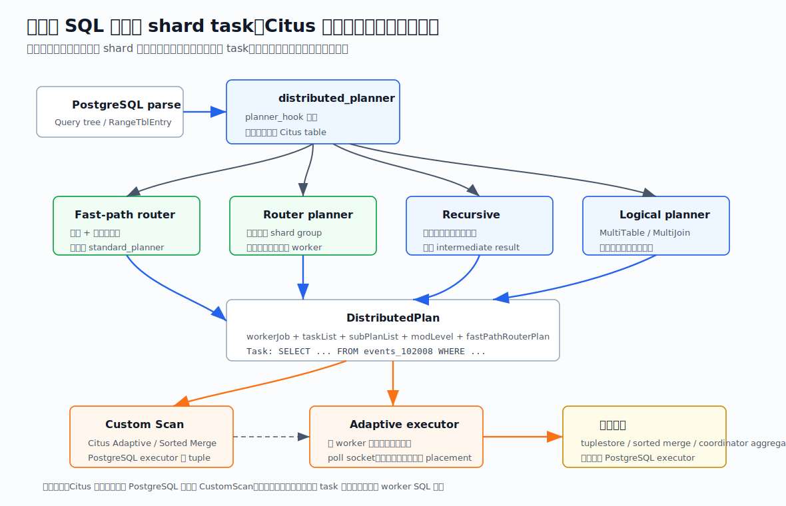
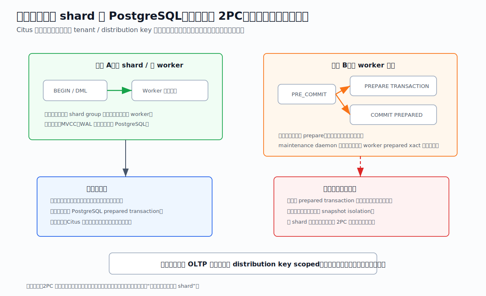
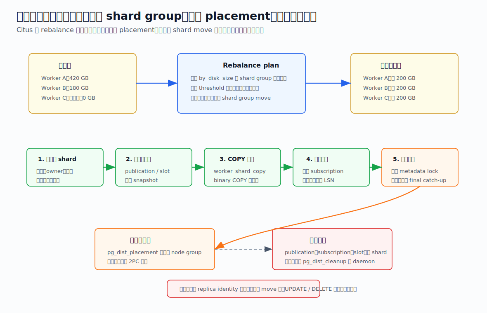

## 数据库筑基课 - PG 分布式

### 作者
digoal

### 日期
2026-06-08

### 标签
PostgreSQL , 应用开发者 , 数据库筑基课 , Citus , 分布式数据库 , 分片 , 事务 , 查询执行    

----

## 背景
  


这一节属于“场景实践 + 执行器 + 事务 + 运维机制”的交叉主题。很多团队问“PostgreSQL 怎么做分布式”，其实背后至少有三种不同问题：

1. 高可用：主备、故障切换、读写分离，典型工具是 Patroni、pg_auto_failover、云厂商控制面。
2. 连接治理：连接池、负载均衡、SQL 路由，典型工具是 PgBouncer、pgpool-II、应用层路由。
3. 水平扩展：一个业务表的数据和查询压力超过单机，需要把表拆到多台 PostgreSQL 上，并保留尽可能多的 SQL 能力。

本文讨论第三类问题，并以本地 `citus` 源码和 `citusdata/citus` DeepWiki 为主线。Citus 的路线很有代表性：它不是另写一套存储引擎，而是作为 PostgreSQL extension 进入 planner hook、executor hook、utility hook、transaction callback 和 background worker，把逻辑表、分片元数据、远程 SQL task、2PC 和 rebalance 串起来。

本文的工作假设是：标题里的“PG 分布式”指“PostgreSQL 生态里的分布式表与分布式查询执行”，而不是泛泛覆盖所有 PostgreSQL 集群方案。

## 一、它解决什么问题？

单机 PostgreSQL 到一定阶段会遇到四类硬边界：

- 数据量边界：单表、索引、VACUUM、备份恢复、冷热数据管理逐渐逼近单机存储和维护窗口。
- 写入边界：多租户、时序、事件日志、IoT 这类 append-heavy workload 会把 CPU、WAL、IO、autovacuum 压到单机极限。
- 查询边界：跨大量租户或大量时间分区的聚合，即使 SQL 优化正确，也只能吃一台机器的 CPU、内存和 IO。
- 组织边界：手工分库分表会把路由、DDL、JOIN、事务、迁移、再均衡、备份恢复都推给应用和运维。

Citus 的目标是把这些问题转化成数据库内部可管理的问题：用户仍然看到一个 PostgreSQL 数据库和逻辑表；Citus 维护逻辑表到 shard 的映射；planner 判断一条 SQL 是单 shard、共置 shard group、还是多 shard 并行；executor 把 shard SQL 发到 worker；事务层在必要时用 2PC；rebalance 在扩容后移动 shard placement。

代价也很明确：你必须围绕分布列建模。跨分布键事务、跨 shard JOIN、全局唯一约束、复杂 DDL、连接数、重均衡窗口和分布式隔离级别，都不可能“免费消失”。



图 1 说明：Citus 的数据面仍是普通 PostgreSQL 表。`events_102008` 这样的 shard 是 worker 上的真实表；协调者或任意已同步元数据的节点用 `pg_dist_*` 元数据找到 shard placement，再把普通 SQL 发给 worker。引用表则通过单 shard 多 placement 的方式复制到各节点，方便维表 JOIN 和外键。

## 二、它是什么？

可以给 Citus 一个工程化定义：

> Citus 是一个 PostgreSQL extension，通过分布式元数据、planner/executor hook、远程连接池、2PC、metadata sync、shard move/split 和 background worker，把 PostgreSQL 逻辑表扩展为跨节点的分布式表。

本地 `citus/CLAUDE.md` 给出的代码边界很清楚：`src/backend/distributed/` 是 `citus` 扩展主体，负责 sharding、distributed planner/executor、metadata sync、2PC、rebalancing；`src/backend/columnar/` 是 `citus_columnar`，负责压缩列存 TableAM。`src/backend/distributed/citus.control` 当前声明 `default_version = '15.0-1'`，本地项目说明里也写明 Citus 作为 `shared_preload_libraries = 'citus'` 加载。

Citus 里的表大致分几类：

| 类型 | 怎么创建 | 物理形态 | 适合场景 | 主要代价 |
|---|---|---|---|---|
| 分布式表 | `create_distributed_table('t','tenant_id')` | 多个 hash shard，分布在 worker | 多租户、事件、时序、大表 | 需要选好分布列，跨 shard 操作更贵 |
| 引用表 | `create_reference_table('dim')` | 一个 shard，复制到所有节点 | 小维表、字典表、外键目标 | 写入需要多 placement 协调，适合小表 |
| single shard table | `create_distributed_table('t', NULL)` 或 schema-based sharding | 一个 shard 放在一个节点 | schema-based sharding、微服务 schema | 扩展粒度是 schema/table，不是行 |
| Citus local table | `citus_add_local_table_to_metadata` 或外键自动转换 | 协调者本地表纳入元数据 | 和引用表建立外键 | 不提供水平拆分 |

源码里的元数据表定义能说明 Citus 的基本模型。`src/backend/distributed/sql/citus--8.0-1.sql` 创建了 `pg_dist_partition`、`pg_dist_shard`、历史上的 `pg_dist_shard_placement`，后续又引入 `pg_dist_placement`；同一文件还定义了 `pg_dist_node`、`pg_dist_colocation` 和 `create_distributed_table`、`create_reference_table` 这些 SQL-callable UDF。`src/backend/distributed/commands/create_distributed_table.c` 中的 `CreateCitusTable()` 负责安全检查、插入 `pg_dist_partition`、创建 shard、同步元数据、复制本地数据，并递归处理分区表。



图 2 说明：`pg_dist_partition` 说明“这张逻辑表按什么列分布”；`pg_dist_shard` 说明“hash range 对应哪个 shardid”；`pg_dist_placement` 说明“这个 shardid 在哪个 node group”；`pg_dist_node` 说明“node group 对应哪台 PostgreSQL”。共置组 `pg_dist_colocation` 则决定多个表的相同 hash range 是否一起放置，这是多租户 JOIN 能否下推的关键。

## 三、核心原理

### 1. 扩展入口：用 PostgreSQL hook 接管必要路径

Citus 的入口不在 SQL parser 之前，而是在 PostgreSQL 已经解析出 query tree 之后接管 planner、executor、utility 和 transaction 生命周期。

`src/backend/distributed/shared_library_init.c` 的 `_PG_init()` 会注册 Citus 的 CustomScan methods，并设置 `planner_hook = distributed_planner`，同时挂接 `ExecutorStart_hook`、`ExecutorRun_hook`、`ExecutorEnd_hook` 和 `ProcessUtility_hook`。技术文档 `src/backend/distributed/README.md` 也明确列出 Citus 使用 UDF、planner/executor hooks、transaction callbacks、utility hook 和 background workers。

这个设计有一个重要后果：worker 上的 shard 仍然使用 PostgreSQL 原生优化器、执行器、索引、MVCC 和 WAL。Citus 不需要重新实现 B-tree、heap、visibility、WAL recovery；它主要解决“哪段 SQL 在哪台 PostgreSQL 上执行，以及结果如何汇总”。

### 2. 建表：逻辑表转成 shell table + metadata + shard

`create_distributed_table()` 是一个 SQL 函数，但真正逻辑在 C。`create_distributed_table.c` 中 `CreateCitusTable()` 的主流程可以概括为：

1. 检查表是否能分布，必要时插入 coordinator 元数据。
2. 给表加锁，确认不是已分布表。
3. 解析分布列，决定 table type、分布方式、replication model 和 colocation id。
4. 插入 `pg_dist_partition`。
5. hash distributed table 走 `CreateHashDistributedTableShards()`；引用表走 `CreateReferenceTableShard()`；single shard table 走 `CreateSingleShardTableShard()`。
6. 如果需要，执行 `SyncCitusTableMetadata()` 把 shell table 和 `pg_dist_*` 元数据同步到其他节点。
7. 如果原表已有数据，`CopyLocalDataIntoShards()` 把本地数据写入 shard。

hash 分片不是随机散落。`CreateHashDistributedTableShards()` 如果表加入已有共置组，会调用 `CreateColocatedShards()`；否则用 round-robin 策略创建 shard placement。也就是说，分布列和共置组一旦选错，后面 JOIN、外键、事务、重均衡都会受影响。

### 3. 查询规划：先问能不能单 shard，再问怎么并行

Citus planner 的入口是 `src/backend/distributed/planner/distributed_planner.c` 中的 `distributed_planner()`。`src/backend/distributed/planner/README.md` 把规划层次讲得很直接：

1. Fast-path router planner：简单单表、单 shard 查询，甚至可跳过 `standard_planner()`。
2. Router planner：多个共置表被剪枝到同一个 shard group，可以整条 SQL 发给一个 worker。
3. Modification planning：处理 DML，尤其是多行 INSERT、UPDATE、DELETE、INSERT...SELECT。
4. Recursive planning：不可下推的 CTE/subquery 先递归规划，结果作为 intermediate result 发到 worker。
5. Logical planner：构造 `MultiTable`、`MultiJoin`、`MultiCollect` 等多关系代数树，再用 optimizer 下推过滤、投影、部分聚合，最后生成 `DistributedPlan`。

这个顺序体现了 Citus 的取舍：OLTP 路径要尽量轻，避免每条租户内查询都付出复杂分布式规划成本；OLAP 路径才需要复杂下推、repartition、subplan 和 merge。



图 3 说明：PostgreSQL executor 看到的是一个 CustomScan，例如 README 示例里的 `Custom Scan (Citus Adaptive)`。CustomScan 的执行函数最终进入 adaptive executor；adaptive executor 按 worker 管理连接池、task queue、placement failover 和结果 tuplestore。对 PostgreSQL 上层 executor 来说，它仍然是在不断拉 tuple。

### 4. 执行：Adaptive executor 管 task、连接、结果和失败

`src/backend/distributed/executor/adaptive_executor.c` 文件头部注释非常适合理解执行模型：`DistributedExecution` 持有 task list 和 worker pool；`WorkerPool` 是同一 worker 的连接池；`WorkerSession` 是到 worker 的连接；`ShardCommandExecution` 和 `TaskPlacementExecution` 跟踪 task 在 placement 上的执行状态。

执行循环大体做几件事：

- 根据 ready task 数量和 `citus.max_adaptive_executor_pool_size` 打开连接。
- 用 wait event 轮询 socket 可读/可写状态。
- 连接状态机负责建连、发 SQL、读结果、处理失败。
- 同一事务里访问过同一 placement 时，尽量复用同一连接，以保留锁和未提交写入。
- 引用表或复制 placement 的写入可能串行执行，避免死锁。
- 所有 task 完成、报错或用户取消时结束。

这解释了 Citus 为什么能同时服务两类 workload：单 shard 查询走轻路径，网络往返少；多 shard 查询则尽量并行打开连接，把多个 PostgreSQL worker 的 CPU/IO 用起来。代价是连接数和并发控制变成集群级问题，尤其在“query from any node”模式下，每个节点都可能连到其他节点。

### 5. 事务：2PC 保证原子提交，但不是全局快照隔离

Citus 事务管理在 `src/backend/distributed/transaction/transaction_management.c`。文件注释说得很清楚：这个模块主要协调 transaction callback，具体工作委托给其他子系统。

`src/backend/distributed/README.md` 对事务边界的描述很关键：

- 单节点事务：如果一个事务内的所有语句都路由到同一个 worker，协调者只在 commit/abort callback 中通知该 worker，本质上委托给单个 PostgreSQL 节点，因此获得单机 PostgreSQL 事务语义。
- 多节点事务：对写入多个节点的事务，Citus 使用 PostgreSQL 内建 two-phase commit。pre-commit 阶段向有打开事务块的 worker 发 `PREPARE TRANSACTION`；协调者存提交记录；post-commit 阶段发 `COMMIT PREPARED`。maintenance daemon 会对比协调者提交记录和 worker 上悬挂 prepared transaction 来恢复。
- 隔离边界：多节点事务保证 atomicity、consistency、durability，但因为各 worker prepared transaction 的可见时间不完全一致，不提供完整 distributed snapshot isolation。



图 4 说明：把事务压在 distribution key 内，是 Citus 最舒服的路径。跨节点 2PC 解决“提交要不要一起成功”的问题，但不等于把所有 worker 组合成一个全局 MVCC 快照。应用设计上要避免把强一致业务不加约束地扩散到多个 shard。

### 6. 扩容与重均衡：移动的是 shard group placement

扩容时，`citus_add_node()` 只是让集群知道新节点；真正把数据压力摊过去，需要 rebalance。Citus 技术文档的 rebalancing 部分说明，默认 `by_disk_size` 策略通常把 shard group 的磁盘大小视作 cost，在内存模型中尝试移动 placement，使节点 utilization 更接近平均值，并通过 threshold 避免为小收益搬大量数据。

shard move 更准确地说是 shard group placement move。非阻塞 move 依赖 PostgreSQL 逻辑复制，典型步骤包括：

1. 在目标节点创建新的 shard group placement。
2. 在源节点创建 publication、replication slot，导出 snapshot。
3. 创建 disabled subscription。
4. 用 `worker_shard_copy` 通过 `COPY` 把主体数据从源 shard 推到目标 shard。
5. 启用 subscription，复制 COPY 期间发生的增量写入。
6. 等待追平 LSN，创建索引、约束和统计信息，再次追平。
7. 通过全局 metadata lock 短暂阻塞写入，最后追平。
8. 更新 `pg_dist_placement` 指向新 node group。
9. 清理 publication、subscription、slot、旧 shard 等资源。



图 5 说明：重均衡不是一个纯 metadata 操作。数据移动主体通常发生在最终 2PC 之前；最终切换 placement 时才短暂封口。没有 replica identity 的表在逻辑复制 UPDATE/DELETE 上有限制，所以生产环境设计主键和 replica identity 不是可选项。

## 四、横向对比

| 维度 | Citus 扩展式分布式 PostgreSQL | 手工分库分表 | 单机 PostgreSQL + HA/读副本 | Shared-nothing 分布式 SQL 数据库 |
|---|---|---|---|---|
| 主要目标 | 保留 PostgreSQL 生态，同时水平扩展表和查询 | 应用自己管理水平拆分 | 提升可用性或读扩展，不拆写主库 | 从内核层设计全局分布式 SQL |
| 数据放置 | `pg_dist_*` 元数据管理 shard placement | 应用配置或中间件管理 | 主库全量数据，副本全量复制 | 系统 catalog/raft/range 管理 |
| 查询能力 | 单 shard、共置 JOIN 强；跨 shard 走 task/merge/repartition | 取决于应用实现，跨 shard SQL 通常弱 | 单机 SQL 能力完整 | 通常支持全局 SQL，但和 PG 生态兼容程度不同 |
| 事务语义 | 单 shard 等同 PG；多节点写入用 2PC，不提供完整分布式快照隔离 | 通常靠应用补偿或 TCC/Saga | 单主写入事务完整，但不能扩写 | 可能提供全局事务/序列化，但成本更高 |
| 扩容 | 加 worker 后 rebalance shard group | 应用迁移数据和改路由 | 不能水平扩写 | 自动或半自动 range/tablet 迁移 |
| PostgreSQL 扩展生态 | 强，worker 仍是 PostgreSQL | 各库可用，但一致性难维护 | 强 | 取决于具体产品 |
| 运维复杂度 | 中高：metadata、连接、2PC、rebalance、worker HA | 高：大量逻辑在应用侧 | 中：成熟主备运维 | 高：全新系统心智模型 |
| 适合 | 多租户 SaaS、实时分析、时序/IoT、tenant-scoped OLTP | 极简 KV/租户隔离且团队能维护路由 | 数据未超单机、主要要 HA | 强全局事务、多区域一致性、完全自动分片 |
| 不适合 | 频繁跨租户强事务、无法选分布列、全局唯一约束密集 | 复杂 SQL 和 JOIN 多 | 写压力或单表数据超过单机 | 必须高度兼容 PostgreSQL 扩展和运维生态 |

这张表的核心原因是控制面的位置不同。手工分库分表把分布式问题推给应用；HA/读副本没有解决单主写入和单表容量；Citus 把分布式路由和执行放进 PostgreSQL 扩展；全新分布式 SQL 数据库则通常从存储、事务和元数据层重写系统。

## 五、效果如何？

不要用“能不能无限扩展”衡量 Citus。更实际的指标是：

| 指标 | 看什么 | Citus 的典型收益 | 代价 |
|---|---|---|---|
| 单租户延迟 | `WHERE tenant_id = ?` 是否命中单 shard | 路由到一个 worker，接近单机路径 | 需要所有核心表按 tenant 共置 |
| 跨租户吞吐 | 多 shard 聚合、扫描、批处理 | 多 worker 并行执行 task | coordinator merge、网络和连接数成为成本 |
| 写入扩展 | INSERT/COPY 是否按分布列散到多个 worker | 多节点 CPU/WAL/IO 分摊 | 分布列倾斜会形成热点 shard |
| JOIN 成本 | JOIN 是否在分布列上共置 | 共置 JOIN 可下推到 worker | 非共置 JOIN 需要 repartition 或 intermediate result |
| 事务成本 | 是否跨 node group 写入 | 单 shard 事务保留 PG 语义 | 多节点 2PC 有延迟、恢复和隔离边界 |
| 扩容成本 | rebalance 需要搬多少数据 | 可后台移动 shard group | 逻辑复制、锁、replica identity、清理资源都要管 |

本地 README 的示例也体现了这个差异：按 `device_id` 分布的 `events` 表，带 `WHERE device_id = 1` 的查询会被路由到单个节点；`SELECT count(*) FROM events` 则展示为 `Custom Scan (Citus Adaptive)`，下面生成针对具体 shard 表的 task。

本文不提供性能数字，因为没有在本机启动 Citus 集群执行 benchmark。真实评估应该用业务 SQL 样本跑：

- `EXPLAIN (VERBOSE)` 看是否是单 task、multi task、repartition 还是 intermediate result。
- `citus_stat_*` 视图看单 shard/multi shard 计数、延迟和错误。
- worker 侧看 CPU、IO、WAL、autovacuum、连接池和锁等待。
- rebalance 前用 plan 函数看移动计划，不要直接在生产高峰搬数据。

## 六、实操 DEMO

下面给一个最小可验证实验。本文没有在本机启动 Citus 集群执行这些 SQL，因此不伪造输出；读者可以在 Docker 或已有 Citus 环境中执行。

### 1. 单节点快速体验

```bash
docker run -d --name citus -p 5500:5432 -e POSTGRES_PASSWORD=mypassword citusdata/citus
psql -U postgres -d postgres -h localhost -p 5500
```

```sql
CREATE EXTENSION IF NOT EXISTS citus;

CREATE TABLE tenants (
    tenant_id bigint PRIMARY KEY,
    name text NOT NULL
);

CREATE TABLE events (
    tenant_id bigint NOT NULL,
    event_id bigserial,
    event_time timestamptz DEFAULT now(),
    payload jsonb NOT NULL,
    PRIMARY KEY (tenant_id, event_id)
);

SELECT create_distributed_table('tenants', 'tenant_id');
SELECT create_distributed_table('events', 'tenant_id', colocate_with := 'tenants');

INSERT INTO tenants
SELECT g, 'tenant-' || g
FROM generate_series(1, 100) AS g;

INSERT INTO events (tenant_id, payload)
SELECT (g % 100) + 1, jsonb_build_object('v', g)
FROM generate_series(1, 100000) AS g;

EXPLAIN (VERBOSE)
SELECT *
FROM events
WHERE tenant_id = 42
ORDER BY event_time DESC
LIMIT 10;

EXPLAIN (VERBOSE)
SELECT tenant_id, count(*)
FROM events
GROUP BY tenant_id
ORDER BY tenant_id;
```

验证点：

- 第一条 SQL 应该被剪枝到某个 shard，属于单租户路径。
- 第二条 SQL 跨多个 tenant，会形成多 shard 聚合路径。
- `tenants` 和 `events` 用相同分布列并显式共置，JOIN 时更容易下推。

### 2. 多节点概念验证

在多节点环境中，典型初始化路径是：

```sql
SELECT citus_set_coordinator_host('10.0.0.1', 5432);
SELECT citus_add_node('10.0.0.2', 5432);
SELECT citus_add_node('10.0.0.3', 5432);
SELECT rebalance_table_shards();
```

验证点：

- `SELECT * FROM pg_dist_node;` 看节点是否进入元数据。
- `SELECT * FROM pg_dist_partition WHERE logicalrelid = 'events'::regclass;` 看逻辑表分布信息。
- `SELECT * FROM pg_dist_shard WHERE logicalrelid = 'events'::regclass;` 看 shard range。
- `SELECT * FROM pg_dist_placement WHERE shardid IN (...)` 看 shard 放在哪些 node group。

生产上不要只执行 `rebalance_table_shards()`。先生成 rebalance plan，确认移动数量、数据量、业务窗口、replica identity 和失败清理策略。

## 七、最佳实践

### 面向数据库架构师

1. 先定义 workload，再选分布列。多租户 SaaS 通常按 `tenant_id`；设备事件按 `device_id` 或租户加设备；时序分析要同时考虑时间分区和分布列。
2. 把事务边界压在分布列内。订单、账务、权限变更这类 OLTP 事务，如果经常跨 tenant 或跨 shard，不适合直接丢给 Citus 自动解决。
3. 设计共置组。核心事实表和同租户维表要同分布列、同类型、同 shard count；小维表用 reference table。
4. 提前定义主键和 replica identity。rebalance、non-blocking move、逻辑复制、UPDATE/DELETE 都依赖它。
5. 把“扩容后会搬数据”写进容量规划。加节点不是结束，rebalance 才是把压力摊开的过程。

### 面向 DBA

1. 观察 `pg_dist_node`、`pg_dist_shard`、`pg_dist_placement`、`pg_dist_partition`。这些表是 Citus 集群事实源，不要只看用户表。
2. 管好连接数。`query from any node` 会扩大节点间连接矩阵，worker、coordinator、连接池和应用连接上限要一起算。
3. 监控 prepared transaction 和 recovery。2PC 失败恢复依赖 maintenance daemon，`max_prepared_transactions`、悬挂 prepared xact、`pg_dist_transaction` 都要纳入巡检。
4. 重均衡前检查 replica identity、长事务、锁等待、磁盘余量、逻辑复制 slot、subscription 状态。
5. DDL 要走测试矩阵。Citus 尽量传播 DDL，但不是所有 PostgreSQL DDL 都等价于单机行为；大表 DDL 还会和 metadata lock、rebalance 互相影响。

### 面向业务开发者

1. SQL 里带上分布列。最常见性能事故是“以为查一个用户，实际没带 tenant_id，结果扫全 shard”。
2. 避免非共置 JOIN。跨分布列 JOIN 不是不能跑，而是会引入 repartition、中间结果和网络代价。
3. 不要把全局唯一性当成本能能力。唯一约束通常要包含分布列；全局序列、全局唯一校验需要单独设计。
4. 批量写入优先 COPY 或分批 INSERT，避免超大事务跨大量 shard。
5. 对跨租户报表、运营任务、补偿任务做异步化和限流，不要和在线 OLTP 抢同一组 worker 资源。

## 八、适合与不适合场景

适合：

- 多租户 SaaS：租户内事务、租户内 JOIN、跨租户分析并存。
- 实时分析 dashboard：大量事件写入，按租户或实体维度分布，跨 shard 聚合可并行。
- 时序/IoT：数据量和写入量大，结合 PostgreSQL 分区、索引、列存或冷热策略。
- 地理、JSONB、扩展生态依赖强的业务：需要 PostgreSQL 扩展能力，又要横向扩展。
- 从单机 PostgreSQL 渐进扩展：先单节点 Citus，后续加 worker 和 rebalance。

不适合：

- 核心事务天然跨大量租户或实体，且要求全局强隔离。
- 无法选择稳定、高基数、业务谓词常用的分布列。
- 频繁全局唯一约束、全局外键、全局二级索引需求强。
- 大量 ad hoc 跨 shard JOIN，且不能接受网络 shuffle 和 coordinator merge 成本。
- 团队还没有能力运维单机 PostgreSQL，却希望分布式系统自动解决所有问题。

## 九、常见坑

1. 只按数据量选分布列，不按查询和事务边界选。结果写入分散了，关键 JOIN 和事务全跨 shard。
2. 分布列类型不一致。`tenant_id bigint` 和 `tenant_id int` 看似同名，不能自然共置。
3. 小维表没有做 reference table。每次 JOIN 都变成跨 shard 广播或 repartition。
4. 以为 2PC 等于 serializable。Citus 多节点事务不是全局快照隔离，业务要避免依赖这种不存在的语义。
5. 忽略连接数。多 shard 查询、高并发、任意节点查询叠加后，worker 连接会快速膨胀。
6. 没有 replica identity 就做非阻塞 move。UPDATE/DELETE 复制会出问题，业务窗口可能被迫变成 blocking move。
7. 在 rebalance 期间跑大 DDL 或长事务。metadata lock、logical replication、slot、subscription 和 cleanup 都会被拖住。
8. 只看 coordinator 监控。瓶颈可能在某个 worker 的热点 shard、WAL、autovacuum 或磁盘。
9. 把分布式表当普通表 dump/restore。shard visibility、shell table、metadata sync 对工具行为有影响，需要按 Citus 文档流程演练。
10. 过早使用复杂跨 shard SQL。先用 `EXPLAIN` 和实际业务样本证明它能下推或可接受，再放进在线路径。

## 十、扩展问题

1. 如果你的核心表只能选一个分布列，它应该按租户、用户、设备、订单还是时间？为什么？
2. 哪些事务必须保持单 shard？哪些可以改成异步补偿或最终一致？
3. 业务里哪些 JOIN 是共置 JOIN？哪些需要 reference table？哪些应该离线化？
4. 扩容时能接受多长数据移动窗口？是否每张表都有 replica identity？
5. 如果 coordinator 不是瓶颈，是否真的需要 query from any node？连接数和观测成本能否承受？
6. 与 Greenplum、CockroachDB、YugabyteDB、手工分库分表相比，你真正需要的是 PostgreSQL 生态兼容、全局事务、分析吞吐，还是运维自动化？

## 十一、扩展阅读

- Citus 本地 README：`/Users/digoal/new/citus/README.md`，用于理解 Citus 定位、安装、分布式表、引用表、schema-based sharding、架构和适用场景。
- Citus 技术文档：`/Users/digoal/new/citus/src/backend/distributed/README.md`，用于理解概念、hooks、planner、executor、DDL、连接、2PC、锁、rebalance、CDC、query from any node。
- Citus planner 文档：`/Users/digoal/new/citus/src/backend/distributed/planner/README.md`，用于理解 fast-path router、router、recursive、logical planner 和 DML planning。
- Citus 关键源码：`shared_library_init.c`、`distributed_planner.c`、`citus_custom_scan.c`、`adaptive_executor.c`、`transaction_management.c`、`create_distributed_table.c`、`metadata_cache.c`、`metadata_sync.c`、`shard_rebalancer.c`。
- Citus metadata SQL：`/Users/digoal/new/citus/src/backend/distributed/sql/citus--8.0-1.sql` 和 `src/backend/distributed/sql/udfs/create_distributed_table/latest.sql`。
- DeepWiki：`citusdata/citus`，页面目录包括 Architecture、Distributed Query Planning、Adaptive Executor、Creating Distributed Tables、Shard Rebalancing、Metadata Cache、Metadata Synchronization、Distributed Transactions and 2PC。
- 官方文档：[Citus Concepts](https://docs.citusdata.com/en/stable/get_started/concepts.html)、[Citus open source documentation](https://docs.citusdata.com/en/stable/)。
- 论文：Citus README 提到的 SIGMOD 2021 paper “Citus: Distributed PostgreSQL for Data-Intensive Applications”。
  
## 附录 
1、克隆代码  
```  
git clone --depth 1 https://github.com/citusdata/citus
```  
  
2、启用 codex, 使用 [数据库筑基课 skill](../skills/README.md).  
```
文章标题: 
  数据库筑基课 - PG 分布式
项目源码(本地目录): 
  citus
项目 codebase 文件名: 
  citus/CLAUDE.md 
开源项目相关的 deepwiki repoName: 
  citusdata/citus
```
   
  
#### [PostgreSQL 解决方案集合](../201706/20170601_02.md "40cff096e9ed7122c512b35d8561d9c8")
  
  
#### [德哥 / digoal's Github - 公益是一辈子的事.](https://github.com/digoal/blog/blob/master/README.md "22709685feb7cab07d30f30387f0a9ae")
  
  
#### [About 德哥](https://github.com/digoal/blog/blob/master/me/readme.md "a37735981e7704886ffd590565582dd0")
  
  

  
