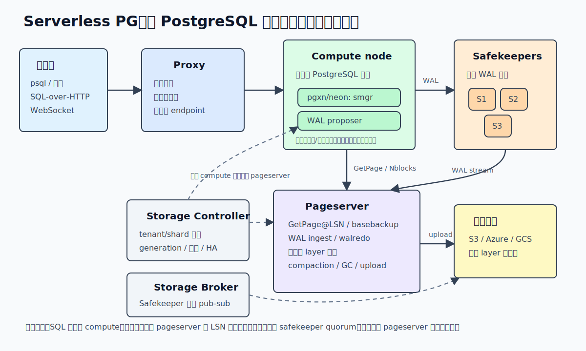
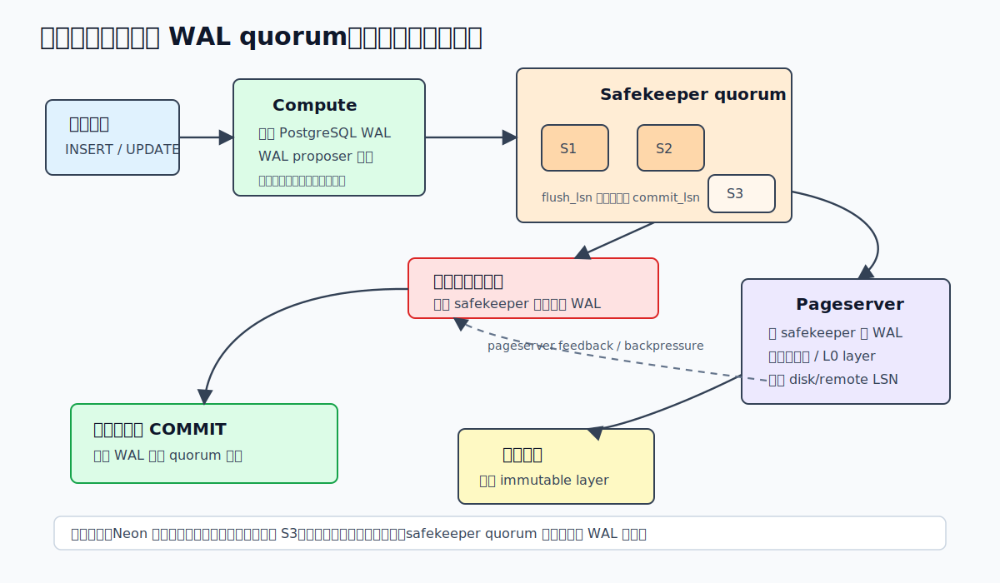
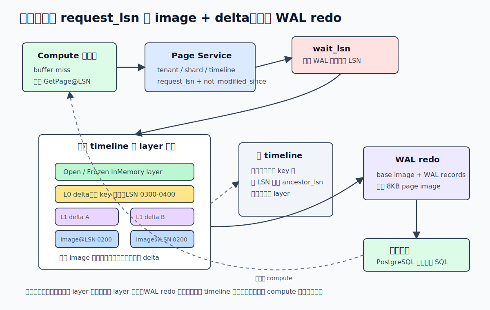
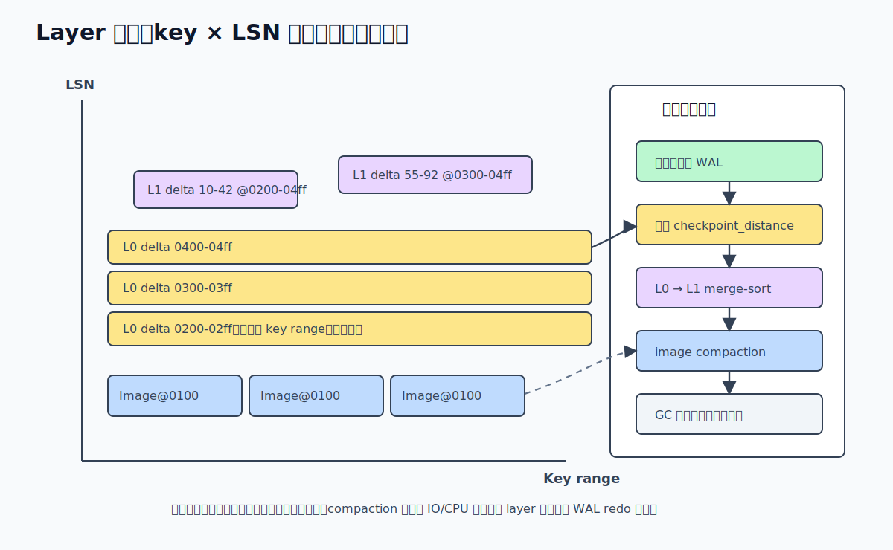
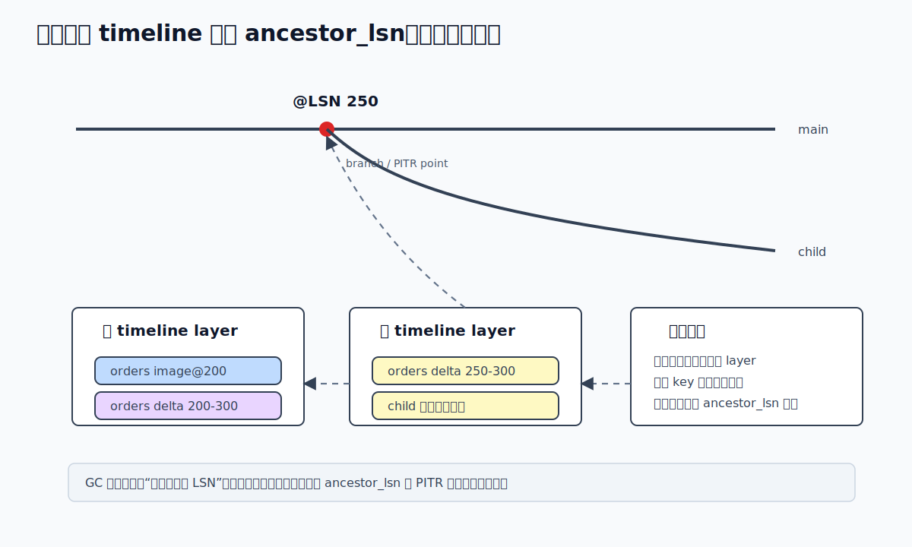

## 数据库筑基课 - serverless PG

### 作者
digoal

### 日期
2026-06-08

### 标签
PostgreSQL , 应用开发者 , 数据库筑基课 , Serverless PG , Neon , 计算存储分离 , WAL , Pageserver , Safekeeper    

----

## 背景
  


这一节属于“场景实践 + 存储架构 + 维护机制”的交叉主题。它讨论的不是云厂商控制台里“点一下创建数据库”的 serverless，而是一个更基础的问题：如果仍然保留 PostgreSQL 的 SQL 层、事务语义、MVCC 和生态，能不能把计算节点做成可启动、可停止、可迁移的无状态前台，把永久数据、历史版本和分支能力下沉到一个独立存储系统里？

传统 PostgreSQL 的单机心智模型很清晰：客户端连到一个 PostgreSQL 实例，实例本地有 `base/` 数据文件、`pg_wal/`、shared buffers、后台进程、checkpoint、autovacuum。这个模型可靠、简单、局部性好，但在云上遇到几个典型痛点：

- 计算和存储绑在一起，缩放计算通常意味着搬数据或切主备。
- 空闲数据库仍然占着计算资源，真正按请求唤醒比较困难。
- 创建测试分支、预发分支、时间点恢复分支时，传统做法接近“复制一份数据或恢复一份备份”，大库会慢。
- 对象存储便宜、可靠、弹性好，但 PostgreSQL 前台查询不能每次都直接等对象存储。

Neon 是一个开源 serverless Postgres 数据库平台。它的 README 把目标说得很直接：Neon separates storage and compute，并用一个集群化存储引擎替换 PostgreSQL 的本地存储层。本文以本地 `neon` 源码为主，结合 DeepWiki 的 `neondatabase/neon` 架构索引，解释 serverless PG 的机制、收益、代价和实践边界。

本文不把 serverless PG 写成“更便宜的 PostgreSQL”。更准确的定义是：用计算存储分离、WAL quorum、按 LSN 取页、不可变 layer、copy-on-write timeline 和控制面调度，换来计算弹性、快速分支、长期历史保存和更细粒度的资源治理。代价是读路径、写路径、GC、compaction、冷启动和故障恢复都比单机 PostgreSQL 更复杂。

## 一、它解决什么问题？

serverless PG 解决的是“数据库资源形态和业务使用方式不匹配”的问题。

业务侧通常希望数据库具备这些能力：

- 开发、测试、预发、数据修复都能快速从生产某个时间点拉出分支。
- 空闲时少付计算成本，有请求时快速恢复连接。
- 读写负载变化时，计算资源能重新调度，而不是把整个数据目录搬走。
- 存储按历史、分支、冷数据和热数据分层管理，不被单机磁盘容量锁死。
- PostgreSQL 协议、SQL、扩展生态和应用连接方式尽量不变。

传统 PostgreSQL 不是不能做这些事，而是每个能力都需要外部系统拼接：备份恢复、物理复制、逻辑复制、快照盘、连接池、自动启停、归档 WAL、对象存储、代理层、控制面。拼接得越多，数据库本身和云平台之间的边界越模糊。

Neon 的思路是把问题重新切分：

1. SQL 执行仍由 PostgreSQL compute 完成。
2. 永久页面不再依赖 compute 本地数据文件，而由 pageserver 按 `page@LSN` 提供。
3. 事务提交的低延迟耐久由 safekeeper quorum 负责。
4. 历史页面版本被重写成不可变 layer，并上传对象存储。
5. 分支不是复制数据，而是创建一个带 `ancestor_lsn` 的新 timeline。
6. storage controller 负责 tenant/shard 的放置、generation、高可用和迁移。

这让“数据库实例”从一个固定进程 + 固定磁盘目录，变成了一个 endpoint、一个 timeline、一组 safekeeper、一个 pageserver/shard placement 和若干远端 layer 的组合。



图 1 说明：Neon 把 PostgreSQL compute 做成相对无状态的前台进程，客户端通过 Proxy 连接；compute 的存储管理器不再把永久页写到本地关系文件，而是向 pageserver 请求页面；WAL proposer 把 WAL 推给 safekeeper quorum；pageserver 从 safekeeper 拉 WAL，切成 layer 并上传对象存储；storage controller 和 broker 负责放置、协调和迁移。这不是把 PostgreSQL 简单“放进容器”，而是替换了它的永久存储路径。

## 二、它是什么？

serverless PG 可以定义为：保留 PostgreSQL 查询处理和事务模型，把永久存储、历史版本、分支和部分高可用能力外置到独立存储服务，并让 compute 节点可以按需启动、停止、迁移或重新连接的 PostgreSQL 架构。

以 Neon 开源实现为例，关键组件如下：

| 组件 | 职责 | 本地证据 |
|---|---|---|
| Compute node | 无状态 PostgreSQL 进程，负责 SQL 执行、连接会话、shared buffers、事务逻辑 | `neon/CLAUDE.md`、`neon/pgxn/neon/README.md` |
| `pgxn/neon` | PostgreSQL 扩展，接管 storage manager API，与 pageserver 通信，并包含 WAL proposer | `neon/pgxn/neon/pagestore_smgr.c`、`neon/pgxn/neon/walproposer.c` |
| Pageserver | 响应 `GetPage@LSN`，从 WAL 生成 layer，执行 compaction/GC，上传对象存储 | `neon/docs/pageserver.md`、`neon/docs/pageserver-storage.md` |
| Safekeeper | 冗余 WAL 服务，compute 提交时等待多数 safekeeper 持久化 WAL | `neon/docs/walservice.md`、`neon/docs/safekeeper-protocol.md` |
| Storage broker | stateless pub-sub，让 pageserver 和 safekeeper 发现 timeline 状态，避免 O(n²) 连接 | `neon/docs/storage_broker.md` |
| Storage controller | tenant/shard 放置、generation、高可用、live migration、intent + reconcile | `neon/docs/storage_controller.md` |
| Proxy | PostgreSQL 协议路由、认证、WebSocket、SQL-over-HTTP、连接到 endpoint | `neon/proxy/README.md`、`neon/CLAUDE.md` |
| Remote storage | S3/Azure/GCS/local fs 后端，用于长期保存 layer | `neon/libs/remote_storage/src/` |

这里最容易混淆的是“无状态 compute”。无状态不是说 PostgreSQL 进程没有内存状态，也不是说它没有本地临时文件。它仍然有连接、事务、锁、shared buffers、临时表、临时文件、扩展加载和本地缓存。无状态的核心含义是：永久用户数据的权威版本不在 compute 本地关系文件里；compute 可以从 pageserver 获取 basebackup 和页面，重新启动到某个 timeline/LSN 上。

`pagestore_smgr.c` 的注释也体现了这个边界：temporary 和 unlogged relations 走本地 `md.c`；永久关系的写入依赖 WAL，并由 pageserver 存储。换句话说，serverless PG 没有取消 PostgreSQL 的 buffer manager，而是改变了 buffer miss 和 dirty buffer eviction 背后的永久化方式。

## 三、核心原理

### 1. 写入路径：提交先进入 safekeeper quorum

传统 PostgreSQL 的提交路径大致是：事务产生 WAL，WAL flush 到本地磁盘，必要时等待同步副本。Neon 改成了：compute 中的 WAL proposer 把 WAL 推给多个 safekeeper；当多数 safekeeper 把 WAL 持久化到本地盘后，WAL 位置被视为 quorum committed；然后 PostgreSQL 的同步复制等待者被唤醒。

`neon/docs/walservice.md` 说明 safekeeper 是 WAL service 的成员，WAL record 在 majority safekeepers 接收并存到本地盘后才算 durable。`neon/pgxn/neon/walproposer.h` 中 `quorum = n_safekeepers / 2 + 1`；`neon/pgxn/neon/walproposer.c` 的 `GetAcknowledgedByQuorumWALPosition()` 会收集各 safekeeper 回报的 `flushLsn`，排序后取满足 quorum 的 LSN，推进 `commitLsn`。`neon/safekeeper/src/wal_storage.rs` 则把 safekeeper WAL 存成接近 `pg_wal` 的 segment 文件，并区分 write LSN 与 flush record LSN。

这带来一个重要结论：Neon 的事务提交不需要等待每笔事务上传对象存储。对象存储承担长期、廉价、可恢复的 layer 持久化；低延迟提交耐久由 safekeeper quorum 承担。pageserver 后续从 safekeeper 拉 WAL，写入内存层、刷成 layer，再上传远端存储。



图 2 说明：事务提交等待点在 safekeeper quorum，而不是对象存储。pageserver 的 `disk_consistent_lsn`、`remote_consistent_lsn` 会通过 safekeeper feedback 回到 WAL proposer，用于推进复制槽、释放 WAL 和形成 backpressure。这样做降低提交延迟，但也引入了三段式滞后：compute 到 safekeeper、safekeeper 到 pageserver、pageserver 到 remote storage。

### 2. 读取路径：GetPage@LSN 不是读文件，而是重构页面版本

在 Neon 里，compute 缓冲区缺页时，会向 pageserver 请求页面。协议层能看到 `GetPage`、`Nblocks`、`DbSize`、`GetSlruSegment` 等请求；`neon/libs/pageserver_api/src/pagestream_api.rs` 和 `neon/pageserver/page_api/proto/page_service.proto` 都明确了 `request_lsn` 与 `not_modified_since_lsn` 的含义。

`request_lsn` 是要读取的页面版本；`not_modified_since_lsn` 是 compute 给 pageserver 的提示：调用方保证这个页面从某个 LSN 之后没有被修改。这个提示可以减少 pageserver 不必要地等待请求 LSN 到达。

pageserver 的核心工作在 `neon/pageserver/src/tenant/timeline.rs`：

- `Timeline::get()` 把单页请求转为 `VersionedKeySpaceQuery`。
- `get_vectored_impl()` 先规划读取哪些 layer，再收集 page reconstruct data。
- `get_vectored_reconstruct_data_timeline()` 在当前 timeline 的 layer fringe 里从高 LSN 向低 LSN 找。
- 如果当前 timeline 缺失某些 key，并且存在 ancestor timeline，就把查询 LSN 降到 `ancestor_lsn`，继续查父 timeline。
- `reconstruct_value()` 用 base image 和 WAL records 调用 walredo，生成最终 8KB page image。

这解释了 Neon 分支的本质：子 timeline 不需要复制父 timeline 的全部页面。子分支只记录自己从 `ancestor_lsn` 之后产生的新 layer；没有被修改的页面，读取时回到父 timeline 的历史 layer 中找。



图 3 说明：pageserver 读路径像是在 `key × LSN` 空间里向下搜索。先看内存层和当前 timeline 的最新 layer；遇到 image 就可以停止继续向下找，再对后续 delta 做 WAL redo；如果当前 timeline 没有这个 key，则按 ancestor 关系到父 timeline 查。读放大来自访问 layer 数、远端下载、WAL redo 记录数、祖先追溯深度和冷缓存命中率。

### 3. 存储格式：WAL 被切成不可变 layer

`neon/docs/pageserver-storage.md` 是理解 Neon 存储层的关键文档。它说 pageserver 的主要责任是处理 incoming WAL，并把 WAL 重写成能较快访问任意页面版本的格式。具体做法是：按 relation/page 或更通用的 key 维度切分 WAL，把历史打包成 immutable layer files。

Layer 有几个核心概念：

- InMemory layer：新 WAL 先进入内存层。
- Frozen InMemory layer：内存层达到阈值后冻结，不再接收新 WAL。
- Delta layer：保存某个 key range、某个 LSN range 内的 WAL records 或 page images。
- Image layer：保存某个 key range 在某个 LSN 的页面快照。
- L0 layer：delta layer 覆盖整个 key range，通常由内存层顺序 flush 出来。
- L1 layer：经过 compaction 后覆盖更窄 key range 的 layer。

`neon/docs/pageserver-compaction.md` 进一步解释了为什么需要 compaction。L0 layer 覆盖全 key range，堆得越多，任何读请求都可能要扫更多 layer，这就是 read amplification。Neon 的 compaction 主要做两件事：

1. L0 到 L1：把多个 L0 delta 用 merge-sort 合并成按 key range 切分的 L1 delta。
2. L1 image compaction：在某个 LSN 横向扫描 keyspace，把 image + delta materialize 成新的 image layer，让后续读取更快停止。

源码里，`timeline.rs` 的 flush loop 会在 frozen layer 出现后创建 delta layer，并在 L0 数量超过阈值时触发 compaction；同一文件里还能看到 `l0_flush_delay_threshold` 和 `l0_flush_stall_threshold` 对写入形成 backpressure。`docs/pageserver-compaction.md` 给出的默认量级是：`checkpoint_distance` 默认 256 MB，`compaction_threshold` 默认 10，`compaction_target_size` 默认 128 MB；这些是文档中的默认值，不应当当作所有部署的固定 SLA。



图 4 说明：Neon 用“写入快、后台整理”的 LSM 类思路管理 PostgreSQL 页面版本。写入先顺序进入内存层和 L0，避免在前台随机改写历史文件；读路径可能因此多访问 layer，所以后台 compaction 用 IO 和 CPU 换更低的读放大。这个机制让历史版本和分支变便宜，但要求 compaction、GC、上传和 backpressure 正常工作。

### 4. 分支与 PITR：timeline 是 copy-on-write 历史链

Neon 的分支不是 SQL schema，也不是逻辑复制 slot，而是 timeline。创建新分支时，系统记录：

- 新 timeline id。
- ancestor timeline id。
- ancestor LSN。
- 必要的 tenant/shard 元数据。

`neon/docs/pageserver-storage.md` 用 `main` 和 `child` 举例：如果 child 在 LSN 250 从 main 创建，child 上没有修改过的表或页面不需要立刻复制；读取 child 某页时，如果 child layer 里找不到，就回到 main，但 main 上 LSN 250 之后的变化对 child 不可见。历史 LSN 创建分支就是 PITR 的基础。

源码中，`get_vectored_reconstruct_data()` 在当前 timeline 未完成 keyspace 时，会检查 `ancestor_timeline`，然后执行 `query.lower(timeline.ancestor_lsn)`，这正是“父分支只读到分叉点”的实现证据。`timeline.rs` 还会在访问 ancestor 前等待 ancestor active，并等待其 WAL 到达 branch LSN。



图 5 说明：分支快，是因为它只创建元数据关系；分支不免费，是因为父分支在 GC 时必须保留子分支仍然依赖的历史 layer。分支越多、保留时间越长、写入越分散，GC 和存储账单越需要治理。

### 5. 控制面：serverless 不是只有存储引擎

计算存储分离以后，数据库系统多了一个控制面问题：哪个 tenant shard 放在哪个 pageserver？compute 该连哪个 pageserver 和 safekeeper？pageserver 迁移时如何避免旧节点和新节点同时写错数据？节点故障时如何重新附着？

`neon/docs/storage_controller.md` 说明 storage controller 位于管理 API 客户端和 pageserver 之间，提供 pageserver-compatible API，并管理 tenant shard placement、generation、secondary locations、高可用和 live migration。它采用 intent + reconcile 模式，并把部分状态持久化到一个 PostgreSQL 数据库。文档还特别强调，这个数据库不能放在易失本地盘，因为 generation number 关系到 pageserver 数据安全。

`storage_broker.md` 则解释 broker 是 stateless pub-sub，主要用于 safekeeper 和 pageserver 互相了解 timeline 状态，避免存储节点之间 O(n²) 连接。它不是权威持久层，而是协调通道。

所以 serverless PG 的难点不仅是“写一个远端 page server”。真正的工程系统还要解决路由、认证、租户放置、分片、generation、迁移、故障检测、计算唤醒、连接迁移、限流、backpressure 和观测。

## 四、横向对比

| 维度 | 传统单机 PostgreSQL | 主备/托管 PostgreSQL | Serverless PG（Neon 类） |
|---|---|---|---|
| 主要目标 | 简单可靠的单实例数据库 | 高可用、备份、托管运维 | 计算弹性、快速分支、存储历史化、按需运行 |
| 永久数据位置 | 实例本地数据目录 | 主库本地盘 + 副本/备份 | pageserver layer + remote storage，compute 不持有权威永久页 |
| 提交耐久 | 本地 WAL flush，可配置同步副本 | 主库 WAL + 同步/异步副本策略 | safekeeper quorum 持久化 WAL |
| 读路径 | buffer miss 读本地关系文件 | 通常仍读本地盘或副本本地盘 | compute 发 `GetPage@LSN`，pageserver 重构 page |
| 分支/PITR | 依赖备份恢复、快照盘或复制 | 通常是恢复新实例或云盘快照 | timeline + ancestor LSN，copy-on-write |
| 冷启动 | 实例长期运行或恢复数据目录 | 取决于实例和存储 | compute 可重新取 basebackup 并连 pageserver |
| 读延迟风险 | 本地 IO、缓存、锁和 vacuum | 本地 IO + 复制拓扑 | 冷缓存、远端 layer 下载、WAL redo、layer read amplification |
| 写入风险 | 本地 WAL IO、checkpoint | WAL IO、同步复制等待 | safekeeper quorum、pageserver ingest 滞后、compaction debt |
| 运维复杂度 | 最低 | 中等 | 最高，需要控制面和存储面协同 |
| 适合场景 | 稳定负载、低复杂度、自管可控 | 生产 OLTP、标准高可用 | 多分支、多租户、弹性计算、开发测试隔离、平台型数据库 |
| 不适合场景 | 不追求弹性和分支时仍很好 | 大多数普通生产系统足够 | 极端低延迟本地 IO、强本地扩展依赖、不能接受复杂控制面 |

这张表的核心原因是：serverless PG 把许多原本由“本地文件系统 + PostgreSQL 后台进程”隐式完成的事情显式服务化了。服务化之后，弹性和分支能力更强；但每条路径都多了网络、协议、协调和后台维护。

## 五、效果如何？

serverless PG 的收益要分场景看。

对平台型业务，最直接的收益是分支和按需计算：

- 为每个 PR、每个测试环境、每个数据修复任务创建独立分支，避免复制整库。
- 空闲 endpoint 可以停 compute，保留存储状态。
- 计算节点故障或迁移时，重新启动 compute 并连接同一 timeline。
- 对象存储承接长期 layer，降低热计算节点的本地状态要求。

对 DBA 和内核视角，收益来自存储历史模型：

- WAL 被转成按 key/LSN 查询的 layer，天然支持 page@LSN。
- 分支和 PITR 使用同一套 timeline/ancestor 机制。
- Compaction 和 GC 可以在后台重写历史布局，前台写入走追加路径。

但效果不是无代价的。常见成本包括：

- **读放大**：L0 过多、image layer 不足、历史链过深，会导致 pageserver 访问更多 layer。
- **冷读延迟**：本地没有 layer 时需要从 remote storage 下载。
- **WAL redo 成本**：没有近的 image 时，需要 replay 更多 delta。
- **写入 backpressure**：pageserver ingest、flush 或 compaction 落后时，compute 写 WAL 会被拖慢。
- **控制面一致性**：tenant placement、generation、compute 通知、pageserver attach/detach 都必须正确。
- **观测复杂度**：单看 PostgreSQL 等待事件不够，还要看 safekeeper、pageserver、remote storage、compaction 和 broker/controller。

所以 serverless PG 的效果不能只用“QPS 是否更高”衡量。更合理的指标是：

| 指标 | 看什么 | 为什么 |
|---|---|---|
| Compute cold start | basebackup 获取、PostgreSQL 启动、缓存预热 | 决定按需启动体验 |
| GetPage 延迟分布 | P50/P95/P99、layers visited、remote download | 决定冷读和复杂读路径体验 |
| WAL commit 延迟 | safekeeper quorum ack、flush_lsn 推进 | 决定事务提交延迟 |
| Pageserver ingest lag | last_received_lsn、disk_consistent_lsn、remote_consistent_lsn | 决定读等待和 WAL 保留 |
| L0 数量和 compaction debt | L0 count、compaction loop、circuit breaker | 决定读放大和写入 backpressure |
| GC 可回收空间 | PITR 窗口、branch retain LSN、ancestor 依赖 | 决定存储成本 |
| 分支数量和寿命 | 活跃分支、孤儿分支、长期测试分支 | 决定历史保留压力 |

## 六、实操 DEMO

本文没有在本机编译并启动 Neon；下面 DEMO 来自 `neon/README.md` 和 `neon/CLAUDE.md` 的本地开发流程，作为最小可验证路径。不要把示例输出当作本文已执行结果。

### DEMO 1：本地启动 Neon 并验证普通 PostgreSQL 访问

```bash
cd /Users/digoal/new/neon
cargo neon init
cargo neon start
cargo neon tenant create --set-default --pg-version 16
cargo neon endpoint create main --pg-version 16
cargo neon endpoint start main
psql -p 55432 -h 127.0.0.1 -U cloud_admin postgres
```

进入 `psql` 后：

```sql
CREATE TABLE t_serverless_pg (
    id bigint PRIMARY KEY,
    payload text,
    created_at timestamptz DEFAULT now()
);

INSERT INTO t_serverless_pg(id, payload)
SELECT g, md5(g::text)
FROM generate_series(1, 1000) AS g;

SELECT count(*) FROM t_serverless_pg;
```

验证点：

- 对应用来说，这仍然是 PostgreSQL 协议和 SQL。
- compute 启动时会从 pageserver 获取必要状态。
- 永久关系页面的权威存储在 pageserver 存储层，不是普通 PostgreSQL 本地数据目录模型。

### DEMO 2：创建分支并验证 copy-on-write 语义

```bash
cd /Users/digoal/new/neon
cargo neon timeline branch --branch-name migration_check
cargo neon endpoint create migration_check --branch-name migration_check --pg-version 16
cargo neon endpoint start migration_check
```

在分支 endpoint 中：

```sql
INSERT INTO t_serverless_pg(id, payload)
VALUES (1001, 'branch only');

SELECT count(*) FROM t_serverless_pg;
```

回到 main endpoint：

```sql
SELECT *
FROM t_serverless_pg
WHERE id = 1001;
```

预期验证点：

- 分支能看到分叉点之前 main 的数据。
- 分支写入不会影响 main。
- 这不是逻辑复制，而是 timeline 继承 + 分支后写入独立 layer。

### DEMO 3：观察关键配置和指标入口

可以从 PostgreSQL 侧检查 Neon 相关 GUC：

```sql
SELECT name, setting
FROM pg_settings
WHERE name LIKE 'neon.%'
ORDER BY name;
```

也可以从 pageserver/safekeeper 的 HTTP API 或 Prometheus 指标观察：

- pageserver `wait_lsn` 时间。
- pageserver layer 访问数、L0 数量、compaction 时间。
- safekeeper `flush_lsn`、`commit_lsn`。
- compute 侧 WAL backpressure 时间。

具体指标名会随版本演进，建议以当前源码 `neon/pageserver/src/metrics.rs`、`neon/safekeeper/src/metrics.rs` 和部署环境的 `/metrics` 输出为准。

## 七、最佳实践

### 面向数据库架构师

把 serverless PG 当作一种“历史版本存储系统 + PostgreSQL compute”的组合，而不是普通 PostgreSQL 的部署参数。架构设计时先回答：

- 业务是否真的需要快速分支、按需 compute、多租户弹性和长历史？
- 分支保留多久？谁负责清理？
- 冷启动 P95/P99 能接受多少？
- 读请求对冷 cache 和远端 layer 下载是否敏感？
- 控制面数据库、对象存储、safekeeper quorum 分别怎么做高可用？

如果只是一个稳定 OLTP 主库，长期高负载、很少创建分支，也不需要按需停机，传统托管 PostgreSQL 可能更简单。

### 面向 DBA

观测重点要从单机 PostgreSQL 扩展到四条链路：

1. Compute：连接数、SQL 等待、shared buffers、WAL 生成、backpressure。
2. Safekeeper：quorum、flush_lsn、commit_lsn、磁盘空间和延迟。
3. Pageserver：GetPage 延迟、wait_lsn、layer count、L0、compaction、GC、remote upload/download。
4. Control plane：tenant placement、generation、attach/detach、compute hook、迁移状态。

排障时不要只看 SQL 慢查询。一个慢查询可能是普通执行计划问题，也可能是 pageserver 冷读、远端 layer 下载、L0 堆积、ancestor 追溯或 wait_lsn 超时。

### 面向业务开发者

使用 serverless PG 时，应用层仍要遵守 PostgreSQL 的基本工程纪律：

- 连接池要适配 compute 自动启停，不要无限重试打爆唤醒路径。
- 迁移脚本和 CI 分支要有生命周期，测试分支不要永久保留。
- 大批量写入后马上做冷读，要预期 pageserver ingest/compaction 可能还在追赶。
- 不要把临时表、unlogged 表、扩展本地文件行为误认为永久可迁移状态。
- 关键业务压测要覆盖冷启动、分支后读、长事务、批量写、VACUUM、索引构建和恢复路径。

## 八、适合与不适合场景

适合：

- SaaS 多租户平台，希望按租户或项目隔离 compute 与存储。
- 需要大量 preview database、CI database、开发测试分支的团队。
- 数据库长期存在但访问稀疏，希望空闲时释放 compute。
- 需要快速 PITR、数据修复沙箱、审计回放或实验分支。
- 能接受云原生控制面，并愿意建设完整观测体系的团队。

不适合：

- 极端低延迟、本地 NVMe 读写路径敏感、任何网络跳转都不可接受的核心交易路径。
- 强依赖本地文件系统语义的扩展或外部程序。
- 分支很少、弹性不重要、团队更看重最小复杂度的单体业务。
- 无法运维对象存储、控制面数据库、safekeeper quorum 和 pageserver 的自建环境。
- 对冷启动延迟、偶发远端下载延迟完全不能容忍的业务。

## 九、常见坑

1. **把 serverless 当成“自动更便宜”**  
   计算可以省，存储历史、分支、对象存储请求、后台 compaction 都有成本。长期不清理分支会让 GC 无法回收旧 layer。

2. **只压测热缓存**  
   热 compute + 热 pageserver cache 的结果不能代表冷启动、冷读和远端 layer 下载。

3. **忽略 L0 和 compaction debt**  
   大写入后 L0 堆积会增加读放大。`docs/pageserver-compaction.md` 明确提到 backpressure 和 compaction circuit breaker，生产环境必须监控。

4. **误以为分支完全免费**  
   创建分支很快，但 ancestor layer 需要保留；分支写入越多，新增 layer 越多；分支寿命越长，GC 边界越复杂。

5. **把 compute 本地状态当永久状态**  
   临时表、unlogged relation、本地缓存、某些扩展文件行为要单独确认。`pagestore_smgr.c` 注释已经说明 temporary/unlogged relations 走本地路径。

6. **只用 PostgreSQL 视角排障**  
   Neon 慢可能慢在 SQL，也可能慢在 safekeeper、pageserver、remote storage、broker/controller 或 compute 唤醒。

7. **自建时轻视 storage controller 数据库**  
   `storage_controller.md` 明确说 controller DB 包含 pageserver generation numbers，关系到数据安全，不能放在易失盘。

## 十、扩展问题

1. 如果把 PostgreSQL 页面版本建模成 `key × LSN`，哪些传统数据库功能会自然变简单？哪些会变复杂？
2. Safekeeper quorum 和传统同步复制在提交延迟、故障恢复、写入脑裂防护上有什么差异？
3. 为什么 L0 layer 对读放大特别危险？如果你的 workload 是热点小表频繁更新，compaction 策略应该关注什么？
4. 分支越多越好吗？如何给 preview database 设计自动过期和成本归因？
5. 如果业务要求“冷启动后第一条查询 P99 小于 100ms”，serverless PG 需要哪些预热、缓存或限制条件？
6. 计算存储分离后，数据库内核、控制面和对象存储之间的责任边界应该如何写进 SLO？

## 十一、扩展阅读

本节主要参考以下资料。源码路径均来自本地 `/Users/digoal/new/neon` 仓库，当前本地 HEAD 为 `8f60b04`。

- `neon/CLAUDE.md`：本地 codebase 总览，说明 compute、pageserver、safekeeper、broker、controller、proxy 的职责。
- `neon/README.md`：Neon 项目定位、本地启动、tenant/timeline/branch 示例。
- `neon/docs/SUMMARY.md`：开发者文档目录。
- `neon/docs/pageserver.md`：pageserver 职责概览。
- `neon/docs/pageserver-storage.md`：layer 文件、image/delta、L0/L1、branch、GC 的核心说明。
- `neon/docs/pageserver-compaction.md`：compaction 原因、L0/L1、image compaction、backpressure、circuit breaker。
- `neon/docs/walservice.md`：WAL service、safekeeper quorum、WAL proposer。
- `neon/docs/safekeeper-protocol.md`：proposer/safekeeper 握手、恢复、CommitLSN、RestartLSN、FlushLSN、VCL。
- `neon/docs/storage_controller.md`：storage controller、tenant shard placement、generation、intent + reconcile。
- `neon/docs/storage_broker.md`：broker 的 pub-sub 协调模型。
- `neon/pgxn/neon/README.md`、`neon/pgxn/neon/pagestore_smgr.c`、`neon/pgxn/neon/walproposer.c`、`neon/pgxn/neon/walproposer.h`：compute 侧存储接管和 WAL proposer 实现。
- `neon/pageserver/src/tenant/timeline.rs`、`neon/pageserver/src/tenant/storage_layer.rs`、`neon/pageserver/page_api/proto/page_service.proto`、`neon/libs/pageserver_api/src/pagestream_api.rs`：GetPage、layer 搜索、walredo、gRPC/libpq page API。
- `neon/safekeeper/src/receive_wal.rs`、`neon/safekeeper/src/wal_storage.rs`：safekeeper 接收 WAL、写盘和 flush LSN。
- DeepWiki `neondatabase/neon`：用于辅助定位页面结构和交叉确认组件边界，尤其是 Overview、System Architecture、Pageserver、Safekeeper、Compute Node、Storage Controller、Proxy 章节。
  
## 附录 
1、克隆代码  
```  
git clone --depth 1 https://github.com/neondatabase/neon
```  
  
2、启用 codex, 使用 [数据库筑基课 skill](../skills/README.md).  
```
文章标题: 
  数据库筑基课 - serverless PG
项目源码(本地目录): 
  neon
项目 codebase 文件名: 
  neon/CLAUDE.md 
开源项目相关的 deepwiki repoName: 
  neondatabase/neon
```
  
  
  
#### [PostgreSQL 解决方案集合](../201706/20170601_02.md "40cff096e9ed7122c512b35d8561d9c8")
  
  
#### [德哥 / digoal's Github - 公益是一辈子的事.](https://github.com/digoal/blog/blob/master/README.md "22709685feb7cab07d30f30387f0a9ae")
  
  
#### [About 德哥](https://github.com/digoal/blog/blob/master/me/readme.md "a37735981e7704886ffd590565582dd0")
  
  

  
