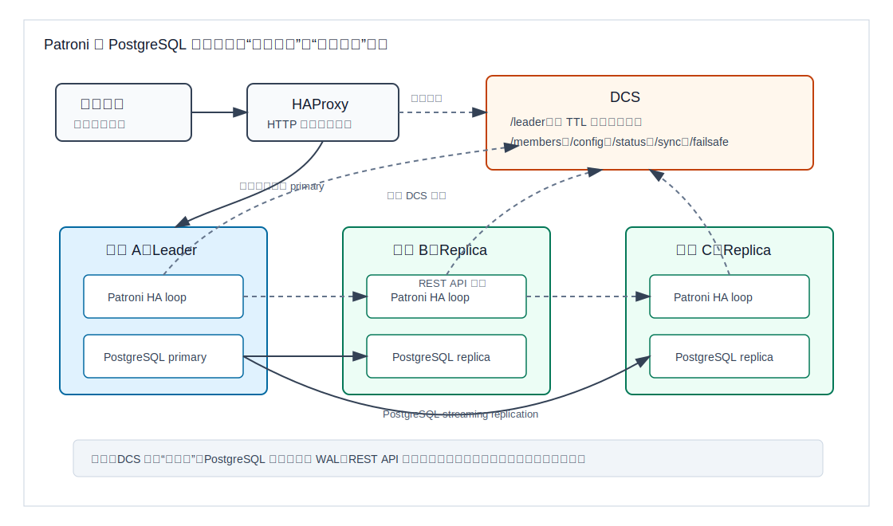
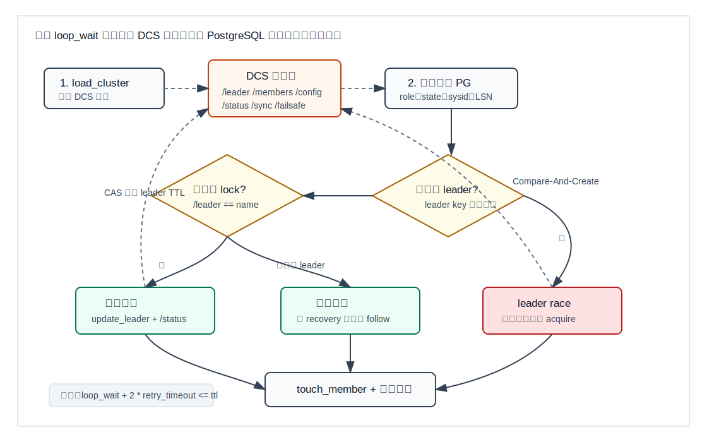
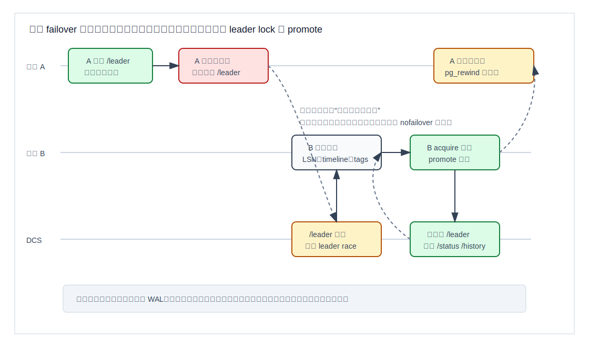
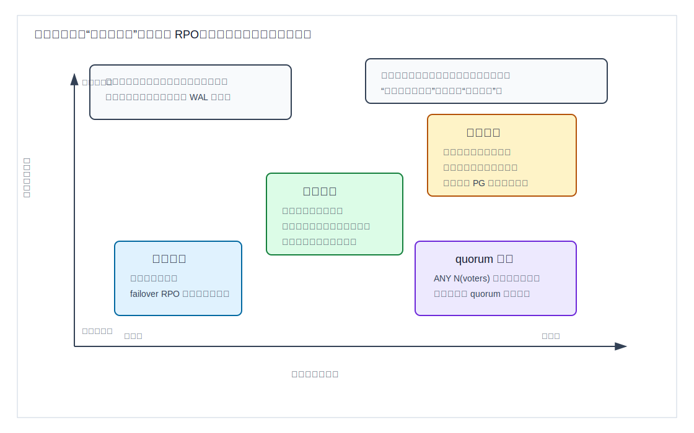

## 数据库筑基课 - PG 高可用

### 作者
digoal

### 日期
2026-06-08

### 标签
PostgreSQL , 应用开发者 , 数据库筑基课 , PG 高可用 , Patroni , DCS , 流复制 , 故障切换    

----

## 背景
  

  

这一节属于“场景实践 + 维护机制 + 复制与故障切换”的交叉主题。当前项目中未找到单独的“数据库筑基课大纲”文件，本文沿用数据库筑基课的写法：先从工程痛点出发，再拆机制、代价、边界和实操验证。

PostgreSQL 原生能力已经覆盖了 WAL、流复制、热备、同步复制、复制槽、时间线和 `pg_rewind`。但真正上线时，团队问的不是“能不能复制”，而是：

- 主库宕机后，谁来判断它真的不能继续写？
- 多个备库同时觉得自己可以接管时，谁赢？
- 旧主恢复后，怎么避免它继续以 primary 身份接收写入？
- 应用连接入口如何跟着主库移动？
- 异步复制下可能丢多少数据，同步复制下会牺牲多少写可用性？
- DCS、网络、操作系统或 Patroni 进程自身故障时，系统边界在哪里？

Patroni 的价值就在这里。它不是替代 PostgreSQL 复制，而是在 PostgreSQL 复制之上增加一个控制面：用 DCS 存储集群状态和 leader lock，用 HA loop 持续收敛本机状态，用 REST API 暴露健康状态和参与成员互探，用 HAProxy/Kubernetes Service/其他负载均衡把应用导向当前可写节点。

本文主要参考本地 Patroni 源码和文档：

- `patroni/CLAUDE.md`：仓库结构和核心模块说明。
- `patroni/README.rst`：项目定位、DCS 类型、运行样例、复制选择。
- `patroni/patroni/__main__.py`：Patroni daemon 装配、DCS 接入、主循环调度。
- `patroni/patroni/ha.py`：HA 状态机、leader lock、failover、failsafe、watchdog 交互。
- `patroni/patroni/dcs/__init__.py`：DCS 抽象、`/leader`、`/members`、`/status`、`/sync`、`/failsafe` 等键。
- `patroni/docs/replication_modes.rst`、`patroni/docs/dynamic_configuration.rst`、`patroni/docs/dcs_failsafe_mode.rst`、`patroni/docs/watchdog.rst`、`patroni/docs/rest_api.rst`。
- DeepWiki `patroni/patroni` 的 Architecture/High Availability Logic 页面用于辅助梳理结构；关键结论已回到本地源码和官方文档核对。

## 一、它解决什么问题？

PG 高可用的核心问题不是“让两个 PostgreSQL 同时存数据”，而是“在故障和不确定性下，只允许一个节点对外承诺写入”。

PostgreSQL 流复制把 WAL 从主库传到备库，但它本身不回答三个控制面问题：

1. **裁判问题**：哪个节点当前被允许当主库？
2. **切换问题**：主库不可用时，哪个备库有资格提升？
3. **路由问题**：应用、连接池、负载均衡如何知道当前可写节点是谁？

传统做法可以用人工切换、脚本、Pacemaker、repmgr、pgpool-II、Kubernetes Operator 等方式解决。Patroni 的路线是：把“裁判”外置到一个支持一致性语义的 DCS，把“执行动作”留给各节点本地 Patroni 进程，把“应用入口”交给 REST 健康检查或服务发现。

这能降低两类风险：

- **误主风险**：旧主失去 DCS leader lock 后必须停止写入，避免双主和分叉时间线。
- **误切风险**：备库不是随便提升，而是要经过复制位置、时间线、同步状态、标签、watchdog 可用性等检查。

代价也很明确：

- 集群多了 DCS 这个关键依赖，DCS 延迟、不可用或配置错误会直接影响 HA 行为。
- 高可用参数不再只是 PostgreSQL GUC，还包括 `ttl`、`loop_wait`、`retry_timeout`、`maximum_lag_on_failover`、`synchronous_mode`、`failsafe_mode`、watchdog 等。
- 自动 failover 不是“零风险按钮”。异步复制可能丢已提交但未复制的 WAL；同步复制可能把不确定性转化为写入阻塞。



图 1 说明：Patroni 没有改变 PostgreSQL 的 WAL 复制本质。它把“谁是主库、谁能提升、谁该被路由”放进控制面处理。DCS 是集群裁判，Patroni HA loop 是执行器，REST API 是状态出口，PostgreSQL streaming replication 是数据面。

## 二、它是什么？

Patroni 是一个 PostgreSQL HA 模板。README 直接强调它不是一套放之四海皆准的“即插即用复制系统”，而是一个用于构建 HA PostgreSQL 方案的模板。它支持 ZooKeeper、etcd、etcd3、Consul、Kubernetes、Exhibitor、内置 Raft 等 DCS 后端；本地 `CLAUDE.md` 也把它概括为 Python 编写的 PostgreSQL High Availability template。

从架构上看，Patroni 可以拆成六层：

| 层次 | 作用 | 本地证据 |
|---|---|---|
| DCS 层 | 保存 leader lock、成员状态、动态配置、同步复制状态 | `patroni/dcs/__init__.py` 的 `AbstractDCS`、`_LEADER`、`_MEMBERS`、`_CONFIG`、`_SYNC`、`_FAILSAFE` |
| HA 状态机 | 每个周期读取集群状态，决定 start、promote、demote、follow、rewind、noop | `patroni/ha.py` 的 `Ha.run_cycle()`、`_run_cycle()` |
| PostgreSQL 管理层 | 启停 PostgreSQL、写配置、生成 recovery 参数、执行 promote/follow | `patroni/postgresql/__init__.py`、`bootstrap.py`、`config.py`、`rewind.py` |
| REST API | 健康检查、管理操作、成员互探、failsafe 通信 | `patroni/api.py`、`docs/rest_api.rst` |
| CLI/运维层 | `patronictl list/config/edit/restart/failover/switchover/reinit` 等 | `patroni/ctl.py`、`docs/patronictl.rst` |
| 外部路由 | HAProxy、Kubernetes Service、连接池按 REST 健康检查导流 | `haproxy.cfg`、`kubernetes/`、`docs/rest_api.rst` |

一个重要定义：Patroni 里的“leader”不是抽象称号，而是 DCS 中一个有 TTL 的租约。当前节点只有在持有 `/leader` 并能在规定时间内更新它时，才被允许作为 primary 继续运行。`patroni/ha.py` 的 `update_lock()` 会调用 `dcs.update_leader()`，成功后才刷新本机 leader 过期时间并对 watchdog 发送 keepalive；DCS 抽象文档明确要求 `_update_leader()` 使用 Compare-And-Set 语义，更新失败或 DCS 不可访问时需要触发保守处理。

## 三、核心原理

### 1. 启动装配：先接入 DCS，再管理 PostgreSQL

`patroni/__main__.py` 中的 `Patroni` 类负责把系统拼起来。启动时大致做这些事：

1. 创建 DCS 客户端。
2. `ensure_dcs_access()` 循环读取 DCS，避免节点半启动。
3. `ensure_unique_name()` 用 `/liveness` 检查同名成员，防止操作员把两个节点配置成同一个名字。
4. 构造 `Postgresql`、`RestApiServer`、`Ha`。
5. 启动 REST API，进入 daemon 主循环。
6. 每个周期调用 `self.ha.run_cycle()`，再按 `dcs.loop_wait` 调度下一轮。

这说明 Patroni 的安全模型是“先有集群视图，再动 PostgreSQL”。如果 DCS 不可读，它不会乐观地启动一个可能造成双主的节点。

### 2. DCS 键：把集群状态变成可比较的数据

`patroni/dcs/__init__.py` 的 `AbstractDCS` 定义了一组关键键：

- `/leader`：当前 leader lock，必须原子创建和 CAS 更新。
- `/members/<name>`：成员发布的状态、连接地址、标签、API URL。
- `/config`：动态配置，所有节点读取并应用。
- `/status`：leader WAL LSN、永久复制槽状态、保留 slot 信息。
- `/sync`：同步复制状态，包含最新 leader、同步备库或 quorum voters。
- `/failsafe`：启用 DCS failsafe 时保存已知成员的 API 地址。
- `/history`：时间线历史。
- `/failover`：人工 failover/switchover 请求。

DCS 不是简单的配置文件，而是 Patroni 的一致性边界。`attempt_to_acquire_leader()` 必须原子创建 `/leader`；`_update_leader()` 必须用 CAS 更新 leader key；`get_cluster()` 会把 DCS 中的数据构造成 `Cluster` 对象供 `ha.py` 决策。



图 2 说明：每个 HA loop 都是一次状态收敛。先读取 DCS 和本机 PostgreSQL 状态，再判断集群是否有 leader、本机是否持有 lock、是否需要 follow/promote/demote/recover。这个 loop 的频率和容错窗口由 `loop_wait`、`retry_timeout`、`ttl` 共同决定。

### 3. 时间参数：`loop_wait + 2 * retry_timeout <= ttl`

动态配置文档要求修改 `loop_wait`、`retry_timeout`、`ttl` 时遵守：

```text
loop_wait + 2 * retry_timeout <= ttl
```

`patroni/config.py` 的 `_validate_and_adjust_timeouts()` 也会检查并调整这些值。默认值是：

```yaml
ttl: 30
loop_wait: 10
retry_timeout: 10
```

这三个值不是随便调的：

- `loop_wait` 太长：故障发现和配置收敛变慢。
- `retry_timeout` 太长：DCS 或 PostgreSQL 操作卡住时，旧主停止写入更慢。
- `ttl` 太短：短暂抖动更容易造成误切；watchdog 安全窗口也更紧。

所以 HA 参数本质是在“故障发现速度、误切概率、旧主停止写入窗口”之间取平衡。

### 4. HA 状态机：健康集群续约，不健康集群选主

`patroni/ha.py` 的 `Ha._run_cycle()` 是核心。它的主流程可以概括为：

1. 从 DCS 加载 `Cluster`，更新 `global_config`。
2. 检查 pause、watchdog、成员 key、initialize key、动态配置。
3. 如果有异步动作在执行，例如 promote、restart、copy logical slots，则先处理长动作。
4. 检查 PostgreSQL 数据目录、system identifier、运行状态。
5. 如果 PostgreSQL 不健康，尝试 recover 或释放 leader key。
6. 如果集群没有 leader，进入 `process_unhealthy_cluster()`，健康候选节点参与 leader race。
7. 如果集群有 leader，进入 `process_healthy_cluster()`，leader 续约，replica follow。
8. 最后 `touch_member()` 发布本机状态。

`is_healthiest_node()` 不是只看“谁还活着”。它会考虑：

- PostgreSQL 是否还在 starting。
- 本机是否被 `nofailover` 标签排除。
- watchdog 是否健康。
- 同步模式下本机是否属于 `/sync` 允许的候选集合。
- 复制落后是否超过 `maximum_lag_on_failover`。
- 时间线是否落后于集群已知时间线。
- failover priority、sync priority、手工 failover/switchover 请求。

这就是 Patroni 和简单脚本的差别：它把“能不能接管”编码成一组可重复的判定规则，而不是让每台机器凭本地视角猜。

### 5. 自动 failover：先失去旧租约，再获取新租约，再 promote

当旧主故障或无法更新 `/leader` 时，leader key 会过期或旧主主动 demote。备库观察到集群 unlocked 后，才会尝试 leader race。

`ha.py` 的关键路径是：

- 旧主：`update_lock()` 失败后，如果不能进入 failsafe，就 `demote('offline')`。
- 备库：`is_healthiest_node()` 通过后调用 `acquire_lock()`。
- 新主：拿到 leader lock 后，在 `enforce_primary_role()` 中激活 watchdog，执行 pre-promote 检查，调用 PostgreSQL promote。
- 旧主恢复：如果时间线分叉，需要 `pg_rewind` 或重新初始化。



图 3 说明：自动 failover 不是“主库失联就立刻把任意备库拉起”。旧租约、候选健康度、新租约、promotion、旧主回收之间有顺序。这个顺序的目标是降低双主风险，同时把异步复制下的 RPO 风险暴露给配置参数和业务决策。

### 6. 同步模式：把“可能丢数据”变成“可能暂停写”

Patroni 默认使用 PostgreSQL streaming replication 的异步模式。`docs/replication_modes.rst` 明确说，异步模式允许为了可用性丢失部分已提交事务；最坏情况下丢失窗口不只是 `maximum_lag_on_failover`，还包括最后一次采样后写入的 WAL，文档用 `ttl` 和 `loop_wait` 解释了这个窗口。

开启 Patroni `synchronous_mode` 后，Patroni 会管理 `/sync` DCS key 和 PostgreSQL 的 `synchronous_standby_names`。核心约束是：

- 能接受写事务的节点必须被记录为最新 leader。
- 被 DCS 记录为同步备库的节点，必须在 PostgreSQL 中被设置为同步备库。
- 不是最新 leader 或当前同步备库的节点，不能自动提升。

`synchronous_mode_strict` 更保守：没有合格同步副本时，不让 primary 自动关闭同步复制来保写可用，而是阻塞客户端写入。新文档还说明 Patroni 使用内部占位符 `__patroni_strict_sync_replica_placeholder__` 来避免 `*` 通配符错误满足同步要求。

`synchronous_mode: quorum` 则利用 PostgreSQL v10+ 的 quorum synchronous replication：`synchronous_standby_names = 'ANY N (...)'`。它的目标是降低单个慢副本对写延迟的影响，但选主时要证明候选节点与 quorum voter 集合有安全交集。



图 4 说明：异步、同步、严格同步、quorum 同步不是线性升级关系。异步偏可用，适合可接受小窗口 RPO 的系统；严格同步偏安全，适合把数据不确定性转化为写不可用的系统；quorum 同步试图在多副本场景降低慢副本影响。

### 7. watchdog 与 failsafe：两个不同层面的保险

watchdog 解决的是“本机不可信”问题。`docs/watchdog.rst` 说明，如果 Patroni 进程崩溃、OOM、被杀、系统高负载或 PostgreSQL 停止太慢，普通的“Patroni 主动 stop PostgreSQL”可能来不及。watchdog 通过 OS/硬件设备在没有 keepalive 时重置整机，避免 leader key 过期后旧主还继续接收写入。

failsafe 解决的是“DCS 暂时不可达但集群成员仍互通”问题。`docs/dcs_failsafe_mode.rst` 明确说，单个节点无法区分 DCS 宕机和网络分区，所以默认按最坏情况处理：leader lock 更新失败就 demote。启用 `failsafe_mode` 后，当前 primary 如果 DCS 更新失败，可以向 `/failsafe` 中的所有成员发送 `POST /failsafe`；只有所有成员都确认它仍是 primary 时，才允许继续写。

`ha.py` 的 `_handle_dcs_error()` 也体现了这个边界：如果本机是 primary，且启用 failsafe 并且 `check_failsafe_topology()` 成功，则继续作为 leader；否则主动 demote。


图 5 说明：failsafe 不能替代 DCS 共识，它只处理“DCS 不可达但所有 Patroni 成员还能互相确认”的窄场景。watchdog 也不能替代 DCS，它处理的是“本机进程或系统无法按时执行 demote”的最后保险。

## 四、横向对比

| 维度 | Patroni | repmgr | pgpool-II | Pacemaker/Corosync | Kubernetes Operator |
|---|---|---|---|---|---|
| 主要目标 | PG HA 控制面模板，DCS 驱动选主 | PG 复制管理和 failover 工具 | 连接池、负载均衡、SQL 路由、也可 HA | 通用集群资源管理 | 在 K8s 上声明式管理 PG 集群 |
| 裁判机制 | DCS leader lock，CAS/TTL | 依赖自身元数据和守护/脚本 | watchdog/health check/集群逻辑 | quorum、资源约束、STONITH | Kubernetes API/CRD/Operator reconcile |
| PG 数据复制 | 使用 PostgreSQL streaming replication | 使用 PostgreSQL streaming replication | 使用 PostgreSQL streaming replication | 通常仍依赖 PostgreSQL 复制 | 通常仍依赖 PostgreSQL 复制 |
| 应用入口 | REST 健康检查 + HAProxy/Service/连接池 | 需要外部路由配合 | 自带连接池入口 | 通常配 VIP 或负载均衡 | Service、Endpoint、Ingress 或连接池 |
| 同步复制管理 | 管理 `/sync` 与 `synchronous_standby_names` | 支持有限，更多依赖 PG 配置 | 可配合但不是核心优势 | 需要资源脚本设计 | 取决于 Operator |
| 运维复杂度 | 中等：要管 DCS、Patroni、PG 参数 | 中等：要管元数据和切换脚本 | 中高：代理层和数据库层耦合 | 高：通用 HA 配置复杂 | 中高：依赖 K8s 生态 |
| 适合场景 | 需要清晰选主边界、多 DCS 可选、希望控制路由组件 | 传统 VM/裸机场景，偏 PG 运维工具 | 需要连接池/读写分离入口且接受代理复杂度 | 已有 Pacemaker 体系和强 fencing 经验 | 已在 K8s 上运行数据库并接受 Operator 模式 |
| 不适合场景 | 不愿引入 DCS 或无法维护一致性存储 | 需要强 REST 生态和多 DCS | 不希望数据库 HA 与 SQL 代理混合 | 缺少专业集群资源管理经验 | 不适合把数据库放入 K8s 的团队 |

这张表的重点不是给出唯一答案，而是拆清楚“裁判、复制、路由、运维模型”四件事。很多争论来自把它们混在一起：例如 pgpool-II 更像入口和代理层，Patroni 更像控制面；Pacemaker 是通用资源管理器，Patroni 是 PostgreSQL 语义更强的 HA loop；Kubernetes Operator 则把 DCS、编排和配置管理进一步包装进 K8s API。

## 五、效果如何？

Patroni 的收益应该按工程指标衡量，而不是只看“能自动切换”。

| 指标 | Patroni 带来的收益 | 代价或风险 | 验证方式 |
|---|---|---|---|
| RTO | 主库不可用后，备库可在 HA loop 和 leader race 后自动提升 | 过短时间参数会增加误切；过长会增加恢复时间 | 停主库进程，记录 `/patroni`、HAProxy、应用恢复时间 |
| RPO | 异步模式通过 `maximum_lag_on_failover` 限制候选落后；同步模式降低自动 failover 丢数风险 | 异步仍可能丢最后窗口 WAL；同步会增加写延迟或暂停写 | 压测写入 + 故障注入 + 对账 |
| 防脑裂 | DCS leader lock、demote、watchdog、timeline 检查共同降低双主风险 | DCS 部署不当、watchdog 不可用、时间参数错误会削弱保障 | 网络分区演练、watchdog 演练、日志审计 |
| 运维收敛 | 动态配置集中在 `/config`，`patronictl` 和 REST API 可管理集群 | 配置层次变多，本地配置和动态配置要区分 | `patronictl show-config`、`GET /config` |
| 可观测性 | REST endpoint 提供角色、状态、LSN、复制信息、tags | 健康检查路径选错会让应用连到错误节点 | HAProxy/K8s readiness/liveness 验证 |
| 复制槽管理 | 永久复制槽、member slot TTL、逻辑 slot 复制有 Patroni 逻辑 | 逻辑复制槽 failover 仍有重复消费和 WAL 膨胀风险 | 检查 `/status`、`pg_replication_slots`、消费端 LSN |

注意：本文不提供 Patroni failover 秒级性能数字。真实 RTO/RPO 与 `loop_wait`、`ttl`、`retry_timeout`、PostgreSQL crash recovery 时间、WAL 量、DCS 延迟、负载均衡探测周期、应用重连策略都有关系。任何脱离现场配置的数字都容易误导。

## 六、实操 DEMO

下面给出两个最小验证路径。本文没有在当前机器启动完整 PostgreSQL/etcd/Patroni 集群，因此不提供伪造输出。读者应在自己的实验环境执行，并把实际日志和时间记录下来。

### DEMO 1：用 Patroni 仓库样例启动本地两节点

目标：理解 DCS、Patroni、PostgreSQL、HAProxy 的基本联动。

根据 `README.rst` 和 `postgres0.yml`，可以从不同终端启动：

```bash
cd patroni
etcd --data-dir=data/etcd --enable-v2=true
./patroni.py postgres0.yml
./patroni.py postgres1.yml
haproxy -f haproxy.cfg
```

观察入口：

```bash
curl -s http://127.0.0.1:8008/patroni
curl -s http://127.0.0.1:8009/patroni
curl -I http://127.0.0.1:8008/primary
curl -I http://127.0.0.1:8009/replica
psql --host 127.0.0.1 --port 5000 postgres
```

故障注入：

```bash
pgrep -af "postgres.*data/postgresql0"
kill -9 <postgres-or-patroni-pid>
watch -n 1 "curl -s http://127.0.0.1:8008/patroni; echo; curl -s http://127.0.0.1:8009/patroni"
```

验证点：

- 哪个节点返回 `/primary` 200？
- HAProxy 5000 端口是否跟随新主？
- `patronictl list` 中 leader 是否变化？
- 日志里是否出现 leader lock、promote、demote、rewind 或 follow 相关信息？
- 实际 RTO 与 `loop_wait`、HAProxy `inter/fall/rise` 配置是否匹配？

### DEMO 2：验证动态配置和复制模式

目标：理解异步、同步、严格同步的行为差异。

查看默认动态配置：

```bash
patronictl -c postgres0.yml show-config
```

设置异步模式下的 failover lag 门槛：

```bash
patronictl -c postgres0.yml edit-config -s maximum_lag_on_failover=1048576
```

开启同步模式：

```bash
patronictl -c postgres0.yml edit-config -s synchronous_mode=on -s synchronous_node_count=1
```

开启严格同步模式：

```bash
patronictl -c postgres0.yml edit-config -s synchronous_mode_strict=true
```

验证点：

- `GET /patroni` 中复制状态是否显示同步备库。
- primary 上 `SHOW synchronous_standby_names;` 是否由 Patroni 管理。
- 关闭同步备库时，写入是继续、阻塞，还是在下一轮 HA loop 后调整。
- 手工 failover 到非同步节点时，文档提到的数据安全边界是否被日志提示。

### DEMO 3：验证 DCS failsafe 的边界

目标：区分“DCS 失联”和“网络分区”。

启用 failsafe：

```bash
patronictl -c postgres0.yml edit-config -s failsafe_mode=true
```

确认 `/failsafe` 拓扑已经由 leader 写入 DCS，然后模拟 DCS 暂时不可达。实验时不要在生产环境直接断网，应使用隔离测试网络。

验证点：

- 当前 primary 是否向所有成员发送 `POST /failsafe`。
- 只要有一个成员不可达，primary 是否 demote。
- 如果所有成员可达但 DCS 不可达，primary 是否继续写。
- 恢复 DCS 后，集群状态是否回到正常 leader lock 续约。

## 七、最佳实践

### 面向数据库架构师

先定义业务的 RPO/RTO，再选 Patroni 参数。不要先问“默认配置能不能上生产”。默认 `ttl=30`、`loop_wait=10`、`retry_timeout=10` 是入门配置，不等于你的交易、账务、订单、分析系统都适用。

把 HA 方案拆成四张图：DCS 部署图、PostgreSQL 复制拓扑图、应用路由图、故障演练矩阵。只画 PostgreSQL 主备是不够的，因为真正决定故障行为的是 DCS quorum、网络分区、负载均衡探测和应用重连。

对强一致业务，优先评估 Patroni `synchronous_mode` 或 `synchronous_mode_strict`，但要把写阻塞作为业务行为写进 SLA。同步模式不是免费保险，它是用延迟和可用性换取更强的 failover 数据安全。

### 面向 DBA

生产环境必须做故障演练，而不是只看配置。至少覆盖：

- kill primary PostgreSQL。
- kill primary Patroni。
- 断 primary 到 DCS 的网络。
- 断 primary 到 replicas 的网络。
- DCS 少数节点故障和多数节点故障。
- replica 落后超过 `maximum_lag_on_failover`。
- 旧主恢复后是否 rewind 或 reinit。
- HAProxy/Kubernetes readiness 是否正确切流。

开启 `use_pg_rewind` 时，要确认集群初始化使用 data checksums 或配置 `wal_log_hints=on`，否则 `pg_rewind` 不具备必要前提。`postgres0.yml` 样例里 `initdb` 包含 `data-checksums`，这是一个值得保留的生产习惯。

watchdog 如果配置为 `required`，要在每台机器上验证 `/dev/watchdog` 权限、设备行为和重置窗口。不要只在配置文件里打开；没有演练过的 watchdog 可能在真正故障时变成不可解释的重启。

### 面向业务开发者

应用连接不要直接写死某台 PostgreSQL。应该通过 HAProxy、Kubernetes Service、连接池或服务发现访问当前 primary。Patroni 的 REST 健康检查能告诉负载均衡哪个节点可写，但应用仍要处理连接断开、事务失败、重试和幂等。

failover 不是无感的。一次事务可能在旧连接上失败，应用要能区分可重试错误和不可重试错误。写接口要设计幂等键或业务唯一约束，避免 failover 后重试造成重复下单、重复扣款或重复创建任务。

读写分离要谨慎。`/replica?lag=<max-lag>` 可以帮助负载均衡过滤落后副本，但业务仍要理解“刚写完马上读副本”可能读不到。对读己之写要求强的接口，要读 primary 或使用业务层一致性策略。

## 八、适合与不适合场景

适合 Patroni 的场景：

- PostgreSQL 主从复制已经是基础架构，希望增加自动选主和故障切换。
- 运行在 VM、裸机、Kubernetes 或混合环境，需要一个与编排系统解耦的 HA 控制面。
- 团队愿意维护 etcd/Consul/ZooKeeper/Kubernetes API 这类 DCS。
- 需要明确的 REST 健康检查，方便 HAProxy、Kubernetes readiness、监控系统接入。
- 能接受自动 failover 的工程边界，并愿意定期演练。

不适合或要谨慎的场景：

- 团队没有能力维护 DCS，却希望“装一个工具就高可用”。
- 业务不能接受任何写中断，但又要求强同步和跨机房复制。这是物理矛盾，不是 Patroni 参数能消除。
- 应用没有幂等、重试、连接重建能力，却要求 failover 对业务完全无感。
- DCS 与 PostgreSQL 节点部署在同一故障域，网络分区和电源故障会同时打掉裁判和选手。
- 只是单机 PostgreSQL，本质需求是备份恢复而不是自动 HA。

## 九、常见坑

1. **把 DCS 当普通配置中心**

DCS 是 leader lock 的一致性边界。把 etcd 单节点部署、和数据库同机部署、没有 quorum 监控，都会把 HA 系统变成“看起来自动，实际很脆”的系统。

2. **乱调 `ttl`、`loop_wait`、`retry_timeout`**

这三个参数必须满足 `loop_wait + 2 * retry_timeout <= ttl`。调小可以加快检测，也会放大短暂抖动造成的误切；调大可以抗抖，也会延长故障窗口。

3. **异步复制下误以为不会丢数据**

`maximum_lag_on_failover` 只是候选门槛，不是零丢失承诺。文档明确说实际丢失窗口还包括最后一次主库 WAL 位置采样后的写入。

4. **同步复制下误以为永远高可用**

同步模式为了防丢数，会把不可证明安全的场景转化为写不可用。`synchronous_mode_strict` 尤其如此。它适合不能丢的业务，不适合只看写吞吐和可用率的业务。

5. **应用入口健康检查用错路径**

`GET /primary`、`GET /leader`、`GET /replica`、`GET /readiness` 含义不同。写入口应该检查 primary/read-write；读入口要考虑 replica 状态和 lag；Kubernetes liveness 不应执行重 SQL。

6. **旧主恢复后跳过 rewind/reinit 检查**

发生 promotion 后，旧主可能位于分叉时间线。直接把它作为 replica 拉回集群，可能隐藏数据分叉风险。应通过 Patroni 的 rewind/reinitialize 流程处理。

7. **把 pause 模式当永久维护模式**

pause 会改变 Patroni 对 PostgreSQL 的管理行为，适合维护窗口，不适合作为长期状态。维护结束后要恢复自动 failover，并验证 sysid、复制槽和时间线。

8. **复制槽导致 WAL 膨胀**

Patroni 能管理永久复制槽和 member slots，但逻辑复制槽、长期离线副本、`member_slots_ttl` 配置不当仍会造成 `pg_wal` 增长。需要监控复制槽 confirmed_flush_lsn、restart_lsn 和磁盘空间。

9. **REST API 暴露不设访问控制**

REST API 不只是健康检查，还能执行 failover、restart、pause、reload 等操作。生产环境要配置认证、TLS、allowlist 或网络隔离。

10. **没有演练 DCS failsafe**

failsafe 只有在所有已知成员都可达时才允许 primary 继续写。它不是“DCS 挂了也没事”的万能开关；如果成员不可达，primary 仍应 demote。

## 十、扩展问题

1. 如果你的业务 RPO 必须为 0，应该选 `synchronous_mode`、`synchronous_mode_strict`，还是应用层双写/事务外盒？为什么？
2. `ttl=30`、`loop_wait=10`、HAProxy `fall=3 inter=3s` 时，应用感知 failover 的上界可能由哪几个环节共同决定？
3. 如果 DCS 和 PostgreSQL 节点在同一个机架，故障域设计有什么问题？
4. 为什么 Patroni 在 DCS 不可达时默认 demote primary，而不是乐观继续写？
5. 如果一个 replica 落后 100MB，但业务写入量很低，它是否一定不能提升？应该看哪些配置和实时指标？
6. 逻辑复制槽 failover 为什么比物理复制槽更难？消费端如何避免重复消费？
7. Kubernetes 环境中，使用 Kubernetes API 作为 DCS 与使用外部 etcd 作为 DCS，故障模式有什么不同？

## 十一、扩展阅读

- Patroni README：`patroni/README.rst`
- Patroni 架构入口与本地仓库说明：`patroni/CLAUDE.md`
- HA 状态机源码：`patroni/patroni/ha.py`
- Daemon 主循环与装配：`patroni/patroni/__main__.py`
- DCS 抽象与集群键：`patroni/patroni/dcs/__init__.py`
- PostgreSQL 生命周期管理：`patroni/patroni/postgresql/__init__.py`
- 同步复制管理：`patroni/patroni/postgresql/sync.py`
- 动态配置文档：`patroni/docs/dynamic_configuration.rst`
- 复制模式文档：`patroni/docs/replication_modes.rst`
- DCS failsafe 文档：`patroni/docs/dcs_failsafe_mode.rst`
- Watchdog 文档：`patroni/docs/watchdog.rst`
- REST API 文档：`patroni/docs/rest_api.rst`
- 样例配置：`patroni/postgres0.yml`、`patroni/haproxy.cfg`、`patroni/docker-compose.yml`
- DeepWiki：`patroni/patroni` 的 `Architecture`、`High Availability Logic`、`DCS Architecture` 页面。本文使用 DeepWiki 做结构辅助，关键机制均以本地源码和官方文档为准。
  
## 附录 
1、克隆代码  
```  
git clone --depth 1 https://github.com/patroni/patroni
```  
  
2、启用 codex, 使用 [数据库筑基课 skill](../skills/README.md).  
```
文章标题: 
  数据库筑基课 - PG 高可用
项目源码(本地目录): 
  patroni
项目 codebase 文件名: 
  patroni/CLAUDE.md 
开源项目相关的 deepwiki repoName: 
  patroni/patroni
```
   
  
#### [PostgreSQL 解决方案集合](../201706/20170601_02.md "40cff096e9ed7122c512b35d8561d9c8")
  
  
#### [德哥 / digoal's Github - 公益是一辈子的事.](https://github.com/digoal/blog/blob/master/README.md "22709685feb7cab07d30f30387f0a9ae")
  
  
#### [About 德哥](https://github.com/digoal/blog/blob/master/me/readme.md "a37735981e7704886ffd590565582dd0")
  
  

  
