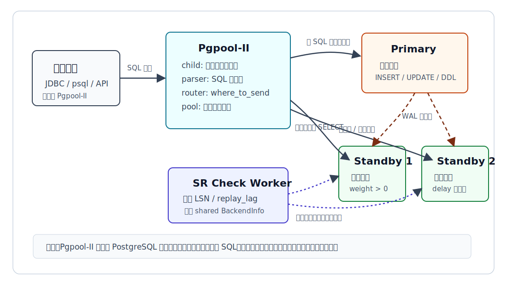
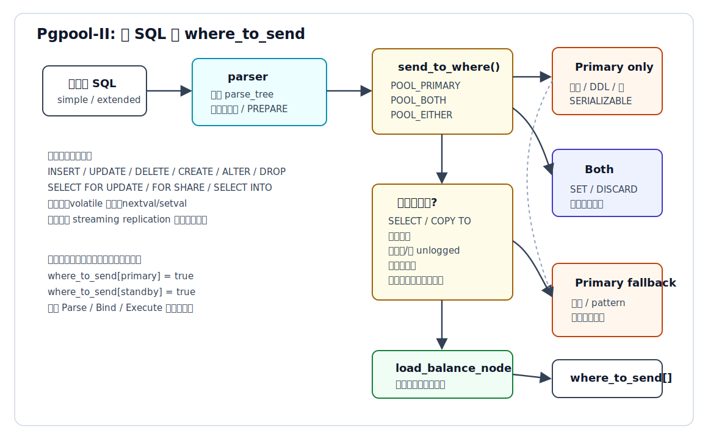
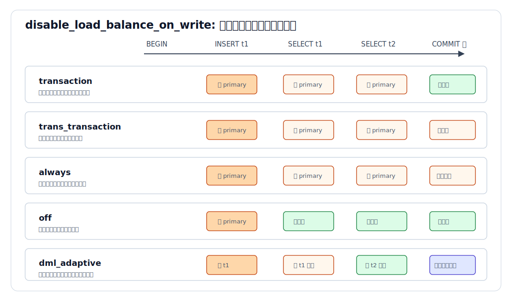
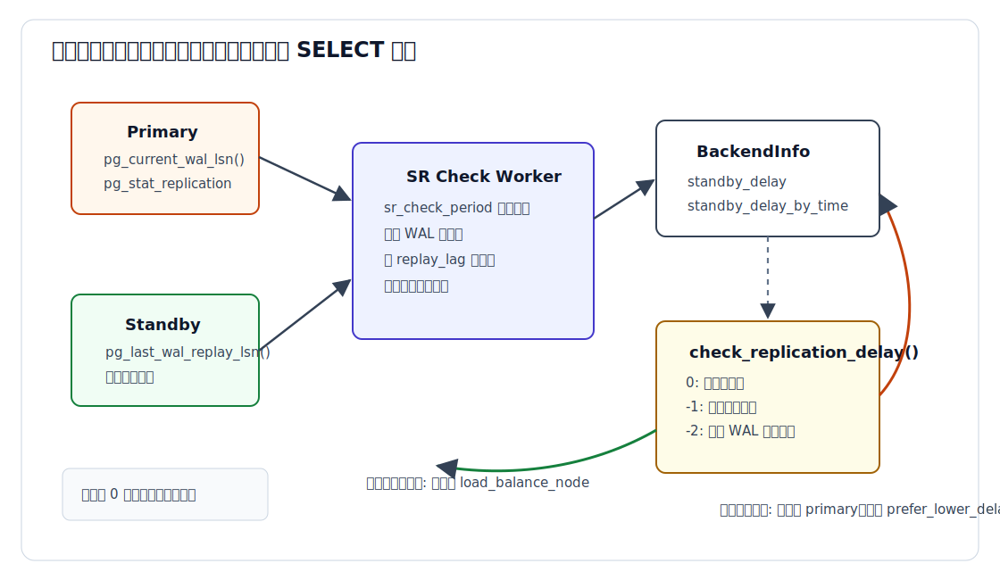
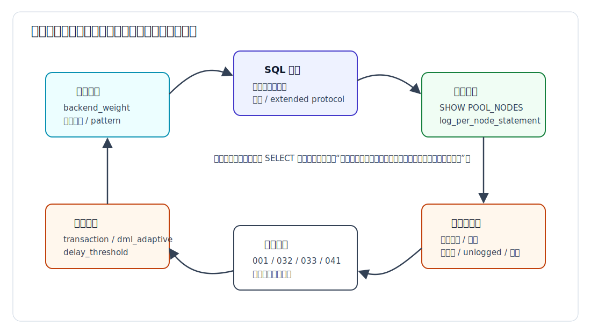

## 数据库筑基课 - PG 读写分离

### 作者
digoal

### 日期
2026-06-08

### 标签
PostgreSQL , 应用开发者 , 数据库筑基课 , Pgpool-II , 读写分离 , 流复制 , 负载均衡    

----

## 背景
  


这一节属于“场景实践 + 查询路由 + 高可用架构”的交叉主题。很多团队把 PostgreSQL 主库接入业务以后，很快会遇到一个朴素问题：写入必须落主库，但报表、列表页、查询接口、巡检任务、后台运营系统也都压在同一个主库上。主库 CPU、连接数、IO、锁等待和缓存命中率被读流量消耗，写入延迟开始抖动。

PostgreSQL 自带 streaming replication，可以让 standby 承担读请求。但“有备库”不等于“业务已经安全读写分离”。应用层自己拆两个连接串，需要每个服务都理解主备角色、事务边界、复制延迟、故障切换和特殊 SQL。Pgpool-II 的价值在这里：它作为 PostgreSQL 协议代理，把客户端连接集中到一个入口，在代理层判断一条 SQL 应该发往 primary、standby，还是发给多个节点。

本文以本地 `pgpool2` 源码和文档为主，DeepWiki `pgpool/pgpool2` 只用于辅助理解项目结构和页面目录。关键结论回到本地官方文档与源码验证，包括：

- `pgpool2/doc/src/sgml/loadbalance.sgml`
- `pgpool2/doc/src/sgml/stream-check.sgml`
- `pgpool2/src/context/pool_query_context.c`
- `pgpool2/src/protocol/pool_pg_utils.c`
- `pgpool2/src/streaming_replication/pool_worker_child.c`
- `pgpool2/src/utils/pool_select_walker.c`
- `pgpool2/src/sample/pgpool.conf.sample-stream`

当前项目中没有发现单独的“数据库筑基课总纲”文件，本文沿用既有 `markdown/database-foundation-oracle-compatibility.md` 的文章输出风格与文件组织方式。

## 一、它解决什么问题？

PG 读写分离解决的是“读流量和写流量共享同一主库瓶颈”的问题，但它并不是一个纯性能开关。它同时解决和引入以下工程问题：

1. 读扩展：把符合条件的只读 SQL 发到 standby，让 primary 更专注于写入、事务提交、WAL 生成和复制发送。
2. 入口统一：业务仍连接 Pgpool-II，而不是在应用中到处维护 primary/standby 连接串。
3. 主备角色感知：写入、DDL、锁、写函数、事务内写后读等必须回 primary。
4. 延迟规避：standby 如果复制延迟过大，继续把读请求发过去可能产生旧读，需要回 primary 或选择低延迟 standby。
5. 运维可观测：需要能回答“这条 SQL 实际去了哪个节点、为什么去了那个节点、什么时候应该改变策略”。

代价也很明确：

- 它不能消除 streaming replication 的异步延迟，除非底层复制和提交策略已经满足业务一致性要求。
- 它依赖 SQL 解析和规则判断，遇到函数、临时表、unlogged table、系统目录、prepared statement、多语句、事务隔离级别时会变复杂。
- 它把一部分业务正确性问题转移到 Pgpool-II 配置、日志、回归测试和运行时监控上。



图 1 说明：Pgpool-II 不复制数据，也不替代 PostgreSQL 的 primary/standby 机制。它站在客户端和 PostgreSQL 集群之间，解析 SQL、维护会话状态、选择负载均衡节点，并根据复制延迟反馈调整 SELECT 的目标后端。

## 二、它是什么？

在本文语境中，PG 读写分离指的是：在 PostgreSQL streaming replication 集群中，由 Pgpool-II 接收客户端 SQL，根据 SQL 类型、事务状态、函数属性、对象类型、配置规则、节点权重、primary/standby 角色和复制延迟，把写请求发往 primary，把满足条件的只读请求发往 primary 或 standby。

这里有三个层次要分清：

| 层次 | 谁负责 | 关键问题 |
|---|---|---|
| 物理复制 | PostgreSQL streaming replication | primary 的 WAL 如何传到 standby，standby 是否可 Hot Standby 查询 |
| SQL 路由 | Pgpool-II | 一条 SQL 是否可以去 standby，还是必须回 primary |
| 业务一致性 | 应用 + 数据库配置 + Pgpool-II 策略 | 写后马上读是否必须看到最新值，旧读可接受到什么程度 |

Pgpool-II 文档明确说明，load balancing 主要处理 SELECT 查询，raw mode 之外的多种集群模式都可使用；默认情况下负载均衡节点在会话开始时选择，开启 `statement_level_load_balance` 后可以按语句重新选择。`src/context/pool_session_context.c` 也能看到，初始化会话时如果开启 `load_balance_mode`，会调用 `select_load_balancing_node()` 并把结果保存为 `session_context->load_balance_node_id`。

因此，读写分离不是“所有 SELECT 都去备库”。更准确地说，它是“有条件的 SELECT 分流 + 保守的主库回退 + 可配置的一致性策略”。

## 三、核心原理

### 1. 会话先选负载均衡节点，必要时每条语句重选

`select_load_balancing_node()` 是 Pgpool-II 选择读节点的关键函数，位于 `src/protocol/pool_pg_utils.c`。它会综合：

- `backend_weightN`：后端节点权重。
- `user_redirect_preference_list`：按用户偏好路由。
- `database_redirect_preference_list`：按数据库偏好路由。
- `app_name_redirect_preference_list`：按客户端 application_name 偏好路由。
- `prefer_lower_delay_standby`：在候选 standby 延迟过大时选择低延迟 standby。

优先级方面，官方文档说明 `app_name_redirect_preference_list > database_redirect_preference_list > user_redirect_preference_list`。源码中也能看到先检查 user，再 database 覆盖 user，最后 application_name 覆盖前两者。

默认的会话级选择适合短连接或连接生命周期较短的业务。如果应用层连接池长期持有连接，同一个会话可能长期固定到某个 standby，读流量分布不均。此时可以开启：

```conf
statement_level_load_balance = on
```

源码 `set_load_balance_info()` 中能看到，开启后每条可负载均衡 SQL 都会重新调用 `select_load_balancing_node()`。代价是某些事务控制、SET、DISCARD、SAVEPOINT 类命令可能会发到更多 standby，远端 standby 网络延迟会放大这类命令的耗时。

### 2. 一条 SQL 先被分成 primary、both、either 三类

Pgpool-II 的核心路由入口是 `pool_where_to_send()`，位于 `src/context/pool_query_context.c`。这个函数先清空 `query_context->where_to_send[]`，再按运行模式处理：

- raw mode：只发主节点。
- streaming replication / logical replication：进入 `where_to_send_main_replica()`。
- native replication / snapshot isolation：进入对应复制模式逻辑。

在 streaming replication 下，`send_to_where()` 会根据 parse tree 做第一轮语法分类：

| 分类 | 典型 SQL | 目标 |
|---|---|---|
| `POOL_PRIMARY` | `INSERT`、`UPDATE`、`DELETE`、`CREATE`、`ALTER`、`DROP`、`SELECT FOR UPDATE`、`SELECT INTO`、2PC、`VACUUM`、写函数 | primary |
| `POOL_BOTH` | `SET`、`DISCARD`、`DEALLOCATE ALL`、`SAVEPOINT`、部分事务控制命令 | primary + standby |
| `POOL_EITHER` | 普通 `SELECT`、`COPY TO STDOUT`、普通 `EXPLAIN`、普通 `SHOW` | 继续做负载均衡条件检查 |

如果 SQL 是多语句，源码注释给了典型风险：`BEGIN;DELETE FROM table;END` 这类语句如果只看第一段，很容易把后面的写入误送 standby。因此在 streaming replication 下，多语句会保守发 primary。



图 2 说明：Pgpool-II 的输出不是一个抽象结论，而是 `where_to_send[]` 目标位图。后续协议处理会根据这个位图把消息发给对应后端，并等待这些后端响应。

### 3. 普通 SELECT 还要经过一组“不能去 standby”的检查

即使 `send_to_where()` 初步认为 SQL 是 `POOL_EITHER`，`where_to_send_main_replica()` 还会继续判断是否真正可负载均衡。典型条件包括：

- `load_balance_mode = on`。
- SQL 是 `is_select_query()` 认可的只读查询。
- PostgreSQL 协议版本是 v3。
- 不在已经写过的事务里，或当前事务未失败，且事务隔离级别不是 SERIALIZABLE。
- 不访问系统目录。源码特别说明，访问 `pg_class` 等系统目录时，因为可能涉及临时表、元数据延迟等，倾向发 primary。
- 不访问临时表。临时表不在 standby 上复制。
- 不访问 unlogged table。unlogged table 不写 WAL，也不能按普通流复制假设处理。
- 不匹配 `primary_routing_query_pattern_list`。
- 不包含写函数或被视为 volatile 的函数。
- `dml_adaptive` 模式下，不读取本事务已经写过的对象或其配置依赖对象。
- 负载均衡目标 standby 的复制延迟没有超过阈值。

函数判断由 `src/utils/pool_select_walker.c` 完成。`pool_has_function_call()` 会检查函数调用：

- 如果 `read_only_function_list` 和 `write_function_list` 都为空，则查询 PostgreSQL 系统目录中的函数 volatility，volatile 函数被视为写函数。
- 如果配置了 `read_only_function_list`，不在白名单里的函数会被视为写函数。
- 如果配置了 `write_function_list`，命中名单的函数会被视为写函数。

这解释了为什么 `SELECT nextval('seq')` 不能简单当成只读查询。它语法上是 SELECT，但语义上改变了数据库状态或会话相关状态。

### 4. 写后读策略由 `disable_load_balance_on_write` 控制

最容易出生产事故的是“刚写完马上读”。在异步流复制下，primary 已经提交，standby 可能还没 replay 到对应 WAL。业务如果马上从 standby 读同一行，就可能读到旧值。

Pgpool-II 用 `disable_load_balance_on_write` 控制写后读行为。官方配置样例和文档给出五种典型值：

| 值 | 行为 | 适合场景 | 代价 |
|---|---|---|---|
| `transaction` | 显式事务内一旦出现写入，后续读回 primary，直到事务结束 | 大多数业务的起点配置，默认值 | 事务内读分流减少 |
| `trans_transaction` | 当前显式事务和后续显式事务都不再分流，直到会话结束 | 老应用、事务边界不清晰 | 更少读分流 |
| `always` | 会话中出现写入后，后续读一直回 primary | 最高兼容性 | 读扩展收益最低 |
| `off` | 写后读仍可负载均衡 | 底层同步提交已保证可见性，或业务允许旧读 | 旧读风险最高 |
| `dml_adaptive` | 只追踪当前事务写过的表及依赖对象，读这些对象回 primary，读无关对象仍可分流 | 希望在一致性和吞吐之间更细粒度折中 | 依赖对象需要配置和测试 |

源码上，普通模式会设置 `writing_transaction` 标志；`dml_adaptive` 则更细：`dml_adaptive()` 会在显式事务开始时清空 `transaction_temp_write_list`，遇到非 SELECT 写入时把涉及的 `RangeVar` 加入列表，读 SELECT 时通过 `is_select_object_in_temp_write_list()` 判断是否应该回 primary。`dml_adaptive_object_relationship_list` 用来补充触发器、函数、视图等依赖关系，例如 `t1:t2` 表示写 `t1` 后，读 `t2` 也不应分流。



图 3 说明：`transaction` 是较稳妥的默认起点；`off` 追求吞吐但可能旧读；`always` 追求兼容但牺牲读扩展；`dml_adaptive` 用对象追踪减少不必要的主库回退，但需要你准确描述对象依赖。

### 5. extended protocol 要让 Parse、Bind、Execute 保持一致

很多应用通过 JDBC、libpq prepared statement 或 ORM 使用 PostgreSQL extended query protocol。此时 SQL 不是一次性 `Query` 消息，而是 `Parse -> Bind -> Execute`。

Pgpool-II 文档说明，extended protocol 中在 Parse 阶段就会判断是否能发 standby。后续 Bind、Describe、Execute 要继承同一个目标。源码中的 `where_to_send_deallocate()`、`pool_pending_message_dest_set()`、`pool_pending_message_query_context_dest_set()` 都在维护这种关系。

有一个重要边界：如果一个 SELECT 的 Parse 先被负载均衡到 standby，随后事务里出现 DML，后续执行这个 SELECT 需要回 primary。源码 `parse_before_bind()` 会在必要时把 Parse 消息补发到 primary，避免 Bind/Execute 目标和已解析 statement 所在节点不一致。

这也是为什么只用“SQL 文本开头是不是 SELECT”理解读写分离是不够的。协议状态、prepared statement 名称、事务写入历史都会影响最终路由。

### 6. 复制延迟会把读流量从 standby 拉回 primary 或低延迟 standby

在 streaming replication 下，Pgpool-II 有独立 worker 周期检查复制延迟。`doc/src/sgml/stream-check.sgml` 说明：

- `sr_check_period` 控制检查周期。
- `delay_threshold` 用 WAL 字节差作为阈值。
- `delay_threshold_by_time` 用时间延迟作为阈值，默认单位毫秒；大于 0 时优先于 `delay_threshold`。
- PostgreSQL 10 及以后可从 `pg_stat_replication.replay_lag` 获取时间延迟。
- `backend_application_nameN` 需要和 standby `primary_conninfo` 中的 `application_name` 匹配。
- `prefer_lower_delay_standby` 开启后，候选 standby 延迟超阈值时，尽量选择低延迟 standby，而不是直接回 primary。
- `replication_delay_source_cmd` 可用外部命令提供延迟，适合 Aurora 等内置查询不够合适的环境。

源码 `check_replication_time_lag()` 会在 primary 上取 `pg_current_wal_lsn()`，在 standby 上取 `pg_last_wal_replay_lsn()`，也会读 `pg_stat_replication` 中的状态和 replay lag。结果写入共享的 `BackendInfo.standby_delay`。路由时，`check_replication_delay()` 根据阈值返回：

- `0`：没有超过阈值，或不是 streaming replication，或阈值未启用。
- `-1`：超过 `delay_threshold_by_time`。
- `-2`：超过 `delay_threshold`。



图 4 说明：复制延迟不是单纯展示给 DBA 的指标。它进入 `check_replication_delay()`，直接影响普通 SELECT 是否继续发到 standby。如果所有 standby 延迟都不可接受，保守路径是回 primary。

## 四、横向对比

| 维度 | Pgpool-II 代理层读写分离 | 应用层手写读写分离 | PostgreSQL 单 primary |
|---|---|---|---|
| 主要目标 | 统一入口下做 SQL 路由和连接池 | 应用自己选择读写连接 | 简单可靠，所有请求走主库 |
| 写入路径 | primary | primary 连接 | primary |
| 读取路径 | Pgpool-II 按规则选择 primary/standby | 应用按业务代码选择 | primary |
| 事务写后读 | 由 `disable_load_balance_on_write` 控制 | 应用自己保证 | 天然读到主库状态 |
| 复制延迟处理 | `delay_threshold` / `delay_threshold_by_time` / `prefer_lower_delay_standby` | 应用或中间件自行实现 | 不涉及 |
| SQL 语义识别 | Pgpool-II parser + walker + 规则 | 取决于应用代码质量 | 不需要识别 |
| 故障切换感知 | 可配合 health check、failover、PCP、watchdog | 应用需要刷新拓扑 | 主库故障直接影响业务 |
| 运维复杂度 | 中等，需要配置、日志、回归和监控 | 分散在每个服务 | 最低 |
| 适合场景 | 多服务统一入口、希望减少应用改造、读流量明显 | 少数核心服务可精细控制一致性 | 写多读少、规模小、一致性优先 |
| 不适合场景 | 大量 SQL 无法被规则准确识别，或旧读绝对不可接受 | 服务多且团队难以统一规范 | 主库读压力已经明显瓶颈 |

这张表背后的核心差异是“谁承担路由正确性”。Pgpool-II 把路由集中到代理层，减少应用改造，但你必须理解它的保守回退规则。应用层手写可以做到更业务化，例如某些接口必须读主、某些接口允许读旧数据，但规则分散，长期维护成本高。

## 五、效果如何？

不要用“读写分离能提升多少倍”来评估 Pgpool-II。它的效果取决于四个变量：

1. 可分流 SELECT 占比。如果大量查询包含写函数、访问临时表、在写事务后读取、匹配主库 pattern，真正走 standby 的比例会下降。
2. standby 数量和权重。如果只有一个 standby，读扩展上限和故障余量都有限。
3. 复制延迟。如果业务要求读新值，很多读请求会因为阈值或写后读策略回 primary。
4. 代理层开销。SQL 解析、函数属性判断、系统目录查询、relcache、日志和连接池管理都有成本。

Pgpool-II 的收益通常体现在：

- primary 读压力下降。
- 多个 standby 的 CPU/IO 能被利用。
- 业务连接入口统一，故障切换和拓扑变化对应用更透明。
- 通过 `SHOW POOL_NODES`、PCP、日志可以观察每个节点的 `select_cnt`、`load_balance_node`、`replication_delay`、`role`。

代价体现在：

- SQL 路由规则需要持续回归，尤其是 ORM、prepared statement、多语句和函数调用。
- `primary_routing_query_pattern_list`、函数 volatility 查询、系统目录/临时表识别可能带来额外开销。官方文档还提示，使用 SQL pattern 路由时，具体 pattern 可能带来约 1% 到 2% 的性能下降。
- standby 不是强一致读副本。除非底层提交和复制策略保证可见性，否则旧读风险必须显式纳入设计。

## 六、实操 DEMO

下面给出一个最小验证路径。本文没有在本机启动 PostgreSQL/Pgpool-II 集群执行这些命令，因此不提供伪造输出。读者可以在已安装 PostgreSQL 与 Pgpool-II 的测试环境中执行，并以实际 `SHOW POOL_NODES` 和 `pgpool.log` 为准。

### 1. 最小配置片段

假设 node 0 是 primary，node 1 是 standby：

```conf
backend_clustering_mode = streaming_replication

backend_hostname0 = '127.0.0.1'
backend_port0 = 5432
backend_weight0 = 0
backend_data_directory0 = '/data/pg0'
backend_application_name0 = 'server0'

backend_hostname1 = '127.0.0.1'
backend_port1 = 5433
backend_weight1 = 1
backend_data_directory1 = '/data/pg1'
backend_application_name1 = 'server1'

load_balance_mode = on
log_per_node_statement = on
notice_per_node_statement = on

write_function_list = 'nextval,setval,lastval,currval'
primary_routing_query_pattern_list = ''
disable_load_balance_on_write = transaction
statement_level_load_balance = off

sr_check_period = 1
sr_check_user = 'sr_check'
sr_check_database = 'postgres'
delay_threshold_by_time = 1000
prefer_lower_delay_standby = off
log_standby_delay = 'if_over_threshold'
```

验证点：

- `backend_weight0 = 0`、`backend_weight1 = 1` 用于让普通可分流 SELECT 更容易落到 standby，方便观察。
- `log_per_node_statement = on` 用于在日志中看到每条 SQL 的目标节点。
- `delay_threshold_by_time = 1000` 表示 standby 延迟超过 1000 毫秒时，普通 SELECT 不应继续发到该 standby。

### 2. SQL 验证样本

```sql
SHOW POOL_NODES;

CREATE TABLE rw_demo (
    id integer PRIMARY KEY,
    note text
);

INSERT INTO rw_demo VALUES (1, 'from primary');

-- 普通 SELECT，复制追上且规则允许时应可走 standby。
SELECT * FROM rw_demo WHERE id = 1;

-- 写函数不应当按普通只读 SELECT 分流。
CREATE SEQUENCE rw_demo_seq;
SELECT nextval('rw_demo_seq');

-- 显式事务内写后读，默认 transaction 策略下后续读应回 primary。
BEGIN;
INSERT INTO rw_demo VALUES (2, 'read after write');
SELECT * FROM rw_demo WHERE id = 2;
COMMIT;

SHOW POOL_NODES;
```

验证方式：

- 看 `SHOW POOL_NODES` 中的 `role`、`load_balance_node`、`select_cnt`、`replication_delay`。
- 看 `pgpool.log` 中每条 SQL 的 `DB node id`。
- 把 `disable_load_balance_on_write` 改为 `off`、`always`、`dml_adaptive`，重复事务样本，比较路由变化。
- 暂停 standby replay 或制造复制延迟后，观察 `delay_threshold_by_time` 是否把 SELECT 拉回 primary。

Pgpool-II 自带回归测试给了更完整样例：

- `src/test/regression/tests/001.load_balance/test.sh`：基础 load balance、函数列表、primary routing pattern、statement-level load balance。
- `src/test/regression/tests/032.dml_adaptive_load_balance/test.sh`：`dml_adaptive` 下写过的表回 primary，无关表继续分流。
- `src/test/regression/tests/033.prefer_lower_standby_delay/test.sh`：standby 延迟过阈值时回 primary，或选择低延迟 standby。
- `src/test/regression/tests/041.external_replication_delay/test.sh`：外部命令提供复制延迟。

## 七、最佳实践

### 面向数据库架构师

先定义业务一致性等级，再选参数。不要先问“能不能所有读都去备库”，先把接口分成三类：

| 类型 | 一致性要求 | 推荐路由策略 |
|---|---|---|
| 交易确认、支付、库存扣减后查询 | 必须读到刚写入结果 | 明确读 primary，或使用默认 `transaction` / 更保守策略 |
| 用户列表、搜索、报表、运营后台 | 可接受秒级旧读 | 允许 standby，设置延迟阈值 |
| 监控巡检、统计任务 | 可接受更大延迟 | 可给独立 app/user/database redirect 规则 |

应用如果已经使用连接池，优先评估 `statement_level_load_balance`。长会话固定一个 standby 时，流量可能不均；但开启按语句选择后，要验证事务控制命令在远端 standby 上的额外延迟。

不要用正则 pattern 代替系统设计。`primary_routing_query_pattern_list` 适合兜底少数 SQL，不适合承载大规模业务规则。业务强一致接口最好在应用层明确使用主库语义，或单独 application_name/user/database 路由到 primary。

### 面向 DBA

把 `SHOW POOL_NODES` 和每节点 SQL 日志纳入上线验收。至少要能看到：

- primary/standby 角色是否正确。
- `load_balance_node` 是否符合权重和偏好配置。
- `select_cnt` 是否随压测增长。
- `replication_delay` 是否符合阈值策略。
- standby 延迟超过阈值时 SQL 是否回 primary。

配置 `sr_check_user` 时，不要只关注密码能否登录。官方文档要求该用户在所有 PostgreSQL 后端存在，并且需要 superuser 或 `pg_monitor` 权限组来读取必要复制状态。`delay_threshold_by_time` 依赖 PostgreSQL 10 及以后 `pg_stat_replication.replay_lag`，同时依赖 `backend_application_name` 与 standby `primary_conninfo` 中的 `application_name` 匹配。

对临时表、unlogged table、系统目录查询要保守。Pgpool-II 默认通过 walker 检查这些对象，但业务不要把这当成万能证明。上线前要把 ORM 生成 SQL、迁移脚本、批处理 SQL 都纳入样本。

### 面向业务开发者

把“读请求”拆成“可旧读”和“不可旧读”。不要因为 SQL 以 SELECT 开头，就默认可以走 standby。

以下 SQL 应特别标记和测试：

- `SELECT nextval(...)`、`setval(...)`、自定义写函数。
- `SELECT ... FOR UPDATE`、`FOR SHARE`。
- `SELECT INTO`。
- `WITH` 中含 DML。
- 多语句 SQL。
- 显式事务内写后读。
- 临时表、unlogged table、系统目录查询。
- prepared statement 在事务中跨读写复用。

如果业务使用 ORM，建议在压测环境打开 `log_per_node_statement`，用真实流量样本观察路由结果，而不是只用手写 SQL 判断。

## 八、适合与不适合场景

### 适合

- 读多写少，且大量读请求可接受短暂复制延迟。
- 业务希望保留单一数据库入口，减少应用层主备拓扑感知。
- 已经有 PostgreSQL streaming replication 和 standby 查询能力。
- 团队愿意维护 Pgpool-II 配置、日志、回归测试和 failover 流程。
- 报表、后台列表、搜索、异步任务等读流量明显消耗 primary 资源。

### 不适合

- 绝大多数读都是写后立即读，且必须强一致。
- 业务大量使用无法准确分类的动态 SQL、多语句 SQL、复杂函数副作用。
- standby 经常大幅延迟，或没有可靠的复制延迟观测。
- 团队没有能力维护代理层高可用、故障切换和配置回归。
- 只是想“无脑把所有 SELECT 发到备库”，不愿接受主库回退和旧读边界。

## 九、常见坑

1. 把读写分离理解成“SELECT 都走备库”。Pgpool-II 会把很多 SELECT 发回 primary，包括写函数、锁定读、临时表、unlogged table、系统目录、复制延迟过大、写事务后的读。

2. 忽略 JDBC autocommit。官方文档提醒，如果 JDBC autocommit 为 false，驱动可能自动发送 `BEGIN` 和 `COMMIT`，于是显式事务限制会生效。

3. 忽略函数 volatility。`read_only_function_list` 和 `write_function_list` 都为空时，Pgpool-II 会检查函数 volatility；volatile 函数被视为写函数。自定义函数如果声明不准，会影响路由。

4. 把 `disable_load_balance_on_write = off` 当性能优化。它确实能提高分流比例，但写后读旧值的风险最大。只有在业务允许旧读，或底层同步提交策略足够强时才应考虑。

5. `dml_adaptive` 只追踪它知道的对象。触发器、函数、视图、依赖表需要通过 `dml_adaptive_object_relationship_list` 补充，否则可能误分流。

6. 忽略 prepared statement 补发。Parse 可能先在 standby 上完成，事务后续写入又要求 Execute 回 primary。Pgpool-II 有补发机制，但这也说明 extended protocol 必须作为独立场景压测。

7. 复制延迟阈值为 0 等于不启用延迟避让。很多测试环境默认值看起来“没问题”，是因为没有真的打开阈值。

8. `backend_application_name` 不匹配导致时间延迟观测不准。`delay_threshold_by_time` 依赖 `pg_stat_replication.replay_lag` 和 application_name 匹配。

9. 只看业务结果，不看路由日志。读写分离上线必须回答 SQL 实际去了哪个节点，不能只看 SQL 返回成功。

10. 忽略 failover 后权重和角色变化。primary 切换后，`PRIMARY_NODE_ID`、`REAL_PRIMARY_NODE_ID`、`load_balance_node` 都会变化，必须通过 `SHOW POOL_NODES` 和回归测试验证。

## 十、扩展问题

1. 你的业务里，哪些 SELECT 必须读到刚写入的数据？这些 SQL 是否应该显式主库路由？

2. 你的 standby 延迟是用 WAL 字节差评估，还是用时间延迟评估？哪个更符合业务体验？

3. 如果应用连接池持有长连接，会话级负载均衡是否会让读流量偏向少数 standby？

4. 自定义函数是否正确声明了 volatility？是否需要配置 `write_function_list` 或 `read_only_function_list`？

5. 读写分离故障时，你希望系统优先保持正确性、可用性，还是读吞吐？

## 十一、扩展阅读

- Pgpool-II load balancing 官方文档：`pgpool2/doc/src/sgml/loadbalance.sgml`。用于确认负载均衡条件、streaming replication 下的 SQL 分类、函数列表、redirect preference、`disable_load_balance_on_write`、`statement_level_load_balance`。
- Pgpool-II streaming replication check 文档：`pgpool2/doc/src/sgml/stream-check.sgml`。用于确认 `sr_check_period`、`sr_check_user`、`delay_threshold`、`delay_threshold_by_time`、`prefer_lower_delay_standby`、外部复制延迟命令。
- Pgpool-II 配置样例：`pgpool2/src/sample/pgpool.conf.sample-stream`。用于确认 streaming replication、load balancing、写后读、延迟阈值等配置项。
- 查询路由源码：`pgpool2/src/context/pool_query_context.c`。重点函数包括 `pool_where_to_send()`、`send_to_where()`、`where_to_send_main_replica()`、`dml_adaptive()`、`is_select_object_in_temp_write_list()`。
- 负载均衡节点选择源码：`pgpool2/src/protocol/pool_pg_utils.c`。重点函数包括 `select_load_balancing_node()` 与 `check_replication_delay()`。
- 复制延迟 worker：`pgpool2/src/streaming_replication/pool_worker_child.c`。用于确认 LSN/replay_lag 采集、`BackendInfo.standby_delay` 写入、外部延迟命令处理。
- SQL walker：`pgpool2/src/utils/pool_select_walker.c`。用于确认函数调用、系统目录、临时表、unlogged table、pattern 匹配等判断。
- 协议处理源码：`pgpool2/src/protocol/pool_proto_modules.c`。用于确认 Parse/Bind/Execute、prepared statement 补发、写事务标记等行为。
- 回归测试：`pgpool2/src/test/regression/tests/001.load_balance/test.sh`、`032.dml_adaptive_load_balance/test.sh`、`033.prefer_lower_standby_delay/test.sh`、`041.external_replication_delay/test.sh`。
- DeepWiki：`pgpool/pgpool2` 的 Overview、Query Processing、Load Balancing、Configuration 页面。本文只用它辅助梳理项目导航，具体机制以上述本地源码和官方文档为准。

## 十二、结论

PG 读写分离最容易被误解成一句话：写走主库，读走备库。真正能进生产的版本要复杂得多：哪些读可以走备库，哪些读必须回主库，写后多久读，函数算不算写，临时表和系统目录怎么处理，standby 延迟多大算不可接受，故障切换后如何重新验证。

Pgpool-II 的优势是把这些规则集中在代理层，并通过 parser、query context、`where_to_send[]`、负载均衡权重、复制延迟检查和回归测试形成一套工程化路径。它的边界也同样清楚：它不能让异步 standby 天然强一致，也不能替业务决定哪些旧读可以接受。

正确的落地顺序是：先给业务读请求分级，再配置 Pgpool-II，随后用真实 SQL 样本验证路由，最后用 `SHOW POOL_NODES`、每节点 SQL 日志、复制延迟指标和回归测试持续闭环。



图 5 说明：读写分离上线的目标不是让所有 SELECT 都去 standby，而是让路由行为可解释、可观测、可回归。只要这个闭环不存在，读写分离就仍然只是一个配置开关，而不是可运营的数据库能力。
  
## 附录 
1、克隆代码  
```  
git clone --depth 1 https://github.com/pgpool/pgpool2
```  
  
2、启用 codex, 使用 [数据库筑基课 skill](../skills/README.md).  
```
文章标题: 
  数据库筑基课 - PG 读写分离
项目源码(本地目录): 
  pgpool2
项目 codebase 文件名: 
  pgpool2/CLAUDE.md 
开源项目相关的 deepwiki repoName: 
  pgpool/pgpool2
```
   
  
#### [PostgreSQL 解决方案集合](../201706/20170601_02.md "40cff096e9ed7122c512b35d8561d9c8")
  
  
#### [德哥 / digoal's Github - 公益是一辈子的事.](https://github.com/digoal/blog/blob/master/README.md "22709685feb7cab07d30f30387f0a9ae")
  
  
#### [About 德哥](https://github.com/digoal/blog/blob/master/me/readme.md "a37735981e7704886ffd590565582dd0")
  
  

  
